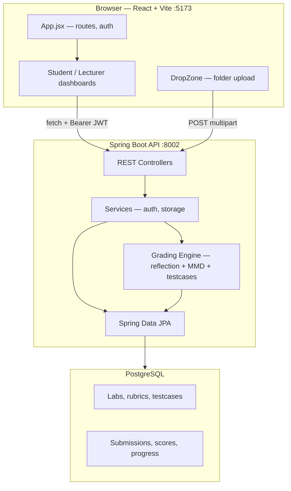

# OOP AutoGrader

**EIU Capstone Project** — a full-stack web application that automates grading of Object-Oriented Programming lab assignments at Eastern International University (EIU).

Students upload folders of Java source (`.java`) and Mermaid class diagrams (`.mmd`). The backend compiles Java at runtime and grades submissions against a lecturer-defined rubric stored in PostgreSQL using **Java reflection**, **MMD parsing**, and **operational testcase invocation**.

**Live:** [oop-autograder.vercel.app](https://oop-autograder.vercel.app)

---

## What it does

### For students

- Sign in with Google (`@eiu.edu.vn`) or student code (IRN) + password
- Select a lab, drag-and-drop a submission folder, and receive instant feedback
- View per-challenge scores with **Class**, **MMD**, and **Testcase** result tabs
- Track submission history and attempt counts

### For lecturers

- Create and edit lab rubrics — challenges, classes, fields, methods, constructors, relations, and operational testcases
- Monitor class performance, grade matrices, and at-risk students
- Manage user accounts (CRUD, bulk import)
- View analytics dashboards and export rosters

---

## How grading works

Each **challenge** is scored across up to **three equal pillars**. Challenge score = arithmetic mean of applicable pillar percentages. Lab score = mean across all challenges (missing challenges count as 0%).

| Pillar | What it checks | Technique |
|--------|----------------|-----------|
| **Class (Declaration)** | Fields, methods, constructors, visibility, types | Java reflection on compiled `.class` files |
| **MMD (Diagram)** | Classes and relations in UML | Parse Mermaid `.mmd`, compare to rubric |
| **Operational Testcase** | Runtime behavior | Invoke student code via reflection; assert return values, stdout, field state, exceptions |


### Submission folder structure

```text
my-submission/
├── challenge_1/
│   ├── Person.java
│   ├── Student.java
│   └── diagram.mmd
├── challenge_2/
│   └── ...
```

Only `.java` and `.mmd` files are accepted. Folder paths are preserved via `webkitRelativePath` so the backend maps files to the correct challenge.

---

## Architecture



| Layer | Technology | Port / Host |
|-------|------------|-------------|
| **Frontend** | React 18, Vite 7, Tailwind CSS, React Router | `:5173` (dev) · Vercel (prod) |
| **Backend** | Java 17, Spring Boot 3.2, Spring Security, JPA | `:8002` (dev) · Render Docker (prod) |
| **Database** | PostgreSQL | Local or Neon (prod) |

The frontend calls the backend directly with `fetch` (no Vite proxy). CORS is configured for `/api/**`. JWT sessions are stored in `sessionStorage`.

---

## Tech stack

**Frontend:** React 18 · Vite 7 · Tailwind CSS · `@react-oauth/google` · `lucide-react`

**Backend:** Java 17 · Spring Boot 3.2 · Spring Web / Security / Data JPA · JWT · Springdoc OpenAPI

**Requires JDK 17+** (not JRE) — the backend compiles student Java at runtime via `javax.tools.JavaCompiler`.

---

## Project structure

```text
OOP-AutoGrader/
├── package.json              # Root scripts (npm start runs both tiers)
├── frontend/                 # React + Vite SPA
│   ├── src/
│   │   ├── App.jsx           # Auth state, role-guarded routes
│   │   ├── pages/            # StudentDashboard, LecturerDashboard, Login, …
│   │   ├── components/       # DropZone, dashboards, shared UI
│   │   └── theme/            # Design tokens (tokens.js, brand.js)
│   └── .env.example
└── backend/                  # Spring Boot API
    ├── src/main/java/com/eiu/capstone/backend/
    │   ├── controller/       # REST endpoints
    │   ├── service/          # Auth, submission storage, compilation
    │   ├── grading/          # Three-pillar grading engine
    │   ├── model/            # JPA entities
    │   └── repository/       # Data access
    ├── .env.backend.example
    └── pom.xml
```

---

## Quick start

### Prerequisites

- Node.js 18+ and npm
- **Java JDK 17+** and Apache Maven
- PostgreSQL (local or cloud)
- Google OAuth client ID

### 1. Clone and install

```bash
git clone https://github.com/Project-G5741/OOP-AutoGrader.git
cd OOP-AutoGrader
npm install
```

### 2. Configure environment

**Backend** — copy `backend/.env.backend.example` → `backend/.env`:

```env
SPRING_DATASOURCE_URL=jdbc:postgresql://localhost:5432/oop_autograder
DB_USERNAME=postgres
DB_PASSWORD=<your-password>
GOOGLE_CLIENT_ID=<your-google-client-id>
FRONTEND_URL=http://localhost:5173
SUBMISSION_BASE_DIR=submissions
```

**Frontend** — copy `frontend/.env.example` → `frontend/.env`:

```env
VITE_GOOGLE_CLIENT_ID=<your-google-client-id>
VITE_API_URL=http://localhost:8002
```

Create the PostgreSQL database `oop_autograder`. Schema is managed externally — SQL scripts live in `docs/sql/`.

### 3. Run

```bash
npm start
```

| Service | URL |
|---------|-----|
| Frontend | http://localhost:5173 |
| Backend API | http://localhost:8002 |
| Swagger UI | http://localhost:8002/swagger-ui/index.html |

Or run separately: `npm run frontend` / `npm run backend`.

---

## API overview

| Controller | Base path | Purpose |
|------------|-----------|---------|
| `AuthController` | `/api/auth` | Login, Google OAuth, password reset |
| `SubmissionController` | `/api/submissions` | Upload + grade, student history |
| `LabController` | `/api/labs` | Lab list, stats, lecturer submissions |
| `LecturerRubricController` | `/api/lecturer/labs` | Rubric CRUD, testcase save, dry-run |
| `LecturerAnalyticsController` | `/api/lecturer` | Overview, grade matrix |
| `AnalyticsController` | `/api/analytics` | Dashboard, student reports |
| `UserController` | `/api/users` | User CRUD (lecturer JWT required) |

### Critical path — student upload

```
POST /api/submissions/{labId}/{attemptNumber}/upload
  → Load rubric snapshot (LabRubricCache)
  → SubmissionStorageService — parallel compile per challenge
  → GradingService — ClassReflectionGrader + MmdPillarGrader + TestcaseGrader
  → Persist results to PostgreSQL
  → Return lab_result JSON bundle for immediate UI rendering
  → Delete temp upload folder
```

---

## Authentication

| Method | Flow |
|--------|------|
| **Google OAuth** | Frontend sends Google ID token → backend validates `@eiu.edu.vn` domain → returns JWT |
| **IRN + Password** | Student or teacher code + password login |
| **Forgot password** | Email reset link (SMTP locally, Brevo API on Render) |

JWT claims include `email`, `name`, `roles`, and `irn`. Tokens are stored in `sessionStorage` (`accessToken`, `user`).

---

## Deployment

| Tier | Platform | Notes |
|------|----------|-------|
| Frontend | **Vercel** | Static build from `frontend/dist` |
| Backend | **Render** (Docker) | Multi-stage Dockerfile; requires JDK |
| Database | **Neon PostgreSQL** | Use pooler hostname for JVM |

---

## Documentation

| Document | Description |
|----------|-------------|
| [docs/PROGRAM_REPORT.md](docs/PROGRAM_REPORT.md) | Full program overview — users, features, setup |
| [docs/HOW_IT_RUNS.md](docs/HOW_IT_RUNS.md) | Runtime architecture and end-to-end flows |
| [docs/GRADING_WORKFLOWS.md](docs/GRADING_WORKFLOWS.md) | Grading pipeline detail |
| [docs/explainers/oop-autograder-system-walkthrough.html](docs/explainers/oop-autograder-system-walkthrough.html) | Visual system walkthrough |
| [CONCEPTS.md](CONCEPTS.md) | Domain vocabulary (grading pillars, entities) |

---

## License

ISC
