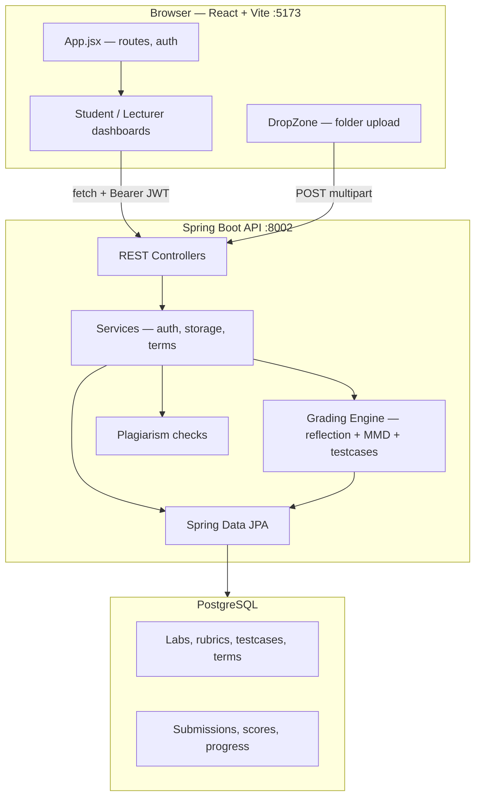

# OOP AutoGrader

**EIU Capstone Project** — a full-stack web application that automates grading of Object-Oriented Programming lab assignments at Eastern International University (EIU).

Students upload folders of Java source (`.java`) and Mermaid class diagrams (`.mmd`). The backend compiles Java at runtime and grades submissions against a lecturer-defined rubric stored in PostgreSQL using **Java reflection**, **MMD parsing**, and **operational testcase invocation**.

**Live:** [oop-autograder.vercel.app](https://oop-autograder.vercel.app)

---

## What it does

### For students

- Sign in with Google (`@eiu.edu.vn`) or student code (IRN) + password
- First-time Google users complete a one-time setup to link IRN and password
- Select a lab, drag-and-drop a submission folder, and receive instant feedback
- View per-challenge scores with **Class**, **MMD**, and **Testcase** result tabs
- Track submission history and attempt counts (dashboard shows the **latest attempt**, not highest score)
- Students not enrolled in the current term can view history but cannot submit new work

### For lecturers

- Create and edit lab rubrics — challenges, classes, fields, methods, constructors, relations, and operational testcases
- Set per-lab deadlines; students see urgency indicators on the lab list
- Manage academic terms — enroll students, import rosters from Excel, set the current term
- Monitor class performance, cross-lab grade matrices, and at-risk students (&lt; 70%)
- Review plagiarism flags (git history, metadata, and file-hash similarity)
- Manage user accounts (CRUD, bulk import, suspend/restore students)
- View analytics dashboards and export rosters

### Dual-role users

Users with both `STUDENT` and `LECTURER` roles land on the lecturer dashboard after login. Student routes remain available at `/student-dashboard` and `/student-history`.

---

## How grading works

Each **challenge** is scored across up to **three pillars** (Class, MMD, Operational Testcase). Pillar weights are configurable per challenge (default 1 each). Challenge score is a weighted mean of applicable pillar percentages. Lab score is the mean across all challenges (missing challenges count as 0%).

| Pillar | What it checks | Technique |
|--------|----------------|-----------|
| **Class (Declaration)** | Fields, methods, constructors, visibility, types, nested/static classes | Java reflection on compiled `.class` files |
| **MMD (Diagram)** | Classes and relations in UML | Parse Mermaid `.mmd`, compare to rubric |
| **Operational Testcase** | Runtime behavior | Invoke student code via reflection; assert return values, stdout, field state, exceptions |


### Submission folder structure

```text
my-submission/
├── challenge_1/
│   ├── Person.java
│   ├── Student.java
│   └── diagram.mmd
├── challenge_2/
│   └── ...
```

Only `.java` and `.mmd` files are accepted. Folder paths are preserved via `webkitRelativePath` so the backend maps files to the correct challenge.

---

## Architecture



| Layer | Technology | Port / Host |
|-------|------------|-------------|
| **Frontend** | React 18, Vite 7, Tailwind CSS, React Router | `:5173` (dev) · Vercel (prod) |
| **Backend** | Java 17, Spring Boot 3.2, Spring Security, JPA | `:8002` (dev) · Render Docker (prod) |
| **Database** | PostgreSQL | Local or Neon (prod) |

The frontend calls the backend directly with `fetch` (no Vite proxy). CORS is configured for `/api/**`. JWT sessions are stored in `sessionStorage`.

---

## Tech stack

**Frontend:** React 18 · Vite 7 · Tailwind CSS · `@react-oauth/google` · `lucide-react` · `jspdf` · `xlsx`

**Backend:** Java 17 · Spring Boot 3.2 · Spring Web / Security / Data JPA · JWT · Springdoc OpenAPI

**Requires JDK 17+** (not JRE) — the backend compiles student Java at runtime via `javax.tools.JavaCompiler`.

---

## Project structure

```text
OOP-AutoGrader/
├── package.json              # Root scripts (npm start runs both tiers)
├── CONCEPTS.md               # Domain vocabulary
├── docs/
│   ├── PROGRAM_REPORT.md     # Full program overview
│   ├── HOW_IT_RUNS.md        # Runtime architecture and flows
│   ├── GRADING_WORKFLOWS.md  # Grading pipeline reference
│   ├── sql/                  # Operator-run schema scripts
│   └── solutions/            # Documented fixes and patterns
├── frontend/                 # React + Vite SPA
│   ├── src/
│   │   ├── App.jsx           # Auth state, role-guarded routes
│   │   ├── pages/            # Dashboards, login, term management
│   │   ├── components/       # DropZone, dashboards, shared UI
│   │   └── theme/            # Design tokens (tokens.js, brand.js)
│   ├── DEPLOY_VERCEL.md
│   └── .env.example
└── backend/                  # Spring Boot API
    ├── src/main/java/com/eiu/capstone/backend/
    │   ├── controller/       # REST endpoints
    │   ├── service/          # Auth, submission storage, compilation
    │   ├── grading/          # Three-pillar grading engine
    │   ├── plagiarism/       # Git / metadata / file-hash checks
    │   ├── model/            # JPA entities
    │   └── repository/       # Data access
    ├── DEPLOY_RENDER.md
    ├── Dockerfile
    ├── .env.backend.example
    └── pom.xml
```

---

## Quick start

### Prerequisites

| Requirement | Notes |
|-------------|-------|
| Node.js 18+ and npm | Root `npm install` installs frontend and backend deps |
| **Java JDK 17+** and Apache Maven | JDK required — backend compiles student code at runtime |
| PostgreSQL | Local instance or Neon cloud |
| Google OAuth client ID | Restricted to `@eiu.edu.vn` in production |

### 1. Clone and install

```bash
git clone https://github.com/Project-G5741/OOP-AutoGrader.git
cd OOP-AutoGrader
npm install
```

### 2. Configure environment

**Backend** — copy `backend/.env.backend.example` → `backend/.env`:

```env
SPRING_DATASOURCE_URL=jdbc:postgresql://localhost:5432/oop_autograder
DB_USERNAME=postgres
DB_PASSWORD=<your-password>
GOOGLE_CLIENT_ID=<your-google-client-id>
FRONTEND_URL=http://localhost:5173
SUBMISSION_BASE_DIR=submissions

# Password reset (local dev)
MAIL_PROVIDER=smtp
MAIL_HOST=smtp.gmail.com
MAIL_PORT=587
MAIL_USERNAME=<email>
MAIL_PASSWORD=<app-password>
MAIL_FROM=<email>
```

**Frontend** — copy `frontend/.env.example` → `frontend/.env`:

```env
VITE_GOOGLE_CLIENT_ID=<your-google-client-id>
VITE_API_URL=http://localhost:8002
```

Create the PostgreSQL database `oop_autograder`. Schema is managed externally — apply scripts from `docs/sql/` as needed.

### 3. Run

```bash
npm start
```

| Service | URL |
|---------|-----|
| Frontend | http://localhost:5173 |
| Backend API | http://localhost:8002 |
| Health check | http://localhost:8002/ |
| Swagger UI | http://localhost:8002/swagger-ui/index.html |

Or run separately: `npm run frontend` / `npm run backend` (or `mvn spring-boot:run` from `backend/`).

### 4. Verify

| Check | Command / action |
|-------|------------------|
| Backend tests | `cd backend && mvn test` |
| Frontend build | `cd frontend && npm run build` |
| Manual upload | Log in as student → drag `challenge_1/*.java` folder → confirm scores appear |

---

## Application routes

### Student

| Path | Screen |
|------|--------|
| `/` | Login, forgot password |
| `/student-dashboard` | Lab selection, upload, live results |
| `/student-history` | Past submissions and per-lab stats |

### Lecturer

| Path | Screen |
|------|--------|
| `/lecturer-dashboard` | Grading overview, challenge tabs, submission table |
| `/lecturer-grading` | Cross-lab grade matrix |
| `/lecturer-users` | User management |
| `/lecturer-solution` | Lab / rubric structure editor |
| `/lecturer-report` | Analytics reports |
| `/lecturer-terms` | Term enrollment and roster management |

---

## API overview

| Controller | Base path | Purpose |
|------------|-----------|---------|
| `RootController` | `/` | Liveness probe (`GET /` → `ok`) |
| `AuthController` | `/api/auth` | Login, Google OAuth, password reset |
| `SubmissionController` | `/api/submissions` | Upload + grade, student history (JWT) |
| `LabController` | `/api/labs` | Lab list, stats, lecturer submissions, export |
| `LecturerRubricController` | `/api/lecturer/labs` | Rubric CRUD, testcase save, dry-run, deadlines |
| `LecturerTermController` | `/api/lecturer/terms` | Terms, enrollment, Excel import, roster |
| `LecturerAnalyticsController` | `/api/lecturer` | Overview, grade matrix, plagiarism flags |
| `StudentAccessController` | `/api/students` | Current-term enrollment check |
| `AnalyticsController` | `/api/analytics` | Dashboard, student reports |
| `UserController` | `/api/users` | User CRUD, suspend/restore (lecturer JWT) |
| `TermController` | `/api/terms` | Academic term list |
| `MasterDataController` | `/api/master-data` | Scope / type / relation lookups |

### Critical path — student upload

```
POST /api/submissions/{labId}/{attemptNumber}/upload
  → Load rubric snapshot (cached, TTL 30 min)
  → SubmissionStorageService — parallel in-memory compile per challenge
  → GradingService — ClassReflectionGrader + MmdPillarGrader + TestcaseGrader
  → Plagiarism checks (git, metadata, file-hash Jaccard)
  → Persist results to PostgreSQL
  → Return lab_result JSON bundle for immediate UI rendering
  → Delete temp upload folder
```

---

## Authentication

| Method | Flow |
|--------|------|
| **Google OAuth** | Frontend sends Google ID token → backend validates `@eiu.edu.vn` domain → returns JWT |
| **IRN + Password** | Student or teacher code + password login |
| **First-time Google user** | Redirected to setup screen to set IRN and password |
| **Forgot password** | Email reset link (SMTP locally, Brevo API on Render) |

JWT claims include `email`, `name`, `roles`, and `irn`. Tokens are stored in `sessionStorage` (`accessToken`, `user`). Note: `JwtService` regenerates its signing key on backend restart — sessions invalidate on restart.

---

## Deployment

| Tier | Platform | Notes |
|------|----------|-------|
| Frontend | **Vercel** | Static build from `frontend/dist`; see [frontend/DEPLOY_VERCEL.md](frontend/DEPLOY_VERCEL.md) |
| Backend | **Render** (Docker) | Multi-stage Dockerfile; requires JDK; see [backend/DEPLOY_RENDER.md](backend/DEPLOY_RENDER.md) |
| Database | **Neon PostgreSQL** | Use `-pooler` hostname for production JVM |

Production env: set `VITE_API_URL` and `VITE_GOOGLE_CLIENT_ID` at frontend build time; set `MAIL_PROVIDER=brevo` on Render (SMTP ports blocked on free tier).

---

## Documentation

| Document | Description |
|----------|-------------|
| [docs/PROGRAM_REPORT.md](docs/PROGRAM_REPORT.md) | Full program overview — users, features, setup |
| [docs/OBJECTIVES.md](docs/OBJECTIVES.md) | Project objectives |
| [docs/HOW_IT_RUNS.md](docs/HOW_IT_RUNS.md) | Runtime architecture and end-to-end flows |
| [docs/GRADING_WORKFLOWS.md](docs/GRADING_WORKFLOWS.md) | Grading pipeline detail |
| [docs/solutions/](docs/solutions/) | Documented fixes and patterns (search before debugging) |
| [CONCEPTS.md](CONCEPTS.md) | Domain vocabulary (grading pillars, entities) |
| [backend/AGENTS.md](backend/AGENTS.md) | Backend API and submission pipeline contracts |
| [frontend/AGENTS.md](frontend/AGENTS.md) | Frontend routes, auth, and API integration |

---

## License

ISC
