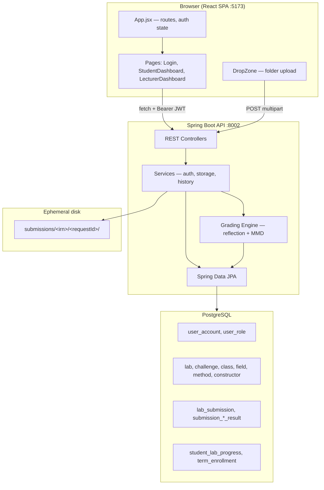
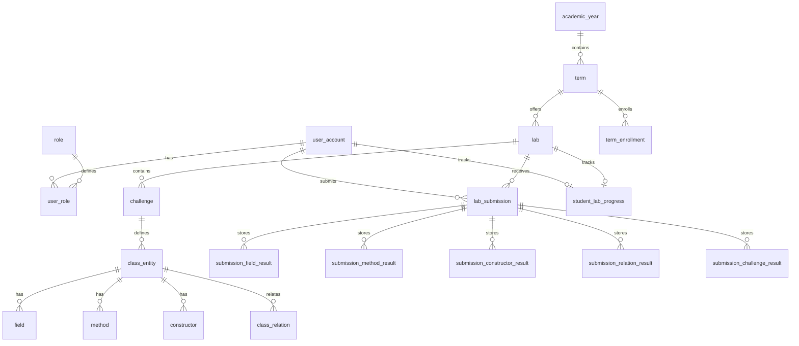

# OOP AutoGrader — System Runtime Report

This document explains how the OOP AutoGrader application runs end to end: how you start it, how the frontend, backend, and database interact, and what happens during the main user flows (login, upload, grading, and lecturer analytics).

---

## 1. What This System Does

The OOP AutoGrader is a full-stack web application for **EIU Capstone** OOP courses. Students upload folders containing:

- **Java source files** (`.java`) — compiled and graded via reflection against a rubric stored in PostgreSQL
- **Mermaid class diagrams** (`.mmd`) — parsed and compared against the same rubric

Lecturers manage users, view lab statistics, grade overviews, and analytics dashboards. Authentication uses **Google OAuth** (restricted to `@eiu.edu.vn`) or **IRN + password**, with **JWT** sessions stored in the browser.

---

## 2. How to Start the Application

### 2.1 Root orchestration

From the repository root:

```bash
npm start
```

This runs **two processes concurrently** via `concurrently`:

| Process | Command | Port |
|---------|---------|------|
| Backend | `cd backend && mvn spring-boot:run` | **8002** |
| Frontend | `cd frontend && npm run dev` | **5173** |

You can also run them separately:

- `npm run backend` — Spring Boot API only
- `npm run frontend` — Vite dev server only

### 2.2 Prerequisites

| Tier | Requirement |
|------|-------------|
| **Frontend** | Node.js, `frontend/.env` (copy from `.env.example`) |
| **Backend** | **JDK 17+** (not JRE — needed for `javax.tools.JavaCompiler`), Maven, `backend/.env` |
| **Database** | PostgreSQL (e.g. Neon cloud); connection via `SPRING_DATASOURCE_URL`, `DB_USERNAME`, `DB_PASSWORD` |

### 2.3 Environment variables

**Frontend** (`frontend/.env`):

- `VITE_GOOGLE_CLIENT_ID` — Google OAuth client ID
- `VITE_API_URL` — backend URL (default `http://localhost:8002`)

**Backend** (`backend/.env`, loaded by `application.yml`):

- Database: `SPRING_DATASOURCE_URL`, `DB_USERNAME`, `DB_PASSWORD`
- Auth: `GOOGLE_CLIENT_ID`, `JWT_SECRET` (required, ≥32 bytes; `JwtService` derives the HS256 signing key at startup so tokens survive restarts)
- CORS: `FRONTEND_URL` (default includes `http://localhost:5173`)
- Storage: `SUBMISSION_BASE_DIR` (default `submissions/`)
- Mail: SMTP settings for password reset emails

---

## 3. High-Level Architecture



**Communication model:**

- No Vite proxy — the frontend calls the backend directly with `fetch`.
- CORS is configured in `CorsConfig` for `/api/**` (localhost + production Vercel origin).
- Spring Security is **default-deny**: public auth + health + local swagger; everything else needs a JWT with the matching role. Anonymous is 401; wrong role is 403.

---

## 4. Frontend — How It Runs

### 4.1 Bootstrap

1. `index.html` loads `main.jsx`.
2. `main.jsx` mounts React with:
   - `BrowserRouter` (React Router)
   - `ThemeProvider` (dark/light via `dark` class on `<html>`)
   - `App.jsx`

### 4.2 Application shell (`App.jsx`)

- **Auth state** lives in React `useState`, hydrated from `sessionStorage`:
  - `accessToken` — JWT from backend
  - `user` — JSON with `id`, `email`, `roles`, `irn`, etc.
- **Google OAuth** via `@react-oauth/google` (`GoogleOAuthProvider`).
- **Routing** with role guards (`RequireRole`):

| Path | Role | Screen |
|------|------|--------|
| `/` | — | Login |
| `/student-dashboard` | STUDENT | Upload + grades |
| `/student-history` | STUDENT | Submission history |
| `/lecturer-dashboard` | LECTURER | Grading overview |
| `/lecturer-grading` | LECTURER | Cross-lab grade matrix |
| `/lecturer-users` | LECTURER | User CRUD |
| `/lecturer-report` | LECTURER | Analytics reports |

Dual-role users default to the **lecturer** dashboard after login; student routes remain available by URL.

### 4.3 API integration pattern

Every page/component repeats:

```javascript
const API_BASE = import.meta.env.VITE_API_URL || 'http://localhost:8002';
const res = await fetch(`${API_BASE}/api/...`, {
  headers: { Authorization: `Bearer ${sessionStorage.getItem('accessToken')}` }
});
```

There is no shared HTTP client or interceptors.

### 4.4 Student dashboard flow

1. On load, `StudentDashboard.jsx` calls `GET /api/labs` to populate the lab dropdown.
2. When a lab is selected:
   - `GET /api/labs/{labId}/stats?studentId=` — current grade, attempt count, latest submission time (from **latest DB attempt**)
   - `GET /api/labs/{labId}/challenges` — challenge list (scores empty until upload in current session)
3. **Upload** via `DropZone.jsx`:
   - Student drops a folder like `12345_StudentName_lab_1/challenge_1/*.java` and `*.mmd`
   - Client validates folder structure, builds `FormData` with relative paths
   - `POST /api/submissions/{labId}/{attemptNumber}/upload` with `Authorization: Bearer <token>`
4. On upload success, the dashboard refreshes stats, challenge scores, and class/MMD detail for the session (in-memory cache per challenge).

### 4.5 Lecturer dashboard flow

`LecturerDashboard.jsx` switches sections via `activeNav`:

- **dashboard** — `GET /api/lecturer/overview`, lab statistics, paginated submissions
- **grading** — `GET /api/lecturer/grade-overview`
- **users** — `UserManagement.jsx` → `/api/users/*`
- **reports** — `Reports.jsx` → `GET /api/analytics/dashboard`

### 4.6 Login flow

`LoginUI.jsx` supports:

1. **IRN + password** → `POST /api/auth/login` → JWT + user payload
2. **Google** → `POST /api/auth/google` (existing user) or first-time `POST /api/auth/google/upsert`
3. **Forgot password** → email with reset link → `ResetPasswordUI` → `POST /api/auth/reset-password`

On success, `handleLoginSuccess` in `App.jsx` stores token/user in `sessionStorage` and navigates to the role-appropriate dashboard.

---

## 5. Backend — How It Runs

### 5.1 Startup

1. `EiuCapstoneBackendApplication` starts Spring Boot 3.2 on port **8002** (or `PORT` env).
2. `application.yml` imports `backend/.env`; `application.properties` configures PostgreSQL (HikariCP pool) and JPA (no Flyway — schema is managed externally).
3. Beans wire up: controllers, services, grading engine, caches, `JavaCompilerService`, JWT, CORS.
4. On startup, `TermEnrollmentSyncService` backfills `term_enrollment` from existing `student_lab_progress` (idempotent).

### 5.2 Layer structure

```
Controller (thin) → Service / GradingService → Repository (JPA) → PostgreSQL
```

| Controller | Base path | Purpose |
|------------|-----------|---------|
| `RootController` | `/` | Liveness probe |
| `AuthController` | `/api/auth` | Login, Google, password reset |
| `LabController` | `/api/labs` | Labs, stats, lecturer submissions |
| `SubmissionController` | `/api/submissions` | Upload, grade, student history |
| `UserController` | `/api/users` | User CRUD (lecturer JWT) |
| `LecturerAnalyticsController` | `/api/lecturer` | Overview, grade matrix |
| `AnalyticsController` | `/api/analytics` | Dashboard, student reports |
| `PresenceController` | `/api/presence` | Public GET count; JWT heartbeat; JWT DELETE leave |

Swagger UI: `http://localhost:8002/swagger-ui/index.html`

### 5.3 Security model

- `SecurityConfig`: CSRF off, matcher table authorizes by path + method (default-deny).
- Public: `GET /`, `GET /api/presence`, `/api/auth/**` (and swagger when enabled).
- **JWT** created by `JwtService` from `JWT_SECRET` (required, ≥32 bytes). Tokens stay valid across restarts while the secret is unchanged.
- Claims: `email`, `name`, `domain`, `roles`, `irn`.
- `SubmissionController` is student-role (`hasRole(STUDENT)`); lecturers cannot submit.
- Lecturer routes use `hasRole(LECTURER)`. `JwtAuthHelper` is identity only (active user / student scope), not authorization.
- Google tokens verified via `GoogleTokenVerifier` (`@eiu.edu.vn` only).

### 5.4 Core submission pipeline (most important flow)

When `POST /api/submissions/{labId}/{attemptNumber}/upload` is called:

```
1. JWT email → `requireUploadAccess` (one query, cached 30s on success; warmed by `GET /api/labs`)
2. LabRubricCache.get(lab) starts in parallel with compile → immutable rubric snapshot (cached 30 min)
3. SubmissionStorageService.processUpload(irn, requestId, files)
4. Assign lab_submission.id in memory (path attempt unused)
5. GradingService.gradeSubmission(...) compute + lab_result assemble
6. UploadPersistService: one JDBC statement inserts submission (`MAX+1`, final score), challenge UPSERT, progress; detail UPSERT after that statement
7. Save compile errors, package-normalization notices, MMD metadata (`persistExecutor`)
8. PlagiarismService.inspectUpload (request thread after persist; failures swallowed)
9. Invalidate analytics caches
10. Return challenge scores + lab_result bundle
11. finally: delete temp submission folder on disk (`persistExecutor`)
```

#### Step 4 — File handling (`SubmissionStorageService`)

- Expects multipart filenames with paths like:  
  `12345_Name/challenge_1/Foo.java`
- Groups files by challenge folder (`challenge_1`, `challenge-2`, etc.)
- For each challenge **in parallel** on `compileExecutor` (default 4, capped at CPU count):
  - Normalize sources in memory (`StudentSourceNormalizer`; no `_sources_tmp/`)
  - `JavaCompilerService.compileSources()` → `.class` output to `classes/`
  - Mixed javac keeps survivors and records per-class diagnostics; I/O/setup still marks the challenge failed
- `.mmd` files stay in memory (`mmdByChallenge`); `root/.git/**` is kept for plagiarism and skipped by compile
- Temp root: `submissions/<sanitized_irn>/<uuid-requestId>/`

#### Step 6 — Grading (`GradingService`)

For each challenge folder, **in parallel** on `gradingExecutor`:

1. **Class pillar**: `ReflectionClassParser` loads `.class` files via `URLClassLoader`; `ClassReflectionGrader` scores shells (binary, including Extends/Implements) and members (all-or-nothing: every graded attribute must match).
2. **MMD pillar** (if `has_mmd`): `MmdParser` + `MmdComparisonService` on `pillarExecutor`.
3. **Testcase pillar** (if the challenge has operational testcases): `TestcaseGrader` on `pillarExecutor`; student invokes run in one isolated worker JVM per upload (5s timeout each; host slot of 1).
4. **Scoring**: weighted mean of applicable pillars (`class_weight` / `mmd_weight` / `testcase_weight`); lab score is the weighted mean of challenge scores (`challenge.weight`). Missing challenges count as 0%.
5. **Persist**: challenge scores + parsed snapshot on the request thread; member/testcase rows UPSERT on `persistExecutor`. `LabResultAssembler` builds `lab_result` from the in-memory rubric snapshot.

After grading, plagiarism inspect runs, then the temp folder is deleted in `finally`. Durable state is PostgreSQL plus JSON sidecars under `SUBMISSION_BASE_DIR` (`_compile_errors`, `_package_normalization`, `_mmd_meta`, `_parsed_snapshot`).

Wall-clock ranking and complexity: [GRADING_WORKFLOWS.md §14](./GRADING_WORKFLOWS.md#14-wall-clock-cost-and-time-complexity).

### 5.5 Read paths (after grading)

| Endpoint | Data source |
|----------|-------------|
| `GET /api/labs/{id}/challenges` | Latest attempt per student; scores from `submission_challenge_result` |
| `GET /api/labs/{id}/challenges/{id}/class` | Element-level results + compile errors |
| `GET /api/submissions/my-history` | `StudentHistoryService` — submission list + stats |
| `GET /api/lecturer/overview` | Aggregated metrics (cached 90s) |
| `GET /api/labs/{id}/statistics` | Lab analytics (cached 120s; invalidated on upload) |

Student-facing grades always use the **latest attempt** for that lab (`ORDER BY attempt_number DESC`), not `best_submission_id` from progress.

---

## 6. Database — Schema and Role

PostgreSQL is the **single source of truth** for users, rubrics, submissions, and results. Schema is **not** auto-migrated by the app — operators run SQL scripts from `docs/sql/` manually.

### 6.1 Entity relationship (conceptual)



### 6.2 Key tables

| Table | Purpose |
|-------|---------|
| `user_account` | Students/lecturers: email, password hash, student_code, teacher_code, `is_active` |
| `user_role` / `role` | Many-to-many roles: `STUDENT`, `LECTURER` |
| `lab` | Lab name, linked to `term` |
| `challenge` | Numbered challenges per lab (`challenge_number` unique per lab) |
| `class_entity`, `field`, `method`, `constructor` | **Rubric** — expected OOP structure |
| `class_relation` | Expected UML relations (graded from MMD) |
| `master_data` | Scope/type labels for rubric attributes |
| `lab_submission` | One row per (user, lab, attempt_number); stores `score`, `submitted_at` |
| `submission_*_result` | Per-element pass/fail tied to rubric element IDs |
| `student_lab_progress` | Per-student-per-lab: attempt count, highest score, best submission ID |
| `term_enrollment` | Which students are enrolled in a term (roster denominator for lecturers) |
| `password_reset_token` | Hashed tokens for forgot-password flow |

### 6.3 JPA configuration

- Connection pool: HikariCP (max 10 connections)
- `spring.jpa.open-in-view=false` — no lazy-loading outside transactions
- Batch inserts/updates enabled for performance
- UUID primary keys on most entities

### 6.4 What is NOT in the database

- Compiled `.class` files (deleted after grading)
- Uploaded `.java` sources (deleted after compile)
- `.mmd` file contents on disk (parsed in memory; archival hook is no-op by default)
- JWT signing keys (`JWT_SECRET` in env)
- Analytics cache entries (in-process TTL caches)

---

## 7. End-to-End Flow Examples

### 7.1 Student login and upload

```
1. User opens http://localhost:5173
2. LoginUI → POST /api/auth/google or /api/auth/login
3. Backend verifies credentials → returns JWT
4. Frontend stores token → navigates to /student-dashboard
5. GET /api/labs → student picks "Lab 1"
6. GET /api/labs/{id}/stats → shows prior grade if any
7. Student drops folder → DropZone POST /api/submissions/{labId}/1/upload
8. Backend: access check → compile → class/MMD/testcase pillars → one persist SQL → plagiarism inspect (unless disabled) → return scores + `lab_result`
9. Frontend updates challenge sidebar, class tab, stats cards
10. Data persists in PostgreSQL; temp files deleted
```

### 7.2 Lecturer views class performance

```
1. Lecturer logs in → /lecturer-dashboard
2. GET /api/lecturer/overview → summary cards (at-risk count, recent submissions)
3. Selects lab → GET /api/labs/{id}/statistics
4. GET /api/labs/{id}/submissions?page=0 → paginated roster from term_enrollment
5. Clicks student → GET /api/labs/{id}/students/{id}/attempts
6. Opens challenge drawer → GET /api/labs/{id}/challenges/{id}/class?studentId=
```

### 7.3 Re-upload

- Unique key: `(user_id, lab_id, attempt_number)` on `lab_submission`
- Each upload **inserts a new attempt** (`MAX(attempt_number)+1`). The URL `{attemptNumber}` is not used to overwrite a prior row
- `attemptsCount` / upload `totalSubmissions` is the assigned attempt number (equal to `COUNT` after a successful `MAX+1` insert)
- Element results UPSERT by (submission, rubric element) natural keys for that new submission

---

## 8. Caching and Performance

| Cache | TTL | Invalidation |
|-------|-----|--------------|
| `LabRubricCache` | 30 min | Manual (`RubricCacheInvalidationSupport`) or TTL |
| `MasterDataCache` | 60 min | TTL |
| `LecturerOverviewCache` | 90 sec | On upload |
| `LabStatisticsCache` | 120 sec | On upload for that lab |
| `AnalyticsDashboardCache` | 180 sec | TTL |

Compile uses `compileExecutor` (`app.compile.parallelism=4`, CPU-capped). Grading uses `gradingExecutor` (`app.grading.parallelism=4`, CPU-capped). MMD + testcase pillars use `pillarExecutor`. Student-code invokes run in one isolated worker JVM per request (host slot of 1). See [GRADING_WORKFLOWS.md §14](./GRADING_WORKFLOWS.md#14-wall-clock-cost-and-time-complexity) for which stages dominate upload latency.

---

## 9. Deployment Topology (Production)

| Tier | Platform | Notes |
|------|----------|-------|
| Frontend | **Vercel** | Static build from `frontend/dist`; `VITE_API_URL` points to Render backend |
| Backend | **Render** (Docker) | Multi-stage `Dockerfile`; API `JAVA_OPTS` default `-Xmx256m`; needs JDK |
| Database | **Neon PostgreSQL** | Use pooler hostname (`-pooler`) for JVM |

CORS allows `https://oop-autograder.vercel.app`. Password-reset emails pick the request `Origin` when it matches an allowed frontend.

---

## 10. Summary

| Layer | Technology | Runs on | Persists |
|-------|------------|---------|----------|
| **Frontend** | React 18 + Vite 7 + Tailwind | Browser `:5173` | `sessionStorage` (JWT, user) |
| **Backend** | Spring Boot 3.2 + Java 17 | JVM `:8002` | PostgreSQL + temp `submissions/` |
| **Database** | PostgreSQL (Neon) | Cloud | All users, rubrics, grades, progress |

The **critical path** is: **browser upload → Spring controller → one-query access check → in-memory compile → reflection + MMD + operational testcases → one persist SQL → plagiarism inspect (when enabled) → JSON response → React UI update**. Detail UPSERT continues off-thread. Durable state lives in PostgreSQL; disk during upload is ephemeral.
