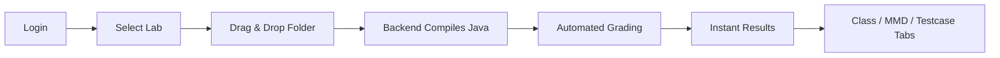

# OOP AutoGrader — Program Report

This document describes what the OOP AutoGrader is, who it serves, what it does, and how to run it. For deeper runtime and grading detail, see [HOW_IT_RUNS.md](./HOW_IT_RUNS.md) and [GRADING_WORKFLOWS.md](./GRADING_WORKFLOWS.md).

---

## 1. Executive Summary

**OOP AutoGrader** is a full-stack web application built as the **EIU Capstone Project** for Eastern International University (EIU). It automates grading of Object-Oriented Programming (OOP) lab assignments by letting students upload Java source code and Mermaid class diagrams (`.mmd`), then compiling and evaluating their work against a lecturer-defined rubric stored in PostgreSQL.

The system replaces manual inspection of class structure, UML diagrams, and behavioral test cases with an automated pipeline that uses **Java reflection**, **MMD parsing**, and **operational testcase invocation**.

---

## 2. What Is the Program?

| Aspect | Detail |
|--------|--------|
| **Name** | OOP AutoGrader (EIU Capstone) |
| **Type** | Full-stack web application |
| **Repository** | `OOP-AutoGrader` on GitHub |
| **Architecture** | React SPA (frontend) + Spring Boot REST API (backend) + PostgreSQL (database) |
| **Domain** | Academic lab grading for OOP courses |
| **Production URLs** | Frontend: `https://oop-autograder.vercel.app` · Backend: deployed on Render (Docker) |

### Technology Stack

**Frontend**

- React 18, Vite 7, React Router DOM
- Tailwind CSS (dark mode supported)
- `@react-oauth/google` for Google sign-in
- `lucide-react` for icons

**Backend**

- Java 17, Spring Boot 3.2.2
- Spring Web, Security, Data JPA
- PostgreSQL (Neon in production)
- JWT for session tokens
- Springdoc OpenAPI / Swagger UI
- **Requires JDK** (not JRE) — compiles student Java at runtime via `javax.tools.JavaCompiler`

**Orchestration**

- Root `npm start` runs frontend and backend concurrently via `concurrently`

---

## 3. Target Users

The application serves three primary user groups within the EIU ecosystem (`@eiu.edu.vn` domain).

### 3.1 Students (`STUDENT` role)

- Enrolled in OOP lab courses
- Log in with **student code (IRN) + password** or **Google OAuth**
- Select a lab, upload a folder of `.java` and `.mmd` files, and receive instant automated feedback
- View per-challenge scores, class structure results, diagram results, and testcase I/O cards
- Track submission history and attempt counts

### 3.2 Lecturers (`LECTURER` role)

- Course instructors and lab administrators
- Log in with **teacher code + password** or **Google OAuth**
- Create and edit lab rubrics (challenges, classes, fields, methods, constructors, relations, testcases)
- Monitor class-wide grading dashboards, export rosters, identify at-risk students
- Manage user accounts (CRUD, bulk create)
- View analytics and cross-lab grade matrices

### 3.3 Dual-role users

- Users with both `STUDENT` and `LECTURER` roles
- After login, they land on the **lecturer dashboard** by default
- Student routes remain reachable by navigating directly to `/student-dashboard` or `/student-history`

### Access restrictions

- Google OAuth is restricted to verified `@eiu.edu.vn` email addresses
- Lecturer-only endpoints (user management, lab structure editing) require a lecturer JWT
- Student upload and history endpoints require a valid JWT

---

## 4. What Does It Do?

### 4.1 Core Workflow (Student Perspective)



1. Student selects a lab and attempt number
2. Student drags a folder containing `challenge_N/` subfolders with `.java` and optionally `.mmd` files
3. Backend compiles Java in parallel, grades against the rubric, persists results
4. Student sees scores, detailed breakdowns, and testcase input/output cards immediately

### 4.2 The Three-Pillar Grading Model

Each **challenge** within a lab is scored across up to **three equal pillars**:

| Pillar | What it checks | How |
|--------|----------------|-----|
| **Class (Declaration)** | Fields, methods, constructors, visibility, types | Java reflection on compiled `.class` files |
| **MMD (Diagram)** | Classes and relations in UML | Parse Mermaid `.mmd`, compare to rubric |
| **Operational Testcase** | Runtime behavior | Invoke student code via reflection; assert return values, stdout, field state, exceptions |

- **Challenge score** = arithmetic mean of applicable pillar percentages (1, 2, or 3 pillars)
- **Lab score** = mean across all challenges (missing challenges count as 0%)
- Partial credit applies on declaration checks (e.g., correct name but wrong type)

### 4.3 Submission Pipeline (Backend)

```
Upload (multipart folder)
  → Load rubric snapshot (cached, TTL 30 min)
  → SubmissionStorageService: parallel in-memory compile per challenge
  → GradingService: parallel per-challenge grading
      → ClassReflectionGrader (sync)
      → MmdPillarGrader + TestcaseGrader (parallel)
  → Persist results to PostgreSQL
  → Assemble lab_result bundle for immediate UI rendering
  → Delete temp upload folder
```

**Upload folder structure expected:**

```text
my-submission/
├── challenge_1/
│   ├── Person.java
│   ├── Student.java
│   └── diagram.mmd
├── challenge_2/
│   └── ...
```

Only `.java` and `.mmd` files are accepted. Folder paths are preserved via `webkitRelativePath` so the backend can map files to the correct challenge.

### 4.4 Lecturer Features

| Feature | Description |
|---------|-------------|
| **Grading Dashboard** | Overview cards, per-lab statistics, submission tables, challenge-level student scores |
| **Grade Overview** | Cross-lab matrix of all students × all labs; sortable; at-risk threshold (< 70) |
| **Solution Management** | Visual lab structure editor — define challenges, classes, members, MMD relations, operational testcases |
| **User Management** | Add/edit/deactivate users; assign roles; bulk import |
| **Reports** | Analytics dashboard with trends and filters |
| **Export** | Full roster export for a lab |

### 4.5 Authentication & Account Management

| Method | Flow |
|--------|------|
| **Google OAuth** | Frontend sends Google ID token → backend validates domain → returns JWT |
| **IRN + Password** | Student/teacher code + password login |
| **First-time Google user** | Redirected to setup screen to set IRN and password |
| **Forgot password** | Email reset link (SMTP locally, Brevo API on Render) |

Session state is stored in `sessionStorage` (`accessToken`, `user` JSON with roles).

### 4.6 Data Model (High Level)

```text
Lab
 └── Challenge (numbered)
      ├── ClassEntity → Field / Method / Constructor
      ├── ClassRelation (MMD)
      └── Testcase → Invocation / Assertion

LabSubmission (per student, per attempt)
 └── SubmissionChallengeResult
 └── SubmissionFieldResult / Method / Constructor / Relation
 └── SubmissionTestcaseResult / AssertionResult

StudentLabProgress (highest score, attempt count)
TermEnrollment (roster for lecturer views)
```

### 4.7 Student-Facing Result Views

After upload, students see:

- **Stats cards** — current grade, attempts, last submission time
- **Challenge sidebar** — per-challenge scores
- **Class tab** — each rubric element with pass/fail and student vs expected labels
- **MMD tab** — diagram element results and relation checks
- **Testcase tab** — expandable I/O cards (INPUT / EXPECTED / YOUR OUTPUT)
  - **Example Testcases** — full detail visible
  - **Other Testcases** — pass/fail only (hidden inputs/outputs)

---

## 5. How to Run the Program

### 5.1 Prerequisites

| Requirement | Version / Notes |
|-------------|-----------------|
| Node.js + npm | 18+ |
| Java JDK | 17 (must be JDK, not JRE) |
| Apache Maven | For backend build |
| PostgreSQL | Local or Neon cloud |
| Google OAuth Client ID | For authentication |

### 5.2 Environment Setup

**Backend** — copy `backend/.env.backend.example` → `backend/.env`:

```env
SPRING_DATASOURCE_URL=jdbc:postgresql://localhost:5432/oop_autograder
DB_USERNAME=postgres
DB_PASSWORD=<your-password>
GOOGLE_CLIENT_ID=<your-google-client-id>
JWT_SECRET=<long-random-secret>
FRONTEND_URL=http://localhost:5173
MAIL_PROVIDER=smtp
MAIL_HOST=smtp.gmail.com
MAIL_PORT=587
MAIL_USERNAME=<email>
MAIL_PASSWORD=<app-password>
MAIL_FROM=<email>
SUBMISSION_BASE_DIR=submissions
```

**Frontend** — copy `frontend/.env.example` → `frontend/.env`:

```env
VITE_GOOGLE_CLIENT_ID=<your-google-client-id>
VITE_API_URL=http://localhost:8002
```

**Database** — create PostgreSQL database `oop_autograder` (schema is managed externally; SQL scripts live in `docs/sql/`).

### 5.3 Running Locally

**Option A — Both services together (recommended):**

```bash
# From repository root
npm install
npm start
```

This starts:

- Frontend at **http://localhost:5173**
- Backend at **http://localhost:8002**

**Option B — Separately:**

```bash
# Terminal 1 — Frontend
cd frontend
npm install
npm run dev

# Terminal 2 — Backend
cd backend
mvn spring-boot:run
```

### 5.4 Key URLs (Local Development)

| Service | URL |
|---------|-----|
| Web UI | http://localhost:5173 |
| API base | http://localhost:8002 |
| Health check | http://localhost:8002/ |
| Swagger UI | http://localhost:8002/swagger-ui/index.html |
| OpenAPI JSON | http://localhost:8002/v3/api-docs |

### 5.5 Production Deployment

| Tier | Platform | Notes |
|------|----------|-------|
| **Frontend** | Vercel | `VITE_API_URL` and `VITE_GOOGLE_CLIENT_ID` baked at build time |
| **Backend** | Render (Docker) | Multi-stage `Dockerfile` in `backend/`; Neon pooler URL for DB |
| **Database** | Neon PostgreSQL | Use `-pooler` hostname for production JVM |

Production frontend: **https://oop-autograder.vercel.app**

See `frontend/DEPLOY_VERCEL.md` and `backend/DEPLOY_RENDER.md` for deployment steps.

### 5.6 Verification Checklist

| Check | Command / Action |
|-------|------------------|
| Backend liveness | `GET /` |
| Frontend build | `cd frontend && npm run build` |
| Backend tests | `cd backend && mvn test` |
| Manual upload | Log in as student → drag `challenge_1/*.java` folder → confirm scores appear |
| API exploration | Open Swagger UI |

---

## 6. Application Routes

### Student routes

| Path | Screen |
|------|--------|
| `/` | Login |
| `/student-dashboard` | Lab selection, upload, live results |
| `/student-history` | Past submissions and per-lab stats |

### Lecturer routes

| Path | Screen |
|------|--------|
| `/lecturer-dashboard` | Grading overview, challenge tabs, submission table |
| `/lecturer-grading` | Cross-lab grade matrix |
| `/lecturer-users` | User management |
| `/lecturer-solution` | Lab/rubric structure editor |
| `/lecturer-report` | Analytics reports |

---

## 7. API Overview

| Controller | Base Path | Purpose |
|------------|-----------|---------|
| `AuthController` | `/api/auth` | Login, Google OAuth, password reset |
| `LabController` | `/api/labs` | List labs, statistics, submissions |
| `LecturerRubricController` | `/api/lecturer/labs` | Lab structure CRUD |
| `SubmissionController` | `/api/submissions` | Upload, grade, student history |
| `UserController` | `/api/users` | User CRUD (lecturer only) |
| `AnalyticsController` | `/api/analytics` | Dashboard, student reports |
| `MasterDataController` | `/api/master-data` | Scope/type/relation lookups |
| `TermController` | `/api/terms` | Academic terms |
| `RootController` | `/` | Liveness probe |

---

## 8. Project Structure

```text
OOP-AutoGrader/
├── package.json              # Root scripts (npm start)
├── README.md
├── CONCEPTS.md               # Domain vocabulary
├── docs/
│   ├── PROGRAM_REPORT.md     # This document
│   ├── HOW_IT_RUNS.md        # Runtime and flow detail
│   └── GRADING_WORKFLOWS.md  # Grading pipeline reference
├── frontend/                 # React + Vite SPA
│   ├── src/
│   │   ├── App.jsx           # Routing, auth state
│   │   ├── pages/            # Dashboards, login, user mgmt
│   │   ├── components/       # UI, lecturer, student widgets
│   │   └── context/          # Theme
│   └── vite.config.js        # Port 5173
└── backend/                  # Spring Boot API
    ├── pom.xml
    ├── Dockerfile
    └── src/main/java/com/eiu/capstone/backend/
        ├── controller/       # REST endpoints
        ├── service/          # Business logic, compilation
        ├── grading/          # Reflection, MMD, testcase engine
        ├── model/            # JPA entities
        └── repository/       # Data access
```

---

## 9. Notable Design Decisions

1. **Compile-then-grade** — Student `.java` is compiled in-memory; grading uses `.class` reflection, not source parsing.
2. **Ephemeral upload storage** — Temp folders are deleted after grading; durable state lives in PostgreSQL.
3. **Upload-time result bundle** — `lab_result` JSON is returned on upload so the student UI renders immediately without extra API calls.
4. **Latest attempt wins** — Student dashboard shows the most recent attempt, not necessarily the highest score.
5. **Parallel grading** — Challenges compile and grade in parallel (configurable via `app.grading.parallelism` and `app.compile.parallelism`).
6. **No full CI test suite yet** — Manual verification and selective unit tests in `backend/src/test/`.

---

## 10. Summary

| Question | Answer |
|----------|--------|
| **What is it?** | An automated OOP lab grader for EIU Capstone — full-stack web app with Java compilation and multi-pillar rubric grading |
| **Who is it for?** | EIU students submitting labs; lecturers managing rubrics, rosters, and analytics |
| **What does it do?** | Accepts Java + MMD uploads, compiles code, grades structure/diagrams/behavior against a DB rubric, and surfaces detailed feedback |
| **How does it run?** | `npm start` locally (frontend `:5173`, backend `:8002`); production on Vercel + Render + Neon PostgreSQL |

---

## Related Documentation

| Document | Scope |
|----------|-------|
| [OBJECTIVES.md](./OBJECTIVES.md) | General and specific objectives of the system |
| [README.md](../README.md) | Quick start and project setup |
| [CONCEPTS.md](../CONCEPTS.md) | Domain vocabulary (entities, named processes) |
| [HOW_IT_RUNS.md](./HOW_IT_RUNS.md) | End-to-end runtime flows and service interaction |
| [GRADING_WORKFLOWS.md](./GRADING_WORKFLOWS.md) | Line-by-line grading pipeline reference |
| [backend/AGENTS.md](../backend/AGENTS.md) | Backend API and submission pipeline contracts |
| [frontend/AGENTS.md](../frontend/AGENTS.md) | Frontend routes, auth, and API integration |
