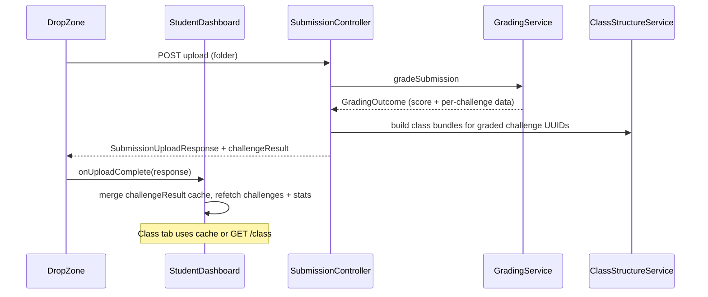

# feat: Challenge Result Upload Response - Plan

## Goal Capsule

**Objective:** Return per-challenge grading results from the submission upload API and wire the student dashboard so uploaded folder results display immediately — all student-facing data reflects the **latest attempt**, not the best score.

**Product authority:** Session brainstorm decisions (2026-08-04). No separate requirements-only artifact was written; scope was confirmed interactively before `/ce-plan`.

**Stop conditions:** Do not implement MMD grading, testcase backend, or replace `/mmd` and `/class` with a unified endpoint. MMD tab stays empty until MMD grading is built.

---

## Product Contract

### Summary

Wire Java grading through the upload response into `StudentDashboard` / `StudentUI`. Upload returns a `challengeResult` map (challenge UUID keys) bundling **score + Class tab data** for each challenge folder in the drop. Challenges not in the upload are omitted. Frontend uses bundled data when present; otherwise fetches `/class`. MMD tab remains but shows nothing (`/mmd` returns `[]`; frontend skips MMD fetch). Remove grading `System.out` logging and upload debug `console.log` calls. All sidebar scores, Class tab, and stats grade reflect the **latest attempt**.

### Problem Frame

Students upload Java lab folders via `DropZone`, but the upload API only returns file counts and overall score. Rich grading output is printed to the server console and never reaches the UI. `StudentDashboard` does not pass `studentId` on challenge fetches, sidebar scores stay null, and post-upload state is not refreshed. Display services resolve submissions via `best_submission_id`, which can disagree with what the student just submitted.

### Actors

- A1. **Student** — uploads lab folders, views per-challenge scores and Class tab results for their latest attempt.
- A2. **Backend grading pipeline** — grades Java, persists results, returns bundled challenge data on upload.

### Requirements

- R1. Upload response includes `challengeResult`: a map keyed by challenge UUID. Each entry bundles `score` (integer 0–100) and `class` (array of `ClassDetailDTO` shapes used by the Class tab today).
- R2. `challengeResult` includes only challenges present in the uploaded folder for this request. Challenges not in the upload are absent from the map (not empty placeholders for every lab challenge).
- R3. Student-facing challenge scores (sidebar), Class tab data (`GET /class`), and stats **current grade** all resolve from the student's **latest attempt** for the lab, not `best_submission_id` or `highest_score`.
- R4. `GET /api/labs/{labId}/challenges/{challengeId}/mmd` returns `[]` until MMD grading is implemented. Frontend does not fetch MMD data; MMD tab renders empty.
- R5. When a challenge has bundled data in the upload response, frontend uses it for the Class tab without an extra `/class` call. When absent, frontend fetches `/class?studentId=...` for the selected challenge.
- R6. After successful upload, frontend refreshes challenge sidebar scores and stats, and applies bundled Class data for challenges in the response.
- R7. Remove `System.out.println` grading report output from `GradingService` (and related private print helpers). Remove upload debug `console.log` from `DropZone` (file listing and success response).
- R8. `GET /api/labs/{labId}/challenges` and `/class` calls include `studentId` query param from the logged-in user.
- R9. Preserve existing upload auth, compile-error handling, and result persistence (upsert on re-upload per `docs/solutions/database-issues/submission-result-reupload-duplicate-key.md`).

### Key Flows

- F1. **Upload and immediate display** — Student drops folder → `POST /api/submissions/{labId}/{attemptNumber}/upload` → response includes `challengeResult` for graded challenges → `onUploadComplete` updates dashboard state → selected challenge Class tab shows bundled data.
- F2. **View challenge not in last upload** — Student selects challenge absent from last `challengeResult` → frontend fetches `/class?studentId=...` using latest-attempt backend resolution → Class tab renders.
- F3. **MMD tab** — Student opens MMD tab → empty state (no fetch, or fetch returns `[]`).

### Acceptance Examples

- AE1. Student uploads a folder containing `challenge_1` and `challenge_3` only. Response `challengeResult` has two UUID keys with scores and class arrays. Sidebar updates scores for those challenges. Selecting `challenge_1` shows Class tab from bundle without `/class` call. Selecting `challenge_2` (not in upload) fetches `/class` if a prior attempt exists.
- AE2. Student re-uploads with a lower score. Sidebar and stats show the new (lower) latest attempt score, not the previous best.
- AE3. Student opens MMD tab after upload. Tab is empty. Server log has no grading report block from `System.out.println`.
- AE4. `GET /mmd?studentId=...` returns `[]` even when Class tab has data for the same challenge.

### Key Decisions

- KD1. **Bundle score + class in upload** over upload-scores-only + always refetch — immediate post-upload display without extra API calls. (session-settled: user-directed — chosen over refetch-only: student sees results right after drop.)
- KD2. **Latest attempt** over best submission for all student-facing reads — student sees what they just submitted. Governs R3, R6. (session-settled: user-directed — chosen over `best_submission_id`: "everything should reflect the latest attempt.")
- KD3. **MMD tab empty, `/mmd` returns `[]`** — MMD grading not built; avoid misleading rubric-derived pseudo-MMD. Governs R4.
- KD4. **Keep separate `/mmd` and `/class` endpoints** — on-demand Class fetch for challenges not in the last upload. Governs R5.
- KD5. **UUID keys** in `challengeResult` — matches `selectedChallengeId` in frontend state.

### Scope Boundaries

**In scope:** Upload response enrichment, latest-attempt resolution, frontend upload callback and fetch fixes, console/log cleanup.

**Deferred for later:**
- MMD file grading and MMD tab data
- Testcase backend and tab
- Automated test suite (repo has none today)
- Student history API (`GET /api/submissions/mine`)

**Deferred to Follow-Up Work:**
- Add `latest_submission_id` column on `student_lab_progress` if query performance becomes an issue (latest resolved via `LabSubmissionRepository.findByUserAndLabOrderByAttemptNumberDesc` for now)

**Outside this product's identity:**
- Lecturer dashboard mock data replacement
- Changing JWT or auth model

### Dependencies and Assumptions

- Assumption: `attemptNumber` from frontend `(stats.totalSubmissions ?? 0) + 1` remains correct for new attempts.
- Assumption: `ChallengeUploadResult` file-count list can be renamed or replaced; only `DropZone` and `SubmissionController` consume it today.
- Dependency: `ClassStructureService.getClassData` logic is reusable for building upload bundles after grading.

### Outstanding Questions

- None blocking. `highest_score` / `best_submission_id` remain in DB for potential future "best grade" features but are not used for student dashboard display after this change.

---

## Planning Contract

### Summary

Extend the upload response with a `challengeResult` map, switch submission resolution to latest attempt across read services, stub MMD to empty, and wire `DropZone` → `StudentDashboard` post-upload refresh with a small in-memory challenge detail cache.

### High-Level Technical Design

**Absent vs empty in `challengeResult`:**
| Map state | Meaning | Frontend action |
|---|---|---|
| Key absent | Challenge not in this upload | Fetch `/class` when selected (if latest attempt has data) |
| Key present, `class: []` | Graded but no class detail to show | Render empty Class tab |
| Key present with data | Just graded in this upload | Render Class tab from bundle |

### Key Technical Decisions

- KTD1. Introduce `SubmissionResolutionService` (or equivalent shared helper) with `resolveLatestSubmissionId(labId, studentId)` using `LabSubmissionRepository.findByUserAndLabOrderByAttemptNumberDesc`, first element. Inject into `ChallengeService`, `ClassStructureService`, and `StatsService`. (session-settled: latest attempt — chosen over `best_submission_id`.)
- KTD2. Change `GradingService.gradeSubmission` to return a `GradingOutcome` DTO (overall score + list of per-challenge results with challenge UUID, score, enough data to build class bundles) instead of only `BigDecimal`. Keep persistence inside grading; controller builds HTTP response.
- KTD3. Add `ChallengeResultBundle` DTO: `{ score: Integer, class: List<ClassDetailDTO> }`. `SubmissionUploadResponse` gains `Map<UUID, ChallengeResultBundle> challengeResult` (JSON object keyed by UUID string). Retain or slim legacy `challenges` file-count list only if still needed for debugging; prefer single graded payload.
- KTD4. `ClassStructureService.getMmdData` returns `List.of()` unconditionally (or early return with comment pointing to future MMD grading). Remove rubric-derived MMD construction from hot path.
- KTD5. `StatsService.currentGrade` reads latest attempt's `LabSubmission.score`, not `StudentLabProgress.highestScore`.
- KTD6. `DropZone` accepts `onUploadComplete(data)` callback; `StudentDashboard` holds `challengeResultCache` state keyed by challenge UUID, cleared on lab change.

### Assumptions

- Jackson serializes `Map<UUID, …>` as JSON object with UUID string keys.
- No new DB migration required; latest attempt derived from existing `lab_submission` rows.

### Risks and Mitigations

| Risk | Mitigation |
|---|---|
| Latest-attempt query on every challenge switch | Single indexed lookup by user+lab; acceptable for 5 challenges |
| Bundle build duplicates `ClassStructureService` logic | Extract `buildClassDataForSubmission(submissionId, challengeId)` shared by GET and upload |
| Frontend cache stale after upload | Clear cache on lab change; replace entries from each upload response |

---

## Implementation Units

### U1. Latest-attempt submission resolution

**Goal:** All student-facing read paths use the latest lab attempt.

**Requirements:** R3, R8

**Dependencies:** None

**Files:**
- `backend/src/main/java/com/eiu/capstone/backend/service/SubmissionResolutionService.java` (new)
- `backend/src/main/java/com/eiu/capstone/backend/service/ChallengeService.java`
- `backend/src/main/java/com/eiu/capstone/backend/service/ClassStructureService.java`
- `backend/src/main/java/com/eiu/capstone/backend/service/StatsService.java`
- `backend/src/main/java/com/eiu/capstone/backend/repository/LabSubmissionRepository.java` (optional `findTopByUserAndLabOrderByAttemptNumberDesc` if cleaner than list get(0))

**Approach:**
1. Add service method `UUID resolveLatestSubmissionId(UUID labId, UUID studentId)` returning first result of `findByUserAndLabOrderByAttemptNumberDesc` or null.
2. Replace `resolveReferenceSubmissionId` in `ChallengeService` and `ClassStructureService` to use latest resolver.
3. Update `StatsService.toDto` to load latest `LabSubmission` for current grade (rounded int), keep `attemptsCount` and `lastSubmittedAt` from progress row.
4. Update stale Javadoc comments that reference `best_submission_id` for display.

**Patterns to follow:** Existing `resolveReferenceSubmissionId` shape in `ChallengeService.java`; repository method already exists on `LabSubmissionRepository`.

**Test scenarios:**
- Covers AE2. Student with attempts 1 (score 80) and 2 (score 60) — sidebar and stats show 60 after attempt 2 is latest.
- Student with no submissions — all scores null, class endpoints return `[]`.
- `studentId` null on challenges endpoint — scores null (existing behavior preserved).

**Verification:** Manual — upload twice with different scores; confirm sidebar reflects second attempt only.

---

### U2. Grading outcome DTO and upload response enrichment

**Goal:** Upload response includes `challengeResult` map with score + class bundles per graded challenge UUID.

**Requirements:** R1, R2, R9

**Dependencies:** U1 (bundle builder uses same class mapping as GET)

**Files:**
- `backend/src/main/java/com/eiu/capstone/backend/DTO/ChallengeResultBundle.java` (new)
- `backend/src/main/java/com/eiu/capstone/backend/DTO/SubmissionUploadResponse.java`
- `backend/src/main/java/com/eiu/capstone/backend/DTO/ChallengeUploadResult.java` (remove or deprecate if unused)
- `backend/src/main/java/com/eiu/capstone/backend/grading/GradingService.java`
- `backend/src/main/java/com/eiu/capstone/backend/grading/GradingOutcome.java` (new, or inner record)
- `backend/src/main/java/com/eiu/capstone/backend/service/ClassStructureService.java`
- `backend/src/main/java/com/eiu/capstone/backend/controller/SubmissionController.java`

**Approach:**
1. Extract `buildClassData(submissionId, challengeId)` in `ClassStructureService` from existing `getClassData` body.
2. Extend grading to capture per-challenge UUID (from rubric snapshot `ChallengeRubric`) and percentage per folder graded.
3. Return `GradingOutcome` from `gradeSubmission` with overall score and per-challenge entries.
4. In `SubmissionController`, after save, build `Map<UUID, ChallengeResultBundle>` only for challenges in `uploadResult.challenges` (map folder name → challenge number → rubric challenge UUID).
5. Add bundles to `SubmissionUploadResponse`.

**Patterns to follow:** Immutable DTO style in `SubmissionUploadResponse.java`; `ChallengeComputation` in `GradingService` already has `challengeNumber`, `percentage`.

**Test scenarios:**
- Covers AE1. Partial folder upload — map has only uploaded challenge UUIDs.
- Upload with compile failure — existing 422 behavior unchanged.
- Re-upload same attempt number — results update in place, no duplicate-key error.

**Verification:** Manual — inspect upload JSON in network tab; UUID keys with score and class arrays present.

---

### U3. MMD stub and grading log cleanup

**Goal:** MMD endpoint returns empty; no grading noise in server console.

**Requirements:** R4, R7

**Dependencies:** None (can parallel U1/U2)

**Files:**
- `backend/src/main/java/com/eiu/capstone/backend/service/ClassStructureService.java`
- `backend/src/main/java/com/eiu/capstone/backend/grading/GradingService.java`
- `backend/src/main/java/com/eiu/capstone/backend/controller/SubmissionController.java` (timing log: keep behind `app.grading.timing-log` or switch to SLF4J debug — do not remove gated timing)

**Approach:**
1. `getMmdData` returns `List.of()` with Javadoc noting MMD grading not implemented.
2. Remove `System.out.println` / `printChallengeReport` / `printIfNotEmpty` from `GradingService`; delete dead private helpers.
3. Do not remove `app.grading.timing-log` gated `System.out.printf` in controller unless switching to logger at DEBUG.

**Test scenarios:**
- Covers AE3. Upload succeeds — no grading banner in console.
- Covers AE4. `GET /mmd?studentId=...` returns `[]` while `/class` returns data.

**Verification:** Manual — upload and tail server output; hit `/mmd` endpoint via browser or curl.

---

### U4. DropZone onUploadComplete and log cleanup

**Goal:** Parent receives upload response; DropZone stops debug logging.

**Requirements:** R6, R7

**Dependencies:** U2 (response shape stable)

**Files:**
- `frontend/src/components/ui/DropZone.jsx`
- `frontend/src/components/ui/AGENTS.md`
- `frontend/src/components/student/StudentUI.jsx`

**Approach:**
1. Add `onUploadComplete` prop; call with parsed JSON after successful upload.
2. Remove `console.log` for file listing and success response; keep `console.error` for real failures.
3. Pass `onUploadComplete` from `StudentUI` through to `DropZone` (wired in U5 from `StudentDashboard`).
4. Remove unused `onFilesSelected` → `handleFileUpload` stub path if redundant (upload handled entirely in DropZone).

**Test scenarios:**
- Successful upload invokes `onUploadComplete` once with `challengeResult` field.
- Failed upload does not invoke callback; error message shown.

**Verification:** Manual — add temporary log in dashboard handler; confirm one call per upload.

---

### U5. StudentDashboard fetch wiring and challenge cache

**Goal:** Dashboard passes `studentId`, uses upload bundles, fetches `/class` when needed, skips MMD/testcases.

**Requirements:** R5, R6, R8

**Dependencies:** U1, U2, U4

**Files:**
- `frontend/src/pages/StudentDashboard.jsx`
- `frontend/src/components/student/StudentUI.jsx`
- `frontend/src/pages/AGENTS.md`
- `frontend/src/components/student/AGENTS.md`

**Approach:**
1. Add `challengeResultCache` state (`Map` or object keyed by challenge UUID).
2. `fetchChallenges` — append `?studentId=${user.id}`.
3. `onUploadComplete` — merge `response.challengeResult` into cache; refetch challenges list and stats; if selected challenge is in response, set `classData` from bundle.
4. Detail `useEffect` — if cache has selected challenge, use cached `class`; else if `challenge.score != null`, fetch `/class?studentId=...`; else empty. Do not fetch `/mmd` or `/testcases`. Keep `mmdData` as `[]`.
5. Clear cache on `selectedLabId` change.
6. Remove `handleFileUpload` TODO stub; wire `onUploadComplete` through `StudentUI` → `DropZone`.

**Patterns to follow:** Existing `useEffect` detail fetch in `StudentDashboard.jsx`; `API_BASE` + `fetch` pattern.

**Test scenarios:**
- Covers AE1. Partial upload — bundled challenge shows class without extra fetch; other challenge fetches `/class`.
- Covers AE2. Re-upload lower score — sidebar updates without page reload.
- Lab switch clears cached bundles from previous lab.
- Challenge with no submission — empty Class tab, "Not submitted" in sidebar.

**Verification:** Manual full flow — login as student, upload, switch challenges, re-upload, switch labs.

---

## Verification Contract

No automated test suite exists. Verify manually:

| Check | Command / action |
|---|---|
| Backend compiles | `mvn -f backend/pom.xml compile` |
| Frontend builds | `npm run build` in `frontend/` |
| Upload contract | Swagger or DropZone — POST upload returns `challengeResult` with UUID keys |
| Latest attempt | Two uploads with different scores — UI shows second score |
| MMD empty | MMD tab blank; `/mmd` returns `[]` |
| No console noise | Server log clean after upload; browser console no upload debug logs |
| Regression | Compile-error upload still returns 422 with message |

---

## Definition of Done

- [ ] U1–U5 complete
- [ ] `SubmissionUploadResponse` includes `challengeResult` per R1
- [ ] Student dashboard displays latest-attempt scores and Class data per R3, R5, R6
- [ ] MMD tab empty; `/mmd` returns `[]` per R4
- [ ] Grading `System.out` removed per R7
- [ ] `frontend` build and `backend` compile succeed
- [ ] Manual acceptance examples AE1–AE4 verified
- [ ] AGENTS.md updated for `DropZone` `onUploadComplete` and student fetch contract if behavior changed

---

## Appendix

### Sources and Research

- Session brainstorm dialogue (2026-08-04) — primary product input
- `.cursor/tmp/grounding-challenge-result-json.md` — upload/read path extraction
- `docs/solutions/database-issues/submission-result-reupload-duplicate-key.md` — re-upload upsert pattern
- `docs/plans/2026-07-31-001-perf-grading-speed-plan.md` — adjacent grading pipeline context (no scope overlap)

### Product Contract preservation

Product Contract authored at plan-write from session-settled brainstorm decisions (`product_contract_source: ce-plan-bootstrap`). No prior requirements-only file to diff.
