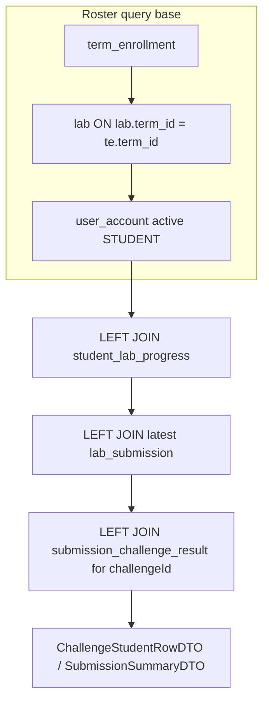

# Unique Student Lab Roster - Plan

## Goal Capsule

**Objective:** Fix the lecturer lab/challenge student table and related metrics so each row represents one unique enrolled student for the selected lab, with `student_lab_progress` and submission data joined afterward — never one row per submission attempt.

**Product authority:** Brainstorm decisions 2026-08-07 (`KTD-1` enrolled students for lab term; user confirmed enrollment population over progress-only or submission-based lists).

**Stop conditions:** Do not redesign student upload/grading pipeline beyond enrollment backfill. Do not replace Reports analytics module. Student history page is out of scope.

---

## Product Contract

### Summary

The lecturer dashboard currently loads `/api/labs/{labId}/submissions` from `lab_submission`, which duplicates students across attempts and omits enrolled non-submitters. Re-center the roster on unique students enrolled in the lab's term, LEFT JOIN `student_lab_progress` and challenge submission data per student. Paginate and compute completion metrics on unique students only.

### Problem Frame

Lecturers need a roster: who is in this lab, and how did each student perform on the selected challenge? Submission-first queries inflate row counts, break pagination, and hide enrolled students who have not submitted.

### Requirements

- **REQ-1** — Roster FROM enrolled students for the lab's term (not `lab_submission`).
- **REQ-2** — LEFT JOIN `student_lab_progress` and challenge submission enrichment per student.
- **REQ-3** — Non-submitters still appear with `—` / `0` / muted View.
- **REQ-4** — Pagination pages unique students (`totalElements` = enrolled count).
- **REQ-5** — Total Students, Students Submitted, Completion Rate, challenge participation use unique-student semantics.
- **REQ-6** — No `DISTINCT` on submission rows as a workaround; enrollment is the primary source.
- **REQ-7** — Lab overview list + export use the same roster contract.
- **REQ-8** — Empty DB returns 200 with placeholders; UI never crashes on nulls.

### Key Decisions

- **KD1 — Enrollment source:** Introduce `term_enrollment(user_id, term_id)` as the roster denominator. Backfill from existing `student_lab_progress` → lab → term. Rejected: submission table as primary source; progress-only roster (hides enrolled non-submitters).
- **KD2 — Challenge display rule:** Use the student's **latest lab attempt** (`findFirstByUser_IdAndLab_IdOrderByAttemptNumberDesc`) for challenge Score and Last Submission, matching student-facing reads. Challenge Attempts = count of `lab_submission` rows for that user+lab that have a `submission_challenge_result` row for the selected challenge.
- **KD3 — API shape:** Add `GET /api/labs/{labId}/challenges/{challengeId}/students` for challenge tabs. Refactor `GET /api/labs/{labId}/submissions` to the same enrollment-based roster (lab-level columns, no `challengeId` hack).
- **KD4 — Pagination:** Spring `Page` over enrolled students; `size` default 5 on challenge tab (frontend already uses 5), 20 on lab overview.

### Acceptance Examples

- **AE-1:** Students A (3 attempts), B (1), C (0) on Challenge 1 → table shows 3 rows.
- **AE-2:** Enrolled Student C, no submissions → row with `—`, `0`, `—`, View disabled.
- **AE-3:** 27 enrolled students, page size 5 → `totalElements: 27`, page 6 has 2 rows.
- **AE-4:** Completion Rate = students with challenge result on latest attempt ÷ enrolled students × 100.

### Scope Boundaries

**In scope:** `term_enrollment` model + backfill, lecturer roster queries, lab/challenge API refactor, `LecturerDashboard` challenge tab + export + statistics alignment.

**Out of scope:** Student history API, bulk enrollment UI (document SQL seed only), Reports module rewrite.

---

## Planning Contract

### Summary

Add `term_enrollment`, rewrite `LecturerAnalyticsRepository` queries to start from enrolled students for a lab's term, expose a dedicated challenge roster endpoint, refactor lab submissions to one-row-per-student, and wire the frontend challenge tab + export to the new contracts.

### High-Level Technical Design

**Query invariant:** `FROM term_enrollment te JOIN lab l ... JOIN user_account u` — never `FROM lab_submission s` as the driving table.

### Key Technical Decisions

- **KTD1.** New entity `TermEnrollment` (`term_enrollment`: `id`, `user_id`, `term_id`, unique on `(user_id, term_id)`). No Flyway in repo — ship a documented SQL backfill script under `docs/` for operators.
- **KTD2.** `LecturerAnalyticsRepository.findEnrolledStudentsForLab(labId, challengeId|null, sort, offset, limit)` returns one row per enrolled student. Challenge score from latest submission's `submission_challenge_result` for `challengeId` (score as percent 0–100).
- **KTD3.** `ChallengeStudentRowDTO`: `studentName`, `studentCode`, `score` (nullable), `attempts` (int, 0 when none), `submittedAt` (nullable ISO string), `hasSubmission` (boolean — drives View enabled state).
- **KTD4.** `getLabStatistics`: `studentCount` = enrolled students for term; `submissionCount` renamed semantically to `studentsSubmitted` in response or documented as unique students with any lab submission; `completionRate` = students with `student_lab_progress.last_submitted_at IS NOT NULL` ÷ enrolled × 100 (lab-level) and per-challenge variant on challenge cards.
- **KTD5.** Reuse `SubmissionResolutionService` pattern (latest attempt) already in codebase from prior plan.

### Assumptions

- Active student = `user_account.is_active = true` and `role.name = 'STUDENT'` (same filter as existing analytics queries).
- Enrolled students without a progress row are valid roster members (LEFT JOIN progress).
- Existing `challengeId` query param on `/submissions` is removed in favor of the dedicated challenge students route (frontend updated in same PR).

### Risks and Mitigations

| Risk | Mitigation |
|---|---|
| No enrollment rows → empty roster | Backfill script seeds from progress; document INSERT for new students |
| N+1 on challenge score | Single native query with subselect/lateral join for latest submission per student |
| Export still paginates submissions | Switch `exportOverview` to roster endpoint with larger page size loop |

---

## Implementation Units

### U1. Term enrollment persistence

**Goal:** Authoritative enrolled-student source for a term.

**Requirements:** REQ-1, AE-2

**Files:**
- `backend/src/main/java/com/eiu/capstone/backend/model/TermEnrollment.java` (new)
- `backend/src/main/java/com/eiu/capstone/backend/repository/TermEnrollmentRepository.java` (new)
- `docs/term-enrollment-backfill.sql` (new — operator-run, not Flyway)

**Approach:**
1. JPA entity mapping `term_enrollment` with FK to `user_account` and `term`.
2. Repository: `countByTerm_Id`, `findEnrolledUserIdsForLab(UUID labId)` via join lab.
3. SQL backfill: `INSERT INTO term_enrollment (id, user_id, term_id) SELECT gen_random_uuid(), p.user_id, l.term_id FROM student_lab_progress p JOIN lab l ON l.id = p.lab_id ON CONFLICT DO NOTHING` (adjust to actual PK/unique constraint).

**Test scenarios:**
- Lab with 3 progress rows across 2 terms → backfill creates 3 enrollment rows on correct terms.
- Enrolled student with no progress → appears after manual INSERT into `term_enrollment`.

---

### U2. Enrollment-based roster repository queries

**Goal:** One SQL path for unique-student roster with optional challenge enrichment.

**Requirements:** REQ-1–REQ-6, KD2

**Dependencies:** U1

**Files:**
- `backend/src/main/java/com/eiu/capstone/backend/analytics/repository/LecturerAnalyticsRepository.java`
- `backend/src/main/java/com/eiu/capstone/backend/analytics/dto/ChallengeStudentRowDTO.java` (new)

**Approach:**
1. Replace `findLabSubmissions` / `countLabSubmissions` implementation:
   - `countEnrolledStudentsForLab(labId)` — count from `term_enrollment` joined to lab.
   - `findLabStudentRoster(labId, offset, limit, sort)` — enrolled students LEFT JOIN progress LEFT JOIN latest `lab_submission` for lab-level score/attempt/submittedAt.
   - `findChallengeStudentRoster(labId, challengeId, offset, limit, sort)` — same base LEFT JOIN latest submission LEFT JOIN `submission_challenge_result` for challenge; compute challenge attempt count via correlated subquery counting submissions with SCR for challenge.
2. Sort whitelist: `studentName`, `studentCode`, `score`, `attempts`, `submittedAt` (maps to SQL columns).

**Test scenarios:**
- AE-1: 3 enrolled, multiple submission rows → query returns 3 rows.
- AE-3: count query returns 27 regardless of submission row count.
- Student with enrollment, no submissions → row with null score, attempts 0.

---

### U3. Service + controller endpoints

**Goal:** Expose roster APIs with Spring `Page` over unique students.

**Requirements:** REQ-4, REQ-7, KD3

**Dependencies:** U2

**Files:**
- `backend/src/main/java/com/eiu/capstone/backend/analytics/service/LecturerAnalyticsService.java`
- `backend/src/main/java/com/eiu/capstone/backend/controller/LabController.java`
- `backend/src/main/java/com/eiu/capstone/backend/controller/ChallengeController.java` (or new `LecturerRosterController` under `/api/labs/{labId}` — prefer extending `ChallengeController` for challenge route)

**Approach:**
1. `getLabStudentRoster(labId, page, size, sort)` → `Page<SubmissionSummaryDTO>` (lab-level; one row per student).
2. `getChallengeStudentRoster(labId, challengeId, page, size, sort)` → `Page<ChallengeStudentRowDTO>`.
3. Add `@GetMapping("/{challengeId}/students")` on `ChallengeController`.
4. Refactor existing `LabController.getSubmissions` to call enrollment roster (breaking: response row count changes — intentional).

**Test scenarios:**
- `GET .../challenges/{id}/students?page=0&size=5` returns `content.length <= 5`, `totalElements` = enrolled count.
- Missing challenge results → `hasSubmission: false`, null score.
- Empty enrollment → 200, `content: []`, `totalElements: 0`.

---

### U4. Lab statistics alignment

**Goal:** Overview cards count unique enrolled students.

**Requirements:** REQ-5, AE-4

**Dependencies:** U2

**Files:**
- `backend/src/main/java/com/eiu/capstone/backend/analytics/dto/LabStatisticsResponse.java`
- `backend/src/main/java/com/eiu/capstone/backend/analytics/service/LecturerAnalyticsService.java`
- `backend/src/main/java/com/eiu/capstone/backend/analytics/repository/LecturerAnalyticsRepository.java`

**Approach:**
1. `studentCount` = enrolled students for lab's term.
2. Add `studentsSubmitted` (unique students with at least one `lab_submission` for lab) — use for "Students Submitted" card label.
3. `completionRate` = `studentsSubmitted / studentCount * 100` (null when studentCount 0).
4. Keep `submissionCount` as total submission **events** only if still needed for debugging; otherwise remove from UI binding.

**Test scenarios:**
- 10 enrolled, 4 with submissions → completionRate 40%.
- 0 enrolled → all metrics null/0, HTTP 200.

---

### U5. Lecturer dashboard challenge tab

**Goal:** Frontend uses challenge students API; correct empty/muted states.

**Requirements:** REQ-3, REQ-8, FLOW-1

**Dependencies:** U3

**Files:**
- `frontend/src/pages/LecturerDashboard.jsx`
- `frontend/src/components/lecturer/SubmissionTable.jsx` (optional shared row renderer)

**Approach:**
1. `fetchChallengeSubmissions` → `GET /api/labs/{labId}/challenges/{challengeId}/students?page=&size=5&sort=`.
2. Map `hasSubmission` to View button `disabled` + muted styles.
3. Empty roster: "No student data found" (not "No submissions yet").
4. Pagination `onPageChange` uses student page indices.
5. Remove `challengeId` query param hack on `/submissions`.

**Test scenarios:**
- AE-2: non-submitter row visible, View disabled.
- Page next with 27 students / size 5 → page 2 loads different students, not duplicate attempts.

---

### U6. Lab overview + export alignment

**Goal:** Overview submissions table and export use enrollment roster.

**Requirements:** REQ-7

**Dependencies:** U3

**Files:**
- `frontend/src/pages/LecturerDashboard.jsx` (`fetchSubmissions`, `exportOverview`)

**Approach:**
1. Lab overview `fetchSubmissions` already hits `/submissions` — no URL change after U3 backend fix; verify one row per student.
2. `exportOverview` loops pages of roster endpoint until `totalPages` exhausted; export columns per student (not per attempt).

**Test scenarios:**
- Export with 27 students produces 27 data rows, not submission row count.

---

## Verification Contract

Manual verification (no automated test suite in repo):

1. Seed `term_enrollment` via backfill SQL for a lab's term including one student with zero submissions.
2. Log in as lecturer → select lab → Overview tab: student count matches enrolled rows.
3. Open Challenge 1 tab: enrolled non-submitter visible with placeholders.
4. Student with 3 attempts: single row, attempts reflects challenge-specific count.
5. Paginate through full roster; confirm no duplicate student names across pages.
6. `mvn compile` + `npm run build` succeed.

---

## Definition of Done

- [ ] `term_enrollment` entity + repository + backfill SQL documented
- [ ] Challenge roster endpoint returns one row per enrolled student with correct placeholders
- [ ] Lab `/submissions` endpoint refactored to enrollment base; pagination counts students
- [ ] Lab statistics cards use enrolled denominator
- [ ] Lecturer challenge tab wired to new endpoint; View muted when `hasSubmission` is false
- [ ] Export uses student roster pages
- [ ] `backend/AGENTS.md` and `frontend/src/components/lecturer/AGENTS.md` updated with roster contract
- [ ] No `"API not available yet"` console paths reintroduced for these flows

---

## How This Work Fits Together

Builds on existing `LecturerAnalyticsService` and dashboard UI added for overview/statistics/reports. Corrects the data layer contract without changing the grading upload pipeline except enrollment backfill.
