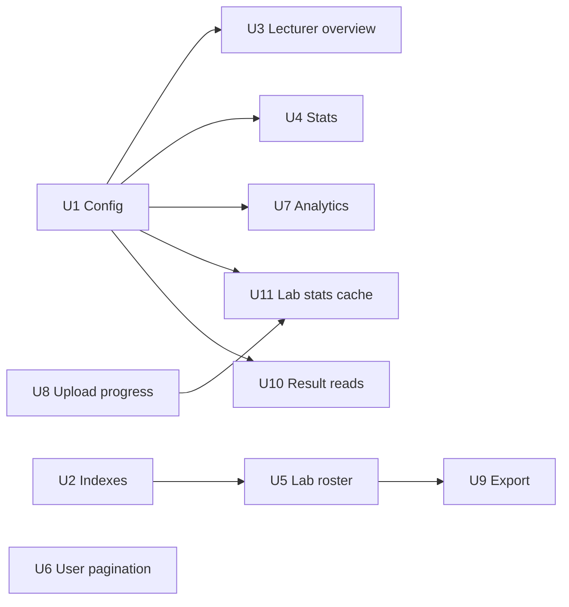

# Database Performance Optimization - Plan

## Goal Capsule

**Objective:** Reduce database round-trips and write amplification across upload, student dashboard, lecturer overview, analytics, and export paths — so the app stays responsive on Neon PostgreSQL as enrollments, submission history, and rubric size grow. Deliver all 13 fixes from the performance review in the recommended ROI order.

**Product authority:** User-provided Database Performance Review (2026-08-07), confirmed full-scope delivery after synthesis.

**Open blockers:** None blocking implementation. Production pooler URL and region alignment remain operator assumptions (see Planning Contract assumptions).

## Product Contract

### Summary

The August 2026 full-stack latency plan eliminated classic ORM N+1 on student read paths. Remaining pain is **query count**, **serial aggregation round-trips**, **unbatched grading writes**, and **missing indexes** on analytics join columns. This plan addresses connection tuning, Hibernate JDBC batching, query consolidation, targeted indexes, short-TTL caches for lecturer/analytics reads, history-query correctness, pagination improvements, and export efficiency — without changing grading semantics or upload score behavior.

### Problem Frame

Current dev data is very small (~6 submissions, ~15 users), so many issues are latent. On Neon, each extra serial query adds cross-region latency that compounds on lecturer overview (6 queries), analytics dashboard (5+ heavy queries), stats (up to 4 redundant queries), and upload grading (hundreds of unbatched INSERT/UPDATE rows). OFFSET pagination and per-student LATERAL subqueries will degrade at enrollment scale. Deploy docs do not require Neon's pooler URL, risking connection exhaustion in production.

### Actors

- A1. **Student** — loads dashboard stats on every lab switch; uploads submissions synchronously.
- A2. **Lecturer** — loads overview cards, lab statistics, paginated rosters, and full-roster exports.
- A3. **Operator** — configures Neon pooler URL, Hikari pool, and runs index DDL externally (no Flyway/Liquibase in repo).

### Requirements

**Connection and ORM configuration (priority 1)**

- R1. Enable Hibernate JDBC batching (`batch_size=50`, `order_inserts=true`, `order_updates=true`) so `GradingResultStore.save()` persists hundreds of result rows with batched round-trips, not one per row.
- R2. Set `spring.jpa.open-in-view=false` so connections release after the service layer instead of being held through JSON serialization.
- R3. Add explicit Hikari pool tuning suited to Neon (`maximum-pool-size`, `minimum-idle`, `connection-timeout`, `max-lifetime`) in application config.
- R4. Document and require the Neon **pooler** JDBC URL in `DEPLOY_RENDER.md` and operator guidance; generic `<HOST>:5432` examples must call out `-pooler` hostname requirement for long-lived JVM deployments.

**Lecturer overview (priority 2)**

- R5. `GET /api/lecturer/overview` must not issue six serial aggregation queries per request. Consolidate into one or two SQL statements **or** serve from an in-process TTL cache (60–120 seconds) keyed `lecturer-overview`.
- R6. Recent-submissions ordering must benefit from an index on `lab_submission(submitted_at DESC)` once indexes are applied.

**Indexes (priority 3)**

- R7. Add `term_enrollment(term_id)` index — used by all lab roster/count queries joining enrollment to term.
- R8. Add `lab_submission(submitted_at DESC)` index — used by lecturer recent-submissions ordering.
- R9. Add partial index `student_lab_progress(user_id) WHERE last_submitted_at IS NOT NULL` — used by `countActiveStudentsWithSubmissions`.
- R10. Index DDL is operator-run SQL (consistent with existing schema management); document scripts in repo with `CREATE INDEX CONCURRENTLY` guidance.

**Query rewrites — lecturer roster and student stats (priority 4)**

- R11. `findLabStudentRoster` must not execute one LATERAL subquery per enrolled student. Rewrite to a single-pass window (`DISTINCT ON` or `ROW_NUMBER() OVER (PARTITION BY user_id …)`).
- R12. Lab roster pagination must use keyset pagination on the sort key (e.g. `full_name`, `id`) instead of OFFSET for deep pages.
- R13. `StatsService.getStats()` must not run up to four queries (progress, count, findFirst ×2, count again). Consolidate to one query returning progress, latest score, attempt count, and latest submission timestamp.
- R14. Stats response semantics unchanged: current grade from latest attempt, total submissions, formatted latest submission time.

**Analytics dashboard and history queries (priority 5–6)**

- R15. `AnalyticsService.getDashboard()` must reduce independent heavy aggregations; combine overview metrics into fewer CTE-based queries and/or cache per filter set (TTL 1–5 minutes).
- R16. `findDashboardSummary` must not re-aggregate all labs in a nested subquery only to find lowest-average lab; rewrite using a window function over per-lab averages.
- R17. `findAtRiskLabs`, `findStudentChallengeBreakdown`, and `findStudentWeakSkills` must restrict to **latest submission per lab** for the student, not all attempts ever — re-upload history must not inflate aggregates.
- R18. Student overview search (`LOWER() LIKE '%…%'`) may remain as-is for current scale; document `pg_trgm` GIN index path as deferred scale work unless trivial to add now.
- R19. Student overview pagination should move to keyset pagination on sort key when rewritten; OFFSET acceptable only where rewrite cost exceeds benefit at current scale.

**Upload path and user list (priority 7–8)**

- R20. `SubmissionController.updateStudentProgress()` must not `flush()` then `COUNT(*)` on every upload when `attemptNumber` is already known. Maintain `attemptsCount` incrementally on new attempts; skip redundant count on re-upload of same attempt.
- R21. `UserService.getAllUser()` / `findAllWithRoles()` must support pagination and projection — no full-table load with role joins on every `GET /api/users/getAllUser`.

**Export efficiency (priority 9)**

- R22. Lecturer roster export must not paginate sequentially through OFFSET pages (N API+DB round-trips for large rosters). Provide a single export endpoint or export-only raised page size returning the full enrolled roster in one query.

**Submission result reads (priority 7, medium)**

- R23. `SubmissionResultLoader.loadCorrectIds()` and `GradingResultStore.loadExisting()` may consolidate 4–5 per-table queries into fewer round-trips (single native `UNION ALL` or equivalent) without changing which IDs load or correctness semantics.

**Caching (cross-cutting)**

- R24. Lecturer overview: in-process TTL cache 60–120s — best ROI per review.
- R25. Lab statistics (`/api/labs/{id}/statistics`): per-`labId` TTL cache; invalidate on submission for that lab.
- R26. Analytics dashboard: per-filter-set TTL cache 1–5 min.
- R27. Caching remains in-process unless multi-instance shared cache is separately scoped; document staleness trade-off consistent with existing rubric cache notes.

**Correctness preservation**

- R28. Grading outcomes, score semantics, and latest-attempt display rules remain unchanged from `docs/plans/2026-08-04-002-perf-full-stack-latency-plan.md`.
- R29. No materialized views at current scale; defer until `student_lab_progress` / `lab_submission` exceed ~10k rows.

**Observability**

- R30. Existing `app.grading.timing-log` continues to cover read/upload paths; no new observability framework required. Operator may run `VACUUM (ANALYZE)` and dead-tuple monitoring queries when upload-heavy testing shows high dead ratios.

### Key Flows

**F1. Student upload → graded score**

Upload triggers rubric load (cached) → parallel compile/grade → `GradingResultStore.save()` with JDBC batching → progress update without redundant flush+count → synchronous score response. Hundreds of result rows persist in batched INSERT/UPDATE, not row-by-row round-trips.

**F2. Student dashboard lab switch**

Parallel fetch of challenges + stats; stats endpoint returns grade, attempt count, and latest submission from **one** consolidated query.

**F3. Lecturer overview first paint**

Overview cards served from consolidated query or 60–120s cache; recent submissions ordered via `submitted_at` index.

**F4. Lecturer lab roster browse and export**

Roster page uses window-function latest-attempt join and keyset pagination. Export uses single-query endpoint instead of sequential page fetches.

**F5. Analytics reports dashboard**

Dashboard metrics from fewer CTE queries or short-TTL cache; at-risk and challenge breakdown use latest attempt per lab only.

### Acceptance Examples

**AE1.** Medium lab upload (100–400 result rows): grading persist phase shows materially fewer DB round-trips with batching enabled vs disabled (measurable via timing log or query count in dev).

**AE2.** Lecturer overview: one page load triggers at most two DB round-trips (or cache hit with zero DB) instead of six serial aggregations.

**AE3.** Student stats for a lab with 3 attempts: single query returns correct current grade (latest attempt), `totalSubmissions=3`, and formatted latest timestamp.

**AE4.** Student with 5 lab re-uploads: `findStudentChallengeBreakdown` reflects only latest attempt per lab, not cumulative history across attempts.

**AE5.** Lab roster export for 200 enrolled students: one API call and one DB query path, not 4+ sequential paginated requests.

**AE6.** `DEPLOY_RENDER.md` explicitly documents Neon pooler URL pattern; example matches `.env.backend.example` pooler hostname convention.

### Scope Boundaries

**In scope:** All 13 review items and recommended implementation order; operator-run index SQL scripts; in-process TTL caches; query rewrites in `LecturerAnalyticsRepository`, `AnalyticsRepository`, `StatsService`, `GradingResultStore`, `SubmissionResultLoader`, `SubmissionController`; export endpoint or frontend change; `DEPLOY_RENDER.md` and config updates.

**Out of scope:** Materialized views; Redis/shared cache for multi-instance; `pg_trgm` search indexes (R18 documents deferred DDL path only); student-overview keyset pagination (R19 — OFFSET retained until Reports student-overview UI is wired); changing grading algorithm or upload response shape; Flyway/Liquibase migration framework; production `pg_stat_statements` access (operator concern); Neon region migration.

**Extends, does not replace:** `docs/plans/2026-08-04-002-perf-full-stack-latency-plan.md` (read-path N+1 fixes already shipped).

### Success Criteria

- Upload persist latency improves measurably for medium+ rubrics (primary win: JDBC batching).
- Lecturer overview and analytics dashboard first-load latency reduced vs current serial-query baseline on dev/staging.
- Stats endpoint: one DB round-trip per request on hot path.
- Index DDL documented and applied on Neon without blocking writes (`CONCURRENTLY`).
- No regression in score semantics, latest-attempt display, or export data correctness.
- Deploy docs prevent direct-endpoint misconfiguration for production JVM.

### Key Decisions

- KTD1. **Full-scope delivery** over phased subsets — all 13 review items in one plan, implemented in review's ROI order. *Reason:* user confirmed full scope at synthesis.
- KTD2. **Consolidate-then-cache** for lecturer overview — prefer SQL consolidation first; add 60–120s TTL cache if consolidation alone is insufficient. *Reason:* cache is best ROI per review but consolidation reduces staleness risk.
- KTD3. **Operator-run index DDL** over in-repo migration framework — matches existing schema management (`backend/AGENTS.md`: no Flyway/Liquibase). *Reason:* project convention.
- KTD4. **Latest-attempt-only** for analytics history aggregations — `findAtRiskLabs` and `findStudentChallengeBreakdown` must not sum all attempts. *Reason:* aligns with student-facing latest-attempt semantics and prevents re-upload inflation.
- KTD5. **In-process TTL caches** for lecturer/analytics reads — no Redis in this scope. *Reason:* matches existing `LabRubricCache` / `MasterDataCache` pattern; multi-instance staleness documented.
- KTD6. **Defer materialized views and pg_trgm** until data scale warrants. *Reason:* YAGNI at current row counts; index gaps are clear wins now.

### Resolve Before Planning

| Item | Status | Notes |
|---|---|---|
| Production uses Neon pooler URL? | Assumption | Verify Render env var; direct endpoint + default Hikari pool risks connection limits |
| Neon region vs Render region | Assumption | Cross-region adds ~50–150ms per round-trip; compounds on multi-query endpoints |
| Production table sizes | Assumption | Index and OFFSET issues may not reproduce in dev (~6 submissions) |
| `pg_stat_statements` owner access | Deferred to operator | Needed to rank actual slow queries in production; not blocking implementation |

## Planning Contract

### Sequencing

Units follow the review's ROI order: **U1 → U2 (parallel) → U3 → U4 → U5 → U6 → U7 → U8 → U9 → U10 → U11**. U1 (config) and U2 (indexes) are independent. U3–U7 depend on U1 for batching/open-in-view and cache TTL properties. U8 must land before U11 (cache invalidation hooks upload path). U9 depends on U5 (shared roster query).

### Deferred Requirements

| Req | Status | Owner / note |
|---|---|---|
| R18 | Doc-only deferral | Add `pg_trgm` GIN index path as comment block in `docs/sql/2026-08-07-analytics-indexes.sql` — no runtime change at current scale |
| R19 | Deferred | Student overview (`AnalyticsRepository.findStudentOverview`) keeps OFFSET until Reports UI adopts keyset cursor API |

### Key Technical Decisions

- KTD-P1. **Single CTE query for lecturer overview** — one native SQL returning all six scalar metrics plus recent submissions as a JSON aggregate or second lightweight query, wrapped in `LecturerOverviewCache` (TTL 90s default, configurable). *Rationale:* meets R5/R24; cache is additive insurance on Neon latency.
- KTD-P2. **`AnalyticsDashboardCache` keyed by filter tuple** — `(academicYearId, semesterId, labId, course)` with 3-minute TTL. *Rationale:* R15/R26; dashboard still runs five repository calls today in `AnalyticsService.getDashboard()`.
- KTD-P3. **`LabStatisticsCache` keyed by `labId`** — 2-minute TTL; `SubmissionController` calls invalidation after successful upload for that lab. *Rationale:* R25; lab stats change on submission.
- KTD-P4. **Export via `GET /api/labs/{labId}/submissions/export`** — returns full roster in one query (no pagination params); browse pagination keeps existing `/submissions` with keyset. *Rationale:* R22 without breaking current table UX.
- KTD-P5. **Stats via native query in new `StatsRepository`** — keep `StatsService` thin; one SQL with LEFT JOIN LATERAL for latest attempt + scalar subselect for count. *Rationale:* R13; avoids JPA method proliferation.
- KTD-P6. **Index scripts under `docs/sql/`** — follow `docs/term-enrollment-backfill.sql` convention; operator runs on Neon with `CONCURRENTLY`. *Rationale:* R10/KTD3.

### Assumptions

- Dev/staging Neon instance is available for manual verification; no automated integration test harness exists yet.
- Lecturer and analytics endpoints remain unauthenticated per current `SecurityConfig` — performance work does not add auth.
- `findStudentWeakSkills` is in scope for U7 latest-attempt CTE rewrite (R17).

### Deferred to Implementation

- Exact Hikari `max-lifetime` tuning after observing Neon connection resets in staging.
- Whether keyset pagination API adds `cursor` query param vs `lastName`/`lastId` pair — shape at implementation time.
- Final choice between `DISTINCT ON` vs `ROW_NUMBER()` for roster rewrite — both satisfy R11.

## Implementation Units

### U1. Connection, ORM batching, and deploy docs

**Goal:** Enable JDBC batching, disable open-in-view, tune Hikari, and document Neon pooler URL for production.

**Requirements:** R1, R2, R3, R4

**Dependencies:** None

**Files:**
- `backend/src/main/resources/application.properties`
- `backend/DEPLOY_RENDER.md`
- `backend/AGENTS.md` (env table note on pooler)

**Approach:**
1. Add to `application.properties`:
   - `spring.jpa.open-in-view=false`
   - `spring.jpa.properties.hibernate.jdbc.batch_size=50`
   - `spring.jpa.properties.hibernate.order_inserts=true`
   - `spring.jpa.properties.hibernate.order_updates=true`
   - `spring.datasource.hikari.maximum-pool-size=10`
   - `spring.datasource.hikari.minimum-idle=2`
   - `spring.datasource.hikari.connection-timeout=30000`
   - `spring.datasource.hikari.max-lifetime=1800000`
2. Add optional cache TTL properties: `app.analytics.lecturer-overview-cache-ttl-seconds=90`, `app.analytics.dashboard-cache-ttl-seconds=180`, `app.analytics.lab-statistics-cache-ttl-seconds=120`
3. Update `DEPLOY_RENDER.md` to require `-pooler` hostname in `SPRING_DATASOURCE_URL`, reference `backend/.env.backend.example`, and note Hikari settings.

**Patterns to follow:** Existing property style in `application.properties`; deploy notes in `DEPLOY_RENDER.md` grading section.

**Test scenarios:**
- Covers AE1. Upload a medium lab submission with `app.grading.timing-log=true`; confirm `grade_ms`/`total_ms` improves vs baseline (or log shows fewer persist-phase stalls).
- Covers AE6. `DEPLOY_RENDER.md` example URL contains `-pooler` segment.
- App starts cleanly with `mvn spring-boot:run`; lecturer overview and student stats endpoints return 200.

**Verification:** Backend boots; no `LazyInitializationException` on existing read endpoints after `open-in-view=false`. Manual smoke matrix (gate U1 merge): `GET /api/lecturer/overview`, `GET /api/labs`, `GET /api/labs/{id}/stats`, `GET /api/labs/{id}/challenges`, `GET /api/analytics/dashboard`, `GET /api/users/getAllUser` — all return 200 with expected JSON shape. Validate JDBC batching on medium upload via `hibernate.generate_statistics=true` or SQL log batch count (R1/AE1); if UUID INSERT batching is ineffective, document fallback before marking U1 done.

---

### U2. Analytics index DDL scripts

**Goal:** Ship operator-run index scripts for the three identified gaps.

**Requirements:** R7, R8, R9, R10

**Dependencies:** None (can run in parallel with U1)

**Files:**
- `docs/sql/2026-08-07-analytics-indexes.sql` (create)
- `backend/AGENTS.md` (pointer to script)

**Approach:**
1. Create SQL file with:
   - `CREATE INDEX CONCURRENTLY IF NOT EXISTS idx_term_enrollment_term_id ON term_enrollment (term_id);`
   - `CREATE INDEX CONCURRENTLY IF NOT EXISTS idx_lab_submission_submitted_at_desc ON lab_submission (submitted_at DESC);`
   - `CREATE INDEX CONCURRENTLY IF NOT EXISTS idx_slp_active_submitters ON student_lab_progress (user_id) WHERE last_submitted_at IS NOT NULL;`
2. Add header comment: run against Neon as owner role; `CONCURRENTLY` cannot run inside a transaction block.
3. Apply on dev Neon via MCP or psql and confirm indexes exist.

**Test expectation:** none — DDL script; operator applies manually.

**Verification:** `\d` / `describe-schema` shows three new indexes on target tables.

---

### U3. Lecturer overview consolidation and cache

**Goal:** Replace six serial aggregation queries with one consolidated query plus optional TTL cache.

**Requirements:** R5, R6, R24

**Dependencies:** U1 (cache TTL properties), U2 (submitted_at index helps R6)

**Files:**
- `backend/src/main/java/com/eiu/capstone/backend/analytics/repository/LecturerAnalyticsRepository.java`
- `backend/src/main/java/com/eiu/capstone/backend/analytics/service/LecturerAnalyticsService.java`
- `backend/src/main/java/com/eiu/capstone/backend/analytics/cache/LecturerOverviewCache.java` (create)
- `backend/src/main/java/com/eiu/capstone/backend/analytics/dto/LecturerOverviewResponse.java` (if query shape changes)

**Approach:**
1. Add `findOverviewMetrics()` — single native SQL using subselects or CTEs for: active students, lab count, average score, at-risk count, active submitters.
2. Keep `findRecentSubmissions(10)` as a second query (or fold into JSON aggregate if cleaner).
3. Wrap `getOverview()` with `LecturerOverviewCache.get()` mirroring `MasterDataCache` pattern (`ConcurrentHashMap`, TTL from config).
4. Remove six separate `count*` / `findAverage*` calls from `LecturerAnalyticsService.getOverview()`.
5. Document in-process cache staleness for multi-instance deploys in `backend/AGENTS.md` (R27).

**Patterns to follow:** `MasterDataCache.java` for TTL cache; existing native SQL style in `LecturerAnalyticsRepository`.

**Test scenarios:**
- Covers AE2. Two sequential `GET /api/lecturer/overview` within TTL: second response faster; DB query count ≤2 on cold, 0 on warm cache.
- Response JSON shape unchanged (`totalStudents`, `totalLabs`, `averageScore`, `atRiskStudents`, `recentSubmissions`, `activeStudents`).
- Recent submissions ordered by `submitted_at` descending.

**Verification:** Lecturer dashboard overview cards render correctly; no field null regressions.

---

### U4. Student stats single-query consolidation

**Goal:** Reduce stats endpoint from up to four queries to one.

**Requirements:** R13, R14

**Dependencies:** U1

**Files:**
- `backend/src/main/java/com/eiu/capstone/backend/service/StatsService.java`
- `backend/src/main/java/com/eiu/capstone/backend/repository/StatsRepository.java` (create) or inline native query via `EntityManager`

**Approach:**
1. Add one native query joining `student_lab_progress` with LATERAL latest `lab_submission` and scalar `COUNT(*)` for attempts.
2. Map result to existing `StatsDTO` fields in `StatsService.getStats()`.
3. Remove duplicate `countByUser_IdAndLab_Id` and second `findFirstByUser_IdAndLab_IdOrderByAttemptNumberDesc` from `toDto()`.

**Patterns to follow:** LATERAL pattern already in `LecturerAnalyticsRepository.findLabStudentRoster`; latest-attempt semantics in `backend/AGENTS.md`.

**Test scenarios:**
- Covers AE3. Student with 3 attempts: `GET /api/labs/{labId}/stats?studentId=` returns correct grade, `totalSubmissions=3`, latest timestamp.
- Student with no submissions returns null fields (unchanged empty behavior).
- Re-upload same attempt number does not increment total.

**Verification:** `app.grading.timing-log=true` logs single `stats_ms` without duplicate repository calls.

---

### U5. Lab roster window rewrite and keyset pagination

**Goal:** Replace per-student LATERAL with window-function latest attempt; add keyset pagination for browse.

**Requirements:** R11 (backend keyset API); R12 deferred for frontend — browse table continues OFFSET `page` until `LecturerDashboard`/`SubmissionTable` adopt cursor params (see Deferred Requirements R19 pattern for analytics; roster keyset is optional follow-up in same PR if time permits)

**Dependencies:** U2 (term_enrollment index)

**Files:**
- `backend/src/main/java/com/eiu/capstone/backend/analytics/repository/LecturerAnalyticsRepository.java`
- `backend/src/main/java/com/eiu/capstone/backend/analytics/service/LecturerAnalyticsService.java`
- `backend/src/main/java/com/eiu/capstone/backend/controller/LabController.java`
- `frontend/src/pages/LecturerDashboard.jsx` (optional — cursor adoption for R12 full delivery)
- `frontend/src/components/lecturer/SubmissionTable.jsx` (optional)

**Approach:**
1. Rewrite `findLabStudentRoster` using CTE:
   - `latest_sub AS (SELECT DISTINCT ON (s.user_id) … ORDER BY s.user_id, s.attempt_number DESC)`
   - Join `latest_sub` to enrolled students instead of correlated LATERAL.
2. Add `findLabStudentRosterAfter(labId, sortColumn, sortDirection, cursorName, cursorId, pageSize)` for keyset.
3. Extend `GET /api/labs/{labId}/submissions` with optional `cursor` or `afterName`/`afterId` params; keep `page` for backward compatibility during transition.
4. Update `LecturerAnalyticsService.getLabSubmissions` to prefer keyset when cursor provided.

**Patterns to follow:** `ENROLLED_STUDENT_BASE` constant; `SortSpec` in `LecturerAnalyticsService`.

**Test scenarios:**
- Roster page 1 returns same students/scores as before for a lab with mixed submitted/not-submitted enrollments.
- Page 2 via keyset returns next students without duplicates or gaps.
- Sort by score and by name both work with keyset.

**Verification:** `SubmissionTable` renders paginated roster; sort columns still functional.

---

### U6. User list pagination

**Goal:** Paginate `GET /api/users/getAllUser` instead of loading entire table.

**Requirements:** R21

**Dependencies:** None

**Files:**
- `backend/src/main/java/com/eiu/capstone/backend/repository/UserAccountRepository.java`
- `backend/src/main/java/com/eiu/capstone/backend/service/UserService.java`
- `backend/src/main/java/com/eiu/capstone/backend/controller/UserController.java`
- `frontend/src/pages/UserManagement.jsx`

**Approach:**
1. Add `Page<UserAccount> findAllWithRoles(Pageable pageable)` with `@EntityGraph(attributePaths = "roles")`.
2. Change controller to accept `page` and `size` (default size 50); return Spring `Page` JSON.
3. Update `UserManagement.jsx` to request paginated endpoint and handle `totalElements` / `totalPages`.

**Patterns to follow:** Spring Data `Pageable` used elsewhere in `LabController.getSubmissions`.

**Test scenarios:**
- `GET /api/users/getAllUser?page=0&size=20` returns ≤20 users with total count.
- UserManagement table loads first page; pagination controls work.
- Role labels still display (entity graph preserved).

**Verification:** User CRUD round-trip still works after pagination change.

---

### U7. Analytics dashboard consolidation, cache, and history fixes

**Goal:** Reduce dashboard query count, fix `findDashboardSummary`, restrict history aggregations to latest attempt per lab.

**Requirements:** R15, R16, R17, R26

**Dependencies:** U1 (cache TTL properties)

**Files:**
- `backend/src/main/java/com/eiu/capstone/backend/analytics/repository/AnalyticsRepository.java`
- `backend/src/main/java/com/eiu/capstone/backend/analytics/service/AnalyticsService.java`
- `backend/src/main/java/com/eiu/capstone/backend/analytics/cache/AnalyticsDashboardCache.java` (create)

**Approach:**
1. Rewrite `findDashboardSummary` using window:
   - Inner query: per-lab `AVG(highest_score)` with filters.
   - Outer: `AVG(...) OVER ()` for overall, `ORDER BY avg_score ASC LIMIT 1` for lowest lab.
2. Add `latest_submission_per_lab` CTE pattern; apply to `findStudentChallengeBreakdown`, `findStudentWeakSkills`, and `findAtRiskLabs` failure subquery.
3. Wrap `getDashboard()` in `AnalyticsDashboardCache` keyed by filter tuple.
4. Optionally combine `findAtRiskStudents` + summary into fewer calls if low-risk.

**Patterns to follow:** `AnalyticsService.safeFind*` wrappers; filter param building in `AnalyticsRepository`.

**Test scenarios:**
- Covers AE4. Student with multiple re-uploads on one lab: challenge breakdown counts reflect latest attempt only.
- Dashboard returns same shape with filters applied (lab, semester, year, course).
- Second dashboard request within TTL served from cache.

**Verification:** Reports page (`Reports.jsx`) renders without errors; at-risk lists non-empty when data exists.

---

### U8. Upload progress without flush+count

**Goal:** Remove redundant `flush()` and `COUNT(*)` on every upload.

**Requirements:** R20

**Dependencies:** U1

**Files:**
- `backend/src/main/java/com/eiu/capstone/backend/controller/SubmissionController.java`

**Approach:**
1. In `updateStudentProgress()`, set `attemptsCount` from known `attemptNumber` on new attempt rows.
2. On re-upload of existing attempt, keep prior count (do not recount).
3. On new attempt, use `Math.max(attemptNumber, priorCount)` as safety guard against drift vs legacy rows.
4. Remove `labSubmissionRepository.flush()` and `countByUser_IdAndLab_Id` call.
5. Still update `lastSubmittedAt`, `highest_score`, `best_submission_id` as today.
6. Update `backend/AGENTS.md` `attemptsCount` contract to describe incremental maintenance.

**Patterns to follow:** `attemptsCount` sync comment in `backend/AGENTS.md`.

**Test scenarios:**
- New attempt increments `attemptsCount` correctly.
- Re-upload same attempt number does not inflate count.
- Stats cards show correct total after upload (cross-check with U4).

**Verification:** Upload + re-upload flow completes with correct score and stats display.

---

### U9. Lecturer roster export endpoint

**Goal:** Single API call for full roster export.

**Requirements:** R22

**Dependencies:** U5 (shared roster query)

**Files:**
- `backend/src/main/java/com/eiu/capstone/backend/controller/LabController.java`
- `backend/src/main/java/com/eiu/capstone/backend/analytics/service/LecturerAnalyticsService.java`
- `backend/src/main/java/com/eiu/capstone/backend/analytics/repository/LecturerAnalyticsRepository.java`
- `frontend/src/pages/LecturerDashboard.jsx`
- `frontend/src/components/lecturer/AGENTS.md`

**Approach:**
1. Add `GET /api/labs/{labId}/submissions/export` returning `List<SubmissionSummaryDTO>` (no pagination).
2. Reuse window-function roster query from U5 without LIMIT.
3. Replace `fetchAllLabSubmissions` loop in `LecturerDashboard.jsx` with single export fetch.
4. Keep paginated `/submissions` for table browsing.

**Patterns to follow:** `exportOverview` in `LecturerDashboard.jsx`; DTO mapping via `toLabRosterRow`.

**Test scenarios:**
- Covers AE5. Export Excel/PDF for lab with 50+ enrolled students triggers one export API call (network tab).
- Export row count matches enrolled student count.
- Export data matches visible table rows for page 1.

**Verification:** Excel and PDF export complete without timeout on medium roster.

---

### U10. Submission result read consolidation

**Goal:** Reduce 4–5 queries in `SubmissionResultLoader` and `GradingResultStore.loadExisting` to fewer round-trips.

**Requirements:** R23

**Dependencies:** U1

**Files:**
- `backend/src/main/java/com/eiu/capstone/backend/service/SubmissionResultLoader.java`
- `backend/src/main/java/com/eiu/capstone/backend/grading/GradingResultStore.java`
- `backend/src/main/java/com/eiu/capstone/backend/repository/SubmissionResultReadRepository.java` (create, optional)

**Approach:**
1. Add native query returning `(element_type, element_id, is_correct)` via `UNION ALL` across five result tables for a `submission_id`.
2. `loadCorrectIds()` filters `is_correct=true` into typed sets.
3. `loadExisting()` can reuse same query to build entity maps or keep JOIN FETCH if UNION complexity is high — target ≤2 queries total.

**Patterns to follow:** `SubmissionResultLoader` read-only transaction; `GradingResultStore.loadExisting` map-building.

**Test scenarios:**
- Challenge sidebar scores unchanged after upload for multi-challenge lab.
- Class tab correct/incorrect markers match pre-change behavior.
- Re-upload loads existing results for upsert (no duplicate key errors).

**Verification:** Upload + challenge switch + class tab inspection manual pass.

---

### U11. Lab statistics cache with upload invalidation

**Goal:** Cache per-lab statistics; invalidate on submission.

**Requirements:** R25

**Dependencies:** U1, U8

**Files:**
- `backend/src/main/java/com/eiu/capstone/backend/analytics/cache/LabStatisticsCache.java` (create)
- `backend/src/main/java/com/eiu/capstone/backend/analytics/service/LecturerAnalyticsService.java`
- `backend/src/main/java/com/eiu/capstone/backend/controller/SubmissionController.java`

**Approach:**
1. Wrap `getLabStatistics(labId)` with `LabStatisticsCache`.
2. Call `labStatisticsCache.invalidate(labId)` at end of successful upload in `SubmissionController`.
3. TTL from `app.analytics.lab-statistics-cache-ttl-seconds`.

**Patterns to follow:** `LabRubricCache.invalidate(labId)`; `MasterDataCache` TTL pattern.

**Test scenarios:**
- First `GET /api/labs/{id}/statistics` populates cache; second within TTL skips DB.
- After student upload, next statistics request reflects new submission count.

**Verification:** Lecturer lab statistics panel updates after upload without stale data beyond TTL.

## Verification Contract

No automated test suite exists (`backend/src/test/` empty). Verification is manual plus build checks.

| Check | Command / action | Pass criteria |
|---|---|---|
| Backend compile | `cd backend && mvn -q compile` | Exit 0 |
| Backend start | `mvn spring-boot:run` | Health 200 at `/api/health` |
| Frontend build | `cd frontend && npm run build` | Exit 0 |
| Upload timing | Upload medium lab with `app.grading.timing-log=true` | Persist phase improved vs baseline (AE1) |
| Lecturer overview | `GET /api/lecturer/overview` ×2 within 90s | ≤2 DB round-trips cold; cache hit warm (AE2) |
| Student stats | `GET /api/labs/{labId}/stats?studentId=` | Single-query path; correct counts (AE3) |
| Analytics history | Student report after re-uploads | Latest-attempt-only aggregates (AE4) |
| Export | Lecturer export Excel | One `/submissions/export` call (AE5) |
| Deploy docs | Read `DEPLOY_RENDER.md` | Pooler URL documented (AE6) |
| Indexes | Run `docs/sql/2026-08-07-analytics-indexes.sql` on Neon | Three indexes present |
| User pagination (U6) | `GET /api/users/getAllUser?page=0&size=20` | Page JSON with `totalElements`; UserManagement loads |
| Upload progress (U8) | New attempt then re-upload same attempt | `attemptsCount` increments once; stats match U4 |
| Result reads (U10) | Upload + challenge/class tab | Scores and markers unchanged |
| Lab stats cache (U11) | Two statistics requests within TTL, then upload | Cache hit then fresh data after invalidation |

Enable SQL logging temporarily (`spring.jpa.show-sql=true`) only during dev verification; do not commit enabled.

## Definition of Done

**Global:**
- All units U1–U11 merged in ROI order (U2 index script can land anytime; operator applies DDL before perf validation in prod).
- No regression in grading scores, latest-attempt display, or API response shapes documented in `backend/AGENTS.md`.
- `artifact_readiness: implementation-ready` plan reflects as-built decisions; any deferred forks recorded in commit messages.
- Applicable `AGENTS.md` files updated for new endpoints, cache properties, and SQL script location (DOX pass).

**Per unit:**

| Unit | Done when |
|---|---|
| U1 | Config deployed; app boots; open-in-view off without lazy errors |
| U2 | SQL script in repo; indexes applied on dev Neon |
| U3 | Overview ≤2 queries or cache hit; dashboard cards correct |
| U4 | Stats uses one query; AE3 passes |
| U5 | Roster uses window CTE; keyset pagination works |
| U6 | User list paginated; UserManagement works |
| U7 | Dashboard cached; history queries latest-only; AE4 passes |
| U8 | No flush+count on upload; attemptsCount correct |
| U9 | Export single-call; AE5 passes |
| U10 | Result reads ≤2 queries; upload/read paths correct |
| U11 | Lab stats cache + invalidation verified |
