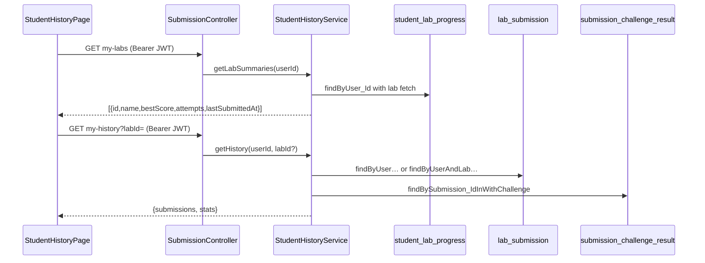

# feat: Student submission history APIs - Plan

## Goal Capsule

**Objective:** Ship JWT-scoped read APIs that populate the student Submission History page with live submission data, per-lab performance sidebar, contextual summary stats, and challenge-level grading detail per attempt.

**Product authority:** Session brainstorm decisions (no requirements-only artifact was written). This plan bootstraps the Product Contract from that dialogue.

**Stop conditions:** Do not add pagination, text search, field/method/constructor drill-down, or lecturer/Reports endpoint changes. Do not redesign the upload/grading pipeline.

---

## Product Contract

### Actors

- A1. **Authenticated student** — JWT bearer with IRN; reads only their own history.

### Requirements

- R1. `GET /api/submissions/my-labs` returns every lab the student has attempted, each with lab id, name, best score, attempt count, and last submitted timestamp.
- R2. `GET /api/submissions/my-history` returns a submissions array plus a stats block for the authenticated student.
- R3. Optional `labId` query param on `my-history` filters submissions to one lab; when present, stats (R4) are computed for that lab only.
- R4. Stats block fields: `labsAttempted`, `totalSubmissions`, `averageScore` (mean of all submission scores in scope), `bestScore` (single highest score in scope). Null scores excluded from averages; empty scope yields zeros and null averages.
- R5. Each submission item includes: id, lab (id + name), attemptNumber, score, submittedAt (ISO-8601), and challengeResults array.
- R6. Each challengeResult includes: challengeName, isCorrect, score (0–100 integer or null).
- R7. No field, method, or constructor results in history responses.
- R8. Both endpoints require `Authorization: Bearer` JWT; missing/invalid token returns 401; student without IRN returns 403 (mirror upload gate).
- R9. Full filtered submission list returned in one response (no pagination); client handles table sort in the browser.
- R10. `my-labs` is independent of the `my-history` lab filter — sidebar and dropdown always reflect all attempted labs.

### Key Flows

- F1. Student opens Submission History → frontend loads `my-labs` and `my-history` in parallel → stats cards, performance sidebar, and submissions table populate.
- F2. Student selects a lab in the dropdown → frontend calls `my-history?labId=…` → stats and table update for that lab; `my-labs` unchanged.
- F3. Student expands a submission row → UI shows challengeResults only (pass/fail + score per challenge); status badge derived client-side from challenge pass/fail.

### Acceptance Examples

- AE1. Student with 3 labs and 8 total submissions, no filter: `labsAttempted=3`, `totalSubmissions=8`, `averageScore` = mean of 8 scores, `bestScore` = max score; submissions list has 8 rows ordered by `submittedAt` desc (default server order).
- AE2. Student filters to one lab with 3 attempts scoring 80, 90, 70: `labsAttempted=1`, `totalSubmissions=3`, `averageScore=80`, `bestScore=90`; list has 3 rows for that lab only.
- AE3. Student with no submissions: `my-labs` returns `[]`; `my-history` returns `submissions=[]`, stats zeros/nulls, UI empty states.
- AE4. Expanded row for a submission with 2 challenges (one pass, one fail): challengeResults has two entries with correct names; UI shows PARTIAL status.

### Scope Boundaries

**In scope:** Backend read endpoints, DTOs, service layer, repository queries, batch challenge-result loading, frontend expanded-row alignment to challenge-only, AGENTS.md updates.

**Deferred for later:** Pagination, lab name text search, server-side sort params, pre-computed status field on API, field/method/constructor detail endpoint for history.

**Outside this product's identity:** Lecturer attempt history changes, Reports analytics rewrite, enrollment/roster logic.

### Key Decisions

- KD1. **Endpoint paths `my-history` / `my-labs`** — chosen over documented `submissions/mine` because `StudentHistoryPage.jsx` is already wired to these paths.
  Governs R1, R2.

- KD2. **Stats follow lab filter** — stat cards reflect filtered scope when `labId` is set.
  Governs R3, R4.

- KD3. **Challenge-only expanded detail** — API returns per-challenge results only; member-level breakdown stays on Class tab flows.
  Governs R6, R7.

- KD4. **No pagination** — full filtered list so client-side sort works across all rows (session-settled after pagination/sort conflict).
  Governs R9.

---

## Planning Contract

### Summary

Add `StudentHistoryService` under the submission domain with two GET handlers on `SubmissionController`, reusing JWT parsing and lecturer-history SQL patterns. Data sources: `student_lab_progress` for lab summaries, `lab_submission` for attempt rows, `submission_challenge_result` for challenge detail. Frontend already fetches the endpoints; align expanded row UI to challenge-only and update stale AGENTS.md.

### Key Technical Decisions

- KTD1. **Service location: `StudentHistoryService` in `service/`** — keeps `SubmissionController` thin like `LecturerAnalyticsService` pattern; history is student-self-service, not lecturer analytics.
- KTD2. **JWT auth via existing `SubmissionController.parseAuthHeader`** — extract to package-private helper or duplicate minimally; no global Spring Security change in this work.
- KTD3. **Lab summaries from `student_lab_progress`** — `highest_score`, `attempts_count`, `last_submitted_at` already maintained on upload; avoids aggregating from raw submissions.
- KTD4. **Batch challenge load** — new repository query `findBySubmission_IdInWithChallenge` to avoid N+1 when listing many submissions.
- KTD5. **Server default sort: `submittedAt` descending** — matches lecturer history and table UX; client re-sorts in browser per R9.
- KTD6. **Timestamp format: ISO-8601 strings** — frontend `toLocaleString()` handles display; lecturer drawer uses formatted strings but student page already uses `Date` parsing.

### High-Level Technical Design

### Assumptions

- Per-student submission volume per term is small enough that returning the full filtered list without pagination is acceptable.
- `student_lab_progress` rows exist for every lab with at least one submission (maintained by upload path).
- Legacy submissions missing `submission_challenge_result` rows may show empty `challengeResults`; UI already handles unknown status.

### Sequencing

U1 (DTOs + repository) → U2 (service) → U3 (controller endpoints) → U4 (frontend alignment) → U5 (docs).

---

## Implementation Units

### U1. Response DTOs and repository queries

**Goal:** Define API response shapes and add data-access methods for history reads.

**Requirements:** R1, R2, R5, R6, R10

**Dependencies:** None

**Files:**
- `backend/src/main/java/com/eiu/capstone/backend/DTO/StudentLabSummaryDTO.java` (create)
- `backend/src/main/java/com/eiu/capstone/backend/DTO/StudentHistoryStatsDTO.java` (create)
- `backend/src/main/java/com/eiu/capstone/backend/DTO/StudentSubmissionHistoryItemDTO.java` (create)
- `backend/src/main/java/com/eiu/capstone/backend/DTO/StudentChallengeResultDTO.java` (create)
- `backend/src/main/java/com/eiu/capstone/backend/DTO/StudentHistoryResponse.java` (create)
- `backend/src/main/java/com/eiu/capstone/backend/repository/StudentLabProgressRepository.java` (modify)
- `backend/src/main/java/com/eiu/capstone/backend/repository/SubmissionChallengeResultRepository.java` (modify)

**Approach:**
1. DTO records mirror frontend expectations: lab summary `{id, name, bestScore, attempts, lastSubmittedAt}`; history item with nested `lab` and `challengeResults`.
2. Add `findByUser_IdWithLabOrderByLastSubmittedAtDesc(UUID userId)` on progress repo with `JOIN FETCH` lab.
3. Add batch query on challenge results: `findBySubmission_IdInWithChallenge(List<UUID> submissionIds)`.

**Patterns to follow:** `LabAttemptHistoryItemDTO`, `AnalyticsMapper` timestamp handling.

**Test scenarios:**
- Repository integration (manual/Swagger): progress query returns labs for a student with submissions.
- Batch challenge query returns results for multiple submission IDs in one call.

**Verification:** DTOs compile; repository methods exist and are callable from a service test or Swagger after U3.

---

### U2. StudentHistoryService

**Goal:** Implement business logic for lab summaries, filtered submission lists, stats computation, and challenge result assembly.

**Requirements:** R1–R7, R10

**Dependencies:** U1

**Files:**
- `backend/src/main/java/com/eiu/capstone/backend/service/StudentHistoryService.java` (create)
- `backend/src/test/java/com/eiu/capstone/backend/service/StudentHistoryServiceTest.java` (create — first backend unit tests for this feature)

**Approach:**
1. `getLabSummaries(userId)` — map progress rows to `StudentLabSummaryDTO`; `bestScore` from `highest_score`, `attempts` from `attempts_count`.
2. `getHistory(userId, optionalLabId)` — load submissions via `findByUserOrderBySubmittedAtDesc` or `findByUserAndLabOrderByAttemptNumberDesc`; batch-load challenge results; map to items.
3. `computeStats(submissions, optionalLabId)` — when filtered, `labsAttempted` is 1 if any rows else 0; when unfiltered, count distinct lab ids; `totalSubmissions` = list size; average = mean of non-null scores; best = max score.
4. Challenge mapping: `challengeName` from joined `Challenge.name`, `isCorrect`, `score` as rounded int percent.

**Execution note:** Add unit tests for stats edge cases (empty list, single lab filter, null scores) before wiring controller.

**Test scenarios:**
- Covers AE1. Empty submissions → stats with zeros/nulls, empty list.
- Covers AE2. Three submissions same lab → filtered stats match lab scope.
- Covers AE3. No submissions → empty labs and history.
- Mean calculation excludes null scores; bestScore null when no scores.
- Unfiltered `labsAttempted` counts distinct labs in submission list.

**Verification:** `mvn test -Dtest=StudentHistoryServiceTest` passes.

---

### U3. SubmissionController GET endpoints

**Goal:** Expose authenticated read endpoints matching frontend URLs.

**Requirements:** R1, R2, R3, R8

**Dependencies:** U2

**Files:**
- `backend/src/main/java/com/eiu/capstone/backend/controller/SubmissionController.java` (modify)
- `backend/AGENTS.md` (modify — API surface table)

**Approach:**
1. `GET /my-labs` — parse JWT, resolve user by email, return `List<StudentLabSummaryDTO>`.
2. `GET /my-history` — optional `@RequestParam UUID labId`; validate lab exists when provided (404 if invalid lab id).
3. Reuse `parseAuthHeader` and IRN gate from upload handler.
4. Return `StudentHistoryResponse` JSON.

**Test scenarios:**
- Covers AE1. Valid student JWT → 200 with submissions and stats.
- Missing Authorization → 401.
- Invalid `labId` → 404.
- Teacher account without IRN → 403 on history reads.

**Verification:** Manual via Swagger or frontend with logged-in student; `GET /api/submissions/my-history` returns 200.

---

### U4. Frontend expanded-row alignment

**Goal:** Match UI to challenge-only API contract; remove member-level detail blocks that will no longer receive data.

**Requirements:** R6, R7, F3

**Dependencies:** U3

**Files:**
- `frontend/src/components/student/StudentHistoryPage.jsx` (modify)
- `frontend/src/components/student/AGENTS.md` (modify)
- `frontend/src/pages/AGENTS.md` (modify)

**Approach:**
1. Remove `DetailRow` usage for fields/methods/constructors in expanded section.
2. Keep challenge results grid; remove empty-state branch that references fieldResults.
3. Status badge logic unchanged (derived from `challengeResults`).

**Test scenarios:**
- Manual: expand row shows challenge cards only; no Fields/Methods/Constructors columns.
- Lab filter still triggers refetch; stats update per filter.

**Verification:** Student history page loads live data with no console errors; expanded rows render challenge results.

---

### U5. Documentation and DOX pass

**Goal:** Update owning AGENTS.md files to reflect live APIs and remove stale mock references.

**Requirements:** KD1

**Dependencies:** U3, U4

**Files:**
- `backend/AGENTS.md`
- `frontend/AGENTS.md`
- `frontend/src/components/student/AGENTS.md`
- `frontend/src/pages/AGENTS.md`

**Approach:** Document new endpoints in backend API table; replace "mock HISTORY" and `submissions/mine` planned notes with `my-history` / `my-labs`.

**Test expectation:** none — documentation only.

**Verification:** AGENTS.md files accurately describe live endpoints.

---

## Verification Contract

| Check | Command / action |
|---|---|
| Backend unit tests | `cd backend && mvn test -Dtest=StudentHistoryServiceTest` |
| Backend compile | `cd backend && mvn -q compile` |
| Frontend build | `cd frontend && npm run build` |
| Manual student flow | Log in as student → Submission History → verify stats, sidebar, table, lab filter, row expand |

No automated frontend test suite exists; manual verification required.

---

## Definition of Done

**Global:**
- [ ] `GET /api/submissions/my-labs` and `GET /api/submissions/my-history` return correct JSON for authenticated students
- [ ] Lab filter updates stats and submission list; sidebar unchanged
- [ ] Challenge-only detail in API and UI
- [ ] AGENTS.md chain updated
- [ ] `StudentHistoryServiceTest` passes

**Per unit:** Each U-ID verification section above satisfied.

---

## Risks & Dependencies

| Risk | Mitigation |
|---|---|
| N+1 on challenge load | U1 batch query |
| Missing challenge rows on old submissions | Empty `challengeResults`; UI shows unknown/partial gracefully |
| JWT-only auth on new endpoints while other APIs are open | Acceptable; matches upload pattern; document in AGENTS.md |

**Prerequisites:** Student must have submitted at least once to see data; no migration required.

---

## Sources & Research

- `frontend/src/components/student/StudentHistoryPage.jsx` — API contract and UI fields
- `backend/src/main/java/com/eiu/capstone/backend/analytics/service/LecturerAnalyticsService.getLabAttemptHistory` — attempt row pattern
- `backend/src/main/java/com/eiu/capstone/backend/repository/LabSubmissionRepository` — history-oriented queries
- `backend/src/main/java/com/eiu/capstone/backend/model/StudentLabProgress` — aggregate fields
- Session brainstorm dialogue — stats semantics, filter/sort, scope boundaries
