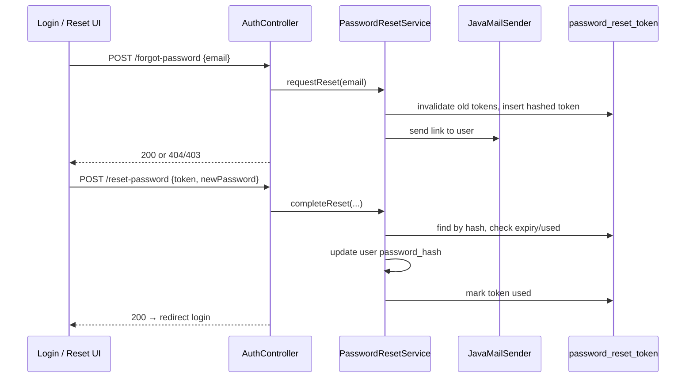
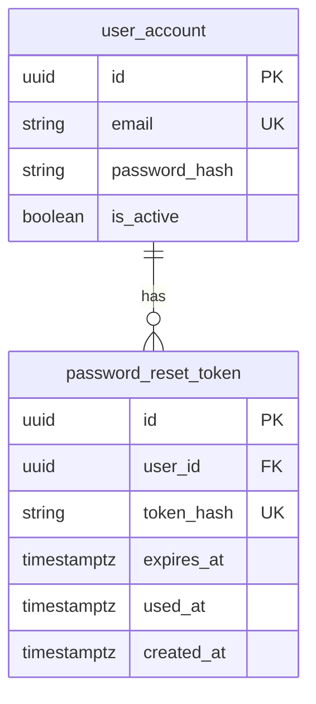

# feat: Forgot password via email reset link - Plan

## Goal Capsule

**Objective:** Let any registered user who forgot their IRN+password login recover access by entering their school email, receiving a reset link from `projectg5741@gmail.com`, and setting a new password on a dedicated reset page.

**Product authority:** Session brainstorm decisions (no requirements-only artifact was written). This plan bootstraps the Product Contract from that dialogue.

**Stop conditions:** Do not add rate limiting, CAPTCHA, or account lockout. Do not change the logged-in change-password flow. Do not introduce React Router or URL-path routing for the SPA.

---

## Product Contract

### Actors

- A1. **Unauthenticated user** — anyone on the login screen who cannot sign in with IRN+password and needs to reset it.
- A2. **Registered account holder** — student or lecturer with an email on file in `user_account`; may normally sign in via Google only.

### Requirements

- R1. Login screen exposes a working **Forgot password?** entry point.
- R2. User enters **school email only** (not IRN) to request a reset.
- R3. If no account exists for the email, the API returns a **specific not-found error** and the UI shows it clearly.
- R4. If an account exists (student or lecturer, including Google-only users), the system sends an email from **`projectg5741@gmail.com`** containing a link to the password reset page.
- R5. Reset link expires **15 minutes** after issuance.
- R6. Reset link is **single-use** — consumed on successful password change.
- R7. Reset page collects **new password** and **confirm password** with the same validation rules as change-password (6–100 characters, must match).
- R8. On successful reset, show a success message and **redirect to login**; user signs in manually with the new password.
- R9. Inactive (`is_active = false`) accounts are rejected with a specific error on forgot-password request.
- R10. Expired, already-used, or invalid tokens are rejected on reset with a clear error; user can restart forgot-password from login.

### Key Flows

- F1. **Request reset** — Login → Forgot password → enter email → submit → success message ("check your email") or specific error.
- F2. **Complete reset** — User opens email link → reset page loads with token from URL → enter new + confirm password → submit → success → redirect to login.
- F3. **Sign in after reset** — User enters IRN + new password on login screen (or continues using Google if preferred).

### Acceptance Examples

- AE1. Student enters registered `@eiu.edu.vn` email → receives email from `projectg5741@gmail.com` with a working link → sets new password → logs in with IRN + new password.
- AE2. User enters unregistered email → UI shows explicit "account not found" (or equivalent) message; no email sent.
- AE3. Lecturer account email → same flow as student; reset succeeds.
- AE4. Google-only user requests reset → email sent → after reset they can use IRN+password or Google.
- AE5. Link opened after 15 minutes → reset page shows expired-token error; user can request a new link.
- AE6. Same link used twice → second attempt fails with used/invalid token error.

### Scope Boundaries

**In scope:** Backend mail integration, reset-token persistence, two public auth endpoints, forgot/reset UI screens, env/config documentation, unit tests for reset service logic, AGENTS.md updates.

**Deferred for later:** Rate limiting, CAPTCHA, audit log UI, admin-initiated password reset, email template branding beyond plain text.

**Outside this product's identity:** OAuth provider changes, JWT/session architecture overhaul, React Router adoption.

### Key Decisions

- KD1. **Email-only identifier** — chosen over IRN lookup because every account has a unique email and the reset link must reach an inbox.
  Governs R2.

- KD2. **Specific not-found errors** — chosen over generic "if account exists" messaging for clearer UX; accepts email-enumeration trade-off.
  Governs R3.

- KD3. **All registered active accounts** — students and lecturers; Google-only users included.
  Governs R4.

- KD4. **15-minute link expiry** — session-settled.
  Governs R5.

- KD5. **Login redirect after reset** — no auto-login/JWT issuance on reset.
  Governs R8.

- KD6. **One-time database token** — chosen over stateless signed JWT in URL because tokens must be revocable, single-use, and independent of the app's in-memory JWT signing key.
  Governs R6, R10.

---

## Planning Contract

### Summary

Add `spring-boot-starter-mail`, a `password_reset_token` table and JPA entity, `PasswordResetService` with hashed opaque tokens, and two public `AuthController` endpoints. Email links point to `{FRONTEND_URL}?resetToken={rawToken}` so the existing state-based SPA (no React Router) can detect the token on load. Frontend adds forgot-password and reset-password screens styled like `LoginUI`, wired from the existing dormant link.

**Product Contract preservation:** Unchanged — bootstrapped from session brainstorm; no separate requirements artifact to diff.

### Key Technical Decisions

- KTD1. **`spring-boot-starter-mail` + Gmail SMTP** — send from `projectg5741@gmail.com` via `smtp.gmail.com:587` with TLS; credentials via env vars (`MAIL_USERNAME`, `MAIL_PASSWORD` app password). No third-party email API.
- KTD2. **Token storage: SHA-256 hash of random 32-byte URL-safe token** — raw token only in email URL and request body; DB stores hash + `expires_at` + `used_at`.
- KTD3. **Invalidate prior unused tokens** on new forgot-password request for the same user — only the latest link works.
- KTD4. **Reset URL shape: query param on app root** — `{FRONTEND_URL}?resetToken={token}`; `App.jsx` reads `URLSearchParams` on mount and renders `ResetPasswordUI` when present. Avoids SPA path routing without Vercel rewrites.
- KTD5. **Password rules reuse `UserService.changePassword` constraints** — extract shared validation helper or call equivalent checks (6–100 chars, not identical to current hash optional for forgot flow since Google-only users may have never logged in with password).
- KTD6. **Public endpoints on existing `AuthController`** — `POST /api/auth/forgot-password`, `POST /api/auth/reset-password`; no JWT required; consistent with current open `SecurityConfig`.
- KTD7. **Schema via external DDL** — repo has no Flyway/Liquibase; document `CREATE TABLE` in plan and AGENTS.md for manual application alongside JPA entity.

### High-Level Technical Design

### Assumptions

- Gmail app password for `projectg5741@gmail.com` will be provisioned and set in deployment env before production use.
- `FRONTEND_URL` in backend env matches the deployed SPA origin (already used for CORS).
- Manual DDL application to PostgreSQL is acceptable (matches existing schema management practice).

### Sequencing

U1 (schema + entity) → U2 (mail config) → U3 (service + endpoints + tests) → U4 (frontend) → U5 (docs).

---

## Implementation Units

### U1. Reset token persistence

**Goal:** Persist one-time reset tokens with expiry and usage tracking.

**Requirements:** R5, R6, R10; KD6

**Dependencies:** None

**Files:**
- `backend/src/main/java/com/eiu/capstone/backend/model/PasswordResetToken.java` (create)
- `backend/src/main/java/com/eiu/capstone/backend/repository/PasswordResetTokenRepository.java` (create)
- `docs/plans/sql/password_reset_token.sql` (create — DDL reference for manual apply)

**Approach:**
1. Entity maps to `password_reset_token` with `user_id` FK to `user_account`, `token_hash` (unique), `expires_at`, `used_at` (nullable), `created_at`.
2. Repository methods: `deleteByUser_IdAndUsedAtIsNull`, `findByTokenHashAndUsedAtIsNull`, optional `deleteByExpiresAtBefore` for cleanup.
3. DDL file documents the `CREATE TABLE` statement for operators.

**Patterns to follow:** `UserAccount` JPA style; UUID primary keys like other entities.

**Test scenarios:**
- Entity/repository compile and map expected columns.
- Manual: apply DDL in dev DB, confirm JPA can insert and query a row.

**Verification:** `mvn -q compile`; DDL file present and matches entity fields.

---

### U2. Mail configuration and sender

**Goal:** Enable outbound email from `projectg5741@gmail.com`.

**Requirements:** R4

**Dependencies:** None (parallel with U1)

**Files:**
- `backend/pom.xml` (modify — add `spring-boot-starter-mail`)
- `backend/src/main/resources/application.yml` (modify — `spring.mail.*` with env placeholders)
- `backend/.env.backend.example` (modify — mail vars)
- `backend/src/main/java/com/eiu/capstone/backend/service/PasswordResetEmailService.java` (create)

**Approach:**
1. Configure SMTP host `smtp.gmail.com`, port `587`, STARTTLS, auth from `MAIL_USERNAME` / `MAIL_PASSWORD`.
2. Set default from address `projectg5741@gmail.com` via `MAIL_FROM` (default same as username).
3. `PasswordResetEmailService.sendResetLink(email, resetUrl)` builds plain-text body with the link and a short expiry notice (15 minutes).
4. Swallow/log mail failures and surface 503 or 500 to client with generic "unable to send email" — document in tests.

**Patterns to follow:** Spring Boot 3.2 mail auto-configuration; dotenv import already in `application.yml`.

**Test scenarios:**
- With invalid mail credentials, forgot-password returns an error (manual or mocked integration).
- Email body contains the full reset URL passed in.

**Verification:** Backend starts with mail properties set; `PasswordResetEmailService` unit-testable with mocked `JavaMailSender`.

---

### U3. Password reset service and auth endpoints

**Goal:** Implement forgot-password and reset-password business logic and HTTP API.

**Requirements:** R2–R10, F1–F3; KD1–KD6

**Dependencies:** U1, U2

**Files:**
- `backend/src/main/java/com/eiu/capstone/backend/service/PasswordResetService.java` (create)
- `backend/src/main/java/com/eiu/capstone/backend/model/ForgotPasswordRequest.java` (create)
- `backend/src/main/java/com/eiu/capstone/backend/model/ResetPasswordRequest.java` (create)
- `backend/src/main/java/com/eiu/capstone/backend/controller/AuthController.java` (modify)
- `backend/src/test/java/com/eiu/capstone/backend/service/PasswordResetServiceTest.java` (create)

**Approach:**
1. `requestReset(email)` — trim/lowercase email; lookup `user_account`; 404 if missing; 403 if `!is_active`; generate `SecureRandom` URL-safe token; store SHA-256 hash with `expires_at = now + 15m`; delete prior unused tokens for user; build URL `{frontendUrl}?resetToken={raw}`; send email; return void/200.
2. `completeReset(token, newPassword, confirmPassword)` — 400 if passwords blank/mismatch/length; hash token; lookup unused non-expired row; 400 if not found/expired; update `password_hash` via `PasswordEncoder`; set `used_at`; save user.
3. AuthController adds two `@PostMapping` handlers with `@Valid` request bodies.
4. Reuse password length validation aligned with `UserService.changePassword`.

**Patterns to follow:** `AuthController` existing login handlers; `UserService` password rules; Mockito unit tests like `StudentHistoryServiceTest`.

**Test scenarios:**
- Covers AE2. Unknown email → throws 404 / not found.
- Covers AE5. Expired token → reject reset.
- Covers AE6. Used token → second reset fails.
- Valid token + matching passwords → password hash updated, token marked used.
- Inactive user → 403 on request.
- Mismatched confirm password → 400.
- New request invalidates previous unused token (only latest works).

**Verification:** `mvn test -Dtest=PasswordResetServiceTest` passes; Swagger shows new endpoints.

---

### U4. Frontend forgot and reset screens

**Goal:** Wire UI flows from login through email link to password reset.

**Requirements:** R1, R7, R8, F1–F3; KTD4

**Dependencies:** U3

**Files:**
- `frontend/src/pages/ForgotPasswordUI.jsx` (create)
- `frontend/src/pages/ResetPasswordUI.jsx` (create)
- `frontend/src/pages/LoginUI.jsx` (modify — wire forgot link, render forgot screen)
- `frontend/src/App.jsx` (modify — detect `resetToken` query param)
- `frontend/src/pages/LoginUI.css` (modify if shared styles needed)

**Approach:**
1. `LoginUI`: `showForgotPassword` state (mirror `showFirstTimeSetup`); forgot link sets true; render `ForgotPasswordUI` with back-to-login.
2. `ForgotPasswordUI`: email field, submit → `POST /api/auth/forgot-password`; show API error for 404; success state instructs user to check email.
3. `App.jsx`: on initial render, if `new URLSearchParams(window.location.search).get('resetToken')` → render `ResetPasswordUI` with token prop (even when not logged in); on success clear query param and show login with success banner/message.
4. `ResetPasswordUI`: new + confirm fields with show/hide toggles; validation matching `ChangePasswordModal`; submit → `POST /api/auth/reset-password`; handle expired/invalid errors; success → redirect to login.
5. Match `LoginUI` dark theme and layout patterns.

**Patterns to follow:** `FirstTimeSetupUI` overlay pattern; `ChangePasswordModal` validation UX.

**Test scenarios:**
- Covers AE1. End-to-end manual: request → email link → reset → login.
- Covers AE3. Lecturer email path (manual).
- Covers AE4. Google-only user reset then IRN login (manual).
- Forgot screen shows server error text on unknown email.
- Reset screen shows error for expired token (manual with mocked short expiry or old token).

**Test expectation:** none for automated frontend — manual verification per project convention.

**Verification:** `npm run build` succeeds; manual flows in AE1–AE6.

---

### U5. Documentation and environment

**Goal:** Document new endpoints, env vars, and schema for operators and future agents.

**Requirements:** all

**Dependencies:** U3, U4

**Files:**
- `backend/AGENTS.md` (modify)
- `backend/src/main/java/com/eiu/capstone/backend/service/AGENTS.md` (modify)
- `frontend/AGENTS.md` (modify)
- `frontend/src/pages/AGENTS.md` (modify)
- `backend/README.md` (modify — mail env vars)

**Approach:**
1. Add auth endpoints to backend API table.
2. Document mail env vars and Gmail app-password setup note.
3. Document `password_reset_token` table and DDL path.
4. Update frontend pages AGENTS.md with forgot/reset screens and query-param routing.

**Test expectation:** none — documentation only.

**Verification:** AGENTS.md chain reflects live behavior.

---

## Verification Contract

| Check | Command / action |
|---|---|
| Backend unit tests | `cd backend && mvn test -Dtest=PasswordResetServiceTest` |
| Backend compile | `cd backend && mvn -q compile` |
| Frontend build | `cd frontend && npm run build` |
| Manual forgot flow | Login → Forgot password → valid email → email received from `projectg5741@gmail.com` |
| Manual reset flow | Open link → set password → login with IRN + new password |
| Edge cases (AE2–AE6) | Unknown email error, lecturer account, Google-only user, expired link, reused link |

Apply `docs/plans/sql/password_reset_token.sql` to dev/prod PostgreSQL before testing persistence.

---

## Definition of Done

**Global:**
- [ ] Forgot password link on login opens request screen
- [ ] Email arrives from `projectg5741@gmail.com` with working 15-minute link
- [ ] Reset page accepts new + confirm password and redirects to login on success
- [ ] Unknown email, inactive account, expired, and used tokens handled per R3, R9, R10
- [ ] `PasswordResetServiceTest` passes
- [ ] AGENTS.md and env examples updated

**Per unit:** Each U-ID verification section above satisfied.

---

## Risks & Dependencies

| Risk | Mitigation |
|---|---|
| Gmail SMTP blocked or app password not provisioned | Document setup in README; fail loudly in forgot-password with clear operator message |
| Email link prefetchers consume token | Low risk for edu mail; single-use + 15m expiry limits blast radius; defer scanner-specific mitigations |
| Email enumeration via specific 404 | Accepted product trade-off (KD2) |
| SPA query-param routing confuses bookmarks | Clear URL cleanup after success; document `resetToken` param |
| No migration tooling | Ship DDL file; operator applies manually |

**Prerequisites:** PostgreSQL DDL applied; `MAIL_*` and `FRONTEND_URL` env vars set in deployment.

---

## Open Questions

| Question | Status |
|---|---|
| Exact wording for user-facing error messages | Deferred — implementer chooses clear copy consistent with existing API style |
| HTML email template vs plain text | Deferred — plain text sufficient for v1 |

---

## Sources & Research

- Session brainstorm dialogue — identifier, expiry, enumeration, actor scope, post-reset behavior
- `frontend/src/pages/LoginUI.jsx` — dormant forgot link (lines 233–235)
- `backend/src/main/java/com/eiu/capstone/backend/service/UserService.java` — password validation rules
- `backend/src/main/java/com/eiu/capstone/backend/controller/AuthController.java` — auth endpoint patterns
- `frontend/src/App.jsx` — state-based navigation (no React Router)
- `docs/plans/2026-08-08-001-feat-student-history-apis-plan.md` — plan artifact shape reference
- Subagent grounding: no existing mail infrastructure; change-password is JWT-gated only
