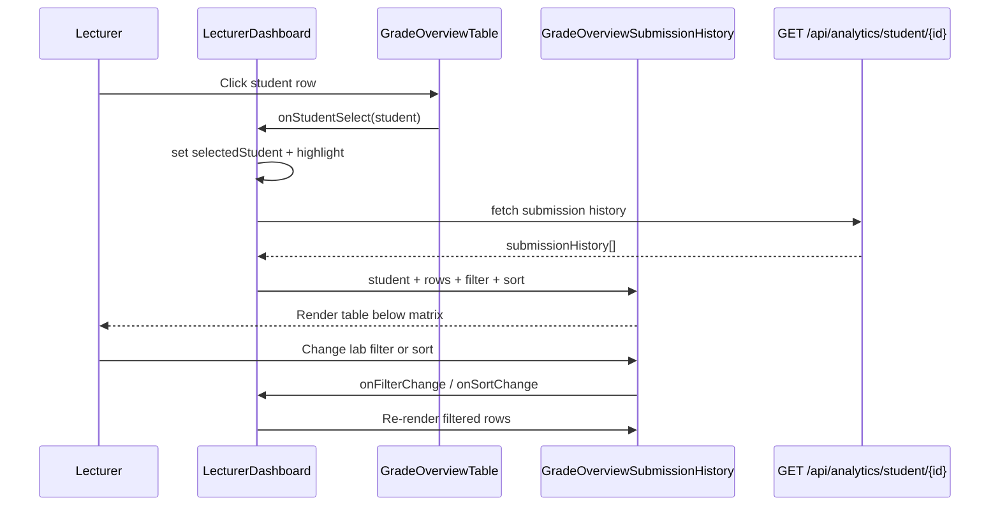

# feat: Grading tab row selection and submission history panel - Plan

## Goal Capsule

**Objective:** On the lecturer **Grading** tab, let a lecturer click a student row in the cross-lab grade matrix to highlight that row and show an inline submission history panel below the table — every submission across all labs, with lab filter and date sort controls.

**Product authority:** Session brainstorm decisions (no requirements-only artifact was written). This plan bootstraps the Product Contract from that dialogue.

**Stop conditions:** Do not add an Attempts column, date-range filtering, or a side drawer. Do not change grade-overview scoring. Prefer reusing the existing analytics student report API over new backend endpoints unless verification shows it is unsuitable.

---

## Product Contract

### Actors

- A1. **Lecturer** — signed-in user with `LECTURER` role on the Grading tab (`activeNav === 'grading'`).

### Requirements

- R1. Each student row in the grade overview table is **clickable**; the clicked row receives a visible **highlight** state.
- R2. Only one student may be selected at a time; clicking a different row moves selection and refreshes the history panel.
- R3. Below the grade matrix, an inline **submission history panel** appears when a student is selected.
- R4. The history lists **every submission** for the selected student across all labs — if Lab 1 was submitted twice, two Lab 1 rows appear.
- R5. History columns are **Student**, **ID**, **Lab**, **Submitted At**, and **Score** — no Attempts column.
- R6. **ID** matches the Grading table identifier (**IRN**) for the selected student row.
- R7. A **lab filter** narrows visible history rows to one lab or shows all labs.
- R8. A **date sort control** toggles submission order between newest-first and oldest-first (sort only — no date-range filter).
- R9. Empty states are explicit: no student selected (panel hidden or prompt), no submissions for student, and API error messaging.
- R10. Selection and loaded history **persist** when the lecturer paginates the grade overview table to another page (as long as the selected student remains addressable by `studentId`).

### Key Flows

- F1. **Select student** — Lecturer clicks a row → row highlights → history panel loads below.
- F2. **Filter and sort** — Lecturer changes lab filter or date sort → table updates without losing row selection.
- F3. **Switch student** — Lecturer clicks another row → highlight moves → history reloads for the new student.
- F4. **Paginate grade matrix** — Lecturer changes overview page while a student is selected → highlight and history panel remain for that student.

### Acceptance Examples

- AE1. Student with two Lab 1 submissions and one Lab 2 submission shows three history rows when "All Labs" is selected.
- AE2. Lab filter set to "Lab 1" shows only the two Lab 1 rows.
- AE3. Date sort toggled to oldest-first shows earliest submission at the top.
- AE4. Clicking a different student row moves highlight and replaces history content.
- AE5. Student with zero submissions shows an empty-state message in the panel, not a broken table.
- AE6. After paginating the grade overview away from the selected student’s row, the history panel still shows that student’s data.

### Scope Boundaries

**In scope:** `GradeOverviewTable` row selection UX, new inline history panel component, `LecturerDashboard.jsx` wiring, `GET /api/analytics/student/{studentId}` integration, client-side lab filter and date sort, AGENTS.md updates.

**Deferred for later:** Date-range filtering, Attempts column, pagination inside history panel, export from history panel, row click on individual lab score cells to filter by lab.

**Outside this product's identity:** Student-facing history changes, new analytics report sections (grade trend, AI recommendation), drawer-based history on this tab.

### Key Decisions

- KD1. **All submissions, no Attempts column** — session-settled: every `lab_submission` row is listed; attempt number is omitted from the UI.
  Governs R4, R5.

- KD2. **Lab filter + date sort only** — session-settled: filter by lab name; date control sorts newest/oldest, does not filter by calendar range.
  Governs R7, R8.

- KD3. **Inline panel below table** — chosen over reusing `LabAttemptHistoryDrawer` because the product shape is cross-lab history on the Grading page, not per-lab drawer UX.
  Governs R3.

- KD4. **ID = IRN** — matches the Grading matrix column; uses the selected overview row’s `irn`, not `profile.studentCode` from the analytics response.
  Governs R6.

---

## Planning Contract

### Summary

Extend `GradeOverviewTable` with `selectedStudentId` and `onStudentSelect`. Add `GradeOverviewSubmissionHistory.jsx` below the table in the Grading section. On selection, fetch `GET /api/analytics/student/{studentId}` and render `submissionHistory` rows with client-side lab filter and date sort. Student name and IRN come from the selected grade-overview row; lab/score/submittedAt from each history item.

**Product Contract preservation:** Unchanged — bootstrapped from session brainstorm; open call-outs resolved as assumptions below.

### Key Technical Decisions

- KTD1. **Data source: `GET /api/analytics/student/{studentId}`** — existing `StudentReportResponse.submissionHistory` (`labName`, `score`, `submittedAt`; `attempt` present in payload but not displayed per R5). No new backend endpoint unless manual verification shows missing rows vs. `lab_submission` truth.
- KTD2. **History panel is presentational** — parent (`LecturerDashboard.jsx`) owns fetch state, selected student, lab filter value, and sort direction; matches lecturer component convention (data fetching in page, tables presentational).
- KTD3. **Lab filter options** — `"All Labs"` plus unique `labName` values from the fetched `submissionHistory` array (or from `gradeOverview.labs` for stable ordering when history is empty).
- KTD4. **Date sort** — client-side reorder of filtered rows by parsed `submittedAt`; default newest-first (matches API `ORDER BY submitted_at DESC`).
- KTD5. **Row highlight styling** — Tailwind selected state consistent with app (e.g. `bg-purple-50 dark:bg-purple-900/20` + `cursor-pointer` on rows); pass `selectedStudentId` for comparison.
- KTD6. **Selection persistence on pagination** — keep `selectedGradeStudent` in `LecturerDashboard` state independent of `gradeOverview.content` page; do not clear on `handleGradeOverviewPageChange`.

### Assumptions

- `GET /api/analytics/student/{studentId}` is callable from the lecturer SPA without JWT (consistent with other analytics routes under open `SecurityConfig`).
- IRN on the grade-overview row is the correct **ID** display value (brainstorm call-out defaulted).
- History panel is hidden until the first row click (no placeholder occupying space).

### Risks & Dependencies

| Risk | Mitigation |
|---|---|
| Analytics payload includes extra sections (AI, trends) we do not use | Ignore non-`submissionHistory` fields; do not render report chrome |
| `submittedAt` format inconsistent for sorting | Parse defensively; fall back to string compare or API order |
| Large submission counts slow render | Acceptable for current scale; defer history pagination |

### High-Level Technical Design

---

## Implementation Units

### U1. Selectable grade overview rows

**Goal:** Grade matrix rows are clickable and show a selected highlight.

**Requirements:** R1, R2

**Dependencies:** None

**Files:**
- `frontend/src/components/lecturer/GradeOverviewTable.jsx`

**Approach:**
1. Add props: `selectedStudentId`, `onStudentSelect(studentRow)`.
2. Add `onClick` on each student `<tr>`; `cursor-pointer` and hover styles.
3. Apply highlight class when `student.studentId === selectedStudentId`.
4. Use `type="button"` or row click handler without nested buttons; keep keyboard accessibility minimal (click-first matches existing tables).

**Patterns to follow:** `StudentHistoryPage.jsx` row selection/expand interaction; `SubmissionTable.jsx` action column pattern.

**Test scenarios:**
- Clicking a row invokes `onStudentSelect` with that student object
- Selected row has distinct background class
- Clicking a second row updates selection callback

**Test expectation:** none — no frontend test harness.

**Verification:** Manual row click highlights one row at a time.

---

### U2. Submission history panel component

**Goal:** Presentational panel with filter, sort, and history table.

**Requirements:** R3, R5, R6, R7, R8, R9

**Dependencies:** U1

**Files:**
- `frontend/src/components/lecturer/GradeOverviewSubmissionHistory.jsx` (new)

**Approach:**
1. Props: `student` (name + irn from overview row), `submissions` (normalized rows), `loading`, `error`, `labFilter`, `onLabFilterChange`, `sortDirection` (`desc` | `asc`), `onSortDirectionChange`, `labOptions`.
2. Section title e.g. "Submission history" with student name subtitle.
3. Toolbar: lab `<select>` (`All Labs` + options) and sort toggle/button (Newest first / Oldest first).
4. Table columns: Student, ID, Lab, Submitted At, Score — use `formatText`, `formatPercent`, format dates consistently with `LabAttemptHistoryDrawer` / `SubmissionTable`.
5. Empty: "No submissions yet" when `submissions` filtered to zero; loading spinner; error text in amber.

**Patterns to follow:** `LabAttemptHistoryDrawer.jsx` table styling; `StudentHistoryPage.jsx` lab filter dropdown.

**Test scenarios:**
- Covers AE2. Lab filter hides non-matching lab rows
- Covers AE3. Sort toggle reverses row order
- Covers AE5. Empty submissions shows message, not crash

**Test expectation:** none — manual verification.

**Verification:** Component renders with mock props in isolation via manual check on Grading tab.

---

### U3. Wire Grading tab selection and analytics fetch

**Goal:** End-to-end lecturer flow on Grading tab.

**Requirements:** R4, R10, F1–F4

**Dependencies:** U1, U2

**Files:**
- `frontend/src/pages/LecturerDashboard.jsx`

**Approach:**
1. State: `selectedGradeStudent` (overview row object or null), `gradeStudentHistory` (array), `loadingGradeStudentHistory`, `gradeStudentHistoryError`, `historyLabFilter` (default `All Labs`), `historySortDirection` (default `desc`).
2. On `onStudentSelect`, set selected student and call `fetchStudentSubmissionHistory(studentId)`.
3. `fetchStudentSubmissionHistory`: `GET /api/analytics/student/{studentId}` with `authHeaders()`; map `data.submissionHistory` to panel rows attaching `studentName` and `irn` from selected overview row.
4. Reset `historyLabFilter` to `All Labs` when selected student changes.
5. Render `GradeOverviewSubmissionHistory` below `GradeOverviewTable` when `selectedGradeStudent` is set.
6. Client-side filter: if lab filter not `All Labs`, keep rows where `labName` matches.
7. Client-side sort: order by `submittedAt` per `historySortDirection`.
8. Do not clear `selectedGradeStudent` in `handleGradeOverviewPageChange`.

**Patterns to follow:** `Reports.jsx` analytics `fetch`; `LabAttemptHistoryDrawer.jsx` fetch/error handling.

**Test scenarios:**
- Covers AE1. Multiple rows for same lab all appear
- Covers AE4. Switching students reloads history
- Covers AE6. Pagination does not clear selection or panel
- API failure shows error state without breaking grade table

**Test expectation:** none — manual verification.

**Verification:** Manual AE1–AE6 on running app; `npm run build` passes.

---

### U4. Update lecturer DOX

**Goal:** Document Grading tab row selection and history panel.

**Requirements:** (documentation)

**Dependencies:** U3

**Files:**
- `frontend/src/components/lecturer/AGENTS.md`
- `frontend/src/pages/AGENTS.md`

**Approach:**
1. Add `GradeOverviewSubmissionHistory.jsx` to lecturer components ownership table.
2. Note Grading tab: row click → `GET /api/analytics/student/{studentId}` → inline history panel.
3. Update `pages/AGENTS.md` grading row in lecturer sections table.

**Test expectation:** none — docs only.

**Verification:** AGENTS.md matches implemented behavior.

---

## Verification Contract

| Gate | Command / action | Expect |
|---|---|---|
| Build | `npm run build` from `frontend/` | Exit 0 |
| Manual — select row | Grading tab → click student | Row highlights; panel appears below |
| Manual — all submissions | Student with resubmissions | Duplicate lab rows visible |
| Manual — lab filter | Select one lab | Only that lab’s rows shown |
| Manual — sort | Toggle oldest first | Earliest submission on top |
| Manual — pagination | Select student → change overview page | Panel still shows same student |
| Manual — empty | Student with no submissions | Empty-state message |

No automated frontend test suite.

---

## Definition of Done

**Global:**
- [ ] Clickable highlighted rows on Grading grade matrix
- [ ] Inline submission history panel with correct columns (no Attempts)
- [ ] Lab filter and date sort working
- [ ] `npm run build` succeeds
- [ ] AGENTS.md updated

**Per unit:**
- U1: `GradeOverviewTable` accepts selection props and highlights row
- U2: `GradeOverviewSubmissionHistory.jsx` created
- U3: `LecturerDashboard` fetches analytics and wires panel
- U4: Docs updated

---

## Appendix

### Sources & Research

- `frontend/src/components/lecturer/GradeOverviewTable.jsx` — current read-only matrix
- `frontend/src/components/lecturer/LabAttemptHistoryDrawer.jsx` — per-lab attempt table pattern
- `frontend/src/components/student/StudentHistoryPage.jsx` — lab filter dropdown pattern
- `backend/src/main/java/com/eiu/capstone/backend/controller/AnalyticsController.java` — `GET /api/analytics/student/{studentId}`
- `backend/src/main/java/com/eiu/capstone/backend/analytics/dto/StudentReportResponse.java` — `SubmissionHistoryItem`
- `backend/src/main/java/com/eiu/capstone/backend/analytics/repository/AnalyticsRepository.java` — `findSubmissionHistory` (all labs, ordered by `submitted_at DESC`)

### Alternatives Considered

- **New lecturer history endpoint** — rejected; `GET /api/analytics/student/{studentId}` already returns cross-lab `submissionHistory`.
- **Client-side per-lab fan-out** — rejected; N requests per lab on each row click.
- **Reuse side drawer** — rejected; user requested inline panel below Grading table.
