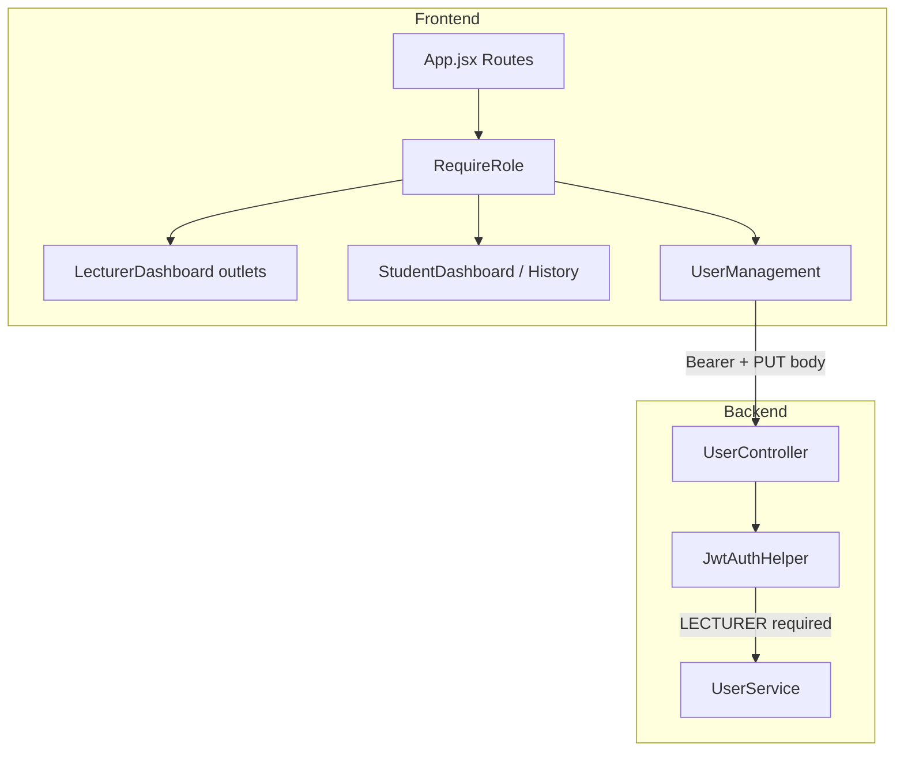
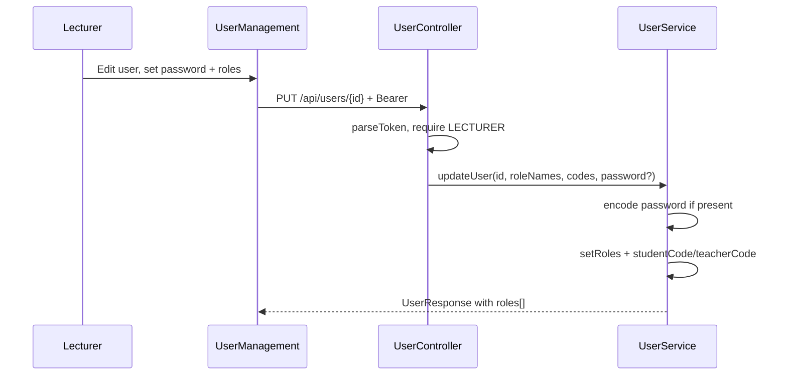

# feat: Lecturer user management — admin password, multi-role, URL routing - Plan

## Goal Capsule

**Objective:** Let lecturers manage users with optional admin password reset on Save, assign STUDENT and/or LECTURER roles with separate IRN fields when both apply, and gate app areas behind URL routes that check JWT roles — dual-role users land on the lecturer dashboard by default and reach student areas only via direct URL.

**Product authority:** Session brainstorm decisions (no requirements-only artifact was written). This plan bootstraps the Product Contract from that dialogue.

**Stop conditions:** Do not add an in-app role switcher, ADMIN in the multi-select UI, or full Spring Security across every API. Do not require the student's current password for lecturer-initiated resets.

---

## Product Contract

### Actors

- A1. **Lecturer** — authenticated user whose JWT `roles` includes `LECTURER`; may use User Management and all `/lecturer-*` routes.
- A2. **Student** — authenticated user whose JWT `roles` includes `STUDENT`; may use `/student-dashboard` and `/student-history`.
- A3. **Dual-role user** — has both `STUDENT` and `LECTURER`; lands on lecturer dashboard after login; may open student routes by URL when both roles are present.

### Requirements

- R1. In User Management **Edit User**, an optional **Password** field sets a new password on Save when filled; blank leaves the password unchanged; no current-password prompt.
- R2. Only an authenticated **lecturer** may list, create, update, or soft-delete users via `/api/users/*`.
- R3. **Role** selection is multi-select with **STUDENT** and **LECTURER** only; at least one role is required.
- R4. When only STUDENT is selected, one **Student IRN** field is shown and stored in `studentCode`; `teacherCode` is cleared.
- R5. When only LECTURER is selected, one **Lecturer IRN** field is shown and stored in `teacherCode`; `studentCode` is cleared.
- R6. When **both** roles are selected, show **Student IRN** and **Lecturer IRN** fields; both codes may differ and are stored independently.
- R7. **Create User** supports the same multi-role and dual-IRN rules as Edit (R3–R6).
- R8. The user table displays all assigned roles per user (e.g. both badges when dual-role).
- R9. The SPA uses these URL routes:
  - `/lecturer-dashboard`, `/lecturer-grading`, `/lecturer-users`, `/lecturer-solution`, `/lecturer-report`
  - `/student-dashboard`, `/student-history`
- R10. Each route checks the signed-in user's roles before rendering; missing role redirects to the user's **default dashboard** (lecturer routes if `LECTURER` present, else student routes if `STUDENT` present).
- R11. After login, routing sends users to their default dashboard: **lecturer-first** when `LECTURER` is in roles, otherwise student dashboard.
- R12. Lecturer nav clicks and header commands update the browser URL to the matching route (replacing `activeNav` / `showHistory` as the source of truth for section).
- R13. Unauthenticated visitors see the login flow; password reset via `?resetToken=` continues to work.

### Key Flows

- F1. **Lecturer resets student password** — Open Edit User → enter new password → Save → student can log in with new password.
- F2. **Assign dual role** — Check STUDENT + LECTURER → enter both IRNs → Save → user has both roles; login works with either IRN.
- F3. **Dual-role student area** — User with both roles logs in → lands on `/lecturer-dashboard` → navigates to `/student-dashboard` manually → student UI loads.
- F4. **Route guard** — Student-only user opens `/lecturer-users` → redirected to `/student-dashboard`.

### Acceptance Examples

- AE1. Lecturer saves Edit User with password `newpass123` → student's next IRN login succeeds with `newpass123`.
- AE2. Lecturer saves Edit User with blank password → student's existing password still works.
- AE3. User with roles `[STUDENT, LECTURER]`, `studentCode=111`, `teacherCode=222` → login with `111` or `222` succeeds.
- AE4. Dual-role user after login lands on `/lecturer-dashboard`; visiting `/student-history` works; visiting `/lecturer-users` works.
- AE5. Student-only user visiting `/lecturer-grading` is redirected to `/student-dashboard`.
- AE6. `GET /api/users/getAllUser` without `Authorization` returns 401.

### Scope Boundaries

**In scope:** `UserController` lecturer JWT guard, `UserService` multi-role + dual-code + admin password, `UserDTO` request shape, `UserManagement` / `UserModal` UI, React Router in `App.jsx`, route guards, dashboard nav URL sync, `Authorization` headers on user CRUD fetches, `vercel.json` SPA fallback, AGENTS.md updates.

**Deferred for later:** In-app role switcher, ADMIN role in multi-select, securing non-user APIs (`/api/lecturer/*`, analytics), JWT persistence across restarts, frontend automated tests.

**Outside this product's identity:** Student self-service password change flow changes (existing `ChangePasswordModal` stays), Google OAuth role assignment policy, bulk-import format changes.

### Key Decisions

- KD1. **Optional password on Save** (session-settled) — lecturer sets password in the same Edit modal; blank preserves current hash; no old password.
  Governs R1.

- KD2. **STUDENT + LECTURER only** (session-settled) — multi-select limited to these two roles; no ADMIN checkbox.
  Governs R3.

- KD3. **Separate student and lecturer IRNs** (session-settled) — dual-role users may have different `studentCode` and `teacherCode`; two fields when both roles checked.
  Governs R5, R6.

- KD4. **Lecturer-first default** (session-settled) — post-login and guard fallback prefer lecturer dashboard when `LECTURER` role present.
  Governs R10, R11.

- KD5. **Redirect home on denied route** (session-settled) — no dedicated access-denied page; send user to default dashboard.
  Governs R10.

- KD6. **Secure all `/api/users/*`** (session-settled) — lecturer JWT required on list/create/update/delete; not frontend-only guards.
  Governs R2.

---

## Planning Contract

### Summary

Extract a small JWT helper mirroring `SubmissionController` manual parsing, require `LECTURER` on all `UserController` endpoints, and extend `UserService.updateUser` / create path for `roleNames`, independent codes, and optional admin password. Migrate `App.jsx` to `Routes` with a `RequireRole` wrapper, map lecturer `activeNav` and student history toggle to URL paths, and update User Management UI to multi-role checkboxes with conditional IRN fields. Add `vercel.json` rewrites for client-side routing on deploy.

**Product Contract preservation:** Unchanged — bootstrapped from session brainstorm.

### Key Technical Decisions

- KTD1. **Manual JWT guard, not Spring Security filter** — follow existing `SubmissionController` / `UserController.changePassword` pattern: parse `Authorization: Bearer`, read `roles` claim, reject with 401/403. Keeps `SecurityConfig.permitAll()` unchanged for other endpoints.
- KTD2. **`UpdateUserRequest` gains `roleNames` (Set) and `studentCode` / `teacherCode`** — deprecate singular `role` + single `irn` routing logic; validate at least one role; map IRN fields per R4–R6. Accept optional `password` without `currentPassword` when caller is lecturer (enforced at controller).
- KTD3. **Backward-compatible request parsing** — if legacy clients send `role` + `irn`, map to `roleNames` and the appropriate code field during a transition window (implementer may normalize in service layer).
- KTD4. **Route map** — `dashboard→/lecturer-dashboard`, `grading→/lecturer-grading`, `users→/lecturer-users`, `projects→/lecturer-solution`, `reports→/lecturer-report`; student main `→/student-dashboard`, history `→/student-history`; login at `/` or `/login` (pick one, default `/`).
- KTD5. **`RequireRole` component** — reads `sessionStorage.user.roles`; if missing required role, `<Navigate>` to `defaultDashboardPath(roles)`; if no session, redirect to login.
- KTD6. **Post-login navigate** — after `handleLoginSuccess`, `navigate(defaultDashboardPath(data.roles))` instead of conditional dashboard render.
- KTD7. **UserManagement sends Bearer token** — all `/api/users/*` calls include `Authorization`; on 401/403 show error and optionally call `onLogout`.
- KTD8. **Unit tests on `UserService`** — Mockito tests for multi-role assign, dual codes coexistence, admin password update without current password, and single-role code clearing.

### Assumptions

- Existing users with only one role and one code need no data migration; edit form pre-fills from `studentCode` / `teacherCode` / `roles` on load.
- `react-router-dom` v6 already wrapped in `main.jsx` — only `App.jsx` and dashboards need route wiring.
- Lecturer stats cards counting students/lecturers use role membership (`some(role === STUDENT)`) and remain valid with dual-role users counted in both buckets.

### Risks & Dependencies

| Risk | Mitigation |
|---|---|
| Deep links to old state-only nav break bookmarks | Document new URLs; default `/` redirects logged-in users to role-appropriate dashboard |
| Dual-role JWT `irn` claim uses `getIrn()` (student-first) | Login already uses entered IRN; document that JWT `irn` reflects primary code only — auth by either code still works via DB lookup |
| Open lecturer analytics APIs unchanged | Explicitly deferred; user-mgmt scope only |
| SPA 404 on Vercel without rewrites | Add `vercel.json` with `{ "rewrites": [{ "source": "/(.*)", "destination": "/" }] }` |

### High-Level Technical Design

---

## Implementation Units

### U1. JWT lecturer guard for user APIs

**Goal:** Centralize Bearer parsing and role checks; protect all `/api/users/*` endpoints for lecturers.

**Requirements:** R2, AE6

**Dependencies:** None

**Files:**
- `backend/src/main/java/com/eiu/capstone/backend/security/JwtAuthHelper.java` (new)
- `backend/src/main/java/com/eiu/capstone/backend/controller/UserController.java`
- `backend/src/test/java/com/eiu/capstone/backend/security/JwtAuthHelperTest.java` (new)

**Approach:**
1. Add helper with `parseBearerToken(String authHeader)` → `Claims` and `requireRole(Claims, String roleName)` throwing `ResponseStatusException` 401/403.
2. Apply to `getAllUser`, `getUser`, `addUser`, `bulk`, `deleteUser`, `updateUser`. Keep `POST /change-password` as self-service (authenticated user changes own password with current password).
3. Extract lecturer email from claims for audit/logging optional; not required for MVP.

**Patterns to follow:** `SubmissionController` header parsing; `UserController.changePassword` error responses.

**Test scenarios:**
- Valid Bearer with `roles: ["LECTURER"]` passes `requireRole`.
- Missing header → 401.
- Student-only roles → 403.
- Malformed token → 401.

**Verification:** Unit tests green; manual Swagger/curl without token returns 401 on `GET /api/users/getAllUser`.

---

### U2. Multi-role and admin password in UserService / DTOs

**Goal:** Support multiple roles, independent codes, and lecturer admin password on create/update.

**Requirements:** R1, R3–R7, AE1–AE3

**Dependencies:** U1

**Files:**
- `backend/src/main/java/com/eiu/capstone/backend/DTO/UserDTO.java`
- `backend/src/main/java/com/eiu/capstone/backend/service/UserService.java`
- `backend/src/test/java/com/eiu/capstone/backend/service/UserServiceTest.java` (new)

**Approach:**
1. Extend `UpdateUserRequest` with `Set<String> roleNames`, `studentCode`, `teacherCode`; keep optional `password`. Mark singular `role`/`irn` deprecated — service normalizes if only legacy fields sent.
2. `updateUser`: validate `roleNames` non-empty subset of `{STUDENT, LECTURER}`; set codes per selected roles; clear unused code fields; `resolveRoles(roleNames)` replaces single-role wipe; hash password when non-blank (6–100 chars).
3. Align `createUser` validation: require appropriate codes for selected `roleNames`.
4. Ensure `UserResponse` returns full `roles` set and both codes where applicable (extend response if needed for table display).

**Patterns to follow:** Existing `resolveRoles`, `normalizeRoleName`, password length checks in `changePassword`.

**Test scenarios:**
- Update with `roleNames=[STUDENT, LECTURER]`, both codes set → both persist.
- Update STUDENT-only → `teacherCode` null.
- Update with password → `passwordEncoder.encode` called; without password → hash unchanged.
- Update with empty `roleNames` → 400.
- Legacy payload `{ role: "STUDENT", irn: "123" }` still works via normalization.

**Verification:** `UserServiceTest` passes; manual PUT with lecturer token updates dual-role user.

---

### U3. React Router shell and role guards

**Goal:** Replace top-level conditional dashboard render with URL routes and guards.

**Requirements:** R9–R13, R11, AE4–AE5

**Dependencies:** None (can parallel with U1/U2)

**Files:**
- `frontend/src/App.jsx`
- `frontend/src/components/auth/RequireRole.jsx` (new)
- `frontend/src/utils/authRoutes.js` (new — `defaultDashboardPath`, route constants)
- `frontend/vercel.json` (new)

**Approach:**
1. Add `Routes`/`Route` in `App.jsx`: public login + reset password; protected lecturer and student route trees.
2. `RequireRole` accepts `anyOf={['LECTURER']}` etc.; unauthenticated → `/`; wrong role → `defaultDashboardPath(user.roles)`.
3. `handleLoginSuccess` calls `navigate(defaultDashboardPath(data.roles))`.
4. Preserve `?resetToken=` handling on `/` or dedicated `/reset-password`.
5. Add `vercel.json` SPA rewrite to `index.html`.

**Patterns to follow:** `main.jsx` already has `BrowserRouter`; match existing sessionStorage keys.

**Test scenarios:**
- Logged-out `/lecturer-users` → login.
- Student-only `/lecturer-grading` → `/student-dashboard`.
- Dual-role `/student-dashboard` → renders student UI.
- Post-login lecturer → `/lecturer-dashboard`.

**Verification:** Manual navigation across all routes; `npm run build` succeeds.

---

### U4. User Management UI — multi-role, dual IRN, auth headers

**Goal:** Update modal and save/load logic for new API contract; send JWT on all user API calls.

**Requirements:** R1, R3–R8, F1–F2, AE1–AE2

**Dependencies:** U1, U2, U3 (for embedded route `/lecturer-users`)

**Files:**
- `frontend/src/components/UserModal.jsx`
- `frontend/src/pages/UserManagement.jsx`
- `frontend/src/components/UserTable.jsx` (role badge column if needed)

**Approach:**
1. Replace role `<select>` with two checkboxes (STUDENT, LECTURER); enforce at least one checked on save.
2. Conditional IRN fields: `studentIrn`, `lecturerIrn` mapped to `studentCode`/`teacherCode` in payload; single field when one role.
3. `openEdit` pre-fills from `roles`, `studentCode`, `teacherCode`.
4. `handleSave` sends `{ roleNames, studentCode, teacherCode, fullName, email, password? }` with `Authorization` header.
5. Display multiple role badges in table.

**Patterns to follow:** `LecturerDashboard.jsx` `authHeaders()` helper — extract shared `api/authHeaders.js` if useful.

**Test scenarios:**
- Edit dual-role user shows both checkboxes and both IRNs.
- Save with password includes field; blank omits it.
- 401 from API surfaces alert / logout.

**Verification:** Manual CRUD round-trip in User Management tab.

---

### U5. Dashboard route migration (lecturer + student)

**Goal:** Sync in-app navigation with URLs; remove `activeNav` / `showHistory` as primary navigation state.

**Requirements:** R12, R9

**Dependencies:** U3

**Files:**
- `frontend/src/pages/LecturerDashboard.jsx`
- `frontend/src/pages/StudentDashboard.jsx`
- `frontend/src/components/NavBar.jsx`
- `frontend/src/components/Header.jsx`
- `frontend/src/pages/AGENTS.md` (via `frontend/AGENTS.md` index)

**Approach:**
1. Lecturer: use `useNavigate` + `useLocation` (or nested `Routes` inside lecturer layout) — map pathname to section content; `NavBar` navigates to `/lecturer-*` paths instead of `setActiveNav`.
2. Student: `/student-dashboard` main view; `/student-history` sets history view; Header `history` command navigates to `/student-history`.
3. `UserManagement` when mounted at `/lecturer-users` uses `noShell` or lecturer layout wrapper consistently.
4. Default child route: `/lecturer-dashboard` index for lecturer layout.

**Route map (authoritative):**

| Path | Section |
|---|---|
| `/lecturer-dashboard` | Grading overview (current `dashboard`) |
| `/lecturer-grading` | Grade overview table |
| `/lecturer-users` | User Management |
| `/lecturer-solution` | Solution Management |
| `/lecturer-report` | Reports |
| `/student-dashboard` | Student main |
| `/student-history` | Student history |

**Patterns to follow:** Existing `AppShell` + `NavBar` composition.

**Test scenarios:**
- Click each NavBar tab → URL updates and correct section renders.
- Browser back/forward switches sections.
- Direct URL load on each path works when authenticated with correct role.

**Verification:** Manual full lecturer and student nav walkthrough.

---

### U6. Documentation and AGENTS.md updates

**Goal:** Keep DOX accurate for auth, routes, and user API contract.

**Requirements:** (supporting)

**Dependencies:** U1–U5

**Files:**
- `backend/AGENTS.md`
- `frontend/AGENTS.md`
- `frontend/src/pages/AGENTS.md`
- `CONCEPTS.md` (add dual-role user term if material)

**Approach:** Update API surface table (user endpoints now JWT lecturer-only), navigation model (URL routes), User Management payload shape.

**Test expectation:** none — documentation only.

**Verification:** DOX chain matches implemented behavior.

---

## Verification Contract

| Check | Command / action |
|---|---|
| Backend unit tests | `cd backend && mvn test -Dtest=UserServiceTest,JwtAuthHelperTest` |
| Backend compile | `cd backend && mvn -q -DskipTests compile` |
| Frontend build | `cd frontend && npm run build` |
| Manual — lecturer user CRUD | Login as lecturer → `/lecturer-users` → edit student password + dual role → save |
| Manual — route guards | Student account tries `/lecturer-users` → lands on `/student-dashboard` |
| Manual — dual-role | Dual-role login → `/lecturer-dashboard` → open `/student-dashboard` |

---

## Definition of Done

- [ ] All R1–R13 acceptance behaviors work in manual testing
- [ ] AE1–AE6 scenarios pass
- [ ] `UserServiceTest` and `JwtAuthHelperTest` added and passing
- [ ] `npm run build` and `mvn test` (scoped) succeed
- [ ] AGENTS.md files updated for routes and secured user APIs
- [ ] No regression to login, forgot-password, reset-password, or student self-service change-password

---

## Open Questions

| ID | Question | Status |
|---|---|---|
| OQ1 | Should `/` when logged in redirect to role default or show a minimal landing? | **Deferred** — default to redirect per R11 |
| OQ2 | Should `GET /api/users/{id}` return `studentCode` and `teacherCode` in `UserResponse` for edit form prefill? | **Blocking for U2** — extend response if not already exposed via entity serialization |

**OQ2 resolution for implementer:** Extend `UserResponse` with `studentCode` and `teacherCode` fields populated in `fromEntity` — required for dual-IRN edit prefill.

---

## Sources & Research

- Session brainstorm dialogue (password on save, dual IRN, lecturer-first, route guards, secure user APIs)
- `backend/src/main/java/com/eiu/capstone/backend/service/UserService.java` — single-role update at lines 266–268
- `frontend/src/App.jsx` — lecturer-before-student render priority
- `frontend/src/main.jsx` — `BrowserRouter` already present
- `docs/plans/2026-08-08-002-feat-forgot-password-plan.md` — prior auth work; self-service reset separate from admin reset
