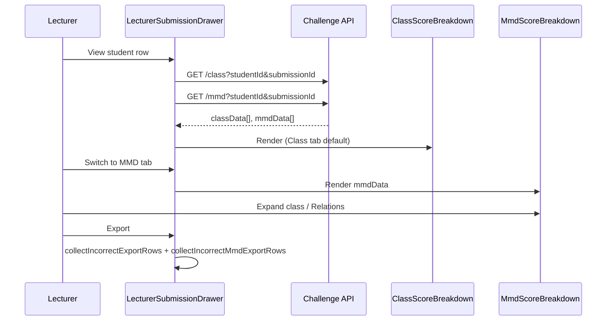

# Lecturer MMD Drawer - Plan

## Goal Capsule

**Objective:** Let lecturers review student MMD diagram grading (classes, attributes, and relations — correct and incorrect) from the challenge-tab submission drawer on Grading overview, with summary-first expandable detail, and extend challenge export to include incorrect MMD items.

**Product authority:** Requirements-only brainstorm enriched by this plan (2026-08-08).

**Stop conditions:** No backend API changes, no testcase tab, no full MMD export (correct + incorrect), no separate MMD-only export control.

---

## Product Contract

**Product Contract preservation:** Unchanged meaning and stable R/A/F/AE IDs; planning resolved the deferred export-schema question (see Planning Contract KTD3).

### Summary

Add **Class | MMD** tabs to the lecturer challenge submission drawer. The MMD tab fetches the existing per-student `/mmd` endpoint and shows collapsed class cards (name + score pill; expand for attributes with pass/fail) plus a separate collapsed Relations section (count + score pill; expand for relation rows). Extend the drawer's challenge export to include incorrect MMD attributes and relations alongside the existing incorrect Java methods.

### Problem Frame

When a lecturer opens **View** on a student row in a challenge tab (Grading overview), the drawer shows only Java **Class** breakdown — fields, constructors, and methods with pass/fail ticks. MMD diagram results (class boxes, diagram members, and relations) are already graded and persisted, and students see them on their dashboard, but lecturers have no equivalent view. Reviewing diagram mistakes currently requires inferring from scores or checking submissions outside the grading workflow.

### Key Decisions

- KD1. **Tabbed drawer (Class | MMD)** — session-settled: user-directed — chosen over stacked scroll and top-level accordion — matches the student dashboard pattern and keeps the narrow drawer focused on one grading source at a time.
  Governs R1, R2.

- KD2. **MMD summary-first with separate Relations section** — session-settled: user-directed — chosen over always-visible relations table (student pattern) — class cards collapsed by default; Relations as its own collapsed section with aggregate score.
  Governs R5, R6, R7, R8, R9.

- KD3. **Export incorrect MMD only** — session-settled: user-directed — chosen over drawer-only display and over full MMD export — extends existing challenge export rather than adding a new export entry point.
  Governs R10, R11.

- KD4. **Reuse existing `/mmd` read API** — no new backend endpoints; lecturer drawer passes the same `studentId` and optional `submissionId` as the Class tab.
  Governs R3.

### Actors

- A1. **Lecturer** — signed-in user with `LECTURER` role viewing Grading overview, challenge tab, submission drawer.

### Requirements

**Drawer structure**

- R1. The challenge submission drawer exposes two tabs: **Class** and **MMD**, with Class as the default active tab.
- R2. Switching tabs does not close the drawer or lose student/challenge context.

**MMD data loading**

- R3. Opening the drawer (or switching to the MMD tab) loads MMD breakdown for the selected student and challenge using the same submission pinning rules as the Class tab (`studentId` required; `submissionId` when available).
- R4. MMD loading, empty, and error states mirror Class tab behavior (spinner while loading, friendly message on failure, empty state when no MMD data).

**MMD class display**

- R5. Each MMD class renders as a collapsed summary row: class name and a score pill (pass count / total members / percentage).
- R6. Tapping a class row expands to show all diagram members (fields, constructors, methods) with pass/fail indicator for each — both correct and incorrect items visible.
- R7. When a member failed, show the error detail when expanded (same information the student MMD tab surfaces).

**MMD relations display**

- R8. Below class cards, a **Relations** section appears as a single collapsed header showing relation count and aggregate pass score.
- R9. Expanding Relations shows all relation rows (from → type → to) with pass/fail for each, including error detail on failures.

**Export**

- R10. Challenge export from the drawer includes rows for incorrect MMD attributes (fields, constructors, methods on diagram) and incorrect relations, in addition to existing incorrect Java methods.
- R11. Export still covers incorrect items only — correct MMD members are not exported.

### Key Flows

- F1. **Review MMD for one student** — Lecturer selects lab → challenge tab → View on student row → drawer opens on Class tab → switches to MMD → sees collapsed class summaries and collapsed Relations → expands Car class → sees which diagram members failed → expands Relations → sees which edges failed.
  **Covered by:** R1, R3, R5, R6, R8, R9

- F2. **Export incorrect breakdown** — Lecturer opens drawer → Export → selects format → downloaded file includes incorrect Java methods plus incorrect MMD attributes and relations for that student and challenge.
  **Covered by:** R10, R11

- F3. **No MMD submission** — Student submitted Java only or MMD produced no rubric elements → MMD tab shows empty state, not an error.
  **Covered by:** R4

### Acceptance Examples

- AE1. **Covers R5, R6.** Student with Vehicle (3/5 diagram members correct) and Car (1/4 correct) → MMD tab shows two collapsed class rows with score pills `3/5` and `1/4` → expanding Car lists all four members with ✓/✗ on each.

- AE2. **Covers R8, R9.** Challenge has two relations: Car→Vehicle `extends` (pass) and Driver→Car `uses` (fail) → Relations header shows `1/2` while collapsed → expanded table shows both rows with status icons and error text on the failed relation.

- AE3. **Covers R1, R2.** Lecturer on Class tab sees Java breakdown → switches to MMD → Class content hidden, MMD content shown → switches back without closing drawer.

- AE4. **Covers R10.** Export after AE1–AE2 → file includes incorrect Java methods plus incorrect MMD members and the failed relation; correct items omitted.

- AE5. **Covers R4.** Student with no MMD data for challenge → MMD tab shows "No MMD class data is available" (or equivalent), Class tab still works.

### Scope Boundaries

**In scope:** `LecturerSubmissionDrawer` tabs, new MMD breakdown component, parallel `/mmd` fetch, `exportRoster.js` / export helper extension, lecturer component docs.

**Deferred for later:** Full MMD export (correct + incorrect); separate MMD-only export button; testcase tab in drawer; visual Mermaid diagram rendering; widening drawer beyond current `max-w-md`; lecturer MMD on roster View (lab attempt history drawer).

**Outside this product's identity:** Changing MMD grading rules, backend rubric shape, student dashboard MMD UX.

### Dependencies / Assumptions

- `GET /api/labs/{labId}/challenges/{challengeId}/mmd` returns `MmdClassDTO` with `attributes` and per-class `relations`, populated from persisted submission results.
- Class tab behavior in the drawer remains unchanged except for tab chrome.
- Score pill and pass/fail tick patterns align with `ClassScoreBreakdown` visual language for consistency.

---

## Planning Contract

### Summary

Add `Class | MMD` tabs to `LecturerSubmissionDrawer.jsx`, fetch `/class` and `/mmd` in parallel on drawer open (same query params as today), render `ClassScoreBreakdown` on Class tab and a new `MmdScoreBreakdown` on MMD tab. Extend `exportChallengeBreakdown` to merge Java incorrect rows with MMD incorrect rows in one flat export using a `Source` column.

**Product Contract preservation:** Unchanged — brainstorm export-schema question resolved in KTD3.

### Key Technical Decisions

- KTD1. **Parallel fetch on drawer open** — fetch `/class` and `/mmd` together when the drawer opens (same `studentId` + optional `submissionId`), mirroring `StudentDashboard.fetchChallengeDetails`. Avoids a second loading spinner when switching to MMD and keeps tab switch instant.
  Governs R3.

- KTD2. **New `MmdScoreBreakdown.jsx`** — lecturer-specific collapsed UX per KD2; do not reuse `StudentUI` MMD block (always-visible grid/table). Mirror `ClassScoreBreakdown` accordion mechanics and score-pill styling; borrow `relationTypeStyle` and attribute type colors from `StudentUI.jsx` for relation badges and member labels.
  Governs R5–R9.

- KTD3. **Flat export with `Source` column** — extend row shape to `{ Student Name, Source, Incorrect Class, Item Type, Incorrect Item, Error? }` where `Source` is `Class` or `MMD`; `Item Type` is `Method`, `Field`, `Constructor`, `Relation`, or `Stereotype`; `Incorrect Item` holds method name, attribute label, or `from → relType → to` for relations. Export title becomes `Incorrect breakdown — {studentName}` (broader than methods-only). When zero incorrect rows across both sources, keep a single placeholder row (update message to reflect breakdown, not only methods).
  Governs R10, R11.

- KTD4. **No shared primitive extraction in v1** — duplicate `Tick` / `ScorePill` inside `MmdScoreBreakdown` (or import only from `ClassScoreBreakdown` if exported) rather than a cross-layer shared module; minimizes scope.
  Governs implementation styling consistency per Dependencies.

- KTD5. **Relations aggregation** — flatten `mmdData.flatMap(cls => cls.relations ?? [])` for the Relations section (same as `StudentUI.jsx`); class cards use per-class `attributes` only for class-level score pills.
  Governs R8, R9.

### Assumptions

- No frontend test harness; manual verification per existing lecturer component docs.
- Drawer `max-w-md` width is acceptable for scrollable MMD content (brainstorm call-out accepted for v1).
- R7 inline attribute errors are intentional lecturer UX (student MMD grid shows ticks only on attributes; relations already show inline errors). Lecturer expanded class cards show `error` text for failed attributes per R7.

### Risks & Dependencies

| Risk | Mitigation |
|---|---|
| Duplicate `Tick`/`ScorePill` drift from `ClassScoreBreakdown` | Copy classes verbatim or export helpers from `ClassScoreBreakdown` in U1 |
| Large MMD rubrics overflow narrow drawer | `overflow-y-auto` on tab body; scroll within drawer panel |
| Export column change breaks lecturer habit | `Source` column makes Java vs MMD obvious; title rename signals broader content |

### High-Level Technical Design

---

## Implementation Units

### U1. MmdScoreBreakdown component

**Goal:** Present MMD classes (collapsed summary → expanded members) and Relations (collapsed summary → expanded table) with pass/fail for all items.

**Requirements:** R5, R6, R7, R8, R9; KD2, KD5

**Dependencies:** None

**Files:**
- `frontend/src/components/lecturer/MmdScoreBreakdown.jsx` (new) — also exports `collectIncorrectMmdExportRows(mmdData, studentName)` for U3

**Approach:**
1. Accept `mmdData` array (`name`, `attributes[]`, `relations[]` per class).
2. Class cards: one expandable row per class; score pill from `attributes` pass count; expanded body lists each attribute with type-based color (`field` / `method` / `constructor` / `stereotype`), `Tick`, and `error` text when `!ok`.
3. Relations section: separate `relationsOpen` state; header shows count and `relationScore` pill; expanded grid columns From | Relation | To | Status (mirror `StudentUI` relation table); show `error` row below failed relations.
4. Empty state when `mmdData.length === 0`.
5. Export helper walks classes: incorrect attributes (including stereotype rows) → rows; flatMap relations → incorrect relation rows per KTD3 shape.

**Patterns to follow:** `ClassScoreBreakdown.jsx` accordion + `ScorePill`; `StudentUI.jsx` relation grid and `relationTypeStyle`.

**Test scenarios:**
- Two classes with mixed pass/fail attributes render collapsed summaries with correct pill fractions
- Expanding one class shows all members with ticks; failed members show error text
- Relations header collapsed shows aggregate score; expanded shows all relations including failures
- Empty `mmdData` shows dashed empty state message
- `collectIncorrectMmdExportRows` returns only `!ok` attributes and relations with correct column keys

**Test expectation:** none — no frontend test harness.

**Verification:** Manual expand/collapse on MMD tab with a student submission that has both class and relation failures.

---

### U2. Drawer tabs and MMD fetch

**Goal:** Class | MMD tabs in submission drawer; parallel data load; tab content switching.

**Requirements:** R1, R2, R3, R4; KD1

**Dependencies:** U1

**Files:**
- `frontend/src/components/lecturer/LecturerSubmissionDrawer.jsx`

**Approach:**
1. Add `activeTab` state (`'class' | 'mmd'`), default `'class'`.
2. Tab bar below metadata block (reuse StudentUI tab styling: purple active border).
3. Extend `useEffect` load: fetch `/class` and `/mmd` in parallel with identical `URLSearchParams` (two `fetch` calls in one async function, not a single thrown `Promise.all`).
4. Partial-failure rule: `/class` failure → error banner and empty class data (blocks Class tab, same as today); `/mmd` failure alone → set `mmdData` to `[]`, optional `mmdError` message on MMD tab only, Class tab still works (mirrors `StudentDashboard` mmd degrade path per R4/AE5).
5. State: `classData`, `mmdData`, shared `loading`; `error` for class fetch failure; optional `mmdError` for mmd-only failure.
6. Body: Class tab → existing `ClassScoreBreakdown`; MMD tab → `MmdScoreBreakdown` with loading/error/empty handling per R4.
7. Reset `activeTab` to `'class'` when drawer closes or student changes.

**Patterns to follow:** `StudentDashboard.jsx` parallel fetch; `LecturerSubmissionDrawer.jsx` existing class load effect.

**Test scenarios:**
- Covers AE3. Tab switch hides/shows correct panel without closing drawer
- Covers AE5. Empty mmd response shows empty state on MMD tab; Class tab still renders
- Drawer open triggers both network requests with `studentId` and `submissionId` when present
- Closing drawer clears mmd state

**Test expectation:** none — manual verification.

**Verification:** Network tab shows parallel `/class` and `/mmd` on View; tab switch is instant after load.

---

### U3. Export extension

**Goal:** Challenge export includes incorrect MMD rows alongside Java methods.

**Requirements:** R10, R11; KD3

**Dependencies:** U1

**Files:**
- `frontend/src/components/lecturer/exportRoster.js`
- `frontend/src/components/lecturer/LecturerSubmissionDrawer.jsx` (pass `mmdData` to export handler)

**Approach:**
1. Update `collectIncorrectExportRows` row shape to include `Source: 'Class'`, `Item Type: 'Method'`, rename `Incorrect Method` → `Incorrect Item` (or map in export wrapper to avoid breaking internal naming). Class rows leave `Error` blank (Java export has no per-method error text today); MMD rows populate `Error` from `attribute.error` / `relation.error`.
2. Add `collectIncorrectMmdExportRows` from U1; merge arrays in `exportChallengeBreakdown`.
3. Title: `Incorrect breakdown — ${studentName}`.
4. Placeholder when merged rows empty: message like `No incorrect items found`.
5. `handleExport` in drawer passes both `classData` and `mmdData`.

**Patterns to follow:** `exportChallengeBreakdown` + `exportDataset` in `exportRoster.js`; grading tab export precedent (`docs/plans/2026-08-08-003-feat-grading-tab-export-plan.md`).

**Test scenarios:**
- Covers AE4. Export with Java method failures + MMD attribute/relation failures produces rows for each source; no correct items
- Excel/PDF/SVG all receive merged rows and updated title
- Zero failures across both sources still downloads placeholder row

**Test expectation:** none — manual verification.

**Verification:** Export file columns match KTD3 schema; incorrect MMD relation appears as one row.

---

### U4. Documentation updates

**Goal:** DOX reflects drawer tabs, MMD endpoint, and export shape.

**Requirements:** Scope in-scope docs list

**Dependencies:** U2, U3

**Files:**
- `frontend/src/components/lecturer/AGENTS.md`
- `frontend/src/pages/AGENTS.md`

**Approach:**
1. Lecturer AGENTS: add `MmdScoreBreakdown.jsx` to ownership table; document Class|MMD tabs, `/mmd` fetch, export columns.
2. Pages AGENTS: add `GET .../mmd` to lecturer drawer endpoint row.

**Test expectation:** none — docs only.

**Verification:** AGENTS.md index matches new component and API usage.

---

## Verification Contract

| Check | Command / action |
|---|---|
| Frontend build | `npm run build` from `frontend/` |
| Manual drawer | Log in as lecturer → Grading overview → challenge tab → View → Class and MMD tabs |
| Manual export | Export from drawer with known incorrect Java + MMD items; verify columns and title |

No automated frontend tests exist.

---

## Definition of Done

- [ ] `LecturerSubmissionDrawer` has Class | MMD tabs; Class default; parallel `/class` + `/mmd` fetch
- [ ] `MmdScoreBreakdown` shows collapsed classes and collapsed Relations with expand detail per R5–R9
- [ ] Both correct and incorrect diagram members and relations visible when expanded
- [ ] Export includes incorrect MMD rows with `Source` column; title `Incorrect breakdown — {name}`
- [ ] `npm run build` succeeds
- [ ] `frontend/src/components/lecturer/AGENTS.md` and `frontend/src/pages/AGENTS.md` updated
- [ ] Product Contract R1–R11 satisfied (manual walkthrough of AE1–AE5)

---
