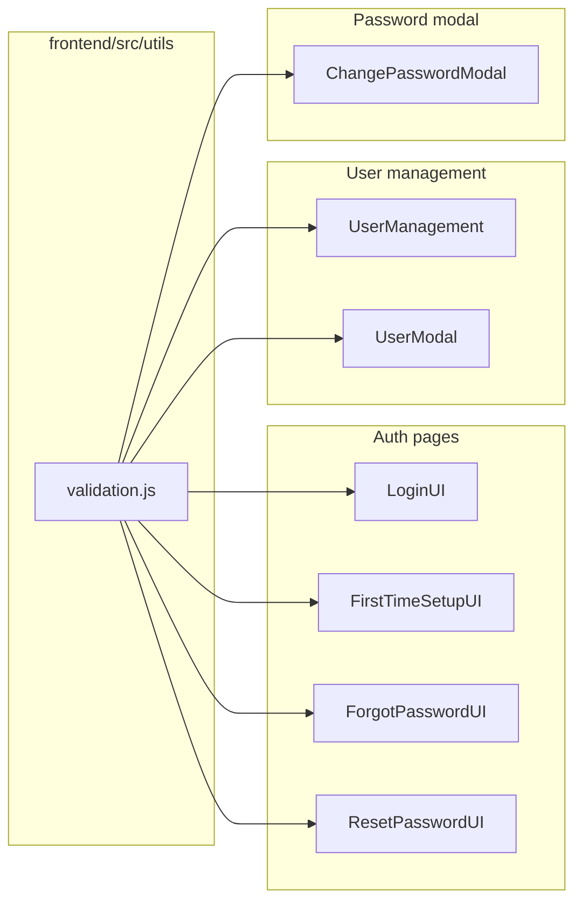

# feat: Frontend form validation - Plan

## Goal Capsule

**Objective:** Add consistent client-side validation across every frontend form where users enter account data, with inline real-time feedback and submit disabled until the form is valid.

**Product authority:** Session brainstorm decisions (no requirements-only artifact was written). This plan bootstraps the Product Contract from that dialogue.

**Stop conditions:** Do not change backend validation rules. Do not add a form library (react-hook-form, Zod). Do not validate file uploads in `DropZone` or search/filter inputs.

---

## Product Contract

### Actors

- A1. **Unauthenticated user** — signs in, completes first-time Google setup, or uses forgot/reset password.
- A2. **Authenticated user** — changes password from student or lecturer dashboard.
- A3. **Lecturer (user management)** — creates or edits user accounts.

### Requirements

- R1. **Shared validation rules** — one module defines field rules and user-facing error messages used by all forms in scope.
- R2. **Student IRN** — when the role is known as student, IRN must be exactly 10 digits (`0–9` only).
- R3. **Lecturer code** — when the role is known as lecturer, code must be non-empty after trim (free text, e.g. `lan.cao`).
- R4. **Password** — on create or change flows, password must be 6–100 characters inclusive.
- R5. **Password confirm** — confirm field must match the new password when both are present.
- R6. **Change password** — new password must differ from current password (mirrors backend `UserService.changePassword`).
- R7. **Email** — must be a valid email format and end with `@eiu.edu.vn` (case-insensitive domain check).
- R8. **Full name** — required, non-empty after trim.
- R9. **Inline real-time UX** — validate on change/blur; show field-level error text and error border styling; disable primary submit until the form passes all applicable rules.
- R10. **Login code field** — unified student/lecturer login accepts any non-empty trimmed code (no 10-digit format check because role is unknown pre-submit).
- R11. **Login password field** — required non-empty only (no length check at login).
- R12. **User management create** — password required; all role-selected IRN fields, email, and full name validated before API call.
- R13. **User management edit** — password optional; when provided, same rules as R4; IRN/email/name validated on save.
- R14. **Replace alerts** — auth login and user-management save errors use inline field or form-level messages instead of `alert()` for validation failures.

### Key Flows

- F1. **Local login** — enter code + password → inline errors if empty → submit when valid → API errors shown inline (not alert).
- F2. **First-time Google setup** — enter student IRN + password + confirm → real-time IRN and password rules → submit disabled until valid.
- F3. **Forgot password** — enter school email → `@eiu.edu.vn` enforced → submit disabled until valid.
- F4. **Reset password** — new + confirm with length and match rules (extend existing submit-time checks to real-time inline).
- F5. **User CRUD modal** — role toggles show IRN fields → each field validates live → save disabled until valid.
- F6. **Change password modal** — current + new + confirm with full rules including new ≠ current.

### Acceptance Examples

- AE1. First-time setup with IRN `2052123` (9 digits) shows inline error; `2052123456` (10 digits) passes IRN rule.
- AE2. User management create with email `user@gmail.com` shows domain error; `student@eiu.edu.vn` passes.
- AE3. Password `12345` shows "at least 6 characters"; `123456` passes length rule.
- AE4. Change password with new password identical to current shows inline error before API call.
- AE5. Login with empty password shows inline error; no browser `alert()` for validation.
- AE6. Lecturer code `lan.cao` passes; empty lecturer code with LECTURER role selected fails.

### Scope Boundaries

**In scope:** `frontend/src/utils/validation.js` (new), auth pages, `UserModal` / `UserManagement`, `ChangePasswordModal`, AGENTS.md updates, removal of dead `ProfileEditModal.jsx`.

**Deferred for later:** Backend IRN format enforcement, frontend test framework setup, `SolutionManagement.jsx` mock form validation.

**Outside this product's identity:** DropZone upload structure rules (already validated separately), search inputs, backend API changes.

### Key Decisions

- KD1. **Student IRN = 10 digits; lecturer code = free text** — session-settled from brainstorm.
  Governs R2, R3.

- KD2. **Email must be `@eiu.edu.vn`** — session-settled; matches Google login domain restriction.
  Governs R7.

- KD3. **Inline real-time errors; submit disabled until valid** — session-settled; `ChangePasswordModal` is the UX reference.
  Governs R9.

- KD4. **Login unified code field: required only** — cannot apply student 10-digit rule without knowing role.
  Governs R10.

- KD5. **Shared rules module, no new dependencies** — chosen over react-hook-form + Zod to match existing patterns and minimize carrying cost.
  Governs R1.

- KD6. **Delete unused `ProfileEditModal.jsx`** — dashboards already use `ChangePasswordModal.jsx`; stub duplicates component name and misleads docs.
  Governs maintenance of R6 scope.

---

## Planning Contract

### Summary

Introduce `frontend/src/utils/validation.js` with pure validator functions and stable error message strings. Wire each in-scope form to call validators on change, maintain per-field error state, and gate submit buttons on aggregate validity. Extend `ChangePasswordModal` with new ≠ current check. Remove dead `ProfileEditModal.jsx` and correct student component AGENTS.md.

**Product Contract preservation:** Bootstrapped from session brainstorm; no separate requirements artifact to diff.

### Key Technical Decisions

- KTD1. **Pure functions in `validation.js`** — each export returns `''` (valid) or an error string. No React dependency so validators stay unit-testable if a test runner is added later.
- KTD2. **Per-form `fieldErrors` state** — follow `ChangePasswordModal` pattern rather than introducing a shared hook in v1; keeps diff localized and readable.
- KTD3. **Email domain check** — `endsWith('@eiu.edu.vn')` after lowercasing the domain portion; basic `@` and local-part presence check before domain rule.
- KTD4. **Student IRN regex** — `/^\d{10}$/` applied only on student-specific fields (`FirstTimeSetupUI`, `UserModal` student IRN).
- KTD5. **User management errors** — move validation from `buildPayload()` throws to pre-save field validation; keep API error messages in a form-level banner (not `alert()`).
- KTD6. **Login validation** — replace `alert()` with inline errors under fields; API failures use a form-level error div (same pattern as `ForgotPasswordUI`).
- KTD7. **No new test runner** — repo has no frontend test framework; verification is `npm run build` plus manual flows per Verification Contract.

### High-Level Technical Design

Each consumer: `onChange` → validator → `setFieldErrors` → conditional border class → `canSubmit` derived from all applicable fields.

### Assumptions

- Backend continues to accept lecturer free-text codes and does not enforce 10-digit student IRN server-side; frontend adds stricter student IRN rule as product policy.
- `ProfileEditModal.jsx` is safe to delete (no imports in `src/` outside its own file).

---

## Implementation Units

### U1. Shared validation module

**Goal:** Single source of truth for field rules and messages.

**Requirements:** R1, R2, R3, R4, R5, R6, R7, R8, R10, R11

**Dependencies:** None

**Files:**
- Create: `frontend/src/utils/validation.js`

**Approach:**
1. Export named validators: `validateStudentIrn`, `validateLecturerCode`, `validatePassword`, `validatePasswordConfirm`, `validateEmail`, `validateFullName`, `validateRequired`, `validateNewPasswordDifferent`.
2. Export `MESSAGES` constant object for consistent strings (optional re-export for consumers that need placeholders).
3. Each function: empty/whitespace-only input returns appropriate required message or `''` when field is optional context (callers pass optional flag for edit password).

**Patterns to follow:** Pure utility style of `frontend/src/utils/formatters.js` and `authHeaders.js`.

**Test scenarios:**
- `validateStudentIrn('2052123456')` returns `''`.
- `validateStudentIrn('205212345')` returns error (9 digits).
- `validateStudentIrn('20521234567')` returns error (11 digits).
- `validateStudentIrn('205212345a')` returns error (non-digit).
- `validateLecturerCode('lan.cao')` returns `''`; `validateLecturerCode('  ')` returns error.
- `validatePassword('12345')` returns min-length error; `validatePassword('a'.repeat(101))` returns max-length error; `validatePassword('secret1')` returns `''`.
- `validateEmail('a@eiu.edu.vn')` returns `''`; `validateEmail('a@gmail.com')` returns domain error.
- `validateNewPasswordDifferent('same', 'same')` returns error; different values return `''`.

**Verification:** Module imports without error; `npm run build` succeeds.

---

### U2. Auth flow forms

**Goal:** Inline validation on all unauthenticated auth screens.

**Requirements:** R2, R4, R5, R7, R9, R10, R11, R14; Covers F1–F4

**Dependencies:** U1

**Files:**
- Modify: `frontend/src/pages/LoginUI.jsx`
- Modify: `frontend/src/pages/FirstTimeSetupUI.jsx`
- Modify: `frontend/src/pages/ForgotPasswordUI.jsx`
- Modify: `frontend/src/pages/ResetPasswordUI.jsx`

**Approach:**
1. **LoginUI** — `fieldErrors` for code and password; `validateRequired` on both; remove validation `alert()`; API errors in form-level banner; disable Sign In until both fields non-empty.
2. **FirstTimeSetupUI** — `validateStudentIrn` on IRN; `validatePassword` + `validatePasswordConfirm` on password fields; disable submit until all pass; show inline errors (not only match/mismatch on confirm).
3. **ForgotPasswordUI** — `validateEmail` on change; disable submit until valid.
4. **ResetPasswordUI** — move length/match checks to on-change using shared validators; keep submit disabled when invalid (extend beyond mismatch-only disable).

**Patterns to follow:** `ChangePasswordModal.jsx` field error styling; `ForgotPasswordUI.jsx` form-level `error` state for API failures.

**Test scenarios:**
- Covers AE1. First-time setup 9-digit IRN shows error before submit.
- Covers AE5. Login empty fields show inline errors, no alert.
- Forgot password with non-EIU email shows domain error on blur/change.
- Reset password 5 chars shows min-length inline before submit.

**Verification:** Manual walkthrough of F1–F4; `npm run build`.

---

### U3. User management modal

**Goal:** Real-time validation on create/edit user form.

**Requirements:** R2, R3, R4, R8, R9, R12, R13, R14; Covers F5, AE2, AE6

**Dependencies:** U1

**Files:**
- Modify: `frontend/src/pages/UserManagement.jsx`
- Modify: `frontend/src/components/UserModal.jsx`

**Approach:**
1. Lift or co-locate `fieldErrors` in `UserManagement` (parent owns save logic).
2. On `onFieldChange`, run applicable validator per field key.
3. When roles change, re-validate visible IRN fields (student vs lecturer).
4. `canSave` derived: all visible required fields valid; create mode requires password valid.
5. Replace `alert()` on validation failure with inline errors; API errors in modal banner.
6. `UserModal` receives `fieldErrors`, `canSave`, and renders error text under each input with error border classes.

**Patterns to follow:** Existing `buildPayload()` role logic; error display from `ChangePasswordModal`.

**Test scenarios:**
- Covers AE2. Gmail address rejected inline on user create.
- Covers AE6. Empty lecturer IRN with LECTURER role fails inline.
- Create without password — submit disabled.
- Edit with blank password — save allowed if other fields valid.

**Verification:** Manual lecturer user CRUD round-trip; `npm run build`.

---

### U4. Change password modal and cleanup

**Goal:** Complete password validation parity with backend; remove dead stub file.

**Requirements:** R4, R5, R6, R9; Covers F6, AE4

**Dependencies:** U1

**Files:**
- Modify: `frontend/src/components/student/ChangePasswordModal.jsx`
- Delete: `frontend/src/components/student/ProfileEditModal.jsx`
- Modify: `frontend/src/components/student/AGENTS.md`
- Modify: `frontend/src/pages/AGENTS.md` (editProfile → ChangePasswordModal)

**Approach:**
1. Refactor `ChangePasswordModal` validators to import from `validation.js` (replace inline length strings).
2. Add `validateNewPasswordDifferent` on new password when current is filled.
3. Delete `ProfileEditModal.jsx`.
4. Update AGENTS.md tables and editProfile notes to reference `ChangePasswordModal` only.

**Patterns to follow:** Existing modal structure; keep API error banner behavior.

**Test scenarios:**
- Covers AE4. New password same as current shows inline error.
- Password 101 chars shows max-length error on change.
- Successful change still calls `POST /api/users/change-password`.

**Verification:** Manual change-password from student and lecturer dashboards; `npm run build`.

---

## Verification Contract

| Check | Command / action |
|---|---|
| Build | `npm run build` from `frontend/` |
| Login validation | Empty submit shows inline errors; valid credentials still log in |
| First-time setup | 10-digit IRN + 6+ char password required |
| Forgot/reset | `@eiu.edu.vn` email; reset password 6–100 chars + match |
| User CRUD | Create/edit with invalid email or IRN blocked inline |
| Change password | New ≠ current enforced client-side |

No automated frontend tests in repo today; do not add a test runner in this work.

---

## Definition of Done

- [ ] `frontend/src/utils/validation.js` exists and is used by all in-scope forms
- [ ] No `alert()` for client-side validation failures on LoginUI or UserManagement
- [ ] Student IRN 10-digit rule enforced where role is student
- [ ] Email `@eiu.edu.vn` enforced on forgot-password and user management
- [ ] Change password enforces new ≠ current
- [ ] `ProfileEditModal.jsx` removed; AGENTS.md corrected
- [ ] `npm run build` passes
- [ ] Manual verification table above completed

---

## System-Wide Impact

- **End users:** Clearer, immediate feedback; fewer round-trips to API for preventable errors.
- **Lecturers:** User create/edit catches bad data before save.
- **Developers:** One module to update when rules change.

---

## Risks & Dependencies

| Risk | Mitigation |
|---|---|
| Stricter student IRN than backend may reject valid legacy codes | Product decision accepted in brainstorm; document in plan only |
| Inconsistent styling between login CSS and Tailwind modals | Reuse existing per-screen classes; only add error text + border color |
| Dual-role user form shows both IRN fields | Validate each field only when its role checkbox is selected |

---

## Open Questions

None blocking. All product rules settled in brainstorm dialogue.

---

## Sources & Research

- Session brainstorm dialogue (Aug 9, 2026) — product rules and UX
- `frontend/src/components/student/ChangePasswordModal.jsx` — reference UX pattern
- `backend/src/main/java/com/eiu/capstone/backend/service/UserService.java` — password length and new ≠ current rules
- Grounding dossier from brainstorm scout — form inventory and gaps
