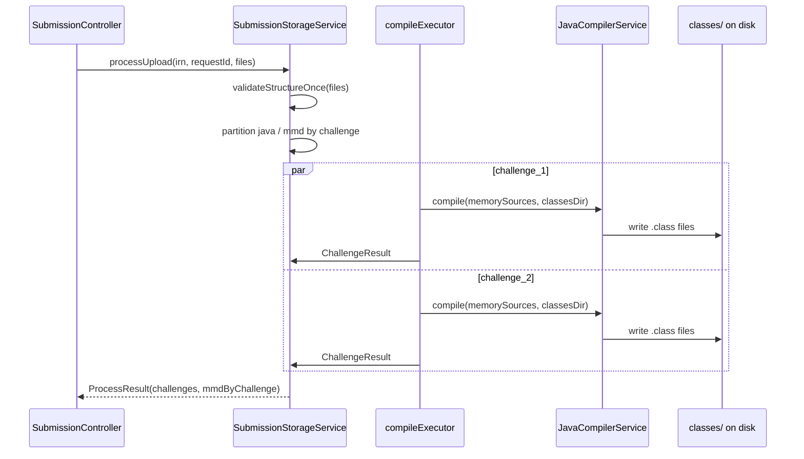

# Submission Compile Path Optimization - Plan

## Goal Capsule

**Objective:** Make the student upload **compile slice** (`DropZone` → multipart receive → `SubmissionStorageService.processUpload` → per-challenge `javac`) faster and more robust: eliminate redundant disk I/O around sources, reuse compiler infrastructure, isolate compile parallelism from grading workers, and tighten upload-path logic without changing grading semantics or API contracts.

**Product authority:** Prior session upload-path audit (compile-focused, grading excluded). Complements `docs/plans/2026-07-31-001-perf-grading-speed-plan.md` (parallel compile already landed) and `docs/plans/2026-08-04-002-perf-full-stack-latency-plan.md` (read-path work). This plan owns **compile-time and pre-grade storage** only.

**Open blockers:** None.

---

## Product Contract

### Summary

Students upload a folder of `.java` and `.mmd` files; the backend must compile each challenge's Java sources before reflection-based grading can run. Today compilation is correct but wasteful: sources are copied to disk, `javac` bootstraps fresh file managers per challenge, class counting walks trees, and compile threads share the grading pool. Grading still requires compiled `.class` files on disk under each challenge's `classes/` folder — that constraint stays.

### Problem Frame

`SubmissionController` logs `process_ms` for `submissionStorageService.processUpload`. On a typical 2-challenge lab, server time is dominated by **per-challenge `javac`** plus **double disk handling** (Spring multipart temp → `_sources_tmp` → compile → delete sources). Parallel compile across challenges already exists (`CompletableFuture` + `gradingExecutor`), but each compile invocation rebuilds compiler infrastructure and competes with grading on the same thread pool. Logic gaps: redundant per-file path validation and whole-folder deletion when one challenge throws unexpectedly.

### Actors

- A1. **Student** — drops folder in `DropZone`; waits on one synchronous upload request (grading still blocks the response, but is out of scope for implementation units here).
- A2. **Operator** — tunes `app.compile.parallelism` / memory on Render (`JAVA_OPTS`).

### Requirements

**Compile performance**

- R1. Per-challenge compile must not write student `.java` sources to `_sources_tmp` when bytes are already available from multipart — compile from in-memory (or single-read) `JavaFileObject` sources; **`.class` output still lands in `challenge_N/classes/`** for `ReflectionClassParser`.
- R2. `JavaCompilerService` must reuse a single `JavaCompiler` instance and reuse or pool `StandardJavaFileManager` per worker thread instead of constructing both on every `compile()` call.
- R3. Compile parallelism must use a **dedicated executor** (`compileExecutor`), not the grading thread pool, with a documented property (e.g. `app.compile.parallelism`, default aligned with current `app.grading.parallelism` behavior).
- R4. Counting compiled classes after success must not walk deep trees when `classes/` is flat — use a single-directory listing.
- R5. Upload-path validation must validate folder structure **once per request**, not re-run full path regex on every file.

**Compile correctness & logic**

- R6. When one challenge fails compile, other challenges' compiled output must remain available for grading (existing `ChallengeResult.compileError` behavior preserved).
- R7. When one challenge hits a non-compile catastrophic error (I/O), other successful challenge folders must not be deleted wholesale — only failed challenge paths or the minimum temp subtree should be torn down before rethrow/aggregate.
- R8. Invalid folder structure must still reject the upload before compile starts, with the same error semantics as today (`SubmissionProcessingException` with the existing message shape).
- R9. Empty Java list for a challenge (MMD-only folder) still yields `classFileCount = 0` without calling `javac`.
- R10. Compile diagnostics surfaced to the student (Class tab compile error cards via `SubmissionCompileErrorStore`) must remain equivalent — same message content, same challenge mapping.

**Observability**

- R11. With `app.grading.timing-log=true`, log compile sub-phase timings: `compile_setup_ms`, `compile_javac_ms`, `compile_count_ms` per challenge or aggregated in `process_ms` (extend existing `grading_timing` line or add `compile_detail` only when flag is on).

**Out of scope (this plan)**

- Grading (`GradingService`, rubric compare, result persistence), database perf, DropZone network upload UX, async grading, MMD persistence hook behavior.

### Key Flows

- F1. **Optimized compile path**
  - **Trigger:** `POST /api/submissions/{labId}/{attemptNumber}/upload` after auth and file list received.
  - **Steps:** Group files by challenge (single structure validation) → for each challenge key in parallel on `compileExecutor`: build in-memory source file objects → `javac` to `classes/` → count `.class` files → return `ProcessResult` with `ChallengeResult` list and in-memory `mmdByChallenge`.
  - **Covers R1–R4, R6, R9.**

### Acceptance Examples

- AE1. **Happy path compile**
  - **Given:** Valid folder `IRN_Name_lab_1/challenge_1/*.java` and `challenge_2/*.java`.
  - **When:** Upload runs.
  - **Then:** No `_sources_tmp` directories exist after `processUpload`; `classes/` contains compiled files; `process_ms` decreases versus baseline on the same machine (target: ≥25% reduction on 2-challenge sample with timing log enabled).

- AE2. **Compile error isolation**
  - **Given:** `challenge_1` has syntax error; `challenge_2` compiles cleanly.
  - **When:** Upload runs.
  - **Then:** `challenge_2/classes/` exists with `.class` files; `challenge_1` returns `compileError` message; grading can still run for challenge 2 (verified manually or via existing upload integration path).

- AE3. **MMD-only challenge**
  - **Given:** `challenge_1` has only `.mmd`, no `.java`.
  - **When:** Upload runs.
  - **Then:** No `javac` invocation for that challenge; `classFileCount = 0`; no error unless structure invalid.

### Scope Boundaries

**In scope:** `SubmissionStorageService`, `JavaCompilerService`, compile executor config, unit tests, `backend/AGENTS.md` / `DEPLOY_RENDER.md` tuning notes.

**Deferred for later**

- Client-side parallel `walkEntry` in `DropZone.jsx` (upload UX, not compile).
- Zip upload support.
- Forked `javac` subprocess or incremental compile cache across attempts.

**Outside this product's identity**

- Replacing `javax.tools.JavaCompiler` with Maven/Gradle CLI.
- Compiling directly to bytecode in DB.

### Key Decisions

- **In-memory sources, disk classes** — Governs R1. Chosen over keeping `_sources_tmp` because grading requires on-disk `.class` files but not on-disk sources; eliminates one write+delete cycle per file.
- **Dedicated compile executor** — Governs R3. Chosen over shared `gradingExecutor` to avoid compile CPU starving grading in the same request and to allow independent tuning on 512MB instances.

---

## Planning Contract

### Key Technical Decisions

| ID | Decision | Rationale |
|----|----------|-----------|
| KTD1 | Add `MemoryJavaFileObject` (or equivalent) wrapping multipart bytes / UTF-8 decoded content; pass `List<JavaFileObject>` to `JavaCompilerService.compile` | Removes `transferTo` + `_sources_tmp` lifecycle per R1 |
| KTD2 | Hold `JavaCompiler` as a singleton field on `JavaCompilerService`; use `ThreadLocal<StandardJavaFileManager>` or create one file manager per compile-worker thread and reuse | `ToolProvider.getSystemJavaCompiler()` + new file manager per call is measurable overhead at 4–8 challenges |
| KTD3 | New `CompileExecutorConfig` bean `compileExecutor`; `SubmissionStorageService` injects it; property `app.compile.parallelism` default `4`, capped by CPU count like grading | Separates pools per R3; grading plan already documents parallelism knob |
| KTD4 | Replace `countFiles(Files.walk)` with `Files.list` when counting `.class` in flat `classes/` | Matches actual layout; `ReflectionClassParser` already uses `Files.list` |
| KTD5 | Structure validation: first pass builds `ValidatedSubmission` (root name, challenge keys); second pass assigns files; invalid path fails before executor work | R5 + R8 without per-file regex storm |

### High-Level Technical Design

**Compile failure behavior:** compile errors → `ChallengeResult` with `compileError`, no exception. I/O or unexpected errors → mark challenge failed, do not `deleteFolder(submissionFolder)` unless no partial success is recoverable (KTD5 + R7).

### Assumptions

- JDK available at runtime (existing requirement).
- Challenge folders remain flat `classes/` output (no package subdirectories beyond default package) — matches current rubric labs.
- Multipart files remain readable via `MultipartFile.getBytes()` / `getInputStream()` after grouping (Spring holds parts until request completes).

### Sequencing

U1 (memory file objects) → U2 (compiler reuse) → U3 (executor split) can land in one PR if tightly coupled; U4 (validation) and U5 (count/cleanup logic) can parallelize after U1 API shape is stable. U6 (tests/docs) closes each unit.

---

## Implementation Units

### U1. In-memory source compilation API

**Goal:** Compile `.java` sources without writing `_sources_tmp`.

**Requirements:** R1, R9

**Dependencies:** None

**Files:**
- `backend/src/main/java/com/eiu/capstone/backend/service/JavaCompilerService.java` (modify)
- `backend/src/main/java/com/eiu/capstone/backend/service/compile/MemorySourceJavaFileObject.java` (create)
- `backend/src/main/java/com/eiu/capstone/backend/service/SubmissionStorageService.java` (modify)
- `backend/src/test/java/com/eiu/capstone/backend/service/JavaCompilerServiceTest.java` (create)

**Approach:**
1. Add `MemorySourceJavaFileObject` implementing `SimpleJavaFileObject` with `Kind.SOURCE`, `getCharContent` from UTF-8 bytes, `getName()` = public class file name.
2. Extend `JavaCompilerService` with `compileSources(List<JavaFileObject> sources, Path outputDir)` (or overload accepting byte payloads + names).
3. In `processChallenge`, read each `.java` multipart into memory file objects; skip disk source directory entirely.
4. Keep `Files.createDirectories(classesFolder)`; on compile failure, delete `classes/` only (not whole challenge folder if MMD will be graded later from memory).

**Patterns to follow:** `javax.tools.SimpleJavaFileObject` standard pattern; existing `SubmissionProcessingException` on compile failure.

**Test scenarios:**
- Compiles two simple public classes into `classes/` without pre-existing source files on disk.
- Empty source list returns without invoking compiler.
- Syntax error throws `SubmissionProcessingException` with line diagnostics in message.
- Covers AE1, AE3.

**Verification:** `JavaCompilerServiceTest` green; manual upload of valid folder still produces `.class` under `submissions/`.

---

### U2. Reuse JavaCompiler and file manager

**Goal:** Remove per-invocation compiler and file manager construction overhead.

**Requirements:** R2

**Dependencies:** U1

**Files:**
- `backend/src/main/java/com/eiu/capstone/backend/service/JavaCompilerService.java` (modify)
- `backend/src/test/java/com/eiu/capstone/backend/service/JavaCompilerServiceTest.java` (modify)

**Approach:**
1. Initialize `JavaCompiler` once in `@PostConstruct` or lazy field; fail fast if null (JRE not JDK).
2. Use `ThreadLocal<StandardJavaFileManager>` cleared/recreated on compile failure if manager is corrupted.
3. Ensure concurrent compile workers on `compileExecutor` do not share one file manager across threads.

**Test scenarios:**
- Two consecutive compile calls on same thread succeed without leak.
- Parallel compile (2 threads) of disjoint source sets both produce correct `.class` files.

**Verification:** Unit tests pass; optional micro-benchmark logged when `timing-log` enabled (before/after `compile_setup_ms`).

---

### U3. Dedicated compile executor

**Goal:** Compile parallelism no longer uses `gradingExecutor`.

**Requirements:** R3

**Dependencies:** U1

**Files:**
- `backend/src/main/java/com/eiu/capstone/backend/config/CompileExecutorConfig.java` (create)
- `backend/src/main/java/com/eiu/capstone/backend/service/SubmissionStorageService.java` (modify)
- `backend/src/main/resources/application.properties` (modify)
- `backend/AGENTS.md` (modify)
- `backend/DEPLOY_RENDER.md` (modify)

**Approach:**
1. Mirror `GradingExecutorConfig`: `Executors.newFixedThreadPool` with `compile-worker` thread names.
2. Property `app.compile.parallelism` (default 4, min 1, max `availableProcessors()`).
3. Inject `ExecutorService compileExecutor` into `SubmissionStorageService`; remove `gradingExecutor` injection from this service.
4. Document: on 512MB Render, consider `app.compile.parallelism=2` if OOM during parallel javac.

**Test scenarios:**
- Spring context test or slice test loads both executors without bean name collision (if test infrastructure exists; otherwise manual smoke).

**Verification:** `mvn test` from `backend/`; upload with 2+ challenges still completes.

---

### U4. Single-pass structure validation

**Goal:** Validate upload folder shape once; assign files to challenge buckets efficiently.

**Requirements:** R5, R8

**Dependencies:** None (can merge with U1 in same edit of `SubmissionStorageService`)

**Files:**
- `backend/src/main/java/com/eiu/capstone/backend/service/SubmissionStorageService.java` (modify)
- `backend/src/test/java/com/eiu/capstone/backend/service/SubmissionStorageServiceTest.java` (modify)

**Approach:**
1. Extract `validateAndGroup(files)` returning challenge maps or throw `SubmissionProcessingException`.
2. Validate root folder from first file path; verify all files share same root; collect challenge segment set; reject invalid challenge names once.
3. Keep `isValidSubmissionPath` as package-private helper for unit tests but call it only from the validator, not per file in hot loop.

**Test scenarios:**
- Existing three tests still pass.
- Upload with 20 file paths validates without calling full path regex 20 times (optional: package-private counter in test-only subclass, or document inspection).
- Mixed invalid challenge in one file rejects entire upload before compile.

**Verification:** `SubmissionStorageServiceTest` extended.

---

### U5. Class count and failure isolation logic

**Goal:** Cheaper post-compile count; safer partial failure cleanup.

**Requirements:** R4, R6, R7, R10

**Dependencies:** U1, U3

**Files:**
- `backend/src/main/java/com/eiu/capstone/backend/service/SubmissionStorageService.java` (modify)
- `backend/src/test/java/com/eiu/capstone/backend/service/SubmissionStorageServiceTest.java` (modify — may need multipart mocks)

**Approach:**
1. Replace `countFiles` walk with `Files.list(classesFolder)` filter `.class`.
2. In `processUpload`, on `CompletableFutures.joinAll` failure: delete only challenges that failed setup, not entire `submissionFolder` if other challenges succeeded (narrow `deleteFolder` scope).
3. Preserve `ChallengeResult.compileError` path — catch `SubmissionProcessingException` inside `processChallenge`, return error result, do not throw to `joinAll`.

**Test scenarios:**
- Covers AE2: mock or fixture with one bad Java file and one good — good challenge has `classFileCount > 0`.
- Compile error message preserved in `ChallengeResult.compileError`.

**Verification:** Unit/integration tests; manual upload with intentional syntax error in one challenge.

---

### U6. Timing hooks, docs, and smoke verification

**Goal:** Operators can measure compile slice; docs reflect new properties.

**Requirements:** R11

**Dependencies:** U1–U5

**Files:**
- `backend/src/main/java/com/eiu/capstone/backend/service/SubmissionStorageService.java` (modify)
- `backend/src/main/java/com/eiu/capstone/backend/service/JavaCompilerService.java` (modify if timing inside service)
- `backend/AGENTS.md` (modify)
- `backend/DEPLOY_RENDER.md` (modify)
- `backend/src/main/java/com/eiu/capstone/backend/service/AGENTS.md` (modify)

**Approach:**
1. When `app.grading.timing-log=true`, log per-challenge or aggregate compile phases inside `processChallenge` / `JavaCompilerService`.
2. Update AGENTS.md submission pipeline bullets: no `_sources_tmp`, `app.compile.parallelism`, dedicated compile pool.
3. DEPLOY_RENDER: document `app.compile.parallelism` alongside grading parallelism.

**Test scenarios:**
- Test expectation: none — config/doc unit; manual smoke with `app.grading.timing-log=true` shows new fields.

**Verification:** Manual upload once with timing log; compare `process_ms` to pre-change baseline noted in PR description.

---

## Verification Contract

| Check | Command / action |
|-------|------------------|
| Unit tests | `cd backend && mvn test` |
| Compile | `cd backend && mvn -q -DskipTests compile` |
| Timing smoke | Set `app.grading.timing-log=true`, upload 2-challenge lab via `DropZone`, capture `process_ms` in logs |
| Regression | Upload valid lab → grading still runs (out of scope to optimize, but must not break); Class tab shows compile errors for bad Java |

No automated integration test suite exists yet; U1/U2/U5 unit tests are the primary gate.

---

## Definition of Done

- [ ] `_sources_tmp` is not created on successful upload compile path
- [ ] `compileExecutor` bean wired; `SubmissionStorageService` no longer uses `gradingExecutor`
- [ ] `app.compile.parallelism` documented in `application.properties` and `DEPLOY_RENDER.md`
- [ ] `JavaCompilerServiceTest` + expanded `SubmissionStorageServiceTest` pass in CI/local `mvn test`
- [ ] AE1–AE3 behaviors verified (automated where practical, manual smoke documented in PR)
- [ ] `backend/AGENTS.md` and `backend/src/main/java/com/eiu/capstone/backend/service/AGENTS.md` updated for compile pipeline contract
- [ ] Grading semantics and upload API response shape unchanged

---

## Risks & Dependencies

| Risk | Mitigation |
|------|------------|
| Parallel in-memory compile increases heap pressure | Cap `app.compile.parallelism`; document `JAVA_OPTS`; compile one challenge at a time on tiny instances if needed |
| `ThreadLocal` file manager leak on thread pool | Clear on failure; daemon threads; pool size bounded |
| Package declarations in student code break flat class loader | Existing behavior; document unchanged — labs use default package |
| Multipart `getBytes()` duplicates memory | Acceptable at current scale; defer streaming compile if uploads grow huge |

---

## Sources & Research

- `backend/src/main/java/com/eiu/capstone/backend/service/SubmissionStorageService.java` — current parallel compile + disk source path
- `backend/src/main/java/com/eiu/capstone/backend/service/JavaCompilerService.java` — per-call compiler setup
- `backend/src/main/java/com/eiu/capstone/backend/config/GradingExecutorConfig.java` — executor pattern to mirror
- `backend/src/main/java/com/eiu/capstone/backend/grading/ReflectionClassParser.java` — requires on-disk `classes/`
- `frontend/src/components/ui/DropZone.jsx` — upload contract (unchanged)
- `docs/plans/2026-07-31-001-perf-grading-speed-plan.md` — prior parallel compile scope
- Session brainstorm: upload-path performance audit (2026-08-09)
