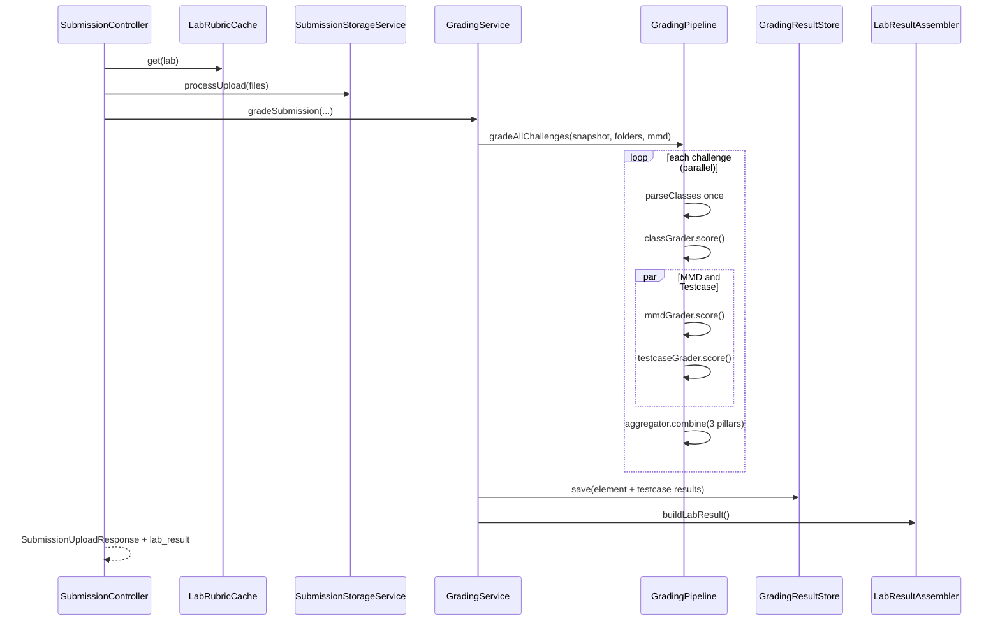

# feat: Grading Engine Rebuild — Plan

## Goal Capsule

**Objective:** Rebuild the backend grading engine so lab submissions are graded correctly, quickly, and extensibly — with three equal pillars per challenge (.class reflection, MMD diagram, structural testcases), member-weighted scoring, an upload-time `lab_result` bundle for the student UI, and minimal remote DB round-trips.

**Product authority:** Session brainstorm decisions (2026-08-09) and the attached schema doc (`Schema-Decision-Testcase-Grading.docx`) govern testcase shape and persistence. The user's original written spec informs scoring semantics and JSON output; runtime JSONB testcase execution is explicitly out of scope.

**Stop conditions:** Do not replace legacy element result tables in this pass (additive persistence only). Do not rebuild the compile path unless profiling shows a clear win. Do not implement lecturer testcase authoring UI. Lecturer/history read endpoints may remain for non-upload flows.

**Execution profile:** Test-first for new scoring and testcase modules; characterization tests before refactoring `GradingService` scoring paths.

---

## Product Contract

### Summary

Students upload challenge folders; the backend compiles Java, grades structure via reflection, diagram via MMD parsing, and rubric-linked structural testcases, then returns a rich `lab_result` payload so the frontend renders Class, MMD, and Testcase tabs without follow-up DB reads. Scores are reliable, partially credited where declarations are close, and computed entirely on the backend including attempt count.

### Problem Frame

The current `GradingService` merges Java and MMD with AND semantics at 50/50 weighting, has no testcase support, returns scores-only on upload (forcing `/class` and `/mmd` fetches against a remote DB), and produces scores stakeholders do not trust. A staged rebuild is needed: correct comparison algorithms, three independent pillar scores, structural testcase evaluation per the schema doc, and a single upload bundle.

### Actors

- A1. **Student** — uploads lab folder, views Class / MMD / Testcase tabs and overall score from upload response.
- A2. **Lecturer** — views submission results via existing roster/history read paths (unchanged contract in this pass).
- A3. **Grading engine** — orchestrates compile → class → (mmd ∥ testcase) → aggregate → persist → bundle.

### Requirements

- R1. **Three equal pillars per challenge** — each challenge score is the arithmetic mean of three pillar percentages: `.class` reflection, `.mmd` diagram, and structural `testcase` rows. (session-settled)
- R2. **Member-weighted scoring within each pillar** — within a challenge, gradable items in a pillar share that pillar's points proportionally to member count (class shell + fields + methods + constructors for class/testcase pillars; MMD-gradable classes, members, and relations for MMD pillar).
- R3. **Partial credit on declaration mismatches** — when a target member exists but declaration attributes differ, score = (matching attributes) / (total attributes checked). Applies to `.class` reflection checks and `DECLARATION` structural testcases. `EXISTENCE` testcases remain all-or-nothing. (session-settled)
- R4. **Structural testcases only** — adopt docx schema: `testcase` (EXISTENCE | DECLARATION, target_type + target_id) and `submission_testcase_result` (PASSED | FAILED | ERROR | SKIPPED). No runtime method invocation or JSONB execution payloads. (session-settled)
- R5. **Intentional double-check** — `.class` pillar auto-grades the full rubric via reflection; testcase pillar grades lecturer-authored testcase rows against the same parsed student model. Scores are independent by design. (session-settled)
- R6. **Grading order** — `.class` analysis runs first; `.mmd` and testcase evaluation run in parallel afterward (or concurrently when `.class` compile state allows).
- R7. **Compile error handling** — per-class compile failure surfaces in the Class tab; grading does not crash; testcases targeting classes that failed to compile return `ERROR` (not `FAIL`).
- R8. **Upload `lab_result` bundle** — upload response includes `lab_result.challenge_<N>` arrays with detail objects compatible with existing Class and MMD tab shapes, plus testcase entries (`testcase_name`, `result`, `feedback`). Student post-upload flow must not require `/class`, `/mmd`, or `/testcases` fetches. (session-settled)
- R9. **Additive persistence** — keep `submission_field_result`, `submission_method_result`, `submission_constructor_result`, `submission_relation_result`, `submission_challenge_result`; add `submission_testcase_result`. (session-settled)
- R10. **Minimal DB queries** — load rubric + testcase rows once per upload via cached `LabRubricSnapshot`; no N+1 during grading; frontend receives grading detail from upload response, not live rubric queries.
- R11. **Lab score** — total lab points split evenly across all rubric challenges; missing/unsubmitted challenges count as 0.
- R12. **Attempt metadata** — `attemptNumber` and `totalSubmissions` computed entirely in backend; first submission must not report inflated attempt count (fix +2 bug).
- R13. **Algorithm documentation** — inline code comments or class-level docs explain matching rules, directionality for MMD arrows, member-weight formulas, and pillar aggregation.

### Key Flows

- F1. **Upload and grade** — Student POST upload → rubric cache → parallel compile → upsert submission → staged grading pipeline → persist all result tables → return `lab_result` + summary scores.
- F2. **Per-challenge grade** — Parse `.class` once → score class pillar → fork MMD parse/compare and testcase evaluate → aggregate three pillar % → write element + testcase results.
- F3. **Student tab render** — `StudentDashboard` reads `lab_result` for selected challenge; maps class/mmd/testcase arrays into `StudentUI` props without additional API calls.

### Acceptance Examples

- AE1. Student uploads a lab where challenge 1 has correct Java structure but wrong MMD relation — challenge 1 score reflects high class pillar, lower MMD pillar, testcase pillar per rows; tabs show per-element detail from `lab_result`.
- AE2. Student's class fails to compile — Class tab shows compilation error for that class; related testcases show `ERROR` with feedback explaining compile failure.
- AE3. DECLARATION testcase on a method with correct name and params but wrong `static` modifier — partial credit per attribute ratio, not full fail.
- AE4. First-ever upload for a lab — `totalSubmissions` is 1, not 2 or 3.
- AE5. Re-upload same attempt — results upsert in place; score and `lab_result` refresh; attempt count unchanged.

### Success Criteria

- Upload grading completes within existing ~5s target for a typical 5-challenge lab on production hardware (no regression vs current pipeline).
- Scores match lecturer expectations on a known reference submission (manual golden submission test).
- Student UI renders all three tabs from upload response alone after submit.
- Zero N+1 query patterns in rubric load and result persistence paths (verified by query count logging or integration test).

### Scope Boundaries

**In scope:** Staged grading pipeline, scoring module, testcase JPA + evaluation, `lab_result` assembler, upload response + frontend wiring, attempt-count fix, unit tests for new modules.

**Deferred for later:** Lecturer testcase creation UI and API; replacing legacy element tables with testcase-only persistence; runtime JSONB execution testcases; MMD archival hook; lecturer drawer testcase tab.

**Outside this product's identity:** Changing rubric authoring workflows; async/background grading jobs.

### Dependencies / Assumptions

- Database operator has applied or will apply schema from `Schema-Decision-Testcase-Grading.docx`: `master_data.category`, `testcase`, `submission_testcase_result` enums/tables/trigger.
- Testcase rows exist for challenges that should earn testcase pillar points; challenges with zero testcase rows score 0% on testcase pillar (documented behavior).
- Compile path (`SubmissionStorageService`, `JavaCompilerService`) remains functional; optimize only if profiling proves bottleneck.

### Outstanding Questions

| ID | Question | Status |
|---|---|---|
| Q1 | Should hidden testcases (non-example) be omitted from `lab_result` or included with masked detail? | Deferred — default: include name + PASS/FAIL/ERROR only, no declaration diff in feedback for hidden rows |
| Q2 | Exact attribute checklist per member type for partial credit (which modifiers count)? | Planning-owned — derive from rubric declaration entities in U3 |

---

## Planning Contract

### Key Technical Decisions

- KTD1. **Staged pipeline over monolithic GradingService** — Extract `grading/pipeline/` with `ChallengeGradingContext` (shared parsed classes), `ClassReflectionGrader`, `MmdGrader`, `TestcaseGrader`, `ChallengeScoreAggregator`, `LabResultAssembler`. `GradingService` becomes a thin orchestrator. Chosen for testability, explicit parallelism, and single class parse per challenge.
- KTD2. **Independent pillars, not AND-merge** — Replace `javaCorrect && mmdCorrect` element merge with three separate weighted accuracies averaged at challenge level. Governs R1, R5.
- KTD3. **Member weight formula** — For class and testcase pillars: `weight(member) = 1` for each field, method, constructor, and class shell; challenge pillar points = sum of weights; member score contributes `weight * accuracy` to pillar numerator. MMD pillar uses the same weights on MMD-gradable rubric elements (classes, members, relations). Governs R2.
- KTD4. **Rubric snapshot extension** — Add `List<TestcaseRubric>` per `ChallengeRubric`, loaded in one batched query in `LabRubricService.loadForLab` alongside existing entities. Governs R10.
- KTD5. **lab_result shape** — Top-level `lab_result: { "challenge_1": ChallengeDetailBundle, ... }` where each bundle contains `class`, `mmd`, `testcases`, `scores: { class, mmd, testcase, total }`. Class/MMD arrays reuse existing DTO field names (`ok`, `name`, `scope`, etc.). Testcases use `testcase_name`, `result` (`PASS`|`FAIL`|`ERROR`), `feedback`. Governs R8.
- KTD6. **Additive persistence** — `GradingResultStore` gains `submissionTestcaseResultRepository.saveAll`; element tables still written for lecturer reads and backward compatibility. (session-settled: user-directed — chosen over table replacement: safer migration)
- KTD7. **Parse-once shared context** — `ReflectionClassParser.parseClasses` called once per challenge; class grader and testcase grader consume same `List<ParsedClass>`. Governs R6 performance.
- KTD8. **Frontend mapping** — `StudentDashboard.handleUploadComplete` populates challenge detail cache from `lab_result`; remove post-upload `/class` + `/mmd` fetches for fresh uploads. History view may still use read endpoints when `lab_result` absent. Governs R8.

### High-Level Technical Design



**Pillar score formula (per challenge):**

```
pillarPct = (Σ weight_i × accuracy_i) / (Σ weight_i) × 100
challengePct = (classPct + mmdPct + testcasePct) / 3
labPct = average(challengePct for all rubric challenges; missing = 0)
```

**Partial credit (declaration):**

```
accuracy = count(matching_attributes) / count(checked_attributes)
```

**MMD directionality:** Preserve existing rule — class on symbol side of arrow is target; non-directional `--` matches either orientation.

### Assumptions

- Schema migration script will be added under `docs/sql/` for operator execution; JPA entities match docx column types.
- Challenges without testcase rows: testcase pillar = 0% (or exclude from denominator — implementer must pick one and document; recommend 0% so lecturers are incentivized to author rows).

### Sequencing

U1 schema/entities → U2 rubric snapshot → U3 scoring core → U4 pipeline + graders → U5 persistence → U6 lab_result + API → U7 frontend → U8 attempt fix + tests.

---

## Implementation Units

### U1. Database migration script and JPA entities

**Goal:** Make structural testcase tables visible to the application.

**Requirements:** R4, R9

**Dependencies:** None

**Files:**
- `docs/sql/2026-08-09-testcase-grading-schema.sql` (new)
- `backend/src/main/java/com/eiu/capstone/backend/model/Testcase.java` (new)
- `backend/src/main/java/com/eiu/capstone/backend/model/SubmissionTestcaseResult.java` (new)
- `backend/src/main/java/com/eiu/capstone/backend/model/MasterData.java` (add `category`)
- `backend/src/main/java/com/eiu/capstone/backend/repository/TestcaseRepository.java` (new)
- `backend/src/main/java/com/eiu/capstone/backend/repository/SubmissionTestcaseResultRepository.java` (new)

**Approach:**
1. Add SQL mirroring docx: enums, `master_data.category`, `testcase`, `submission_testcase_result`, indexes, `validate_testcase_target` trigger.
2. JPA entities with enums `TestcaseCheckType`, `TestcaseTargetType`, `TestcaseResultStatus`.
3. Repository: `findByChallenge_IdInOrderByOrderIndexAsc` for batched load.

**Patterns to follow:** `backend/src/main/java/com/eiu/capstone/backend/model/SubmissionFieldResult.java` for submission result natural keys.

**Test scenarios:**
- Covers AE2. Entity mapping round-trip for `SubmissionTestcaseResult` with each status enum value.
- Repository test (or `@DataJpaTest` if enabled): batched fetch by challenge IDs returns ordered rows.

**Verification:** `mvn test` from `backend/`; entities compile; SQL script is idempotent where possible.

---

### U2. Extend rubric snapshot with testcases

**Goal:** Load testcase definitions in the same batched pass as rubric entities.

**Requirements:** R4, R10

**Dependencies:** U1

**Files:**
- `backend/src/main/java/com/eiu/capstone/backend/grading/rubric/TestcaseRubric.java` (new record)
- `backend/src/main/java/com/eiu/capstone/backend/grading/rubric/ChallengeRubric.java` (add testcases list)
- `backend/src/main/java/com/eiu/capstone/backend/grading/rubric/LabRubricService.java`
- `backend/AGENTS.md` (rubric chain note)

**Approach:**
1. Define `TestcaseRubric` record: id, name, checkType, targetType, targetId, weight, orderIndex.
2. After loading challenges, batch-load all testcases for lab's challenge IDs in one query.
3. Attach to `ChallengeRubric`; cache invalidation unchanged.

**Patterns to follow:** `LabRubricService.loadForLab` batched field/method/constructor pattern.

**Test scenarios:**
- Lab with 3 challenges and 10 testcase rows loads in ≤2 testcase queries (one batch, not per challenge).
- Empty testcase list yields empty list on snapshot, not null.

**Verification:** Unit test with mocked repositories asserting single `findByChallenge_IdIn` invocation.

---

### U3. Scoring core — weights, partial credit, pillar aggregation

**Goal:** Pure scoring functions used by all graders.

**Requirements:** R1, R2, R3, R11, R13

**Dependencies:** None (pure Java)

**Files:**
- `backend/src/main/java/com/eiu/capstone/backend/grading/scoring/MemberWeightCalculator.java` (new)
- `backend/src/main/java/com/eiu/capstone/backend/grading/scoring/PartialCreditEvaluator.java` (new)
- `backend/src/main/java/com/eiu/capstone/backend/grading/scoring/PillarScoreAggregator.java` (new)
- `backend/src/test/java/com/eiu/capstone/backend/grading/scoring/PillarScoreAggregatorTest.java` (new)
- `backend/src/test/java/com/eiu/capstone/backend/grading/scoring/PartialCreditEvaluatorTest.java` (new)

**Approach:**
1. `MemberWeightCalculator` — assign weights per rubric element type; compute weighted sum.
2. `PartialCreditEvaluator` — per member type, enumerate checked attributes (scope, type, modifiers, param lists); return 0..1 accuracy.
3. `PillarScoreAggregator` — combine three pillar percentages; lab-level average across challenges.

**Execution note:** Implement unit tests first for formulas before pipeline integration.

**Patterns to follow:** Replace `GradingService.calculateChallengePercentage` (50/50) — update `GradingServiceTest` accordingly.

**Test scenarios:**
- Covers AE3. Method with 3 of 4 declaration attributes correct → accuracy 0.75.
- Three pillars at 100%, 50%, 0% → challenge score 50%.
- Five challenges, one missing upload → lab score averages with 0 for missing.
- Zero testcase rows → testcase pillar 0%.

**Verification:** All scoring unit tests green; documented formulas in class Javadoc.

---

### U4. Staged grading pipeline and graders

**Goal:** Replace monolithic per-challenge logic with staged, parallel graders sharing parse context.

**Requirements:** R1, R3, R5, R6, R7, R13

**Dependencies:** U2, U3

**Files:**
- `backend/src/main/java/com/eiu/capstone/backend/grading/pipeline/ChallengeGradingContext.java` (new)
- `backend/src/main/java/com/eiu/capstone/backend/grading/pipeline/ClassReflectionGrader.java` (new)
- `backend/src/main/java/com/eiu/capstone/backend/grading/pipeline/MmdGrader.java` (new)
- `backend/src/main/java/com/eiu/capstone/backend/grading/pipeline/TestcaseGrader.java` (new)
- `backend/src/main/java/com/eiu/capstone/backend/grading/pipeline/GradingPipeline.java` (new)
- `backend/src/main/java/com/eiu/capstone/backend/grading/GradingService.java` (refactor to delegate)
- `backend/src/main/java/com/eiu/capstone/backend/grading/AGENTS.md`

**Approach:**
1. `ChallengeGradingContext` holds challenge rubric, parsed classes, compile errors map, folder paths.
2. `ClassReflectionGrader` — iterate rubric members; use `PartialCreditEvaluator`; produce per-element pending results + pillar score.
3. `MmdGrader` — wrap `MmdParser` + `MmdComparisonService`; apply member weights on MMD elements; partial credit on stereotype/member mismatches.
4. `TestcaseGrader` — for each `TestcaseRubric` row, resolve target member, apply EXISTENCE (binary) or DECLARATION (partial); map compile failure to ERROR.
5. `GradingPipeline` — per challenge: class stage → `CompletableFuture` pair for MMD + testcase → aggregate.
6. Remove AND-merge (`javaCorrect && mmdCorrect`); element result tables still get correctness from class grader (and MMD for relation rows) for lecturer reads.

**Patterns to follow:** `CompletableFutures.joinAll`, `@Qualifier("gradingExecutor")`, existing `fieldAttributesMatch` / `findMatchingMethod` logic moved into `ClassReflectionGrader`.

**Test scenarios:**
- Covers AE1. Mock parsed classes + MMD bytes → three distinct pillar scores returned.
- Covers AE2. Compile error on class X → testcases targeting X return ERROR.
- EXISTENCE testcase passes when name exists regardless of modifiers.
- Parallel MMD + testcase stages invoked (mock executor ordering test).

**Verification:** `mvn test` for pipeline unit tests; manual upload against known lab.

---

### U5. Persistence — testcase results and element upsert

**Goal:** Persist testcase outcomes alongside existing element results.

**Requirements:** R9, R10

**Dependencies:** U4

**Files:**
- `backend/src/main/java/com/eiu/capstone/backend/grading/GradingResultStore.java`
- `backend/src/main/java/com/eiu/capstone/backend/grading/GradingService.java` (ExistingResults, build helpers)
- `backend/src/test/java/com/eiu/capstone/backend/grading/GradingResultStoreTest.java` (new)

**Approach:**
1. Extend `GradingComputationResult` with `List<SubmissionTestcaseResult>`.
2. Load existing testcase results in `loadExisting` (single query by submission id).
3. Upsert by `(submission_id, testcase_id)` natural key.
4. Keep JDBC batching pattern from perf plan for all `saveAll` calls.

**Patterns to follow:** `docs/solutions/database-issues/submission-result-reupload-duplicate-key.md` upsert pattern.

**Test scenarios:**
- Covers AE5. Re-upload same attempt updates testcase rows in place, no duplicate key.
- New submission creates fresh testcase result rows.

**Verification:** GradingResultStoreTest green; re-upload manual test.

---

### U6. Lab result assembler and upload API

**Goal:** Return full `lab_result` bundle on upload.

**Requirements:** R8, R10, R12

**Dependencies:** U4, U5

**Files:**
- `backend/src/main/java/com/eiu/capstone/backend/grading/LabResultAssembler.java` (new)
- `backend/src/main/java/com/eiu/capstone/backend/DTO/ChallengeDetailBundleDTO.java` (new)
- `backend/src/main/java/com/eiu/capstone/backend/DTO/TestcaseResultDTO.java` (new)
- `backend/src/main/java/com/eiu/capstone/backend/DTO/SubmissionUploadResponse.java`
- `backend/src/main/java/com/eiu/capstone/backend/controller/SubmissionController.java`
- `backend/src/main/java/com/eiu/capstone/backend/grading/GradingOutcome.java`

**Approach:**
1. `LabResultAssembler` maps grading computation + compile errors + mmd meta into per-challenge bundles keyed `challenge_<N>`.
2. Reuse `ClassDetailDTO` / `MmdClassDTO` building logic extracted from `ClassStructureService` (shared package-private helper or inject assembler into both).
3. Map `TestcaseResultStatus` → `PASS`/`FAIL`/`ERROR` for frontend.
4. Extend `SubmissionUploadResponse` with `labResult` field (Jackson serializes as `lab_result` via `@JsonProperty` if needed).
5. Fix attempt count: audit `updateStudentProgress` and response fields — `totalSubmissions` must reflect `attemptsCount` after incremental update without double-increment; align `StudentDashboard` `nextAttemptNumber` with backend truth.

**Patterns to follow:** `SubmissionUploadResponse` immutable DTO style; `ClassStructureService.getClassData` field shapes.

**Test scenarios:**
- Covers AE4. First upload returns `totalSubmissions: 1`.
- `lab_result.challenge_1.testcases[0]` contains `testcase_name`, `result`, `feedback`.
- Class tab compile error string present when compile failed.

**Verification:** Controller integration test or manual Swagger upload JSON inspection.

---

### U7. Frontend — consume lab_result bundle

**Goal:** Student UI renders from upload response without follow-up detail fetches.

**Requirements:** R8

**Dependencies:** U6

**Files:**
- `frontend/src/pages/StudentDashboard.jsx`
- `frontend/src/components/student/StudentUI.jsx`
- `frontend/src/components/student/AGENTS.md`

**Approach:**
1. `handleUploadComplete` — store `lab_result` in per-challenge cache keyed by challenge number.
2. On challenge select after upload, populate `classData`, `mmdData`, `testCases` from cache.
3. Adapt testcase tab to structural shape: show `feedback` in errors panel; map `result` to PASS/FAIL/ERROR display (extend `StatusBadge` if needed).
4. Keep `/class` and `/mmd` fetch path for history submissions where `lab_result` absent.
5. Remove redundant parallel fetch when cache hit.

**Patterns to follow:** Existing `challengeResult` sidebar update in `handleUploadComplete`.

**Test scenarios:**
- After upload, network tab shows no `/class` or `/mmd` request for selected challenge.
- Switching challenges uses cached bundle.
- Testcase tab lists rows from bundle.

**Verification:** `npm run build`; manual upload E2E.

---

### U8. Test coverage and documentation pass

**Goal:** Lock in grading correctness and update DOX.

**Requirements:** R13, success criteria

**Dependencies:** U1–U7

**Files:**
- `backend/src/test/java/com/eiu/capstone/backend/grading/pipeline/TestcaseGraderTest.java` (new)
- `backend/src/test/java/com/eiu/capstone/backend/grading/MmdComparisonServiceTest.java` (new, if absent)
- `backend/src/main/java/com/eiu/capstone/backend/grading/AGENTS.md`
- `CONCEPTS.md`
- `backend/AGENTS.md`

**Approach:**
1. Golden-file style tests for scoring with fixture rubric + parsed classes.
2. Update grading AGENTS.md: three pillars, pipeline diagram, scoring formulas.
3. Add CONCEPTS entries: `Structural testcase`, `Grading pillar`, `lab_result bundle` if definitions settled.

**Test scenarios:**
- Regression: known submission produces expected challenge % within tolerance.
- MMD directional arrow target resolution case from AGENTS.md.

**Verification:** `mvn test` and `npm run build` pass.

---

## Verification Contract

| Gate | Command / action |
|---|---|
| Backend unit tests | `mvn test` from `backend/` |
| Frontend build | `npm run build` from `frontend/` |
| Manual golden submission | Upload reference student folder; compare scores to expected spreadsheet |
| Query budget | Enable `app.grading.timing-log=true`; confirm single rubric load per upload |
| Re-upload | Same attempt twice; no 500, scores update |

---

## Definition of Done

- [ ] All R1–R13 implemented and traceable to units U1–U8
- [ ] `lab_result` returned on upload with class, mmd, testcase detail per challenge
- [ ] Three-pillar scores independent; partial credit on declarations per R3
- [ ] Testcase schema entities and persistence live (additive)
- [ ] Student upload flow does not fetch `/class` or `/mmd` for fresh results
- [ ] Attempt count correct on first submission
- [ ] `backend/AGENTS.md` and `grading/AGENTS.md` updated
- [ ] No N+1 introduced in rubric load or result save paths

---

## System-Wide Impact

| Surface | Impact |
|---|---|
| Student upload UX | Faster tab render; no post-upload DB reads |
| Lecturer reads | Unchanged endpoints; element tables still populated |
| Analytics | Challenge scores may change numerically (scoring model change) — expected |
| Deploy | Requires DB migration before testcase pillar is meaningful |

---

## Risks and Dependencies

| Risk | Mitigation |
|---|---|
| Double-penalty UX (same error hurts class + testcase pillars) | Accepted per brainstorm; document in feedback strings |
| Remote DB latency on rubric load | Keep `LabRubricCache`; batch testcase load in U2 |
| Scoring model change shifts historical scores | Expected; no backfill in this pass |
| Schema not applied in prod | Feature flag or graceful empty testcase pillar |

---

## Sources and Research

- Session brainstorm 2026-08-09 (structural testcases, three pillars, upload bundle, additive persistence)
- `Schema-Decision-Testcase-Grading.docx` (table definitions)
- `docs/plans/2026-07-31-001-perf-grading-speed-plan.md` (parallelism, CPU/DB split)
- `docs/solutions/database-issues/submission-result-reupload-duplicate-key.md` (upsert pattern)
- `backend/src/main/java/com/eiu/capstone/backend/grading/AGENTS.md` (current pipeline)
