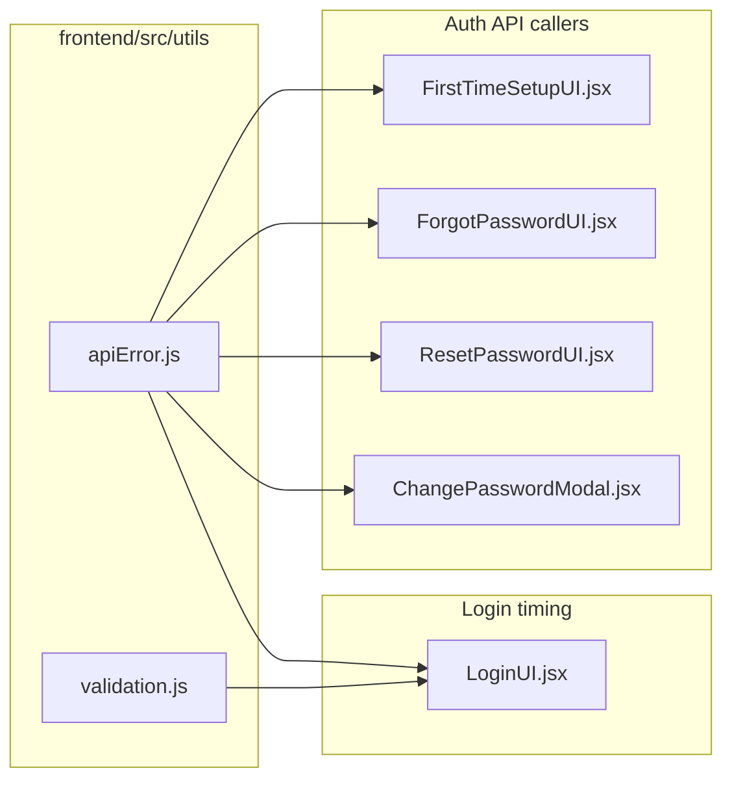

# Login validation UX and friendly auth errors - Plan

## Goal Capsule

**Objective:** Make the login page welcoming on first visit by hiding field validation until the user attempts to sign in, and show short user-friendly messages when auth API calls fail instead of raw backend or developer error text.

**Product authority:** This brainstorm corrects the login experience introduced by `docs/plans/2026-08-09-001-feat-frontend-form-validation-plan.md`, which required inline real-time validation including on initial page load.

**Open blockers:** None.

---

## Product Contract

### Summary

The login form should load with no error styling or required-field messages. Field-level validation appears only after the user clicks Sign In with missing input. Across all auth-related API flows, failed requests surface one plain-language message appropriate to the situation — for example, wrong credentials show "Wrong username or password" — never JSON bodies, stack traces, HTTP status text, or backend `detail` fields.

### Problem Frame

Users who open the login URL immediately see red borders and "Please enter your student code or lecturer code" / "Please enter your password" before typing anything. That feels broken and accusatory. Separately, when login or other auth calls fail, the UI can show raw API response text (including structured error payloads), which reads like a developer message rather than guidance for a student or lecturer.

### Actors

- A1. **Unauthenticated user** — signs in locally or via Google, completes first-time setup, or uses forgot/reset password.
- A2. **Authenticated user** — changes password from the student or lecturer dashboard.

### Requirements

**Login validation timing**

- R1. On initial page load, the login form shows no field-level error text and no error border styling on empty fields.
- R2. After the user clicks Sign In with one or more empty required fields, show the existing required-field messages for those fields.
- R3. Field errors clear as the user edits the corresponding field.
- R4. The Sign In button remains available for click even when fields are empty; validation runs on submit attempt, not preemptively on load.

**Friendly auth API errors**

- R5. Failed local login (`POST /api/auth/login`) shows a single form-level message: **"Wrong username or password"** for invalid credentials (HTTP 401). Do not show the backend message "Invalid IRN or password" or any other server wording for this case.
- R6. Auth API error display never shows raw JSON, HTTP status codes, field-level server validation dumps, or the backend `detail` property — only a short user-facing sentence.
- R7. Google sign-in failures (`POST /api/auth/google`) show a form-level friendly message instead of `alert()` with raw error text.
- R8. First-time setup failures (`POST /api/auth/google/upsert`) show a friendly form-level message instead of raw API text.
- R9. Forgot-password failures (`POST /api/auth/forgot-password`) show a friendly form-level message; success copy is unchanged.
- R10. Reset-password failures (`POST /api/auth/reset-password`) show a friendly form-level message.
- R11. Change-password failures (`POST /api/users/change-password`) show a friendly form-level message in the modal banner.

**Non-goals for this work**

- R12. Do not change validation timing on forgot-password, reset-password, first-time setup, or change-password field rules — only their API error presentation is in scope beyond login.
- R13. Do not change backend error payloads or add new API endpoints.

### Key Flows

- F1. **First visit to login** — user opens login URL → empty form, no errors → user clicks Sign In without filling fields → required-field messages appear under empty fields.
- F2. **Failed local login** — user enters credentials → Sign In → API returns 401 → form shows "Wrong username or password" once, above the button area; field values are preserved.
- F3. **Failed Google login** — user clicks Google sign-in → API or token error → inline friendly message on the login card (not `alert()`).
- F4. **Other auth flows** — forgot password, reset password, first-time setup, change password: existing field validation behavior stays; API failures show one friendly sentence per R6–R11.

### Acceptance Examples

- AE1. Open login URL in a fresh session: no red borders, no "Please enter…" text visible.
- AE2. Click Sign In with both fields empty: both required messages appear; typing in the code field clears only that field's error.
- AE3. Enter wrong credentials: message is exactly "Wrong username or password"; no JSON or "Invalid IRN or password" visible.
- AE4. Google login backend failure: user sees a short friendly message on the login form, not a browser alert with raw response text.
- AE5. Forgot-password API failure: user sees a generic retry message, not `email: must be a well-formed email address` or similar server field text.

### Scope Boundaries

**In scope:** `LoginUI.jsx` validation timing; friendly error mapping for all auth-related API callers listed in R5–R11; shared frontend error helper extension.

**Out of scope:** User management, submission upload, lecturer/student dashboards beyond change-password; backend message changes; adding a form library; changing non-auth `readApiErrorMessage` behavior for non-auth endpoints.

### Key Decisions

- KD1. **Validate login fields on Sign In attempt, not on page load** (session-settled: user-directed — chosen over immediate-on-load validation: prior real-time plan caused the reported UX problem). Governs R1–R4.

- KD2. **Wrong credentials copy is "Wrong username or password"** (session-settled: user-directed — chosen over backend wording "Invalid IRN or password"). Governs R5.

- KD3. **Friendly errors on all auth API calls; validation timing change on login only** (session-settled: user-directed — chosen over login-only for both concerns). Governs R5–R11, R12.

- KD4. **Map errors on the frontend; do not change backend responses** (user-approved — keeps scope small and avoids coupling deploy order). Governs R6, R13.

<!-- ce-section: work-relationships -->

### How This Work Fits Together

This plan owns login validation timing and friendly auth error presentation.

- **Relates to** `docs/plans/2026-08-09-001-feat-frontend-form-validation-plan.md` — that plan introduced shared `validation.js` and real-time inline errors (KD3 there). This work narrows login to submit-attempt validation while keeping shared validators and messages.
- **Can proceed independently of** dashboard, upload, or user-management error handling.
- **Still to decide in planning:** exact fallback copy per auth flow for non-401 errors (network down, 500, expired reset token) — product intent is generic friendly sentences, not technical detail.

---

## Planning Contract

### Summary

Gate login field-error display behind a submit-attempt flag so the form loads clean. Extend `frontend/src/utils/apiError.js` with auth-context friendly message mapping and wire it into every auth API caller. Replace Google login `alert()` calls with the same form-level error banner used for local login.

**Product Contract preservation:** Enriches this artifact in place; no behavior reinvention.

### Key Technical Decisions

- KTD1. **`hasAttemptedSubmit` boolean in `LoginUI`** — simplest gate for R1–R4; derive visible `fieldErrors` only when `hasAttemptedSubmit` is true. On submit click, set flag true then validate.
- KTD2. **Keep Sign In enabled when fields empty** — remove `disabled={!canSubmitLogin}` per R4; submit handler returns early after setting attempted flag and showing errors.
- KTD3. **`readFriendlyAuthError(response, context)` in `apiError.js`** — wraps existing JSON parse logic; maps HTTP status + context to user copy; never returns `detail`. Contexts: `login`, `google`, `setup`, `forgot-password`, `reset-password`, `change-password`.
- KTD4. **401 on login always → "Wrong username or password"** — regardless of backend `message` text (R5).
- KTD5. **Google errors use `formError` state** — remove `alert()` for API failures on login; keep console.error for dev debugging only.
- KTD6. **No new test runner** — verify via `npm run build` and manual auth flows.

### Friendly error copy (planning defaults)

| Context | Status / case | User message |
|---|---|---|
| `login` | 401 | Wrong username or password |
| `login` | other / network | Unable to sign in. Please try again. |
| `google` | 401 / 403 (non-setup) | Unable to sign in with Google. Please try again. |
| `setup` | 400 / 409 | Unable to complete setup. Please check your details and try again. |
| `forgot-password` | any failure | Unable to send reset email. Please try again. |
| `reset-password` | 400 / 404 | This reset link is invalid or expired. Please request a new one. |
| `change-password` | 401 | Current password is incorrect. |
| `change-password` | other | Unable to change password. Please try again. |

### High-Level Technical Design

LoginUI: `hasAttemptedSubmit` gates error display from `getLoginFieldErrors`. All auth callers: `readFriendlyAuthError(response, context)` on `!response.ok`.

### Assumptions

- Backend continues returning `ErrorResponse { message, detail }` JSON; frontend ignores `detail` for auth flows.
- Non-auth callers of `readApiErrorMessage` (e.g. `DropZone`, `UserManagement`) are unchanged in this work.

---

## Implementation Units

### U1. Friendly auth error helper

**Goal:** Single mapper for user-safe auth API error text.

**Requirements:** R5, R6

**Dependencies:** None

**Files:**
- Modify: `frontend/src/utils/apiError.js`

**Approach:**
1. Add `AUTH_ERROR_CONTEXTS` constant and `readFriendlyAuthError(response, context)` async export.
2. Parse body via existing logic internally; never surface `detail`.
3. Map by `response.status` and `context` per table above; fall back to context default on unknown status or unparseable body.
4. Keep `readApiErrorMessage` unchanged for non-auth callers.

**Test scenarios:**
- 401 + login context → "Wrong username or password" even when body message is "Invalid IRN or password".
- Body with `{ message: "...", detail: "Request failed." }` → user sees only mapped friendly text, never `detail`.
- Empty body + reset-password context → invalid/expired link message.

**Verification:** Module imports; `npm run build`.

---

### U2. Login validation timing

**Goal:** Clean login form on first visit; errors after Sign In attempt.

**Requirements:** R1, R2, R3, R4, R5, R7

**Dependencies:** U1

**Files:**
- Modify: `frontend/src/pages/LoginUI.jsx`

**Approach:**
1. Add `hasAttemptedSubmit` state (default `false`).
2. Compute `fieldErrors = hasAttemptedSubmit ? getLoginFieldErrors(irn, password) : { irn: '', password: '' }`.
3. On `handleLocalLogin`: set `hasAttemptedSubmit` true; if invalid, return without API call.
4. Remove `!canSubmitLogin` from Sign In `disabled` (keep `isLoading` only).
5. Replace `response.text()` error path with `readFriendlyAuthError(response, 'login')` for local login.
6. Add `googleFormError` or reuse `formError` for Google failures; replace `alert()` calls with `setFormError(...)` and render banner above Google button area.
7. Use `readFriendlyAuthError(resp, 'google')` in `handleGoogleSuccess` catch path.

**Patterns to follow:** Existing `formError` banner in `LoginUI`; `ForgotPasswordUI` submit gating pattern inverted (validate on submit, not on load).

**Test scenarios:**
- Covers AE1, AE2, AE3, AE4.
- Remember-me prefill: no errors until submit attempt.

**Verification:** Manual F1–F3; `npm run build`.

---

### U3. Remaining auth API callers

**Goal:** Friendly errors on setup, forgot, reset, change-password flows.

**Requirements:** R8, R9, R10, R11

**Dependencies:** U1

**Files:**
- Modify: `frontend/src/pages/FirstTimeSetupUI.jsx`
- Modify: `frontend/src/pages/ForgotPasswordUI.jsx`
- Modify: `frontend/src/pages/ResetPasswordUI.jsx`
- Modify: `frontend/src/components/student/ChangePasswordModal.jsx`

**Approach:**
1. **FirstTimeSetupUI** — replace raw `resp.text()` with `readFriendlyAuthError(resp, 'setup')`.
2. **ForgotPasswordUI** — replace `readApiErrorMessage` with `readFriendlyAuthError(response, 'forgot-password')`.
3. **ResetPasswordUI** — replace raw `response.text()` with `readFriendlyAuthError(response, 'reset-password')`.
4. **ChangePasswordModal** — replace `readApiErrorMessage` with `readFriendlyAuthError(response, 'change-password')`.

Field validation timing on these screens is unchanged (R12).

**Test scenarios:**
- Covers AE5.
- Change password with wrong current password shows "Current password is incorrect." not server JSON.

**Verification:** Manual F4; `npm run build`.

---

### U4. Documentation pass

**Goal:** Record the login validation timing contract for future form work.

**Requirements:** none (maintainability)

**Dependencies:** U2

**Files:**
- Modify: `frontend/src/pages/AGENTS.md` (login validation: submit-attempt gate, not on-load)

**Approach:** One bullet under Login local contracts noting deferred validation display and friendly auth errors via `apiError.js`.

**Verification:** Doc matches implemented behavior.

---

## Verification Contract

| Check | Command / action |
|---|---|
| Build | `npm run build` from `frontend/` |
| Login load | Fresh visit: no field errors (AE1) |
| Login empty submit | Click Sign In: required messages appear (AE2) |
| Wrong credentials | Message is "Wrong username or password" (AE3) |
| Google failure | Form banner, no alert (AE4) |
| Forgot password failure | Generic retry message (AE5) |

No automated frontend tests in repo; do not add a test runner in this work.

---

## Definition of Done

- [ ] Login page loads with no validation errors on empty fields
- [ ] Field errors appear only after Sign In click with missing input
- [ ] Wrong credentials show "Wrong username or password"
- [ ] No auth flow surfaces raw JSON, HTTP status, or backend `detail`
- [ ] Google login failures use inline form error, not `alert()`
- [ ] `readFriendlyAuthError` used by all auth API callers in scope
- [ ] `npm run build` passes
- [ ] Manual verification table completed

---

## System-Wide Impact

- **Students/lecturers:** Login feels welcoming; errors are understandable.
- **Developers:** Auth error copy centralized in `apiError.js`; login timing pattern documented.

---

## Risks & Dependencies

| Risk | Mitigation |
|---|---|
| Over-sanitizing hides useful server hints on setup conflicts | Context-specific messages; console.error retains raw body for debugging |
| Sign In enabled with empty fields may confuse users who expect disabled button | Required-field messages appear immediately on first click |

---

## Open Questions

None blocking. Fallback copy table above is the planning default; adjust wording during implementation only if product requests it.
