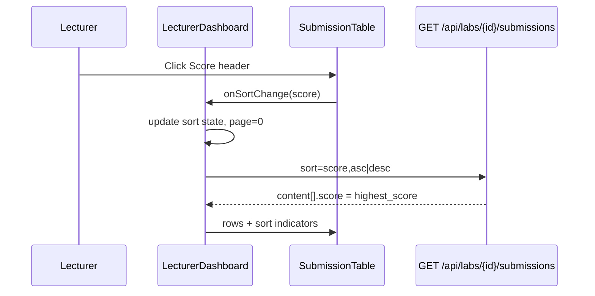

# Lecturer Roster Highest Score and Sort - Plan

## Goal Capsule

- **Objective:** Fix the Lecturer Dashboard lab **Student roster** so each row's Score reflects the student's **highest lab score**, and add sort controls for **name** and **score**.
- **Product authority:** This plan owns the lab-overview Student roster table on `LecturerDashboard` (data from `GET /api/labs/{labId}/submissions` and its export). Challenge-tab rosters, grade-overview grid, and student-facing dashboards are not active scope.
- **Open blockers:** None — ready for implementation.

## Product Contract

### Summary

The Student roster currently shows each enrolled student's **latest attempt** score because the roster query joins `lab_submission` ordered by most recent attempt. Lecturers expect the Score column to match the student's **best performance** for that lab — the value already tracked in `student_lab_progress.highest_score` and visible in the attempt-history drawer. Sorting is also missing in the UI even though the API accepts a `sort` parameter.

### Problem Frame

When a student re-submits and scores lower, the roster shows the lower latest score (e.g. 55%) while their highest attempt remains 100%. Lecturers scanning the roster misread performance and cannot order students by best score or name without exporting.

### Actors and Entry Points

- **Primary actor:** Lecturer viewing `LecturerDashboard` → grading overview → lab selected → Student roster section.
- **Entry points:** Roster table display, roster pagination, roster **Export** (Excel/PDF/SVG via `exportOverview`).

### Requirements

- R1. The **Score** column displays each student's **highest lab score** for the selected lab. Students with no submission show the existing empty/not-submitted treatment (`--` or equivalent).
- R2. **Attempt** and **Submitted At** columns continue to reflect the **latest attempt** (attempt number and timestamp of the most recent submission). They are not changed to the best-scoring attempt.
- R3. Lecturers can sort the roster **by student name** and **by score** from the table UI. Sorting is **server-side** (paginated roster stays correct across pages).
- R4. Sort controls live on the **Student** and **Score** column headers (clickable headers with direction indicator). Clicking an active sort column toggles ascending/descending; clicking the other column switches sort field and resets to ascending.
- R5. Default roster sort when the lecturer has not chosen a sort: **student name ascending**.
- R6. Score-based sort orders by **highest lab score** (same value as R1), not latest-attempt score. Students with no submission sort as null/zero per existing null-handling in the query.
- R7. Roster **export** uses the same highest-score value and respects the lecturer's current sort selection (or name ascending if export is invoked before any sort interaction).
- R8. Pagination resets to page 1 when sort field or direction changes.

### Flows and State

- F1. Lecturer opens lab → roster loads sorted by name ascending → Score shows highest score per student.
- F2. Lecturer clicks **Score** header → roster re-fetches sorted by score ascending → click again → descending.
- F3. Lecturer clicks **Student** header while sorted by score → roster re-fetches sorted by name ascending.
- F4. Lecturer exports → exported rows match displayed Score (highest) and current sort order.

### Acceptance Examples

- AE1. Student with attempts scoring 100%, 55% (latest) → roster Score shows **100**; Attempt shows **11** (latest attempt number); Submitted At shows latest submission time.
- AE2. Student with no submissions → Score shows placeholder; sort-by-score places them with other non-submitters at the bottom (or consistent null ordering).
- AE3. Sort by score descending → first page shows highest scores first across the full enrolled population, not only the current page's prior order.
- AE4. Export after sort-by-score descending → exported file row order matches score descending.

### Key Decisions

- KTD1. **Highest score from progress, not recomputed** — Use `student_lab_progress.highest_score` (already maintained on upload) rather than aggregating all `lab_submission` rows at read time. **Rejected:** latest-attempt join (current bug) and per-request MAX over submissions (extra query cost).
- KTD2. **Companion columns stay on latest attempt** — Only Score switches to highest; Attempt and Submitted At remain latest-attempt metadata so lecturers still see recency signals. **Rejected:** showing best-attempt metadata (would hide that the student recently submitted a lower score).
- KTD3. **Header-click sort on Student and Score** — Reuse established table patterns (`UserTable` / `GradeOverviewSubmissionHistory` direction toggles) on column headers rather than a separate toolbar-only control. **Rejected:** client-side sort of the current page only (wrong for pagination).
- KTD4. **Lab roster only** — Challenge-tab submission tables and grade-overview grid are out of scope for this change.

### Scope Boundaries

**In scope**

- Backend roster query and sort mapping for lab submissions endpoint and export.
- Frontend `SubmissionTable` / `LecturerDashboard` sort state and API `sort` parameter wiring for the lab Student roster.
- Export column values aligned with highest score.

**Out of scope**

- Challenge-tab per-challenge roster (`GET /api/labs/{labId}/challenges/{challengeId}/students`).
- Grade overview matrix sorting or score semantics.
- Student dashboard score display (latest attempt by design).
- Changing how `highest_score` is computed on upload.

### Success Criteria

- SC1. Roster Score matches `student_lab_progress.highest_score` for every student with submissions.
- SC2. Name and score sort work across paginated pages with stable server ordering.
- SC3. Export reflects highest score and active sort.
- SC4. No regression to roster row count (one row per enrolled student for the lab term).

### Risks and Assumptions

- **Assumption:** `highest_score` on `student_lab_progress` is accurate for all historical data (maintained on upload). If legacy rows are stale, roster could disagree with attempt-history MAX — separate data repair is out of scope.
- **Risk:** Sort column change in SQL must use `p.highest_score` for score sort while display column also uses highest score — keep both aligned in the same change.

## Planning Contract

### Summary

Root cause is in `LecturerAnalyticsRepository.findLabStudentRosterInternal`: the SELECT uses `latest_sub.score` from a `DISTINCT ON (user_id) ORDER BY attempt_number DESC` subquery. Fix by returning `p.highest_score` for the Score column while keeping `latest_sub` for attempt number and submitted-at. Update `LecturerAnalyticsService.resolveLabSort` so `sort=score` orders on `p.highest_score` (with null-safe ordering for non-submitters). Frontend currently hardcodes `sort=submittedAt,desc` in `fetchSubmissions`; add roster sort state (`field: studentName | score`, `direction: asc | desc`), wire header clicks in `SubmissionTable`, pass `sort` to list and export endpoints, and default to `studentName,asc`.

**Product Contract preservation:** Unchanged — enriched from brainstorm requirements-only artifact.

### Key Technical Decisions

- KTD5. **Single SQL change for display + sort column** — Both roster SELECT score and `resolveLabSort` score mapping use `p.highest_score`. Non-submitters: `p` may be NULL; use `NULLS LAST` in ORDER BY for score sorts so enrolled non-submitters group at the end regardless of direction.
- KTD6. **Sort API strings** — Reuse existing `resolveLabSort` field names: `studentName,asc|desc` and `score,asc|desc` (no new backend param shape).
- KTD7. **SubmissionTable sort props** — Add optional `sortField`, `sortDirection`, `onSortChange(field)`; only Student and Score headers are interactive when `onSortChange` is provided (challenge roster can omit).
- KTD8. **Export sort** — Extend `fetchAllLabSubmissions(labId, sort)` to pass `?sort=` matching current roster sort; label export column `Lab Score` continues to use `r.score` from API (now highest).

### Assumptions

- `formatNumber(null)` in `SubmissionTable` already renders `--` for missing scores (verify during implementation).
- No JWT required for lecturer roster endpoints (consistent with open `SecurityConfig`).

### Risks & Dependencies

| Risk | Mitigation |
|---|---|
| `highest_score` is 0 for progress rows created before first graded upload | Treat 0 with no `latest_sub` as no submission (display `--`); only show numeric score when `latest_sub` exists OR `p.best_submission_id` is set |
| Keyset pagination (`afterName`/`afterId`) unused by frontend today | Leave keyset path unchanged; offset pagination is what `LecturerDashboard` uses |

### High-Level Technical Design

## Implementation Units

### U1. Backend — highest score in roster query and sort

**Goal:** Roster API returns and sorts by `student_lab_progress.highest_score` for the Score field.

**Requirements:** R1, R6, SC1, SC2

**Dependencies:** None

**Files:**

- `backend/src/main/java/com/eiu/capstone/backend/analytics/repository/LecturerAnalyticsRepository.java`
- `backend/src/main/java/com/eiu/capstone/backend/analytics/service/LecturerAnalyticsService.java`

**Approach:**

1. In `findLabStudentRosterInternal`, change SELECT score column from `latest_sub.score` to `p.highest_score` (keep `latest_sub` for attempt_number, submitted_at, submission_id).
2. In `resolveLabSort`, change score case from `latest_sub.score` to `p.highest_score`.
3. For score ORDER BY, append `NULLS LAST` in the formatted SQL when sort column is `p.highest_score` (or use `COALESCE(p.highest_score, -1)` if simpler — prefer NULLS LAST for semantic clarity).
4. Smoke-check export path (`findLabStudentRosterExport`) uses the same internal query.

**Patterns to follow:** `LecturerAnalyticsRepository` roster CTE + `ROSTER_STUDENT_BASE`; existing `resolveLabSort` switch in `LecturerAnalyticsService`.

**Test scenarios:**

- Student with progress `highest_score=100` and latest submission `score=55` → API `score` field is 100
- Student enrolled with no submissions → `score` null/absent, attempt 0, submittedAt null
- `sort=score,desc` returns highest scores first; non-submitters last
- `sort=studentName,asc` unchanged behavior

**Test expectation:** none — no automated backend test for analytics repository; optional manual API check via Swagger.

**Verification:** `GET /api/labs/{labId}/submissions?sort=score,desc` returns expected ordering for a lab with mixed scores.

---

### U2. Frontend — roster sort state and API wiring

**Goal:** `LecturerDashboard` drives server-side sort and resets pagination on sort change.

**Requirements:** R3, R5, R7, R8, F1–F4

**Dependencies:** U1

**Files:**

- `frontend/src/pages/LecturerDashboard.jsx`

**Approach:**

1. Add state: `rosterSortField` (`'studentName' | 'score'`), `rosterSortDirection` (`'asc' | 'desc'`), default `studentName` / `asc`.
2. Build `sort` query param: `${rosterSortField},${rosterSortDirection}` (map `studentName` → API expects `studentName` per `resolveLabSort`).
3. Update `fetchSubmissions(labId, page, sort)` to use dynamic sort instead of hardcoded `submittedAt,desc`.
4. `handleRosterSort(field)` — if same field toggle direction; else set field and `asc`; reset page to 0; refetch.
5. Reset sort to default when `selectedLabId` changes.
6. Update `fetchAllLabSubmissions(labId, sort)` to append `?sort=`; `exportOverview` passes current roster sort.

**Patterns to follow:** `UserManagement.jsx` sort direction toggle; `historySortDirection` in same file for grading history.

**Test scenarios:**

- Lab load fetches with `sort=studentName,asc`
- Toggle score sort twice produces `score,asc` then `score,desc`
- Switch from score to name sort resets to `studentName,asc`
- Export after sort uses same order in downloaded file

**Test expectation:** none — no frontend test harness.

**Verification:** Manual — network tab shows correct `sort` param on pagination and sort clicks.

---

### U3. Frontend — sortable SubmissionTable headers

**Goal:** Student and Score column headers show sort affordance and invoke parent sort handler.

**Requirements:** R4

**Dependencies:** U2

**Files:**

- `frontend/src/components/lecturer/SubmissionTable.jsx`

**Approach:**

1. Add optional props: `sortField`, `sortDirection`, `onSortChange(field)` where `field` is `'studentName' | 'score'`.
2. Student header: `button` or clickable `th` with `ChevronUp`/`ChevronDown` when active (import from `lucide-react` like `UserTable`).
3. Score header: same pattern.
4. Other columns remain static headers.
5. Only wire sort UI when `onSortChange` is provided (challenge tab usage unchanged).

**Patterns to follow:** `UserTable.jsx` chevron sort button styling; table header text classes in existing `SubmissionTable`.

**Test scenarios:**

- Click Student header calls `onSortChange('studentName')`
- Active column shows direction chevron
- Table without `onSortChange` renders plain headers

**Test expectation:** none

**Verification:** Manual header click updates roster order.

---

### U4. Docs — AGENTS.md contract updates

**Goal:** DOX reflects highest-score roster behavior and sort controls.

**Requirements:** SC4

**Dependencies:** U1–U3

**Files:**

- `frontend/src/components/lecturer/AGENTS.md`
- `backend/AGENTS.md` (roster endpoint note if present)

**Approach:** Update roster bullets: Score = highest lab score; default sort name asc; Student/Score header sort; export uses active sort.

**Verification:** Doc pass only.

## Verification Contract

| Check | Command / action |
|---|---|
| Frontend build | `npm run build` from `frontend/` |
| Backend compile | `mvn -q -DskipTests compile` from `backend/` |
| Manual roster score | Lecturer dashboard → lab with re-submitted student → Score matches attempt-history max |
| Manual sort | Sort by score desc → page 1 top scores; paginate → order stable |
| Manual export | Export after sort → file order and scores match table |

No automated test suite in either tier (`AGENTS.md`).

## Definition of Done

- [ ] Roster `score` API field is `highest_score` for students with submissions (U1)
- [ ] Score sort uses highest score column (U1)
- [ ] Student roster defaults to name ascending (U2)
- [ ] Header sort on Student and Score with direction toggle (U3)
- [ ] Export uses highest score and active sort (U2)
- [ ] Attempt and Submitted At still reflect latest attempt (regression check)
- [ ] `npm run build` and `mvn compile` succeed
- [ ] AGENTS.md updated (U4)
- [ ] Challenge-tab roster unchanged (out of scope)
