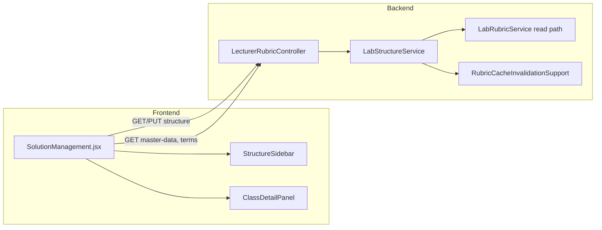

# Lab Structure Editor - Plan

## Goal Capsule

- **Objective:** Replace the mock Solution tab with a lecturer-facing **Lab Structure Editor** so lecturers can create and edit lab rubrics (Lab → Problem/Challenge → Class → fields, methods, constructors) and persist them to PostgreSQL via a bulk-save API.
- **Product authority:** This plan owns the lecturer **Solution** nav section (`activeNav === 'projects'`), new lecturer rubric-authoring APIs, and removal of the mock upload/testcase UI in `SolutionManagement.jsx`. MMD relation editing, structural testcase authoring, and file-upload solution import are not active scope.
- **Open blockers:** None — ready for implementation.

## Product Contract

### Summary

Lecturers currently have no way to author the grading rubric in-app; `SolutionManagement.jsx` is mock-only while rubric data lives in PostgreSQL and is consumed by the grading engine. This feature delivers a two-panel editor matching the provided mockups: a **Structure** sidebar (labs, problems, classes with add/delete) and a **class detail** workspace (definition, fields, methods, constructors with inline parameters). Lecturers edit in draft state and persist with **Save Lab Structure**.

### Problem Frame

Without rubric authoring, lecturers depend on manual database seeding or external scripts to define what students are graded against. The existing Solution tab's file-upload and testcase modals do not connect to the real rubric model and create false expectations.

### Actors and Entry Points

- **Primary actor:** Lecturer with `LECTURER` role, routed to `/lecturer-solution` via `LecturerDashboard`.
- **Entry points:** Structure sidebar navigation, class detail forms, **Save Lab Structure** button, lab create (term picker), lab/problem/class delete with confirmation.

### Requirements

- R1. **Remove mock Solution UI** — delete file-upload, replace-solution, and testcase modals from the Solution tab. No mock `INITIAL_SOLUTIONS` data remains.
- R2. **Structure sidebar** shows all labs from the database. Expanding a lab shows its problems (challenges). Expanding a problem shows its classes. Lecturer can add a lab, add a problem under a lab, and add a class under a problem.
- R3. **Lab creation** requires selecting an academic **term** from a picker (`term_id` is mandatory in the `lab` table).
- R4. Selecting a class in the sidebar opens the **class detail** panel on the right with collapsible sections: Class Definition, Fields, Methods, Constructors.
- R5. **Class Definition** fields: name (text), scope (combo from `master_data` where `category = 'SCOPE'`), declaring type (combo from `master_data` where `category = 'DECLARING_TYPE'`), abstract (checkbox).
- R6. **Fields** section: each row uses a 6-3-3 grid (field name, type, scope combo) plus trash icon. **Add field** button below the list.
- R7. **Methods** section: method name, return type, scope combo, **static** checkbox, **abstract** checkbox, trash icon, inline **parameter rows** (name + type, add/remove). **Add method** button below.
- R8. **Constructors** section: constructor name, scope combo, **default** checkbox, inline parameter rows, trash icon. **Add constructor** button below.
- R9. **Bulk save** — edits remain client-side until the lecturer clicks **Save Lab Structure**, which persists the full selected lab tree to the backend in one operation.
- R10. **Unsaved changes** — switching to another lab or navigating away with unsaved edits prompts the lecturer to save, discard, or cancel.
- R11. **Delete with confirmation** — deleting a lab, problem, or class shows a strong warning. Deletes are allowed even when student submissions exist (confirm + cascade per product decision).
- R12. **Master data combos** load scope and declaring-type options from the API; stored values are `scope_id` / `declaring_type_id` integers referencing `master_data.id`.
- R13. **Lecturer-only write APIs** require a valid JWT with `LECTURER` role (same pattern as `UserController`).
- R14. After a successful save, the in-process **lab rubric cache** is invalidated so subsequent student uploads grade against the updated rubric.

### Flows and State

- F1. Lecturer opens Solution tab → editor loads lab list and master-data lookups → first lab auto-selected or empty state shown.
- F2. Lecturer selects class → detail panel binds to that class's draft state.
- F3. Lecturer edits fields/methods/constructors → `dirty` flag set → Save enabled.
- F4. Lecturer clicks Save → API persists → success toast → dirty cleared → sidebar IDs refreshed from response.
- F5. Lecturer creates new lab → term picker modal → lab appears in sidebar → lecturer adds problems and classes → Save persists all.
- F6. Lecturer deletes class with submissions → confirmation names impact → on confirm, class removed from draft; Save cascades deletion in DB.

### Acceptance Examples

- AE1. Lecturer creates Lab "Lab 01: Abstraction" for Term 1, adds Problem "Problem 1 – Vehicle", adds class `Vehicle` (PUBLIC, ABSTRACT_CLASS, abstract=true) with one field `speed: double PRIVATE`, method `getSpeed(): double PUBLIC static=false abstract=false`, constructor `Vehicle() PUBLIC default=true` → Save → reload page → structure intact.
- AE2. Lecturer edits scope on an existing field and saves → student submission graded after save uses new scope in rubric snapshot.
- AE3. Lecturer attempts to switch labs with unsaved edits → blocked by confirmation dialog.
- AE4. Non-lecturer JWT on save endpoint → HTTP 403.

### Key Decisions

- KTD1 (product, session-settled): **Structure-only v1** — no MMD relations, no testcase authoring, no file upload. Chosen over full-rubric editor to ship the core hierarchy first.
- KTD2 (product, session-settled): **Full lab CRUD** with term picker on create. Chosen over edit-existing-only.
- KTD3 (product, session-settled): **Bulk save** over auto-save or per-class save. Matches mockup and reduces partial-state bugs.
- KTD4 (product, session-settled): **Confirm + cascade delete** when submissions exist. Chosen over block-delete or soft-delete.
- KTD5 (product): Method modifiers expose **static** and **abstract** only in v1 (matches mockup and `method_declaration` columns). `final` and `interface` deferred.
- KTD6 (product): Parameter entry uses **inline rows** (name + type per parameter) for methods and constructors.

### Scope Boundaries

**In scope:** Solution tab replacement, lecturer read/write APIs for lab structure, master-data category lookups, term list for lab creation, rubric cache invalidation, backend service tests for save/load.

**Deferred for later (from brainstorm):**

- MMD class-relation editor (inheritance/implements links)
- Structural testcase authoring (`check_type` EXISTENCE/DECLARATION)
- File upload / zip solution import
- Auto-generating testcases from rubric elements
- Method `final` checkbox and `interface` semantics

**Deferred to Follow-Up Work:**

- Dedicated integration/E2E browser test for the full editor flow (manual verification sufficient for v1 given no frontend test harness)
- Lecturer auth on existing read-only lab/challenge endpoints (out of scope for this tab)

### Success Criteria

- Lecturer can create a complete lab rubric from empty state without database tools.
- Saved rubric is loaded by `LabRubricService` and affects grading on the next student upload.
- Mock Solution UI is fully removed.

## Planning Contract

### Summary

Add a `LecturerRubricController` under `/api/lecturer` with JWT lecturer guard, a `LabStructureService` for read/save, and replace `SolutionManagement.jsx` with a component tree (`LabStructureEditor` + sidebar + class detail sections). Save uses a **full-lab snapshot upsert** inside one `@Transactional` method, then calls `RubricCacheInvalidationSupport.invalidateLab`.

### High-Level Technical Design

**Save strategy (KTD7):** The PUT payload is the **complete lab tree** the lecturer wants after save. The service:

1. Validates lab exists (or creates on POST for new lab — see U4).
2. Upserts challenges (by id or assigns `challenge_number` sequentially for new).
3. Upserts classes and member rows (field/method/constructor + their `*Declaration` rows + parameters).
4. Deletes any existing challenges/classes/members under the lab **not present** in the payload (cascade order: parameters → members → declarations → classes → challenges).
5. Invalidates rubric cache.

Client-generated UUIDs for new entities are accepted on create; omitted ids get server-generated UUIDs.

**Payload note:** User-provided JSON examples included `check_type: "DECLARATION"` — that belongs to the `testcase` table, not rubric member rows. Save DTOs omit `check_type`.

### Key Technical Decisions

- **KTD7:** Full-lab snapshot upsert in one transaction. Chosen over per-entity REST CRUD because it matches bulk-save UX and avoids orphan rows mid-edit.
- **KTD8:** New controller namespace `/api/lecturer/labs/...` with private `requireLecturer` using injected `JwtAuthHelper` (same pattern as `UserController`). Chosen over unauthenticated writes on existing `LabController`.
- **KTD9:** Read endpoint returns the same DTO shape as save payload (minus server-only fields) so FE can round-trip. Reuses `LabRubricService` batch queries internally.
- **KTD10:** `MasterDataRepository.findByCategory(String)` added; expose `GET /api/master-data?category=SCOPE|DECLARING_TYPE`.
- **KTD11:** Frontend draft state in `SolutionManagement.jsx` (or extracted hook `useLabStructureDraft`) with `crypto.randomUUID()` for new entity ids before first save.

### Assumptions

- Seeded `master_data` rows use categories `SCOPE` and `DECLARING_TYPE` (verify against DB; adjust category strings if seed data differs).
- `*Declaration` rows are owned 1:1 by their member row (not shared across fields) — matches current JPA model.
- Constructor `name` defaults to parent class name when lecturer leaves it blank (normalize on save).

### Risks and Dependencies

- **Cascade delete + submissions:** Deleting rubric elements may orphan `submission_*_result` rows. Acceptable per product decision; log counts in delete confirmation copy on FE.
- **Large labs:** Full-tree payload may grow. Acceptable for v1 lab sizes; no pagination of structure editor.
- **No Flyway:** Schema already exists; no migration required unless category index missing in target DB.

### System-Wide Impact

- **Grading engine:** Reads updated rubric via `LabRubricCache` after invalidation.
- **Student UI:** Unaffected directly; challenge list/scores reflect new rubric on next upload.
- **DOX:** Update `frontend/AGENTS.md`, `frontend/src/pages/AGENTS.md`, `backend/AGENTS.md` mock→live table entries.

---

## Implementation Units

### U1. Master data and terms read APIs

**Goal:** Expose combo-box data for scope, declaring type, and term picker.

**Requirements:** R12, R3

**Dependencies:** None

**Files:**

- `backend/src/main/java/com/eiu/capstone/backend/repository/MasterDataRepository.java`
- `backend/src/main/java/com/eiu/capstone/backend/controller/MasterDataController.java` (new)
- `backend/src/main/java/com/eiu/capstone/backend/controller/TermController.java` (new)
- `backend/src/main/java/com/eiu/capstone/backend/DTO/MasterDataItemDTO.java` (new)
- `backend/src/main/java/com/eiu/capstone/backend/DTO/TermSummaryDTO.java` (new)
- `backend/src/test/java/com/eiu/capstone/backend/controller/MasterDataControllerTest.java` (new)

**Approach:**

1. Add `List<MasterData> findByCategory(String category)` to repository.
2. `GET /api/master-data?category=` returns `{ id, name, category }[]`.
3. `GET /api/terms` returns term id + display label (academic year + term number).
4. Both endpoints are unauthenticated reads (consistent with current lab list); only writes require lecturer JWT.
5. Add `docs/sql/2026-08-10-master-data-categories.sql` (or extend existing seed) to set `category = 'SCOPE'` and `category = 'DECLARING_TYPE'` on existing `master_data` rows used by rubrics. Verify live DB category strings before shipping; empty combos block the editor.

**Patterns to follow:** `LabController.listLabs` for simple list DTO mapping.

**Test scenarios:**

- Returns only SCOPE rows when `category=SCOPE`.
- Returns empty list for unknown category.
- Terms endpoint returns stable sort (year desc, term number asc).

**Verification:** `mvn -f backend test -Dtest=MasterDataControllerTest` passes.

---

### U2. Lab structure DTOs and read service

**Goal:** Define round-trip DTOs and load a lab's full rubric tree for the editor.

**Requirements:** R2, R4–R8, R12

**Dependencies:** U1

**Files:**

- `backend/src/main/java/com/eiu/capstone/backend/DTO/rubric/LabStructureResponse.java` (new)
- `backend/src/main/java/com/eiu/capstone/backend/DTO/rubric/ChallengeStructureDTO.java` (new)
- `backend/src/main/java/com/eiu/capstone/backend/DTO/rubric/ClassStructureDTO.java` (new)
- `backend/src/main/java/com/eiu/capstone/backend/DTO/rubric/FieldStructureDTO.java` (new)
- `backend/src/main/java/com/eiu/capstone/backend/DTO/rubric/MethodStructureDTO.java` (new)
- `backend/src/main/java/com/eiu/capstone/backend/DTO/rubric/ConstructorStructureDTO.java` (new)
- `backend/src/main/java/com/eiu/capstone/backend/DTO/rubric/ParameterStructureDTO.java` (new)
- `backend/src/main/java/com/eiu/capstone/backend/service/LabStructureService.java` (new)
- `backend/src/test/java/com/eiu/capstone/backend/service/LabStructureServiceReadTest.java` (new)

**Approach:**

1. Mirror user JSON shapes: class has `name`, `scope_id`, `declaring_type_id`, `is_abstract`; field has `name`, `data_type`, `scope_id`; method has `name`, `return_type`, `scope_id`, `is_static`, `is_abstract`, `parameters[]`; constructor has `name`, `scope_id`, `is_default`, `parameters[]`.
2. Include stable UUID `id` on every entity for round-trip.
3. `loadForEditor(UUID labId)` uses the same batch query pattern as `LabRubricService.loadForLab` / `ClassStructureService.loadChallengeStructures`.
4. Map `challenge_number` and challenge `name` on problems.

**Patterns to follow:** `LabRubricService.java` batch loading; `ClassStructureService` master-data label resolution not needed on write DTOs (ids only).

**Test scenarios:**

- Lab with one challenge, one class, one field/method/constructor returns nested DTO with correct ids and scope ids.
- Empty lab returns challenges `[]`.
- Unknown lab id throws 404.

**Verification:** Read service unit test passes with in-memory or `@DataJpaTest` fixture.

---

### U3. Lab structure bulk save service

**Goal:** Persist full lab tree in one transaction with upsert and orphan cleanup.

**Requirements:** R9, R11, R14

**Dependencies:** U2

**Files:**

- `backend/src/main/java/com/eiu/capstone/backend/service/LabStructureService.java` (extend)
- `backend/src/test/java/com/eiu/capstone/backend/service/LabStructureServiceSaveTest.java` (new)

**Approach:**

1. `saveLabStructure(UUID labId, LabStructureSaveRequest payload)` annotated `@Transactional`.
2. Validate required fields (non-blank names, valid `scope_id` / `declaring_type_id` FKs).
3. Upsert challenges preserving `(lab_id, challenge_number)` uniqueness — assign next number for new challenges without number.
4. For each class: upsert `ClassEntity`; for each member create/update `*Declaration` then member row; replace parameters by delete-and-reinsert per method/constructor.
5. After upsert, delete challenges (and cascaded children) under the lab whose ids are absent from payload.
6. Call `rubricCacheInvalidationSupport.invalidateLab(labId)`.
7. Return saved `LabStructureResponse` (same as GET).

**Execution note:** Start with failing save tests for create, update, and delete-member scenarios before implementing service logic.

**Test scenarios:**

- Save new class with field/method/constructor creates all rows and declarations.
- Save removes a field omitted from payload (orphan cleanup).
- Save updates `scope_id` on existing method declaration.
- Invalid `scope_id` returns 400 with field-level message.
- Parameters preserve `order_index` from array order.

**Verification:** Save service tests pass; manual Swagger PUT returns updated GET.

---

### U4. Lecturer rubric REST controller

**Goal:** Wire lecturer-protected HTTP endpoints for structure read/save and lab CRUD.

**Requirements:** R1–R3, R9, R13

**Dependencies:** U2, U3

**Files:**

- `backend/src/main/java/com/eiu/capstone/backend/controller/LecturerRubricController.java` (new)
- `backend/src/test/java/com/eiu/capstone/backend/controller/LecturerRubricControllerTest.java` (new)

**Approach:**

1. `@RequestMapping("/api/lecturer/labs")` with `JwtAuthHelper` injected.
2. `GET /{labId}/structure` → loadForEditor.
3. `PUT /{labId}/structure` → saveLabStructure (body = save request).
4. `POST /` → create lab `{ name, termId }` via `LabService.createLab`.
5. `DELETE /{labId}` → `LabStructureService.deleteLabCascade(labId)` — explicit child teardown in FK-safe order (parameters → members → declarations → classes → challenges → lab). Do not call bare `LabService.deleteLab` alone; FK constraints will fail.
6. All mutating methods call `requireLecturer(authHeader)`.

**Patterns to follow:** `UserController.requireLecturer`; `GlobalExceptionHandler` for 404/400.

**Test scenarios:**

- Covers AE4: missing/invalid token → 403 on PUT.
- Covers AE1: POST lab + PUT structure → GET returns saved tree.
- DELETE lab removes lab row.

**Verification:** Controller slice tests with mocked service pass.

---

### U5. Replace Solution page shell and sidebar

**Goal:** Remove mock UI; render two-panel layout with structure tree.

**Requirements:** R1, R2, R3, R10, R11

**Dependencies:** U4

**Files:**

- `frontend/src/pages/SolutionManagement.jsx` (replace)
- `frontend/src/components/lecturer/structure/StructureSidebar.jsx` (new)
- `frontend/src/components/lecturer/structure/LabCreateModal.jsx` (new)
- `frontend/src/utils/authHeaders.js` (reuse)

**Approach:**

1. On mount: `GET /api/lecturer/labs` is not available — use existing `GET /api/labs` for list; load selected lab structure via `GET /api/lecturer/labs/{id}/structure`.
2. Sidebar: expandable lab → problems → classes; highlight selected class; **+** buttons for lab (opens term modal), problem, class.
3. Track `draftByLabId`, `selectedLabId`, `selectedClassId`, `isDirty`.
4. Delete buttons on lab/problem/class trigger confirmation modal with cascade warning text.
5. Unsaved guard on lab switch (R10).

**Patterns to follow:** `LecturerDashboard.jsx` fetch + error banners; `UserManagement.jsx` modal patterns; mockup layout (dark theme, purple accents).

**Test expectation:** none — layout component; manual browser verification.

**Verification:** Solution tab renders live lab list; mock table/upload UI gone.

---

### U6. Class detail form sections

**Goal:** Implement class definition, fields, methods, and constructors panels per mockup.

**Requirements:** R4–R8, R12

**Dependencies:** U5

**Files:**

- `frontend/src/components/lecturer/structure/ClassDetailPanel.jsx` (new)
- `frontend/src/components/lecturer/structure/ClassDefinitionSection.jsx` (new)
- `frontend/src/components/lecturer/structure/FieldsSection.jsx` (new)
- `frontend/src/components/lecturer/structure/MethodsSection.jsx` (new)
- `frontend/src/components/lecturer/structure/ConstructorsSection.jsx` (new)
- `frontend/src/components/lecturer/structure/ParameterRows.jsx` (new)

**Approach:**

1. Class definition: text input + two `<select>` from cached master data + abstract checkbox.
2. Fields: Tailwind grid `grid-cols-12` with `col-span-6/3/3` for name/type/scope + trash.
3. Methods: name, return type, scope select, static + abstract checkboxes, `ParameterRows`, trash.
4. Constructors: name, scope, default checkbox, `ParameterRows`, trash.
5. All edits immutably update the draft tree at `draft.challenges[].classes[]`.

**Patterns to follow:** Existing form styling in `UserModal.jsx` / lecturer dashboard cards.

**Test expectation:** none — manual UX verification against mockup.

**Verification:** Selecting a class shows editable sections; add/remove rows update draft only.

---

### U7. Save Lab Structure integration

**Goal:** Wire save button, API calls, loading/error states, and post-save refresh.

**Requirements:** R9, R10, R14

**Dependencies:** U5, U6

**Files:**

- `frontend/src/pages/SolutionManagement.jsx`
- `frontend/src/hooks/useLabStructureDraft.js` (new, optional extract)

**Approach:**

1. Sticky footer **Save Lab Structure** button (purple, mockup).
2. On save: `PUT /api/lecturer/labs/{labId}/structure` with draft payload; `authHeaders` + JSON body.
3. On success: replace draft with response body, clear dirty, toast success.
4. On 400: show validation message; on 403: redirect/login message.
5. Load master data once: `GET /api/master-data?category=SCOPE`, `DECLARING_TYPE`; `GET /api/terms` for create modal.

**Test scenarios (manual):**

- Covers AE1: create lab, add structure, save, refresh — data persists.
- Covers AE3: dirty switch lab shows confirmation.
- Save button disabled when not dirty or while saving.

**Verification:** End-to-end manual flow completes without console errors.

---

### U8. DOX and AGENTS updates

**Goal:** Document new live Solution tab and API surface.

**Requirements:** (process)

**Dependencies:** U7

**Files:**

- `frontend/AGENTS.md`
- `frontend/src/pages/AGENTS.md`
- `backend/AGENTS.md`

**Approach:** Replace "mock local state" rows with live API mapping; fix `frontend/src/pages/AGENTS.md` row that still names `SubmissionManagement.jsx` — the `projects` nav renders `SolutionManagement.jsx`. Add `LecturerRubricController` to backend API table.

**Test expectation:** none — docs only.

**Verification:** DOX accurately describes Solution tab APIs.

---

## Verification Contract

| Check | Command / action |
|---|---|
| Backend unit tests | `mvn -f backend test` |
| Frontend build | `npm run build` (from `frontend/`) |
| Manual: editor load | Login as lecturer → Solution tab → labs list from API |
| Manual: save round-trip | Create structure → Save → refresh → data persists |
| Manual: grading impact | Save rubric change → student re-upload → grading reflects new element |

## Definition of Done

- [ ] All requirements R1–R14 satisfied
- [ ] Acceptance examples AE1–AE4 verified manually
- [ ] Backend tests for U1–U4 pass
- [ ] `npm run build` succeeds
- [ ] Mock upload/testcase UI removed
- [ ] AGENTS.md files updated
- [ ] Rubric cache invalidated on save (observable via changed grading behavior or invalidation unit assertion)

## Appendix

### Product Contract preservation

Product Contract authored from ce-plan-bootstrap (brainstorm dialogue, no separate requirements-only artifact file). Scope matches confirmed brainstorm synthesis: structure-only, bulk save, full lab CRUD with term picker, confirm+cascade delete, static+abstract method flags, inline parameters.

### Sources and Research

- Existing rubric load: `backend/src/main/java/com/eiu/capstone/backend/grading/rubric/LabRubricService.java`
- Read patterns: `backend/src/main/java/com/eiu/capstone/backend/service/ClassStructureService.java`
- Auth pattern: `backend/src/main/java/com/eiu/capstone/backend/controller/UserController.java`
- Mock to replace: `frontend/src/pages/SolutionManagement.jsx`
- Cache invalidation: `backend/src/main/java/com/eiu/capstone/backend/grading/rubric/RubricCacheInvalidationSupport.java`
