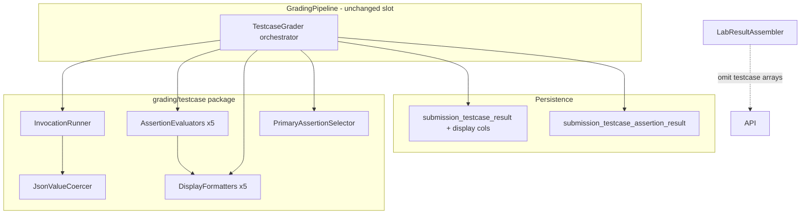

# Operational Testcase Grading - Plan

## Goal Capsule

- **Objective:** Replace structural EXISTENCE/DECLARATION testcase grading with operational invoke-based testcases that execute student code via Java reflection, evaluate multi-kind assertions, persist assertion-level and display-ready results, and keep testcase pillar scores in challenge/lab totals — without exposing testcase detail in API responses until a later frontend phase.
- **Product authority:** This plan owns backend schema migration, rubric loading, grading engine replacement for the testcase pillar, and grade-time persistence of I/O display fields. Frontend I/O card rendering, lecturer rubric editor, and API exposure of testcase arrays are not active scope.
- **Stop conditions:** Do not change class-reflection or MMD pillars. Do not expose testcase arrays in API responses (R24). Do not build lecturer rubric editor UI. Do not add stdin injection or multi-call sequence testcases.

---

## Product Contract

**Product Contract preservation:** Unchanged — planning adds HOW sections only. Stable R/A/F/AE IDs from brainstorm retained.

### Summary

The testcase pillar becomes operational: each rubric testcase invokes a student constructor or method once (or builds two instances for comparison), checks one or more assertions (return value, field state, stdout, exception, comparison result), and persists per-assertion outcomes plus a primary I/O display bundle for a future student-facing expandable card. Grading uses an invocation runner and per-kind assertion evaluators mirrored by per-kind display formatters. API responses omit testcase rows for now; scores still include the testcase pillar.

### Problem Frame

Structural EXISTENCE/DECLARATION testcases duplicate what the class-reflection pillar already checks and do not verify runtime behavior. Students need LeetCode-style I/O feedback — what was invoked, what was expected, and what their code actually produced — when a testcase fails. The current `TestcaseGrader` only inspects parsed reflection metadata and returns a single feedback string, which cannot power the target three-column card UI.

### Key Decisions

- **Operational invoke grading over structural checks** — drop `check_type`, `target_type`, and `target_id`; adopt invocation-based schema from `testcase_schema_design.docx`. (session-settled: user-directed — chosen over keeping EXISTENCE/DECLARATION: redundant with class pillar)
- **Layered runner + evaluators + formatters** — invocation runner handles class loading, arg building, timeout, stdout capture, and error containment; one evaluator and one display formatter per assertion kind. Governs R6–R8, R14–R15.
- **Wipe-and-replace migration** — destructive schema change; no dual grader or feature flag. Governs R1.
- **SQL-only rubric authoring in v1** — no lecturer UI or rubric-save API changes. Governs scope.
- **API omits testcase rows; scores include testcase pillar** — grade and persist all testcase data; `lab_result` and challenge read bundles return empty/missing testcase arrays while `scores.testcase` and challenge/lab totals still reflect testcase pillar percentage. (session-settled: user-directed)
- **All assertions must pass** — testcase `FAILED` if any assertion fails; no partial credit within a testcase. Governs R9.
- **Exception matching: type only** — compare exception class simple name; ignore message text. Governs R10.
- **Value types v1: primitives, String, and arrays of primitives** — JSONB params and expected values limited to this set. Governs R7.
- **No stdin in v1** — `stdin` column dropped or ignored; STDOUT assertions capture `System.out` only. Governs R11.
- **Per-invocation timeout via config property** — `app.grading.testcase-invoke-timeout-seconds` with default **5 seconds**. Governs R12.
- **Compile-error short-circuit preserved** — when a challenge has a compile error, every testcase for that challenge returns `ERROR` before the invocation runner runs; status is `ERROR` (not `SKIPPED`), matching current behavior. Governs R5.
- **Hybrid multi-assertion card model** — primary assertion drives collapsed 3-column view; expanded view stacks every assertion as its own EXPECTED/YOUR row under one shared INPUT. Primary priority: STDOUT → RETURN_VALUE → FIELD_STATE → EXCEPTION → COMPARISON_RESULT. Governs R14–R16.
- **Primary display persisted; expanded display lazy** — `input_display`, `expected_display`, `actual_display` on `submission_testcase_result` at grade time for the primary assertion; per-assertion expanded rows formatted at read time from `actual_value` JSONB, not persisted as display strings. Governs R15–R16.

### Actors

- A1. **Grading engine** — loads operational testcase rubric, invokes student code, evaluates assertions, persists results and display fields.
- A2. **Lecturer (operator)** — authors operational testcases via SQL/seed scripts.
- A3. **Student** — not served testcase detail in API this phase; future consumer of persisted I/O card data.

### Requirements

**Schema and migration**

- R1. Apply destructive migration replacing structural testcase columns with operational schema: `testcase_type` (SINGLE_INVOCATION | COMPARISON), `comparison_method` (EQUALS | COMPARE_TO when COMPARISON), `testcase_invocation`, `testcase_instance`, `testcase_assertion`, `submission_testcase_assertion_result`; drop `testcase_check_type`, `testcase_target_type`, and `validate_testcase_target` trigger.
- R2. Extend `submission_testcase_result` with nullable text columns `input_display`, `expected_display`, and `actual_display` for the primary assertion's card rollup.
- R3. Wipe existing structural testcase rows as part of migration; no data backfill from EXISTENCE/DECLARATION semantics.

**Rubric shape**

- R4. SINGLE_INVOCATION testcases have exactly one `testcase_invocation` row pointing to one constructor or method with ordered JSONB `params`.
- R5. COMPARISON testcases have two `testcase_instance` rows (labels A/B) and one COMPARISON_RESULT assertion; `comparison_method` on the testcase row governs equals vs compareTo.
- R6. Each `testcase_assertion` declares `assertion_kind`, `expected_value` (JSONB), `comparison_mode` (EXACT | TRIMMED | NORMALIZED_WHITESPACE), and optional `field_id` when kind is FIELD_STATE.
- R7. Params and expected values support primitives, String, null, and arrays of primitives only in v1.

**Grading engine**

- R8. `TestcaseGrader` (or successor orchestrator) replaces structural evaluation entirely; no EXISTENCE/DECLARATION code paths remain.
- R9. A testcase passes only when every assertion passes; any failure yields testcase `FAILED` with 0 accuracy for that testcase weight.
- R10. EXCEPTION assertions pass when the invoked call throws an exception whose simple class name matches the expected type; message text is not compared.
- R11. STDOUT assertions compare captured console output to expected text per `comparison_mode`; no stdin injection.
- R12. Each invocation runs under a configurable timeout; on timeout the testcase records `ERROR` or `FAILED` per assertion with formatted timeout text in `actual_display` / assertion `actual_value` while keeping the 3-column card shape where an invocation exists.
- R13. Unexpected exceptions during invoke are caught; grading pipeline does not crash; affected testcase/assertion records error state with formatted feedback.
- R14. FIELD_STATE assertions read field values via reflection after invoke, including private fields when necessary for grading.
- R15. On grade, compute primary assertion using priority order STDOUT → RETURN_VALUE → FIELD_STATE → EXCEPTION → COMPARISON_RESULT and persist `input_display`, `expected_display`, `actual_display` on `submission_testcase_result`.
- R16. Persist per-assertion `result`, `actual_value` (JSONB), and assertion-level `feedback` on `submission_testcase_assertion_result`; link to parent `submission_testcase_result`.

**Display formatting**

- R17. One display formatter per assertion kind, mirroring evaluator structure. Formats per brainstorm (RETURN_VALUE Java-literal, FIELD_STATE `name = value`, STDOUT raw text, EXCEPTION class name + secondary what-happened line, COMPARISON_RESULT boolean/sign).
- R18. Timeout and unexpected runtime errors keep the 3-column card shape: EXPECTED shows the assertion's expected value; YOUR OUTPUT shows formatted error text.
- R19. Compile-error short-circuit uses bare single-message presentation only — no 3-column layout when no invocation can run.
- R20. Expanded multi-assertion view formats each assertion's EXPECTED/YOUR pair at read time from stored `actual_value` and rubric expected values; INPUT is shared from `input_display`.

**Pipeline integration**

- R21. Testcase pillar remains one of three equal challenge pillars; `PillarScoreAggregator` unchanged in weighting semantics.
- R22. `GradingPipeline` still runs testcase grading on `pillarExecutor` parallel to MMD; `ChallengeGradingContext` supplies compiled classes directory and compile-error flag.
- R23. `LabRubricService` / snapshot types load the full operational testcase graph (invocation, instances, assertions) in batched queries.
- R24. API responses (`lab_result`, challenge detail bundles) omit testcase arrays in this phase; `scores.testcase` and challenge/lab percentage totals still include testcase pillar results.

### Key Flows

- F1. **Grade operational testcase (SINGLE_INVOCATION)** — per R4, R6–R16, R21–R23.
- F2. **Grade COMPARISON testcase** — per R5, R9–R10, R15–R16.
- F3. **Compile-error short-circuit** — per R19, R24; invocation runner never called.
- F4. **Future student I/O card (deferred API)** — persistence now; API/frontend later per R15–R20.

### Acceptance Examples

- AE1. STDOUT assertion fails when student prints nothing; primary `actual_display` reflects captured output.
- AE2. Multi-assertion: STDOUT passes, FIELD_STATE fails; primary is STDOUT; expanded view shows both rows.
- AE3. COMPARISON EQUALS fails with `actual_display` showing `false`.
- AE4. EXCEPTION expected but none thrown — `no exception thrown` plus secondary return/stdout line.
- AE5. Compile error → all testcases `ERROR`, no invoke, no 3-column fields.
- AE6. Timeout → formatted timeout in YOUR OUTPUT; pipeline completes.
- AE7. `lab_result` has `scores.testcase` but empty/absent testcase arrays; DB rows persisted.

### Scope Boundaries

- **In scope:** Schema migration, entities/repos, rubric loading, grader rewrite, runner/evaluators/formatters, persistence, API omission, timeout config, sample seed SQL.
- **Deferred for later:** Frontend I/O card; API exposure of testcase arrays; lecturer editor; stdin; multi-call sequences; `main()` end-to-end runs.
- **Outside this work:** Class-reflection and MMD pillars; frontend testcase tab styling (`docs/plans/2026-08-10-003-feat-testcase-row-display-ux-plan.md`).

### Dependencies and Assumptions

- Operational schema in `.cursor/tmp/testcase_schema_design.txt` is authoritative except `stdin` omitted and R2 display columns added.
- Compiled `.class` files exist under `challenge_N/classes/` before testcase grading.
- Operator-run SQL in `docs/sql/` (no Flyway).
- Re-upload upserts submission results by natural key per `docs/solutions/database-issues/submission-result-reupload-duplicate-key.md`.

<!-- ce-section: work-relationships -->

### How This Work Fits Together

- **Replaces** structural testcase behavior from `docs/plans/2026-08-09-002-feat-grading-engine-rebuild-plan.md`.
- **Enables** future frontend I/O card plan using persisted display fields.
- **Shares** three-pillar scoring with class and MMD pillars.
- **Independent of** lecturer lab structure editor (`docs/plans/2026-08-10-005-feat-lab-structure-editor-plan.md`).

---

## Planning Contract

### Summary

Seven implementation units deliver a wipe-and-replace operational testcase pillar: schema and entities first, then rubric graph loading, invoke infrastructure, evaluators/formatters, grader orchestration, persistence and API omission, and tests with sample seed SQL. New code lives under `backend/src/main/java/com/eiu/capstone/backend/grading/testcase/`.

### High-Level Technical Design



**Grading sequence per testcase (SINGLE_INVOCATION):**

1. Compile-error gate at `TestcaseGrader` entry (per testcase loop) — same as today.
2. Build `InvocationContext` from rubric invocation row + challenge class metadata.
3. `InvocationRunner` loads student class via `URLClassLoader(classesDir)`, coerces JSONB params, runs with timeout + stdout capture.
4. Each `AssertionEvaluator` compares invocation outcome to `expected_value` + `comparison_mode`.
5. `PrimaryAssertionSelector` picks display driver assertion.
6. Formatters produce `input_display` / `expected_display` / `actual_display` for primary; assertion rows carry `actual_value` JSONB.
7. Roll up testcase PASSED only if all assertions PASSED.

### Key Technical Decisions

- KTD1. **Package layout `grading/testcase/`** — runner, evaluators, formatters, value coercion, and primary selector as separate types; `TestcaseGrader` remains the Spring `@Component` orchestrator wired by `GradingPipeline`. Governs R8.
- KTD2. **Dedicated `URLClassLoader` per challenge grade** — `InvocationRunner` creates a loader from `classesDir` for invoke operations, separate from `ReflectionClassParser`'s metadata-only parse. Loader closed after challenge testcase pillar completes. Governs R14, R22.
- KTD3. **Timeout via `ExecutorService.submit` + `Future.get(timeout)`** — property `app.grading.testcase-invoke-timeout-seconds` (default 5). Timeout surfaces as `InvocationOutcome.TIMED_OUT` with formatted message for R18. Governs R12.
- KTD4. **Stdout capture via `System.setOut` redirect** — `PrintStream` backed by `ByteArrayOutputStream`; restore prior `System.out` in `finally`. Governs R11.
- KTD5. **Extended pending result records** — replace minimal `PendingTestcaseResult(testcaseId, status, feedback)` with a richer record carrying display fields and `List<PendingAssertionResult>`; `GradingService.buildTestcaseResult` upserts parent row and child assertion rows in one save pass. Governs R15, R16; follows natural-key upsert pattern.
- KTD6. **`LabResultAssembler.buildTestcaseResults` returns empty list** — `scores.testcase` unchanged in bundle `scores` map. Governs R24.
- KTD7. **`TestcaseDisplayFormatter` service for lazy expanded view** — public method `formatExpandedAssertion(assertion, actualValue)` usable by future read API; no controller endpoint in this pass. Governs R20.
- KTD8. **Migration file `docs/sql/2026-08-11-operational-testcase-grading.sql`** — operator-run destructive migration; omit `stdin` column from `testcase_invocation`. Governs R1, R3.

### Assumptions

- No production structural testcase data worth preserving (R3).
- Rubric method/constructor rows referenced by `testcase_invocation` provide enough metadata (class name, parameter types) to resolve `Method`/`Constructor` on student classes.
- Primitive array params use JSON array notation; coercion maps to `int[]`, `String[]`, etc., via element type from rubric parameter declarations.

### Risks and Mitigation

| Risk | Mitigation |
|---|---|
| Student code mutates `System.out` permanently | Capture/restore in `finally`; document as known limitation for v1 |
| `URLClassLoader` leak on Render | Close loader in try-with-resources per challenge testcase batch |
| Infinite loop hangs grading | Per-invocation timeout (KTD3) |
| Re-upload duplicate assertion rows | Upsert by `(submission_testcase_result_id, testcase_assertion_id)` natural key |
| Thread safety on `System.out` | Testcase pillar already isolated on `pillarExecutor`; document single-invocation-at-a-time per JVM worker |

### Deferred to Implementation

- Exact JSON schema for `actual_value` blobs per assertion kind (shaped during evaluator implementation).
- Whether timeout maps testcase to `ERROR` vs `FAILED` (recommend `ERROR` for infrastructure failures, `FAILED` for assertion mismatch — timeout as `ERROR` per AE6 spirit).

---

## Implementation Units

### U1. Schema migration and JPA model

**Goal:** Replace structural testcase schema with operational tables and Java entities.

**Requirements:** R1, R2, R3

**Dependencies:** None

**Files:**
- `docs/sql/2026-08-11-operational-testcase-grading.sql` (create)
- `backend/src/main/java/com/eiu/capstone/backend/model/Testcase.java` (modify)
- `backend/src/main/java/com/eiu/capstone/backend/model/TestcaseInvocation.java` (create)
- `backend/src/main/java/com/eiu/capstone/backend/model/TestcaseInstance.java` (create)
- `backend/src/main/java/com/eiu/capstone/backend/model/TestcaseAssertion.java` (create)
- `backend/src/main/java/com/eiu/capstone/backend/model/SubmissionTestcaseResult.java` (modify)
- `backend/src/main/java/com/eiu/capstone/backend/model/SubmissionTestcaseAssertionResult.java` (create)
- `backend/src/main/java/com/eiu/capstone/backend/model/TestcaseType.java` (create)
- `backend/src/main/java/com/eiu/capstone/backend/model/AssertionKind.java` (create)
- `backend/src/main/java/com/eiu/capstone/backend/model/ComparisonMode.java` (create)
- `backend/src/main/java/com/eiu/capstone/backend/model/InvocationKind.java` (create)
- `backend/src/main/java/com/eiu/capstone/backend/model/TestcaseComparisonMethod.java` (create)
- `backend/src/main/java/com/eiu/capstone/backend/repository/TestcaseInvocationRepository.java` (create)
- `backend/src/main/java/com/eiu/capstone/backend/repository/TestcaseInstanceRepository.java` (create)
- `backend/src/main/java/com/eiu/capstone/backend/repository/TestcaseAssertionRepository.java` (create)
- `backend/src/main/java/com/eiu/capstone/backend/repository/SubmissionTestcaseAssertionResultRepository.java` (create)
- Delete `backend/src/main/java/com/eiu/capstone/backend/model/TestcaseCheckType.java`
- Delete `backend/src/main/java/com/eiu/capstone/backend/model/TestcaseTargetType.java`

**Approach:**
1. Author migration SQL from `.cursor/tmp/testcase_schema_design.txt` appendix, adding R2 columns and omitting `stdin`.
2. Drop structural columns, enums, trigger; create new enums and tables.
3. Map JPA entities with PostgreSQL enum column definitions matching existing project style (`Testcase.java` pattern).
4. Add `@OneToMany` or repository fetch methods as needed for batched loading in U2.

**Patterns to follow:** `docs/sql/2026-08-09-testcase-grading-schema.sql`, existing `model/` enum + entity conventions.

**Test scenarios:**
- Test expectation: none — schema/entity layer; verified by compilation and U7 integration tests.

**Verification:** Project compiles; migration SQL reviewed against design doc; old enum types removed from codebase.

---

### U2. Operational rubric snapshot loading

**Goal:** Load full operational testcase graph into immutable rubric records for grading.

**Requirements:** R4, R5, R6, R23

**Dependencies:** U1

**Files:**
- `backend/src/main/java/com/eiu/capstone/backend/grading/rubric/TestcaseRubric.java` (rewrite)
- `backend/src/main/java/com/eiu/capstone/backend/grading/rubric/TestcaseInvocationRubric.java` (create)
- `backend/src/main/java/com/eiu/capstone/backend/grading/rubric/TestcaseInstanceRubric.java` (create)
- `backend/src/main/java/com/eiu/capstone/backend/grading/rubric/TestcaseAssertionRubric.java` (create)
- `backend/src/main/java/com/eiu/capstone/backend/grading/rubric/LabRubricService.java` (modify)
- `backend/src/main/java/com/eiu/capstone/backend/grading/rubric/ChallengeRubric.java` (verify unchanged surface)

**Approach:**
1. Replace `TestcaseRubric` fields (`checkType`, `targetType`, `targetId`) with `testcaseType`, `comparisonMethod`, nested invocation/instances/assertions lists.
2. Batch-load invocations, instances, assertions by testcase IDs (same pattern as fields/methods in `LabRubricService`).
3. Attach resolved class/method/constructor names and parameter type lists from rubric member rows for invoke resolution.

**Patterns to follow:** `LabRubricService` batched `findByChallenge_IdIn` queries for fields/methods.

**Test scenarios:**
- Unit test: given testcase IDs, snapshot contains invocation + assertions grouped correctly.
- Edge: COMPARISON testcase has two instances and no invocation row.

**Verification:** `LabRubricService` unit or slice test passes; no references to `TestcaseCheckType` / `TestcaseTargetType` remain.

---

### U3. Invocation runner and value coercion

**Goal:** Execute student constructor/method calls with timeout, stdout capture, and primitive JSONB arg building.

**Requirements:** R7, R11, R12, R13, R14, R22

**Dependencies:** U2

**Files:**
- `backend/src/main/java/com/eiu/capstone/backend/grading/testcase/JsonValueCoercer.java` (create)
- `backend/src/main/java/com/eiu/capstone/backend/grading/testcase/InvocationRunner.java` (create)
- `backend/src/main/java/com/eiu/capstone/backend/grading/testcase/InvocationOutcome.java` (create)
- `backend/src/main/java/com/eiu/capstone/backend/grading/testcase/StdoutCapture.java` (create)
- `backend/src/main/resources/application.properties` (add timeout property)
- `backend/src/test/java/com/eiu/capstone/backend/grading/testcase/JsonValueCoercerTest.java` (create)
- `backend/src/test/java/com/eiu/capstone/backend/grading/testcase/InvocationRunnerTest.java` (create)
- `backend/src/test/resources/grading-testcase-fixtures/` (compiled fixture classes or compile-in-test setup)

**Approach:**
1. `JsonValueCoercer` maps JSON primitives/arrays to Java args using rubric parameter type names.
2. `InvocationRunner` resolves `Class<?>` from loader, finds constructor/method by name + param types, invokes.
3. Wrap invoke in executor + timeout; catch unexpected exceptions into `InvocationOutcome`.
4. `StdoutCapture` wraps `System.setOut` / restore.
5. For COMPARISON, expose `newInstance` helper building two objects from instance rubric rows.
6. `setAccessible(true)` on fields read post-invoke.

**Execution note:** Implement coercion and timeout tests before wiring evaluators.

**Patterns to follow:** `ReflectionClassParser` URLClassLoader construction from `classesDir`.

**Test scenarios:**
- Covers AE6. Timeout on infinite loop returns TIMED_OUT outcome with duration in message.
- Coerce `null`, `42`, `"hello"`, `[1,2,3]` to correct Java types.
- Constructor invoke returns instance; method invoke captures return value.
- Stdout capture preserves newlines.
- Unexpected `RuntimeException` captured without propagating.

**Verification:** `JsonValueCoercerTest` and `InvocationRunnerTest` green.

---

### U4. Assertion evaluators and display formatters

**Goal:** Per-kind pass/fail evaluation and matching display string production.

**Requirements:** R9, R10, R17, R18

**Dependencies:** U3

**Files:**
- `backend/src/main/java/com/eiu/capstone/backend/grading/testcase/evaluator/AssertionEvaluator.java` (interface)
- `backend/src/main/java/com/eiu/capstone/backend/grading/testcase/evaluator/ReturnValueEvaluator.java` (create)
- `backend/src/main/java/com/eiu/capstone/backend/grading/testcase/evaluator/FieldStateEvaluator.java` (create)
- `backend/src/main/java/com/eiu/capstone/backend/grading/testcase/evaluator/StdoutEvaluator.java` (create)
- `backend/src/main/java/com/eiu/capstone/backend/grading/testcase/evaluator/ExceptionEvaluator.java` (create)
- `backend/src/main/java/com/eiu/capstone/backend/grading/testcase/evaluator/ComparisonResultEvaluator.java` (create)
- `backend/src/main/java/com/eiu/capstone/backend/grading/testcase/evaluator/AssertionEvaluation.java` (create)
- `backend/src/main/java/com/eiu/capstone/backend/grading/testcase/format/AssertionDisplayFormatter.java` (interface)
- `backend/src/main/java/com/eiu/capstone/backend/grading/testcase/format/ReturnValueDisplayFormatter.java` (create)
- `backend/src/main/java/com/eiu/capstone/backend/grading/testcase/format/FieldStateDisplayFormatter.java` (create)
- `backend/src/main/java/com/eiu/capstone/backend/grading/testcase/format/StdoutDisplayFormatter.java` (create)
- `backend/src/main/java/com/eiu/capstone/backend/grading/testcase/format/ExceptionDisplayFormatter.java` (create)
- `backend/src/main/java/com/eiu/capstone/backend/grading/testcase/format/ComparisonResultDisplayFormatter.java` (create)
- `backend/src/main/java/com/eiu/capstone/backend/grading/testcase/PrimaryAssertionSelector.java` (create)
- `backend/src/main/java/com/eiu/capstone/backend/grading/testcase/TestcaseDisplayFormatter.java` (create — lazy expanded view per KTD7)
- `backend/src/main/java/com/eiu/capstone/backend/grading/testcase/format/InputDisplayBuilder.java` (create)
- `backend/src/test/java/com/eiu/capstone/backend/grading/testcase/evaluator/` (per-kind tests)
- `backend/src/test/java/com/eiu/capstone/backend/grading/testcase/format/` (per-kind tests)
- `backend/src/test/java/com/eiu/capstone/backend/grading/testcase/PrimaryAssertionSelectorTest.java` (create)

**Approach:**
1. One evaluator + formatter pair per `AssertionKind`; registry map in orchestrator.
2. `comparison_mode` applied in STDOUT and RETURN_VALUE string comparisons.
3. EXCEPTION: match simple class name only; secondary line when no exception.
4. `PrimaryAssertionSelector` implements priority order from R15.
5. `InputDisplayBuilder` formats pseudo-Java INPUT from invocation rubric (class name, ctor, method call).
6. `TestcaseDisplayFormatter.formatExpandedAssertion` delegates to kind formatters for R20.

**Execution note:** Test-first per evaluator/formatter pair before U5 integration.

**Test scenarios:**
- Covers AE1. STDOUT mismatch fails with captured actual.
- Covers AE2. Primary selector picks STDOUT over FIELD_STATE.
- Covers AE3. COMPARISON_RESULT false.
- Covers AE4. EXCEPTION no-throw with secondary line.
- RETURN_VALUE formats `null`, strings, arrays as Java literals.
- TRIMMED and NORMALIZED_WHITESPACE modes on STDOUT.

**Verification:** All evaluator and formatter unit tests pass.

---

### U5. TestcaseGrader orchestrator rewrite

**Goal:** Replace structural grading with operational invoke pipeline in existing pillar slot.

**Requirements:** R8, R9, R15, R19, R21

**Dependencies:** U4

**Files:**
- `backend/src/main/java/com/eiu/capstone/backend/grading/pipeline/TestcaseGrader.java` (rewrite)
- `backend/src/test/java/com/eiu/capstone/backend/grading/pipeline/TestcaseGraderTest.java` (rewrite)

**Approach:**
1. Keep `grade(ChallengeGradingContext)` signature and `TestcasePillarResult` return shape (extend pending record in U6).
2. Compile-error short-circuit at start of each testcase evaluate — preserve today's behavior.
3. Branch on `testcaseType`: SINGLE_INVOCATION vs COMPARISON.
4. Run runner → evaluators → primary display → weighted accuracy (1 or 0 per R9).
5. Remove all EXISTENCE/DECLARATION / `PartialCreditEvaluator` usage from testcase path.

**Patterns to follow:** Existing `TestcaseGrader.grade` loop structure and `MemberWeightCalculator.testcaseWeight`.

**Test scenarios:**
- Covers AE5. Compile error → ERROR for every testcase, runner not called (mock/spy runner).
- Empty testcase list → 0% pillar (preserve existing test).
- End-to-end with fixture classes: passing STDOUT testcase → PASSED with display fields populated.

**Verification:** `TestcaseGraderTest` green; no structural check references remain.

---

### U6. Persistence and API omission

**Goal:** Save assertion results and display fields; omit testcase arrays from upload bundle.

**Requirements:** R16, R24

**Dependencies:** U5

**Files:**
- `backend/src/main/java/com/eiu/capstone/backend/grading/pipeline/TestcaseGrader.java` (extend `PendingTestcaseResult` record)
- `backend/src/main/java/com/eiu/capstone/backend/grading/PendingGradingResults.java` (extend pending records)
- `backend/src/main/java/com/eiu/capstone/backend/grading/GradingService.java` (modify `buildTestcaseResult`, challenge mapping)
- `backend/src/main/java/com/eiu/capstone/backend/grading/GradingResultStore.java` (load/save assertion results)
- `backend/src/main/java/com/eiu/capstone/backend/grading/LabResultAssembler.java` (return empty testcase list)
- `backend/src/test/java/com/eiu/capstone/backend/grading/GradingServiceTest.java` (extend)
- `backend/src/test/java/com/eiu/capstone/backend/grading/LabResultAssemblerTest.java` (create if absent, or extend GradingServiceTest)

**Approach:**
1. Extend `PendingTestcaseResult` with `inputDisplay`, `expectedDisplay`, `actualDisplay`, `List<PendingAssertionResult>`.
2. `buildTestcaseResult` sets display columns; upsert assertion child rows.
3. `GradingResultStore.loadExisting` fetches assertion results with parent rows.
4. `buildTestcaseResults` returns `List.of()` always (or empty when feature flag constant — prefer unconditional empty per R24).
5. Re-upload clears/replaces assertion children for same parent natural keys.

**Patterns to follow:** `docs/solutions/database-issues/submission-result-reupload-duplicate-key.md`, `buildFieldResult` upsert pattern.

**Test scenarios:**
- Covers AE7. Assembler bundle has empty `testcases` but non-zero `scores.testcase`.
- Re-upload same submission updates assertion rows in place, no duplicate key.

**Verification:** Tests pass; manual upload inspection shows empty testcase array in JSON response.

---

### U7. Sample seed SQL, docs, and AGENTS updates

**Goal:** Operator can author operational testcases; docs reflect new pillar behavior.

**Requirements:** R1 (operator path), supports A2

**Dependencies:** U6

**Files:**
- `docs/sql/2026-08-11-operational-testcase-sample-seed.sql` (create — example SINGLE_INVOCATION + COMPARISON rows for one challenge)
- `backend/src/main/java/com/eiu/capstone/backend/grading/AGENTS.md` (update testcase pillar description)
- `backend/AGENTS.md` (update testcase references if needed)
- `docs/GRADING_WORKFLOWS.md` (update testcase section — only if materially wrong after implementation)

**Approach:**
1. Sample seed demonstrates STDOUT + FIELD_STATE multi-assertion testcase and one COMPARISON testcase referencing real rubric UUIDs as comments/placeholders.
2. Update AGENTS.md to describe operational invoke pillar, new tables, API omission.
3. DOX pass per root `AGENTS.md`.

**Test scenarios:**
- Test expectation: none — documentation and seed script.

**Verification:** Seed SQL syntactically valid; AGENTS.md accurately describes operational testcase pillar.

---

## Verification Contract

| Check | Command / action |
|---|---|
| Backend unit tests | `mvn test` from `backend/` |
| Focused testcase package | `mvn test -Dtest="*testcase*,TestcaseGraderTest,GradingServiceTest"` |
| Compile | `mvn -q -DskipTests compile` |
| Manual smoke | Upload lab folder with operational testcases seeded; confirm `lab_result` has `scores.testcase`, empty `testcases`, DB rows in `submission_testcase_result` and `submission_testcase_assertion_result` |

**Quality gates:**
- No remaining references to `TestcaseCheckType`, `TestcaseTargetType`, or structural evaluation paths.
- `pillarExecutor` threading unchanged — no nested blocking on `gradingExecutor`.
- Rubric cache invalidation still required after rubric SQL mutations (`RubricCacheInvalidationSupport`).

---

## Definition of Done

- [ ] Migration SQL applied (operator) or documented apply order for dev environment
- [ ] All R1–R24 requirements satisfied
- [ ] U1–U7 complete with verification evidence
- [ ] `mvn test` passes in `backend/`
- [ ] Upload response omits testcase detail arrays; pillar scores correct
- [ ] Assertion-level and display fields persisted on grade
- [ ] AGENTS.md updated for grading subtree
- [ ] No frontend changes required or made

---

## Appendix

### Sources and research

- Requirements brainstorm: same file (Product Contract above)
- Schema design: `.cursor/tmp/testcase_schema_design.txt`
- Executor deadlock: `docs/solutions/architecture-patterns/grading-executor-deadlock-render.md`
- Compile path: `docs/solutions/architecture-patterns/in-memory-challenge-compile-path.md`
- Re-upload upsert: `docs/solutions/database-issues/submission-result-reupload-duplicate-key.md`
- Current structural grader: `backend/src/main/java/com/eiu/capstone/backend/grading/pipeline/TestcaseGrader.java`

### Output structure (new package)

```
backend/src/main/java/com/eiu/capstone/backend/grading/testcase/
├── JsonValueCoercer.java
├── InvocationRunner.java
├── InvocationOutcome.java
├── StdoutCapture.java
├── PrimaryAssertionSelector.java
├── TestcaseDisplayFormatter.java
├── evaluator/
│   ├── AssertionEvaluator.java
│   ├── AssertionEvaluation.java
│   └── *Evaluator.java (5)
└── format/
    ├── AssertionDisplayFormatter.java
    ├── InputDisplayBuilder.java
    └── *DisplayFormatter.java (5)
```
