# Operation Test I/O Card - Plan

## Goal Capsule

- **Objective:** Replace the obsolete structural-check Operation Test tab with an operational I/O card UI — Example vs Other testcase sections driven by rubric `is_hidden`, full Input/Expected/Your Output for visible rows, and pass/fail-only grid for hidden rows — shown everywhere students view testcase results (upload, challenge switch, history).
- **Product authority:** This plan owns student-facing Operation Test tab layout and interaction, rubric `is_hidden` on `testcase`, and API exposure of operational testcase result payloads. Class and MMD tabs, lecturer rubric editor, and new assertion kinds are not active scope.
- **Open blockers:** None — ready for implementation.

**Product Contract preservation:** Unchanged — planning adds HOW sections only.

## Product Contract

### Summary

Students see operational testcase results as LeetCode-style I/O cards: a score bar, then **Example Testcases** (non-hidden) as expandable rows with three-column detail, then **Other Testcases** (hidden) as a locked pass/fail grid. The backend adds `is_hidden` on rubric `testcase` rows and returns persisted display fields plus assertion detail in `lab_result` and on revisit read paths so the tab works after upload, when switching challenges, and from history.

### Problem Frame

The Operation Test tab still renders structural EXISTENCE/DECLARATION checks — name plus feedback-only expand on failure. Operational grading now persists `input_display`, `expected_display`, and `actual_display` per testcase, but `LabResultAssembler` omits testcase arrays and revisit flows load class/MMD only, leaving testcase rows empty outside a same-session upload cache. Students cannot see what was invoked, what was expected, or what their code produced. Visibility is also wrong: the frontend hardcodes `isExample: true` for every row instead of a rubric-authored hidden flag.

### Key Decisions

- **Operational I/O card replaces structural row UI** — drop feedback-only expand pattern from `docs/plans/2026-08-10-003-feat-testcase-row-display-ux-plan.md` on the Operation Test tab. Governs R8–R14.
- **`is_hidden` on rubric `testcase`** — operators set visibility at authoring time; UI splits sections from this flag, not frontend `isExample`. (session-settled: user-directed — chosen over frontend-only `isExample` hack: durable rubric contract.) Governs R1–R3, R8–R9.
- **Visible rows expand on pass and fail** — per provided mock (`IOtestfrontenddisplay.txt`). (session-settled: user-directed — chosen over fail-only expand from `2026-08-10-003`: mock shows "Click to view details" on all example rows.) Governs R10–R12.
- **Expose testcase payloads in API now** — reverses the deferral in `docs/plans/2026-08-11-001-feat-operational-testcase-grading-plan.md` for student-facing arrays only; scores unchanged. Governs R4–R7.
- **Everywhere display** — upload, in-session challenge switch, and revisit after reload must all render the new tab. (session-settled: user-approved — user chose "everywhere" over upload-only.) Governs R5–R7, R15, R17.

### Actors

- A1. **Student** — reviews operational testcase results on the Operation Test tab after upload and when revisiting graded work.
- A2. **Grading engine** — already persists display fields and assertion outcomes; must surface them in API responses.
- A3. **Lecturer (operator)** — sets `is_hidden` via SQL/seed scripts until a rubric editor exists.

### Requirements

**Rubric visibility**

- R1. Add nullable-or-defaulted boolean `is_hidden` on rubric `testcase` rows. Default `false` for existing rows after migration.
- R2. When `is_hidden` is `false`, the testcase belongs in the **Example Testcases** section.
- R3. When `is_hidden` is `true`, the testcase belongs in the **Other Testcases** section and must not expose input, expected, or actual text in the student UI.

**API and data exposure**

- R4. Upload `lab_result` bundle includes a populated `testcases` array per challenge with operational I/O card fields (name, pass/fail status, `is_hidden`, primary `input`/`expectedOutput`/`actualOutput` or equivalent display strings, and assertion detail for expanded view).
- R5. A revisit read path returns the same testcase payload shape when a student opens a previously graded challenge (challenge switch after reload, history drill-down, or equivalent existing navigation).
- R6. Testcase payload uses persisted `submission_testcase_result` display columns for the collapsed card and assertion rows for expanded multi-assertion view per `CONCEPTS.md` **Testcase I/O card**.
- R7. Hidden testcase payloads include name and pass/fail status only — no I/O display strings in the response.

**Operation Test tab layout**

- R8. Replace the current flat structural-check list under the score bar with two sections in order: **Example Testcases**, then **Other Testcases** with subtitle indicating input and output are hidden.
- R9. Section membership follows `is_hidden` from the API payload, not a frontend-derived flag.
- R10. Example rows show pass/fail status, testcase name, and "Click to view details" affordance on both pass and fail.
- R11. Expanding an example row shows a three-column detail panel: **Input**, **Expected Output**, **Your Output**, using the operational display strings from grading.
- R12. When a testcase has multiple assertions, the expanded panel stacks each assertion's Expected/Your pair under one shared Input per `CONCEPTS.md` **Primary assertion** and **Testcase I/O card**.
- R13. Other Testcases render as a two-column grid of compact cards: status icon, name, lock icon, and PASS/FAIL label — no expand, no I/O columns.
- R14. Remove obsolete structural-check row chrome from the Operation Test tab (frontend `isExample` mapping, feedback-only expand panel, "Hidden" badge pattern).

**Score header and placement**

- R15. The new two-section block sits directly under the existing I/O score bar (`ScoreSectionHeader` with testcase pillar score).
- R16. The score bar title remains **I/O Score** to match the current tab header pattern.

**Cross-surface consistency**

- R17. Any student surface that renders the Operation Test tab for a graded challenge uses the same layout and payload — upload session, cached bundle, and revisit read path.

### Key Flows

- F1. **Student reviews upload results**
  - **Trigger:** Student completes an upload and opens Operation Test on a challenge.
  - **Actors:** A1
  - **Steps:** Student sees I/O Score, Example Testcases with expandable I/O detail, and Other Testcases as a locked grid; expands a visible row to inspect Input/Expected/Your Output.
  - **Covered by:** R4, R8–R12, R15

- F2. **Student revisits a graded challenge**
  - **Trigger:** Student switches challenges after page reload or reopens the student dashboard for a lab with prior submissions.
  - **Actors:** A1, A2
  - **Steps:** Frontend fetches testcase results via revisit read path; Operation Test tab renders the same I/O card layout as post-upload.
  - **Covered by:** R5, R17

- F3. **Operator authors hidden testcase**
  - **Trigger:** Operator inserts or updates a rubric testcase with `is_hidden = true`.
  - **Actors:** A3
  - **Steps:** Student sees the testcase only in Other Testcases with pass/fail and lock — no I/O detail.
  - **Covered by:** R1, R3, R7, R13

### Visualizations

```mermaid
flowchart TB
  subgraph score [Under I/O Score bar]
    A[Example Testcases - full width expandable rows]
    B[Other Testcases - 2-col grid with lock]
  end
  A --> C[Collapsed: name + PASS/FAIL + click to view]
  C --> D[Expanded: Input | Expected | Your Output]
  B --> E[Name + lock + PASS/FAIL only]
```

### Acceptance Examples

- AE1. Given a visible testcase with STDOUT primary assertion that failed, the collapsed row shows red FAIL and expands to three columns with formatted invocation input, expected stdout, and captured stdout.
- AE2. Given a visible testcase that passed, the collapsed row shows green PASS and still offers "Click to view details"; expanding shows the same three-column layout with matching values.
- AE3. Given a hidden testcase that failed, the student sees a red-tinted grid card with lock icon, testcase name, and FAIL — no Input/Expected/Your columns and no expand.
- AE4. Given a challenge with two visible and three hidden testcases, Example Testcases lists two full-width rows and Other Testcases shows three grid cards.
- AE5. Given a student who uploaded yesterday and reopens the challenge today, Operation Test shows the same I/O card data as at upload time (not an empty-state message).
- AE6. Given a multi-assertion visible testcase, expanded view shows one shared Input and stacked Expected/Your pairs per assertion.

### Scope Boundaries

- **In scope:** `is_hidden` on rubric `testcase`; migration/seed updates; API population of testcase arrays from persisted display fields; Operation Test tab UI in student challenge results; revisit read path for testcase data; frontend mapping cleanup (`isExample` removal).
- **Deferred for later:** Lecturer UI to toggle `is_hidden`; stdin injection; multi-call invocation sequences; lecturer submission drawer testcase display refresh; `StudentHistoryPage` expanded-row drill-down (does not render Operation Test tab today).
- **Outside this work:** Class and MMD tab styling; changes to grading evaluators or assertion kinds; structural testcase grading revival.

### Dependencies / Assumptions

- Operational grading backend from `docs/plans/2026-08-11-001-feat-operational-testcase-grading-plan.md` is implemented: display columns and assertion result rows exist on grade.
- Target UI layout is specified in `IOtestfrontenddisplay.txt` (user-provided mock).
- Sample seed SQL may need `is_hidden` values for demonstration testcases.

### Sources / Research

- `docs/plans/2026-08-11-001-feat-operational-testcase-grading-plan.md` — operational display persistence; prior API omission (R24).
- `docs/plans/2026-08-10-003-feat-testcase-row-display-ux-plan.md` — superseded structural row pattern on Operation Test tab.
- `docs/solutions/architecture-patterns/operational-testcase-grading.md` — formatter reuse, rubric batch-load pattern.
- `CONCEPTS.md` — **Testcase I/O card**, **Primary assertion**, **lab_result bundle**, **is_hidden (testcase)**.
- `frontend/src/components/student/StudentUI.jsx` — current Operation Test tab.
- `frontend/src/pages/StudentDashboard.jsx` — `mapStructuralTestcases` / empty revisit testcase state.
- `backend/src/main/java/com/eiu/capstone/backend/grading/LabResultAssembler.java` — empty testcase arrays today.

---

## Planning Contract

### High-Level Technical Design

```mermaid
sequenceDiagram
  participant Upload as Upload response
  participant Assembler as LabResultAssembler
  participant Mapper as TestcaseResultMapper
  participant DB as submission_testcase_result
  participant Revisit as GET testcases
  participant UI as StudentUI

  Upload->>Assembler: assemble per challenge
  Assembler->>Mapper: rubric testcases + computed results
  Mapper->>DB: read display cols + assertion rows
  Mapper-->>Assembler: List TestcaseResultDTO
  Assembler-->>UI: lab_result.testcases

  UI->>Revisit: challenge switch after reload
  Revisit->>Mapper: same mapping for submissionId
  Mapper-->>UI: identical JSON shape
```



**Data flow:** Rubric `testcase` rows (with `is_hidden`) define visibility. Grade-time persistence already stores rollup display strings and per-assertion `actual_value` JSON. A shared mapper builds `TestcaseResultDTO` for both upload assembly and revisit reads. Hidden rows omit I/O fields at the API boundary (R7). Expanded assertion strings for non-primary rows are formatted at read time via `TestcaseDisplayFormatter.formatExpandedAssertion` and rubric `AssertionRubric` expected values.

### Key Technical Decisions

- KTD1. **Shared `TestcaseResultMapper` service** — one mapper used by `LabResultAssembler` and `ClassStructureService.getTestcaseData` so upload and revisit payloads stay identical. Governs R4–R6, R17.
- KTD2. **Mirror class/MMD read endpoint** — add `GET /api/labs/{labId}/challenges/{challengeId}/testcases` with `studentId` and optional `submissionId` query params, same submission-resolution pattern as `/class` and `/mmd`. Governs R5.
- KTD3. **Snake_case JSON field names on DTO** — extend `TestcaseResultDTO` with `@JsonProperty` names matching frontend expectations (`is_hidden`, `expected_output`, `actual_output`) for consistency with existing `testcase_name`. Governs R4.
- KTD4. **Frontend testcase cache ref** — add `testcaseDataCacheRef` parallel to `classDataCacheRef` / `mmdDataCacheRef`; third parallel fetch in `fetchChallengeDetails`. Governs R5, R17.
- KTD5. **Score pill uses backend pillar score** — remove frontend `isExample` / hidden-row score hack; rely on `currentBundle.scores.testcase` from API (already wired via `bundleScore`). Governs R14.
- KTD6. **Operator-run SQL migration** — add `docs/sql/2026-08-11-operation-test-io-card.sql` following existing `docs/sql/` pattern; no Flyway in repo. Governs R1.

### Assumptions

- `StudentHistoryPage` does not embed `StudentUI`; R17 is satisfied by `StudentDashboard` upload, cache, and revisit paths.
- Lecturer challenge drawer testcase display remains deferred per scope boundaries.

---

## Implementation Units

### U1. Rubric `is_hidden` schema and rubric load

**Goal:** Persist and load `is_hidden` on rubric testcase rows.

**Requirements:** R1–R3

**Dependencies:** None

**Files:**
- `docs/sql/2026-08-11-operation-test-io-card.sql` (create)
- `docs/sql/2026-08-11-operational-testcase-seed-sample.sql` (modify — example `is_hidden` values)
- `backend/src/main/java/com/eiu/capstone/backend/model/Testcase.java`
- `backend/src/main/java/com/eiu/capstone/backend/grading/rubric/TestcaseRubric.java`
- `backend/src/main/java/com/eiu/capstone/backend/grading/rubric/LabRubricService.java`

**Approach:**
1. Add `is_hidden BOOLEAN NOT NULL DEFAULT false` to `testcase` table in operator SQL.
2. Add `isHidden` field on `Testcase` entity with `@Column(name = "is_hidden")`.
3. Extend `TestcaseRubric` record with `boolean hidden` (or `isHidden`).
4. Map column in `LabRubricService` testcase batch load.

**Patterns to follow:** `docs/sql/2026-08-11-operational-testcase-grading.sql` additive column style; `TestcaseRubric` field naming in `LabRubricService`.

**Test scenarios:**
- Rubric load includes `is_hidden` from DB when present on seed row.
- Default `false` when column unset on legacy rows after migration.

**Verification:** `mvn test` passes; manual operator applies SQL against dev DB.

---

### U2. Testcase result DTOs and mapper

**Goal:** Define API payload shape and shared mapping from persisted results + rubric.

**Requirements:** R4, R6, R7

**Dependencies:** U1

**Files:**
- `backend/src/main/java/com/eiu/capstone/backend/DTO/TestcaseResultDTO.java` (modify)
- `backend/src/main/java/com/eiu/capstone/backend/DTO/TestcaseAssertionResultDTO.java` (create)
- `backend/src/main/java/com/eiu/capstone/backend/grading/testcase/TestcaseResultMapper.java` (create)
- `backend/src/test/java/com/eiu/capstone/backend/grading/testcase/TestcaseResultMapperTest.java` (create)
- `backend/src/test/java/com/eiu/capstone/backend/grading/testcase/TestcaseDisplayFormatterTest.java` (create — expanded assertion formatting)

**Approach:**
1. Extend `TestcaseResultDTO` with `is_hidden`, `input`, `expected_output`, `actual_output`, `List<TestcaseAssertionResultDTO> assertions`.
2. Create `TestcaseAssertionResultDTO` with `kind`, `result`, `expected_output`, `actual_output`, `order_index`.
3. Implement `TestcaseResultMapper.mapChallengeTestcases(ChallengeRubric, Map<UUID, SubmissionTestcaseResult>)`:
   - Iterate rubric testcases sorted by `orderIndex`.
   - Join submission result by testcase id; emit SKIPPED/empty row when no result row exists.
   - For `hidden == true`: set name, result, `is_hidden`; omit I/O and assertions.
   - For visible: copy `inputDisplay`, `expectedDisplay`, `actualDisplay`; map assertion children with `TestcaseDisplayFormatter` for expanded strings.
4. Reuse `LabResultAssembler.toFrontendResult` for status strings.

**Patterns to follow:** `ClassStructureService.buildClassData` read-path style; `TestcaseDisplayFormatter.formatExpandedAssertion`; `docs/solutions/architecture-patterns/operational-testcase-grading.md`.

**Test scenarios:**
- Covers AE1. Visible failed testcase maps three display columns from persisted rollup fields.
- Covers AE3. Hidden testcase DTO has no input/expected/actual/assertions keys or null-safe omission.
- Covers AE6. Multi-assertion visible testcase includes assertion list with shared input on parent row only.
- Primary assertion row matches rollup display columns; secondary assertions use formatter output.
- Missing `SubmissionTestcaseResult` for rubric testcase emits ERROR or SKIPPED with name only.

**Verification:** `mvn test -Dtest=TestcaseResultMapperTest,TestcaseDisplayFormatterTest` passes.

---

### U3. Upload `lab_result` testcase population

**Goal:** Populate `testcases` arrays in upload response bundles.

**Requirements:** R4, R17

**Dependencies:** U2

**Files:**
- `backend/src/main/java/com/eiu/capstone/backend/grading/LabResultAssembler.java` (modify)
- `backend/src/test/java/com/eiu/capstone/backend/grading/LabResultAssemblerTest.java` (create)

**Approach:**
1. Inject `TestcaseResultMapper` into `LabResultAssembler`.
2. Replace `List.of()` stub with `buildTestcaseResults(challengeRubric, testcaseResultsById)` calling mapper.
3. Filter `testcaseResultsById` to challenge-scoped testcase ids when mapping (rubric iteration already scopes).

**Test scenarios:**
- Covers AE4. Challenge bundle returns testcases in rubric `order_index` order with correct hidden count.
- Upload assembly includes testcase array alongside class/mmd/scores for a fixture challenge.
- Hidden testcase in bundle has no I/O fields.

**Verification:** `mvn test -Dtest=LabResultAssemblerTest` passes.

---

### U4. Revisit read API for testcases

**Goal:** Expose testcase I/O card data when upload cache is absent.

**Requirements:** R5–R7, R17

**Dependencies:** U2

**Files:**
- `backend/src/main/java/com/eiu/capstone/backend/controller/ChallengeController.java` (modify)
- `backend/src/main/java/com/eiu/capstone/backend/service/ClassStructureService.java` (modify)
- `backend/src/test/java/com/eiu/capstone/backend/service/TestcaseResultServiceTest.java` (create — or nested in mapper test with service slice)

**Approach:**
1. Add `getTestcaseData(labId, challengeId, studentId, submissionId)` to `ClassStructureService` mirroring `getClassData`:
   - Resolve latest submission when `submissionId` null.
   - Load rubric testcase list for challenge from cached lab rubric or lightweight challenge-scoped query.
   - Load `SubmissionTestcaseResult` rows via existing repository fetch.
   - Delegate to `TestcaseResultMapper`.
2. Add `@GetMapping("/{challengeId}/testcases")` on `ChallengeController`; remove obsolete NOTE comment.
3. Return `List<TestcaseResultDTO>`; empty list when no submission.

**Patterns to follow:** `ChallengeController.getClassData` / `getMmdData`; `SubmissionResolutionService`.

**Test scenarios:**
- Covers AE5. Read path returns same DTO shape as upload mapper for a persisted submission.
- No submission returns empty list (not 404).
- Hidden rows stripped per R7 on read path same as upload path.

**Verification:** `mvn test` for new service test; manual `GET .../testcases?studentId=` after seeded grade.

---

### U5. Frontend data layer and revisit fetch

**Goal:** Map operational testcase JSON and fetch on challenge switch/reload.

**Requirements:** R4, R5, R9, R14, R17

**Dependencies:** U3, U4

**Files:**
- `frontend/src/pages/StudentDashboard.jsx` (modify)
- `frontend/src/components/student/AGENTS.md` (modify — testcase tab contract)

**Approach:**
1. Replace `mapStructuralTestcases` with `mapOperationalTestcases`:
   - Map `is_hidden`, `input`, `expected_output`/`expectedOutput`, `actual_output`/`actualOutput`, `assertions`, `result` → `passed`.
   - Remove `isExample` hardcode.
2. Add `testcaseDataCacheRef` keyed by challenge id.
3. In `fetchChallengeDetails`, add parallel `GET .../testcases` fetch (respect cache).
4. On cache-hit paths that currently `setTestCases([])`, load from `testcaseDataCacheRef` or fetch.
5. Include testcases in `applyCachedBundleToState` from `lab_result` upload cache.

**Patterns to follow:** Existing class/mmd cache and fetch pattern in `StudentDashboard.jsx`.

**Test scenarios:**
- Upload response populates testcase tab without extra fetch.
- Challenge switch after reload fetches testcases and renders non-empty Operation Test tab.
- Hidden flag from API drives section split (no frontend derivation).

**Verification:** Manual — upload, reload page, switch challenges; confirm Operation Test tab populated.

---

### U6. Operation Test I/O card UI

**Goal:** Render Example / Other sections with expandable I/O columns per mock.

**Requirements:** R8–R16

**Dependencies:** U5

**Files:**
- `frontend/src/components/student/StudentUI.jsx` (modify)
- `frontend/src/components/student/AGENTS.md` (modify)

**Approach:**
1. Split `testCasesData` into `visibleTestcases` (`!is_hidden`) and `hiddenTestcases` (`is_hidden`).
2. Under I/O Score bar, render **Example Testcases** section:
   - Full-width rows with status icon, name, PASS/FAIL, "Click to view details", chevron.
   - Expand on pass and fail (R10).
   - Expanded panel: 3-column grid Input / Expected Output / Your Output (R11).
   - Multi-assertion: shared Input; stack assertion Expected/Your blocks below primary columns (R12).
3. Render **Other Testcases** section with subtitle "(input & output hidden)":
   - 2-column grid, lock icon, PASS/FAIL tint per mock (R13).
4. Remove `isExample` score hack; use `bundleScore` / `currentBundle.scores.testcase` only (KTD5).
5. Match dark-mode Tailwind patterns from mock and existing tabs.

**Patterns to follow:** `IOtestfrontenddisplay.txt` layout; existing `ScoreSectionHeader`, `Tick`, `Lock`, `ChevronUp`/`ChevronDown` from `lucide-react`.

**Test scenarios:**
- Covers AE1, AE2. Visible pass and fail rows both expand to three columns.
- Covers AE3. Hidden row has no expand affordance.
- Covers AE4. Two sections with correct counts.
- Covers AE6. Multi-assertion expanded layout shows stacked pairs.
- Empty testcase array shows existing dashed empty state.

**Verification:** Manual visual check against mock in light and dark mode.

---

## Verification Contract

| Check | Command / action | Applies to |
|---|---|---|
| Backend unit tests | `mvn test` from `backend/` | U1–U4 |
| Frontend build | `npm run build` from `frontend/` | U5–U6 |
| Operator migration | Run `docs/sql/2026-08-11-operation-test-io-card.sql` on dev DB | U1 |
| Upload smoke | Student upload with operational seed testcases; Operation Test tab shows Example + Other sections | U3, U5, U6 |
| Revisit smoke | Reload dashboard, select challenge; Operation Test tab matches upload data | U4, U5 |
| Hidden strip | Hidden testcase shows grid card only; network response has no I/O fields | U2, U6 |

---

## Definition of Done

- [ ] `is_hidden` column exists on `testcase`; rubric load and seed sample updated
- [ ] Upload `lab_result` includes populated operational `testcases` per challenge
- [ ] `GET /api/labs/{labId}/challenges/{challengeId}/testcases` returns identical shape
- [ ] Operation Test tab shows Example (expandable I/O) and Other (locked grid) sections under I/O Score
- [ ] Revisit after page reload shows testcase data (AE5)
- [ ] New backend tests pass; `npm run build` succeeds
- [ ] `frontend/src/components/student/AGENTS.md` documents new Operation Test tab behavior
- [ ] `backend/src/main/java/com/eiu/capstone/backend/grading/AGENTS.md` testcase pillar description reflects operational I/O exposure (not structural checks)
