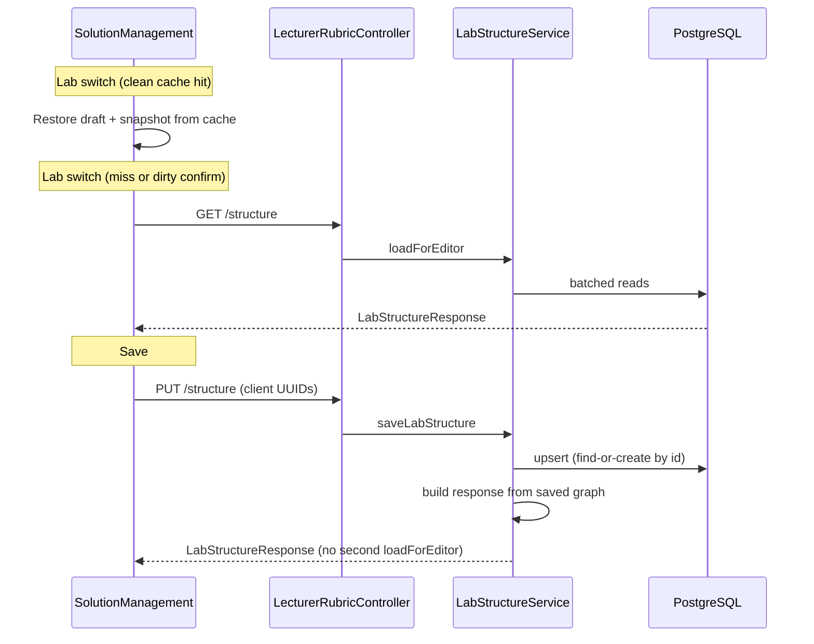

# Solution Management Editor Reliability - Plan

## Goal Capsule

- **Objective:** Restore a fast, reliable Lab Structure Editor in the lecturer Solution tab so lecturers can switch labs, add/edit/rename rubric entities, and save without lost work or long unexplained waits.
- **Product authority:** This plan owns `SolutionManagement.jsx`, its structure sidebar/detail components, and `LabStructureService` / `LecturerRubricController` behavior for lab structure read/write. Grading engine logic, testcase authoring, and file-upload solution import are not active scope.
- **Open blockers:** None.

## Product Contract

**Product Contract preservation:** Unchanged — requirements, flows, acceptance examples, and session-settled KTDs carried forward from brainstorm without scope change.

### Summary

The Solution Management editor loads and saves the full lab rubric tree (lab → problems → classes → fields/methods/constructors/parameters). Lecturers report slow lab switching, failed or ineffective add/edit/save, inability to rename problems, and long save times. Investigation shows a contract mismatch: the frontend assigns client UUIDs to new entities before first save, but the backend rejects unknown IDs instead of creating rows. Problem names are display-only in the sidebar. Lab switches always refetch with no cache or loading feedback, and save re-reads the entire tree server-side.

### Problem Frame

Lecturers depend on this editor to define what students are graded against. When structure edits do not persist, rename controls are missing, or every lab click stalls the UI, rubric maintenance falls back to manual database work and undermines trust in the product.

### Actors and Entry Points

- **Primary actor:** Lecturer with `LECTURER` role on `/lecturer-solution` (`activeNav === 'projects'`).
- **Entry points:** Structure sidebar (lab/problem/class navigation, add/delete), class detail panel (class/field/method/constructor edits), MMD relations panel (problem-level), **Save Lab Structure** button.

### Requirements

- R1. **Client UUID create** — When the save payload includes an entity `id` that is not yet in the database, the backend must create that entity with the supplied UUID (same behavior documented in `docs/plans/2026-08-10-005-feat-lab-structure-editor-plan.md`). Null or omitted `id` continues to mean server-generated UUID.
- R2. **Upsert coverage** — R1 applies to challenges (problems), classes, fields, methods, constructors, and MMD relations. Parameters remain replace-all per parent method/constructor (existing behavior).
- R3. **Validation preserved** — Existing save constraints stay enforced: non-blank names/types, valid `scopeId` / `declaringTypeId` / `relationTypeId` master-data FKs, relation source/target in same problem and distinct, lab id match on PUT.
- R4. **Problem rename** — Lecturers can rename a problem (challenge) inline from the structure sidebar; the draft updates immediately and persists on bulk save.
- R5. **Class rename** — Existing class name editing in the class detail panel continues to work; the sidebar label reflects draft state without requiring save first.
- R6. **Add/edit draft** — Adding problems, classes, fields, methods, constructors, and parameters updates client draft state immediately; after a successful save, the UI reflects the server response without losing the selected problem/class context.
- R7. **Lab switch performance** — Switching between labs uses an in-memory cache of previously loaded structures when the draft for that lab is clean; uncached or dirty-switch flows still fetch from the API. A visible loading indicator appears while structure data is loading.
- R8. **Save performance** — Save completes without an unnecessary full-tree re-query when the service can return the persisted structure from the write path; target perceptible improvement on typical lab sizes (single-digit problems, tens of members).
- R9. **Error surfacing** — Failed saves show the backend error message (e.g. validation, unknown FK); success shows confirmation and clears dirty state.
- R10. **Unsaved changes** — Switching labs with unsaved edits still prompts discard confirmation (existing behavior).

### Flows and State

- F1. Lecturer opens Solution tab → labs list and lookups load → first lab structure loads with loading feedback.
- F2. Lecturer clicks another lab → if cached and clean, structure appears immediately; otherwise fetch with spinner, then bind draft + saved snapshot.
- F3. Lecturer adds problem/class/members → draft dirty → Save enabled → PUT succeeds → draft and snapshot replaced from response; sidebar selection preserved or remapped to response IDs.
- F4. Lecturer renames problem inline in sidebar → draft dirty → Save persists new name.
- F5. Lecturer edits class in detail panel → sidebar class label updates from draft → Save persists.

### Acceptance Examples

- AE1. Empty lab → add Problem "Car Class" with one class `Car`, one field, one method with one parameter, one constructor → Save → reload page → structure intact.
- AE2. Rename existing problem from sidebar → Save → reload → new name shown.
- AE3. Switch Lab 2 → Lab 3 → Lab 2 again (no edits) → second visit to Lab 2 does not show a multi-second blank wait; cached structure appears promptly.
- AE4. Add class with client UUID, save before any prior server id → HTTP 200, class exists in DB with client UUID.
- AE5. Save with invalid empty field name → HTTP 400 with clear message; draft unchanged.

### Key Decisions

- KTD1 (product, session-settled): **Fix backend upsert to honor client UUIDs** over changing the frontend to null out ids before save — matches the original lab-structure-editor plan and keeps stable client references across the draft session.
- KTD2 (product, session-settled): **Inline problem rename in sidebar** over a separate modal or detail-only rename — problems have no detail panel today; sidebar is the natural edit surface.
- KTD3 (product, session-settled): **Per-lab in-memory cache when clean** over refetch-on-every-click — balances freshness with UX; dirty labs always warn before discard.
- KTD4 (product): **Trim redundant post-save full reload on the server** while still returning a complete `LabStructureResponse` to the client.

### Scope Boundaries

**In scope:** Backend upsert fix, frontend cache/loading/selection remapping, problem rename UI, save/load performance improvements within the existing bulk-save API, service-level tests for client-UUID create and rename persistence.

**Out of scope:** Incremental per-entity APIs, auto-save, pagination of large structures, structural testcase authoring, rubric import/upload, changes to grading logic beyond existing cache invalidation on save.

### Deferred to Follow-Up Work

- Dedicated `LecturerRubricController` slice tests (deferred from original lab-structure-editor plan; service tests cover save contract).
- Frontend component test harness for `StructureSidebar` (no harness exists today; manual verification sufficient).

### Success Criteria

- Lecturer can add a full problem hierarchy and save once without errors.
- Problem and class names can be renamed and persist after save.
- Lab switching feels responsive (cache hit) with clear loading on fetch.
- Save time is noticeably reduced versus current full write-then-reread path on representative lab data.

### How This Work Fits Together

This is a reliability and performance fix on the lab structure editor delivered in `docs/plans/2026-08-10-005-feat-lab-structure-editor-plan.md`. It does not expand MMD or testcase scope from that plan.

---

## Planning Contract

### Summary

Fix the backend upsert contract so client-generated UUIDs create rows on first save, add sidebar problem rename and frontend lab-structure caching with loading feedback, and return the saved tree from the write path instead of issuing a second full read. Service tests lock the upsert behavior; manual lecturer flow verifies UX.

### High-Level Technical Design

**Upsert rule (all entity types except parameters):**

| `dto.id` | DB row | Action |
|---|---|---|
| null | — | Create with server UUID |
| non-null | exists, correct parent | Update |
| non-null | exists, wrong parent | 400 BAD_REQUEST |
| non-null | missing | Create with `setId(dto.id())` before persist |

### Key Technical Decisions

- KTD-U1 (session-settled: user-directed — chosen over frontend null-id workaround: keeps stable draft references per KTD1): Centralize find-or-create in `LabStructureService` private helpers reused by challenge/class/field/method/constructor/relation upserts.
- KTD-U2: **Build save response in-process** — accumulate persisted entities during `saveLabStructure` and map to DTOs via existing `toChallengeDto` / `toClassDto` helpers instead of calling `loadForEditor` at the end (KTD4). Invalidate rubric cache before returning.
- KTD-U3: **Frontend cache as `useRef` map** — `structureCacheRef.current[labId] = { draft, snapshot }` updated on successful load/save; bypass fetch when switching to a cached lab with no dirty edits on the current lab.
- KTD-U4: **Problem rename via inline `<input>`** in `StructureSidebar` challenge row (same pattern as class name in `ClassDetailPanel`), wired through `onRenameChallenge(challengeId, name)`.

### Assumptions

- Hibernate accepts pre-assigned UUIDs on persist with `@GeneratedValue(strategy = GenerationType.UUID)` when `setId` is called before `save` (standard JPA behavior for UUID generation).
- Typical lab sizes remain small enough that in-process DTO assembly after save is sufficient without further query batching in the write path.

### Risks and Dependencies

| Risk | Mitigation |
|---|---|
| Client UUID collides with existing row in another lab/challenge | Parent-ownership check on find-by-id; reject cross-parent reuse with 400 |
| Cache serves stale data after another lecturer edits same lab | Out of scope for v1 (single-lecturer authoring assumption); cache invalidated on dirty save of current lab |
| Save response assembly diverges from `loadForEditor` shape | Reuse same `toChallengeDto` / `toClassDto` mappers; AE1/AE4 manual verification |

**Sequencing:** U1 (backend upsert) → U2 (save response) → U3 (service tests) → U4 + U5 (frontend, parallel after U1).

---

## Implementation Units

### U1. Backend find-or-create upsert

**Goal:** Accept client-generated UUIDs on first save for all upserted entity types.

**Requirements:** R1, R2, R3, AE4

**Dependencies:** None

**Files:**

- `backend/src/main/java/com/eiu/capstone/backend/service/LabStructureService.java`

**Approach:**

1. Add private helper `resolveByIdOrNew(repository, id, parentValidator, entityFactory)` that returns existing row or new entity with `setId(id)` when id is non-null and not found.
2. Replace `orElseThrow("Unknown * id")` in `upsertChallenge`, `upsertClass`, field/method/constructor upserts, and relation upsert with the helper.
3. When id exists but belongs to wrong lab/challenge/class parent, throw `400` with existing message shape.
4. Keep parameter replace-all behavior unchanged.

**Patterns to follow:** Existing `requireNonBlank`, `resolveMasterData`, and parent checks in `syncRelations`.

**Test scenarios:**

- Covers AE4: payload with new challenge id + new class id → both rows persisted with those ids.
- Payload references existing class id under correct challenge → update, not duplicate insert.
- Payload reuses class id from another challenge → 400.

**Verification:** U3 tests pass; manual PUT with `crypto.randomUUID()` ids succeeds.

---

### U2. Save response without second full read

**Goal:** Remove redundant `loadForEditor` call at end of `saveLabStructure`.

**Requirements:** R8, KTD4

**Dependencies:** U1

**Files:**

- `backend/src/main/java/com/eiu/capstone/backend/service/LabStructureService.java`

**Approach:**

1. During `saveLabStructure`, collect persisted `Challenge` entities (with nested data already in memory from upsert loops) or re-query only the affected lab's challenges in one batched pass if simpler.
2. Prefer reusing `toChallengeDto` with the same grouping maps pattern as `loadForEditor` but fed from entities saved in the transaction.
3. Replace `return loadForEditor(labId)` with assembled `LabStructureResponse`.
4. Call `rubricCacheInvalidationSupport.invalidateLab(labId)` before return (unchanged).

**Execution note:** If in-process assembly proves awkward, a single batched `loadForEditor` remains acceptable only if U1 tests pass and measurable save latency is still improved via upsert fix alone — document the measurement in the PR.

**Test scenarios:**

- Save returns response containing newly created challenge name from payload.
- Response `id` matches lab id; challenge count matches payload.

**Verification:** Compare save endpoint latency before/after on a lab with 3 problems and 5 classes each (informal timing in dev with `app.grading.timing-log` or browser network tab).

---

### U3. LabStructureService save tests

**Goal:** Lock client-UUID create and rename persistence behavior.

**Requirements:** R1, R3, AE1, AE4, AE5

**Dependencies:** U1, U2

**Files:**

- `backend/src/test/java/com/eiu/capstone/backend/service/LabStructureServiceSaveTest.java` (new)

**Approach:**

1. Mockito-based unit test matching `UserServiceTest` / `StudentHistoryServiceTest` patterns (no Testcontainers in repo today).
2. Mock repositories; verify `save` invoked on new entities with client-assigned ids.
3. Verify `ResponseStatusException` for blank field name and cross-parent id reuse.

**Execution note:** Start with failing tests for client-UUID create before implementing U1.

**Test scenarios:**

- Covers AE4: `saveLabStructure` with unknown class UUID creates class via `classEntityRepository.save` with that id.
- Covers AE5: empty field name → `ResponseStatusException` BAD_REQUEST.
- Update existing challenge name in payload → `challengeRepository.save` called with new name.
- Covers AE1: nested payload (problem + class + field + method + constructor) triggers expected save calls without throwing.

**Verification:** `mvn test -Dtest=LabStructureServiceSaveTest` passes from `backend/`.

---

### U4. Frontend lab cache, loading state, selection stability

**Goal:** Fast lab switching and preserved selection after save.

**Requirements:** R6, R7, R9, R10, F2, F3, AE3

**Dependencies:** U1 (save must succeed for new entities)

**Files:**

- `frontend/src/pages/SolutionManagement.jsx`

**Approach:**

1. Add `structureCacheRef` (`useRef`) keyed by `labId` storing `{ draft, snapshot }`.
2. Add `structureLoading` state; set true during `loadStructure`, false in `finally`.
3. On successful load or save, write cache entry for that lab.
4. In `selectLab`: if target lab has cache entry and current lab is not dirty (or user confirmed discard), restore from cache without fetch; else fetch.
5. After save, remap `selectedClassRef` / `selectedChallengeId` if response ids differ (defensive; should be no-op once U1 lands).
6. Show inline spinner overlay on structure panel when `structureLoading` (not full-page reload after initial mount).

**Patterns to follow:** Existing `isDirty` / `isDirtyRef` discard prompt in `selectLab`; `cloneDraft` for immutability.

**Test scenarios:**

- Covers AE3: switch Lab A → Lab B → Lab A with no edits uses cache (no second network call — verify in browser devtools).
- Dirty lab switch shows confirm dialog (existing behavior preserved).
- After save, selected class detail panel still shows same class.

**Verification:** Manual flow on `/lecturer-solution` with Lab 2 and Lab 3.

---

### U5. Problem rename in structure sidebar

**Goal:** Inline rename for problems (challenges) in the sidebar tree.

**Requirements:** R4, R5, F4, F5, AE2

**Dependencies:** U4 (draft update wiring in parent)

**Files:**

- `frontend/src/components/lecturer/structure/StructureSidebar.jsx`
- `frontend/src/pages/SolutionManagement.jsx`

**Approach:**

1. Replace challenge name `` with `<input>` (or click-to-edit input) bound to `challenge.name`.
2. Add `onRenameChallenge(challengeId, name)` prop; parent updates `draft.challenges` immutably.
3. Class sidebar labels already read from `draft` — confirm they update when `updateSelectedClass` changes name (no change expected if already working).

**Patterns to follow:** `ClassDetailPanel` name input (`patch({ name })`).

**Test scenarios:**

- Covers AE2: rename problem in sidebar → Save → reload shows new name.
- Class rename in detail panel updates sidebar label before save.

**Verification:** Manual rename + save + page reload.

---

## Verification Contract

| Check | Command / action |
|---|---|
| Backend unit tests | `mvn test -Dtest=LabStructureServiceSaveTest` from `backend/` |
| Backend compile | `mvn -q -DskipTests compile` from `backend/` |
| Frontend build | `npm run build` from `frontend/` |
| Manual lecturer flow | Log in as lecturer → Solution tab → AE1–AE3 scenarios |

## Definition of Done

- All R1–R10 satisfied per acceptance examples.
- `LabStructureServiceSaveTest` green.
- Frontend build succeeds.
- Manual verification of add/save, problem rename, and cached lab switch documented in PR or commit message.
- No change to grading engine behavior beyond existing cache invalidation on save.
