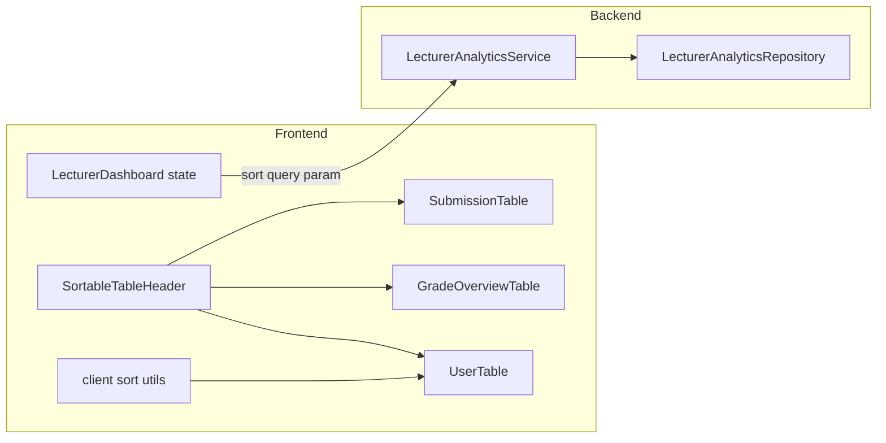

# Column Header Sort UX - Plan

## Goal Capsule

- **Objective:** Replace all standalone table sort toolbar buttons with clickable column headers across the app. Sortable headers use the dual-chevron pattern (faded up/down on inactive columns; active direction highlighted). Every data column is sortable; Action/Actions and other non-data columns are not.
- **Product authority:** Session brainstorm (Aug 12, 2026) — Option B header pattern, all data columns per table, app-wide consistency. This plan owns frontend table sort UX and any backend sort extensions required for columns not yet supported server-side.
- **Open blockers:** None — per-lab grade-overview sort approach is decided in KTD2 below.

## Product Contract

### Summary

Lecturers and admins currently sort tables via toolbar buttons ("Sort by name", "Sort by score", "Newest first") above or beside tables. The Student roster screenshot shows plain column headers with no sort affordance. This change moves sort controls onto headers, removes toolbar sort buttons, and extends sort to every data column each table exposes. Server-paginated lecturer tables keep server-side sort; fully loaded lists sort client-side.

### Problem Frame

Toolbar sort buttons are disconnected from the columns they affect, only expose a subset of sortable fields (name + score on roster and grade overview), and differ from the header-click pattern already specified but not shipped in `docs/plans/2026-08-10-004-feat-lecturer-roster-highest-score-sort-plan.md` (R4). Lecturers expect spreadsheet-style column sorting with visible direction indicators on every sortable column.

### Actors and Entry Points

- **Primary actor:** Lecturer using grading overview, grade matrix, submission history panel, and challenge-tab rosters.
- **Secondary actor:** Lecturer using User Management.
- **Tertiary actor:** Student using submission history table.

### Requirements

- R1. **No toolbar sort buttons** — Remove "Sort by name", "Sort by score", "Newest first"/"Oldest first", and equivalent standalone sort controls from all affected screens. Search, lab filter dropdowns, export menus, and pagination remain.
- R2. **Dual-chevron header pattern (Option B)** — Every sortable column header shows a faded up+down chevron pair when inactive. The active sorted column highlights the current direction (up = ascending, down = descending); the other chevron in the pair stays faded.
- R3. **Click behavior** — Clicking a sortable header that is not active sorts by that column ascending. Clicking the active header toggles ascending/descending. Server-paginated tables reset to page 1 on sort change.
- R4. **Non-sortable columns** — Action, Actions, expand/collapse affordance columns, and summary rows have no chevrons and no click handler.
- R5. **Lab roster (`SubmissionTable` on dashboard)** — Sortable data columns: Student, ID, Score, Attempt, Submitted At. Server-side via existing `sort` query param. Default `studentName,asc`.
- R6. **Challenge-tab roster** — Same columns and server-side behavior as R5. Replace hardcoded `submittedAt,desc` with lecturer-controlled header sort; default remains `studentName,asc` unless product prefers `submittedAt,desc` — use `studentName,asc` for consistency with lab roster.
- R7. **Grade overview matrix** — Sortable: Student, IRN, Total Score, and each dynamic per-lab column. Server-side with pagination. Default `studentName,asc`.
- R8. **Grade overview submission history panel** — Sortable: Student, ID, Lab, Submitted At, Score. Client-side on filtered rows. Default Submitted At descending (preserves current "newest first" behavior).
- R9. **User management table** — Sortable: IRN, Full Name, Date of Birth, Email, Role. Client-side on filtered users. Default Full Name ascending (current behavior).
- R10. **Student history table** — Sortable: Lab, Attempt, Score, Submitted, Status. Client-side. Expand column not sortable.
- R11. **Lab attempt history drawer** — Sortable: Attempt, Score, Submitted At. Client-side on loaded attempts.
- R12. **Export alignment** — Roster and grade-overview exports use the lecturer's current sort field and direction (existing export fetch paths already pass `sort`).

### Flows and State

- F1. Lecturer opens lab roster → headers show dual chevrons → Student column active, ascending highlighted → clicks Score → page 1 reloads sorted by score ascending.
- F2. Lecturer on grade overview clicks a lab column header → students reorder by that lab's score server-side across full population.
- F3. Lecturer clicks grade-overview student row (row select) vs column header — header click sorts only; must not change selected student (`stopPropagation` on header).
- F4. User management: lecturer clicks Email header → client re-sorts visible rows by email ascending; pagination counts unchanged.

### Acceptance Examples

- AE1. Lab roster with sort-by-score descending → Score header shows down chevron highlighted; Student/ID/Attempt/Submitted At show faded dual chevrons; no sort buttons above table.
- AE2. Challenge tab after implementation → lecturer can sort by ID without toolbar; API receives `sort=studentCode,asc` (or equivalent mapped field).
- AE3. Grade overview IRN ascending → first page shows lowest IRN first across enrolled students, not just current page reorder.
- AE4. Submission history panel → "Newest first" button removed; Submitted At header shows descending active state by default.
- AE5. Student history Status column → clicking sorts passed/partial/failed alphabetically client-side; expand chevron column has no sort affordance.

### Key Decisions

- KTD1. **Shared `SortableTableHeader` primitive** — One component in `frontend/src/components/ui/` owns chevron rendering and click target styling. Tables pass `label`, `field`, `activeField`, `direction`, `sortable`, `onSort`. **Rejected:** per-table inline duplication (six tables, drift risk).
- KTD2. **Per-lab grade-overview sort via compound sort key** — Backend accepts `sort=labScore,<labUuid>,asc|desc` (three-part) or `sort=lab:<labUuid>,asc` with resolver mapping to a per-lab score subquery in `findGradeOverviewStudents`. Extend SQL CTE to expose per-lab scores for ORDER BY. **Rejected:** client-side sort of current page only (wrong for pagination).
- KTD3. **IRN sort maps to `irn` column** — Add `studentcode`/`irn`/`student_code` aliases to `resolveGradeOverviewSort` → `irn` in `student_totals` CTE. **Rejected:** leaving IRN unsortable while other columns are sortable.
- KTD4. **Client-side multi-column sort helper** — Shared `sortRows(rows, field, direction, accessors)` in `frontend/src/utils/sort.js` for User Management, submission history, student history, attempt drawer. **Rejected:** duplicating comparator logic per page.
- KTD5. **Chevron icons from lucide-react** — Use `ChevronUp`/`ChevronDown` with opacity for dual-chevron pattern; align with existing icon usage in `UserTable.jsx` and `LecturerDashboard.jsx`.

### Scope Boundaries

**In scope**

- All tables listed in R5–R11
- Backend extensions for grade-overview IRN and per-lab column sort
- Challenge-tab sort state wiring
- DOX updates in `frontend/src/components/ui/AGENTS.md`, `frontend/src/components/lecturer/AGENTS.md`, `frontend/src/pages/AGENTS.md`, `backend/AGENTS.md`

**Deferred for later**

- `GET /api/analytics/student-overview` sort UI on Reports page (no table sort controls today)
- Automated frontend test suite (repo has none)

**Outside this product's identity**

- Changing default score semantics (highest vs latest) — unchanged
- Pagination page size changes

---

## Planning Contract

### High-Level Technical Design

**Sort state shape (server tables):** `{ field: string, direction: 'asc' | 'desc' }` — unchanged from current `rosterSort` / `gradeOverviewSort`.

**Header click contract:** `onSort(field)` in parent toggles or switches; table components receive `sortState` + `onSort` and render `SortableTableHeader` per column config.

### Key Technical Decisions

- KTD6. **Grade overview per-lab sort field encoding** — Use `sort=labScore,<uuid>,<direction>` (comma-separated, UUID validated). `resolveGradeOverviewSort` detects `labscore` prefix and passes lab ID to repository. Repository adds optional `LEFT JOIN highest_scores hs_lab ON ... AND hs_lab.lab_id = :labId` and orders by `COALESCE(hs_lab.score, 0)`. Invalid UUID falls back to `full_name ASC`.
- KTD7. **Challenge sort state** — Add `challengeSort` + `handleChallengeSort` mirroring `rosterSort`; wire `fetchChallengeSubmissions` and pagination refresh.
- KTD8. **Row-click tables** — `SortableTableHeader` uses `onClick={(e) => { e.stopPropagation(); onSort(field); }}` on grade overview and student history where rows have click handlers.

### Assumptions

- `lucide-react` already installed; no new icon dependency.
- Grade overview lab column count stays moderate (tens, not hundreds) — per-lab ORDER BY subquery acceptable.
- User chose all data columns; backend extension for grade overview is required, not optional.

### Risks and Mitigation

| Risk | Mitigation |
|---|---|
| Per-lab sort SQL regression | Manual verify with 2+ labs; NULL/missing lab scores sort as 0 consistent with matrix display |
| Header click triggers row select | `stopPropagation` on sortable `<th>` (KTD8) |
| Export sort drift | Reuse same `sort` string builder as table fetch |

---

## Implementation Units

### U1. SortableTableHeader primitive and client sort utility

**Goal:** Introduce reusable header cell and shared client-side sort comparator.

**Requirements:** R2, R3, R4, KTD1, KTD4, KTD5

**Dependencies:** None

**Files:**

- Create `frontend/src/components/ui/SortableTableHeader.jsx`
- Create `frontend/src/utils/sort.js`
- Modify `frontend/src/components/ui/AGENTS.md`

**Approach:**

1. `SortableTableHeader` renders `<th>` with `button` or clickable inner span, `aria-sort` (`ascending`/`descending`/`none`), dual chevrons per Option B.
2. Props: `label`, `field`, `activeField`, `direction`, `sortable` (default true), `onSort`, `className`, `stopRowClick` (calls `stopPropagation`).
3. `sort.js` exports `toggleSortState(current, field)`, `sortRows(rows, field, direction, getValue)` with stable string/number/date comparison.
4. Document component in ui AGENTS.md.

**Patterns to follow:** Existing Tailwind header classes in `SubmissionTable.jsx`; chevron usage in `UserTable.jsx`.

**Test scenarios:**

- Covers AE1. Inactive column renders dual faded chevrons; active ascending highlights up chevron only.
- Click inactive field calls `onSort` with new field; parent uses `toggleSortState` → asc.
- Click active field toggles direction.
- `sortable={false}` renders plain label, no chevrons, no handler.
- `sortRows` orders strings case-insensitively, numbers numerically, nulls last.

**Test expectation:** none — presentational primitive; manual + util unit logic verified via implementation smoke.

**Verification:** `npm run build` succeeds; Storybook N/A — spot-check in dev with one table wired in U2.

---

### U2. Server-side roster and challenge tables

**Goal:** Wire `SubmissionTable` headers for lab roster and challenge tab; remove dashboard toolbar sort buttons.

**Requirements:** R1, R5, R6, R12, F1

**Dependencies:** U1

**Files:**

- Modify `frontend/src/components/lecturer/SubmissionTable.jsx`
- Modify `frontend/src/pages/LecturerDashboard.jsx`
- Modify `frontend/src/components/lecturer/AGENTS.md`

**Approach:**

1. Add props to `SubmissionTable`: `sortState`, `onSort`, optional `columnFields` map (`studentName`, `studentCode`, `score`, `attempt`, `submittedAt`).
2. Replace static `<th>` with `SortableTableHeader` for five data columns; Action stays static.
3. Remove roster toolbar buttons (lines ~747–778).
4. Add `challengeSort` state default `{ field: 'studentName', direction: 'asc' }`, `handleChallengeSort`, pass sort to `fetchChallengeSubmissions` instead of hardcoded `submittedAt,desc`.
5. Field mapping: UI "Student" → `studentName`, "ID" → `studentCode`, etc.
6. Ensure `handleRosterSort` / pagination handlers unchanged except removing button UI.

**Patterns to follow:** Existing `handleRosterSort` in `LecturerDashboard.jsx`; backend field names in `LecturerAnalyticsService.resolveLabSort`.

**Test scenarios:**

- Covers AE1, AE2. Click Score on lab roster → API `sort=score,asc`; second click → `sort=score,desc`; page resets to 0.
- Challenge tab sort by Submitted At descending → `sort=submittedAt,desc`.
- Export after sort uses same `rosterSort` / `challengeSort` string.
- No sort buttons remain in dashboard roster section.

**Verification:** Manual — lecturer dashboard, both overview and challenge tabs; confirm network tab sort param.

---

### U3. Grade overview server sort (backend + frontend)

**Goal:** Sort grade matrix by Student, IRN, Total Score, and each lab column server-side; remove grade-overview toolbar buttons.

**Requirements:** R1, R7, R12, F2, F3, AE3

**Dependencies:** U1

**Files:**

- Modify `backend/src/main/java/com/eiu/capstone/backend/analytics/service/LecturerAnalyticsService.java`
- Modify `backend/src/main/java/com/eiu/capstone/backend/analytics/repository/LecturerAnalyticsRepository.java`
- Modify `frontend/src/components/lecturer/GradeOverviewTable.jsx`
- Modify `frontend/src/pages/LecturerDashboard.jsx`
- Modify `backend/AGENTS.md`
- Modify `frontend/src/components/lecturer/AGENTS.md`

**Approach:**

1. Extend `resolveGradeOverviewSort` to map `irn`/`studentcode` → `irn`; parse `labScore,<uuid>` for per-lab sort (KTD6).
2. Update `findGradeOverviewStudents` SQL: when sorting by lab, join `highest_scores` filtered by lab UUID; ORDER BY `COALESCE(hs_lab.highest_score, 0)` NULLS LAST, tiebreak `full_name ASC`.
3. `GradeOverviewTable` accepts `sortState`, `onSort`, `labs`; each lab header field key `labScore:<labId>`.
4. Remove grade-overview toolbar sort buttons (~861–893).
5. `handleGradeOverviewSort` already exists — connect to headers.
6. `stopPropagation` on headers (KTD8).

**Test scenarios:**

- Covers AE3. `sort=irn,asc` returns students ordered by IRN across pages.
- `sort=labScore,<uuid>,desc` orders by that lab's score descending.
- Unknown sort field falls back safely (name asc).
- Row click still selects student; header click does not.
- Export includes current `gradeOverviewSort`.

**Verification:** Manual grade overview with multiple labs; Swagger or curl spot-check new sort params.

---

### U4. Client-side lecturer history and user management tables

**Goal:** Multi-column header sort for submission history panel and user table; remove toolbar sort controls.

**Requirements:** R1, R8, R9, AE4

**Dependencies:** U1

**Files:**

- Modify `frontend/src/components/lecturer/GradeOverviewSubmissionHistory.jsx`
- Modify `frontend/src/pages/LecturerDashboard.jsx` (history sort state: field + direction, not direction-only)
- Modify `frontend/src/components/UserTable.jsx`
- Modify `frontend/src/pages/UserManagement.jsx`

**Approach:**

1. Replace `historySortDirection` with `historySort: { field: 'submittedAt', direction: 'desc' }`.
2. Update `filteredGradeHistory` memo to use `sortRows` with field accessors.
3. Remove "Newest first" button; add header sort to all five data columns.
4. `UserManagement`: replace single `sortDirection` with `{ field: 'fullname', direction: 'asc' }`; sort by clicked column via `sortRows`.
5. Remove UserTable toolbar sort button; wire headers for all data columns (not Actions).

**Patterns to follow:** Current `sortUsers` comparator in `UserManagement.jsx`.

**Test scenarios:**

- Covers AE4. Default history shows Submitted At desc active; Lab sort ascending works.
- User table Email sort toggles asc/desc; search filter preserved before sort.
- No sort toolbar buttons on either screen.

**Verification:** Manual on lecturer grading tab and user management.

---

### U5. Student history and attempt drawer client sort

**Goal:** Add header sort to student-facing history table and lab attempt drawer.

**Requirements:** R10, R11, AE5

**Dependencies:** U1

**Files:**

- Modify `frontend/src/components/student/StudentHistoryPage.jsx`
- Modify `frontend/src/components/lecturer/LabAttemptHistoryDrawer.jsx`
- Modify `frontend/src/components/student/AGENTS.md`

**Approach:**

1. Add `historySort` state; sort `filteredSubmissions` before map.
2. Status sort uses string compare on derived status label.
3. Expand column: `sortable={false}`; row click for expand unchanged; `stopPropagation` on headers.
4. `LabAttemptHistoryDrawer`: client sort attempts array by Attempt, Score, Submitted At.

**Test scenarios:**

- Covers AE5. Status column sorts; expand column has no chevrons.
- Attempt drawer sorts by Score descending.
- Row expand still works on student history.

**Verification:** Manual student history page and lecturer roster View drawer.

---

### U6. DOX pass and regression sweep

**Goal:** Update contracts; confirm no orphaned sort buttons app-wide.

**Requirements:** R1 (global)

**Dependencies:** U2, U3, U4, U5

**Files:**

- Modify `frontend/AGENTS.md` (child index if ui AGENTS changed)
- Grep-driven confirmation — no code files beyond docs unless stray button found

**Approach:**

1. Update lecturer AGENTS.md: header sort replaces toolbar buttons; list supported fields per table.
2. Update backend AGENTS.md grade-overview sort fields.
3. Repo grep for `Sort by name`, `Sort by score`, `Newest first` — zero matches in `frontend/src`.
4. Update `docs/plans/2026-08-10-004` cross-reference note optional — out of scope unless user wants; skip.

**Test scenarios:**

- Grep confirms no toolbar sort button strings in frontend source.
- AGENTS.md reflects header-sort contract.

**Verification:** `npm run build`; manual smoke across lecturer dashboard, grading, users, student history.

---

## Verification Contract

| Check | Command / action |
|---|---|
| Frontend build | `npm run build` from `frontend/` |
| Backend compile | `mvn -q -f backend/pom.xml compile` |
| Lecturer roster | Sort each column; verify network `sort` param and chevrons |
| Challenge tab | Sort exposed; no hardcoded-only sort |
| Grade overview | IRN + lab column + total score sort |
| User management | Multi-column client sort |
| Student history | Header sort without breaking row expand |

No automated test suite exists; manual verification is the gate.

## Definition of Done

- All requirements R1–R12 satisfied on listed screens.
- No standalone sort toolbar buttons remain in `frontend/src`.
- `SortableTableHeader` used consistently (dual-chevron Option B).
- Grade overview backend accepts IRN and per-lab sort keys.
- `npm run build` passes.
- Owning AGENTS.md files updated per DOX rules.

---

## Appendix

### Tables inventory

| Screen | Component | Sort mode | Data columns |
|---|---|---|---|
| Lab roster | `SubmissionTable` | Server | Student, ID, Score, Attempt, Submitted At |
| Challenge tab | `SubmissionTable` | Server | Same |
| Grade matrix | `GradeOverviewTable` | Server | Student, IRN, Total Score, per-lab |
| Grading history | `GradeOverviewSubmissionHistory` | Client | Student, ID, Lab, Submitted At, Score |
| Users | `UserTable` | Client | IRN, Full Name, DOB, Email, Role |
| Student history | `StudentHistoryPage` | Client | Lab, Attempt, Score, Submitted, Status |
| Attempt drawer | `LabAttemptHistoryDrawer` | Client | Attempt, Score, Submitted At |

### Prior plan alignment

`docs/plans/2026-08-10-004-feat-lecturer-roster-highest-score-sort-plan.md` R4 specified header-click sort on Student and Score only. This plan supersedes that UX scope with all data columns and app-wide rollout while preserving highest-score semantics already shipped.

### Research sources

- Session brainstorm Aug 12, 2026 (Option B, all data columns)
- `backend/src/main/java/com/eiu/capstone/backend/analytics/service/LecturerAnalyticsService.java` sort resolvers
- `frontend/src/pages/LecturerDashboard.jsx` current sort state
- `docs/plans/2026-08-10-004-feat-lecturer-roster-highest-score-sort-plan.md`
