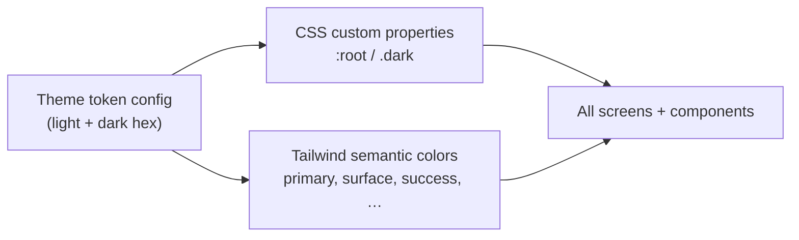
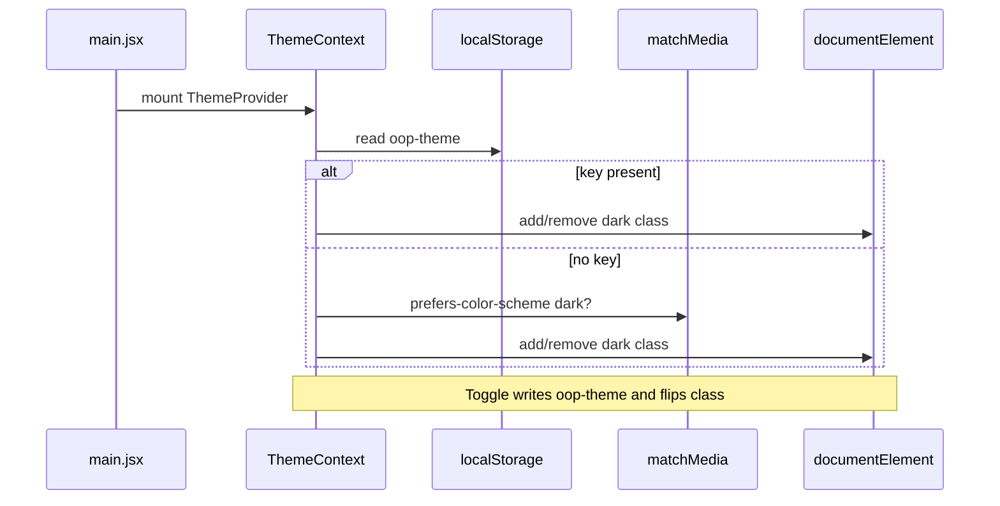

# Color Theme System - Plan

## Goal Capsule

- **Objective:** Replace the frontend's scattered purple-heavy palette with a unified light/dark design-token system based on the project's color-theory spec — blue primary, teal secondary, high-contrast semantic colors for grading, and purple limited to rare accents — across every screen including Login and First-Time Setup.
- **Product authority:** This plan owns frontend theme infrastructure, token configuration, and visual color migration. It does not change backend APIs, grading logic, or add new chart libraries.
- **Stop conditions:** Do not add a charting library, backend theme endpoints, or per-user theme customization beyond light/dark. Do not introduce automated visual-regression infrastructure in v1.

---

## Product Contract

**Product Contract preservation:** Unchanged — planning adds HOW sections below; stable R/A/F/AE IDs and session-settled Key Decisions are preserved.

### Summary

Introduce a single reusable theme config that holds all light and dark hex values from the color-theory document, wire those tokens into the app's existing `darkMode: 'class'` setup, and migrate every screen to semantic color names (`primary`, `secondary`, `success`, `surface`, etc.) instead of ad-hoc purple classes and one-off hex backgrounds. First visit follows the user's OS theme preference; manual toggle overrides and persists. Grading and submission statuses use the lecturer-dashboard semantic mapping with stronger contrast than today's palette.

### Problem Frame

The frontend grew with Tailwind defaults and a purple-centric visual identity: headers, buttons, focus rings, stats cards, and auth gradients all lean purple, while dark surfaces use inconsistent custom hex values (`#151b24`, `#0d1117`, `#1e2530`, etc.) that do not match the intended slate hierarchy. There is no central token file — colors are duplicated and hard to change. Login and First-Time Setup maintain their own local dark-mode state and CSS, separate from `ThemeContext`, so theme behavior is inconsistent across the app. The attached color-theory document defines a modern dashboard palette (blue primary, teal secondary, limited purple accent) but it is not yet reflected in code.

### Key Decisions

- **Central token config as single source of truth** — one module holds all light/dark hex values from the color-theory doc; CSS custom properties and Tailwind semantic classes derive from it. Governs R1–R3.
- **Approach A over Tailwind-only or primitives-first** — token config + CSS variables + semantic Tailwind classes, with light extension of existing status primitives (`ScorePill`, `Toast`) rather than building a full component library first. Governs R1, R14.
- **System theme on first visit** — default to OS `prefers-color-scheme`; user toggle writes to `localStorage` and overrides until cleared. (session-settled: user-directed — chosen over fixed dark or fixed light default) Governs R4–R6.
- **Blue replaces purple as primary interaction color** — navigation, buttons, links, focus rings, and active states shift to blue; purple reserved for ~5–10% accent use (AI/special highlights). (session-settled: user-directed — chosen over keeping purple in navigation or removing purple entirely) Governs R7–R9.
- **Higher contrast for grading semantics** — correct, incorrect, pending, completed, and info states use the doc's lecturer-dashboard mapping with strong text/background separation. (session-settled: user-directed — chosen over softer aesthetics) Governs R10–R12.
- **Full frontend scope in one pass** — dashboards, shared components, and auth screens (Login, First-Time Setup) all migrate together. (session-settled: user-directed — chosen over dashboards-only or phased auth follow-up) Governs R13–R15.
- **Unify auth screens on shared ThemeContext** — remove local dark-mode state from login flows; auth screens consume the same tokens and toggle as the rest of the app. Governs R13–R15.

### Actors

- **A1. Student** — uses Student Dashboard, history, upload, and auth screens; expects readable status colors and consistent light/dark behavior.
- **A2. Lecturer** — uses Lecturer Dashboard, grading views, Solution Management, and Reports; expects high-contrast correct/incorrect/pending states.
- **A3. Returning user** — expects theme choice to persist across sessions after manual toggle.

### Requirements

**Token system**

- R1. A single frontend theme config exports the complete light and dark palette from the color-theory document: primary (blue), secondary (teal), success, error, warning, info, neutral surfaces/backgrounds/borders/text, purple accent (limited), and chart palette entries.
- R2. Token values are exposed as CSS custom properties on `:root` (light) and `.dark` (dark) so runtime theme switching does not require page reload.
- R3. Tailwind is extended with semantic color names that map to those tokens (e.g., `bg-primary`, `text-success`, `border-border`, `bg-surface`) so components stop using raw Tailwind palette names (`purple-600`, `gray-700`) and ad-hoc hex literals for standard surfaces.

**Theme behavior**

- R4. On first visit with no saved preference, the app applies the OS color scheme via `prefers-color-scheme`.
- R5. The existing theme toggle switches between light and dark explicitly; the choice persists in `localStorage` and overrides system preference on subsequent visits.
- R6. `ThemeContext` is the sole authority for applying the `dark` class on `<html>`; duplicate `ThemeProvider` mounts are consolidated to one.
- R7. Theme changes apply instantly without full page reload across all routes including auth screens.

**Visual identity migration**

- R8. Primary interactive elements (primary buttons, links, active tabs, selected items, progress indicators, focus rings) use the primary blue token pair, not purple.
- R9. Purple appears only for accent roles defined in the color doc (special/AI analytics, premium status, selected chart categories) and stays within roughly 5–10% of visible UI area — not sidebars, primary buttons, or main navigation.
- R10. App backgrounds, cards, borders, and text use the neutral/surface token set from the doc — no pure `#000000` main backgrounds in dark mode.
- R11. Secondary teal tokens are used for completion highlights, statistics accents, and secondary actions per the doc's secondary usage guidance.

**Grading and status semantics**

- R12. Grading-related UI maps statuses to semantic tokens consistently: Correct → success green, Incorrect → error red, Pending → warning amber, Selected → primary blue, Info → info cyan, Completed → secondary teal, Neutral → slate muted — matching the lecturer-dashboard semantic table in the color doc.
- R13. Status text and backgrounds maintain sufficient contrast for quick scanning in both light and dark modes (covers `ScorePill`, submission tables, testcase panels, challenge tabs, toast notifications, and similar status surfaces).
- R14. Existing shared status components (`ScorePill`, `Toast`, and comparable badges) are updated to consume semantic tokens so new screens inherit correct colors without re-specifying hex values.

**Screen coverage**

- R15. Every frontend route and shared component migrates off legacy purple-primary and ad-hoc dark hex patterns, including Login and First-Time Setup (which today use separate `LoginUI.css` gradients and local dark state).
- R16. Reports and overview stat cards use the chart palette from the doc for icon/card accent colors (no new chart library required).
- R17. Scrollbars, modals, drawers, form inputs, and table zebra/hover states use neutral and border tokens instead of one-off hex values.

**Documentation**

- R18. The color-theory source document is copied or referenced in-repo (e.g., under `docs/`) so the token config and future edits stay traceable to the design authority.

### Key Flows

- **F1. First visit (no saved preference)** — User opens app → OS dark mode detected → `dark` class applied (or omitted for light) → all screens render with dark (or light) token set → user sees blue-primary, high-contrast grading colors.
- **F2. Manual theme toggle** — User clicks theme toggle → `ThemeContext` flips mode → preference saved to `localStorage` → `<html>` class updates → all routes including auth re-render with opposite token set.
- **F3. Return visit** — User opens app → saved preference loaded from `localStorage` → theme applied regardless of current OS setting → UI matches last explicit choice.
- **F4. Auth → dashboard continuity** — User logs in on themed Login screen → navigates to role dashboard → no theme flash or palette jump; same token system throughout.

### Acceptance Examples

- **AE1. System default (light OS)** — **Covers R4, R7.** **Given** no `localStorage` theme key and OS prefers light, **when** the user opens Login, **then** backgrounds use light surface tokens, primary buttons are blue (`#2563EB` family), and body text uses dark primary text — not purple gradients.
- **AE2. System default (dark OS)** — **Covers R4, R10.** **Given** no saved preference and OS prefers dark, **when** the user opens Student Dashboard, **then** app background is `#0F172A` (or token equivalent), surfaces use `#111827`/`#1E293B` hierarchy, and no surface uses pure black `#000000`.
- **AE3. Persisted override** — **Covers R5, F3.** **Given** user toggled to light on a dark-OS machine, **when** they reload any page, **then** light tokens apply and OS dark preference is ignored.
- **AE4. Grading status contrast** — **Covers R12, R13.** **Given** lecturer views a submission with passed and failed testcases, **when** status pills render, **then** passed uses success green and failed uses error red with readable text in the current theme — not low-contrast purple or gray-only distinction.
- **AE5. Purple accent limit** — **Covers R8, R9.** **Given** lecturer navigates main dashboard chrome (header, sidebar, primary CTAs), **when** inspecting dominant hues, **then** blue/teal/slate dominate and purple does not appear on primary buttons or main navigation.
- **AE6. Auth unification** — **Covers R15, F4.** **Given** user toggles theme on Login, **when** they complete sign-in, **then** dashboard loads with the same theme without reset to a hardcoded default.

### Scope Boundaries

**In scope**

- Frontend theme token config, CSS variables, Tailwind semantic extension
- `ThemeContext` behavior update (system default, persistence, single provider)
- Full color migration across all `frontend/src` screens and shared components
- In-repo preservation of the color-theory design authority
- Chart/icon accent alignment on Reports and stat cards

**Deferred for later**

- New charting library or data-visualization components
- Backend theme or PDF export styling
- Brand logo redesign or custom font changes beyond existing Inter stack
- Automated visual-regression test suite (manual verification suffices for v1)

**Outside this product's identity**

- Per-user theme customization beyond light/dark toggle
- Multiple brand themes or white-label color schemes

### Deferred to Follow-Up Work

- ESLint or CI rule banning raw `purple-*` Tailwind classes outside an allowlist file
- Extracting a full `Button` variant system (`primary`, `secondary`, `ghost`) beyond minimal token migration

### Dependencies / Assumptions

- Tailwind CSS 3 with `darkMode: 'class'` remains the styling approach; no migration to another CSS framework.
- `lucide-react` icons inherit semantic text colors from parent components after migration.
- The color-theory document attached at brainstorm time is the design authority; hex values in the token config match its Section 10 complete design tokens unless a deliberate contrast fix is documented in planning.
- `npm run build` must continue to succeed after migration.

### Sources / Research

- User-provided color theory: `color-theory-light-dark-theme.md` (brainstorm attachment) — primary authority for hex values, semantic mappings, and purple usage limits.
- Current theme infrastructure: `frontend/src/context/ThemeContext.jsx`, `frontend/tailwind.config.js`, `frontend/src/index.css`, `frontend/AGENTS.md` (Theme section documents duplicate provider and auth-screen exceptions).
- Grounding scan: ~178 purple class usages and scattered custom dark hex values across `frontend/src`; Login/Setup use `LoginUI.css` with local dark state.

### Outstanding Questions

None — all items resolved in brainstorm dialogue.

---

## Planning Contract

### Key Technical Decisions

- **KTD1. `frontend/src/theme/tokens.js` as single hex authority** — exports `light` and `dark` objects mirroring Section 10 of the color doc, plus a `chart` palette and `status` semantic map for grading UI. `tailwind.config.js` imports this module to build `theme.extend.colors`. Governs R1, R3.
- **KTD2. CSS custom properties emitted in `frontend/src/index.css`** — a small build-time-safe block defines `:root` and `.dark` variable sets using the same hex values as `tokens.js` (values duplicated in two files is acceptable for v1; a comment in each file cross-references the other). Body background uses `var(--background)`. Governs R2.
- **KTD3. Tailwind semantic color map** — extend with at minimum: `primary` (+ hover/active/light/text variants), `secondary` (+ variants), `success`, `error`, `warning`, `info`, `surface` (+ secondary/tertiary), `background`, `border`, `text` (primary/secondary/muted/disabled), `purple` (accent only), and `chart-*` keys. Map each to `var(--token-name)`. Governs R3.
- **KTD4. Theme persistence via `localStorage` key `oop-theme`** — values `'light'` | `'dark'`. Absent key → resolve from `window.matchMedia('(prefers-color-scheme: dark)')` on init. Toggle writes explicit value. (session-settled: user-directed — system default on first visit) Governs R4, R5.
- **KTD5. Single `ThemeProvider` in `main.jsx` only** — remove all nested `ThemeProvider` wrappers from `App.jsx` (including reset-password branch). Export `useTheme()` unchanged for consumers. Governs R6.
- **KTD6. `frontend/src/theme/statusClasses.js` helper** — maps grading status keys (`correct`, `incorrect`, `pending`, `selected`, `info`, `completed`, `neutral`) to Tailwind class strings using semantic tokens; consumed by `ScorePill`, testcase panels, and tables. Governs R12–R14.
- **KTD7. Auth CSS migration strategy** — replace `LoginUI.css` hardcoded purple gradients with CSS variables (`var(--primary)`, `var(--surface)`, etc.) and shared `ThemeToggle` component; delete local `isDark` state from `FirstTimeSetupUI.jsx` and sibling auth pages. Governs R13, R15.
- **KTD8. Design authority checked into `docs/design/color-theory-light-dark-theme.md`** — copy from brainstorm attachment; `tokens.js` header comment links to this path. Governs R18.

### High-Level Technical Design

**Theme resolution on load**

**Migration sweep order:** foundation (tokens + context) → shared primitives → auth → layout chrome → role-specific pages. Each layer depends on U1–U2; page sweeps can proceed file-by-file within U4–U6 using find-replace patterns documented per unit.

### Assumptions

- No frontend unit-test framework exists today; verification is `npm run build` plus manual smoke per Verification Contract.
- Occasional `gray-*` Tailwind utilities may remain where they alias neutral tokens visually, but new work must prefer semantic names; grep for `purple-` and `dark:bg-[#` should return zero after U6.

### Sequencing

U1 → U2 → U3 → U4 → U5 → U6 (strict dependency chain for first three units; U4–U6 can be parallelized by area after U3 lands).

---

## Implementation Units

### U1. Theme token foundation

**Goal:** Establish the single source of hex values, CSS variables, Tailwind extensions, and in-repo design doc.

**Requirements:** R1, R2, R3, R18

**Dependencies:** None

**Files:**
- Create `frontend/src/theme/tokens.js`
- Create `docs/design/color-theory-light-dark-theme.md`
- Modify `frontend/tailwind.config.js`
- Modify `frontend/src/index.css`

**Approach:**
1. Copy color-theory content into `docs/design/color-theory-light-dark-theme.md`.
2. Define `tokens.js` with `light`, `dark`, `chart`, and flat token key names matching the doc's Section 10.
3. In `index.css`, declare all CSS custom properties under `:root` and `.dark`; set `body { background: var(--background); color: var(--text-primary); }`.
4. Extend `tailwind.config.js` to import `tokens.js` and map semantic color keys to `var(--*)` references.
5. Update scrollbar styles in `index.css` to use `var(--surface-secondary)` and `var(--border)` instead of hardcoded hex.

**Patterns to follow:** Existing `darkMode: 'class'` in `frontend/tailwind.config.js`; color doc Section 10 token names.

**Test expectation:** none — config and CSS scaffolding; verified by build and visual inspection in U2.

**Verification:** `npm run build` succeeds; DevTools shows `--primary: #2563EB` on `:root` and `#60A5FA` under `.dark`.

---

### U2. ThemeContext behavior and provider consolidation

**Goal:** System-default theme, persisted override, single provider, updated toggle.

**Requirements:** R4, R5, R6, R7; Covers F1–F3

**Dependencies:** U1

**Files:**
- Modify `frontend/src/context/ThemeContext.jsx`
- Modify `frontend/src/main.jsx`
- Modify `frontend/src/App.jsx`
- Modify `frontend/src/components/ThemeToggle.jsx`

**Approach:**
1. Refactor `ThemeContext` to read `localStorage.getItem('oop-theme')` on init; if null, use `matchMedia('(prefers-color-scheme: dark)')`.
2. Expose `{ theme, isDark, setTheme, toggleTheme }` where `theme` is `'light' | 'dark'`.
3. On toggle, write `oop-theme` and update `<html>` class synchronously in `useEffect`.
4. Remove duplicate `ThemeProvider` imports/wrappers from `App.jsx` (all branches).
5. Restyle `ThemeToggle` with semantic classes (`bg-surface`, `border-border`, `text-text-primary`).

**Execution note:** Manually verify AE1–AE3 and AE6 after this unit before sweeping pages.

**Patterns to follow:** `frontend/AGENTS.md` Theme section (documents duplicate provider as bug to fix).

**Test expectation:** none — no test framework; manual theme flows per Verification Contract.

**Verification:** Covers AE1, AE2, AE3 — toggle on Login persists through reload and into dashboard navigation.

---

### U3. Shared UI primitives and status helpers

**Goal:** Centralize grading/status colors and migrate reusable components to semantic tokens.

**Requirements:** R12, R13, R14, R17; Governs KTD6

**Dependencies:** U1, U2

**Files:**
- Create `frontend/src/theme/statusClasses.js`
- Modify `frontend/src/components/ui/ScorePill.jsx`
- Modify `frontend/src/components/ui/Toast.jsx`
- Modify `frontend/src/components/ui/Button.jsx`
- Modify `frontend/src/components/ui/Card.jsx`
- Modify `frontend/src/components/ui/Select.jsx`
- Modify `frontend/src/components/ui/Modal.jsx`
- Modify `frontend/src/components/ui/DropZone.jsx`
- Modify `frontend/src/components/ui/SortableTableHeader.jsx`

**Approach:**
1. Add `statusClasses.js` exporting a `STATUS_STYLES` map per R12 semantic keys (background + text + border class triples using `success`, `error`, `warning`, `primary`, `info`, `secondary`, muted neutral).
2. Update `ScorePill` thresholds to use `success` / `warning` / `error` tokens with higher-contrast bg/text pairs per R13.
3. Update `Toast` variants from `emerald-*` to `success` semantic tokens.
4. Sweep remaining ui primitives: replace `purple-*`, `gray-*` surface patterns, and `dark:bg-[#…]` with semantic equivalents.

**Patterns to follow:** Existing component APIs unchanged — class string swaps only.

**Test expectation:** none — styling-only.

**Verification:** Covers AE4 — ScorePill and Toast readable in both themes.

---

### U4. Auth screens unification

**Goal:** Login, First-Time Setup, Forgot Password, and Reset Password use ThemeContext and token-based styling.

**Requirements:** R7, R13, R15; Covers AE1, AE6

**Dependencies:** U1, U2, U3

**Files:**
- Modify `frontend/src/pages/LoginUI.jsx`
- Modify `frontend/src/pages/LoginUI.css`
- Modify `frontend/src/pages/FirstTimeSetupUI.jsx`
- Modify `frontend/src/pages/ForgotPasswordUI.jsx`
- Modify `frontend/src/pages/ResetPasswordUI.jsx`
- Modify `frontend/src/pages/Login.jsx` (if wrapper passes dark props)

**Approach:**
1. Remove local `isDark` / `setIsDark` state from auth JSX files; use `useTheme()` and shared `ThemeToggle`.
2. Replace `login-root.dark` scoping with global `.dark` on `<html>` — simplify CSS selectors accordingly.
3. Swap purple logo gradient (`#7c3aed`, `#8b5cf6`) for blue primary gradient using `var(--primary)` / `var(--primary-active)`.
4. Replace all hardcoded hex in `LoginUI.css` with CSS variables from U1.
5. Ensure primary buttons and focus rings use blue tokens.

**Patterns to follow:** `frontend/src/pages/AGENTS.md` auth page list; `ThemeToggle` from U2.

**Test expectation:** none — manual auth smoke.

**Verification:** Covers AE1, AE6 — login in light and dark, theme persists post-auth.

---

### U5. Layout chrome and lecturer surfaces

**Goal:** Migrate header, navigation, shell, and all lecturer components/pages off purple and ad-hoc hex.

**Requirements:** R8, R9, R10, R11, R15, R16, R17; Covers AE5

**Dependencies:** U1, U2, U3

**Files:**
- Modify `frontend/src/components/Header.jsx`
- Modify `frontend/src/components/NavBar.jsx`
- Modify `frontend/src/components/layout/AppShell.jsx`
- Modify `frontend/src/components/Footer.jsx`
- Modify `frontend/src/pages/LecturerDashboard.jsx`
- Modify `frontend/src/pages/SolutionManagement.jsx`
- Modify `frontend/src/pages/Reports.jsx`
- Modify `frontend/src/pages/UserManagement.jsx`
- Modify all files under `frontend/src/components/lecturer/` (structure panels, drawers, tables, export, overview)

**Approach:**
1. Start with `Header.jsx` — blue logo gradient, `text-primary` brand label, `bg-surface` chrome (highest visibility).
2. Sweep lecturer components: replace `purple-*` with `primary` or `purple` accent only where doc allows (e.g., special analytics callouts).
3. Replace `dark:bg-[#…]` literals with `bg-surface`, `bg-surface-secondary`, `bg-background`.
4. Apply `statusClasses` in testcase panels, submission tables, and grade overview for correct/incorrect/pending.
5. Reports stat cards: use `chart-*` token colors for icon accents per R16.

**Execution note:** Prefer mechanical grep passes (`purple-`, `dark:bg-[#`, `dark:border-[#`) per directory to avoid misses.

**Patterns to follow:** Lecturer semantic table in color doc Section 9; `frontend/src/components/lecturer/AGENTS.md`.

**Test expectation:** none — manual lecturer smoke.

**Verification:** Covers AE4, AE5 — lecturer dashboard, Solution Management testcases, grade overview in both themes.

---

### U6. Student surfaces, remaining pages, and DOX pass

**Goal:** Complete student-side migration, fix any remaining purple/hex stragglers, update AGENTS.md.

**Requirements:** R15, R17; residual R8–R11

**Dependencies:** U1, U2, U3

**Files:**
- Modify `frontend/src/components/student/` (all)
- Modify `frontend/src/pages/StudentDashboard.jsx`
- Modify `frontend/src/components/UserModal.jsx`
- Modify `frontend/src/components/UserTable.jsx`
- Modify `frontend/src/components/UserStats.jsx`
- Modify `frontend/src/components/ResultList.jsx`
- Modify `frontend/AGENTS.md`
- Modify `frontend/src/components/ui/AGENTS.md`
- Modify `frontend/src/pages/AGENTS.md`

**Approach:**
1. Sweep `StudentUI.jsx` and `StudentHistoryPage.jsx` (largest student files).
2. Migrate modals and user-management shared components.
3. Run repo-wide grep: `purple-`, `indigo-`, `dark:bg-[#`, `dark:border-[#` under `frontend/src` — fix all hits.
4. Update AGENTS.md Theme sections: document token paths, `oop-theme` key, remove "login uses local dark state" and "duplicate ThemeProvider" notes.

**Patterns to follow:** `frontend/src/components/student/AGENTS.md`.

**Test expectation:** none — manual student smoke.

**Verification:** Zero grep hits for `purple-` in `frontend/src` except intentional accent comments; `npm run build` clean.

---

## Verification Contract

| Check | Command / action | Pass criteria |
|---|---|---|
| Build | `cd frontend && npm run build` | Exit 0, no Tailwind unknown-class errors |
| Purple sweep | `rg "purple-" frontend/src` | No matches (or only comments documenting accent allowlist) |
| Hex sweep | `rg "dark:bg-\[#" frontend/src` | No matches |
| Theme persistence | Manual: toggle on Login, reload, sign in | Same theme on dashboard (AE3, AE6) |
| System default | Manual: clear `localStorage.oop-theme`, set OS theme | App matches OS on first load (AE1, AE2) |
| Grading contrast | Manual: lecturer submission with pass/fail rows | Green/red distinguishable in both themes (AE4) |
| Chrome colors | Manual: lecturer header + primary CTA | Blue primary, no purple buttons (AE5) |

No automated frontend test suite exists; manual checks above are required before merge.

---

## Definition of Done

**Global**

- All R1–R18 satisfied.
- `artifact_readiness: implementation-ready` metadata accurate.
- `docs/design/color-theory-light-dark-theme.md` present and linked from `tokens.js`.
- `frontend/AGENTS.md` reflects unified theme architecture.
- Verification Contract table passes.

**Per unit**

| Unit | Done when |
|---|---|
| U1 | Tokens, CSS vars, Tailwind extend, design doc committed; build passes |
| U2 | Single provider; system default + persistence work; ThemeToggle semantic |
| U3 | `statusClasses.js` + all `components/ui/*` migrated |
| U4 | Auth pages use ThemeContext; LoginUI.css uses variables; no local dark state |
| U5 | Lecturer pages/components grep-clean for purple and ad-hoc dark hex |
| U6 | Student + shared components grep-clean; AGENTS.md updated |

---
