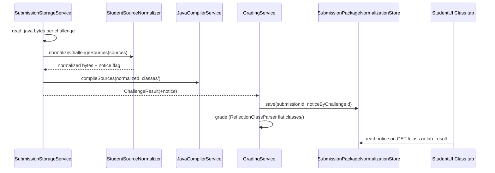

# Ignore Java Package for Grading - Plan

## Goal Capsule

**Objective:** When students submit Java files that declare a `package`, normalize sources before compile so the autograder grades class structure and testcases against default-package output, and show a non-blocking warning that package declarations were ignored.

**Product authority:** This plan owns submission-time source normalization and the student-visible warning. It does not change upload folder validation, rubric authoring, or MMD grading.

**Open blockers:** None.

## Product Contract

### Summary

Strip `package` declarations (and same-challenge cross-imports) from student Java sources in memory before compile, so `.class` files land in a flat default package that matches rubric simple names and existing reflection grading. When normalization runs, surface a non-blocking notice on the student result.

### Problem Frame

The autograder was built for default-package lab submissions: rubrics reference classes by simple name, and grading reads only top-level `.class` files under `challenge_N/classes/`. Students commonly add `package ...;` from IDE or course habit. Upload often compiles successfully, but compiled classes sit in package subdirectories. `countClassFiles` and `ReflectionClassParser` then report zero classes, so the Class pillar scores 0% even when the student's OOP structure is correct.

### Key Decisions

- **Normalize at compile time over discovery-only fixes** — Governs R1, R2, R3. Strip package-related source before `javac` so the whole pipeline stays on the existing flat default-package model instead of teaching reflection to resolve arbitrary FQNs.
- **Non-blocking student warning over silent normalization** (session-settled: user-directed — chosen over silent: students should know packages are not part of the graded contract) — Governs R4.
- **Same-challenge import stripping with JDK imports preserved** — Governs R2. Remove `import` lines that reference types also submitted as `.java` in the same challenge; keep standard library imports (`java.*`, `javax.*`, and other external imports).

### Requirements

**Source normalization**

- R1. Before compiling a challenge's Java files, detect and remove every `package ...;` declaration from in-memory source. Compiled output for that challenge must land in the default package (flat `.class` files directly under `challenge_N/classes/`).
- R2. When stripping packages, also remove `import` statements that reference a simple class name present in another `.java` file submitted for the same challenge. Preserve imports for types not submitted in that challenge (e.g. `java.util.List`).
- R3. Normalization applies to student submission upload compile and to lecturer testcase dry-run reference Java so preview behavior matches student grading.

**Student feedback**

- R4. When normalization ran for at least one file in a challenge, show a non-blocking warning on the student-facing result for that submission (Class tab card and/or upload summary). Message intent: package declarations were ignored for grading; student code below the package line was evaluated.

**Grading continuity**

- R5. After normalization, Class pillar reflection and operational testcase invocation must resolve rubric class names by simple name without requiring package-qualified names in the rubric.
- R6. Normalization must not change MMD grading behavior or rubric structure.

### Key Flows

- F1. **Upload with package declaration**
  - **Trigger:** Student uploads a challenge folder containing `.java` files where at least one file includes a `package ...;` line.
  - **Steps:** Validate upload structure → for each challenge, read Java sources → normalize (R1, R2) → compile in memory → grade with existing reflection/testcase pipeline → persist results → if normalized, attach warning (R4).
  - **Outcome:** Class pillar and testcases grade on structure/behavior; student sees warning that package was ignored.

- F2. **Upload without package declaration**
  - **Trigger:** Student submits default-package Java (no `package` line).
  - **Steps:** Existing compile and grade path unchanged.
  - **Outcome:** No normalization warning.

- F3. **Lecturer dry-run with packaged reference code**
  - **Trigger:** Lecturer pastes or uploads reference Java containing `package` for testcase preview.
  - **Steps:** Apply the same normalization before temp compile as student upload (R3).
  - **Outcome:** Dry-run preview matches what students experience.

### Acceptance Examples

- AE1. **Package-only mismatch (primary case)**
  - **Covers R1, R4, R5.**
  - **Given:** `challenge_1/Employee.java` contains `package ch2_employees; public class Employee { ... }` matching rubric class `Employee`.
  - **When:** Student uploads and grading completes.
  - **Then:** Class pillar reflects parsed members (not 0% from missing classes); student sees non-blocking package-ignored warning; no compile error solely from package/folder mismatch.

- AE2. **Cross-file references in same challenge**
  - **Covers R2, R5.**
  - **Given:** `Employee.java` and `Main.java` in the same challenge; both declare the same package and `Main` imports `ch2_employees.Employee`.
  - **When:** Normalization runs and compile proceeds.
  - **Then:** Both classes compile in default package and reference each other without import lines; grading finds both by simple name.

- AE3. **Standard library imports preserved**
  - **Covers R2.**
  - **Given:** Source uses `import java.util.ArrayList;` and no student-submitted `ArrayList.java`.
  - **When:** Normalization runs.
  - **Then:** The `java.util` import remains and compilation succeeds.

- AE4. **No false warning**
  - **Covers R4.**
  - **Given:** All submitted Java files lack a `package` declaration.
  - **When:** Upload and grading complete.
  - **Then:** No package-ignored warning is shown.

### Scope Boundaries

**In scope**

- In-memory source normalization on the submission compile path.
- Matching normalization on lecturer testcase dry-run compile.
- Non-blocking student warning when normalization occurred.
- Tests covering packaged student submissions end-to-end through compile and class discovery.

**Out of scope**

- Requiring students to remove packages manually or match folder paths to package names.
- Allowing arbitrary nested folders under `challenge_N` (e.g. `challenge_1/models/Student.java`) — upload validation unchanged.
- Penalizing or rejecting submissions that include packages.
- Changing rubric authoring to store package-qualified class names.
- Rewriting `import` lines to different syntax beyond removal of same-challenge imports.

### Dependencies / Assumptions

- Rubrics continue to name classes by simple name only (current `ClassRubric` contract).
- Student submissions remain flat `.java` files directly under each `challenge_N` folder per existing DropZone validation.
- JDK `javac` via `JavaCompilerService` remains the compile backend.
- Assumption: when compile currently "succeeds" but Class pillar is 0%, failure is due to package subdirectories under `classes/`, not unrelated syntax errors.

### Resolved planning decisions

- **Warning copy:** `Package declarations were ignored for grading. Your class structure below the package line was evaluated in the default package.`
- **Warning surface:** Challenge-level banner at top of student Class tab (and same field on upload `lab_result` bundle for immediate post-upload view). Not a blocking toast; compile errors still use existing error styling.
- **Persistence:** New sidecar `{SUBMISSION_BASE_DIR}/_package_normalization/{submissionId}.json` keyed by challenge UUID (parallel pattern to `_compile_errors`).
- **Multiple packages in one challenge:** Strip all `package` lines from all files — no first-wins behavior.

### Sources / Research

- `docs/plans/2026-08-09-001-perf-submission-compile-path-plan.md` — documents flat `classes/` assumption and known package breakage.
- `docs/solutions/architecture-patterns/in-memory-challenge-compile-path.md` — `countClassFiles` flat list matches `ReflectionClassParser`.
- `backend/src/main/java/com/eiu/capstone/backend/service/SubmissionStorageService.java` — compile source assembly.
- `backend/src/main/java/com/eiu/capstone/backend/grading/ReflectionClassParser.java` — top-level `.class` discovery by simple name.
- `backend/src/main/java/com/eiu/capstone/backend/grading/testcase/InvocationRunner.java` — `Class.forName(simpleName)` against flat class loader.

---

## Planning Contract

### Key Technical Decisions

| ID | Decision | Rationale |
|----|----------|-----------|
| KTD1 | New `StudentSourceNormalizer` utility in `backend/src/main/java/com/eiu/capstone/backend/service/compile/` with `normalizeChallengeSources(List<SourceEntry>) → NormalizationResult` | Single pure function for package/import stripping; testable without Spring; reused by upload and dry-run |
| KTD2 | Normalization runs in `SubmissionStorageService.processChallengeWork` after reading multipart bytes, before `MemorySourceJavaFileObject` construction | Keeps compile path unchanged downstream; matches in-memory compile design from compile-path plan |
| KTD3 | `ChallengeResult` gains optional `packageNormalizationNotice` string; `GradingService` persists via new `SubmissionPackageNormalizationStore` | Mirrors compile-error sidecar; survives temp folder cleanup; revisit reads work like compile errors |
| KTD4 | Extend `ChallengeDetailBundleDTO` (and upload `lab_result` challenge bundle) with optional `normalizationNotice` | One banner per challenge on Class tab; avoids overloading per-class `error` field (compile errors) |
| KTD5 | Import removal uses simple-name index of public top-level classes parsed from each file's `class`/`interface`/`enum`/`record` declaration | Same-challenge cross-imports removed; `java.*` / `javax.*` always kept; static imports of same-challenge types removed |
| KTD6 | Strip all `package` lines when any file in the challenge has one — even if files disagree on package name | Student habit varies; default-package compile is the graded contract |

### High-Level Technical Design

**Normalizer rules (directional):**

1. Regex or line-scanner removes `package ... ;` (allow whitespace/comments on same line per javac tolerance).
2. Build set of simple class names from each source file (regex on `class|interface|enum|record` declarations — same rough approach as dry-run path naming).
3. Remove `import ... ;` lines whose imported simple name is in that set.
4. Keep imports starting with `java.` or `javax.`.
5. Return `normalized=true` if any package line was removed.

### Assumptions

- Normalized sources remain valid UTF-8 Java; no BOM handling change.
- Student files use public top-level types matching filename (existing implicit contract).
- Lecturer dry-run reference sources follow the same shape as student uploads.

### Sequencing

U1 (normalizer + unit tests) → U2 (wire upload path + store) → U3 (dry-run) → U4 (API + frontend banner) → U5 (integration tests + AGENTS.md).

---

## Implementation Units

### U1. Student source normalizer

**Goal:** Pure utility that strips package and same-challenge imports.

**Requirements:** R1, R2

**Dependencies:** None

**Files:**

- `backend/src/main/java/com/eiu/capstone/backend/service/compile/StudentSourceNormalizer.java` (create)
- `backend/src/test/java/com/eiu/capstone/backend/service/compile/StudentSourceNormalizerTest.java` (create)

**Approach:**

1. Accept list of `{ logicalPath, utf8Source }` for one challenge.
2. Scan each source for `package` line removal; collect declared simple type names per file.
3. Remove imports whose trailing simple name matches a declared name in the batch.
4. Return normalized sources + boolean `packageStripped`.

**Test scenarios:**

- Single file with `package foo; public class Employee {}` → package removed, class body intact.
- Two files with matching package + cross-import → both packages and cross-import removed; compiles together in default package (integration in U2).
- `import java.util.List` preserved when no `List.java` in batch.
- No package line → sources unchanged, `packageStripped=false`.
- Covers AE2, AE3, AE4 (normalizer layer).

**Verification:** `StudentSourceNormalizerTest` green.

---

### U2. Wire normalizer into submission compile path

**Goal:** Upload compiles normalized sources and records per-challenge notice.

**Requirements:** R1, R2, R5

**Dependencies:** U1

**Files:**

- `backend/src/main/java/com/eiu/capstone/backend/service/SubmissionStorageService.java` (modify)
- `backend/src/main/java/com/eiu/capstone/backend/service/SubmissionPackageNormalizationStore.java` (create)
- `backend/src/main/java/com/eiu/capstone/backend/grading/GradingService.java` (modify — save notices after grade)
- `backend/src/test/java/com/eiu/capstone/backend/service/SubmissionStorageServiceTest.java` (modify)

**Approach:**

1. In `processChallengeWork`, after reading bytes, call normalizer before building `MemorySourceJavaFileObject` list.
2. Add `packageNormalizationNotice` to `ChallengeResult` when `packageStripped` (use resolved copy from Planning Contract).
3. `SubmissionPackageNormalizationStore` mirrors `SubmissionCompileErrorStore` JSON shape under `_package_normalization/`.
4. `GradingService` saves notices map alongside compile errors.

**Test scenarios:**

- Upload with packaged `Employee.java` → `classFileCount >= 1`, flat `classes/Employee.class`, no `compileError`.
- Upload default-package unchanged.
- Covers AE1 compile/count path.

**Verification:** `SubmissionStorageServiceTest` + `mvn test -Dtest=SubmissionStorageServiceTest,StudentSourceNormalizerTest`.

---

### U3. Apply normalizer to lecturer dry-run

**Goal:** Dry-run compiles reference Java with same rules as student upload.

**Requirements:** R3

**Dependencies:** U1

**Files:**

- `backend/src/main/java/com/eiu/capstone/backend/service/TestcaseDryRunService.java` (modify)
- `backend/src/test/java/com/eiu/capstone/backend/service/TestcaseDryRunServiceTest.java` (modify or create if missing)

**Approach:**

1. Before `javaCompilerService.compileSources`, run normalizer on reference source list (className + source pairs).
2. Use normalized bytes for compile; no student-facing notice on dry-run (lecturer preview only).

**Test scenarios:**

- Dry-run with `package demo; public class Foo {}` compiles and testcase invokes `Foo` by simple name.

**Verification:** Dry-run unit test green.

---

### U4. Student-facing normalization notice

**Goal:** Non-blocking warning on Class tab and upload bundle.

**Requirements:** R4

**Dependencies:** U2

**Files:**

- `backend/src/main/java/com/eiu/capstone/backend/DTO/ChallengeDetailBundleDTO.java` (modify)
- `backend/src/main/java/com/eiu/capstone/backend/service/ClassStructureService.java` (modify)
- `backend/src/main/java/com/eiu/capstone/backend/grading/LabResultAssembler.java` (modify)
- `frontend/src/components/student/StudentUI.jsx` (modify)
- `backend/src/main/java/com/eiu/capstone/backend/service/AGENTS.md` (modify — document sidecar + normalizer)

**Approach:**

1. Add optional `normalizationNotice` to bundle DTO JSON.
2. `ClassStructureService` reads store by submission + challenge id.
3. `LabResultAssembler` includes notice in upload-time `lab_result.challenge_N`.
4. Student Class tab: warning banner (`border-warning`, `bg-warning-bg`) above class cards when `normalizationNotice` present; omit when null.

**Test scenarios:**

- After packaged upload, GET class endpoint returns notice; frontend renders banner (manual or component test if present).
- Default-package upload: notice absent.
- Covers AE1, AE4 UI layer.

**Verification:** Manual upload on student dashboard; banner visible once per affected challenge.

---

### U5. End-to-end grading regression tests

**Goal:** Confirm Class pillar and testcases grade packaged submissions.

**Requirements:** R5, R6

**Dependencies:** U2

**Files:**

- `backend/src/test/java/com/eiu/capstone/backend/grading/ReflectionClassParserTest.java` (create or extend)
- `backend/src/test/java/com/eiu/capstone/backend/service/SubmissionStorageServiceTest.java` (extend — compile + list classes)
- `backend/AGENTS.md` (modify — submission pipeline note on package normalization)
- `CONCEPTS.md` (already has Package normalization entry)

**Test scenarios:**

- Compile normalized packaged sources → `ReflectionClassParser.parseClasses` returns non-empty list with expected simple name.
- MMD-only challenge unaffected (no Java → no notice, no normalizer call).

**Verification:** `mvn test` from `backend/` for touched test classes.

---

## Verification Contract

| Check | Command / action | Expected |
|-------|------------------|----------|
| V1 Unit normalizer | `mvn test -Dtest=StudentSourceNormalizerTest` | All pass |
| V2 Upload compile | `mvn test -Dtest=SubmissionStorageServiceTest` | Packaged fixture produces flat `.class` |
| V3 Dry-run | `mvn test -Dtest=TestcaseDryRunServiceTest` | Packaged reference compiles |
| V4 Manual student flow | Upload lab folder with `package` lines via DropZone | Class score > 0 when structure correct; warning banner shown |
| V5 Manual default package | Upload without packages | No warning; behavior unchanged |
| V6 Docs | Read `backend/AGENTS.md` submission section | Documents normalization + sidecar path |

---

## Definition of Done

- [ ] U1–U5 complete with tests passing (`mvn test` in `backend/`).
- [ ] Student Class tab shows non-blocking warning when normalization ran (R4).
- [ ] Packaged submissions produce flat `classes/*.class` and non-zero Class pillar when rubric matches (R1, R5).
- [ ] Dry-run uses same normalizer (R3).
- [ ] MMD grading unchanged (R6).
- [ ] `backend/AGENTS.md` and `CONCEPTS.md` reflect package normalization contract.
- [ ] No change to upload folder validation or rubric schema.
