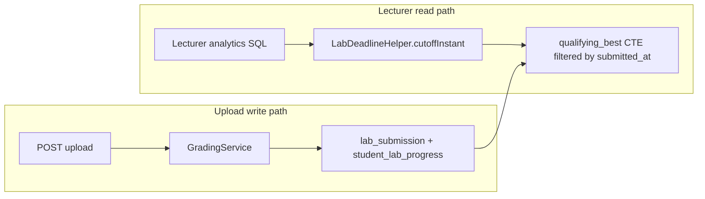

# Lab Deadline Expiry - Plan

## Goal Capsule

- **Objective:** Add an optional per-lab expiration date so lecturer-facing scores freeze after the deadline while students may still submit, receive full grading feedback, and retain complete history; lecturers manage deadlines in Solution Management and may extend them to backfill lecturer views from persisted history.
- **Product authority:** This plan owns per-lab deadline storage, lecturer deadline editing in Solution Management, student deadline visibility and urgency UI, deadline-aware lecturer score aggregation across all lecturer surfaces, and warning emails at 72h and 24h before deadline end for enrolled students who have not submitted.
- **Open blockers:** None — ready for implementation.

## Product Contract

### Summary

Each lab gets an optional deadline date defaulting to its term's end date. Submissions always grade and persist for the student. Lecturer rosters, grade overview, analytics, exports, and challenge tabs count only submissions submitted on or before the active deadline end (23:59:59 Vietnam time). Extending a deadline widens the counting window instantly from history. Students see deadlines via a chip-based lab selector with urgency colors; enrolled non-submitters receive email warnings at exactly 72 hours and 24 hours before deadline end.

### Problem Frame

Today every student submission immediately updates lecturer dashboards and grade matrices. Lecturers have no in-app way to set when a lab stops counting toward official grading views, and students receive no deadline visibility or proactive reminders. Academic terms carry optional start/end dates, but those dates do not gate per-lab submission visibility and cannot be overridden per lab.

### Actors

- A1. **Lecturer** — sets, edits, clears, and extends per-lab deadlines in Solution Management; sees frozen lecturer scores after expiry until extension.
- A2. **Student** — sees each lab's deadline and urgency state; may submit before, during urgency windows, and after expiry with full session grading feedback; history always records every attempt.
- A3. **System scheduler** — sends one warning email per threshold (72h, 24h) to eligible enrolled students per lab.

### Requirements

**Deadline definition and storage**

- R1. Each lab may have an optional **deadline date** stored on the lab record. When unset after lecturer clears the default, the lab never expires for lecturer counting purposes (current behavior).
- R2. On lab creation in Solution Management, the deadline field **defaults to the selected term's end date** when that term has an end date; the lecturer may change or clear it before save.
- R3. A lab's effective deadline moment is **23:59:59 on the stored calendar date in Vietnam time (UTC+7)**. A submission counts toward lecturer views only when its submission timestamp is on or before that moment.
- R4. Lecturers add, edit, clear, and **extend** the deadline from Solution Management on the same screen where lab structure is authored. Extending means setting a later deadline date; no separate "reopen" action is required.

**Student experience**

- R5. Students see each lab's deadline date (and urgency hint when applicable) in the lab selector on the student dashboard.
- R6. The student lab selector is a **vertical chip list** replacing the current dropdown. Each chip shows lab name, deadline, and urgency styling for the selected lab and list items.
- R7. Urgency styling uses four states: **OK** (more than 3 days remaining), **warning** (3 days or fewer, more than 1 day), **urgent** (1 day or fewer, not yet expired), **expired** (past deadline end). Expired labs remain selectable and submittable.
- R8. Labs in the student selector are sorted by **natural lab name order** (Lab 1, Lab 2, …, Lab 10), not raw alphabetical or creation order.
- R9. After a lab has expired, students who upload still receive **normal grading feedback** on the dashboard (score, result tabs, success toast). Only lecturer-facing aggregates are frozen per R10.
- R10. Student submission history (`my-history`, attempt lists, per-lab stats the student sees) **always includes every attempt** regardless of deadline state.

**Lecturer score visibility**

- R11. When a lab is past its deadline end, **late submissions do not update any lecturer-facing score or completion aggregate** until the lecturer extends the deadline.
- R12. The freeze in R11 applies consistently to **all lecturer surfaces**: per-lab submission roster, grade overview matrix, analytics/reports, challenge student tabs, statistics cards, and exports.
- R13. For a student with submissions both before and after deadline end, lecturer views show scores derived only from attempts on or before the active deadline end (typically the best qualifying attempt, matching existing highest-score semantics for displayed cells).
- R14. When a lecturer **extends** a deadline to a later date, lecturer views **immediately recalculate** from full persisted submission history using the new cutoff — including attempts made during the prior expired window. No manual backfill action is required.
- R15. If a lab is extended and later expires again under a new deadline date, the same freeze and recalc rules apply: submissions after the new deadline end are excluded from lecturer views until the next extension.

**Warning emails**

- R16. The system sends a warning email to each **active student enrolled in the lab's term** who has **not yet submitted** for that lab (no `student_lab_progress` row with a submission, or equivalent "never submitted" signal).
- R17. Two emails fire per eligible student per lab: one when the lab crosses **exactly 72 hours** before deadline end, and one when it crosses **exactly 24 hours** before deadline end. Each threshold sends at most once per student per lab.
- R18. Email content identifies the lab name, deadline date/time (VN), and prompts the student to submit before the deadline if they want the attempt counted for lecturer grading views.

**Lab list ordering (lecturer)**

- R19. Lab lists in Solution Management and other lecturer lab pickers sort by **natural lab name order** (Lab 1, Lab 2, …), consistent with R8.

### Key Flows

- F1. **Lecturer sets deadline on create**
  - **Trigger:** Lecturer creates a lab and picks a term.
  - **Actors:** A1
  - **Steps:** Term end date pre-fills deadline field → lecturer adjusts or clears → save persists lab with deadline.
  - **Outcome:** Lab exists with optional deadline; student and lecturer UIs expose the date.

- F2. **Student submits before deadline**
  - **Trigger:** Student uploads while current time is before deadline end.
  - **Actors:** A2
  - **Steps:** Normal upload pipeline runs → history and lecturer aggregates update.
  - **Outcome:** Score visible to student and lecturer.

- F3. **Student submits after expiry**
  - **Trigger:** Student uploads while current time is after deadline end.
  - **Actors:** A2
  - **Steps:** Normal upload and grading run → student sees full feedback → history updated → lecturer aggregates unchanged.
  - **Outcome:** Student attempt persisted; lecturer views frozen at pre-expiry qualifying scores.

- F4. **Lecturer extends deadline**
  - **Trigger:** Lecturer sets a later deadline date in Solution Management and saves.
  - **Actors:** A1
  - **Steps:** New deadline stored → lecturer queries re-evaluate cutoff → late-window submissions now qualify → analytics caches invalidated as needed.
  - **Outcome:** Lecturer surfaces show scores including previously late attempts up to the new cutoff.

- F5. **Warning email at 72h / 24h**
  - **Trigger:** Scheduled check detects lab deadline end is exactly 72h or 24h away.
  - **Actors:** A3
  - **Steps:** Resolve enrolled active students without submission for lab → send one email per threshold not yet sent → record send so threshold is not repeated.
  - **Outcome:** Eligible students notified once per threshold.

### Acceptance Examples

- AE1. **Before deadline counts for lecturer**
  - **Covers:** R3, R10, R11
  - **Given:** Lab 1 deadline 15/08/2026, student submits 14/08/2026 20:00 VN
  - **When:** Lecturer opens lab roster after submission
  - **Then:** Student's score appears in lecturer views; attempt appears in student history.

- AE2. **After deadline excluded from lecturer, full student feedback**
  - **Covers:** R7, R9, R11, R12
  - **Given:** Lab 1 deadline 15/08/2026, student had no prior submission, uploads 16/08/2026 10:00 VN
  - **When:** Student completes upload; lecturer opens roster and grade overview
  - **Then:** Student sees graded result and history entry; lecturer roster and grade overview show no score / not submitted for that lab.

- AE3. **Extension backfills from history**
  - **Covers:** R4, R14
  - **Given:** Same as AE2, lecturer later extends deadline to 20/08/2026
  - **When:** Lecturer saves extension and reloads roster
  - **Then:** The 16/08 submission now counts; lecturer views show its score without a separate sync action.

- AE4. **Second expiry refreezes**
  - **Covers:** R14, R15
  - **Given:** Deadline extended to 20/08/2026, student submits 21/08/2026
  - **When:** Lecturer views after 20/08/2026 23:59:59 VN
  - **Then:** 21/08 submission excluded from lecturer views; 16/08 submission still counts; student history contains both.

- AE5. **Email to non-submitters only**
  - **Covers:** R16, R17
  - **Given:** Lab deadline in 72 hours; Student A never submitted; Student B submitted yesterday
  - **When:** 72-hour job runs
  - **Then:** Student A receives email; Student B does not; neither receives duplicate at the same threshold on rerun.

- AE6. **No deadline means no freeze**
  - **Covers:** R1, R11
  - **Given:** Lab with cleared deadline field
  - **When:** Student submits at any time
  - **Then:** Lecturer views update as today.

- AE7. **Natural sort**
  - **Covers:** R8, R19
  - **Given:** Labs named Lab 1, Lab 10, Lab 2 exist
  - **When:** Student opens dashboard selector
  - **Then:** Order is Lab 1, Lab 2, Lab 10.

### Key Decisions

- KD1. **Read-time deadline cutoff for lecturer aggregates** over maintaining separate frozen score columns. Chosen so extending a deadline widens the counting window from persisted history without a backfill job. Governs R11, R13, R14.
- KD2. **Deadline ends 23:59:59 Vietnam time on the calendar date** (session-settled: user-directed — chosen over exact datetime picker and UTC midnight: matches VN university context and simpler lecturer input). Governs R3, R17.
- KD3. **Lab chips replace dropdown** on student dashboard (session-settled: user-directed — chosen over colored dropdown or left-bar list: clearer urgency at a glance). Governs R6, R7.
- KD4. **Solution Management owns deadline CRUD and extension** (session-settled: user-directed — chosen over grading-dashboard-only or split surfaces: co-located with lab creation). Governs R4.
- KD5. **Optional deadline defaulting to term end date, clearable** (session-settled: user-directed — chosen over required deadline or optional with no default: preserves backward compatibility while nudging sensible defaults). Governs R1, R2.
- KD6. **Post-expiry uploads give full student session feedback** (session-settled: user-directed — chosen over history-only acknowledgment: supports practice while keeping lecturer views frozen). Governs R9.
- KD7. **Warning emails to enrolled non-submitters at exactly 72h and 24h before deadline end** (session-settled: user-directed — chosen over calendar-day batch or all-enrolled recipients: precise timing, fewer noise emails). Governs R16, R17.
- KD8. **Freeze applies to all lecturer score surfaces** (session-settled: user-directed — chosen over roster-only freeze: consistent official grading picture). Governs R12.

### Scope Boundaries

**In scope:** Per-lab deadline field, Solution Management UI, student chip selector with urgency states, natural lab name sorting, deadline-aware lecturer aggregation, scheduled warning emails, extension behavior, student history unchanged completeness.

**Deferred for later:**

- Blocking or rate-limiting student uploads after expiry
- Warning emails to students who already submitted or based on low scores
- Per-student deadline extensions or accommodation workflows
- Quiet-hours or digest bundling for reminder emails
- Lecturer notifications when a lab crosses expiry

**Outside this product's identity:**

- Using term dates alone as the only deadline mechanism without per-lab override
- Hiding expired labs from the student selector or disabling the upload zone

### Dependencies / Assumptions

- Term records may expose `end_date` used as the lab-creation default per R2.
- Student enrollment for a lab's term is available via existing `term_enrollment` data.
- Transactional email infrastructure (`TransactionalEmailSender`, SMTP/Brevo) can send plain-text warnings similar to password-reset mail.
- Submission timestamps already persisted on lab submissions support cutoff comparison.
- Vietnam timezone (UTC+7) is the single authoritative timezone for deadline boundaries and email threshold timing.

### Outstanding Questions

None — all items resolved in brainstorm dialogue.

### Sources / Research

- Existing `Lab` entity has `name` and `term_id` only — no deadline field yet (`backend/src/main/java/com/eiu/capstone/backend/model/Lab.java`).
- Term entity carries optional `start_date` / `end_date` (`backend/src/main/java/com/eiu/capstone/backend/model/Term.java`).
- Lecturer surfaces today read `student_lab_progress.highest_score` (`CONCEPTS.md`, `backend/AGENTS.md`).
- Email sending exists for password reset via `TransactionalEmailSender` (`backend/src/main/java/com/eiu/capstone/backend/service/TransactionalEmailSender.java`).
- Student lab selector is currently a `<select>` in `frontend/src/components/student/StudentUI.jsx`.

---

## Planning Contract

### Summary

Add nullable `deadline_date` on `lab`, a shared `LabDeadlineHelper` for VN cutoff instants and urgency states, and a reusable SQL score fragment that computes per-student **lecturer-visible best score** from `lab_submission` rows with `submitted_at <= cutoff` instead of `student_lab_progress.highest_score`. Wire deadline into lab create/structure APIs and `GET /api/labs` for students. Replace the student dropdown with urgency chips. Add `@EnableScheduling` plus a `lab_deadline_email_sent` ledger and a minutely job that fires 72h/24h warnings via existing `TransactionalEmailSender`.

**Product Contract preservation:** Enriched in place from brainstorm artifact; requirements R1–R19 unchanged.

### Key Technical Decisions

- KTD1. **`deadline_date DATE NULL` on `lab`** — no separate time column; cutoff computed as end-of-day VN in Java. Manual DDL in `docs/sql/` per repo convention. Governs R1–R3.
- KTD2. **Read-time qualifying score subquery** — shared CTE/SQL fragment `qualifying_best AS (SELECT user_id, lab_id, MAX(score) … WHERE submitted_at <= :cutoff)` replaces `p.highest_score` in lecturer analytics SQL. Upload pipeline continues updating `student_lab_progress` unchanged for student paths. Governs KD1, R11–R15.
- KTD3. **`LabDeadlineHelper` utility** — `ZoneId.of("Asia/Ho_Chi_Minh")`, methods `cutoffInstant(LocalDate)`, `urgencyState(deadlineDate, now)`, `naturalLabNameComparator()`. Single timezone authority. Governs R3, R7, R8, R19.
- KTD4. **Deadline on lab metadata endpoints** — extend `CreateLabRequest`, `LabStructureResponse`, lecturer lab list, and `LabController.LabSummary` with `deadlineDate` (ISO date string). Structure save does not require re-saving tree to change deadline; optional lightweight `PATCH` or include deadline in existing create/update lab paths used by Solution Management. Governs R4, R5.
- KTD5. **`lab_deadline_email_sent` ledger** — columns `(lab_id, user_id, threshold_hours)` with unique constraint; thresholds `72` and `24`. Prevents duplicate sends. Governs R17.
- KTD6. **Scheduled job every minute** — `@Scheduled(fixedRate = 60_000)` scans labs with non-null deadline where `cutoff - now` is within a 1-minute window of exactly 72h or 24h; eligible = active `term_enrollment` minus students with any `lab_submission` for that lab. Governs R16, R17.
- KTD7. **Analytics cache invalidation on deadline save** — when lecturer updates deadline, invalidate `LabStatisticsCache` and lecturer overview/dashboard caches for affected lab (mirror upload invalidation pattern). Governs F4.
- KTD8. **Student chip UI uses theme tokens** — map urgency states to existing `--success`, `--warning`, `--error`, and muted border tokens from `src/theme/tokens.js`; no raw hex. Governs R6, R7.

### High-Level Technical Design

### Assumptions

- `lab_submission.submitted_at` is populated for all graded uploads and stored with timezone-aware timestamps suitable for cutoff comparison.
- One-minute scheduler granularity is acceptable for "exactly 72h/24h" emails (window `[target, target+1m)`).
- Lecturer lab ordering today uses `findAllLabsOrdered()` in `LecturerAnalyticsRepository` — extend with natural sort in Java or SQL.

### Sequencing

U1 (schema + entity) → U2 (deadline helper + lab API fields) → U3 (qualifying score SQL + analytics refactor) → U4 (deadline email scheduler) → U5 (Solution Management UI) → U6 (student chip selector) → U7 (docs + AGENTS).

---

## Implementation Units

### U1. Lab deadline persistence

**Goal:** Store optional per-lab deadline date.

**Requirements:** R1, R3; KTD1

**Dependencies:** None

**Files:**
- `backend/src/main/java/com/eiu/capstone/backend/model/Lab.java` (modify)
- `docs/sql/2026-08-19-lab-deadline.sql` (create — DDL for operators)
- `backend/src/main/java/com/eiu/capstone/backend/model/LabDeadlineEmailSent.java` (create)
- `backend/src/main/java/com/eiu/capstone/backend/repository/LabDeadlineEmailSentRepository.java` (create)

**Approach:**
1. Add `@Column(name = "deadline_date") private LocalDate deadlineDate` to `Lab`.
2. DDL adds `deadline_date DATE NULL` to `lab`.
3. Create `lab_deadline_email_sent` with FKs to `lab` and `user_account`, `threshold_hours SMALLINT`, `sent_at TIMESTAMPTZ`, unique `(lab_id, user_id, threshold_hours)`.

**Patterns to follow:** `Term.startDate` / `endDate` mapping; external DDL like `docs/sql/2026-08-07-analytics-indexes.sql`.

**Test scenarios:**
- JPA maps `deadline_date` null and non-null.
- Unique constraint prevents duplicate email ledger rows.

**Verification:** `mvn -q compile`; DDL file matches entities.

---

### U2. Deadline helper and lab API exposure

**Goal:** Centralize cutoff/urgency logic and expose deadline on lab list/create/structure responses.

**Requirements:** R2, R4, R5, R8, R19; KTD3, KTD4

**Dependencies:** U1

**Files:**
- `backend/src/main/java/com/eiu/capstone/backend/service/LabDeadlineHelper.java` (create)
- `backend/src/test/java/com/eiu/capstone/backend/service/LabDeadlineHelperTest.java` (create)
- `backend/src/main/java/com/eiu/capstone/backend/service/LabStructureService.java` (modify — create/save deadline)
- `backend/src/main/java/com/eiu/capstone/backend/controller/LabController.java` (modify — `LabSummary` fields)
- `backend/src/main/java/com/eiu/capstone/backend/controller/LecturerRubricController.java` (modify — create lab request/response)
- DTO records used by structure API (modify)

**Approach:**
1. `LabDeadlineHelper`: `cutoffInstant(LocalDate)`, `urgencyState(LocalDate deadline, Instant now)` → enum `OK|WARNING|URGENT|EXPIRED|NONE`, `compareLabNames(a,b)` natural sort.
2. `createLab`: accept optional `deadlineDate`; default from term `endDate` when request omits it.
3. Add endpoint or extend existing lab update so Solution Management can change deadline without full structure tree (e.g. `PATCH /api/lecturer/labs/{id}` with `{ deadlineDate }` or include in structure root metadata save).
4. `GET /api/labs` returns `{ id, name, deadlineDate, urgencyState }` sorted via natural comparator.
5. Lecturer lab list endpoints sort the same way.

**Test scenarios:**
- Covers AE7: natural sort Lab 1, Lab 2, Lab 10.
- Cutoff for 2026-08-15 → `2026-08-15T23:59:59+07:00`.
- Urgency boundaries: 4 days = OK, 3 days = WARNING, 1 day = URGENT, after cutoff = EXPIRED, null deadline = NONE.

**Verification:** `mvn test -Dtest=LabDeadlineHelperTest`.

---

### U3. Qualifying score SQL for lecturer surfaces

**Goal:** All lecturer score reads use deadline-filtered best submission score.

**Requirements:** R11–R15, R12; KD1, KTD2, KTD7

**Dependencies:** U2

**Files:**
- `backend/src/main/java/com/eiu/capstone/backend/analytics/repository/LecturerAnalyticsRepository.java` (modify)
- `backend/src/main/java/com/eiu/capstone/backend/analytics/repository/AnalyticsRepository.java` (modify)
- `backend/src/main/java/com/eiu/capstone/backend/analytics/service/LecturerAnalyticsService.java` (modify)
- `backend/src/test/java/com/eiu/capstone/backend/analytics/LabDeadlineScoreIntegrationTest.java` (create — `@DataJpaTest` or service test with mocked EM)

**Approach:**
1. Introduce shared SQL fragment building `qualifying_best` per lab: `MAX(s.score)` grouped by user where `s.submitted_at <= :cutoff` (cutoff null → no filter, use existing `highest_score` behavior).
2. Replace roster SELECT `p.highest_score` with `qualifying_best.score`; treat null qualifying score as not submitted for lecturer cells.
3. Apply same pattern to grade overview matrix, lab statistics averages, challenge roster scores, export queries, and analytics dashboard aggregates that currently use `p.highest_score`.
4. `latest_sub` CTE for attempt metadata on roster may remain latest overall attempt, but **score column** uses qualifying best only.
5. On deadline update, call existing cache invalidation hooks for lab statistics and overview.

**Patterns to follow:** Existing native SQL in `LecturerAnalyticsRepository`; `ROSTER_STUDENT_BASE` CTE style.

**Test scenarios:**
- Covers AE1, AE2, AE3, AE4, AE6 with fixture submissions at known timestamps.
- Student with score 80 before deadline and 95 after → lecturer shows 80 until extension, then 95.
- Null deadline → behaves as today.

**Verification:** `mvn test -Dtest=LabDeadlineScoreIntegrationTest`.

---

### U4. Deadline warning email scheduler

**Goal:** Send 72h and 24h reminder emails to enrolled non-submitters.

**Requirements:** R16–R18, F5; KTD5, KTD6

**Dependencies:** U1, U2

**Files:**
- `backend/src/main/java/com/eiu/capstone/backend/EiuCapstoneBackendApplication.java` (modify — `@EnableScheduling`)
- `backend/src/main/java/com/eiu/capstone/backend/service/LabDeadlineEmailService.java` (create)
- `backend/src/main/java/com/eiu/capstone/backend/service/LabDeadlineReminderScheduler.java` (create)
- `backend/src/test/java/com/eiu/capstone/backend/service/LabDeadlineEmailServiceTest.java` (create)

**Approach:**
1. Scheduler runs each minute; for each lab with `deadline_date`, compute cutoff instant; if `now` in `[cutoff-72h, cutoff-72h+1m)` or `[cutoff-24h, cutoff-24h+1m)`, process that threshold.
2. Query active enrolled students for lab term without any `lab_submission` row for that lab.
3. Skip if ledger row exists; else send via `TransactionalEmailSender.sendPlainText` and insert ledger row.
4. Email subject/body: lab name, deadline date (VN formatted), link hint to student dashboard.

**Patterns to follow:** `PasswordResetService` email usage; `TermEnrollmentSyncService` enrollment queries.

**Test scenarios:**
- Covers AE5: submitter excluded; non-submitter included; second run does not resend.
- Lab with null deadline skipped.

**Verification:** `mvn test -Dtest=LabDeadlineEmailServiceTest`.

---

### U5. Solution Management deadline UI

**Goal:** Lecturers set, edit, clear, and extend deadlines in Solution Management.

**Requirements:** R2, R4, F1, F4; KD4, KD5

**Dependencies:** U2

**Files:**
- `frontend/src/pages/SolutionManagement.jsx` (modify)
- `frontend/src/components/lecturer/structure/StructureSidebar.jsx` (modify — show deadline on lab row optional)

**Approach:**
1. Create-lab modal: date input for deadline, pre-filled when term selected (read `endDate` from terms list).
2. Selected lab header or sidebar lab row: editable date input + clear button; save via deadline PATCH or structure metadata save.
3. Show validation: date optional; empty = no expiry.
4. On successful save, refresh lab list deadline display.

**Patterns to follow:** Existing create-lab modal term picker; `authHeaders()` fetch pattern.

**Test scenarios:**
- Manual: create lab → default deadline from term; clear → student API shows no deadline; extend date → lecturer roster updates after reload.

**Verification:** `npm run build`.

---

### U6. Student lab chip selector

**Goal:** Replace dropdown with urgency-colored chip list sorted naturally.

**Requirements:** R5–R9, R8; KD3, KTD8

**Dependencies:** U2

**Files:**
- `frontend/src/components/student/StudentUI.jsx` (modify)
- `frontend/src/pages/StudentDashboard.jsx` (modify — pass urgency/deadline props if needed)
- `frontend/src/utils/labSort.js` (create — natural sort fallback if API unsorted)
- `frontend/src/theme/statusClasses.js` (modify — add `labUrgencyClasses` map)

**Approach:**
1. Render vertical chip list; selected chip uses primary outline; urgency background/border from token helpers.
2. Display `due DD/MM/YYYY` and hint text (`3 days left`, `1 day left`, `Expired — practice OK`).
3. Keep upload zone enabled for expired labs; no gating on DropZone.
4. Sort labs client-side with natural sort if API order wrong (defense in depth).

**Patterns to follow:** Existing stats card layout; semantic Tailwind classes from theme tokens.

**Test scenarios:**
- Manual: four urgency states visible with mock deadlines; expired lab still uploads and shows session grade.

**Verification:** `npm run build`; manual student dashboard check.

---

### U7. Documentation and DOX

**Goal:** Record contracts for operators and future agents.

**Requirements:** all

**Dependencies:** U1–U6

**Files:**
- `backend/AGENTS.md` (modify — deadline field, scheduler, qualifying score note)
- `frontend/src/components/student/AGENTS.md` (modify — chip selector)
- `frontend/src/pages/AGENTS.md` (modify — `/api/labs` response shape)
- `CONCEPTS.md` (already updated)

**Approach:** Document env unchanged (email reuse), DDL apply step, lecturer cutoff semantics, student chip UI.

**Verification:** DOX chain matches changed paths.

---

## Verification Contract

| Unit | Automated | Manual |
|---|---|---|
| U1 | compile | apply DDL in dev DB |
| U2 | `LabDeadlineHelperTest` | Swagger lab list shows deadline fields |
| U3 | `LabDeadlineScoreIntegrationTest` | lecturer roster before/after expiry + extension |
| U4 | `LabDeadlineEmailServiceTest` | trigger job with test lab near threshold |
| U5 | build | create/edit/clear deadline in Solution Management |
| U6 | build | student chip states + post-expiry upload |
| U7 | — | AGENTS.md spot-check |

**End-to-end smoke:** Create lab with deadline tomorrow → student sees chip → submit before cutoff → lecturer sees score → wait/simulate after cutoff → late submit visible to student only → extend deadline → lecturer sees late score → 72h email to non-submitter only.

---

## Definition of Done

- [ ] `deadline_date` column live in dev/prod PostgreSQL
- [ ] All acceptance examples AE1–AE7 pass in manual or automated tests
- [ ] Lecturer analytics no longer use raw `highest_score` where deadline applies
- [ ] Student dashboard uses chip selector with four urgency states
- [ ] Scheduler sends at most one 72h and one 24h email per eligible student per lab
- [ ] `mvn test` and `npm run build` succeed
- [ ] Applicable AGENTS.md files updated
