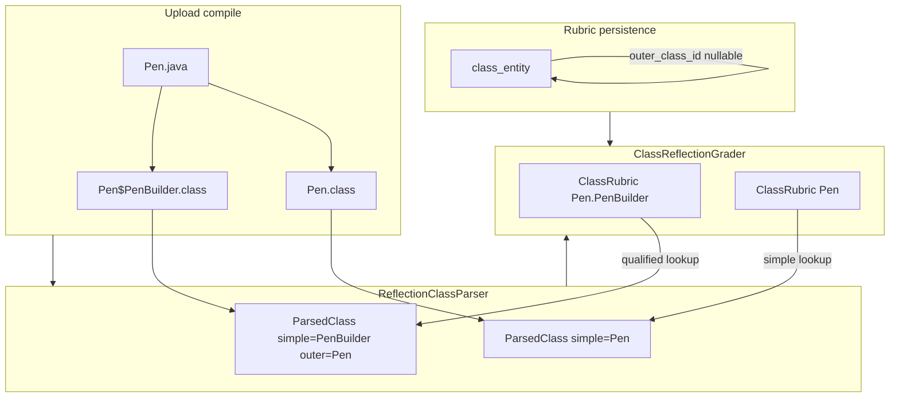

# Nested Class Grading Support - Plan

## Goal Capsule

- **Objective:** Enable class-reflection grading for static nested and non-static inner classes so rubric entries like `Pen.PenBuilder` match compiled student code instead of scoring as missing.
- **Product authority:** This plan owns the class-reflection pillar, rubric data model, and lecturer structure editor changes needed to define and grade nested classes. MMD diagram grading and operational testcase invocation of nested/inner classes are not active scope.
- **Open blockers:** None.

---

## Product Contract

### Summary

Add optional outer-class linkage to rubric class entries and teach the reflection parser to load nested `.class` files, match them by qualified name, and grade members. The immediate driver is a failing lab where `Pen` grades but `PenBuilder` is missing because `Pen$PenBuilder.class` is currently skipped.

### Problem Frame

Student submissions that use common OOP patterns — Builder with a static nested builder class, or non-static inner classes — compile successfully but lose nested classes during reflection parsing. The parser explicitly excludes any `.class` file whose name contains `$`, and rubrics store only a flat simple `name` with no way to identify which outer class a nested entry belongs to. Lecturers cannot express `Pen.PenBuilder` in the rubric, and grading cannot distinguish two different `Helper` classes nested under different outers.

### Key Decisions

- **Flat qualified rubric entries over nested tree editor** (session-settled: user-directed — chosen over parent-child tree editor: both classes remain top-level rubric rows with an outer-class identifier). **Governs R1, R3.**
- **Outer-class foreign key over string-only or qualified-name-in-name-column** — optional link to another `class_entity` row in the same challenge preserves referential integrity and supports rename-safe editor UX. **Governs R1, R3.**
- **Class pillar only for v1** — MMD and operational testcases stay unchanged; nested-class testcase invocation is deferred. **Governs R8.**
- **Filter synthetic outer-reference fields on inner classes** — compiler-generated implicit outer-instance fields (e.g. `this$0`) are excluded from reflection field lists and never graded unless explicitly listed in rubric (they will not be). **Governs R5.**
- **Static nested and non-static inner in scope; anonymous and local out** — anonymous and local nested classes remain unsupported. **Governs R2, R8.**
- **One-level nesting only** — support `Outer.Inner` (e.g. `Pen.PenBuilder`); deeper chains like `Outer.Middle.Inner` remain unsupported. **Governs R2, R3.**
- **Auto-ignore implicit outer parameter on inner constructors** — constructor comparison uses only rubric-listed parameters; the compiler's implicit outer-instance parameter is never expected or graded. **Governs R7.**
- **Cascade delete nested rubric classes** — deleting an outer class removes nested rubric entries that reference it, after lecturer confirmation. **Governs R10.**
- **Only top-level classes may be outers** — the outer-class picker excludes classes that already have an outer link. **Governs R3.**
- **Qualified names on student Class tab** — nested rubric classes display as `Outer.Inner` in student-facing class results. **Governs R11.**

### Requirements

**Rubric model**

- R1. A rubric class entry may optionally reference an outer class within the same challenge via a stable outer-class link. When set, the entry's grading identity is its qualified name (`Outer.Inner`); when unset, identity remains the simple name.
- R2. Static nested classes and non-static inner classes are in scope at one nesting level (`Outer.Inner`). Anonymous, local, and multi-level nested classes (deeper than one outer) are unsupported.
- R3. The lecturer structure editor lets authors pick an outer class from top-level classes in the same challenge (classes without an outer link). Nested classes display the qualified name in the class list and detail views.

**Reflection parsing and matching**

- R4. The reflection parser includes compiled nested class files (JVM binary names using `$`) alongside top-level classes in `challenge_N/classes/`.
- R5. Parsed nested classes expose their simple name and outer simple name (when applicable). Compiler-generated synthetic outer-reference fields on non-static inner classes are filtered out before grading comparison.
- R6. Class-reflection grading resolves rubric classes to parsed classes by qualified name when an outer-class link is present, and by simple name when it is not.

**Grading behavior**

- R7. When a rubric nested class is defined and the student's compiled nested class is present with matching members, the class pillar grades it the same way top-level classes are graded today (scope, declaring type, fields, methods, constructors, partial credit). For non-static inner-class constructors, the implicit outer-instance parameter is auto-ignored during parameter comparison.
- R8. MMD diagram parsing, comparison, and grading are unchanged. Operational testcase invocation of nested or inner classes is unchanged and out of scope for this work.

**Editor and display**

- R10. Deleting a rubric class that is referenced as an outer class cascades: nested classes pointing to it are deleted with it. The lecturer must confirm the cascade before the delete proceeds.
- R11. The student Class tab and parsed-submission snapshot display nested rubric classes using qualified names (`Pen.PenBuilder`), not simple names alone.
- R13. Compiled nested classes not defined in the rubric are ignored and do not affect the class-pillar score, consistent with undeclared top-level classes today.

**Compatibility and rollout**

- R9. Existing rubric classes without an outer-class link continue to grade by simple name with no behavior change.
- R12. A one-time data migration updates the failing Pen/PenBuilder lab rubric to add `PenBuilder` with outer class `Pen` and expected members. Existing submissions are not backfilled; students receive updated scores on their next upload.

### Key Flows

- F1. Lecturer defines nested rubric class
  - **Trigger:** Lecturer adds or edits a class in Solution Management for a challenge that includes nested types.
  - **Actors:** Lecturer
  - **Steps:** Lecturer creates `PenBuilder`, selects `Pen` as outer class; system stores flat row with outer link; UI shows qualified identity `Pen.PenBuilder`.
  - **Outcome:** Rubric encodes nested class without nesting the editor tree.
  - **Covered by:** R1, R3

- F2. Student submission grades nested class
  - **Trigger:** Student uploads Java with `public static class PenBuilder` inside `Pen`; compile succeeds.
  - **Actors:** Student, grading pipeline
  - **Steps:** Compiler emits `Pen.class` and `Pen$PenBuilder.class`; parser loads both; grader matches `PenBuilder` rubric entry (outer `Pen`) to parsed `PenBuilder`; members compared.
  - **Outcome:** `PenBuilder` receives a class-pillar score instead of missing.
  - **Covered by:** R4, R6, R7

- F3. Inner class with filtered synthetic field
  - **Trigger:** Student submits non-static inner class; rubric lists only declared fields.
  - **Actors:** Grading pipeline
  - **Steps:** Parser loads inner class; filters `this$0` (or equivalent synthetic outer reference); compares remaining declared fields, methods, and constructors per rubric.
  - **Outcome:** Implicit outer reference does not cause spurious field failures.
  - **Covered by:** R5, R7

- F4. Lecturer deletes outer class with nested dependents
  - **Trigger:** Lecturer deletes `Pen` while `PenBuilder` (outer `Pen`) exists in the rubric.
  - **Actors:** Lecturer
  - **Steps:** System deletes `Pen` and cascades removal of `PenBuilder` and its members/relations.
  - **Outcome:** No orphaned nested rubric entries remain.
  - **Covered by:** R10

### Acceptance Examples

- AE1. Static nested builder grades
  - **Covers R4, R6, R7.**
  - **Given:** Rubric has `Pen` and `PenBuilder` (outer `Pen`) with expected builder methods; student submits `Pen.java` matching the Builder pattern.
  - **When:** Upload is graded.
  - **Then:** `Pen` and `PenBuilder` both appear in class-pillar results; `PenBuilder` is not marked missing.

- AE2. Top-level class unchanged
  - **Covers R9.**
  - **Given:** Rubric class `Employee` with no outer link; student submits top-level `Employee.java`.
  - **When:** Upload is graded.
  - **Then:** Grading behavior matches pre-change behavior.

- AE3. Name collision disambiguation
  - **Covers R1, R6.**
  - **Given:** Rubric has `OuterA.Helper` and `OuterB.Helper`; student compiles both nested `Helper` classes.
  - **When:** Upload is graded.
  - **Then:** Each rubric entry matches its respective compiled nested class, not the other's members.

- AE4. Inner class synthetic field ignored
  - **Covers R5.**
  - **Given:** Rubric lists declared fields on a non-static inner class; student inner class compiles with implicit outer reference.
  - **When:** Field comparison runs.
  - **Then:** Synthetic outer-reference field does not appear as an extra student field and does not reduce score.

- AE5. Student sees qualified nested class label
  - **Covers R11.**
  - **Given:** Rubric has `PenBuilder` with outer `Pen`; student submission grades successfully.
  - **When:** Student views the Class tab.
  - **Then:** The nested class is labeled `Pen.PenBuilder`, not `PenBuilder` alone.

### Scope Boundaries

**Deferred for later**

- MMD representation and grading of nested classes in class diagrams
- Operational testcase invocation through nested or inner classes (e.g. `new Pen.PenBuilder()` or inner-class constructor calls)
- Anonymous and local nested classes
- Multi-level nesting beyond one outer (`Outer.Middle.Inner` and deeper)

**Deferred to Follow-Up Work**

- Backfill re-grade of existing Pen lab submissions after rubric migration (R12 explicitly scopes to next-upload only)

**Outside this change**

- Changing how package normalization works for nested types (nested classes in default package after normalization remain the assumed compile model)

### Dependencies / Assumptions

- Student Java still compiles into flat `challenge_N/classes/` with default-package normalization as today; nested `.class` files appear alongside outer `.class` files when compilation succeeds.
- The Pen/PenBuilder challenge has no MMD pillar; migration and acceptance focus on class reflection only.
- Database schema changes are applied via operator-run SQL in `docs/sql/` (no Flyway in repo).
- Pen lab migration SQL must resolve live `lab`, `challenge`, and `class_entity` UUIDs at deploy time (no hardcoded IDs in repo).

### Outstanding Questions

None — all items resolved in dialogue.

### Sources / Research

- `backend/src/main/java/com/eiu/capstone/backend/grading/ReflectionClassParser.java` — currently filters `$` class files and loads by simple filename only.
- `backend/src/main/java/com/eiu/capstone/backend/model/ClassEntity.java` — flat `name` column, no outer-class relationship.
- `docs/GRADING_WORKFLOWS.md` — documents inner-class exclusion in reflection parsing.
- Example student submission: `Pen.java` with `public static class PenBuilder` (Builder pattern driving this change).

---

## Planning Contract

### Key Technical Decisions

- KTD1. **Self-referential `outer_class_id` FK on `class_entity`** — nullable UUID referencing `class_entity(id)` with `ON DELETE CASCADE`. JPA `@ManyToOne` on `ClassEntity.outerClass`. One-level nesting enforced in application validation (outer must have `outer_class_id IS NULL`; reject multi-`$` compiled names). **Governs R1, R2, U1.**
- KTD2. **Qualified grading key on rubric cache** — extend `ClassRubric` with optional `outerClassName`; add `qualifiedName()` returning `Outer.Inner` or simple `name`. Grader and snapshot builder resolve parsed classes by this key, not `name()` alone. **Governs R6, U2, U4.**
- KTD3. **Dual lookup maps in `ChallengeGradingContext`** — keep `parsedByName` for top-level backward compatibility; add `parsedByQualifiedName` keyed `Outer.Inner`. Top-level classes register under simple name only; nested register under qualified key only (prevents silent collision merge). **Governs R6, R9, U4.**
- KTD4. **Parser loads binary names from filename** — include `.class` files with exactly one `$` segment (`Outer$Inner`); skip files with multiple `$` (anonymous/local/deep nesting). Load via `Class.forName(binaryName, false, loader)`. Set `ParsedClass.outerSimpleName` from enclosing class or filename split. **Governs R4, R2, U3.**
- KTD5. **Inner constructor param stripping in grader** — before `sameTypes`, if parsed class has `outerSimpleName` and constructor param list starts with that outer type, drop the first param. Synthetic constructors already skipped by parser. **Governs R7, U4.**
- KTD6. **Display name computed at read time** — `ClassStructureService` and snapshot builder format nested rubric classes as `outer.name + "." + name` for student UI; store simple `name` in DB. Lecturer editor shows same qualified label in sidebar. **Governs R11, U6.**
- KTD7. **Cascade delete: client draft + server save** — frontend removes nested classes from draft when outer deleted (with confirm dialog listing dependents); backend `deleteClassCascade` also deletes nested rows where `outer_class_id` matches. DB FK cascade is safety net on persisted deletes. **Governs R10, U5, U7.**

### High-Level Technical Design



**Qualified name helper (shared concept):**

```
qualifiedName(outerName, simpleName) =
  outerName == null ? simpleName : outerName + "." + simpleName
```

### Sequencing

1. Schema + entity + DTO (U1) — unblocks all layers
2. Rubric cache + structure save/load (U2, U5) — lecturers can author nested classes
3. Reflection parser (U3) — produces nested `ParsedClass` rows
4. Grading lookup + ctor fix (U4) — class pillar scores nested classes
5. Display + snapshot (U6) — student Class tab shows qualified names
6. Frontend editor (U7) — outer picker, qualified labels, cascade confirm
7. Pen migration + docs (U8) — production rollout

---

## Implementation Units

### U1. Schema and entity model

**Goal:** Persist optional outer-class link on rubric class rows.

**Requirements:** R1, R2, R9

**Dependencies:** None

**Files:**
- `docs/sql/2026-08-21-class-entity-outer-class.sql` (create)
- `backend/src/main/java/com/eiu/capstone/backend/model/ClassEntity.java`
- `backend/src/main/java/com/eiu/capstone/backend/DTO/rubric/ClassStructureDTO.java`
- `backend/src/main/java/com/eiu/capstone/backend/repository/ClassEntityRepository.java`

**Approach:**
1. Add SQL migration: `ALTER TABLE class_entity ADD COLUMN IF NOT EXISTS outer_class_id UUID NULL REFERENCES class_entity(id) ON DELETE CASCADE`.
2. Add optional self-referential `@ManyToOne ClassEntity outerClass` with `@JoinColumn(name = "outer_class_id")`.
3. Add nullable `UUID outerClassId` to `ClassStructureDTO`.
4. Extend repository `JOIN FETCH` queries used by rubric load to fetch `outerClass` when present.

**Patterns to follow:** `docs/sql/2026-08-19-scoring-weights.sql` idempotent `ADD COLUMN IF NOT EXISTS` style.

**Test scenarios:**
- Migration script is idempotent (safe re-run).
- JPA entity maps `outer_class_id` round-trip in integration test or repository slice test.

**Verification:** Column exists; existing rows have `outer_class_id IS NULL`; no change to top-level class behavior.

---

### U2. Rubric cache qualified identity

**Goal:** Carry outer class name through immutable rubric snapshot used by grading.

**Requirements:** R1, R6

**Dependencies:** U1

**Files:**
- `backend/src/main/java/com/eiu/capstone/backend/grading/rubric/ClassRubric.java`
- `backend/src/main/java/com/eiu/capstone/backend/grading/rubric/LabRubricService.java`

**Approach:**
1. Add nullable `String outerClassName` to `ClassRubric` record.
2. Add `qualifiedName()` helper per KTD2.
3. In `toClassRubric`, populate `outerClassName` from linked `outerClass.getName()` when present.

**Patterns to follow:** `ParsedMmdDiagram.classByName` qualified alias pattern (`backend/src/main/java/com/eiu/capstone/backend/grading/ParsedMmdDiagram.java`).

**Test scenarios:**
- `toClassRubric` with outer link sets `outerClassName` and `qualifiedName()` returns `Pen.PenBuilder`.
- Top-level class: `qualifiedName()` equals simple name.

**Verification:** `LabRubricService` unit or integration test passes for nested rubric fixture.

---

### U3. Reflection parser for nested classes

**Goal:** Load `Outer$Inner.class` files and populate `ParsedClass` with outer metadata.

**Requirements:** R4, R5, R2, R13

**Dependencies:** None (can parallel U1/U2 but must complete before U4)

**Files:**
- `backend/src/main/java/com/eiu/capstone/backend/grading/ParsedClass.java`
- `backend/src/main/java/com/eiu/capstone/backend/grading/ReflectionClassParser.java`
- `backend/src/test/java/com/eiu/capstone/backend/grading/ReflectionClassParserTest.java` (create)

**Approach:**
1. Add nullable `String outerSimpleName` to `ParsedClass`.
2. Remove blanket `$` filter; classify each `.class` file:
   - No `$` → top-level (existing behavior).
   - Exactly one `$` → nested; binary name = filename minus `.class`.
   - Multiple `$` → skip (log warn, per R2).
3. Load with `Class.forName(binaryName, false, loader)`.
4. Set `outerSimpleName` from `clazz.getEnclosingClass().getSimpleName()` when non-null.
5. Keep existing synthetic field/method/constructor skips (`isSynthetic()`).

**Execution note:** Compile fixture sources in test via `JavaCompiler` or commit minimal `.class` bytes under `src/test/resources/nested-classes/`.

**Test scenarios:**
- Covers AE1 setup: `Pen$PenBuilder.class` produces `simpleName=PenBuilder`, `outerSimpleName=Pen`.
- `Outer$Inner$Local.class` is skipped (not loaded).
- Inner class with synthetic outer field: parsed fields exclude `this$0`.
- Extra nested class not in rubric is parsed but ignored later by grader (R13).

**Verification:** `ReflectionClassParserTest` green; manual compile of attached `Pen.java` yields two parsed classes.

---

### U4. Grading lookup and inner constructor handling

**Goal:** Match rubric nested classes to parsed classes; grade members with inner-ctor fix.

**Requirements:** R6, R7, R9

**Dependencies:** U2, U3

**Files:**
- `backend/src/main/java/com/eiu/capstone/backend/grading/pipeline/ChallengeGradingContext.java`
- `backend/src/main/java/com/eiu/capstone/backend/grading/pipeline/ClassReflectionGrader.java`
- `backend/src/test/java/com/eiu/capstone/backend/grading/pipeline/ClassReflectionGraderTest.java`

**Approach:**
1. Build `parsedByQualifiedName` in `ChallengeGradingContext.of`:
   - Top-level: key = `simpleName`.
   - Nested: key = `outerSimpleName + "." + simpleName`.
2. In `ClassReflectionGrader`, resolve `parsed` via `expectedClass.qualifiedName()` against qualified map (fallback simple name for R9).
3. In `findMatchingConstructor`, when `parsed.outerSimpleName != null` and first param type equals outer simple name (case-insensitive), strip before `sameTypes`.

**Test scenarios:**
- Covers AE1: rubric `Pen` + `Pen.PenBuilder` grades both when parsed classes present.
- Covers AE3: two `Helper` nested under different outers match correct members.
- Covers AE2: top-level-only rubric unchanged.
- Inner class constructor with implicit outer param: rubric lists only declared params; match succeeds after strip.
- Missing nested class: nested rubric shell scores 0% on members (existing missing-class path).

**Verification:** `ClassReflectionGraderTest` extended; `mvn test` for grading pipeline package.

---

### U5. Structure save, load, and cascade delete

**Goal:** Round-trip `outerClassId` in Solution Management API; enforce validation; cascade nested deletes on save.

**Requirements:** R1, R3, R10, R9

**Dependencies:** U1

**Files:**
- `backend/src/main/java/com/eiu/capstone/backend/service/LabStructureService.java`
- `backend/src/test/java/com/eiu/capstone/backend/service/LabStructureServiceSaveTest.java`

**Approach:**
1. `prepareClass`: resolve `outerClassId` from DTO; validate outer exists in same challenge and has no outer of its own (R3).
2. `toClassDto`: emit `outerClassId` from entity link.
3. `deleteClassCascade`: before deleting class, find and recursively delete nested classes where `outer_class_id = classId`.
4. Reject save when `outerClassId` points to self or to a nested class.

**Test scenarios:**
- Save/load round-trip preserves `outerClassId`.
- Invalid outer (different challenge, or outer is itself nested) returns 422.
- Deleting outer class removes nested class rows from DB.
- Existing labs without outer links save unchanged.

**Verification:** `LabStructureServiceSaveTest` passes.

---

### U6. Student display and parsed snapshot

**Goal:** Show qualified nested class names on Class tab and in grade-time snapshots.

**Requirements:** R11

**Dependencies:** U1, U2

**Files:**
- `backend/src/main/java/com/eiu/capstone/backend/service/ClassStructureService.java`
- `backend/src/main/java/com/eiu/capstone/backend/grading/ParsedSubmissionSnapshotBuilder.java`
- `backend/src/test/java/com/eiu/capstone/backend/grading/ParsedSubmissionSnapshotBuilderTest.java` (create if absent; else extend nearest test)

**Approach:**
1. Add package-private helper `formatRubricClassName(ClassEntity ce)` → qualified display when `outerClass` present.
2. Use in `buildClassData` / `ClassDetailDTO` name field (R11).
3. In snapshot builder, resolve parsed class by `ClassRubric.qualifiedName()`; use qualified name in constructor display labels.

**Test scenarios:**
- Covers AE5: nested rubric class renders as `Pen.PenBuilder` in class detail DTO.
- Top-level class name unchanged.
- Snapshot stores qualified constructor header for nested class.

**Verification:** Unit test on display helper; manual Class tab check after upload.

---

### U7. Lecturer structure editor UI

**Goal:** Let lecturers pick outer class, see qualified names, confirm cascade delete.

**Requirements:** R3, R10

**Dependencies:** U5

**Files:**
- `frontend/src/components/lecturer/structure/ClassDetailPanel.jsx`
- `frontend/src/components/lecturer/structure/StructureSidebar.jsx`
- `frontend/src/pages/SolutionManagement.jsx`

**Approach:**
1. Pass challenge's class list into `ClassDetailPanel`.
2. Add "Outer class" select: options = classes in same challenge with no `outerClassId`; include "None".
3. Show read-only qualified preview when outer selected.
4. `StructureSidebar`: display `outer.name + '.' + name` when `outerClassId` set.
5. On delete in `SolutionManagement`: if deleted class has dependents (`outerClassId === deletedId`), show confirm listing nested qualified names; remove dependents from draft before save.

**Patterns to follow:** Existing `ScopeSelect` / `WeightInput` form patterns in `ClassDetailPanel.jsx`.

**Test expectation:** none — manual Solution Management verification; `npm run build` must succeed.

**Verification:** Manual — create `PenBuilder` with outer `Pen`, save, reload shows qualified labels; delete `Pen` prompts cascade.

---

### U8. Pen lab migration and documentation

**Goal:** Ship production rubric fix for failing Pen/PenBuilder lab; update docs.

**Requirements:** R12

**Dependencies:** U1–U7 deployed

**Files:**
- `docs/sql/2026-08-21-pen-penbuilder-rubric.sql` (create)
- `docs/GRADING_WORKFLOWS.md`
- `backend/src/main/java/com/eiu/capstone/backend/grading/AGENTS.md`
- `CONCEPTS.md` (already has qualified rubric terms — verify consistency)

**Approach:**
1. Write migration SQL as a documented template:
   - Lookup Pen lab challenge 2 (or correct challenge) by name.
   - Insert `PenBuilder` `class_entity` with `outer_class_id` → Pen row.
   - Insert expected fields/methods/constructors per lecturer solution (mirror `Pen.java` sample: builder fields `brand`, `model`, `price`; methods `setBrand`, `setModel`, `setPrice`, `build`; private ctor).
2. Operator runs after schema migration.
3. Update `GRADING_WORKFLOWS.md` §7.1 to document nested class inclusion and one-level limit.
4. Update grading `AGENTS.md` parser contract.

**Test scenarios:**
- Migration script uses subqueries for UUIDs (no hardcoded IDs).
- After migration + sample student upload, AE1 passes end-to-end.

**Verification:** Operator applies SQL on staging; upload `Pen.java` sample; `PenBuilder` not missing.

---

## Verification Contract

| Command | Applies to | Purpose |
|---|---|---|
| `cd backend && mvn test -Dtest=ReflectionClassParserTest,ClassReflectionGraderTest,LabStructureServiceSaveTest` | U3, U4, U5 | Core nested-class unit coverage |
| `cd backend && mvn test` | All units | Full backend regression |
| `cd frontend && npm run build` | U7 | Frontend compiles |
| Manual upload of sample `Pen.java` | U3–U8 | AE1 end-to-end on dev/staging |

Operator steps (not automated):
1. Run `docs/sql/2026-08-21-class-entity-outer-class.sql`
2. Deploy backend + frontend
3. Run `docs/sql/2026-08-21-pen-penbuilder-rubric.sql` after resolving lab/challenge IDs

---

## Definition of Done

- [ ] `outer_class_id` column and JPA mapping live; existing rubrics unaffected (R9)
- [ ] `Pen$PenBuilder.class` parsed and graded when rubric defines `Pen.PenBuilder` (AE1)
- [ ] Collision disambiguation works for two nested classes with same simple name (AE3)
- [ ] Inner synthetic outer field and ctor implicit param handled (AE4, R7)
- [ ] Lecturer editor supports outer picker, qualified labels, cascade delete confirm (R3, R10)
- [ ] Student Class tab shows qualified nested names (AE5)
- [ ] Pen lab migration applied on target environment (R12)
- [ ] `docs/GRADING_WORKFLOWS.md` and grading `AGENTS.md` updated
- [ ] Backend `mvn test` and frontend `npm run build` pass
