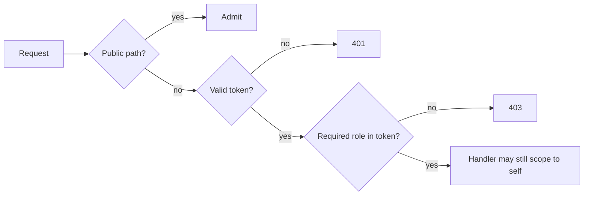
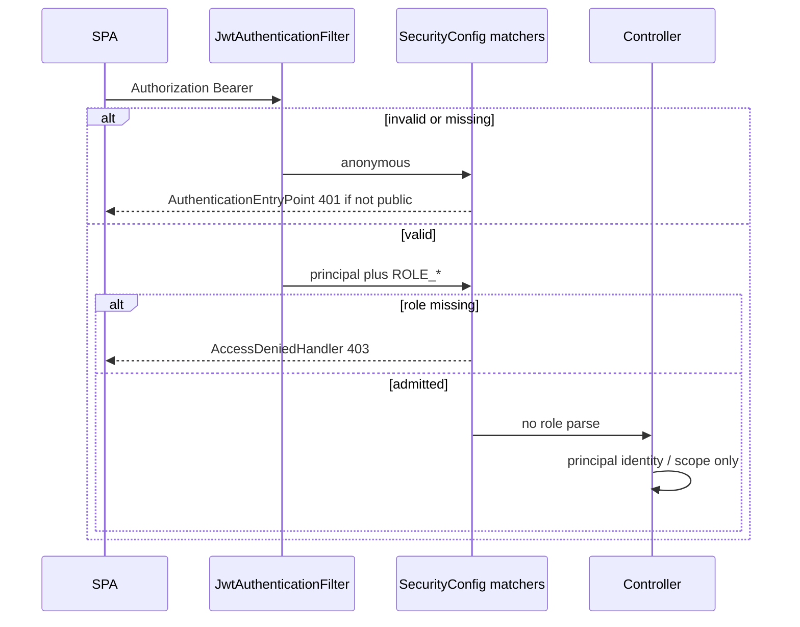

# Spring Security default-deny authorization - Plan

## Goal Capsule

**Objective:** Make the API default-deny: the security layer authenticates the JWT once, grants every role in the token independently, and admits each route only if that route's required role is present. Controllers stop doing role checks. The SPA keeps URL-only dual-role access, sends 401 to login, and shows a dedicated no-access screen on API 403.

**Product authority:** This brainstorm. Supersedes the "leave non-user APIs open / consistent with permit-all" deferral in `docs/plans/2026-08-08-005-feat-user-management-multi-role-routing-plan.md`. Does not supersede dual-role URL-only navigation in `docs/plans/2026-08-08-006-fix-dual-role-student-dashboard-access-plan.md`.

**Open blockers:** None.

**Stop conditions:** Do not add a role hierarchy, dual-role nav switcher, CORS mapping changes, or JWT signing-key work. Do not reshape public URL prefixes to force one role per prefix.

**Execution:** Code. Prove the security table with MockMvc before deleting controller role checks. `ce-work` owns the shipping tail.

**Product Contract preservation:** Unchanged from brainstorm (R/F/AE/KD ids stable).

---

## Product Contract

### Summary

The API refuses anonymous access except for login, password-reset, and the health probe. Local API docs stay open; production does not expose them. Dual-role users keep using both surfaces by URL. A wrong-role page still redirects to the default dashboard; a wrong-role API call shows a dedicated no-access screen.

### Problem Frame

Authorization is split: the security layer admits everyone, and controllers optionally re-check a bearer token. Some handlers still parse the token a second time. Dual-role users already work in the SPA by URL, but a missed controller check is an anonymous hole. The thesis needs a single, auditable access story, not a list of per-handler guards.

### Key Decisions

- KD1. **Keep existing URL prefixes; mixed prefixes get more-specific rules** (session-settled: user-approved — chosen over reshaping lecturer-only lab paths under `/api/lecturer` or annotation-only roles: avoid a frontend URL migration and a second scattered source of truth)
  Governs R4, R5, R6.

- KD2. **No role hierarchy** (session-settled: user-directed — chosen over LECTURER implying STUDENT: each endpoint checks the role it needs)
  Governs R2, R3.

- KD3. **Dual-role student access stays URL-only** (session-settled: user-directed — chosen over adding both-surface nav: preserves plan 006)
  Governs R14.

- KD4. **Split denial UX** (session-settled: user-directed — chosen over unifying on a no-access page or unifying on dashboard redirect: route misses stay familiar; API 403 is explicit)
  Governs R15, R16.

- KD5. **Production hides API docs at the source** (session-settled: user-directed — chosen over permitAll or role-gated Swagger in production: path rules must not be the only hide)
  Governs R8.

- KD6. **JWT signing-key / `JWT_SECRET` is out of scope**
  Current code already derives HS256 from config and fails startup if the secret is missing or too short. Do not add a TODO that claims a random-per-restart key still exists.

- KD7. **Thesis "behavior change" list is honest**
  Most lecturer and student JSON APIs already 401/403 in the controller. This work's user-visible closures are: unauthenticated callers stopped at the security layer even when a controller forgot a check; production API docs removed; API 403 no-access screen. Planning must enumerate every path whose *observable* status for anonymous or wrong-role callers actually changes, not claim analytics/overview were previously anonymous if they already required a lecturer token.

### Actors

- A1. **Student-only user** — JWT roles contain `STUDENT` and not `LECTURER`.
- A2. **Lecturer-only user** — JWT roles contain `LECTURER` and not `STUDENT`.
- A3. **Dual-role user** — JWT roles contain both; post-login still lecturer-first; student pages by URL.
- A4. **Anonymous caller** — no valid bearer token (browser, health checker, local Swagger).

### Requirements

**Security layer**

- R1. Every request that is not on an explicit public path requires a valid session token before a controller runs.
- R2. The token's role claim(s) become the caller's granted roles for that request. `STUDENT` and `LECTURER` may both be present. `TEACHER` continues to count as `LECTURER`.
- R3. A route that needs `STUDENT` admits A1 and A3 and rejects A2. A route that needs `LECTURER` admits A2 and A3 and rejects A1. Neither role implies the other.
- R4. Role rules live in one security table keyed by path (and HTTP method when the same path prefix mixes roles). A handler annotation is allowed only when that table cannot express the rule (mixed prefix or extra ownership beyond role).
- R5. Do not put a redundant role annotation on a handler already fully covered by the path table.
- R6. Controllers must not parse the bearer token or call role-require helpers for authorization. If a handler still needs identity (user id, IRN, "own history"), it reads the already-authenticated principal. Drop authorization-only helpers once unused.
- R7. Public without a token: auth login / Google / forgot-password / reset-password, and `GET /` (liveness / Render health). No broader anonymous fallback.
- R8. In production, OpenAPI / Swagger routes are not registered (disabled in configuration). In local/dev they remain available without a token.

**Access matrix (keep current URL shapes)**

- R9. Lecturer-only: user administration except change-password; lecturer lab/term/analytics/plagiarism/master-data/term-list surfaces; lab statistics, roster, export, attempt history; challenge student-roster reads.
- R10. Student-only: submission upload and the student's own history/lab summaries; student term-access.
- R11. Both roles, same handler behavior or same path with existing payload differences: lab list and student-facing challenge/class/MMD/testcase/stats reads that lecturers already use; `POST` change-password for any authenticated account.
- R12. Lab list may still return a different set of labs for student-only vs lecturer (existing filter). That is scope, not a second role gate.
- R13. Lecturer-only accounts still cannot submit labs. Dual-role accounts with `STUDENT` can. An extra IRN-present check may remain as identity validation, not as a substitute for R10.

**Frontend**

- R14. Audit `RequireRole` and default-dashboard routing for dual-role arrays. Fix only real bugs. Do not add nav items so dual-role users can click into the student surface; URL access stays the contract.
- R15. Wrong-role *route*: redirect to that user's default dashboard (existing).
- R16. Missing/invalid session on an API call: go to login. Authenticated API 403: dedicated no-access screen via one generic handler, not per-page logic.
- R17. The no-access screen must not be a blank page or an unhandled crash.

**Evidence**

- R18. Automated tests cover: anonymous caller on a lecturer-only and a student-only route gets 401 at the security layer; A1 gets 403 on a lecturer-only route; A2 gets 403 on a student-only route; A3 succeeds on one student-only and one lecturer-only route.
- R19. The PR describes every endpoint (or path pattern) whose observable access changed, including production API docs, and states which previously "open" claims were already controller-gated.

### Key Flows

- F1. Dual-role uses both APIs
  - **Trigger:** A3 calls a student-only endpoint and a lecturer-only endpoint with the same token.
  - **Actors:** A3
  - **Outcome:** Both succeed. Covered by R2, R3, R18.

- F2. Student hits lecturer API
  - **Trigger:** A1, signed in, calls a lecturer-only JSON endpoint.
  - **Actors:** A1
  - **Outcome:** 403; SPA shows the no-access screen. Covered by R3, R16, R17.

- F3. Student opens lecturer URL
  - **Trigger:** A1 navigates to a lecturer page.
  - **Actors:** A1
  - **Outcome:** Redirect to student default dashboard; no no-access screen. Covered by R15.

- F4. Anonymous hits a gated API
  - **Trigger:** A4 calls `/api/lecturer/overview` or `/api/submissions/my-history`.
  - **Actors:** A4
  - **Outcome:** 401 before controller role logic. Covered by R1, R18.

- F5. Production docs
  - **Trigger:** A4 requests Swagger / OpenAPI on production.
  - **Actors:** A4
  - **Outcome:** Routes are absent (not merely 401). Covered by R8.

### Acceptance Examples

- AE1. **Covers R3, R18.** Given A3 with roles `[STUDENT, LECTURER]`, when they call student history and lecturer overview, then both return success.
- AE2. **Covers R3, R18.** Given A1, when they call lecturer overview, then the API is 403.
- AE3. **Covers R3, R13, R18.** Given A2, when they call submission upload, then the API is 403.
- AE4. **Covers R1, R18.** Given no token, when they call lecturer overview, then the API is 401.
- AE5. **Covers R14, R15.** Given A3, when they open `/student-dashboard` by URL, then the student UI stays; login still lands on the lecturer dashboard; lecturer nav does not gain a student item.
- AE6. **Covers R16, R17.** Given A1 on a student page, when a fetch returns 403, then they see the no-access screen. When a fetch returns 401, then they go to login.
- AE7. **Covers R8, R19.** Given production, when someone requests Swagger or OpenAPI, then those routes are not served. Local/dev still serves them without a token.

### Success Criteria

- A reviewer can name the single place that turns a bearer token into roles for authorization.
- The thesis access table can be copied from R7–R13 plus the PR's change list without contradicting live behavior.
- Manual dual-role login still reaches both URL surfaces; 403 from an API does not white-screen.

### Scope Boundaries

**In scope:** Default-deny security table, one token-to-principal step, removal of controller role checks, sparse extra rules for mixed prefixes and ownership, production-off API docs, frontend audit of dual-role routing, generic 401/403 handling and no-access screen, tests in R18, honest PR change list in R19.

**Deferred:** In-app role switcher or dual-surface nav; moving lab URLs under a lecturer prefix; CORS; JWT secret rotation or signing-key changes; changing which roles exist or how they are assigned.

**Outside this product's identity:** Implying one role from another; keeping controller `requireRole` "just in case" beside the security table.

### Dependencies / Assumptions

- Dual-role JWT payloads already include both roles (plan 006).
- `GET /` remains unauthenticated so Render health checks keep working.
- CSRF stays disabled (existing); this work does not change CORS.
- A dedicated no-access screen requires a shared API error path the SPA does not have today; planning chooses the smallest hook that still satisfies R16.

### Outstanding Questions

None blocking. Matcher list, springdoc env flag, and `apiFetch` are in the Planning Contract (KTD3, KTD5, KTD7).

### Sources / Research

- Current permit-all: `backend/src/main/java/com/eiu/capstone/backend/config/SecurityConfig.java`
- Controller-side JWT: `backend/src/main/java/com/eiu/capstone/backend/security/JwtAuthHelper.java` and callers listed in `backend/AGENTS.md`
- Signing key already from `jwt.secret`: `backend/src/main/java/com/eiu/capstone/backend/service/JwtService.java`
- Dual-role SPA: `docs/plans/2026-08-08-006-fix-dual-role-student-dashboard-access-plan.md`, `frontend/src/components/auth/RequireRole.jsx`, `frontend/src/utils/authRoutes.js`
- Deferred securing of non-user APIs: `docs/plans/2026-08-08-005-feat-user-management-multi-role-routing-plan.md` Scope Boundaries
- Claim check (2026-08-25): lecturer overview and `GET /api/analytics/student/{studentId}` already `requireLecturer`; they are not anonymous holes today

<!-- ce-section: work-relationships -->
### How This Work Fits Together

This plan owns **central default-deny authorization** (API + SPA 401/403). Broader understanding, not a roadmap:

- Dual-role URL routing (already shipped in plan 006) — **Shares** R14–R15; this plan must not reopen nav.
- JWT signing-key stability (already on `JwtService` / current branch) — **Can proceed independently**; do not mix into this PR.
- User role assignment UI (plan 005) — **Can proceed independently**; this plan does not change how roles are granted.

---

## Planning Contract

### Summary

Add a JWT filter that is the only authorization parser, replace `permitAll` with an ordered matcher table (specific lecturer lab paths before `/api/labs/**`), set `AuthenticationEntryPoint` / `AccessDeniedHandler` so anonymous is 401 and wrong-role is 403, keep `JwtAuthHelper` only for active-user and student-scope identity, disable springdoc via env in production, and add `apiFetch` plus a `/no-access` route. Do not enable method security unless a matcher cannot express a rule.

**Product Contract preservation:** Unchanged.

### Key Technical Decisions

- KTD1. **Filter does not throw** — `JwtAuthenticationFilter` (`OncePerRequestFilter`) calls `JwtService.parseToken` only. Valid token → `SecurityContext` with `JwtUserPrincipal` (email, irn, role names) and `ROLE_STUDENT` / `ROLE_LECTURER` (map `TEACHER` → `LECTURER`; both may be present). Missing/invalid token → empty context (do not throw). Register before `UsernamePasswordAuthenticationFilter`. Session policy `STATELESS`. Mapping that empty context to 401 vs a wrong-role principal to 403 is KTD10, not the filter. Governs R1, R2, R6.

- KTD2. **CORS stays in `CorsConfig`; Security must not swallow it** — call `.cors(Customizer.withDefaults())` on the filter chain. `OPTIONS /**` is `permitAll`. Do not edit allowed origins or methods in `CorsConfig`. Stop condition still holds.

- KTD3. **Path table, more specific first; no `@PreAuthorize` unless a matcher fails** — do not enable method security in v1. Ordered matchers (Ant-style `*` for UUIDs):

  | Order | Matcher | Rule |
  |---|---|---|
  | 1 | `OPTIONS /**` | `permitAll` |
  | 2 | `GET /`, `/api/auth/**` | `permitAll` |
  | 3 | `/swagger-ui/**`, `/v3/api-docs/**` | `permitAll` (local only; prod unregisters these via KTD5) |
  | 4 | `POST /api/users/change-password` | `hasAnyRole("STUDENT","LECTURER")` |
  | 5 | `/api/users/**` | `hasRole("LECTURER")` |
  | 6 | `/api/lecturer/**` | `hasRole("LECTURER")` |
  | 7 | `/api/analytics/**`, `/api/master-data/**`, `/api/terms/**` | `hasRole("LECTURER")` |
  | 8 | `GET /api/labs/*/statistics`, `GET /api/labs/*/submissions`, `GET /api/labs/*/submissions/export`, `GET /api/labs/*/students/*/attempts` | `hasRole("LECTURER")` |
  | 9 | `GET /api/labs/*/challenges/*/students` | `hasRole("LECTURER")` |
  | 10 | `/api/labs/**` | `hasAnyRole("STUDENT","LECTURER")` |
  | 11 | `/api/submissions/**`, `/api/students/**` | `hasRole("STUDENT")` |
  | 12 | any other request | `authenticated()` |

  Governs R4, R5, R7, R9–R11.

- KTD10. **Wire `AuthenticationEntryPoint` and `AccessDeniedHandler` on the filter chain** — a stateless JWT API with no `formLogin()` / `httpBasic()` often maps both anonymous denial and insufficient-authority denial to 403 unless these are set. Configure `exceptionHandling`: anonymous or invalid/missing token on a protected matcher → **401** (`AuthenticationEntryPoint`, e.g. `HttpStatusEntryPoint(UNAUTHORIZED)`). Authenticated caller missing the required role → **403** (`AccessDeniedHandler`). Do not rely on Spring defaults. This is what makes AE4 (no token → 401) distinct from AE2 (student token on lecturer route → 403). Governs R1, R3, R18.

- KTD4. **Identity helper stays; authorization methods go** — keep `requireActiveUser`, `resolveStudentScope`, `isStudentOnly`, `hasRole` on `JwtAuthHelper`. Delete `requireRole`, `requireLecturer`, `requireStudent`, and all controller Bearer parsing. Overload scope/active-user to take `JwtUserPrincipal` (or `Authentication`) so controllers never see `Authorization`. Keep the IRN-blank 403 on submit as identity, not a role check. Governs R6, R12, R13.

- KTD5. **Springdoc off in production via env, default on locally** — `springdoc.api-docs.enabled` and `springdoc.swagger-ui.enabled` bound to `${SPRINGDOC_ENABLED:true}`. Document `SPRINGDOC_ENABLED=false` in `backend/.env.backend.example` and `backend/DEPLOY_RENDER.md`. No new Spring profile required. Governs R8.

- KTD6. **Do not touch `JwtService` signing** — already HS256 from `jwt.secret`. No TODO about a random-per-restart key. Governs KD6.

- KTD7. **`apiFetch` is the generic 401/403 handler** — wrap `fetch` in `frontend/src/utils/apiFetch.js` (or next to `authHeaders.js`). Signed-in API calls use it. 401 (except login/google/setup/forgot/reset/change-password) → existing `clearSessionAndRedirectToLogin`. 403 on those same gated calls → `navigate`/`assign` to `/no-access` (do not clear session). Auth pages keep raw `fetch` + `readFriendlyApiError`. Replace authenticated `fetch(\`${API_BASE}` sites (dashboards, history, DropZone, User/Term/Solution/Reports, ChangePasswordModal). Governs R16, R17.

- KTD8. **Tests: MockMvc + `spring-security-test`; slice, not full Boot+DB** — add `spring-security-test` (not pulled in by `spring-boot-starter-test` here). `@WebMvcTest` of a small set of controllers (`AuthController`, `LecturerAnalyticsController`, `SubmissionController`) with `@Import` of `SecurityConfig` + filter + `JwtService` test secret, services `@MockBean`. Cover R18. Retarget `JwtAuthHelperTest` to remaining identity methods; drop tests for deleted `requireRole`/`requireLecturer`. Governs R18.

- KTD9. **Thesis change list lives in the PR and in Verification Contract below** — do not claim overview/analytics were anonymous; they already used `requireLecturer`. Governs R19.

### Assumptions

- Dual-role tokens already include both roles (plan 006).
- Inactive accounts: valid JWT still authenticates at the filter; `requireActiveUser` remains 403. Unchanged vs today for those handlers that already called it.
- Frontend has no test runner; dual-role nav audit is manual (R14).

### Risks & Dependencies

| Risk | Mitigation |
|---|---|
| Default-deny without `.cors()` breaks the SPA | KTD2 |
| Matcher order: `/api/labs/**` before statistics paths would admit students to roster | List specific lecturer lab paths first (KTD3 rows 8–9) |
| `apiFetch` miss on one page leaves a 403 as a blank/error | Grep remaining `fetch(\`${API_BASE}` after U5; auth pages excluded by design |
| `authenticated()` fallback admits a forgotten new controller to any role | Code review + test a nonsense path still 401 anonymous; document in `backend/AGENTS.md` that new routes need a matcher |
| Render forgets `SPRINGDOC_ENABLED=false` | Example env + deploy doc; default true only for local |
| Stateless JWT without `exceptionHandling` collapses anonymous 401 into 403 | KTD10; U2 asserts 401 vs 403 as separate cases |

### High-Level Technical Design

### Sequencing

U1 (filter + matcher table) → U2 (MockMvc R18) → U3 (strip controller auth) → U4 (springdoc env) and U5 (SPA) in parallel after U2 → U6 (DOX + PR notes). U4 does not depend on U3.

### Implementation constraints

- No role hierarchy (`RoleHierarchy`).
- No second Bearer parse for authorization.
- No JWT secret / `JwtService` signing edits.
- No `CorsConfig` origin/method edits.

---

## Implementation Units

### U1. JWT filter and default-deny matcher table

**Goal:** Security layer authenticates once, enforces KTD3, and returns 401 vs 403 per KTD10.

**Requirements:** R1–R5, R7, R9–R11 (401/403 split: R1, R3, KTD10)

**Dependencies:** None

**Files:**
- `backend/src/main/java/com/eiu/capstone/backend/security/JwtAuthenticationFilter.java` (new)
- `backend/src/main/java/com/eiu/capstone/backend/security/JwtUserPrincipal.java` (new)
- `backend/src/main/java/com/eiu/capstone/backend/config/SecurityConfig.java`

**Approach:**
1. Principal: email, irn, immutable role name list.
2. Filter: strip `Bearer `; `parseToken`; map roles to `SimpleGrantedAuthority("ROLE_" + name)`; set `UsernamePasswordAuthenticationToken`. Catch `JwtException` and continue unauthenticated.
3. `SecurityConfig`: inject filter; CSRF off (existing); `cors(Customizer.withDefaults())`; `STATELESS`; matcher table KTD3; `anyRequest().authenticated()`.
4. `exceptionHandling` per KTD10: `authenticationEntryPoint` → 401; `accessDeniedHandler` → 403. Required for U2; not optional polish.
5. Do not enable `@EnableMethodSecurity` unless U2 proves a matcher cannot express a rule (then stop and record a plan amendment).

**Patterns to follow:** existing `JwtService.parseToken`; `JwtAuthHelper.normalizeRoleName` mapping for `TEACHER`.

**Test scenarios:** owned by U2.

**Verification:** U2 green; anonymous `GET /` still 200.

---

### U2. Authorization MockMvc tests (R18)

**Goal:** Automated proof of 401/403/dual-role before deleting controller guards.

**Requirements:** R18, AE1–AE4

**Dependencies:** U1

**Files:**
- `backend/pom.xml` (`spring-security-test` test scope)
- `backend/src/test/java/com/eiu/capstone/backend/security/SecurityAuthorizationTest.java` (new)
- `backend/src/test/resources/application.yml` or `@TestPropertySource` with a ≥32-byte `jwt.secret` if the slice loads `JwtService`

**Approach:**
1. `@WebMvcTest` the three controllers in KTD8; `@Import` `SecurityConfig`, filter, `JwtService`; `@MockBean` collaborator services so handlers short-circuit after security.
2. Mint tokens via `JwtService.createToken` (email, name, domain, roles, irn) for student-only, lecturer-only, dual-role.
3. Scenarios below. Use `GET /api/lecturer/overview` and `GET /api/submissions/my-history` as the dual-role pair.

**Test scenarios:**
- No `Authorization` on overview → **401** (not 403). Proves KTD10 entry point.
- No `Authorization` on `my-history` → **401** (not 403).
- Student-only token on overview → **403** (not 401). Proves KTD10 access-denied handler vs AE4.
- Lecturer-only token on `POST /api/submissions/{labId}/1/upload` (multipart optional; 403 before body parse is enough) → 403.
- Dual-role token on overview → not 401/403 (200 or mocked 200).
- Dual-role token on `my-history` → not 401/403.
- No token on `POST /api/auth/login` → not 401 from security (controller may 400/401 on body).
- No token on `GET /` → 200.
- Student-only token on `GET /api/labs` → not 403 (hasAnyRole).
- Student-only token on `GET /api/labs/{uuid}/statistics` → 403 (matcher order).

**Verification:** `mvn -q -Dtest=SecurityAuthorizationTest test` from `backend/`.

---

### U3. Remove controller role checks; identity from principal

**Goal:** Controllers do not parse Bearer or call `requireRole` / `requireLecturer`.

**Requirements:** R6, R12, R13

**Dependencies:** U2

**Files:**
- `backend/src/main/java/com/eiu/capstone/backend/security/JwtAuthHelper.java`
- `backend/src/test/java/com/eiu/capstone/backend/security/JwtAuthHelperTest.java`
- All controllers that currently inject `JwtAuthHelper` or parse JWT: `UserController`, `SubmissionController`, `StudentAccessController`, `LabController`, `ChallengeController`, `LecturerRubricController`, `LecturerTermController`, `LecturerAnalyticsController`, `AnalyticsController`, `MasterDataController`, `TermController`

**Approach:**
1. Delete `requireRole`, `requireLecturer`, `requireStudent`.
2. Add `requireActiveUser(JwtUserPrincipal)` and `resolveStudentScope(JwtUserPrincipal, UUID)` (keep claims overloads only if tests need them internally; prefer one path).
3. Controllers: `@AuthenticationPrincipal JwtUserPrincipal` or `SecurityContextHolder`. Drop `Authorization` headers used only for role checks. `change-password` uses principal email, not `jwtService.parseToken`.
4. `resolveStudentUser`: active user + non-blank IRN on principal; do not call `requireRole`.
5. `labsVisibleToCaller`: principal + `isStudentOnly` from principal roles; 401 if principal missing (should not happen if matcher ran).
6. Rewrite `JwtAuthHelperTest` for remaining methods only.

**Test scenarios:**
- U2 still green after helper deletion.
- Existing `JwtAuthHelperTest` cases for `isStudentOnly` / `resolveStudentScope` still pass (adapt signatures).
- Lecturer-only submit still 403 (filter) even without IRN message; dual-role with IRN still reaches the handler.

**Verification:** `mvn -q -Dtest=SecurityAuthorizationTest,JwtAuthHelperTest test`

---

### U4. Disable springdoc in production

**Goal:** Production does not register OpenAPI/Swagger routes.

**Requirements:** R8, AE7

**Dependencies:** None (can parallel U3 after U1)

**Files:**
- `backend/src/main/resources/application.yml`
- `backend/.env.backend.example`
- `backend/DEPLOY_RENDER.md`
- `backend/AGENTS.md` (Swagger row)

**Approach:**
1. `springdoc.api-docs.enabled` / `swagger-ui.enabled` = `${SPRINGDOC_ENABLED:true}`.
2. Example and Render list: `SPRINGDOC_ENABLED=false` for production.
3. Matcher row 3 remains for local.

**Test scenarios:**
- Local default: `/swagger-ui/index.html` still loads without a token.
- With `SPRINGDOC_ENABLED=false` in a unit or documented manual check: those paths are 404, not 401.

**Verification:** Manual local Swagger; document Render env. Optional `@SpringBootTest` with property false is nice-to-have, not required.

---

### U5. SPA `apiFetch`, `/no-access`, dual-role audit

**Goal:** API 403 shows a dedicated screen; 401 still login; dual-role URL access unchanged.

**Requirements:** R14–R17, AE5, AE6

**Dependencies:** None for the page itself; end-to-end 403 needs U1

**Files:**
- `frontend/src/utils/apiFetch.js` (new)
- `frontend/src/utils/apiError.js` (401/403 split: 403 must not be treated as session-expired on gated calls)
- `frontend/src/pages/NoAccessPage.jsx` (new) — short “no access” copy using semantic Tailwind tokens
- `frontend/src/App.jsx` — route `/no-access` for any signed-in user (not `RequireRole` lecturer/student)
- Authenticated callers listed in KTD7
- `frontend/src/components/auth/RequireRole.jsx`, `frontend/src/utils/authRoutes.js` (audit only)
- `frontend/AGENTS.md` — shared `apiFetch` + 401/403 contract
- `frontend/src/pages/AGENTS.md` if nav/routing contract is documented there

**Approach:**
1. Audit: `hasAnyRole` + `RequireRole` already allow dual-role URL access; `defaultDashboardPath` is lecturer-first. Change only if a bug is found. Do not add student items to lecturer nav.
2. `apiFetch`: after `fetch`, if status 401 → `clearSessionAndRedirectToLogin`; if 403 → `window.location.assign` or react-router to `ROUTES.noAccess` (`/no-access`). Return the response for callers that still read body on success.
3. Stop treating 403 as session-expired in `readFriendlyApiError` for gated contexts (login 403 inactive stays on the login form).
4. Replace authenticated `fetch(API_BASE…)` with `apiFetch`. Leave Login/Forgot/Reset/FirstTimeSetup on raw fetch.
5. `NoAccessPage`: message + control back to `defaultDashboardPath(user.roles)`.

**Test scenarios (manual):**
- Dual-role: login → lecturer dashboard; paste `/student-dashboard` → student UI stays; lecturer routes still work; no new nav item.
- Student-only: `/lecturer-dashboard` → redirect to student default (not `/no-access`).
- Student-only: force a lecturer API URL in DevTools → `/no-access`, session remains.
- Expired token on a dashboard fetch → login.

**Verification:** `npm run build` from `frontend/`; manual matrix above.

---

### U6. DOX and honest behavior-change notes

**Goal:** Contracts and PR text match live access.

**Requirements:** R19

**Dependencies:** U3, U4, U5

**Files:**
- `backend/AGENTS.md` (security posture table)
- `frontend/AGENTS.md` (auth/API paragraphs)
- Root `AGENTS.md` only if the Child DOX Index blurb about unauthenticated endpoints is stale
- PR body (not a repo file): copy the change list from Verification Contract

**Approach:** Replace “SecurityConfig permits all / JwtAuthHelper on some routes” with default-deny + filter + matcher table + identity-only helper. State swagger env.

**Test scenarios:** None.

**Verification:** DOX pass on touched trees; PR includes the change list.

---

## Verification Contract

**Backend:** from `backend/`, `mvn -q -Dtest=SecurityAuthorizationTest,JwtAuthHelperTest test`. Full `mvn test` before PR if time allows.

**Frontend:** `npm run build` from `frontend/`. Manual AE5/AE6.

**PR behavior-change list (R19) — draft; implementer confirms after U3:**

| Surface | Before (today) | After this work |
|---|---|---|
| `SecurityConfig` | `anyRequest().permitAll()` | default-deny; public only KTD3 rows 1–3 |
| Forgotten controller with no `JwtAuthHelper` | anonymous 200 | 401 |
| `GET /api/lecturer/overview` and `/api/analytics/**` | already `requireLecturer` (401/403 in controller) | same outcomes at the filter; not a newly closed hole |
| Lecturer-only lab roster/statistics under `/api/labs/...` | `requireLecturer` in controller | `hasRole(LECTURER)` in the matcher table |
| `POST /api/users/change-password` | any valid JWT parsed in controller | `hasAnyRole` + principal email |
| Student submit | `requireRole(STUDENT)` + IRN | matcher `STUDENT` + IRN identity check |
| Production Swagger/OpenAPI | reachable (permitAll) | unregistered when `SPRINGDOC_ENABLED=false` |
| SPA API 403 | ad hoc / often “session expired” | `/no-access` via `apiFetch` |
| SPA wrong-role URL | redirect to default dashboard | unchanged |

---

## Definition of Done

**Global:**
- R18 tests pass; dual-role can hit one student-only and one lecturer-only route.
- No controller still calls `requireLecturer` / `requireRole` or `jwtService.parseToken` for authz.
- `grep requireLecturer` / `parseBearerToken` in `controller/` is empty (identity APIs on helper OK).
- CORS still works from the Vite origin (preflight OPTIONS).
- `JwtService` signing code unchanged.
- Abandoned experiments removed from the diff.
- DOX updated (U6). PR contains the confirmed change table.

**Per unit:** U1 matchers match KTD3 and exception handlers match KTD10; U2 scenarios green (401 vs 403 not collapsed); U3 helpers authorization-free; U4 env documented; U5 `/no-access` + `apiFetch` on gated callers; U6 docs match code.
