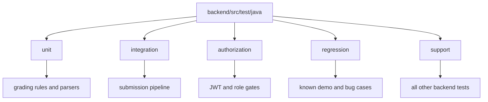
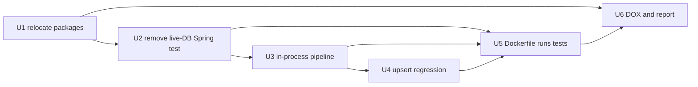
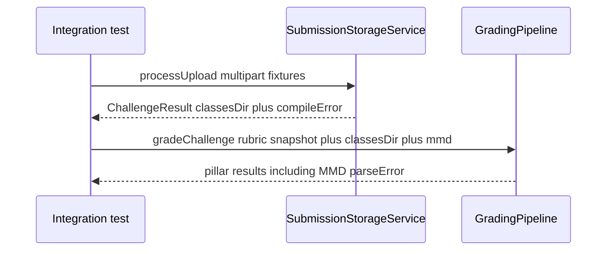

# Backend test aspect layout - Plan

## Goal Capsule

**Objective:** Give the backend five committee-visible test homes (unit, integration, authorization, regression, support), move every existing test into one of them, and make `mvn test` fail on happy-path and known-fail cases for grading rules/parser, the submission pipeline, and authorization.

**Product authority:** This brainstorm. Complements, does not replace, default-deny behavior in `docs/plans/2026-08-25-001-feat-spring-security-default-deny-plan.md`.

**Open blockers:** None.

**Stop conditions:** Do not add frontend tests. Do not require exhaustive rule or role×endpoint matrices. Do not keep a parallel package-mirroring test tree beside the five homes. Do not add GitHub Actions. Do not introduce Testcontainers or a live Postgres requirement for image builds.

**Execution:** Code. Relocate and drop live-DB Spring tests before enabling Docker `mvn test`. `ce-work` owns the shipping tail.

**Product Contract preservation:** Unchanged.

---

## Product Contract

### Summary

Backend tests live under five named roots so a reviewer can tick the committee comment by opening folders, and so a broken grade, upload, or auth known-fail case fails the backend test command before a live demo.

### Problem Frame

A committee comment asked for unit tests on grading rules/parser, integration tests on the submission pipeline, authorization tests, and regression tests. Failures today surface in a live demo or a student/lecturer report. The backend already has a partial `mvn test` suite that mirrors production packages; Docker packaging skips tests. There is no tracked `backend/src/test/resources` tree and no upload-through-grade integration test. Authorization coverage exists (`SecurityAuthorizationTest`) and loads probe controllers plus production `RootController`, not probes alone.

### Key Decisions

- **Aspect-root folders.** Five named homes are the audit surface. (session-settled: user-directed — chosen over Maven unit/IT layers and keep-in-place tags: a reviewer must see the four named aspects without a catalog). Governs R1, R2, R3.
- **Move every existing test.** Nothing stays in the current package-mirroring layout. (session-settled: user-directed — chosen over leaving current tests in place: one home per test). Governs R4, R5.
- **Catch-all fifth home.** Tests that are not grading-unit, pipeline-integration, authorization, or regression go to `support`. (session-settled: user-directed — chosen over leaving orphans or force-fitting them into the four). Governs R5.
- **Done bar is happy path plus known fails.** Not every branch or every role×endpoint cell. (session-settled: user-directed — chosen over exhaustive matrices and layout-only with no new tests). Governs R6, R7, R8, R9.
- **Backend only.** Frontend tests stay out. (session-settled: user-directed — chosen over both stacks or naming empty frontend folders now). Governs R15.
- **Ship build runs tests.** The Docker/image package step runs the same suite as `mvn test`; skipping tests at image build is not allowed. (session-settled: user-directed — chosen over leaving `-DskipTests` and over CI-only while Docker still skips: untested jars must not ship). Governs R10, R11.

### Layout



The five directory names under `backend/src/test/java/` are the committee-facing contract. Java packages may nest under each root; they must not reintroduce a sibling tree that bypasses the five names.

### Requirements

**Homes**

- R1. `backend/src/test/java/` exposes exactly these five first-level test homes: `unit`, `integration`, `authorization`, `regression`, `support`.
- R2. `unit` owns grading rules and parsers (MMD parse, reflection parse, scoring, pillar/testcase graders that do not run the full upload).
- R3. `integration` owns the submission pipeline: upload folder through compile through grade, including known compile and MMD parse failures that still complete as a graded attempt where product behavior already does that.
- R4. `authorization` owns JWT and role-gate tests. Existing `SecurityAuthorizationTest` (probe controllers plus production `RootController`) moves here rather than being rewritten solely to drop `RootController`.
- R5. `regression` owns named past demo or production-bug cases. `support` owns every other existing backend test (terms, password reset, plagiarism, CORS, stats helpers, and similar).

**Coverage bar**

- R6. Each of `unit`, `integration`, and `authorization` includes at least one happy path and the known fail cases for that aspect.
- R7. Known fails in scope include: unreadable or fatal MMD, challenge compile failure, anonymous caller on a protected route, wrong-role caller on a protected route, and any demo-breaking bug the team already knows by name when this work lands.
- R8. `regression` holds those named demo/bug cases that would otherwise be buried inside unit or integration; a case may live in `regression` only, not duplicated in two homes.
- R9. Absence of a fixture or a missing exhaustive matrix is not a failure of this work. Filling every rubric branch or every API route is out.

**Gate**

- R10. `mvn test` from `backend/` runs tests from all five homes and fails the command when any of those tests fail.
- R11. The Docker/image build that packages the backend runs that same suite and fails the image build when any test fails.
- R12. A known-fail case fails as an assertion inside a test, not as an uncaught setup crash that hides which home broke.

**Fixtures and relocation**

- R13. Pipeline and regression cases that need files use `backend/src/test/resources/` trees named to match the home (`integration`, `regression`).
- R14. Every existing `*Test.java` under the current package-mirroring tree is moved into one of the five homes. Non-test helpers (for example `SecurityAuthorizationProbes`) move with the tests that use them.

**Boundary**

- R15. This work does not add frontend automated tests.

### Actors

- A1. Backend developer adding or relocating tests.
- A2. Committee or advisor auditing the repo for the four named aspects.
- A3. Whoever runs `mvn test` or the backend image build.

### Key Flows

- F1. Committee audit
  - **Trigger:** A2 opens backend tests to tick the comment.
  - **Actors:** A2
  - **Steps:** Open `backend/src/test/java/`; see the five names; open `unit`, `integration`, `authorization`, and `regression` without searching production packages.
  - **Outcome:** The four requested aspects are visible as folders. `support` is present and not mistaken for one of the four.
  - **Covered by:** R1, R2, R3, R4, R5

- F2. Known-fail gate
  - **Trigger:** A3 runs `mvn test` with a pipeline or auth known-fail fixture in the tree.
  - **Actors:** A3
  - **Steps:** The matching home's test runs; the assertion fails or passes according to current product behavior; the Maven command exit status reflects that result.
  - **Outcome:** A demo-class break is visible as a failed test in the owning home.
  - **Covered by:** R6, R7, R10, R11, R12

- F3. Relocate an existing test
  - **Trigger:** A1 places a current test into the new layout.
  - **Actors:** A1
  - **Steps:** Choose the home per R2–R5; move the class and any helper; `mvn test` still runs it.
  - **Outcome:** No test remains only under the old production-mirroring path.
  - **Covered by:** R4, R5, R14, R10

### Acceptance Examples

- AE1. Committee can name the four aspects from folders
  - **Covers R1, R2, R3, R4.**
  - **Given:** Tests have been relocated.
  - **When:** A2 lists first-level directories under `backend/src/test/java/`.
  - **Then:** They see `unit`, `integration`, `authorization`, `regression`, and `support`, and can open grading parser tests under `unit` without opening `support`.

- AE2. Orphan tests land in support
  - **Covers R5, R14.**
  - **Given:** `TermServiceImportTest` and `PlagiarismComparatorTest` exist today under service/plagiarism packages.
  - **When:** Relocation finishes.
  - **Then:** Those classes live under `support`, not force-fitted into `unit` or `integration`.

- AE3. Pipeline known-fail is a test, not a crash
  - **Covers R3, R7, R12.**
  - **Given:** A fixture whose Java does not compile for one challenge.
  - **When:** The integration test runs that fixture.
  - **Then:** The test asserts the product's compile-failure behavior and finishes; Maven reports that test, not an unnamed surefire crash.

- AE4. Authorization known-fails
  - **Covers R4, R7.**
  - **Given:** The authorization home is populated.
  - **When:** An anonymous request hits a protected route, and a wrong-role token hits a route for the other role.
  - **Then:** Both cases are asserted (unauthenticated vs forbidden per current product rules).

- AE5. Duplicate homes are forbidden
  - **Covers R8, R9.**
  - **Given:** A named demo bug is recorded.
  - **When:** It is placed in `regression`.
  - **Then:** The same case is not also kept as a second copy under `unit` or `integration`.

### Success Criteria

- A2 can tick the committee comment by pointing at four labeled homes plus `support`.
- A3 running `mvn test` from `backend/` is a gate for happy path and known fails in unit, integration, and authorization. The image build fails the same way (R11).
- No `*Test.java` remains outside the five homes.

### Scope Boundaries

**Deferred for later**

- Frontend automated tests.
- Exhaustive parser-rule matrices beyond known fails (existing MMD reference-doc tests that already exist move into `unit` and count; new exhaustive coverage is not required).
- GitHub Actions (or other host CI) wiring beyond the Docker/image build (Q4).

**Outside this work**

- Load/performance tests.
- Replacing default-deny product behavior (owned by `docs/plans/2026-08-25-001-feat-spring-security-default-deny-plan.md`).
- A Maven Failsafe `src/it` split as the committee-facing layout.

### Dependencies / Assumptions

- Assumption: Default `mvn test` (Spring Boot parent Surefire) picks up `*Test.java` in the five homes without a new test framework.
- Assumption: Known demo-bug names for R7 that are not already listed will be supplied by the team at implementation time; if none beyond compile/MMD/auth exist, R7 is satisfied by those three.
- Verified: `backend/pom.xml` has `spring-boot-starter-test` and `spring-security-test`, no explicit Surefire/Failsafe config.
- Verified: `backend/Dockerfile` uses `-DskipTests`.
- Verified: only `@SpringBootTest` in tree is `TestcaseRubricServiceIntegrationTest` (rubric save, not upload-to-grade).
- Verified: `docs/PROGRAM_REPORT.md` still states no full CI test suite yet.

### Outstanding Questions

Q2–Q4 from brainstorm are resolved in KTD1–KTD4. No remaining product blockers.

### Sources / Research

- Partial suite and Docker skip: `AGENTS.md`, `backend/AGENTS.md`, `docs/PROGRAM_REPORT.md`.
- Grading unit tests already present under `backend/src/test/java/com/eiu/capstone/backend/grading/` (parser, MMD, pipeline graders, scoring).
- Compile-path units: `backend/src/test/java/com/eiu/capstone/backend/service/SubmissionStorageServiceTest.java`.
- Authorization: `backend/src/test/java/com/eiu/capstone/backend/security/SecurityAuthorizationTest.java` and `SecurityAuthorizationProbes.java`.
- Re-upload upsert: `docs/solutions/database-issues/submission-result-reupload-duplicate-key.md`.
- Compile isolation: `docs/solutions/architecture-patterns/in-memory-challenge-compile-path.md`.
- Plan noting no compile-path integration suite: `docs/plans/2026-08-09-001-perf-submission-compile-path-plan.md`.

---

## Planning Contract

Relocate every `*Test.java` into five aspect-root packages, prove upload-compile-grade in-process without Postgres, keep one named regression on result upsert, then run that same suite in the Docker image build.

### Key Technical Decisions

- KTD1. **Package prefix equals the home name.** Tests live at `backend/src/test/java/<home>/com/eiu/capstone/backend/...` with `package <home>.com.eiu.capstone.backend...`. Do not use `com.eiu.capstone.backend.<home>` — that would hide the five first-level folders (R1). Surefire still matches `*Test.java`. Resolves Q2.

- KTD2. **Pipeline integration is in-process.** Call `SubmissionStorageService.processUpload` then `GradingPipeline.gradeChallenge` (or the existing graders) with a constructed `LabRubricSnapshot` and `@TempDir`. Do not start `@SpringBootTest`, HTTP upload, Testcontainers, or Neon. Persist via a no-op or mock `GradingResultStore` if `GradingService` is used; prefer the pipeline/grader seam so repositories stay out. (session-settled: user-approved — chosen over live Postgres and Testcontainers: image builds have no DB and no Docker socket). Resolves Q3. Governs R3, R11, AE3.

- KTD3. **No live Postgres in the suite.** Rewrite or delete `TestcaseRubricServiceIntegrationTest`; keep unique assertions on the existing mocked `TestcaseRubricServiceTest` in `support`. Docker `COPY` does not include `backend/.env`. Governs R11.

- KTD4. **No GitHub Actions in this work.** Image build is the ship gate (R11). Resolves Q4.

- KTD5. **One regression case: re-upload upsert.** Cover `docs/solutions/database-issues/submission-result-reupload-duplicate-key.md`: a second `GradingResultStore.save` of the same submission element ids must call repository `saveAll` without a delete-all. Make `GradingResultStore` public with no behavior change so the test package can construct it with mocked repositories. Do not duplicate that case in `integration`. Governs R5, R8, AE5.

- KTD6. **Classification of existing tests.** `unit` = current `grading/` tests except none of those are full upload. `authorization` = `SecurityAuthorizationTest`, `SecurityAuthorizationProbes`, `JwtAuthHelperTest`, `JwtServiceTest`. `support` = remaining current tests, including `SubmissionStorageServiceTest` and `JavaCompilerServiceTest` (compile without grade). `integration` and `regression` start empty except new files from U3 and U4.

- KTD7. **Docker runs `mvn -B test package` (or `verify`) without `-DskipTests`.** Build image already has JDK 17 for `javax.tools`. Do not add datasource env vars. After KTD3, no test should require `SPRING_DATASOURCE_URL`. Governs R10, R11.

- KTD8. **Publicize production members that relocated tests already call.** Aspect-root packages (`unit.com.eiu...`, `support.com.eiu...`, and the rest) are not the same Java package as production (`com.eiu.capstone.backend...`), so package-private constructors and methods become compile errors. Widen those members to `public` with no behavior change. Do not move tests back under `com.eiu` to keep package-private access (that would hide the five first-level folders and violate KTD1). After the move, run `mvn test` and keep widening until `testCompile` is green. Starting inventory (not exhaustive; MMD tokenizer/AST types used only from `unit` tests are likely additional hits): `MmdParser.parse(String)`; `GradingResultStore` constructor and `save`; `SubmissionStorageService.isValidSubmissionPath`; `JavaCompilerService.initCompiler`; `PlagiarismComparator.gitHistoriesMatch`, `metadataMatches`, `hashJaccard`; `GitHistoryReader.parseReflog`; `StudentHistoryService.deriveStatus`, `computeStats`, `resolveHistorySort`; `PasswordResetService.generateRawToken`, `hashToken`; `MemorySourceJavaFileObject.toSourceUri`; `GradingService.GradingComputationResult` and the lists `save` reads if the regression test constructs them. Governs R10, R14.

### Assumptions

- Spring Boot parent Surefire includes all five trees under `src/test/java`.
- Render/Docker-in-Docker is unavailable; Testcontainers is not a fallback.
- If no extra named demo bugs exist beyond compile/MMD/auth plus KTD5, R7 is satisfied.

### Risks & Dependencies

| Risk | Mitigation |
|---|---|
| Dropping `-DskipTests` while `@SpringBootTest` remains fails image build | U2 before U5 |
| Relocated tests cannot see package-private production APIs | KTD8: publicize called members only; compile-loop; do not drop KTD1 |
| Package moves break DOX verification lists | U6 repoints `AGENTS.md` paths |
| Maven image lacks JDK compiler | Confirm `maven:3.9.4-eclipse-temurin-17` still has `javac` (it does) |
| Image build time grows | Acceptable; suite is mostly unit tests |

### High-Level Technical Design



Integration seam (directional, not a new API):



### Sequencing

U1 → U2 → U3 and U4 (U4 may start after U1) → U5 → U6. U5 must not land while any test still needs Postgres.

### Implementation constraints

- Do not add Testcontainers or H2.
- Do not add `.github/workflows`.
- Do not keep `backend/src/test/java/com/eiu/...` as a sibling of the five homes.
- Do not restore production-mirroring test packages to avoid KTD8.
- Do not copy production `backend/.env` into the Docker build context for tests.

### Output Structure

```text
backend/src/test/java/
  unit/com/eiu/capstone/backend/grading/...
  integration/com/eiu/capstone/backend/...
  authorization/com/eiu/capstone/backend/security/...
  regression/com/eiu/capstone/backend/grading/...
  support/com/eiu/capstone/backend/...
backend/src/test/resources/
  integration/
  regression/
```

Implementer may nest packages under `com/eiu/capstone/backend` inside each home. The five names remain first-level under `src/test/java`.

---

## Implementation Units

### U1. Relocate tests into five aspect-root packages

**Goal:** Committee-visible first-level homes; every existing test compiles and still runs under `mvn test`.

**Requirements:** R1, R2, R4, R5, R14, F1, F3, AE1, AE2. KTD1, KTD6.

**Dependencies:** None

**Files:**
- All current `backend/src/test/java/com/eiu/capstone/backend/**/*Test.java` (move)
- `backend/src/test/java/com/eiu/capstone/backend/security/SecurityAuthorizationProbes.java` (move with authorization tests)
- Production types whose package-private members those tests already call (visibility only, KTD8)
- Delete emptied `backend/src/test/java/com/eiu/capstone/backend/` tree after the move

**Approach:**
1. Move grading tests listed in KTD6 into `unit/`.
2. Move authorization set into `authorization/`.
3. Move everything else into `support/`.
4. Rewrite `package` to `<home>.com.eiu.capstone.backend...`. Keep `import com.eiu.capstone.backend...` for production types.
5. Apply KTD8 until `testCompile` succeeds.
6. Leave `integration/` and `regression/` empty until U3/U4.

**Patterns to follow:** existing test names (`*Test.java`); `@WebMvcTest` FQCN imports of production controllers (unchanged production packages).

**Test scenarios:**
- Covers AE1. After move, first-level directories under `backend/src/test/java/` are exactly `unit`, `integration`, `authorization`, `regression`, `support` (empty dirs may exist for integration/regression).
- Covers AE2. `TermServiceImportTest` and `PlagiarismComparatorTest` live under `support/`.
- `mvn test` from `backend/` still executes the relocated classes (same assertion counts as before this unit, ignoring U2–U4 additions).

**Verification:** No `*Test.java` remains under `backend/src/test/java/com/eiu/`. `mvn test` green.

---

### U2. Remove live-Postgres Spring Boot test

**Goal:** The suite is self-contained so Docker can run it (KTD3).

**Requirements:** R11. KTD3.

**Dependencies:** U1

**Files:**
- `backend/src/test/java/support/com/eiu/capstone/backend/service/TestcaseRubricServiceIntegrationTest.java` (after U1 path) — delete or replace
- `backend/src/test/java/support/com/eiu/capstone/backend/service/TestcaseRubricServiceTest.java` — add any unique assertions from the integration class (client id preserved, multi-field assertions persisted in the service response)

**Approach:**
1. Port assertions onto the mocked `TestcaseRubricServiceTest`.
2. Delete `@SpringBootTest` / `JdbcTemplate` / seeded SQL lookup.
3. Confirm no remaining `@SpringBootTest` under `backend/src/test`.

**Patterns to follow:** existing `TestcaseRubricServiceTest` Mockito style.

**Test scenarios:**
- Saving a new testcase DTO returns the client-supplied invocation id (behavior currently in the integration test).
- Multi-assertion field-state payload still round-trips through `saveForChallenge` on mocks.
- Grep finds no `@SpringBootTest` in `backend/src/test`.

**Verification:** `mvn test` green without `SPRING_DATASOURCE_URL`.

**Execution note:** Finish this before U5. Image build has no `.env`.

---

### U3. In-process submission pipeline tests and fixtures

**Goal:** Happy path plus compile-fail and fatal-MMD known fails through upload compile then grade, without a database.

**Requirements:** R3, R6, R7, R12, R13, F2, AE3. KTD2.

**Dependencies:** U1, U2

**Files:**
- `backend/src/test/java/integration/com/eiu/capstone/backend/pipeline/SubmissionPipelineIntegrationTest.java` (new; split classes if clearer)
- `backend/src/test/resources/integration/happy/` — `IRN_Name/challenge_1/` with compiling Java matching a tiny in-memory rubric
- `backend/src/test/resources/integration/compile-fail/` — one challenge with invalid Java
- `backend/src/test/resources/integration/mmd-fail/` — valid Java plus illegal `.mmd`
- Construct `LabRubricSnapshot` in test code (no SQL)

**Approach:**
1. Mirror `SubmissionStorageServiceTest` multipart + `@TempDir` + `app.storage.submission-base-dir`.
2. After `processUpload`, call `GradingPipeline.gradeChallenge` (or `ClassReflectionGrader` + `MmdPillarGrader`) with the in-memory snapshot.
3. Compile-fail: assert `ChallengeResult.compileError` is present and the test method completes (AE3). Sibling challenges may be omitted in the fixture.
4. MMD fail: assert upload/compile succeeded and MMD pillar records parse error (upload still succeeds per CONCEPTS).
5. Happy: at least one class-pillar score or parsed class present.
6. Use a small executor matching production bean sizes or `Runnable::run` if pipeline tests inject executors like existing compile tests.

**Patterns to follow:** `SubmissionStorageServiceTest` fixtures; `ClassReflectionGraderTest` / `MmdPillarGraderTest` for grade assertions; `docs/solutions/architecture-patterns/in-memory-challenge-compile-path.md` for per-challenge compile isolation.

**Test scenarios:**
- Covers AE3. Compile-fail fixture: test finishes; compile error asserted; no uncaught compiler crash.
- Happy fixture: `processUpload` produces `classes/` and pipeline grades without throwing.
- Fatal MMD fixture: compile succeeds; MMD parse error asserted on pillar/meta, not as HTTP 5xx.
- Package-stripped sources optional; if included, match `StudentSourceNormalizerTest` warning behavior already in `support`.

**Verification:** New tests live only under `integration/`. `mvn test` green.

---

### U4. Re-upload upsert regression

**Goal:** Named regression for duplicate submission-result keys, not duplicated in `integration`.

**Requirements:** R5, R7, R8, AE5. KTD5.

**Dependencies:** U1

**Files:**
- `backend/src/main/java/com/eiu/capstone/backend/grading/GradingResultStore.java` — public type, constructor, and `save` (KTD5, KTD8)
- `backend/src/main/java/com/eiu/capstone/backend/grading/GradingService.java` — public nested computation result type/fields if the test constructs `save` input
- `backend/src/test/java/regression/com/eiu/capstone/backend/grading/GradingResultStoreReuploadRegressionTest.java` (new)

**Approach:**
1. Public class, public constructor, public `save`; same save behavior.
2. Mock the six repositories. First `save` then second `save` with the same element identities.
3. Verify `saveAll` invoked twice and no `deleteAll` / `delete` on those repositories.
4. Do not add an integration-home copy of this case.

**Patterns to follow:** `docs/solutions/database-issues/submission-result-reupload-duplicate-key.md`.

**Test scenarios:**
- Covers AE5. Regression class exists only under `regression/`.
- Second save of overlapping field/method/constructor/challenge rows does not call delete on the mocked repositories.
- Empty computed lists: `save` still does not throw.

**Verification:** `mvn test` includes the new class. Production grading behavior unchanged except visibility of the store type.

---

### U5. Docker image build runs the suite

**Goal:** Packaging fails if any test fails.

**Requirements:** R10, R11. KTD7.

**Dependencies:** U2, U3, U4

**Files:**
- `backend/Dockerfile` — replace `mvn -B -DskipTests package` with `mvn -B test package` (or `verify`)
- `backend/DEPLOY_RENDER.md` — note that image build runs tests and needs no DB secrets for that step

**Approach:**
1. Keep multi-stage copy of `pom.xml` + `src` (tests included in `src`).
2. Do not pass datasource build-args.
3. If a test still needs `jwt.secret`, set it in the test (`@TestPropertySource`) rather than Docker `ENV`.

**Test expectation:** none — packaging/config. Prove by a local `docker build` of `backend/` when Docker is available; otherwise `mvn test` plus Dockerfile line review.

**Verification:** Dockerfile has no `-DskipTests`. `backend/AGENTS.md` no longer claims Docker skips tests (U6).

---

### U6. DOX and report paths

**Goal:** Docs match the five homes and the Docker gate.

**Requirements:** R1, R10, R11, R15.

**Dependencies:** U1, U5

**Files:**
- `AGENTS.md`
- `backend/AGENTS.md`
- `backend/src/main/java/com/eiu/capstone/backend/grading/AGENTS.md`
- `backend/src/main/java/com/eiu/capstone/backend/service/AGENTS.md`
- `.cursor/rules/03-code-quality.mdc` (tests bullet)
- `docs/PROGRAM_REPORT.md` (no-full-CI sentence)

**Approach:**
1. Point verification lists at new packages/homes.
2. State `mvn test` from `backend/` and image build both run the suite.
3. Do not claim frontend tests exist (R15).

**Test expectation:** none — documentation.

**Verification:** Grep for `-DskipTests` and old `com.eiu.capstone.backend` test paths in those docs; only Dockerfile history or explicit “removed” notes remain.

---

## Verification Contract

| Gate | Command / check | Proves |
|---|---|---|
| Relocate | First-level dirs under `backend/src/test/java/` | R1, AE1 |
| Aspect-root compile | `mvn test` from `backend/` compiles tests outside production packages | KTD8, R14 |
| No old tree | No `*Test.java` under `backend/src/test/java/com/eiu/` | R14 |
| No live Spring | No `@SpringBootTest` in `backend/src/test` | KTD3, R11 |
| Unit/auth/pipeline | `mvn test` from `backend/` | R6, R7, R10, AE3, AE4 |
| Image | `backend/Dockerfile` runs `mvn` without `-DskipTests`; optional `docker build` from `backend/` | R11 |
| Frontend | No new `frontend` test runner | R15 |

---

## Definition of Done

- Product Contract R1–R15 hold.
- U1–U6 complete; abandoned experimental test packages removed from the diff.
- Relocated tests compile from aspect-root packages (KTD8); no leftover `backend/src/test/java/com/eiu/` tree.
- `mvn test` from `backend/` is green.
- Dockerfile no longer skips tests.
- Committee can open five named homes under `backend/src/test/java/`.

