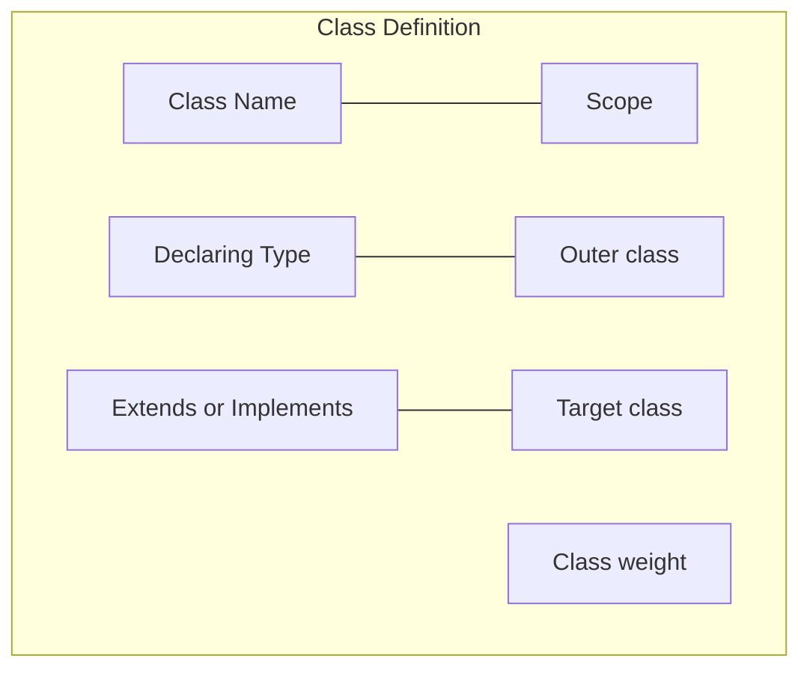
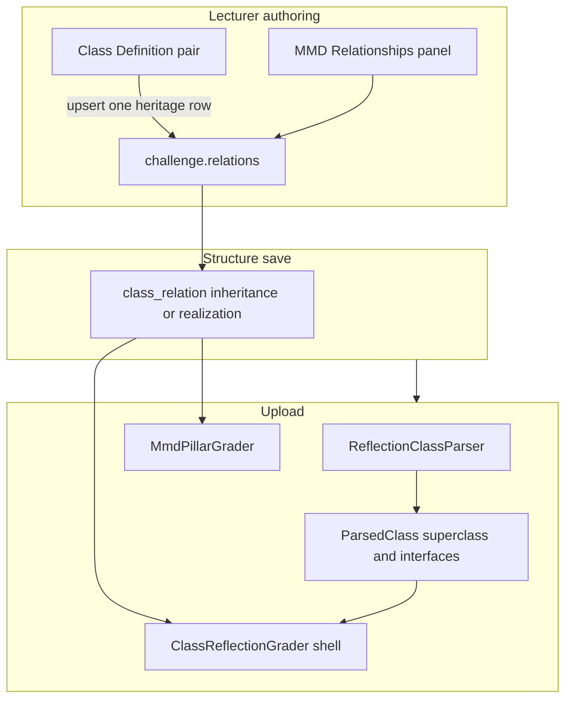

# Java Extends Implements Grading - Plan

## Goal Capsule

- **Objective:** Grade a class's optional Extends or Implements pair on the Java class shell, authored on the class editor as the same inheritance or implementation relationship the MMD diagram already uses.
- **Product authority:** This Product Contract. Nested-class outer linkage, MMD relationship kinds other than inheritance and implementation, operational testcases, and student-facing Extends/Implements reason text are not active scope.
- **Open blockers:** None.
- **Stop conditions:** Stop if the work would add `class_entity` heritage columns, grade composition/association in Java, walk parent types for assignability, or add a student expected-implements line.
- **Execution profile:** Standard. No schema migration. Class pillar plus lecturer structure editor.
- **Tail ownership:** Implementer runs the Verification Contract in this repo. No operator SQL.

---

## Product Contract

### Summary

Lecturers set one optional Extends or Implements plus a target class on the class editor, replacing the Qualified identity bar. That pair is the shared inheritance or implementation relationship already used by the MMD diagram. Java fails the whole class shell when the compiled type's declared superclass or interfaces do not match, including when the challenge does not require an MMD file.

### Problem Frame

Today the class pillar compares scope, declaring type, abstract, static-nested, and members. Two student classes with the same `update(String)` both score 100% whether or not they `implements Observer`. Inheritance and implementation arrows are graded only from the MMD diagram, so a Java-only mistake is invisible on Declaration Test. Extends and Implements are core OOP facts for labs like Observer.

### Key Decisions

- **Declared-clause Java check plus shared inheritance/implementation relationship** (session-settled: user-approved — chosen over a Java-only setting beside MMD arrows, and over MMD-only arrows: one lecturer fact, two independent pillars). **Governs R4, R7, R11.**
- **One optional pair per class** (session-settled: user-directed — chosen over several rows and over one Extends plus one Implements: matches the two class-editor boxes). **Governs R1, R2.**
- **Class-shell miss zeros members** (session-settled: user-directed — chosen over a separate relationship score that lets members still pass). **Governs R8.**
- **Java grades the pair even when MMD is off** (session-settled: user-directed — chosen over skipping the Java check or hiding the class-editor pair when the challenge does not require a diagram). **Governs R5.**
- **Smallest v1 student feedback** (session-settled: user-directed — chosen over a dedicated "expected implements Observer" line and over extra MMD-panel UI: class fail is enough). **Governs R12.**
- **Replace Qualified identity, keep Outer class** — the nested `Outer.Inner` preview goes away; the Outer class dropdown remains. **Governs R6.**
- **Required pair only** — extra student interfaces or an extra superclass do not fail when the required pair matches. **Governs R10.**

### Actors

- A1. Lecturer — authors the pair in Solution Management and the shared inheritance/implementation relationship.
- A2. Student — uploads Java (and MMD when required) and sees class-shell pass/fail.
- A3. Grading pipeline — compares the compiled type's declared superclass or interfaces to the pair, independently of the MMD pillar.

### Requirements

**Authoring**

- R1. Class Definition replaces the Qualified identity bar with a kind control (Extends or Implements) and a target-class picker.
- R2. A class has at most one pair, and the pair is optional. Clearing it means Java does not require Extends or Implements for that class, and removes that class's shared inheritance or implementation relationship.
- R3. The target is another class in the same challenge. Source and target must differ.
- R4. The pair is the same inheritance (Extends) or implementation (Implements) relationship the MMD diagram grades, with this class as source and the picked class as target.
- R5. Java grades the pair when it is set, even if the challenge does not require an MMD diagram.
- R6. The Outer class dropdown remains. Nested-class identity is not shown as a Qualified identity bar.

**Java grading**

- R7. When a pair is set, the class shell includes a declared-clause match: Extends requires the compiled type's immediate superclass to be the target; Implements requires the compiled type's declared interfaces to include the target.
- R8. A pair mismatch fails the class shell. Fields, methods, and constructors on that class score 0%.
- R9. When no pair is set, the class shell does not check Extends or Implements.
- R10. Extra declared interfaces or an unexpected superclass do not fail the pair check when R7 matches.
- R11. The MMD pillar still grades diagram relationships independently. A Java pair miss does not force the MMD relationship incorrect, and a correct MMD arrow does not pass the Java shell.

**Student results**

- R12. v1 does not add a dedicated expected Extends/Implements reason line on the student Class tab. The class fails as a shell mismatch.

### Key Flows

- F1. Lecturer sets Implements plus Observer on EmailSubscriber
  - **Trigger:** Lecturer edits EmailSubscriber in Solution Management and saves lab structure.
  - **Actors:** A1
  - **Steps:** Kind is Implements; target is Observer; the shared implementation relationship is EmailSubscriber → Observer; Outer class is unchanged.
  - **Outcome:** The pair is stored as the shared implementation relationship and is graded in Java on the next student upload.
  - **Covered by:** R1, R3, R4

- F2. Matching implements
  - **Trigger:** Student uploads `public class EmailSubscriber implements Observer` with `update(String)` matching the rubric.
  - **Actors:** A2, A3
  - **Steps:** Compile succeeds; declared interfaces include Observer; remaining shell attributes match.
  - **Outcome:** Class shell passes; members grade as today.
  - **Covered by:** R7

- F3. Missing implements
  - **Trigger:** Student uploads `public class EmailSubscriber` with the same `update(String)`, no `implements Observer`.
  - **Actors:** A2, A3
  - **Steps:** Compile succeeds; declared interfaces do not include Observer.
  - **Outcome:** Class shell fails; members on EmailSubscriber score 0%.
  - **Covered by:** R7, R8, R12

- F4. Java check with MMD off
  - **Trigger:** Challenge does not require an MMD diagram; EmailSubscriber still has Implements Observer.
  - **Actors:** A1, A2, A3
  - **Steps:** Student uploads Java only; MMD pillar is omitted; Java still applies R7.
  - **Outcome:** Missing `implements Observer` fails the class shell. Challenge score uses remaining applicable pillars.
  - **Covered by:** R5, R8, R11

- F5. Nested class still has an outer
  - **Trigger:** Lecturer edits a nested class that already has an Outer class selected.
  - **Actors:** A1
  - **Steps:** Outer class dropdown still sets the enclosing class; Extends/Implements pair is separate and optional.
  - **Outcome:** Nested grading identity remains the outer-class link; there is no Qualified identity bar.
  - **Covered by:** R6

### Acceptance Examples

- AE1. **Covers R7, R8, R12.** Given EmailSubscriber is expected to implement Observer, when the student omits `implements Observer` but keeps `update(String)`, then the class shell fails and members score 0%, with no extra expected-implements line.
- AE2. **Covers R7.** Given the same rubric, when the student writes `implements Observer`, then the pair check passes (other shell attributes still apply).
- AE3. **Covers R7, R8.** Given EmailSubscriber must implement Observer, when the student extends a parent that implements Observer but EmailSubscriber itself does not declare `implements Observer`, then the class shell fails.
- AE4. **Covers R10.** Given EmailSubscriber must implement Observer, when the student implements Observer and also Serializable, then the pair check passes.
- AE5. **Covers R9.** Given EmailSubscriber has no Extends/Implements pair, when the student neither extends nor implements a rubric class, then the class shell does not fail for heritage.
- AE6. **Covers R2, R4.** Given EmailSubscriber had Implements Observer, when the lecturer clears the pair and saves, then Java no longer requires implements, and the shared implementation relationship from EmailSubscriber is gone.
- AE7. **Covers R5, R11.** Given the challenge does not require MMD and the pair is set, when the student omits `implements Observer`, then Java still fails the class shell and the MMD pillar is not scored.
- AE8. **Covers R11.** Given MMD is required and the pair is Implements Observer, when the student draws the implementation arrow correctly but omits `implements Observer` in Java, then MMD can pass that relationship and the Java class shell still fails.
- AE9. **Covers R3, R6.** Given a nested PenBuilder with Outer class Pen, when the lecturer sets no Extends/Implements pair, then nested identity stays Pen via the Outer class dropdown, not via a Qualified identity bar.

### Scope Boundaries

**Deferred for later**

- Several Extends/Implements rows, or Extends and Implements on the same class
- JDK or library types that are not classes in the challenge
- Student-facing expected Extends/Implements reason text
- New MMD-panel controls beyond sharing the existing inheritance/implementation row

**Outside this product's identity**

- Grading `.java` source text or `@Override`
- Operational testcases as the way to detect Extends/Implements
- Assignability through parent types as a substitute for a declared clause
- Changing how composition, aggregation, association, or other non-heritage diagram relationships are graded

### Dependencies / Assumptions

- The target of a pair is always another class in the same challenge rubric. `extends ArrayList` is out of v1.
- Extends maps to inheritance (this class extends the target). Implements maps to implementation/realization (this class implements the target).
- Implicit `extends Object` is not a graded Extends pair.
- Other MMD relationship kinds stay authored and graded as they are today.

### Outstanding Questions

None. Class-editor upsert plus save-time 400 is the v1 one-pair path (KTD2, U4). MMD Relationships can still add a second heritage row in a draft until save.

### Sources / Research

- Class shell today: scope, declaring type, abstract, and nested static only — `backend/src/main/java/com/eiu/capstone/backend/grading/pipeline/ClassReflectionGrader.java`
- Parser does not read superclass or interfaces — `backend/src/main/java/com/eiu/capstone/backend/grading/ReflectionClassParser.java`, `backend/src/main/java/com/eiu/capstone/backend/grading/ParsedClass.java`
- Relations are MMD-only today — `backend/src/main/java/com/eiu/capstone/backend/grading/AGENTS.md`
- Shared relationship model — `backend/src/main/java/com/eiu/capstone/backend/model/ClassRelation.java`
- Realization is implementor → interface — `backend/src/main/java/com/eiu/capstone/backend/grading/AGENTS.md`
- Qualified identity is nested outer preview, not heritage — `frontend/src/components/lecturer/structure/ClassDetailPanel.jsx`, `CONCEPTS.md`
- Pillars are independent — `CONCEPTS.md` (Grading pillar)
- Nested qualified matching — `docs/solutions/architecture-patterns/nested-class-grading-support.md`
- Independent pillars — `docs/solutions/architecture-patterns/conditional-pillar-scoring-dynamic-weights.md`

---

## Planning Contract

### Key Technical Decisions

- KTD1. **Reuse `class_relation` for Java heritage** — no new `class_entity` columns and no heritage fields on `ClassStructureDTO`. The grader and display shell look up inheritance/realization rows on the challenge where source is this class. **Governs R4, R7, U2, U3.**
- KTD2. **Class editor owns the one heritage row** — Extends or Implements on a class upserts one inheritance or realization row with that class as source. Saving replaces any other inheritance/realization rows from the same source. Composition and other kinds are untouched. The MMD panel still lists the shared row. **Governs R2, U4, U5.**
- KTD3. **Declared clause only** — Extends matches immediate superclass simple name to the target's simple or qualified rubric name. Implements matches declared interfaces the same way. Skip implicit `Object`. Extra interfaces do not fail. Inherited implementation through a parent does not pass. **Governs R7, R10, U1, U2.**
- KTD4. **Any other challenge class is a valid target** — do not filter the picker by declaring type. Invalid Java (implements a class) still authors; student compile or the declared-clause check fails. **Governs R3, U5.**
- KTD5. **Display shell stays in lockstep with the grader** — one backend heritage predicate (package-private helper is enough) is used by `ClassReflectionGrader` and `ClassStructureService.buildShellChecks` so Class tab `error` matches pillar scoring without a new reason line. **Governs R8, R12, U2, U3.**

### High-Level Technical Design

Heritage lookup (directional): for expected class C, take the single inheritance or realization row with source C. Extends: parsed superclass name equals target identity. Implements: target identity is in parsed declared interfaces.

### Sequencing

1. Parser fields (U1)
2. Save-time one-pair guard (U4) — parallel with U1
3. Class-shell grade (U2)
4. Class-tab shell parity (U3)
5. Class-editor UI (U5)
6. Docs and lecturer copy (U6)

### Implementation constraints

- Do not grade source `.java` text. Grade compiled types.
- Do not AND Java and MMD at element level. Per R11.
- Frontend has no unit test runner. U5 is `npm run build` plus manual Solution Management.

---

## Implementation Units

### U1. Parse declared superclass and interfaces

**Goal:** Compiled types expose the declared Extends/Implements facts the shell will check.

**Requirements:** R7, R10

**Dependencies:** None

**Files:**
- `backend/src/main/java/com/eiu/capstone/backend/grading/ParsedClass.java`
- `backend/src/main/java/com/eiu/capstone/backend/grading/ReflectionClassParser.java`
- `backend/src/test/java/unit/com/eiu/capstone/backend/grading/ReflectionClassParserTest.java`

**Approach:**
1. Capture immediate superclass simple name, omitting `Object`.
2. Capture declared interface simple names from the compiled type.
3. Nested types still load as today; heritage names use simple names (target matching in U2 uses rubric identity).

**Patterns to follow:** Existing `parseClass` modifier and declaring-type extraction in `ReflectionClassParser.java`.

**Test scenarios:**
- Class with no extends/implements: no superclass name; empty interface list.
- `class EmailSubscriber implements Observer`: interfaces include `Observer`.
- `class Dog extends Animal`: superclass is `Animal`.
- Extra `implements Observer, Serializable`: both names present.
- Nested type: still parsed; superclass/interfaces captured when declared.

**Verification:** Parser unit tests pass. No grader behavior change yet.

---

### U2. Grade heritage on the class shell

**Goal:** When a pair is set, the class shell includes the declared-clause match. Mismatch zeros members.

**Requirements:** R5, R7, R8, R9, R10, R11. Session-settled shell fail and Java-always via those Rs.

**Dependencies:** U1. U4 should ship in the same change set so saved rubrics cannot keep extras.

**Files:**
- `backend/src/main/java/com/eiu/capstone/backend/grading/pipeline/ClassReflectionGrader.java`
- `backend/src/main/java/com/eiu/capstone/backend/grading/pipeline/` heritage predicate helper (create; consumed by U2 and U3)
- `backend/src/test/java/unit/com/eiu/capstone/backend/grading/pipeline/ClassReflectionGraderTest.java`

**Approach:**
1. For each expected class, find heritage rows in `challengeRubric.relations()` whose source is that class and whose type is inheritance or realization (reuse the existing relation-kind synonym list; do not reuse MMD class-name matching).
2. If none, skip heritage (R9). If more than one, skip heritage the same way U5 treats a stale extra-row draft — do not pick a row. U4 rejects extras on save.
3. Add one boolean to existing binary shell checks. Do not introduce partial shell credit.
4. Extends: parsed superclass equals target simple or qualified name. Implements: target name is in declared interfaces.
5. `has_mmd` does not gate this unit.

**Patterns to follow:** Existing `classChecks` / `shellPassed` member gate in `ClassReflectionGrader.java`. Target identity via `ClassRubric.qualifiedName()` when the target is nested.

**Test scenarios:**
- Covers AE2: Implements Observer and student declares it → shell passes.
- Covers AE1: missing `implements Observer` → shell fails; methods score 0 even if `update` matches.
- Covers R7 Extends: expected Extends Animal and student `extends Animal` → shell passes.
- Covers AE3: parent implements Observer, this class does not declare it → shell fails.
- Covers AE4: implements Observer and Serializable → pair passes.
- Covers AE5: no heritage row → no heritage check.
- Covers AE7: challenge `hasMmd` false still applies the Java check.
- Covers AE8 Java half: realization row present, student omits `implements Observer` → Java shell fails (MMD-pass half is existing MMD pillar scoring of the same row; no new MMD unit).
- Wrong kind: rubric Implements Observer, student `extends Observer` → shell fails.

**Verification:** `ClassReflectionGraderTest` covers AE1–AE5, AE7, and the Java half of AE8. Members remain 0 when shell fails.

---

### U3. Keep Class-tab shell display in sync

**Goal:** Student and lecturer Class cards show shell `error` on heritage mismatch without a new reason line.

**Requirements:** R8, R12

**Dependencies:** U2

**Files:**
- `backend/src/main/java/com/eiu/capstone/backend/service/ClassStructureService.java`
- `backend/src/main/java/com/eiu/capstone/backend/grading/pipeline/` heritage predicate helper (shared with U2)
- `backend/src/main/java/com/eiu/capstone/backend/grading/ParsedSubmissionSnapshot.java`
- `backend/src/main/java/com/eiu/capstone/backend/grading/ParsedSubmissionSnapshotBuilder.java`
- `backend/src/test/java/support/com/eiu/capstone/backend/service/ClassStructureServiceShellDisplayTest.java`

**Approach:**
1. Capture parsed superclass and declared interfaces on the class shell snapshot the same way other shell attributes are captured.
2. Thread the source class’s inheritance/realization row(s) and target-class rubric lookup into both `resolveShellStatus` / `buildShellChecks` overloads (rubric snapshot via `ChallengeRubric.relations()`, JPA via `LabChallengeStructureBundle.relationsBySourceClassId`).
3. Call the U2 heritage predicate when a heritage row exists for that class.
4. Do not add Class-tab copy for expected Extends/Implements.

**Patterns to follow:** Current `buildShellChecks` dual overloads and `gateMemberGrade` when shell is `error`.

**Test scenarios:**
- Covers AE1 display half: heritage mismatch → shell status `error`; members gated failed; no heritage reason text.
- Heritage match → shell can still succeed if other shell attributes match.
- No pair → heritage does not flip shell to error.

**Verification:** `ClassStructureServiceShellDisplayTest` covers mismatch and no-pair. Upload assemble and GET `/class` agree.

---

### U4. Save-time one heritage pair per source

**Goal:** Structure save rejects extra inheritance/realization rows from the same source so the rubric cannot contradict R2.

**Requirements:** R2, R3, R4

**Dependencies:** None (can land parallel to U1)

**Files:**
- `backend/src/main/java/com/eiu/capstone/backend/service/LabStructureService.java`
- `backend/src/test/java/support/com/eiu/capstone/backend/service/LabStructureServiceSaveTest.java`

**Approach:**
1. After assembling relation DTOs for a challenge, if more than one inheritance or realization row shares a source class, reject the save with 400.
2. U5 must not emit extras. This guard is the server safety net.
3. Keep existing source ≠ target and same-challenge checks.

**Patterns to follow:** Existing `syncRelations` validation in `LabStructureService.java`.

**Test scenarios:**
- Two realization rows from EmailSubscriber → save returns 400.
- One realization plus one composition from EmailSubscriber → both persist.
- Source equals target still 400.

**Verification:** `LabStructureServiceSaveTest` covers duplicate heritage and mixed kinds.

---

### U5. Class Definition Extends/Implements picker

**Goal:** Replace Qualified identity with kind plus target class. The pair writes the shared relations list. Outer class stays.

**Requirements:** R1, R2, R3, R4, R6. Session-settled one pair and replace-bar via those Rs.

**Dependencies:** U4 for save guard; can UI-land against current save if the draft never emits extras

**Files:**
- `frontend/src/components/lecturer/structure/ClassDetailPanel.jsx`
- `frontend/src/pages/SolutionManagement.jsx`
- `frontend/src/components/lecturer/AGENTS.md`

**Approach:**
1. Remove the Qualified identity readout. Keep Outer class.
2. Kind control: None / Extends / Implements. Target picker: other classes in the challenge. Labels: None and Select class. Target disabled until kind is set.
3. From `SolutionManagement.jsx`, pass `relations`, `relationTypeOptions`, and an `onRelationsChange` (or challenge-level patch) into `ClassDetailPanel`, mirroring `MmdRelationsPanel`’s `patchRelations` pattern. Today the panel only receives `onChange={updateSelectedClass}`. Upsert logic stays in the class panel; do not add a new `frontend/src/utils/` helper.
4. Write a relations row only when both kind and target are set. Kind-only is local UI; reload with no target shows None. Save is allowed with no heritage row.
5. Kind None: set target back to Select class, remove any heritage row from this source, and do not show a stale target while disabled.
6. Kind change Extends ↔ Implements with a target already selected: keep the target and upsert the new relation kind immediately.
7. On load, derive the pair from the sole inheritance or realization row with this class as source (U4 makes duplicates impossible after a successful save). If extras exist in a stale draft, treat as no pair rather than picking arbitrarily.
8. When the challenge has fewer than two classes, disable kind and target. Do not add new MMD-panel helper copy.
9. Nested classes may still set a pair; it is independent of outer-class link.

**Patterns to follow:** Outer-class select and `ScopeSelect` in `ClassDetailPanel.jsx`. Relation row shape in `MmdRelationsPanel.jsx`. Class-delete already strips relations in `SolutionManagement.jsx`.

**Test expectation:** none — frontend has no unit runner. `npm run build` must succeed. Manual: set Implements Observer on EmailSubscriber, save, reload, MMD panel shows the same row; clear pair, row gone; nested Outer class still works.

**Verification:** Build succeeds. Manual round-trip in Solution Management matches F1, F5. Covers AE6: clear pair, row gone. Covers AE9: nested Outer class still works.

---

### U6. Grading contracts and lecturer copy

**Goal:** Docs match Java-graded heritage. No student UI copy change.

**Requirements:** R5, R11, R12

**Dependencies:** U2, U5

**Files:**
- `backend/src/main/java/com/eiu/capstone/backend/grading/AGENTS.md`
- `backend/AGENTS.md` if the rubric-chain sentence still says relations are MMD-only
- `docs/GRADING_WORKFLOWS.md`
- `CONCEPTS.md` (Declared heritage pair already present — keep consistent)
- `frontend/src/components/lecturer/structure/MmdRelationsPanel.jsx` subtitle/banner if it still implies heritage is MMD-only

**Approach:**
1. Replace “relations are MMD-only” with: inheritance/realization also feed the Java class shell; other kinds stay MMD-only.
2. Note `has_mmd=false` still Java-grades a set pair.
3. Do not add student Class-tab heritage copy.

**Test expectation:** none — documentation and AGENTS.md.

**Verification:** DOX pass on touched AGENTS.md files. Banner no longer says Java ignores saved heritage.

---

## Verification Contract

| Command | Applies to | Purpose |
|---|---|---|
| `cd backend && mvn test -Dtest=ReflectionClassParserTest,ClassReflectionGraderTest,ClassStructureServiceShellDisplayTest,LabStructureServiceSaveTest` | U1–U4 | Heritage parse, grade, display, save |
| `cd backend && mvn test` | All backend units | Full regression |
| `cd frontend && npm run build` | U5 | SPA compiles |
| Manual Solution Management + student upload of Observer-style pair | U2, U5 | F1–F4 / AE1–AE2 end to end |

---

## Definition of Done

- Every R1–R12 is covered by a U-ID, a test scenario, or an explicit non-goal.
- Class editor pair and MMD inheritance/implementation row are the same `class_relation`.
- Missing `implements Observer` fails the Java class shell and zeros that class's members.
- Correct MMD arrow does not pass the Java shell; Java miss does not force the MMD relation fail.
- Qualified identity bar is gone; Outer class remains.
- `mvn test` from `backend/` and `npm run build` from `frontend/` succeed.
- Grading AGENTS.md no longer says Java ignores relations for heritage.

### Deferred to Follow-Up Work

- Several Extends/Implements rows, JDK targets, and student expected-implements copy remain Product Contract deferred-for-later, not this PR.
