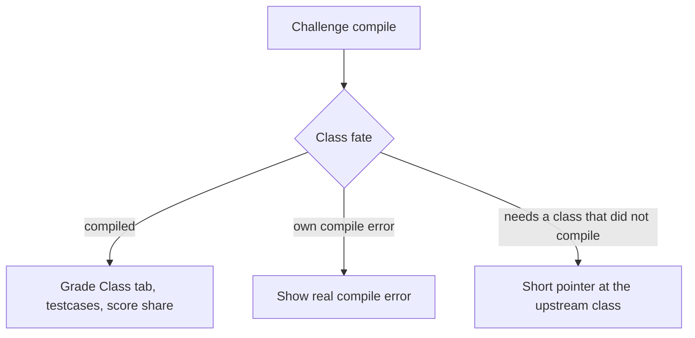
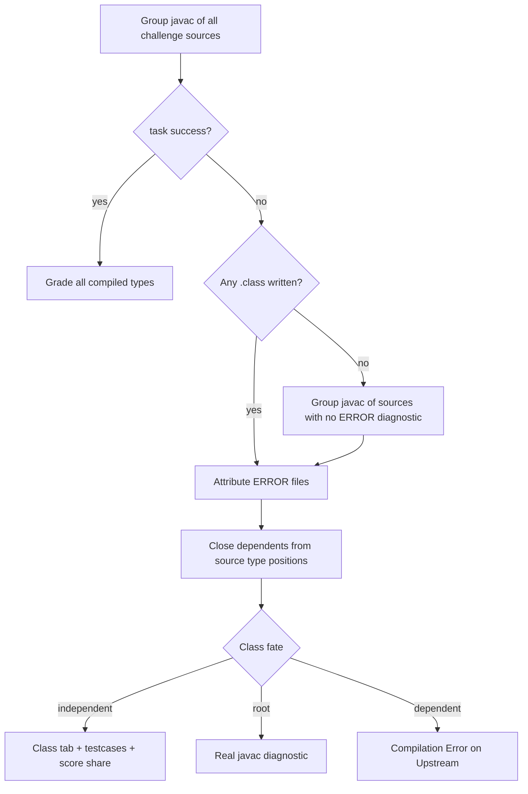

# Intra-Challenge Compile Isolation - Plan

## Goal Capsule

- **Objective:** Isolate compile failure inside a challenge so a broken class does not zero independent classes.
- **Product authority:** This Product Contract. Per-challenge isolation already exists and is not reopened. Member-level grading of a class that depends on a broken type is not active scope.
- **Open blockers:** None.
- **Stop conditions:** Do not compile each `.java` file as its own javac task. Do not change MMD. Do not reopen sibling-challenge isolation. Do not grade leftover members on a dependent class.
- **Execution:** Code. Prove mixed compile with backend tests before UI polish. `ce-work` owns the shipping tail.
- **Product Contract preservation:** Restructured, no scope change: Product Outstanding Questions (keep compiled types, root vs dependent) → KTD1, KTD3. F1 no longer claims a single javac on the error path; the F1 outcome is unchanged.

---

## Product Contract

### Summary

A compile failure inside a challenge no longer zeros the whole challenge. Classes that still compile keep Class-tab scores, their operational testcases, and their share of the challenge score. Broken classes show the real compile error. Classes that only needed those broken types fail too, with a short pointer at the upstream class. One compile of the challenge is the fast path, so two good classes that use each other still grade. Every current whole-challenge compile path follows this rule, including lecturer testcase dry-run. MMD is unchanged.

### Problem Frame

Today one challenge folder is one compile unit. A missing semicolon in one class fails that compile, the challenge's compiled output is discarded, and every Class card and every operational testcase in that challenge is treated as a compile error. A student who forgot a single `;` saw `0 / Total 0%` and could not tell a syntax error from "every class is wrong." Sibling challenges already survive independently. Inside a challenge they do not.

### Key Decisions

- **Errors and scores together** (session-settled: user-directed — chosen over shipping compile-error display without independent scores, and over scoring independents without a compile message: the student needed both the missing `;` and credit on the rest). **Governs R6, R7, R10.**
- **"Graded normally" includes Class tab, that class's testcases, and its share of the challenge score** (session-settled: user-directed — chosen over Class-tab-only and over Class-plus-testcases without challenge score). MMD stays as it is today. **Governs R8, R9, R11.**
- **A dependent class fails as a whole** (session-settled: user-directed — chosen over grading leftover declarations or leftover members: a missing type makes that class unusable). **Governs R4, R5.**
- **Every current whole-challenge compile path** (session-settled: user-directed — chosen over student-upload-only and over student-plus-dry-run as a narrower cut). **Governs R12.**
- **Short upstream pointer on dependents** (session-settled: user-directed — chosen over javac's native message on the dependent, and over showing both: a line like `Compilation Error on Student`). **Governs R7.**
- **One challenge compile on the fast path** (session-settled: user-directed — chosen over compiling each file alone, and over a second compile as the default: least time that still keeps mutual references among working classes correct). **Governs R1, R2, R3.**
- **Same source file succeeds or fails together** — types that live in one file are not isolated from each other. **Governs R3.**

### Actors

- A1. Student — uploads Java, then reads Class-tab cards, testcase results, and the challenge score.
- A2. Lecturer — dry-runs an operational testcase against reference Java for the same challenge.
- A3. Compile-and-grade path — compiles a challenge, keeps classes that compiled, and grades only those.

### Requirements

**Compile isolation**

- R1. A challenge is compiled as one unit so classes in that challenge can see each other.
- R2. After that compile, classes that compiled remain available for grading even if other classes in the same challenge failed.
- R3. Types declared in the same source file succeed or fail together.
- R4. A class that did not compile, and any class that references a class that did not compile, is a failed class. Transitive references count.
- R5. A failed class gets no Class-tab declaration credit and no operational-testcase credit.

**Student results**

- R6. A class with its own compile error shows that compile error on its Class-tab card. It is not a silent 0.
- R7. A class that failed only because it references a failed class shows a short pointer at that upstream class, in the shape `Compilation Error on Student`.
- R8. An independent class is graded as if the failed sibling did not exist: Class-tab declaration scores and that class's operational testcases still run.
- R9. An operational testcase whose target is a failed class is an error because of compile failure, not a test fail.
- R10. A challenge that produced compile diagnostics never shows only `0 / Total 0%` with no compile error on the classes that failed.

**Scoring**

- R11. Independent classes contribute their Class-tab and testcase results to the challenge score. MMD still grades whether or not Java compile succeeded.

**Other compile surfaces**

- R12. Lecturer testcase dry-run uses the same isolation rule as student upload. A dry-run whose target class compiled succeeds even if another reference class in that challenge failed. A dry-run whose target did not compile fails with a compile error.

### Key Flows

- F1. One broken independent sibling
  - **Trigger:** A1 uploads a challenge where `Student` has a syntax error and `BankAccount` does not use `Student`.
  - **Actors:** A1, A3
  - **Steps:** `Student` has no compiled type. `BankAccount` remains available. Class tab shows the real error on `Student` and grades `BankAccount`. `BankAccount` testcases run. Challenge score includes `BankAccount`.
  - **Covered by:** R1, R2, R6, R8, R11
- F2. Dependent class
  - **Trigger:** A1 uploads `Student` broken and `BankAccount` referencing `Student`.
  - **Actors:** A1, A3
  - **Steps:** Both fail. `Student` shows the syntax error. `BankAccount` shows `Compilation Error on Student`. Neither gets declaration or testcase credit.
  - **Covered by:** R4, R5, R6, R7, R9
- F3. Mutual references among working classes
  - **Trigger:** A1 uploads two classes that reference each other and a third class with a syntax error that neither uses.
  - **Actors:** A1, A3
  - **Steps:** The two working classes both compile and grade. The third shows its compile error.
  - **Covered by:** R1, R2, R8
- F4. Lecturer dry-run on an independent class
  - **Trigger:** A2 dry-runs a testcase whose target compiled, while another reference class in that challenge has a syntax error.
  - **Actors:** A2, A3
  - **Steps:** The dry-run runs. It does not fail the whole challenge compile.
  - **Covered by:** R12
- F5. Nothing independent survived
  - **Trigger:** Every class in the challenge is failed or depends on a failed class.
  - **Actors:** A1, A3
  - **Steps:** Class cards show compile errors, not a silent 0 with no message. Challenge Java score is 0. MMD still grades if applicable.
  - **Covered by:** R4, R5, R6, R10, R11

### Acceptance Examples

- AE1. Missing semicolon in one unused class
  - **Covers R6, R8, R10, R11.**
  - **Given:** A challenge with `Student` and `BankAccount`. `BankAccount` does not reference `Student`. `Student` is missing a `;`.
  - **When:** The student uploads.
  - **Then:** `Student`'s Class card shows the compile error. `BankAccount` has declaration scores and testcase results. The challenge score is not 0 solely because `Student` failed. The student does not see only `0 / Total 0%` with no compile message.
- AE2. Dependent class
  - **Covers R4, R5, R7, R9.**
  - **Given:** `BankAccount` references `Student`. `Student` fails to compile.
  - **When:** The student uploads.
  - **Then:** `BankAccount`'s Class card shows `Compilation Error on Student`. `BankAccount` declaration items are not credited. Testcases whose target is `BankAccount` or `Student` are compile errors, not test fails.
- AE3. Transitive dependent
  - **Covers R4.**
  - **Given:** `C` references `B`, `B` references `A`, and `A` fails to compile.
  - **When:** The student uploads.
  - **Then:** `A`, `B`, and `C` are all failed classes.
- AE4. Same file, two types
  - **Covers R3.**
  - **Given:** One source file declares `Student` and a helper type. That file has a syntax error.
  - **When:** The student uploads.
  - **Then:** Both types in that file fail. They are not isolated from each other.
- AE5. Lecturer dry-run
  - **Covers R12.**
  - **Given:** Reference Java includes a broken unused class and a compiled target class.
  - **When:** The lecturer dry-runs a testcase on the compiled target.
  - **Then:** The dry-run proceeds. It does not fail because of the unused broken class.
- AE6. MMD still grades
  - **Covers R11.**
  - **Given:** Java compile failed for some classes in a challenge that requires MMD.
  - **When:** The student uploads.
  - **Then:** MMD grades as it does today, independent of those Java compile failures.

### Success Criteria

- The semicolon student can see the compile error on the broken class and still receive declaration and testcase credit on independent classes.
- Two good classes that reference each other still grade when a third class in the same challenge fails to compile.
- Lecturer dry-run of a compiled target is not blocked by an unused broken reference class.

### Scope Boundaries

- **In:** Student upload results (Class tab, operational testcases, challenge score) and every other compile path that today fails the whole challenge folder, including lecturer testcase dry-run.
- **Deferred for later:** Grading leftover methods on a class that depends on a broken type.
- **Out:** Changing MMD behavior. Reopening per-challenge compile isolation. Compiling each source file alone as the isolation unit. Redesigning Class-tab layout beyond showing per-class compile errors versus graded cards.
- **Deferred to Follow-Up Work:** Lecturer export rows for compile-failed classes. Deeper nested types than `Outer$Inner`.

### Dependencies / Assumptions

- Per-challenge compile isolation already keeps sibling challenges gradable when one challenge fails. This work does not change that.
- The existing grading-engine rebuild contract already asked for per-class compile failure on the Class tab (`docs/plans/2026-08-09-002-feat-grading-engine-rebuild-plan.md` R7 / AE2). That behavior is not in the product today.

### Sources / Research

- `docs/GRADING_WORKFLOWS.md` — one compile per challenge folder; challenge-level compile error currently gates all Class cards and all testcases.
- `docs/solutions/architecture-patterns/in-memory-challenge-compile-path.md` — sibling challenges already isolate compile failure; javac failure today deletes `classes/`.
- `docs/solutions/architecture-patterns/operational-testcase-grading.md` — `TestcaseGrader` short-circuits all testcases on `compileError`.
- `docs/plans/2026-08-09-002-feat-grading-engine-rebuild-plan.md` — R7 / AE2 specified per-class compile failure and testcase `ERROR` for failed classes; not implemented inside a challenge.
- Claim check: group compile throws on failure and deletes that challenge's compiled output; `failedClassNames` exists on `ChallengeGradingContext` but is always empty and unread.

---

## Planning Contract

### Key Technical Decisions

- KTD1. **Remainder compile after a failed group javac** (session-settled: user-directed — instantiates R1/R2 over per-file javac and over a second compile as the default: happy path stays one group compile; mixed failure may run one extra group compile of sources with no ERROR diagnostic). If the first failed task already wrote any `.class` file, skip the remainder compile. Research: a mixed Good+Bad `CompilationTask` on the local JDK wrote zero `.class` files, so keeping survivors requires this fallback. **Governs R1, R2.**
- KTD2. **`ChallengeResult.compileError` is catastrophic only.** I/O and setup failures still delete the cleanup target and gate the whole challenge. Mixed javac leaves `compileError` null and fills `failedClassNames` plus `compileErrorsByClassName`. **Governs R6, R8, R10.**
- KTD3. **Root vs dependent attribution.** ERROR diagnostics map to the source file, then to every type declared in that file (per R3). Dependents are a source scan of type positions (extends, implements, fields, method and constructor signatures, `new Type(`) against failed rubric names, closed transitively. Pointer text uses the first root in rubric order: `Compilation Error on Student`. **Governs R3, R4, R7.**
- KTD4. **Testcase compile ERROR if any invoked type failed.** Check invocation `className`, `receiverClassName`, comparison instance class names, and parameter types against `failedClassNames`. Catastrophic `compileError` still gates every testcase. **Governs R8, R9.**
- KTD5. **Persist `ChallengeCompileErrors` (`catastrophic` + `byClassName`)** in `SubmissionCompileErrorStore` so GET `/class` after temp-folder delete can still show per-card errors. **Governs R6, R7, R10.**
- KTD6. **Dry-run mixed javac returns a preview DTO.** `ERROR` when the testcase touches a failed type. HTTP 422 stays for malformed request and size limits, not for mixed compile. **Governs R12.**

### High-Level Technical Design

Happy-path compile stays one group javac. Mixed failure attributes ERROR files, then compiles the remainder as one group into the same `classes/` directory.

`ClassReflectionGrader` already scores a missing parsed class as 0. Survivors grade once bytecode exists. `TestcaseGrader` must stop using challenge-wide `compileError` for mixed javac.

### Assumptions

- Mixed javac on JDK 17 writes no sibling `.class` files. U1 pins this. If a first pass writes any `.class`, skip the remainder compile.
- Remainder sources stay one group so mutual references among survivors still compile (F3).
- Extra student types not on the rubric still compile with the challenge. They do not get Class cards.
- A rubric class with no uploaded source is a missing class, not a compile error, unless a dependent pointer applies.
- Frontend has no automated tests. U5 is proven by `npm run build` and the DTO contract from U3.

### Implementation Constraints

- Stay on `compileExecutor`. Do not schedule compile work on `gradingExecutor`.
- Keep flat `classes/` output for `ReflectionClassParser`.
- `processChallenge` still must not throw to sibling-challenge `join`.
- Do not add assemble thread pools.
- `ClassDetailDTO.error` already exists. Do not add a parallel API field.

### Sequencing

U1 (compile outcome) → U2 (storage + attribution) → U3 (grading + persist + Class tab) → U4 (dry-run) and U5 (UI) in parallel after U3.

---

## Implementation Units

### U1. Compile outcome and remainder javac

- **Goal:** `JavaCompilerService` returns a structured outcome instead of throwing on mixed javac, and runs one remainder group compile when the first task fails with no `.class` output.
- **Requirements:** R1, R2. KTD1.
- **Dependencies:** None.
- **Files:**
  - `backend/src/main/java/com/eiu/capstone/backend/service/JavaCompilerService.java`
  - `backend/src/main/java/com/eiu/capstone/backend/service/compile/CompileOutcome.java` (create)
  - `backend/src/test/java/support/com/eiu/capstone/backend/service/JavaCompilerServiceTest.java`
- **Approach:**
  1. Keep one `CompilationTask` over the full source list with `-d` and UTF-8.
  2. On `task.call() == false`, do not throw. Collect diagnostics. Count `.class` files under the output dir.
  3. If that count is 0, compile sources whose path had no ERROR diagnostic as a second group into the same `-d`.
  4. Reset the thread-local file manager after a failed task.
  5. Empty source list still skips the compiler.
- **Execution note:** Write the mixed Good+Bad compile test first so remainder behavior is pinned before callers change.
- **Patterns to follow:** Existing `MemorySourceJavaFileObject` + `ThreadLocal` file manager in `JavaCompilerService`.
- **Test scenarios:**
  - All sources valid: one javac, `.class` files present, outcome success.
  - Covers AE1 compile slice. `Good.java` plus `Bad.java` missing `;`: first task fails, remainder produces `Good.class`, no `Bad.class`.
  - Covers F3 compile slice. Two mutually referencing valid files plus one syntax-error file: both valid types emit `.class`.
  - Empty source list: no compiler invocation, success.
  - Only broken sources: no `.class`, outcome not success, no throw.
- **Verification:** `JavaCompilerServiceTest` covers the scenarios above. Callers can still compile a whole challenge as one unit.

### U2. Challenge result, attribution, and survivor retention

- **Goal:** Mixed javac no longer deletes `classes/`. `ChallengeResult` carries failed type names and per-type messages, including dependent pointers.
- **Requirements:** R2, R3, R4, R7. KTD2, KTD3.
- **Dependencies:** U1.
- **Files:**
  - `backend/src/main/java/com/eiu/capstone/backend/service/SubmissionStorageService.java`
  - `backend/src/main/java/com/eiu/capstone/backend/service/compile/CompileClassAttribution.java` (create)
  - `backend/src/main/java/com/eiu/capstone/backend/service/compile/StudentSourceNormalizer.java`
  - `backend/src/test/java/support/com/eiu/capstone/backend/service/SubmissionStorageServiceTest.java`
  - `backend/src/test/java/support/com/eiu/capstone/backend/service/compile/CompileClassAttributionTest.java` (create)
- **Approach:**
  1. Map ERROR diagnostics to the source file, then to every simple type declared in that file (reuse `extractDeclaredSimpleNames`).
  2. Close dependents from normalized source type positions against failed rubric names. Nested rubric names use `Outer.Inner`. Attribution and closure live in `CompileClassAttribution`. Expose `StudentSourceNormalizer.extractDeclaredSimpleNames` as package-private so attribution can reuse it.
  3. Root cards get the javac message. Dependent cards get `Compilation Error on {first root in rubric order}`.
  4. `failedChallenge` still deletes `classes/` only for I/O/setup. Mixed javac keeps the folder and sets `compileError` null.
  5. Extend `ChallengeResult` with `failedClassNames` and `compileErrorsByClassName`.
- **Patterns to follow:** `failedChallenge` isolation in `docs/solutions/architecture-patterns/in-memory-challenge-compile-path.md`, narrowed so javac mixed failure is not treated as catastrophic.
- **Test scenarios:**
  - Covers AE1. Independent sibling: `Broken.class` absent, `Good.class` present, `compileError` null, `failedClassNames` contains only the broken type.
  - Covers AE2 / AE3. Dependent and transitive dependent appear in `failedClassNames` with pointer text, not the root syntax dump.
  - Covers AE4. Two types in one broken file both fail.
  - Sibling-challenge test still holds: one challenge I/O or all-fail does not wipe the other challenge's `classes/`.
- **Verification:** New attribution tests plus extended `SubmissionStorageServiceTest`. Existing per-challenge isolation test still passes.

### U3. Per-class grading, Class tab, and persisted diagnostics

- **Goal:** Mixed compile grades survivors, errors only failed classes and testcases that touch them, and revisit GET `/class` still shows per-card errors after temp delete.
- **Requirements:** R5, R6, R7, R8, R9, R10, R11. KTD2, KTD4, KTD5.
- **Dependencies:** U2.
- **Files:**
  - `backend/src/main/java/com/eiu/capstone/backend/grading/pipeline/ChallengeGradingContext.java`
  - `backend/src/main/java/com/eiu/capstone/backend/grading/pipeline/GradingPipeline.java`
  - `backend/src/main/java/com/eiu/capstone/backend/grading/pipeline/TestcaseGrader.java`
  - `backend/src/main/java/com/eiu/capstone/backend/grading/LabResultAssembler.java`
  - `backend/src/main/java/com/eiu/capstone/backend/grading/GradingService.java`
  - `backend/src/main/java/com/eiu/capstone/backend/service/ClassStructureService.java`
  - `backend/src/main/java/com/eiu/capstone/backend/service/SubmissionCompileErrorStore.java`
  - `backend/src/main/java/com/eiu/capstone/backend/service/ChallengeCompileErrors.java` (create if not already a record)
  - `backend/src/main/java/com/eiu/capstone/backend/controller/SubmissionController.java`
  - `backend/src/test/java/unit/com/eiu/capstone/backend/grading/pipeline/TestcaseGraderTest.java`
  - `backend/src/test/java/unit/com/eiu/capstone/backend/grading/LabResultAssemblerTest.java`
  - `backend/src/test/java/support/com/eiu/capstone/backend/service/ClassStructureServiceShellDisplayTest.java`
  - `backend/src/test/java/support/com/eiu/capstone/backend/service/SubmissionCompileErrorStoreTest.java` (create)
  - `backend/src/test/java/integration/com/eiu/capstone/backend/pipeline/SubmissionPipelineIntegrationTest.java`
- **Approach:**
  1. `ChallengeGradingContext.of` takes `failedClassNames` and `compileErrorsByClassName` from `ChallengeResult` instead of `Set.of()`.
  2. `TestcaseGrader` uses KTD4 for mixed failure and the per-class message map for ERROR feedback. Catastrophic `compileError` still short-circuits every testcase.
  3. `ClassStructureService` sets per-card `error` and `membersGated` from that class's compile message, not from a challenge-wide string.
  4. Store JSON becomes challenge id → `{ catastrophic, byClassName }`. Dual-read legacy files that are still a plain string as `catastrophic` with empty `byClassName`. Upload save (`GradingService` and `SubmissionController`) and GET `/class` all use this shape.
  5. `LabResultAssembler` passes per-class errors into `buildClassDataFromRubric`. `GradingService.compileErrorsByChallengeId` builds `ChallengeCompileErrors` from `failedClassNames` / `compileErrorsByClassName`, not only `compileError`.
- **Patterns to follow:** Existing `compileErrorEvaluation` ERROR status (not FAIL). Upload assemble from rubric snapshot (`docs/solutions/architecture-patterns/assemble-lab-result-from-rubric-snapshot.md`). Aspect-home tests (`docs/solutions/conventions/backend-junit-aspect-home-packages.md`).
- **Test scenarios:**
  - Covers AE1 / F1. Pipeline: independent class has Class-tab credit and running testcases; broken class card has the javac error; challenge Java score is not forced to 0.
  - Covers AE2. Testcases whose target, receiver, instance, or param type is failed return `ERROR`, not FAIL. Independent-target testcases still invoke.
  - Covers AE6. MMD still produces a result when Java mixed-fails.
  - Covers F5. All-fail: every failed card has non-empty `error`; Java pillars 0.
  - Store round-trip: save `byClassName`, delete folder, GET-shaped `buildClassData` still shows per-card errors.
  - Catastrophic compileError still gates all cards and all testcases.
- **Verification:** Unit tests for grader/assembler/store plus `SubmissionPipelineIntegrationTest` mixed-compile fixture. Existing `compileFailureFinishesAsAssertedError` covers all-fail or catastrophic, not mixed survivors.

### U4. Lecturer dry-run isolation

- **Goal:** Dry-run uses the same compile outcome as upload. Mixed reference compile is a preview `ERROR`, not HTTP 422.
- **Requirements:** R12. KTD6.
- **Dependencies:** U1, U2, U3.
- **Files:**
  - `backend/src/main/java/com/eiu/capstone/backend/service/TestcaseDryRunService.java`
  - `backend/src/main/java/com/eiu/capstone/backend/service/compile/CompileClassAttribution.java` (consume; owned by U2)
  - `backend/src/test/java/support/com/eiu/capstone/backend/service/TestcaseDryRunServiceTest.java`
- **Approach:**
  1. Compile reference sources through U1 `CompileOutcome`, then call U2 `CompileClassAttribution`. Do not reimplement diagnostic mapping or dependent closure.
  2. Build `ChallengeGradingContext` with `failedClassNames` populated and `compileError` null on mixed javac.
  3. `testcaseGrader.gradeSingle` returns the preview DTO. Invert `dryRun_compileError_throws422` for mixed compile.
  4. Keep 422 for malformed payload and size limits.
- **Patterns to follow:** Existing success path that already calls `gradeSingle` after a clean compile.
- **Test scenarios:**
  - Covers AE5. Broken unused reference class plus compiled target: dry-run proceeds with PASS/FAIL of the testcase, not 422.
  - Target type in `failedClassNames`: preview `result=ERROR` with compile feedback.
  - Catastrophic compile/setup: still unprocessable, not a silent pass.
- **Verification:** `TestcaseDryRunServiceTest` matches production `JavaCompilerService` (no mock that returns errors without throwing unless the new API actually returns them).

### U5. Class-tab compile error display

- **Goal:** Student Declaration Test and lecturer class breakdown show `cls.error` on failed cards so the semicolon student can read the diagnostic.
- **Requirements:** R6, R7, R10.
- **Dependencies:** U3.
- **Files:**
  - `frontend/src/components/student/StudentUI.jsx`
  - `frontend/src/components/lecturer/ClassScoreBreakdown.jsx`
  - `frontend/src/components/student/AGENTS.md`
  - `frontend/src/components/lecturer/AGENTS.md`
- **Approach:**
  1. In the expanded Declaration panel (`isOpen`), before member sections, render `cls.error` when set: error tokens (`bg-error-bg`, `text-error-text`), `font-mono`, `whitespace-pre-wrap`. Keep gated member rows below the banner (same as shell-fail).
  2. `ClassScoreBreakdown.mapClassData` keeps `error` and uses the same expanded layout.
  3. Operation Test rows: when `tc.result === 'ERROR'`, show an ERROR badge distinct from FAIL and show `tc.feedback` instead of treating it as a failed assertion.
  4. Independent cards stay a normal grade. No new DTO field.
- **Patterns to follow:** MMD parse-error banner in `StudentUI.jsx`.
- **Test scenarios:**
  - Covers AE1 UI. Broken class expanded card shows the javac text. Independent class shows scores, not the sibling error.
  - Covers AE2 UI. Dependent card shows `Compilation Error on Student`.
  - Lecturer drawer: same per-card error after GET `/class`.
  - Operational `ERROR` rows remain distinct from FAIL if the tab already distinguishes status; do not map compile ERROR to a silent fail.
- **Verification:** `npm run build` from `frontend/`. Frontend has no test runner; backend U3 owns the payload contract.

---

## Verification Contract

| Gate | Command / check | Proves |
|---|---|---|
| Backend suite | `mvn test` from `backend/` | U1–U4, including mixed-compile integration |
| Frontend build | `npm run build` from `frontend/` | U5 compiles |
| Manual smoke | Upload a two-class challenge with one missing `;` | AE1 on Class tab + challenge score |
| Manual dry-run | Lecturer dry-run on a good target with a broken unused reference class | AE5, not 422 |

---

## Definition of Done

- AE1–AE6 behavior holds in tests or the named manual smokes.
- Mixed javac does not delete survivor `.class` files.
- `failedClassNames` is populated and consumed. Challenge-wide `compileError` is catastrophic only.
- GET `/class` after temp-folder delete still shows per-class errors.
- Dry-run mixed compile is preview `ERROR` or a normal grade, not HTTP 422.
- Student and lecturer Class UI show `cls.error` on failed cards.
- `docs/GRADING_WORKFLOWS.md`, `backend/src/main/java/com/eiu/capstone/backend/service/AGENTS.md`, and `backend/src/main/java/com/eiu/capstone/backend/grading/AGENTS.md` match the shipped behavior.
- Abandoned experiment code is not left in the diff.

---

## Risks & Dependencies

- Remainder compile adds latency only on already-failed compiles. Happy path stays one javac.
- Source-based "references" can miss unusual type uses (fully qualified names after package strip, reflection). Default type-position scan is enough for lab code; do not build a full Java parser.
- `docs/solutions/architecture-patterns/in-memory-challenge-compile-path.md` currently instructs deleting `classes/` on javac error. Update that learning when this ships.

---

## Documentation / Operational Notes

- Update `docs/GRADING_WORKFLOWS.md` compile and testcase short-circuit sections.
- Update the in-memory compile-path solution so mixed javac no longer means `failedChallenge(classesFolder)`.
- DOX: service and grading `AGENTS.md` Local Contracts for compile outcome, `failedClassNames`, dry-run preview.

---

## Open Questions

- **Deferred to implementation:** Helper and record names may follow existing AGENTS wording (`CompileOutcome`, `ChallengeCompileErrors`). Remainder skip-when-partial is KTD1.
