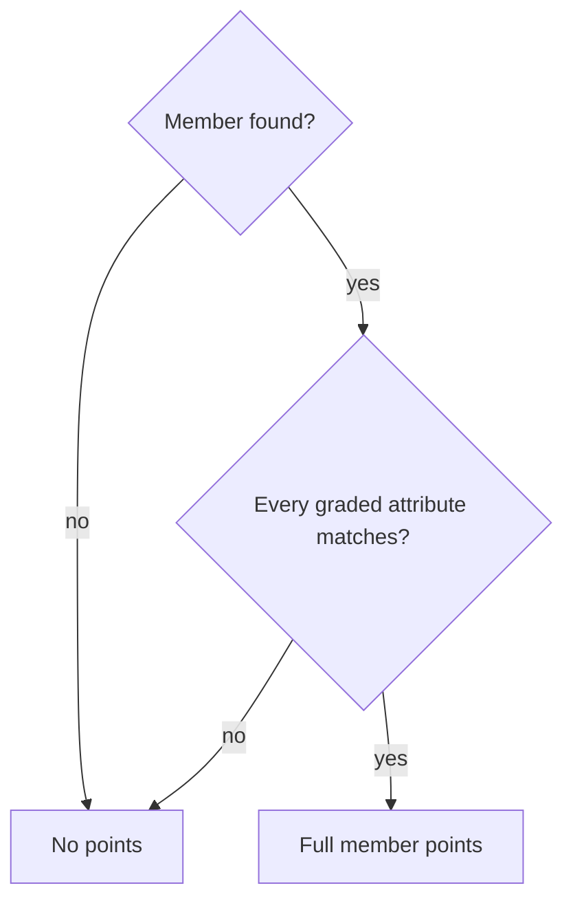
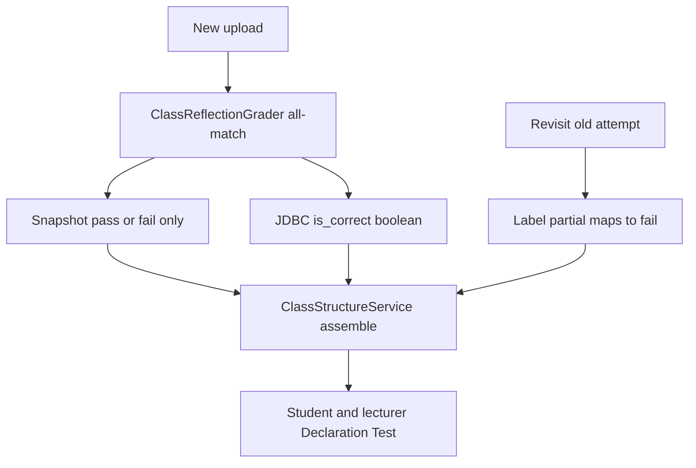

# Declaration All-Or-Nothing Scoring - Plan

## Goal Capsule

- **Objective:** Make Declaration Test all-or-nothing: a Class-tab field, method, or constructor earns its points only when every graded declaration attribute matches; otherwise it earns none.
- **Product authority:** This Product Contract. MMD grading, operational testcases, and submission-history score-band badges are not active scope.
- **Open blockers:** None.
- **Stop conditions:** Stop if the work would re-grade stored attempts, add a lecturer toggle for partial credit, or change MMD or operational-testcase scoring.
- **Execution profile:** Standard. Backend Class-tab scoring plus student and lecturer Declaration Test display.

---

## Product Contract

### Summary

Declaration Test stops awarding leftover points when a member is only partly right. A field with the wrong name, type, or access modifier earns no points, and methods and constructors follow the same any-mismatch-is-zero rule. Students and lecturers see pass or fail only.

### Problem Frame

Declaration Test currently banks a fraction of a member's points when some attributes match and others do not. Lecturers asked for stricter grading: a near-correct field, method, or constructor should not still raise the Class-tab score. MMD members and operational testcases already fail the whole element on any miss, so Declaration Test is the remaining lenient surface.

### Key Decisions

- **All-or-nothing member credit** (session-settled: user-directed — chosen over per-attribute split credit: the request was to make Declaration Test stricter). **Governs R1, R2, R3, R5, R8.**
- **One rule for every Class-tab member** (session-settled: user-approved — chosen over fields-only: "entirely" would otherwise still split credit on methods and constructors). **Governs R1, R2, R3.**
- **Method modifiers zero the member** (session-settled: user-approved — chosen over ignoring `static` / `abstract` / `final`: same any-attribute-wrong rule as type and access on fields). **Governs R2.**
- **Do not rewrite old attempts** (session-settled: user-approved — chosen over re-grading stored submissions: past totals stay until a new upload). **Governs R9, R10.**
- **No partial member mark in the UI** — leftover stored partial flags on old snapshots display as fail, not as a third state. **Governs R6, R7, R10.**
- **Class-card status follows remapped fails** (session-settled: user-approved — chosen over keeping a warning card on old all-partial classes: fail-only). **Governs R6, R7.**

### Actors

- A1. Student — uploads Java and reads Declaration Test pass/fail on the Class tab.
- A2. Lecturer — reads Declaration Test / Declaration Score breakdowns for a student's attempt.
- A3. Grading pipeline — scores Class-tab members on upload and returns those outcomes in the result bundle.

### Requirements

**Member scoring**

- R1. A field earns its full member points only when name, access modifier, and datatype all match the rubric; any of those wrong earns no points.
- R2. A method earns its full member points only when identity (name and parameters) and every graded declaration attribute match, including access modifier, return type, `static`, `abstract`, and `final`; any of those wrong earns no points.
- R3. A constructor earns its full member points only when identity (parameters / default) and every graded declaration attribute match, including access modifier; any of those wrong earns no points.
- R4. A rubric member with no matching student counterpart earns no points.
- R5. On a new upload, Class-tab pillar percentage uses only full credit or none per member; a mismatched member must not raise the percentage by a leftover fraction. Stored attempt totals stay under R9.

**Student and lecturer feedback**

- R6. On the student Declaration Test tab, each field, method, and constructor — and the class card that rolls them up — shows pass or fail only — no partial / warning member or card state.
- R7. On lecturer Declaration Test and Declaration Score views, each field, method, and constructor — and the class card that rolls them up — shows pass or fail only — no partial / warning member or card state.
- R8. A new grade never produces a partial member outcome for Class-tab fields, methods, or constructors.

**Existing attempts**

- R9. Stored attempt totals and per-element correct flags from before this change are not rewritten.
- R10. Revisiting an old attempt that still carries a leftover partial member flag shows that member as fail; the stored numeric score does not change.

**Unchanged pillars and docs**

- R11. MMD grading and operational testcases keep their current all-or-nothing-per-element rules.
- R12. Product descriptions of Declaration Test / class-declaration scoring state all-or-nothing per member, not near-correct partial credit.

### Key Flows

- F1. New upload, mismatched member
  - **Trigger:** A1 uploads a lab whose Class-tab member is present but has at least one wrong declaration attribute.
  - **Actors:** A1, A3
  - **Steps:** Pipeline grades the member as no points and fail; the result bundle and Declaration Test UI show fail; the Class-tab percentage does not include leftover credit for that member.
  - **Covered by:** R1, R2, R3, R5, R6, R8
- F2. New upload, fully matching member
  - **Trigger:** A1 uploads a lab whose Class-tab member matches every graded declaration attribute.
  - **Actors:** A1, A3
  - **Steps:** Pipeline grades the member as full points and pass; student and lecturer views show pass.
  - **Covered by:** R1, R2, R3, R6, R7
- F3. Lecturer inspects Declaration Test
  - **Trigger:** A2 opens a student's Class-tab breakdown.
  - **Actors:** A2
  - **Steps:** Each member is pass or fail only, matching what A1 sees for that attempt.
  - **Covered by:** R6, R7
- F4. Revisit an old attempt
  - **Trigger:** A1 or A2 opens an attempt graded before this change.
  - **Actors:** A1, A2
  - **Steps:** Numeric score stays as stored; a leftover partial member mark renders as fail, not as a third state.
  - **Covered by:** R9, R10

### Acceptance Examples

- AE1. Field, wrong type
  - **Covers R1, R5, R6.**
  - **Given:** Rubric field `private int age`.
  - **When:** The student declares `private String age`.
  - **Then:** The field earns no points and shows fail.
- AE2. Field, wrong access
  - **Covers R1.**
  - **Given:** Rubric field `private int age`.
  - **When:** The student declares `public int age`.
  - **Then:** The field earns no points and shows fail.
- AE3. Field, wrong name
  - **Covers R1, R4.**
  - **Given:** Rubric field `age`.
  - **When:** The student has no field named `age`.
  - **Then:** The rubric field earns no points and shows fail.
- AE4. Field, full match
  - **Covers R1, F2.**
  - **Given:** Rubric field `private int age`.
  - **When:** The student declares `private int age`.
  - **Then:** The field earns full member points and shows pass.
- AE5. Method, wrong `static`
  - **Covers R2.**
  - **Given:** Rubric method `public static int count()`.
  - **When:** The student declares `public int count()` with the same parameters and return type.
  - **Then:** The method earns no points and shows fail.
- AE6. Constructor, wrong access
  - **Covers R3.**
  - **Given:** Rubric constructor `private Foo()`.
  - **When:** The student declares `public Foo()`.
  - **Then:** The constructor earns no points and shows fail.
- AE7. Student and lecturer agree
  - **Covers R6, R7, F3.**
  - **Given:** An attempt with a mismatched field.
  - **When:** A1 views Declaration Test and A2 views Declaration Score for that attempt.
  - **Then:** Both show that field as fail, not as partial.
- AE8. Old attempt score stays
  - **Covers R9, R10, F4.**
  - **Given:** An attempt stored before this change whose Class-tab percentage included leftover member credit.
  - **When:** A1 or A2 reopens that attempt without a new upload.
  - **Then:** The stored numeric score is unchanged, and any leftover partial member mark shows as fail.

### Scope Boundaries

- Do not re-grade or rewrite stored attempts.
- Do not add a lecturer (or student) setting to turn partial credit back on.
- Do not change MMD scoring, including class presence vs type.
- Do not change operational-testcase scoring.
- Do not change submission-history row badges that label overall score bands (`failed` / `partial` / `passed`).
- Do not change class-shell scoring (already all-or-nothing, including Extends/Implements).

### Dependencies / Assumptions

- Assumption: lecturers want this stricter rule on live grading going forward; they did not ask to correct past published scores.
- Assumption: class-shell failure still zeros members, as today.
- Current product docs still describe near-correct partial credit on class declaration (`docs/OBJECTIVES.md`, `docs/HOW_IT_RUNS.md`, `docs/GRADING_WORKFLOWS.md`, `docs/PROGRAM_REPORT.md`); R12 brings those in line.

### Outstanding Questions

- None remaining. Leftover snapshot `"partial"` labels remap at read time (KTD3); stored files are not rewritten.

### Sources / Research

- Class-tab members today use per-attribute accuracy; class shells are already binary: `docs/GRADING_WORKFLOWS.md` §7.3, `docs/HOW_IT_RUNS.md` Class pillar note, `docs/OBJECTIVES.md` specific objective 3.
- MMD members already use all-or-nothing per element; operational testcases already fail the whole testcase on any assertion miss: `docs/GRADING_WORKFLOWS.md` MMD and testcase sections.
- Student tab label is **Declaration Test**; lecturer breakdown title is **Declaration Score**. History row `partial` is a 50–80 overall-score band, not member credit.
- Earlier grading-engine plan made partial credit on declarations a product rule (`docs/plans/2026-08-09-002-feat-grading-engine-rebuild-plan.md` R3); this contract supersedes that rule for Class-tab members.

---

## Planning Contract

### Key Technical Decisions

- KTD1. **Grade-time binary member weight** (session-settled: user-directed — chosen over per-attribute `accuracy()` for Class-tab members: leftover credit is the lenient rule being removed). Instantiates R1, R2, R3, R5, R8. Class-tab members use all-match → 1.0 else 0.0, mirroring MMD member `binaryAccuracy`. Keep `PartialCreditEvaluator.accuracy()` for MMD class presence vs type.
- KTD2. **Display path matches grade path.** `ClassStructureService` member helpers and snapshot labels use the same all-match rule so upload `lab_result` and GET `/class` agree. **Governs R6, R7, R8.**
- KTD3. **Read-time remap of leftover `"partial"` labels** (session-settled: user-approved — chosen over rewriting stored snapshot files: honors R9). `resolveMemberGradeFromLabel("partial")` → fail (`ok` false, `partial` false). Do not mutate `_parsed_snapshot` files. **Governs R9, R10.**
- KTD4. **Class-card status follows remapped fails** (session-settled: user-approved — chosen over keeping a warning card on old all-partial classes: fail-only). `resolveMemberStatus` treats remapped members as fail, so an old all-partial class becomes error, not warning.
- KTD5. **Keep the DTO `partial` boolean.** New grades and remapped old labels emit `false`. Do not remove the field. Frontend still stops rendering a member warning tick (R6, R7).
- KTD6. **Do not rewrite JDBC challenge scores or member `is_correct` rows** for past attempts. New uploads persist binary outcomes via the existing UPSERT. Per R9.

### High-Level Technical Design

Grade-time and display-time must both go binary. JDBC never stored partial; leftover `"partial"` lives only in parsed snapshots.

Attribute lists stay as today; only the reduction changes (ratio → all-match):

| Member | All must match |
|---|---|
| Field | found, access, datatype |
| Method | found, access, return type, static, abstract, final |
| Constructor | found by params, access, default-flag rule |

### Sequencing

1. Binary grader (U1)
2. Snapshot labels + display remap (U2) — same change set as U1
3. Frontend member ticks (U3) — after U2 so the API stops emitting true `partial`
4. Docs (U4)

### Implementation constraints

- Dual logic in `ClassReflectionGrader` and `ClassStructureService` must change together.
- Shell gating and class-shell binary scoring stay as today.
- Frontend has no unit test runner. U3 is `npm run build` plus visual check.
- History row badges that label overall score 50–80 as `partial` are out of scope.

### Assumptions

- Missing snapshot falls back to JDBC `is_correct` (already boolean) or binary recompute; no extra product rule needed.
- Student header Class % on old attempts may still show the stored fractional pillar score while member ticks are fail (AE8). Keep backend `scores.class`; do not invent a second header formula.

---

## Implementation Units

### U1. Binary Class-tab member scoring

**Goal:** A mismatched Class-tab member contributes 0 to the class pillar and is not marked partial.

**Requirements:** R1, R2, R3, R4, R5, R8. Session-settled all-or-nothing via those Rs. KTD1.

**Dependencies:** None

**Files:**
- `backend/src/main/java/com/eiu/capstone/backend/grading/pipeline/ClassReflectionGrader.java`
- `backend/src/main/java/com/eiu/capstone/backend/grading/scoring/PartialCreditEvaluator.java` (javadoc only — keep `accuracy()` for MMD)
- `backend/src/test/java/unit/com/eiu/capstone/backend/grading/pipeline/ClassReflectionGraderTest.java`
- `backend/src/test/java/unit/com/eiu/capstone/backend/grading/scoring/PartialCreditEvaluatorTest.java` (leave fractional tests; they still cover MMD)

**Approach:**
1. For each found field, method, and constructor, score 1.0 only when every existing attribute check is true; otherwise 0.0.
2. Stop setting `Pending*Result.partial` to true. Leave the record field; always false for new grades (KTD5).
3. Do not change class-shell checks or the missing-member 0 path.

**Patterns to follow:** MMD member `PartialCreditEvaluator.binaryAccuracy` in `MmdPillarGrader.java`. Existing attribute lists in `ClassReflectionGrader.java`.

**Test scenarios:**
- Covers AE1: field `private int age` vs student `private String age` → not correct, not partial, member weight 0.
- Covers AE2: field wrong access → not correct, weight 0.
- Covers AE3: missing field name → not correct, weight 0.
- Covers AE4: field full match → correct, weight 1.
- Covers AE5: method correct name/params/return, wrong `static` → not correct, not partial, weight 0.
- Covers AE6: constructor wrong access → not correct, weight 0.
- Shell fail still zeros members (existing gate; no new partial).

**Verification:** `ClassReflectionGraderTest` covers AE1–AE6. `PartialCreditEvaluatorTest` fractional cases still pass for MMD.

---

### U2. Snapshot labels and Class-tab display

**Goal:** Upload assemble and GET `/class` show pass or fail only, including leftover `"partial"` labels on old snapshots.

**Requirements:** R6, R7, R8, R9, R10. KTD2, KTD3, KTD4, KTD6.

**Dependencies:** U1 (same change set)

**Files:**
- `backend/src/main/java/com/eiu/capstone/backend/grading/ParsedSubmissionSnapshotBuilder.java`
- `backend/src/main/java/com/eiu/capstone/backend/service/ClassStructureService.java`
- `backend/src/test/java/support/com/eiu/capstone/backend/service/ClassStructureServiceShellDisplayTest.java`

**Approach:**
1. Snapshot member labels emit only `"pass"` or `"fail"`.
2. `memberGradeFromAccuracy` and `compute*Accuracy` helpers become all-match: never `(false, true)`.
3. `resolveMemberGradeFromLabel("partial")` → fail (KTD3). Do not rewrite snapshot files.
4. `resolveMemberStatus` must not treat remapped leftover-partial as warning (KTD4).
5. Upload assemble and GET `/class` keep using the same helpers.

**Patterns to follow:** Existing snapshot-label → recompute → `correctIds` resolution order in `ClassStructureService.java`. `lab_result` assemble from in-memory rubric (`docs/solutions/architecture-patterns/assemble-lab-result-from-rubric-snapshot.md`).

**Test scenarios:**
- Covers AE8 / R10: snapshot `fieldGrades[id]="partial"` → `ok` false, `partial` false; stored challenge score is not written.
- New grade label is `"fail"` not `"partial"` when attributes mismatch.
- Covers AE7 display half: assemble path and GET `/class` both emit fail for a mismatched field.
- Missing snapshot + JDBC `is_correct` false → fail, `partial` false.
- Class whose members are all remapped leftover-partial → card status error, not warning.

**Verification:** `ClassStructureServiceShellDisplayTest` (or a sibling in the same support package) covers leftover `"partial"` remap and binary recompute. Upload assemble and GET `/class` agree for the same attempt.

---

### U3. Declaration Test pass/fail ticks

**Goal:** Student and lecturer member rows have no warning/minus partial state.

**Requirements:** R6, R7. KTD5.

**Dependencies:** U2

**Files:**
- `frontend/src/components/student/StudentUI.jsx`
- `frontend/src/components/lecturer/ClassScoreBreakdown.jsx`
- `frontend/src/pages/StudentDashboard.jsx`

**Approach:**
1. Member `Tick` and row background: pass or fail only. Treat `partial === true` as fail if it ever appears.
2. Drop `normalizeClassMember` treating partial as a third state, or force it false.
3. Do not change history row `failed` / `partial` / `passed` from overall score (`StudentHistoryPage.jsx` is out of this unit).

**Patterns to follow:** Existing class-shell pass/fail ticks (green check / red X) in `StudentUI.jsx`.

**Test scenarios:**
- Covers AE7: student Declaration Test and lecturer Declaration Score show the same mismatched field as fail, not minus/warning.
- Member with leaked `partial: true` still renders as fail.
- History table still uses 50–80 overall-score `partial` badge.

**Test expectation:** none as automated frontend tests — no runner. `npm run build` must succeed. Manual: AE1 upload plus lecturer drawer; reopen a known pre-change leftover-partial attempt (AE8).

**Verification:** Build succeeds. Visual F1–F4: no orange member minus on Declaration Test; an old all-leftover-partial class card shows fail/error, not warning.

---

### U4. Product docs match all-or-nothing

**Goal:** Written scoring contracts stop promising leftover member credit.

**Requirements:** R12

**Dependencies:** U1, U2

**Files:**
- `docs/OBJECTIVES.md`
- `docs/HOW_IT_RUNS.md`
- `docs/GRADING_WORKFLOWS.md`
- `docs/PROGRAM_REPORT.md`
- `backend/src/main/java/com/eiu/capstone/backend/grading/AGENTS.md`
- `frontend/src/components/student/AGENTS.md`
- `frontend/src/components/lecturer/AGENTS.md` if it still describes member partial
- `docs/solutions/architecture-patterns/nested-class-grading-support.md`
- `CONCEPTS.md` (verify only — edit if Declaration Test wording drifts)

**Approach:**
1. Replace Class-tab member partial-credit wording with all-or-nothing per member.
2. Note leftover snapshot `"partial"` displays as fail; stored scores are not rewritten.
3. Keep MMD class presence vs type as the remaining `accuracy()` consumer.
4. `CONCEPTS.md` Declaration Test already matches — keep it consistent.

**Test expectation:** none — documentation.

**Verification:** DOX pass on touched AGENTS.md files. Grep for Class-tab / declaration "partial credit" no longer describes live member scoring.

---

## Verification Contract

| Command | Applies to | Purpose |
|---|---|---|
| `cd backend && mvn test -Dtest=ClassReflectionGraderTest,ClassStructureServiceShellDisplayTest,PartialCreditEvaluatorTest` | U1, U2 | Binary members, leftover label remap, MMD accuracy helper still works |
| `cd backend && mvn test` | All backend units | Full regression |
| `cd frontend && npm run build` | U3 | SPA compiles |
| Manual student upload + lecturer drawer + reopen old attempt | U1–U3 | AE1–AE8 end to end |

---

## Definition of Done

- Every R1–R12 is covered by a U-ID, a test scenario, or an explicit non-goal.
- New uploads: mismatched name, type, access, or method modifier → member score 0 and fail tick.
- Student Declaration Test and lecturer Declaration Score agree on pass/fail for the same attempt.
- Old attempt numeric scores unchanged; leftover `"partial"` labels show as fail.
- History overall-score band badges unchanged.
- `mvn test` from `backend/` and `npm run build` from `frontend/` succeed.
- Grading AGENTS.md and OBJECTIVES no longer promise Class-tab member partial credit.

### Deferred to Follow-Up Work

- Strip leftover `"partial"` strings from stored snapshot files (read-time remap is enough for R10).
- Remove the DTO `partial` field once no clients read it.
- Capture a `docs/solutions/` learning for Declaration all-or-nothing after ship.

