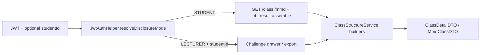

# Student DisclosureMode Display - Plan

*(Seeded from ce-ideate: `docs/ideation/2026-09-11-anti-answer-leakage-grading-ideation.html`, idea "DisclosureMode Student Assembler")*

## Goal Capsule

- **Objective:** Stop student-facing Class and MMD result tabs from revealing rubric expected values when a student submits empty or incomplete work. Grade and score behavior stays unchanged; only **display assembly** adopts a student-safe disclosure mode with generic failure messages for missing or wrong components.
- **Product authority:** This Product Contract supersedes the **student-facing** missing-item rule in `docs/plans/2026-08-10-001-feat-student-parsed-result-tabs-plan.md` (R7: "missing items show rubric expected label"). Lecturer views retain full rubric checklist semantics. Scoring, plagiarism, testcase hidden-row behavior, and compile-error surfacing are unchanged in intent.
- **Open blockers:** None for requirements — ready for `ce-plan`.

## Product Contract

### Summary

Introduce a **DisclosureMode** on result-tab assembly: **STUDENT** mode never emits rubric-shaped labels for elements the student did not submit; **LECTURER** mode keeps today's full rubric checklist with expected names, types, and signatures. Students still see pass/fail/partial status and aggregate score pills; missing rubric members show generic messages such as "Required member not found" or "Missing or wrong variable or data" without naming the expected field, method, relation, or type.

### Problem Frame

Student A uploads an empty or stub file. After grading, the Class and MMD tabs list the **entire lab rubric** with ✗ marks. Because `ClassStructureService` falls back to rubric labels when the parsed submission snapshot has no entry, the UI effectively prints the answer key — field names, data types, method signatures, MMD relation endpoints. Student A can copy-paste without reasoning. Scoring is already correct; the leak is display-only, concentrated in `snapshotAttributeName(..., rubricFallback)` and the Class tab `else` branches that emit rubric `name` / `scope` / `dataType` / `returnType` when snapshot entry is null.

### Key Decisions

- **Display-only fix; scoring unchanged** (session-settled: user-directed — chosen over re-grading or hiding scores: preserves existing pillar math and persistence). **Governs R1, R2.**
- **DisclosureMode STUDENT | LECTURER on assembly** (session-settled: ideation + user scenario — chosen over frontend-only redaction: API must not ship rubric strings to student clients). **Governs R3–R6.**
- **Missing snapshot entry → generic placeholder, never rubric label (student mode)** (session-settled: user-directed — reverses 2026-08-10 R7 for students; chosen over omitting rows entirely: keeps rubric-scoped checklist shape and ✗ counts). **Governs R7–R10.**
- **Submitted-but-wrong → show student-parsed text + generic attribute hint (student mode)** (session-settled: user-directed — chosen over hiding wrong submissions: student sees their own mistake category without expected value). **Governs R11.**
- **Lecturer drawer and export keep full rubric labels for missing items** (session-settled: ideation Idea 4 — chosen over one opaque view for all roles: lecturers need teaching/review context). **Governs R12–R13.**
- **Upload `lab_result` and GET revisit paths share STUDENT mode for student JWT** (session-settled: direct evidence of dual paths with identical fallback today). **Governs R14.**
- **MMD relations without snapshot → generic relation failure, no rubric from/to/type (student mode)** (session-settled: user-directed — MMD is highest-leak surface). **Governs R15.**
- **Generic message taxonomy is fixed and small** (session-settled: user example — "Missing or Wrong Variable or data" and siblings; not free-form grader strings that echo expected values). **Governs R16.**

### Actors

- A1. **Student** — uploads (including empty/stub), views Class/MMD tabs after in-session upload or from history APIs.
- A2. **Lecturer** — reviews student submissions in challenge drawer; needs full rubric checklist.
- A3. **Grading pipeline** — continues to score against full rubric; supplies snapshot and correct-id outcomes only (no behavior change required for this feature's scope).

### Requirements

**Disclosure policy**

- R1. Pillar scoring (Class reflection, MMD compare, operational testcases) and stored `submission_*_result` rows are unchanged by this feature.
- R2. Only student-facing **display DTOs** (`ChallengeDetailBundleDTO` class/MMD trees, upload `lab_result` bundles for student sessions) adopt STUDENT disclosure rules.
- R3. Assembly accepts `DisclosureMode.STUDENT` or `DisclosureMode.LECTURER`.
- R4. Student-authenticated reads (`GET /class`, `GET /mmd`, upload response `lab_result` consumed by student dashboard) use `DisclosureMode.STUDENT`.
- R5. Lecturer-authenticated reads that show a specific student's breakdown (challenge drawer with `studentId`, lecturer export derived from breakdown) use `DisclosureMode.LECTURER`.
- R6. The same underlying grading outcomes (ok/partial/fail flags, score pills) are available in both modes; only **display text** differs.

**Class tab — student mode**

- R7. For each rubric-scoped class, field, constructor, and method row, when the parsed submission snapshot has **no entry** for that element, the row shows a generic label (e.g. "Required member") and generic failure state — **not** rubric `name`, `scope`, `dataType`, `returnType`, or parameter list.
- R8. When the student's class file failed to compile for that rubric class, existing compile-error card behavior remains; member rows stay gated to fail without rubric fallback labels.
- R9. When class shell checks fail, member rows remain all-fail as today, but still without rubric fallback labels in student mode.
- R10. Score pills and class card status (`success` / `warning` / `error` / `info`) reflect the same aggregates as today.

**Class tab — submitted-but-wrong**

- R11. When snapshot **has** an entry but the element is wrong or partial, student mode shows the **student-parsed display text** (existing snapshot behavior) plus a generic hint by failure category (e.g. "Missing or wrong variable or data", "Missing or wrong scope or modifier") — never the rubric expected value side-by-side.

**MMD tab — student mode**

- R12. When snapshot has no attribute entry, student mode shows generic stereotype/field/constructor/method failure text — not rubric-formatted signatures from `formatFieldName` / `formatMethodName` fallbacks.
- R13. When snapshot has no relation entry, student mode shows a generic relation failure (e.g. "Required relationship not found" or "Relationship mismatch") — **not** rubric source class, target class, or relation type names.
- R14. When MMD file was not submitted, existing "Missing MMD file" / class-level messages remain; stereotype rows must not reveal rubric declaring type via `<<class>>` fallback when no student stereotype was captured.

**Surfaces and paths**

- R15. Upload-time `lab_result.challenge_N.class` and `.mmd` for student dashboard use STUDENT mode (same semantics as GET revisit).
- R16. Student history flows that load `/class` or `/mmd` without an in-session upload cache use STUDENT mode from the API — not client-side redaction.
- R17. Lecturer Class/MMD tabs and challenge export incorrect rows use LECTURER mode — missing items may still show rubric expected labels for instructional review.

**Message taxonomy (student mode)**

- R18. Generic messages are drawn from a fixed set; backend must not echo rubric strings inside generic messages.
- R19. Minimum categories: **not submitted / not found**, **wrong variable or data**, **wrong scope or modifier**, **relationship mismatch**, **class missing from diagram** (reuse or align with existing strings where already generic).
- R20. Parse errors (`mmd.parseError`) may remain specific to syntax (student's file) but must not inject rubric member names.

**Non-goals (this feature)**

- NG1. Changing hidden operational testcase I/O rules.
- NG2. Post-deadline automatic reveal of expected rubric values to students.
- NG3. Persisting snapshots to Postgres (separate ideation survivor; may follow later).
- NG4. Omitting rubric-scoped rows entirely (checklist shape preserved; content redacted).

### Key Flows

- F1. **Empty Java upload — student sees no answer key**
  - **Trigger:** Student uploads a challenge folder with empty or missing `.java` for a rubric class.
  - **Actors:** A1
  - **Steps:** Grading scores 0% correctly; assembly runs in STUDENT mode; Class tab lists rubric-scoped rows with generic placeholders and ✗; no rubric field/method signatures appear.
  - **Covered by:** R1, R4, R7, R10

- F2. **Wrong field submitted — student sees own text only**
  - **Trigger:** Student declares `private String name` when rubric expects `private int age`.
  - **Actors:** A1
  - **Steps:** Snapshot captures student member text; row shows `name: String` with generic hint; row does **not** show `age: int`.
  - **Covered by:** R11, R6

- F3. **Lecturer review — full checklist preserved**
  - **Trigger:** Lecturer opens View on a student with incomplete submission.
  - **Actors:** A2
  - **Steps:** Assembly runs in LECTURER mode; missing rows show rubric expected labels with ✗ as today.
  - **Covered by:** R5, R17

- F4. **MMD empty file — no relation graph leak**
  - **Trigger:** Student submits blank `.mmd` or omits file.
  - **Actors:** A1
  - **Steps:** MMD pillar scores low; student MMD tab shows generic class/relation failures without rubric endpoint names.
  - **Covered by:** R13, R14

### Acceptance Examples

- AE1. **Empty class file**
  - **Covers R7, F1.**
  - **Given:** Rubric expects `Person` with three members; student uploads empty `Person.java`.
  - **When:** Student opens Declaration Test tab after upload.
  - **Then:** Rows exist for rubric scope but labels are generic placeholders; no `age`, `int`, or method signatures from rubric appear anywhere in the JSON or UI.

- AE2. **Lazy empty MMD**
  - **Covers R13, F4.**
  - **Given:** Rubric defines `Car --|> Vehicle`; student submits empty `.mmd`.
  - **When:** Student opens MMD tab.
  - **Then:** No row displays `Vehicle` or inheritance arrow type from rubric as the student's relation; generic failure only.

- AE3. **Lecturer still sees expected**
  - **Covers R17, F3.**
  - **Given:** Same submission as AE1.
  - **When:** Lecturer opens Class tab in challenge drawer.
  - **Then:** Missing members show rubric expected labels with ✗ (today's behavior).

- AE4. **Scores unchanged**
  - **Covers R1, R10.**
  - **Given:** AE1 submission.
  - **When:** Compared to pre-feature grading for same upload.
  - **Then:** Challenge and pillar scores match exactly; only display strings differ.

### Scope Boundaries

**In scope**

- `DisclosureMode` parameter through Class/MMD display assembly (upload bundle + GET tabs).
- Student generic message taxonomy.
- Lecturer path explicitly on LECTURER mode.
- Regression tests asserting no rubric-shaped strings in STUDENT-mode serialized DTOs (recommended in planning).

**Deferred**

- Durable Postgres snapshot storage (ideation #7).
- Student UI tri-state card redesign beyond message taxonomy (ideation #5 — can ship incrementally).
- Post-deadline hint unlock.

**Outside identity**

- Changing rubric authoring, plagiarism, or auth.

### Dependencies / Assumptions

- Parsed submission snapshots continue to be captured at grade time for present elements (`ParsedSubmissionSnapshotBuilder`).
- Student vs lecturer role is known at controller/service boundary (existing JWT role checks).
- `StudentUI` continues to render backend-provided strings; student-safe strings are produced server-side.

### Success Criteria

- SC1. A student with an empty submission cannot reconstruct the rubric answer key from Class or MMD tab content alone.
- SC2. A student with partial submission sees only their own parsed text for present wrong members, plus generic hints — never expected rubric values.
- SC3. Lecturer review workflow retains full expected-value checklist for missing items.
- SC4. No change in numeric scores for any fixture lab compared before/after.

### Definition of Done (requirements phase)

- Product Contract reviewed and accepted.
- `ce-plan` enriches this artifact to `implementation-ready` with verification contract and file-level tasks.
- AGENTS.md updated for display disclosure rules after implementation (not in this requirements doc).

**Product Contract preservation:** unchanged

---

## Planning Contract

### Key Technical Decisions

- **KTD1. Thread `DisclosureMode` through assembly, not the frontend** (session-settled: user-directed — chosen over client redaction: API must not ship rubric strings). Governs R3–R6, R15–R16. Resolve mode at controller boundary via `JwtAuthHelper.resolveDisclosureMode`: `LECTURER` when principal has lecturer role **and** `studentId` query param is present; otherwise `STUDENT`. Upload `lab_result` always passes `DisclosureMode.STUDENT`.
- **KTD2. Redact in `ClassStructureService` builders** — replace rubric fallbacks in `buildClassData` / `buildClassDataFromRubric` and MMD attribute/relation assembly when snapshot entry is absent and mode is `STUDENT`. Use `StudentDisplayMessages` constants; scoring paths unchanged.
- **KTD3. Backward-compatible overloads** — existing callers without `DisclosureMode` default to `LECTURER` so lecturer/export tests keep rubric checklist semantics.

### High-Level Technical Design

### Implementation Units

### U1. Disclosure primitives

**Goal:** Introduce mode enum and generic student message constants.

**Requirements:** R3, R18

**Files:** `backend/src/main/java/com/eiu/capstone/backend/service/DisclosureMode.java`, `backend/src/main/java/com/eiu/capstone/backend/service/StudentDisplayMessages.java`

**Verification:** Types compile; constants match product taxonomy.

### U2. Mode resolution at API boundary

**Goal:** Pass disclosure mode from controllers and upload assembler.

**Requirements:** R4, R5, R14–R17

**Dependencies:** U1

**Files:** `backend/src/main/java/com/eiu/capstone/backend/security/JwtAuthHelper.java`, `backend/src/main/java/com/eiu/capstone/backend/controller/ChallengeController.java`, `backend/src/main/java/com/eiu/capstone/backend/grading/LabResultAssembler.java`

**Verification:** Lecturer drawer with `studentId` → `LECTURER`; student dashboard → `STUDENT`; upload bundle → `STUDENT`.

### U3. Class/MMD assembly redaction

**Goal:** Redact rubric-shaped labels in `STUDENT` mode when parsed snapshot has no entry.

**Requirements:** R7–R13, R19

**Dependencies:** U1, U2

**Files:** `backend/src/main/java/com/eiu/capstone/backend/service/ClassStructureService.java`

**Execution note:** Add failing anti-leak tests before or alongside builder changes.

**Test scenarios:**
- Covers AE1. Empty class rubric member → generic `Required member` / `—` placeholders, no `age`/`int`.
- Covers AE2. Missing MMD relation → placeholder from/to/relType, no `Vehicle`/inheritance type from rubric.
- Covers AE3. Same fixture in `LECTURER` mode → rubric labels preserved.
- Wrong-but-submitted member → student-parsed text retained, rubric expected value absent.

**Files (tests):** `backend/src/test/java/support/com/eiu/capstone/backend/service/ClassStructureServiceDisclosureTest.java`

**Verification:** `mvn test` from `backend/` green.

### U4. Documentation

**Goal:** Record disclosure contract in service AGENTS.

**Requirements:** Definition of Done

**Dependencies:** U3

**Files:** `backend/src/main/java/com/eiu/capstone/backend/service/AGENTS.md`, `backend/AGENTS.md`

## Verification Contract

- `backend/`: `mvn test` — all tests pass including `ClassStructureServiceDisclosureTest`.
- Manual: student upload empty Java/MMD → Class/MMD tabs show generic rows, no rubric signatures; lecturer drawer for same submission shows full checklist.

## Definition of Done

- [x] U1–U3 implemented; backend tests green (303 tests).
- [x] Plan enriched to `implementation-ready`.
- [x] Service AGENTS note disclosure rules.
- [ ] Optional follow-up: frontend hint polish in `StudentUI.jsx` (deferred).
