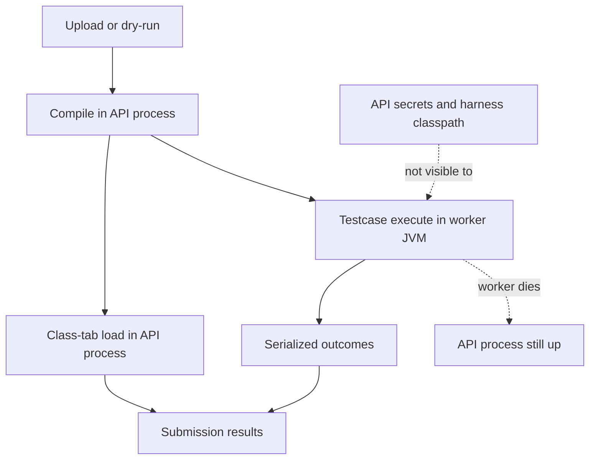
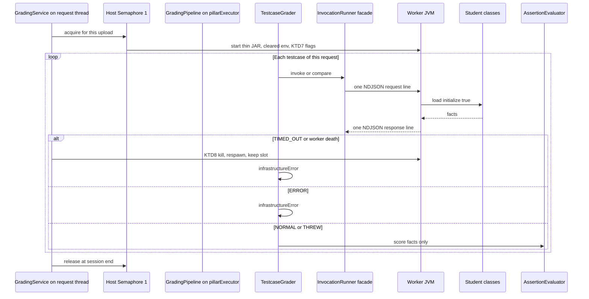
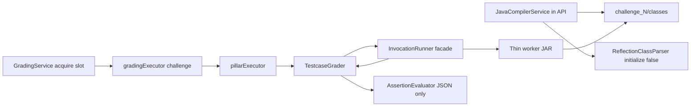

# Isolated Testcase Worker - Plan

## Goal Capsule

- **Objective:** Run operational testcase execution in a worker JVM so commonly known crash techniques cannot take down the API, a looping invoke is stopped without stalling other testcases, a hostile upload still completes with contained errors, and that worker does not inherit API secrets, load the grading harness, or capture stdout without bound.
- **Product authority:** This Product Contract. Container sandboxing, moving compile out of the API, and moving Class-tab load into a worker are surrounding thesis stages, not active scope.
- **Open blockers:** None.
- **Stop conditions:** Do not introduce per-submission containers. Do not move javac or Class-tab grading into the worker. Do not claim a filesystem or network jail. Do not require coverage of every exotic kill.
- **Execution:** Code. Prove crash, hang-kill, spawn hardening, and ordinary pass/fail with backend tests. `ce-work` owns the shipping tail.
- **Product Contract preservation:** IDs unchanged. Product Outstanding Questions (worker lifetime, IPC, upload-wait, ERROR vs FAILED, stdout cap) → KTD1–KTD6. Confirmed Render one-worker slot → KTD2. Env allowlist is not host secret safety → KTD12.

---

## Product Contract

### Summary

Operational testcases, including lecturer dry-run, execute target classes (student submission or dry-run reference) in a worker JVM that can die without terminating the API.
That worker starts from an allowlisted environment, does not load the grading harness, and caps captured stdout by truncation.
Class-tab grading and compile stay in the API process because they do not run student methods or static initializers.
A hostile or looping submission still finishes as contained testcase errors; later testcases of that submission and other requests keep going.

### Problem Frame

Student bytecode for operational testcases currently runs in the same JVM that serves the API.
The student classloader’s parent is the API, so invoked code can see harness types and process environment (`JWT_SECRET`, database password, mail keys).
Stdout is captured into an unbounded buffer.
A per-invocation timeout already exists, but a cooperative cancel cannot stop a tight CPU loop, and that hung worker blocks every other testcase invoke.
`System.exit`, `halt`, OOM, and stack overflow in student invoke can kill or stall the shared backend.
No production incident has been recorded; this work is preventative hardening.

### Key Decisions

- **Isolated worker process as this deliverable** (session-settled: user-directed — chosen over container sandbox and over treating the remaining staged path as one program: per-invocation timeout already ships, containers are a later thesis stage). **Governs R1, R5.**
- **Invoke-only isolation** (session-settled: user-directed — chosen over bytecode-out and over compile-and-run: Class-tab loads classes without initializing them, so crash techniques fire on testcase invoke). **Governs R1–R4.**
- **Preventative hardening** (session-settled: user-directed — chosen over waiting for an incident: no concrete crash on record).
- **Contained completion for the hostile upload** (session-settled: user-approved — chosen over letting that request die as long as the API process lives). **Governs R9, R10.**
- **Hang-kill is in scope** (session-settled: user-approved — chosen over treating only JVM death as success: a tight loop can stall all testcases without crashing). **Governs R6, R7.**
- **Spawn-time hardening with the worker** (session-settled: user-directed — chosen over crash-only and over reopening a disk/network/FS sandbox: a worker that still sees API secrets and the harness classpath would copy today’s worst holes). **Governs R12, R13, R14, R15.**

<!-- ce-section: work-relationships -->
### How This Work Fits Together

This plan owns **isolated testcase invoke** (thesis stage 2, invoke-only), including spawn-time hardening on that worker.
The broader sandboxing breakdown below is the current understanding, not a committed roadmap.

- Per-invocation timeout (thesis stage 1)
  - **Shares** the same operational-testcase path; already shipped.
  - **Enables** this work: the time bound still applies, now as a killable worker rather than a cooperative thread interrupt (R7).
- Isolated testcase worker (this plan)
- Class-tab bytecode-out
  - **Can proceed independently of** this plan later if Class-tab starts initializing or invoking student classes in the API.
  - **Still to decide** whether loader-only isolation is ever worth the extra seam.
- Compile-out and container sandbox (thesis stage 3)
  - **Can proceed independently of** this plan.
  - **Depends on** a later product decision that filesystem, network, and host resource limits are in scope.

### Actors

- A1. Student — uploads Java that may be hostile or accidentally unbounded; reads Class-tab and testcase results.
- A2. Other API users — students and lecturers whose in-flight and later requests must survive A1's invoke.
- A3. Lecturer — dry-runs an operational testcase against reference Java on the same invoke path.
- A4. Isolated testcase worker — loads and executes operational testcase target classes (student submission or dry-run reference) without the API classpath or API secrets; may be killed without terminating the API.

### Requirements

**Isolation boundary**

- R1. Operational testcase execution of target classes (student submission or dry-run reference) runs in a process other than the API process. That includes SINGLE_INVOCATION load and invoke, COMPARISON construct/equals/compareTo, and any post-invoke scoring that would otherwise use live student instances. The API consumes only serialized outcomes and must not initialize or invoke those classes to score.
- R2. Lecturer operational-testcase dry-run uses the same isolated execute path as student upload grading.
- R3. Class-tab / Declaration grading stays in the API process while it does not initialize or invoke student classes.
- R4. Student Java compile stays in the API process.



**Crash containment**

- R5. Target bytecode that would terminate a JVM — including `System.exit`, `halt`, out-of-memory, and stack overflow — must not terminate the API process.
- R6. A tight infinite loop in a student invoke must not stall other submissions' testcases; the worker and any OS processes spawned during that invoke are stopped, and that invoke fails contained.
- R7. The existing per-invocation time bound still applies; on expiry the worker-side invoke is stopped, not only cooperatively interrupted.
- R8. Coverage of every exotic kill, including native crashes, is not required.

**Results and availability**

- R9. The submitting student's HTTP request still completes; a worker kill or timeout fails only that invoke as a contained error; later testcases of the same submission still run.
- R10. Other in-flight and subsequent API requests continue while a worker is killed or times out.
- R11. Class-tab, MMD, compile, and scoring intent for that submission stay unchanged except where testcases record a contained error because the worker invoke was stopped or the worker process died.

**Worker spawn hardening**

- R12. The worker does not inherit the parent environment. It starts with an explicit allowlist of non-secret variables required to run the JVM.
- R13. The worker does not load the API or grading-harness classpath, so target bytecode cannot see or patch grader types or the worker's own agent/IPC types.
- R14. Captured student stdout cannot grow without bound. Hitting the bound truncates captured output, completes the invoke, and leaves pass/fail to the assertions; the result shows that output was truncated. A testcase does not fail solely because student code printed too much.
- R15. Every channel from the worker to the API is untrusted, size-bounded input. Pass/fail decisions and hidden-test expected values stay in trusted API-side code that target bytecode cannot reach.

### Key Flows

- F1. Ordinary testcase execute
  - **Trigger:** Upload grading or lecturer dry-run reaches an operational testcase.
  - **Actors:** A1 or A3, A4
  - **Steps:** Compile and Class-tab run in the API process; the worker loads the target class with initialization, runs SINGLE_INVOCATION or COMPARISON under the existing time bound, and returns serialized outcomes plus captured output; the API scores from those outcomes without initializing target classes.
  - **Outcome:** Testcase result matches today's pass/fail/error meaning when target code behaves.
  - **Covered by:** R1, R2, R3, R4, R7, R15

- F2. Target code kills the worker
  - **Trigger:** Execute hits `System.exit`, `halt`, OOM, or stack overflow.
  - **Actors:** A1, A2, A4
  - **Steps:** The worker process dies; spawned OS children of that invoke are stopped; the API process stays up; only that testcase is a contained error; later testcases of the same submission still run; the student's request still returns.
  - **Outcome:** A2's requests continue.
  - **Covered by:** R5, R6, R9, R10

- F3. Tight infinite loop
  - **Trigger:** Target invoke spins without returning, including in a child OS process started during the invoke.
  - **Actors:** A1, A2, A4
  - **Steps:** The time bound expires; the worker and spawned OS processes for that invoke are stopped; that invoke fails contained; later testcases of the same submission and of other submissions still run.
  - **Outcome:** The shared grader is not stuck on one loop.
  - **Covered by:** R6, R7, R9, R10

- F4. Secret or harness probe
  - **Trigger:** Invoked target code reads process environment or tries to load a grader or worker-agent type.
  - **Actors:** A1, A4
  - **Steps:** The worker environment is an allowlist, not a copied parent env; harness and worker-agent types are not on the classpath.
  - **Outcome:** The probe does not reveal credentials or let target code patch the grader.
  - **Covered by:** R12, R13

- F5. Stdout flood
  - **Trigger:** Invoked target code writes a very large amount to stdout.
  - **Actors:** A1, A4
  - **Steps:** Capture truncates at the bound; the invoke completes; assertions still decide pass/fail; the result shows truncation.
  - **Outcome:** API memory is not exhausted by the buffer; a chatty correct test still passes.
  - **Covered by:** R14, R9

### Acceptance Examples

- AE1. `System.exit` in a tested method
  - **Covers R5, R9, R10.**
  - **Given:** A compiled student class whose invoked method calls `System.exit`.
  - **When:** Upload grading runs that operational testcase.
  - **Then:** The API process is still serving requests; the student's response completes; that testcase is a contained error; later testcases of the same submission still run.

- AE2. `static { System.exit(0); }` with Class-tab only
  - **Covers R3, R11.**
  - **Given:** A compiled student class with a static initializer that calls `System.exit`, and no operational testcase initializes that class.
  - **When:** Class-tab / Declaration grading runs.
  - **Then:** Class-tab completes in the API process without terminating it.

- AE3. Tight CPU loop
  - **Covers R6, R7, R9, R10.**
  - **Given:** An invoked method that loops without parking or returning, or a child OS process started during the invoke that does the same.
  - **When:** The per-invocation time bound expires.
  - **Then:** The worker and those spawned processes are stopped; that testcase is a contained error; later testcases of the same submission and of a later submission still run.

- AE4. Lecturer dry-run crash
  - **Covers R2, R5.**
  - **Given:** Dry-run reference Java whose invoked method calls `System.exit`.
  - **When:** The lecturer runs dry-run.
  - **Then:** The API process stays up; the preview reports a contained error.

- AE5. Ordinary passing testcase
  - **Covers R1, R11.**
  - **Given:** Target code that returns the expected value within the time bound.
  - **When:** Upload grading runs the testcase.
  - **Then:** Pass/fail matches today's assertion meaning; Class-tab and MMD for that challenge are unchanged.

- AE6. Environment secret probe
  - **Covers R12.**
  - **Given:** Invoked target code reads process environment for API credential names.
  - **When:** Upload grading runs that testcase.
  - **Then:** Those secrets are absent because the parent environment was not copied.

- AE7. Harness type probe
  - **Covers R13.**
  - **Given:** Invoked target code tries to load a grading-harness type or a worker agent/IPC type.
  - **When:** Upload grading runs that testcase.
  - **Then:** The type is not visible on the worker classpath.

- AE8. Unbounded stdout
  - **Covers R14, R9.**
  - **Given:** Invoked target code writes far more stdout than a normal testcase, but assertions would otherwise pass.
  - **When:** Upload grading runs that testcase.
  - **Then:** Capture is truncated and marked truncated; the invoke completes; the testcase still passes; the student's request still completes.

- AE9. `System.exit` during COMPARISON
  - **Covers R1, R5, R15.**
  - **Given:** A comparison testcase whose student `equals` or `compareTo` calls `System.exit`.
  - **When:** Upload grading runs that testcase.
  - **Then:** The worker dies or is stopped; the API process stays up; that testcase is a contained error; pass/fail was not taken from worker-forged text.

### Scope Boundaries

**Deferred for later**

- Ephemeral container sandbox with CPU, memory, network, and filesystem limits.
- Moving javac compile into the worker.
- Moving Class-tab class load into the worker.

**Out of scope**

- Intra-challenge compile isolation (scoring when one class fails to compile).
- Changing Class-tab, MMD, or testcase scoring formulas except contained invoke errors (R11).
- Guaranteeing the API survives every exotic kill (R8).
- Filesystem jail, outbound network block, and container-escape hardening (stage 3).
- Zip-bomb defense (upload is a multipart folder of `.java` / `.mmd`, not archive extract).
- Stopping students from hardcoding answers to visible example tests (hidden tests already withhold I/O).
- Timing side channels on hidden tests.
- Treating fake `PASSED` text in stdout as a scoring bug (parsed results already ignore it).
- Distinct student-facing ERROR vs FAIL restyling beyond today's status and feedback strings.

### Dependencies / Assumptions

- Per-invocation timeout already ships and remains the time bound (R7).
- Class-tab loads student classes without initializing them, so static initializers and methods do not run on that path.
- Testcase execute initializes target classes and then calls constructors, methods, and comparison operations.
- Today's student classloader parent is the API classloader (`InvocationRunner`).
- Stdout capture is currently unbounded.
- No production crash incident is on record; the work is preventative.
- If Class-tab later initializes or invokes student classes in the API process, this contract no longer covers that path.
- Production host is Linux Docker on Render (~512MB shared cgroup). Windows is a development host only for R6 tree-kill.

### Outstanding Questions

None remaining at product level. Planning resolutions are KTD1–KTD12.

### Sources / Research

- Current in-process invoke, timeout, and documented no-sandbox limits: `docs/solutions/architecture-patterns/operational-testcase-grading.md`
- Timeout and executor topology: `docs/GRADING_WORKFLOWS.md`, `docs/plans/2026-08-11-001-feat-operational-testcase-grading-plan.md`
- Testcase invoke (initialize on) versus Class-tab load (initialize off): `backend/src/main/java/com/eiu/capstone/backend/grading/testcase/InvocationRunner.java`, `backend/src/main/java/com/eiu/capstone/backend/grading/ReflectionClassParser.java`
- Student classloader parent is the API; stdout buffer is unbounded: `backend/src/main/java/com/eiu/capstone/backend/grading/testcase/InvocationRunner.java`
- Lecturer dry-run shares the same grader: `backend/src/main/java/com/eiu/capstone/backend/service/TestcaseDryRunService.java`
- Intra-challenge compile isolation is a different meaning of isolation: `docs/plans/2026-09-08-002-feat-intra-challenge-compile-isolation-plan.md`

---

## Planning Contract

### Key Technical Decisions

- KTD1. **One worker JVM per upload or dry-run** (session-settled: user-approved — chosen over a new JVM per testcase and over a shared pool across students: spawn cost once per HTTP grading request; leftover student classes do not leak across students). Session owner is `GradingService` (upload) or `TestcaseDryRunService` (dry-run), above `TestcaseGrader.evaluate`. Parallel challenges of one upload share that JVM and hold the KTD2 slot for the whole request. Sequential testcases reuse the process under a per-worker invoke mutex so pillar threads cannot interleave NDJSON. After death or timeout, respawn **without releasing the slot** so another upload cannot steal it; later testcases of that request still run (R9). Release the slot only when the session ends. Mutable static state across testcases of the same request is an accepted stage-2 integrity residual, not cross-student isolation. **Governs R1, R9.**
- KTD2. **At most one worker JVM at a time on the API host** (session-settled: user-approved — chosen over two concurrent workers: API plus worker must fit the Render ~512MB shared cgroup). Other uploads wait for the slot. They do not wait forever on a hung invoke because KTD8 stops the occupant. Slot wait is extra upload latency under concurrent load; log it, do not treat it as a deadlock. **Governs R6, R10.**
- KTD3. **Ship a classified thin worker JAR, not a second main on the API fat JAR.** `PropertiesLauncher` still loads `BOOT-INF/lib` and would expose Spring and harness types (R13). Same Maven module. Classifier includes `...grading.testcase.worker`, the Spring-free **kernel** package (`JsonValueCoercer` / `ValueComparator` or equivalent), and the non-Spring rubric/model types the engine needs to compile. Kernel and rubric types are never on the student `URLClassLoader` URL list. Prove the thin JAR is self-contained with a package/launch check. API `InvocationRunner` is an IPC facade only: no student `Class.forName` and no `System.setOut` in the API JVM. Docker copies the worker JAR by explicit name. **Governs R13.**
- KTD4. **NDJSON facts only, size-bounded before parse.** Exactly one request line and one response line per invoke. Extra lines, malformed JSON, wrong types, or oversize lines are IPC `ERROR`, not PASS. Worker writes IPC on the process stdin/stdout streams retained **before** `System.setOut` redirect. Student captured output goes only to `BoundedStdout`. Worker stderr is logs only, drained with a **65536-byte cap** (discard after cap); KTD6 does not cover stderr. Parse untrusted NDJSON with no default typing and a max nesting depth; depth/parse failures are IPC `ERROR`. Worker returns observations (`kind`, JSON values, field snapshots, stdout, truncation flag, exception simple names, comparison result, worker error). Forbid scoring keys (`passed`, score, expected values); ignore them if present. Do not use Java serialization. **Governs R15, AE9.**
- KTD5. **Keep today's ERROR / THREW split.** Timeout, worker death, and IPC failure map to `InvocationOutcomeKind.TIMED_OUT` or `ERROR` and `TestcaseGrader.infrastructureError` (no assertion child rows). Serialized student throws stay `THREW` and go through `AssertionEvaluator`. Distinct `feedback` strings for timeout vs worker stopped vs IPC failure. No new result enum. **Governs R9, R11.**
- KTD6. **Stdout cap is 65536 bytes.** Truncate, set the truncation flag, complete the invoke, let assertions decide pass/fail. Visible test `actual_display` / stdout actual includes a truncation suffix. Hidden tests stay pass/fail only. IPC line cap is 524288 bytes including snapshots. **Governs R14, AE8.**
- KTD7. **Worker JVM flags:** `-Xmx64m -XX:MaxMetaspaceSize=48m -XX:+ExitOnOutOfMemoryError`. Explicit absolute heap, not container-percentage defaults. Combined API plus worker RSS still shares one cgroup; this is not a memory jail. Document API `-Xmx` headroom in `backend/DEPLOY_RENDER.md`. **Governs R5.**
- KTD8. **Kill the process tree.** On timeout or after unexpected worker death: snapshot `ProcessHandle.descendants()`, `destroyForcibly` deepest-first, then the worker root, then `waitFor` with a short grace. Keep the KTD2 slot held (KTD1). Linux production must stop the child OS process in AE3. Windows is best-effort `destroyForcibly`. Do not use `Future.cancel(true)` as the kill. Tree-kill is best-effort against fork storms and reparenting (R8); invoke timeout is the only stage-2 bound on spawn rate. Missing `worker.jar` or `ProcessBuilder.start()` failure is infrastructure `ERROR`, then the session still runs later testcases (R9) or ends and releases the slot. **Governs R6, R7, AE3.**
- KTD9. **FIELD_STATE and exception matching use snapshots.** Worker reads rubric-named fields after invoke and JSON-encodes them with the KTD3 kernel value set. Exception payload is simple name plus superclass simple names. API `AssertionEvaluator` must not call `readField` or hold a live `Throwable` from student code. Shared golden fixtures cover encode and decode so the two JARs do not drift. **Governs R1, R15.**
- KTD10. **Student `URLClassLoader` parent is `ClassLoader.getPlatformClassLoader()`.** Not the worker application loader and not `null`. Worker agent/IPC types and kernel types stay off the student URL list. This hides harness types from the student loader; it does not sandbox JDK I/O, process spawn, or network. **Governs R13, AE7.**
- KTD11. **Do not wait for the worker on `gradingExecutor` or `pillarExecutor`.** The one-worker slot is a host-wide `Semaphore(1)` (or equivalent bean). Acquire and release on the HTTP request thread in `GradingService` / `TestcaseDryRunService` before pillars run, so slot wait cannot starve MMD. `TestcaseGrader` and `InvocationRunner` never acquire the slot. Per-worker invoke mutex serializes NDJSON inside the session. `GradingPipeline` join pattern stays unchanged. Delete API-side `System.setOut` once invoke has moved. **Governs R6, R10.**
- KTD12. **AE6 proves non-inheritance, not host secret safety.** Same-UID `/proc`, filesystem read, and outbound network remain until stage 3. Do not write tests or docs that treat env allowlist as a jail. **Governs R12.**

### High-Level Technical Design





Directional guidance, not an implementation specification: env `clear()` then allowlist; concurrent drain of worker stdout and stderr; byte cap before JSON parse; kill descendants before the worker root. MMD remains the sibling pillar on `pillarExecutor`.

### Assumptions

- JDK 21 `ProcessHandle.descendants` is sufficient on Render Linux. Windows tree-kill may leave orphans under R8.
- `jackson-core` (or `jackson-databind` without Spring) is acceptable on the worker JAR. JDK 21 has no `java.base` JSON API.
- At least one JVM start per upload plus NDJSON round-trips stay in the existing upload-wait budget when measured (`worker_spawn_ms`, aggregate IPC). Worker death or timeout may add respawn starts. Worst-case wall-clock remains about testcase count times the invoke timeout, plus starts, respawns, and KTD2 slot wait under concurrent uploads.
- OS may inject a few env vars after `clear()`. AE6 asserts named secrets are absent from worker `getenv()`, not that the host cannot observe API secrets (KTD12).
- FIELD_STATE types stay within today's JSON-coercible set (primitives, `String`, null, primitive arrays).

### Implementation Constraints

- Repo-relative paths only. Backend verification is `mvn test` from `backend/`.
- Do not install `SecurityManager`. It is deprecated on JDK 21 and gone on JDK 24+.
- Do not launch the worker with `java -jar app.jar` or `-Dloader.main`.
- `backend/Dockerfile` today copies `target/*.jar`. Two artifacts would make that glob unsafe. Copy API and worker JARs by explicit names.
- Do not block `gradingExecutor` workers on subprocess I/O (`docs/solutions/architecture-patterns/grading-executor-deadlock-render.md`).

### Sequencing

U1 packaging first (nothing else can spawn a legal classpath). U2 spawn/kill/env next. U3 worker engine plus IPC. U4 API wiring. U5 hostile-path tests and docs last, overlapping U4 tests.

### System-Wide Impact

- **Memory:** worker KTD7 flags plus API heap share one cgroup. `JAVA_OPTS=-Xmx512m` on the API is incompatible with a second JVM. Pair a lower API `-Xmx` with the worker; lower `app.compile.parallelism` and `app.grading.parallelism` to 2 on 512MB hosts. Peak RSS is compile plus worker overlap, not worker heap alone.
- **Latency:** serial testcases inside a request stay serial (KTD1). Concurrent uploads wait on the one-process slot (KTD2). That wait is the new Render bottleneck after the `gradingExecutor` deadlock fix. Log `worker_slot_wait_ms`, `worker_spawn_ms`, and respawn count on the existing timing-log path.
- **Trust boundary:** worker NDJSON is untrusted. The API parser is a security control. Hidden-test expected values never go to the worker. Env allowlist is not host secret safety (KTD12).
- **Ops:** image must contain a JDK (already `eclipse-temurin:21-jdk`) and `worker.jar` beside `app.jar`.

### Risks & Dependencies

- Shared cgroup OOM can still kill the API if combined RSS exceeds 512MB. Mitigate with KTD2 and KTD7 plus a paired API `-Xmx`; containers remain deferred.
- Same-UID worker can read `/proc`, other files, and the network until stage 3. Out of scope. Do not claim a filesystem or secret jail.
- Cross-testcase static mutation inside one upload can poison later testcases of that request (KTD1). Accepted residual.
- Fork storms can degrade the host until timeout (KTD8, R8). PID limits are stage 3.
- `descendants()` is a snapshot. One retry pass after kill is enough under R8.
- Fat-JAR glob in Docker is a ship blocker until U1.
- Worker death respawns add JVM start time inside a hostile upload. Log respawn count.
- `MaxMetaspaceSize=48m` can kill a worker that loads many student types in one session. Monitor respawns; do not raise product scope.


### Sources / Research (planning)

- JDK 21 `ProcessBuilder.environment().clear()` then allowlist; OS may still inject vars.
- `Process.waitFor(timeout)` does not kill. `ProcessHandle.descendants` plus `destroyForcibly` is the tree-kill pattern.
- Spring Boot 3.2 `PropertiesLauncher` always loads `BOOT-INF/lib` — rejected for R13.
- JEP 411 / JEP 486: do not use `SecurityManager`.
- Existing spawn/kill style: `backend/src/main/java/com/eiu/capstone/backend/plagiarism/GitHistoryReader.java`.
- Invoke semantics to preserve: `docs/solutions/logic-errors/method-invocation-receiver-constructor.md`.

---

## Output Structure

```
backend/
  src/main/java/com/eiu/capstone/backend/grading/testcase/kernel/
    (JsonValueCoercer, ValueComparator — Spring-free)
  src/main/java/com/eiu/capstone/backend/grading/testcase/worker/
    WorkerMain.java
    WorkerInvokeEngine.java
    BoundedStdout.java
    WorkerIpc.java
  src/main/java/com/eiu/capstone/backend/grading/testcase/
    WorkerProcessClient.java
    ProcessTreeKiller.java
    SerializedInvocationOutcome.java
  target/
    backend-1.0.0.jar          (API fat JAR, Docker app.jar)
    backend-1.0.0-worker.jar   (thin worker)
```

Implementer may adjust names. Per-unit **Files** lists are authoritative.

---

## Implementation Units

### U1. Thin worker artifact and image copy

- **Goal:** Produce a worker JAR whose classpath is not the API fat JAR, and copy it into the runtime image by name.
- **Requirements:** R13. KTD3.
- **Dependencies:** None.
- **Files:**
  - `backend/pom.xml` (create classified worker JAR)
  - `backend/Dockerfile`
  - `backend/src/main/java/com/eiu/capstone/backend/grading/testcase/worker/WorkerMain.java` (create)
  - `backend/src/main/java/com/eiu/capstone/backend/grading/testcase/JsonValueCoercer.java` (move or extract into kernel package)
  - `backend/src/main/java/com/eiu/capstone/backend/grading/testcase/ValueComparator.java` (same kernel package)
  - `backend/src/main/resources/application.properties`
  - `backend/DEPLOY_RENDER.md`
- **Approach:**
  1. Add an attached classifier JAR that includes `...grading.testcase.worker`, the KTD3 kernel package, non-Spring rubric/model types the engine needs, and the minimal JSON dependency. Skip Spring Boot repackage on that artifact.
  2. Worker `main` accepts the classes directory and speaks NDJSON on stdin/stdout (protocol filled in U3). IPC uses streams retained before any `System.setOut`.
  3. Replace `COPY target/*.jar app.jar` with explicit API and worker copies. Default worker path `/app/worker.jar`.
  4. Config: worker jar path, `java` binary (default `java` on PATH).
  5. `DEPLOY_RENDER.md`: pair a lower API `-Xmx` with worker KTD7 flags. Do not keep `-Xmx512m` as the example when the worker is enabled. On 512MB hosts, document parallelism `2`.
- **Patterns to follow:** `spring-boot-maven-plugin` already builds the API fat JAR. Do not use `PropertiesLauncher`.
- **Test scenarios:**
  - `mvn package` produces both the API jar and the worker classifier jar.
  - Worker JAR launches `WorkerMain` without Spring types on the classpath.
  - Thin JAR is self-contained: missing rubric/model types fail this unit, not U3.
  - Dockerfile copies two named files. A glob cannot pick the worker as `app.jar`.
- **Verification:** Package output lists both artifacts. Image layout has `/app/app.jar` and `/app/worker.jar`.

### U2. Spawn, env allowlist, heap, and process-tree kill

- **Goal:** Start and stop the worker without inheriting API secrets, without unbounded heap, and without leaving child OS processes.
- **Requirements:** R5, R6, R7, R12. KTD2, KTD7, KTD8, KTD11, KTD12.
- **Dependencies:** U1.
- **Files:**
  - `backend/src/main/java/com/eiu/capstone/backend/grading/testcase/WorkerProcessClient.java` (create)
  - `backend/src/main/java/com/eiu/capstone/backend/grading/testcase/ProcessTreeKiller.java` (create)
  - `backend/src/main/java/com/eiu/capstone/backend/config/TestcaseInvokeExecutorConfig.java`
  - `backend/src/test/java/unit/com/eiu/capstone/backend/grading/testcase/WorkerProcessClientTest.java` (create)
- **Approach:**
  1. `ProcessBuilder.environment().clear()` then allowlist only what the JVM needs (`PATH` / Windows system roots, locale if required). Pass job paths as argv or one stdin line, not env.
  2. Command includes KTD7 flags and `-jar` or `-cp` on the thin worker JAR only.
  3. Host-wide `Semaphore(1)` for KTD2. Acquire/release on the HTTP request thread in `GradingService` / `TestcaseDryRunService` (KTD11). Keep the slot across respawn. Drain stdout and stderr concurrently; cap stderr at 65536 bytes (KTD4).
  4. On timeout, KTD8 tree-kill then respawn for later testcases. Missing jar or start failure is infrastructure `ERROR`.
- **Patterns to follow:** `GitHistoryReader` timeout then `destroyForcibly`. Invert `InvocationRunner` in-process `Future.cancel`. `grading-executor-deadlock-render.md` for which pool may wait.
- **Test scenarios:**
  - Covers AE6. API JVM has dummy `JWT_SECRET` / `DB_PASSWORD`; worker invoke `System.getenv` for those names returns absent. This does not prove host `/proc` safety (KTD12).
  - Covers AE3 child. Worker starts a child OS process that loops; after timeout the child is not alive on Linux.
  - Timeout of a tight CPU loop returns `TIMED_OUT`; the same session keeps the slot and a later testcase still runs. Two concurrent uploads yield exactly one live worker process.
  - Missing worker jar or spawn failure maps to infrastructure `ERROR` and releases the slot when the session ends.
  - Stderr flood cannot grow the API drain buffer past 65536 bytes.
  - Worker command line contains `-Xmx64m`. Inherited parent env map is not copied.
- **Verification:** Unit tests pass without Spring context. Linux CI (or Docker) is required for the child-process assertion.

### U3. Worker invoke engine and fact IPC

- **Goal:** Run today's invoke and comparison inside the worker and return snapshots the API can score.
- **Requirements:** R1, R7, R13, R14, R15. KTD4, KTD6, KTD9, KTD10.
- **Dependencies:** U1.
- **Files:**
  - `backend/src/main/java/com/eiu/capstone/backend/grading/testcase/worker/WorkerInvokeEngine.java` (create)
  - `backend/src/main/java/com/eiu/capstone/backend/grading/testcase/worker/BoundedStdout.java` (create)
  - `backend/src/main/java/com/eiu/capstone/backend/grading/testcase/worker/WorkerIpc.java` (create)
  - `backend/src/main/java/com/eiu/capstone/backend/grading/testcase/SerializedInvocationOutcome.java` (create)
  - `backend/src/main/java/com/eiu/capstone/backend/grading/testcase/InvocationRunner.java` (strip to IPC facade; invoke internals live only in the worker)
  - `backend/src/test/java/unit/com/eiu/capstone/backend/grading/testcase/worker/WorkerInvokeEngineTest.java` (create)
- **Approach:**
  1. Port `invokeSingleInternal` / comparison / receiver construction into `WorkerInvokeEngine`. That is the only reflection entry in the worker JAR. `Class.forName(..., true, loader)` stays in the worker.
  2. Student loader parent is the platform loader (KTD10).
  3. Bounded stdout in the worker JVM (`System.setOut` is allowed here). Truncate at KTD6. Do not fail the invoke for volume. Retain the process stdout stream for NDJSON **before** redirecting `System.out`.
  4. After invoke, snapshot rubric field names. Encode return value and fields with the KTD3 kernel into `SerializedInvocationOutcome`.
  5. NDJSON request includes classes dir, invocation or comparison rubric slice, timeout, stdout cap. It must not include hidden-test expected values needed only for pass/fail.
  6. Oversized, extra-line, or malformed response is an IPC `ERROR` on the API side, not a pass. Student captured stdout is not the IPC parse surface.
- **Patterns to follow:** `InvocationRunner` invoke surface, including `receiver_constructor_id`. Classloader created inside the timed work, not around the API wait.
- **Test scenarios:**
  - Ordinary return value and stdout match today's `InvocationRunnerTest` fixtures. Golden vectors match API decode (KTD9).
  - METHOD with receiver constructor still instantiates then invokes.
  - FIELD_STATE snapshot for a mutated field matches the post-invoke value.
  - Covers AE7. `Class.forName` of a grader type, a worker IPC type, and a kernel type throws `ClassNotFoundException` in student code. Same for `Thread.currentThread().getContextClassLoader()` probes of those types.
  - Covers AE8. Print more than 65536 bytes: truncated flag true, assertions still pass if the kept prefix matches.
  - Forged worker field `passed: true` with wrong facts does not PASS. Two response lines, malformed JSON, and wrong JSON types map to `ERROR`.
- **Verification:** Worker-side tests compile against the thin classpath, not `spring-boot-starter-test` as a worker runtime dependency.

### U4. API scoring from serialized outcomes

- **Goal:** `InvocationRunner`, `TestcaseGrader`, `AssertionEvaluator`, and dry-run consume facts only. Live student instances never enter the API JVM.
- **Requirements:** R1, R2, R9, R11, R14, R15. KTD1, KTD4, KTD5, KTD9.
- **Dependencies:** U2, U3.
- **Files:**
  - `backend/src/main/java/com/eiu/capstone/backend/grading/GradingService.java`
  - `backend/src/main/java/com/eiu/capstone/backend/grading/testcase/InvocationRunner.java`
  - `backend/src/main/java/com/eiu/capstone/backend/grading/testcase/InvocationOutcome.java`
  - `backend/src/main/java/com/eiu/capstone/backend/grading/testcase/AssertionEvaluator.java`
  - `backend/src/main/java/com/eiu/capstone/backend/grading/testcase/TestcaseDisplayFormatter.java`
  - `backend/src/main/java/com/eiu/capstone/backend/grading/pipeline/TestcaseGrader.java`
  - `backend/src/main/java/com/eiu/capstone/backend/service/TestcaseDryRunService.java`
  - `backend/src/test/java/unit/com/eiu/capstone/backend/grading/testcase/AssertionEvaluatorTest.java`
  - `backend/src/test/java/unit/com/eiu/capstone/backend/grading/testcase/InvocationRunnerTest.java`
  - `backend/src/test/java/unit/com/eiu/capstone/backend/grading/pipeline/TestcaseGraderTest.java`
  - `backend/src/test/java/support/com/eiu/capstone/backend/service/TestcaseDryRunServiceTest.java`
- **Approach:**
  1. `GradingService` / `TestcaseDryRunService` own the worker session: acquire slot, start worker, release at session end (KTD1, KTD11).
  2. API `InvocationRunner` is the IPC facade only: send each invoke under the per-worker mutex, ask the session to respawn after death/timeout. Returns `InvocationOutcome` / `ComparisonOutcome`. No slot acquire and no `infrastructureError` logic in the facade.
  3. `GradingPipeline` join pattern stays unchanged.
  4. `AssertionEvaluator` compares JSON snapshots. Remove `readField` on student instances. Exception match walks the serialized superclass names.
  5. `TestcaseGrader.infrastructureError` for timeout, worker death, and IPC failure (KTD5). Keep empty assertion children on those paths.
  6. Visible truncation suffix in display strings (KTD6). No new frontend component. Hidden tests still withhold I/O.
  7. Dry-run stays on `TestcaseGrader.gradeSingle` (R2). Hostile invoke is preview ERROR, not HTTP 422.
- **Patterns to follow:** Existing `InvocationOutcomeKind` and `infrastructureError`. Do not re-score from worker text.
- **Test scenarios:**
  - Covers AE5. Ordinary passing testcase still PASSES. Class-tab path is untouched (`ReflectionClassParser` initialize false).
  - Covers AE1 and AE9. `System.exit` in a method or in `equals`/`compareTo` yields ERROR. API test JVM stays alive. A later testcase in the same session still runs.
  - Covers AE4. Dry-run `System.exit` returns preview ERROR.
  - Covers AE8. Truncation suffix present on visible stdout actual. Testcase still PASSES.
  - FIELD_STATE assertion uses snapshot JSON. Evaluator never needs a live instance.
  - Worker JSON that includes `passed: true` does not force a PASS when facts fail assertions.
  - Student throw of the expected exception type still PASSES the EXCEPTION assertion (`THREW` path).
  - Operational API path has no student `Class.forName` in the API JVM.
- **Verification:** Existing unit tests updated to the facade still pass. `TestcaseDryRunServiceTest` uses the same isolated path.

### U5. Hostile-path suite and durable docs

- **Goal:** Lock AE1–AE9 in tests the Docker image build will run, and update grading/ops docs so "no sandbox" is no longer the live contract for invoke.
- **Requirements:** R3, R5–R15. All KTDs.
- **Dependencies:** U4.
- **Files:**
  - `backend/src/test/java/unit/com/eiu/capstone/backend/grading/testcase/IsolatedWorkerAeTest.java` (create)
  - `backend/src/main/java/com/eiu/capstone/backend/grading/AGENTS.md`
  - `backend/AGENTS.md`
  - `docs/GRADING_WORKFLOWS.md`
  - `docs/solutions/architecture-patterns/operational-testcase-grading.md`
  - `backend/DEPLOY_RENDER.md`
- **Approach:**
  1. One AE-oriented test class (or split by AE) using compiled hostile fixtures, same javac fixture style as `InvocationRunnerTest`.
  2. Covers AE2 by running Class-tab parse only: API process survives `static { System.exit }` when no testcase initializes the class.
  3. Rewrite operational-testcase-grading "no sandbox / full JVM privileges" to isolated worker plus remaining stage-3 gaps (FS, network, `/proc`, cgroup jail). AE6 wording must not claim host secret safety (KTD12).
  4. Document worker jar path, one-slot concurrency, paired API `-Xmx`, parallelism 2 on 512MB, and timing-log fields `worker_slot_wait_ms`, `worker_spawn_ms`, `worker_respawn_count`.
  5. Update `docs/GRADING_WORKFLOWS.md` §14 with the slot-wait term.
- **Patterns to follow:** Solution-doc YAML frontmatter. DOX local contracts for worker vs Class-tab vs compile.
- **Test scenarios:**
  - Covers AE1–AE9 as named cases. Skip or soften AE3 child-process on Windows with an assumption note; require it on Linux.
  - Covers AE2. Class-tab-only `System.exit` static initializer does not kill the test JVM.
- **Verification:** `mvn test` from `backend/` is green. Docs no longer tell implementers that invoke has full API JVM privileges.

---

## Verification Contract

| Gate | Command / check | Proves |
|---|---|---|
| Backend suite | `mvn test` from `backend/` | U1–U5, including AE1–AE9 except Windows child-process |
| Image package | `mvn -B test package` as in `backend/Dockerfile` | Worker classifier JAR exists; tests ran |
| Render notes | `backend/DEPLOY_RENDER.md` names worker jar, KTD7 flags, paired API `-Xmx` (not 512m), one-slot, parallelism 2 | Ops can deploy without guessing |
| Timing log | `app.grading.timing-log=true` fields `worker_spawn_ms`, `worker_slot_wait_ms`, `worker_respawn_count` | Spawn and slot wait are visible |
| Manual smoke | Upload a passing lab and a `System.exit` method | AE5 and AE1 on a running API |

Frontend has no automated tests. No SPA behavior change beyond displaying truncated `actual_display` text already returned by the API.

---

## Definition of Done

- AE1–AE9 hold in `mvn test` (AE3 child-process on Linux).
- API process does not initialize or invoke student classes to score.
- Worker does not inherit `JWT_SECRET` / `DB_PASSWORD` in its environment. Docs do not claim host `/proc` or FS jail (KTD12).
- Student code cannot load grader, worker-agent, or kernel types from the student URL loader.
- Stdout truncates at 65536 bytes without failing an otherwise-correct test.
- Timeout tree-kills the worker and Linux children. Later testcases of the same request still run.
- At most one worker JVM on the host. Slot wait is on the request thread, not `gradingExecutor` or `pillarExecutor`. Slot releases at session end, not after each kill.
- Docker image contains named `app.jar` and `worker.jar`.
- `DEPLOY_RENDER.md` pairs API `-Xmx` with the worker and does not recommend `-Xmx512m` for the worker-enabled image.
- `operational-testcase-grading.md`, grading `AGENTS.md`, `GRADING_WORKFLOWS.md`, and `DEPLOY_RENDER.md` match shipped behavior.
- Abandoned experiment code is not left in the diff.

---

## Documentation / Operational Notes

- Update `docs/solutions/architecture-patterns/operational-testcase-grading.md` when this ships (the corpus documents the in-process problem, not this solution).
- Capture a new learning after implementation: spawn IPC, tree-kill, stdout cap, Render memory budget.
- `CONCEPTS.md` already defines Isolated testcase worker. No glossary add unless a new named process appears.

---

## Open Questions

- **Deferred to implementation:** Exact worker class names, Maven classifier string, kernel package name, and the measured Linux-injected env var set after `clear()`.
- **Deferred to implementation:** Numeric API `-Xmx` pairing on Render after measuring peak RSS on a representative lab. The constraint is "must leave room for KTD7," not a specific megabyte figure in this plan.
