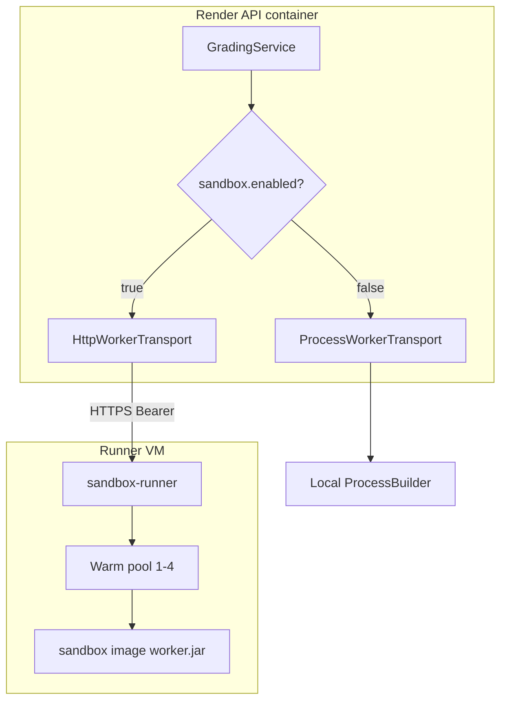

# Container Sandbox Invoke - Plan

## Goal Capsule

- **Objective:** Run operational testcase invokes inside ephemeral containers that enforce CPU and memory limits, block outbound network, and jail filesystem access — without cold-start latency dominating uploads.
- **Product authority:** This Product Contract. Class-tab reflection isolation, compile-out, and full per-submission grading containers are surrounding thesis stages, not active scope.
- **Open blockers:** None.
- **Stop conditions:** Do not move Class-tab or javac into containers. Do not require Docker socket on the Render API. Do not claim protection against every container-escape technique.
- **Execution:** Code. Prove network/fs/OOM containment and latency with backend tests plus a runnable `sandbox-runner` service. `ce-work` owns the shipping tail.
- **Product Contract preservation:** Restructured only — R15 added at brainstorm; planning resolved Outstanding Questions into KTDs without scope change.

---

## Product Contract

### Summary

Operational testcase invokes move from a host-spawned worker JVM into ephemeral containers managed by a dedicated sandbox runner service. The Render API delegates invoke IPC to that runner, which maintains a warm pool so upload latency stays within today's ballpark. Each sandbox runs the existing thin worker with network disabled, read-only root filesystem, and a narrowly scoped writable temp area for student classes.

### Problem Frame

Stage 2 isolated the testcase worker from the API process: crashes, hangs, and `System.exit` no longer take down the backend, and env allowlisting keeps API secrets off the worker's environment. The worker still shares the API host's cgroup on Render, can read the host filesystem and `/proc` as the same UID, and can open outbound network sockets. A hostile submission can exfiltrate data, probe internal services, or exhaust shared host resources beyond the worker's `-Xmx64m` heap flag.

Production security is the driver: the live system must block network exfiltration, unauthorized filesystem access, and resource exhaustion during testcase invoke.

### Key Decisions

- **Stage 3 container sandbox for invoke only** (session-settled: user-directed — chosen over class-tab isolation, compile-out, full grading container, and thesis-alignment-only). **Governs R1–R4.**
- **Dedicated sandbox runner with warm pool** (session-settled: user-approved — chosen over same-host Docker on Render, managed SaaS sandbox, and Linux-namespace-only sandbox: Render API cannot spawn containers; strict latency requires reuse). **Governs R5–R8, R15.**
- **Full stage-3 threat coverage** (session-settled: user-directed — chosen over defense-in-depth-only: must block network, filesystem escape, and resource exhaustion). **Governs R9–R11.**
- **Strict upload latency** (session-settled: user-directed — chosen over moderate or relaxed latency: warm pool or container reuse is required, not optional). **Governs R7, R8.**
- **Auto-scaling warm pool** (session-settled: user-directed — chosen over fixed pool of 1 or 3: start small, scale on queue depth and latency metrics). **Governs R7, R8.**

<!-- ce-section: work-relationships -->
### How This Work Fits Together

This plan owns **container-wrapped testcase invoke** (thesis stage 3, invoke-only). The broader sandboxing breakdown below is the current understanding, not a committed roadmap.

- Per-invocation timeout (thesis stage 1)
  - **Shares** the same operational-testcase path; already shipped.
  - **Enables** this work: timeout still applies inside the container; the runner kills the sandbox on breach.
- Isolated testcase worker JVM (thesis stage 2)
  - **Shares** the worker JAR, NDJSON IPC protocol, and assertion scoring in the API.
  - **Enables** this work: containers wrap the existing worker rather than reimplementing invoke logic.
- Container sandbox invoke (this plan)
- Class-tab bytecode isolation
  - **Can proceed independently of** this plan.
- Compile-out
  - **Can proceed independently of** this plan.

### Actors

- A1. Student — uploads Java that may be hostile; reads testcase results on the Operation Test tab.
- A2. Other API users — students and lecturers whose requests must survive A1's invoke attempts.
- A3. Lecturer — dry-runs operational testcases on the same invoke path.
- A4. Sandbox runner — hosts warm ephemeral containers, enforces isolation constraints, executes worker IPC on behalf of the API.
- A5. API backend (Render) — grades submissions, delegates testcase invokes to A4, scores from serialized worker outcomes.

### Requirements

**Isolation boundary**

- R1. Only operational testcase invoke runs inside the container sandbox. Class-tab reflection and javac compile stay in the API process.
- R2. Each sandbox runs the existing thin worker artifact; grading harness types and API secrets are not loaded inside the sandbox.
- R3. Student compiled classes are mounted or copied into a narrowly scoped writable area inside the sandbox; no other host paths are writable.
- R4. The API scores testcase results from serialized worker outcomes exactly as today; student objects do not return to the API JVM.

**Runner and latency**

- R5. The API on Render does not require a Docker socket; it delegates invoke work to a sandbox runner over an authenticated channel.
- R15. Only the API backend may submit invoke work to the runner; unauthenticated or replayed requests are rejected.
- R6. The runner provisions ephemeral containers per invoke session (or reuses a warm container for the duration of one upload's invoke sequence).
- R7. Cold container startup must not dominate upload latency; the runner maintains a warm pool or equivalent reuse strategy.
- R8. Upload wall-clock for a representative lab with operational testcases stays within the current ballpark when the pool is healthy.

**Threat containment**

- R9. Outbound network from inside the sandbox is blocked.
- R10. Filesystem outside the scoped temp area is not writable; read access to host secrets and sensitive paths is blocked to the extent practical without breaking invoke.
- R11. CPU and memory limits are enforced at the container cgroup, not only via JVM `-Xmx` flags.

**Failure and observability**

- R12. Sandbox crash, OOM, timeout, or `System.exit` inside student code marks the testcase failed or errored without terminating the API or the runner service.
- R13. Runner or pool exhaustion surfaces as contained testcase errors for the affected upload, not API process death.
- R14. Lecturer dry-run uses the same sandbox path as student upload invoke.

### Key Flows

- F1. **Upload invoke path:** API acquires the per-upload invoke concurrency gate → opens remote session to runner → runner assigns warm container → worker loads student classes from scoped temp → NDJSON invoke/response → API evaluates assertions → runner recycles or destroys container.
- F2. **Timeout path:** Per-invocation deadline fires → runner kills container (and process tree) → testcase marked failed/errored → pool replenishes warm capacity without blocking other uploads indefinitely.
- F3. **Runner unavailable:** API returns contained testcase errors for affected invokes; API process remains healthy; no silent fallback to in-API invoke when sandbox mode is enabled.

### Acceptance Examples

- AE1. Student code that opens an outbound HTTP connection receives a contained testcase failure; no connection leaves the sandbox.
- AE2. Student code that reads a host secret path outside the scoped temp area cannot return that content in testcase output.
- AE3. Student code that allocates until OOM is killed inside the sandbox cgroup; the API process and runner service continue serving other requests.
- AE4. A representative lab upload with multiple testcase invocations completes without per-invoke cold-start dominating total latency when the warm pool is at nominal capacity.
- AE5. Lecturer dry-run of an operational testcase executes inside the same sandbox constraints as student upload.

### Scope Boundaries

**In scope**

- Container-wrapped testcase invoke via a dedicated sandbox runner.
- Warm pool or container reuse for strict latency.
- Network block, filesystem jail, and cgroup resource limits inside the sandbox.
- Authenticated API-to-runner delegation.

**Out of scope**

- Class-tab reflection isolation.
- Moving javac or compile out of the API.
- Full per-submission grading inside one container.
- Container escape hardening beyond practical production defaults.
- Managed third-party sandbox SaaS.
- Same-host Docker spawn from the Render API container.

**Non-goals**

- Claiming protection against every exotic container-escape technique.
- Changing testcase scoring rules, assertion kinds, or rubric schema.
- Requiring students to change upload format.

### Deferred to Follow-Up Work

- Multi-tenant runner concurrency beyond one remote session per API host (relax `workerJvmSlot` only after runner pool sizing is proven in production).
- Runner high-availability (second VM, health-based failover) — document as ops follow-up, not required for first ship.

### Success Criteria

- Hostile invoke cannot reach outbound network from inside the sandbox.
- Hostile invoke cannot read host secrets outside the scoped temp area in acceptance scenarios.
- Resource exhaustion from a single invoke is contained to the sandbox cgroup.
- Upload latency with a healthy warm pool stays within today's ballpark for a representative lab.
- API process survival on worker crash/OOM/`System.exit` remains true.

### Risks and Assumptions

- **Assumption:** Render API host cannot spawn Docker containers directly; delegation to a runner is required.
- **Assumption:** Existing NDJSON worker IPC can be bridged across the API→runner boundary with acceptable overhead.
- **Risk:** Runner becomes operational single point of failure — mitigated by health checks, pool metrics, and contained degradation (R13).
- **Risk:** Pool underrun during deadline spikes causes latency regression — mitigated by R7–R8 acceptance and monitoring.

---

## Planning Contract

### Key Technical Decisions

- KTD1. **New `sandbox-runner/` deployable service with Docker Engine API access.** Small Java service (Spring Boot 3.2, same stack as API) owns container lifecycle, warm pool, and HTTP session API. Chosen over embedding runner logic inside the API fat JAR to keep Docker socket off Render and isolate blast radius. **Governs R5, R6, R12.**
- KTD2. **HTTP REST session API, not gRPC or WebSocket.** `POST /sessions` (create + upload class tarball), `POST /sessions/{id}/invoke` (one NDJSON request line in body, one NDJSON response line out), `DELETE /sessions/{id}` (destroy). Chosen for simple Render→VM connectivity and easy curl debugging. **Governs R5, R15.**
- KTD3. **One container per upload or dry-run session.** All testcase invokes of that HTTP request reuse the same container and worker JVM (same as stage-2 KTD1 semantics). Runner returns container to warm pool or destroys on session end. **Governs R6, R7, R8.**
- KTD4. **Class bytes via gzip tarball at session create.** API tars `challenge_N/classes/` (or dry-run compile dir), uploads multipart to runner; runner extracts to `/work/classes` inside container tmpfs. No bind-mount of host API paths into sandbox. **Governs R3, R10.**
- KTD5. **Bearer token auth (`SANDBOX_RUNNER_TOKEN`).** API sends `Authorization: Bearer <token>`; runner rejects missing or wrong token (401). No per-request HMAC in v1. **Governs R15.**
- KTD6. **Container hardening profile.** `docker run` with `--network none`, read-only root, tmpfs mount at `/work` (size-capped), non-root user, `--memory 128m --cpus 0.5`, `--pids-limit 64`. Worker JVM flags stay `-Xmx64m` per stage 2. **Governs R9, R10, R11.**
- KTD7. **Auto-scaling warm pool on the runner VM.** Defaults: `minWarm=1`, `maxWarm=4`, scale up when session queue wait exceeds 2s, scale down after 60s idle. Replenish warm slot after kill/timeout. **Governs R7, R8** (session-settled: user-directed — auto-scale).
- KTD8. **Production hosting: small Linux VM with Docker** (recommended Hetzner CX22 or DigitalOcean Basic 1GB). Render API calls runner over HTTPS (TLS via reverse proxy or Caddy on VM). Campus self-hosted VM is an acceptable substitute with the same contract. **Governs R5.**
- KTD9. **Feature flag `app.grading.sandbox.enabled` (default `false`).** When false, keep today's local `WorkerProcessClient` + `workerJvmSlot` path unchanged. When true, API uses `RemoteWorkerSessionClient`; no silent mixed mode. Local dev can run runner via `docker compose` or stay on local worker. **Governs R1, F3.**
- KTD10. **Transport implements existing `WorkerSession` writeLine/readLine contract.** Introduce `WorkerTransport` interface; `ProcessWorkerTransport` (current Process streams) and `HttpWorkerTransport` (runner proxy). `WorkerSessionHandle` unchanged at `InvocationRunner` boundary. **Governs R4, R12.**
- KTD11. **Keep `workerJvmSlot` on API as one remote session at a time in v1.** Same HTTP-thread acquire/release as stage 2; runner may accept multiple sessions later but API serializes until pool sizing is validated. **Governs F1, R13.**
- KTD12. **Latency baseline: record before/after on one reference lab** (document challenge count + testcase count in `docs/GRADING_WORKFLOWS.md`). Acceptance: warm-pool path within 25% of local-worker path for that lab when runner is on a same-region VM. Measure with `app.grading.timing-log=true` before enabling sandbox in production. **Governs R8, AE4.**
- KTD13. **Sandbox-mode failure is contained, never fallback to in-API invoke.** Runner down, pool exhausted, or auth failure → testcase `ERROR` / infrastructure path (per R13, F3). **Governs R13, F3.**

### High-Level Technical Design

```mermaid
sequenceDiagram
  participant API as GradingService Render
  participant Slot as workerJvmSlot
  participant RC as RemoteWorkerSessionClient
  participant Run as sandbox-runner VM
  participant Pool as Warm pool
  participant Box as Sandbox container
  participant W as worker.jar

  API->>Slot: acquire
  API->>RC: POST /sessions tarball
  RC->>Run: HTTPS Bearer
  Run->>Pool: take warm container
  Pool->>Box: assign /work
  Run->>W: start worker IPC
  loop Each testcase invoke
    API->>RC: POST /sessions/id/invoke NDJSON
    RC->>W: forward line
    W-->>RC: response line
    RC-->>API: SerializedInvocationOutcome
  end
  API->>RC: DELETE /sessions/id
  Run->>Pool: recycle or destroy
  API->>Slot: release
```



Directional guidance, not implementation specification: runner never loads student classes in its own JVM; only the container worker does. API tarball is built from an already-compiled classes directory on the API host.

### Assumptions

- Docker Engine is available on the runner VM (not Docker-in-Docker on Render).
- Runner VM has enough RAM for `maxWarm=4` × 128MB containers plus runner process (~1GB VM minimum).
- HTTPS termination on runner VM is acceptable (Caddy or nginx reverse proxy).
- `docker-java` or equivalent can create containers with the KTD6 flag set without root in runner process (runner user in `docker` group).

### Implementation Constraints

- Repo-relative paths only. Backend verification is `mvn test` from `backend/`.
- Do not install `SecurityManager`.
- Preserve stage-2 `WorkerIpc` line protocol and size caps unchanged across the wire.
- Runner integration tests may use Testcontainers only when Docker is available in CI; gate with assumption/disabled tag if not.

### Sequencing

U1 sandbox image → U2 runner service core → U3 pool + session API → U4 API transport + flag → U5 hostile container tests → U6 deploy docs and compose.

### System-Wide Impact

- **Memory:** API on Render no longer spawns local worker when sandbox enabled — frees ~64–128MB RSS on API host. Runner VM owns worker memory.
- **Latency:** New network hop API→runner per invoke line; mitigated by warm pool (KTD7) and one container per session (KTD3).
- **Ops:** Two deployables (Render API + runner VM). New secrets: `SANDBOX_RUNNER_URL`, `SANDBOX_RUNNER_TOKEN`.
- **Trust boundary:** Runner must not expose Docker socket to internet; firewall to API egress IP only.

### Risks & Dependencies

- Runner VM downtime blocks testcase grading when sandbox enabled (R13). Mitigate with health check and monitoring; HA deferred.
- Tarball upload size for large submissions — cap at reasonable size (e.g. 10MB); oversized → session create fails with contained ERROR.
- Testcontainers may be absent on some dev machines — local path uses `sandbox.enabled=false`.

### Open Questions

- **Deferred:** Exact reference lab for KTD12 latency baseline — pick during U6 from production-like seed data.
- **Deferred:** TLS certificate provisioning on runner VM (Let's Encrypt vs manual) — ops detail at deploy time.

### Sources / Research

- Stage-2 worker IPC and spawn: `docs/plans/2026-09-12-002-feat-isolated-testcase-worker-plan.md`
- Operational testcase patterns: `docs/solutions/architecture-patterns/operational-testcase-grading.md`
- Current seams: `backend/src/main/java/com/eiu/capstone/backend/grading/testcase/WorkerProcessClient.java`, `WorkerSessionHandle.java`, `InvocationRunner.java`
- Render constraints: `backend/DEPLOY_RENDER.md`
- Docker layout: `backend/Dockerfile`

---

## Output Structure

```
sandbox-runner/
  pom.xml
  Dockerfile
  src/main/java/.../SandboxRunnerApplication.java
  src/main/java/.../pool/WarmPoolManager.java
  src/main/java/.../api/SessionController.java
  src/main/java/.../docker/SandboxContainerFactory.java
sandbox-image/
  Dockerfile          (FROM eclipse-temurin:21-jre, COPY worker.jar, non-root)
docker-compose.sandbox.yml
backend/
  src/main/java/.../grading/testcase/transport/
    WorkerTransport.java
    ProcessWorkerTransport.java
    HttpWorkerTransport.java
    RemoteWorkerSessionClient.java
  src/main/resources/application.properties
```

Per-unit **Files** lists are authoritative. Implementer may adjust package names.

---

## Implementation Units

### U1. Sandbox container image

- **Goal:** Produce a minimal image that runs `worker.jar` with KTD6 isolation defaults baked in.
- **Requirements:** R2, R3, R9, R10, R11. KTD6.
- **Dependencies:** None (uses existing `backend-1.0.0-worker.jar` build).
- **Files:**
  - `sandbox-image/Dockerfile` (create)
  - `sandbox-image/README.md` (create, brief)
  - `backend/pom.xml` (no change if worker JAR already builds)
- **Approach:**
  1. JRE-only base image, non-root `sandbox` user.
  2. Copy `worker.jar` to `/opt/worker/worker.jar`.
  3. Document expected `docker run` flags in README (network none, read-only, tmpfs `/work`, memory/cpu/pids limits) — factory in U2 applies them programmatically.
  4. Entrypoint: `java -Xmx64m -XX:MaxMetaspaceSize=48m -XX:+ExitOnOutOfMemoryError -jar /opt/worker/worker.jar` with IPC on stdin/stdout.
- **Patterns to follow:** `backend/Dockerfile` worker copy pattern; stage-2 KTD7 JVM flags.
- **Test scenarios:**
  - Image builds locally when worker JAR exists.
  - Container starts and responds to a minimal NDJSON self-check line (manual or script).
  - `docker inspect` shows `NetworkMode: none` when run with factory flags.
- **Verification:** Image builds. Manual smoke: one invoke round-trip inside container.

### U2. sandbox-runner service scaffold

- **Goal:** Deployable service that can talk to Docker Engine and authenticate callers.
- **Requirements:** R5, R15. KTD1, KTD5, KTD8.
- **Dependencies:** U1.
- **Files:**
  - `sandbox-runner/pom.xml` (create)
  - `sandbox-runner/Dockerfile` (create)
  - `sandbox-runner/src/main/java/com/eiu/capstone/sandboxrunner/SandboxRunnerApplication.java` (create)
  - `sandbox-runner/src/main/java/com/eiu/capstone/sandboxrunner/config/RunnerSecurityConfig.java` (create)
  - `sandbox-runner/src/main/java/com/eiu/capstone/sandboxrunner/docker/SandboxContainerFactory.java` (create)
  - `sandbox-runner/src/main/resources/application.properties` (create)
  - `pom.xml` or root build orchestration (optional Maven reactor entry)
- **Approach:**
  1. Spring Boot 3.2 minimal app on port 8090 (configurable).
  2. `SANDBOX_RUNNER_TOKEN` env var; filter rejects requests without valid Bearer token.
  3. `SandboxContainerFactory` wraps docker-java: create/start/stop/remove with KTD6 options and sandbox image from U1.
  4. `GET /health` public for VM monitoring (no auth).
- **Patterns to follow:** `backend` Spring Security patterns for filter-based auth; no shared DB.
- **Test scenarios:**
  - Missing Bearer token on `/sessions` returns 401.
  - Valid token passes filter.
  - Factory creates container with memory limit and network disabled (unit test with mocked Docker client).
- **Verification:** `mvn test` in `sandbox-runner/`. Service starts and `/health` returns 200.

### U3. Warm pool and session HTTP API

- **Goal:** Session lifecycle and auto-scaling warm pool per KTD3, KTD4, KTD7.
- **Requirements:** R6, R7, R15. KTD2, KTD3, KTD4, KTD7.
- **Dependencies:** U2.
- **Files:**
  - `sandbox-runner/src/main/java/com/eiu/capstone/sandboxrunner/pool/WarmPoolManager.java` (create)
  - `sandbox-runner/src/main/java/com/eiu/capstone/sandboxrunner/api/SessionController.java` (create)
  - `sandbox-runner/src/main/java/com/eiu/capstone/sandboxrunner/api/SessionService.java` (create)
  - `sandbox-runner/src/main/java/com/eiu/capstone/sandboxrunner/model/SessionRecord.java` (create)
  - `sandbox-runner/src/test/java/.../WarmPoolManagerTest.java` (create)
  - `sandbox-runner/src/test/java/.../SessionControllerTest.java` (create)
- **Approach:**
  1. `POST /sessions`: accept `multipart/form-data` file `classes.tar.gz`; take warm container; extract to `/work/classes`; start worker process attached to container stdout/stdin pipes; return `{ "sessionId": "..." }`.
  2. `POST /sessions/{id}/invoke`: body is single NDJSON request line; write to worker stdin; read one response line; return as plain text or JSON string.
  3. `DELETE /sessions/{id}`: kill worker tree, destroy or recycle container.
  4. `WarmPoolManager`: maintain idle containers; scale up/down per KTD7; queue session requests when pool empty.
- **Patterns to follow:** Stage-2 NDJSON single-line discipline (`WorkerIpc.MAX_LINE_BYTES`).
- **Test scenarios:**
  - Session create → invoke → delete completes with mocked Docker.
  - Pool scales up when wait exceeds threshold (unit test with controllable clock/queue).
  - Oversized tarball rejected with 413 or 400.
  - Concurrent session requests serialize through pool when at `maxWarm`.
- **Verification:** Controller tests pass. Integration test with Testcontainers Docker optional.

### U4. API remote transport and feature flag

- **Goal:** API delegates to runner when `app.grading.sandbox.enabled=true` without changing `InvocationRunner` or `TestcaseGrader`.
- **Requirements:** R4, R5, R12, R14. KTD9, KTD10, KTD11, KTD13.
- **Dependencies:** U3.
- **Files:**
  - `backend/src/main/java/com/eiu/capstone/backend/grading/testcase/transport/WorkerTransport.java` (create)
  - `backend/src/main/java/com/eiu/capstone/backend/grading/testcase/transport/ProcessWorkerTransport.java` (create)
  - `backend/src/main/java/com/eiu/capstone/backend/grading/testcase/transport/HttpWorkerTransport.java` (create)
  - `backend/src/main/java/com/eiu/capstone/backend/grading/testcase/RemoteWorkerSessionClient.java` (create)
  - `backend/src/main/java/com/eiu/capstone/backend/grading/testcase/WorkerSession.java` (refactor to use WorkerTransport)
  - `backend/src/main/java/com/eiu/capstone/backend/grading/testcase/WorkerSessionHandle.java` (wire remote start path)
  - `backend/src/main/java/com/eiu/capstone/backend/grading/GradingService.java` (conditional session factory)
  - `backend/src/main/java/com/eiu/capstone/backend/service/TestcaseDryRunService.java` (same)
  - `backend/src/main/resources/application.properties` (add sandbox keys)
  - `backend/.env.backend.example` (document env vars)
  - `backend/src/test/java/unit/.../HttpWorkerTransportTest.java` (create)
- **Approach:**
  1. Extract `ProcessWorkerTransport` from current `WorkerSession` Process streams.
  2. `HttpWorkerTransport` holds session id + runner base URL; `writeLine`/`readLine` call runner REST.
  3. `RemoteWorkerSessionClient`: on start, tar classes dir, `POST /sessions`, return handle.
  4. Config: `app.grading.sandbox.enabled`, `app.grading.sandbox.runner-url`, `app.grading.sandbox.runner-token` (from env).
  5. `GradingService`: if enabled, `RemoteWorkerSessionClient.start(...)` else existing `WorkerSessionHandle.start(...)`.
  6. Runner 5xx/timeout → infrastructure ERROR; no fallback to local worker when enabled (KTD13).
- **Patterns to follow:** `WorkerProcessClient`, `WorkerSessionHandle.roundTrip`, stage-2 slot acquire on HTTP thread.
- **Test scenarios:**
  - Flag false: existing `WorkerProcessClientTest` / `InvocationRunnerTest` still pass unchanged.
  - Flag true with mock HTTP server: invoke round-trip forwards NDJSON lines.
  - Runner 503 → `InvocationOutcome` ERROR, API JVM stays up.
  - Dry-run path uses same remote client when flag true.
- **Verification:** `mvn test` from `backend/` with sandbox tests using MockWebServer or WireMock.

### U5. Container hostile-path tests

- **Goal:** Prove AE1–AE3 inside sandbox containers; extend stage-2 AE suite.
- **Requirements:** R9, R10, R11, R12. KTD6, KTD12.
- **Dependencies:** U4.
- **Files:**
  - `backend/src/test/java/unit/com/eiu/capstone/backend/grading/testcase/ContainerSandboxAeTest.java` (create)
  - `backend/src/test/java/unit/com/eiu/capstone/backend/grading/testcase/IsolatedWorkerAeTest.java` (reference patterns)
  - `sandbox-runner/src/test/java/.../ContainerIsolationIT.java` (create, optional integration)
- **Approach:**
  1. Hostile fixtures: outbound HTTP, read `/etc/passwd` or mounted secret file, infinite allocation.
  2. Run through sandbox-enabled path (Testcontainers: runner + sandbox image) or `@EnabledIfEnvironmentVariable` when `SANDBOX_INTEGRATION=true`.
  3. Assert AE1: connection fails or testcase ERROR; no egress.
  4. Assert AE2: secret path content not in stdout/return snapshot.
  5. Assert AE3: OOM kills container only; runner health stays up.
- **Execution note:** Add characterization coverage for sandbox transport before modifying `WorkerSession` internals.
- **Test scenarios:**
  - Covers AE1. `new URL("http://example.com").openConnection()` → contained failure.
  - Covers AE2. `Files.readString(Path.of("/etc/passwd"))` in student code → cannot pass assertion with file content.
  - Covers AE3. Allocate until OOM → testcase ERROR/TIMED_OUT; subsequent invoke on new session succeeds.
  - Covers AE5. Dry-run fixture uses same transport when flag on.
- **Verification:** AE tests pass in CI when Docker available; documented skip otherwise.

### U6. Deploy, compose, and documentation

- **Goal:** Runnable local stack and production deploy guide for runner VM.
- **Requirements:** R5, R8. KTD8, KTD12.
- **Dependencies:** U1, U2, U3, U4.
- **Files:**
  - `docker-compose.sandbox.yml` (create at repo root)
  - `docs/SANDBOX_RUNNER_DEPLOY.md` (create)
  - `backend/DEPLOY_RENDER.md` (update — sandbox env vars, no local worker when enabled)
  - `backend/AGENTS.md` (update grading config table)
  - `backend/src/main/java/com/eiu/capstone/backend/grading/AGENTS.md` (update testcase section)
  - `docs/solutions/architecture-patterns/operational-testcase-grading.md` (update stage-3 status)
  - `docs/GRADING_WORKFLOWS.md` (latency note, sandbox path)
- **Approach:**
  1. `docker-compose.sandbox.yml`: build sandbox-image, run sandbox-runner with Docker socket (dev only), document `app.grading.sandbox.enabled=true` for local API.
  2. `SANDBOX_RUNNER_DEPLOY.md`: VM sizing, Docker install, Caddy TLS, firewall, env vars, Hetzner/DO recommendation.
  3. Record reference lab metrics template for KTD12 before/after.
  4. Update operational-testcase-grading.md: stage 3 gaps closed for invoke when sandbox enabled.
- **Test expectation:** none — documentation and compose validation.
- **Verification:** `docker compose -f docker-compose.sandbox.yml up` starts runner; manual upload with sandbox enabled completes.

---

## Verification Contract

| Gate | Command / check |
|------|-----------------|
| Backend unit tests | `mvn test` from `backend/` |
| Runner unit tests | `mvn test` from `sandbox-runner/` |
| Sandbox AE (optional) | `SANDBOX_INTEGRATION=true mvn test -Dtest=ContainerSandboxAeTest` from `backend/` |
| Local stack smoke | `docker compose -f docker-compose.sandbox.yml up` + upload with `app.grading.sandbox.enabled=true` |
| Latency baseline | Compare upload timing log for reference lab before/after (KTD12) |

---

## Definition of Done

- [ ] `app.grading.sandbox.enabled=true` routes all testcase invokes and dry-runs through runner containers.
- [ ] `app.grading.sandbox.enabled=false` preserves stage-2 local worker behavior with no regression in existing tests.
- [ ] AE1–AE3 pass in container integration tests when Docker is available.
- [ ] Runner rejects unauthenticated requests (R15).
- [ ] Warm pool maintains at least one idle container under steady load (KTD7).
- [ ] `docs/SANDBOX_RUNNER_DEPLOY.md` and updated `DEPLOY_RENDER.md` describe production setup.
- [ ] `mvn test` passes in `backend/` and `sandbox-runner/` on CI.
- [ ] No Docker socket mounted on Render API image.
