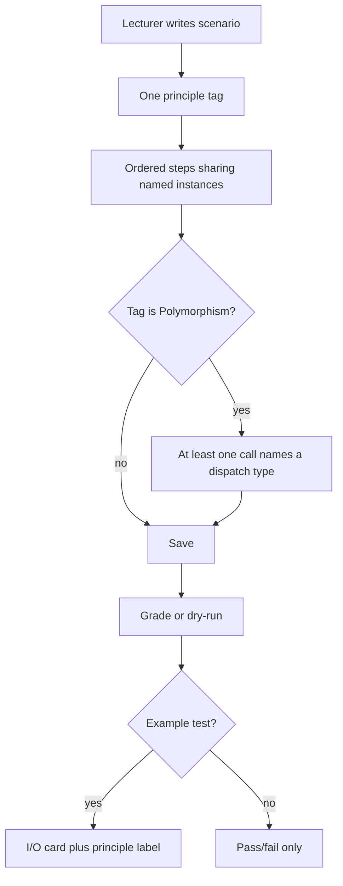
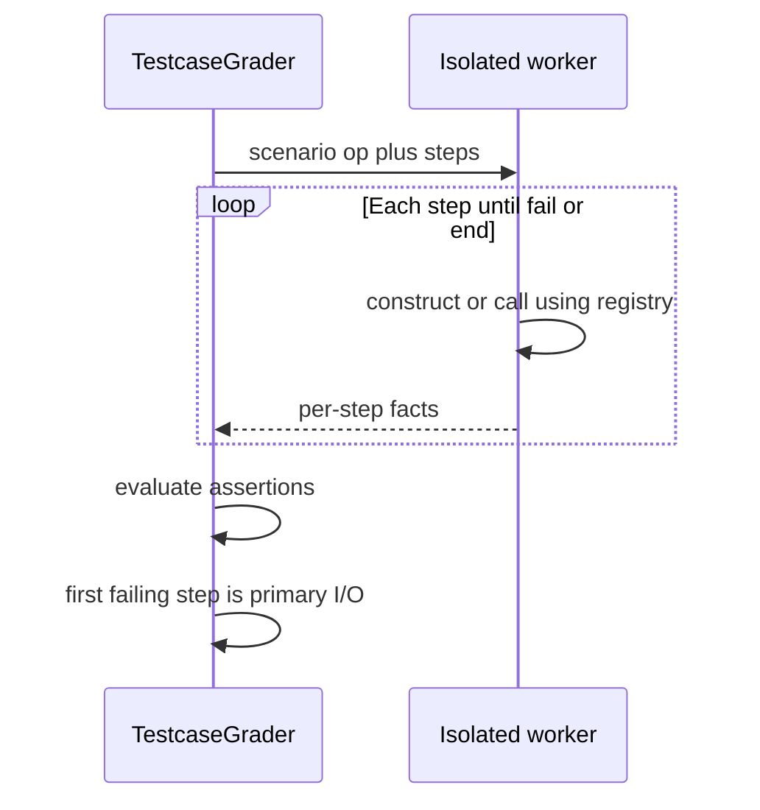

# OOP Testcase Pillar Scenarios - Plan

## Goal Capsule

- **Objective:** Expand the operational testcase pillar so lecturers can author named-instance scenario scripts that cover sequences, polymorphism, encapsulation, composition, and inheritance behavior as one set, and so students see which OOP principle that test was checking on the existing I/O card.
- **Product authority:** This Product Contract. Declaration Test and MMD are not active scope. Smell detection, randomized inputs, JUnit-style test upload, and scoring by matching the reference solution are not active scope.
- **Open blockers:** None.
- **Stop conditions:** Do not change Class or MMD grading. Do not add AST/smell detection. Do not absorb `COMPARISON` into scenario steps. Do not add nested inner-class outer-instance wiring. Do not add a frontend test runner. Do not change sandbox topology or the host `workerJvmSlot`.
- **Execution:** Code. Prove save guardrails, worker scenarios, first-failing-step I/O, and AE1–AE8 with backend tests. `ce-work` owns the shipping tail.
- **Product Contract preservation:** Unchanged R/A/F/AE IDs. Outstanding Questions → KTD1–KTD4. Confirmed plan-time scope → KTD1, KTD3, KTD11. R17 two-instance comparison remains the `COMPARISON` type; scenario steps use RETURN_VALUE, FIELD_STATE, STDOUT, and EXCEPTION.

---

## Product Contract

### Summary

Lecturers author operational tests as short named-object scenarios — construct, call in order, assert — covering sequences, polymorphism, encapsulation, composition, and inheritance behavior together.
Each test carries one OOP-principle tag.
Polymorphism-tagged tests must call through a parent or interface.
Students still see I/O, plus which principle that visible test was checking.

### Problem Frame

Operational testcases today run one constructor or method call, or compare two instances, with scalar arguments.
Students pass those checks with if-else chains, `instanceof` switches, empty overrides, and hardcoded output.
Declaration Test already confirms signatures exist; it does not confirm that an override does work, that a call used dynamic dispatch, or that encapsulation held after a rejected update.
Static smell rules (god-class, duplicated sibling bodies, complexity metrics) catch laziness, punish legitimate alternate designs, and fail in ways that are hard to explain.

### Key Decisions

- **Named-instance scenario scripts as the one authoring model** (session-settled: user-approved — chosen as the thinnest form that still delivers all five capabilities: user asked the agent to decide; confirmed in scoping synthesis). **Governs R1–R5, R10–R14, R24.**
- **All five capabilities ship together** (session-settled: user-directed — chosen over shipping one first: one slice would not stop the gaming). **Governs R10–R14.**
- **Lecturers author the tests; students see the principle name** (session-settled: user-directed — chosen over auto-detecting design or labels-only). **Governs R6, R9, R19, R21.**
- **One script model with two guardrails over five templates or reference-diff scoring** (session-settled: user-directed — chosen over principle-first templates and over expected values from the reference solution: expressiveness without punishing a legitimate different design). **Governs R6–R8, R22.**
- **Behavioral scenarios over smell/metrics** (session-settled: user-directed — chosen over AST/PMD-style detection: fails stay explainable). **Governs R9** and Scope Boundaries.
- **Principle name is the lecturer's tag, not a diagnosis.** **Governs R9.**
- **Visible tests keep the I/O card and add the tag as a label, not an essay.** **Governs R19, R21.**
- **Hidden tests stay opaque.** **Governs R20.**

### Actors

- A1. **Lecturer** — authors scenarios and principle tags in Solution Management; dry-runs against the reference solution; reviews student Operation Test results.
- A2. **Student** — uploads Java; sees Example test I/O plus the principle tag, and Other tests as pass/fail only.
- A3. **Grading pipeline** — runs scenario steps on student bytecode via the isolated testcase worker and scores the testcase pillar.

<!-- ce-section: work-relationships -->
### How This Work Fits Together

This plan owns the next product slice of the **operational testcase pillar**: scenario scripts, principle tags, and dispatch-type calls.
The broader three-pillar grader (Declaration Test, MMD, operational testcase) stays in place; later plans may revise that map.

- Operational testcase v1 (one invoke or two-instance comparison, scalar values, I/O cards, lecturer editor, dry-run, isolated worker) — **Depends on** that pillar already shipping; this contract extends it rather than replacing Class or MMD.
  - Isolated testcase worker / container sandbox invoke — **Shares** the existing invoke isolation boundary; this work does not redefine sandboxing.
  - Smell/metrics detection, randomized hidden inputs, JUnit upload, design-pattern suites — **Still to decide** as later candidates; they are not requirements here.

### Requirements

**Scenario authoring**

- R1. A lecturer authors each operational testcase as an ordered scenario of steps that share named instances.
- R2. A step constructs a named instance, calls a constructor or method, or asserts on a prior step's outcome.
- R3. A later step may pass a named instance as an argument (object-typed args of rubric classes), in addition to today's scalars (primitives, wrappers, `String`, null, and arrays of those).
- R4. A call may name a **dispatch type** (a parent class or interface on the rubric); the invoke must go through that type so dynamic dispatch runs.
- R5. Existing one-step tests remain valid as one-step scenarios.

**Principle tag and guardrails**

- R6. Every testcase has exactly one **OOP principle tag**: Unit, Polymorphism, Encapsulation, Composition, or Inheritance.
- R7. A Polymorphism-tagged testcase cannot be saved unless at least one call names a dispatch type.
- R8. Tags other than Polymorphism do not add extra required slots beyond the scenario and the tag.
- R9. The grader does not infer or correct the principle; the tag is whatever the lecturer set.

**The five capabilities**

- R10. **Sequences.** A scenario may run two or more steps that share named instances.
- R11. **Encapsulation.** A lecturer can assert that a rejected or illegal update leaves instance state unchanged, and that mutating a value returned from a getter does not change the owner's collection or internals.
- R12. **Composition.** A lecturer can construct linked objects and assert state that follows the has-a relationship.
- R13. **Inheritance behavior.** A lecturer can invoke on a subclass and assert results a pass-through or empty override would fail. Declaration Test still only checks that the override exists.
- R14. **Polymorphism.** Mixed instances invoked through the dispatch type fail when student code relies on `instanceof` / type-switch instead of overriding.

**Scoring and failure**

- R15. A testcase passes only when every configured assertion on every run step passes.
- R16. If a step cannot run because an earlier named instance failed to construct or threw, dependent later steps are not counted as passed; the testcase fails and the first failing step is the primary I/O.
- R17. Today's assertion kinds remain available inside scenario asserts: return value, field state, stdout, exception type, and comparison of two instances.
- R18. Challenge compile-error short-circuit for the testcase pillar is unchanged: testcases for that challenge do not run as success.

**Student and lecturer display**

- R19. Example (`is_hidden` false) tests show the principle tag plus the existing I/O card; collapsed view is the first failing step (or the primary assertion if all pass).
- R20. Other (`is_hidden` true) tests stay pass/fail only — no I/O and no principle tag.
- R21. Student copy is I/O (input / expected / yours) plus the tag as a label, not a written diagnosis of their design.
- R22. Lecturers can dry-run a full scenario against the reference solution before students submit.
- R23. Declaration Test and MMD pillars, scoring weights, and hidden-vs-example split are unchanged except for the new scenario fields and the tag on visible tests.
- R24. One-step tests that have no lecturer-chosen tag receive Unit.

### Key Flows

- F1. Lecturer authors a polymorphism scenario
  - **Trigger:** Lecturer opens Operation Test authoring for a challenge that has a parent/interface and subclasses.
  - **Actors:** A1
  - **Steps:** Lecturer tags Polymorphism, constructs mixed named instances, calls the method through the parent/interface dispatch type, asserts the overridden results; save is refused until a dispatch-type call exists; dry-run runs the same scenario on the reference classes.
  - **Outcome:** A saved test students cannot satisfy with an `instanceof` chain in that method.
  - **Covered by:** R4, R6, R7, R14, R22

- F2. Student fails an example OOP scenario
  - **Trigger:** Student uploads; an Example scenario fails at a step.
  - **Actors:** A2, A3
  - **Steps:** Pipeline runs steps in order until the first failure; remaining dependent steps are not passed; the Operation Test tab shows the principle tag and the I/O of that failing step.
  - **Outcome:** Student sees which principle the test was checking and what input/expected/actual were, without a design essay.
  - **Covered by:** R15, R16, R19, R21

- F3. Encapsulation leak scenario
  - **Trigger:** Lecturer wants to catch a getter that returns the live internal collection.
  - **Actors:** A1, A3
  - **Steps:** Construct the owner, call the getter, mutate the returned collection, assert the owner's collection size or contents are unchanged.
  - **Outcome:** Representation exposure fails the testcase; a defensive copy passes.
  - **Covered by:** R10, R11

### Acceptance Examples

- AE1. Polymorphism vs `instanceof`
  - **Covers R4, R7, R14.**
  - **Given:** Rubric `Shape` with `Circle` and `Square` overrides of `getArea`.
  - **When:** The scenario holds each instance as `Shape` and sums `getArea`.
  - **Then:** Overrides that dispatch correctly pass; a client method that type-switches on `instanceof` and ignores overrides fails.

- AE2. Empty override
  - **Covers R13.**
  - **Given:** `Animal.makeSound` has a generic body; `Dog` declares an override.
  - **When:** The scenario constructs `Dog` and asserts a result that requires Dog-specific behavior.
  - **Then:** A pass-through override that only calls the parent generic body fails; a real override passes. Declaration Test still marks the override present.

- AE3. Rejected setter leaves state
  - **Covers R10, R11, R17.**
  - **Given:** `setAge` must reject negatives.
  - **When:** The scenario constructs `Person` at age 30, calls `setAge(-5)`, asserts exception, then asserts `getAge` is still 30.
  - **Then:** A setter that throws but still writes the field fails; a setter that rejects and keeps 30 passes.

- AE4. Composition follows linked state
  - **Covers R3, R12.**
  - **Given:** `Car` is constructed with a named `Engine` instance.
  - **When:** A later step upgrades that `Engine` and asserts `Car`'s engine horsepower.
  - **Then:** A `Car` that copied horsepower into a scalar and ignored the engine object fails; a `Car` that holds the engine passes.

- AE5. Polymorphism save guardrail
  - **Covers R7.**
  - **Given:** A test tagged Polymorphism with only a concrete `Circle.getArea()` call and no dispatch type.
  - **When:** The lecturer saves.
  - **Then:** Save is refused until at least one call names a parent or interface dispatch type.

- AE6. Mis-tagged test
  - **Covers R9, R21.**
  - **Given:** A sequence that only checks a constructor, tagged Polymorphism.
  - **When:** The student fails it.
  - **Then:** The Example card still shows the tag Polymorphism plus I/O. The grader does not rewrite the tag.

- AE7. Hidden test stays opaque
  - **Covers R20.**
  - **Given:** The same polymorphism scenario with `is_hidden` true.
  - **When:** The student fails it.
  - **Then:** Other Testcases shows pass/fail only — no inputs, no expected values, no principle tag.

- AE8. One-step tests still grade
  - **Covers R5, R24.**
  - **Given:** An existing single invoke with a return-value assertion and no new scenario fields filled beyond one step.
  - **When:** A student uploads.
  - **Then:** It still grades as today and shows tag Unit until a lecturer chooses another.

### Scope Boundaries

**Deferred for later**

- Randomized or generated hidden inputs
- Design-pattern suites
- JUnit-style test upload
- Layered fail-fast across the whole challenge (structural then unit then polymorphism) as a pipeline policy
- Scoring by diffing student vs reference as the expected value

**Deferred to Follow-Up Work**

- Nested inner-class construct that needs an implicit outer instance (`Outer` then `Outer.Inner`)
- Principle tag on lecturer submission-drawer Operation Test views
- Per-assertion timeout rows (already incomplete in v1)

**Outside this product's identity**

- AST / PMD / Checkstyle smell detection (god-class, duplicated sibling bodies, cohesion metrics, `instanceof` counts)
- Changing Declaration Test or MMD into operational checks
- Treating a legitimate composition-instead-of-inheritance design as a fail when the scenario did not require inheritance

### Dependencies / Assumptions

- Operational testcase v1, lecturer Solution Management testcase editor, student I/O cards, dry-run, and the isolated testcase worker already exist.
- Current scalar allowlist already includes boxed types and wrapper arrays; the gap is object-typed named instances, not wrappers.
- There is no invocation-level dispatch through a parent or interface today; calls resolve on the concrete class.
- The attached AGS testing guide is an external capability reference for categories 2–6; this contract does not adopt its JUnit examples or execution-order short-circuit as product rules.

### Outstanding Questions

None blocking. Product deferred items live under Scope Boundaries. Implementation unknowns that need runtime discovery live under Planning Contract assumptions.

### Sources / Research

- User-provided *OOP Test Case Design for an Automated Grading System (AGS)* — categories 2–6 as the capability set; categories 1, 7–9 not adopted as this slice.
- `docs/plans/2026-08-11-001-feat-operational-testcase-grading-plan.md` — v1 stop condition: no multi-call sequences; scalar value types.
- `CONCEPTS.md` — operational testcase, assertion kind, testcase I/O card, isolated testcase worker.
- Claim check 2026-09-17: `SINGLE_INVOCATION` / `COMPARISON` only; one invoke per test; no sequence path; no parent/interface dispatch; Class and MMD already separate; value allowlist includes wrappers (not primitives-only).
- `docs/solutions/architecture-patterns/operational-testcase-grading.md` — pillar stack, timeout, persist by assertion id.
- `docs/solutions/logic-errors/lecturer-testcase-save-persistence.md` — sync-by-presence; never delete-all assertion rows.
- `docs/solutions/logic-errors/method-invocation-receiver-constructor.md` — construct-before-invoke; invalidate `LabRubricCache`.
- `docs/solutions/architecture-patterns/nested-class-grading-support.md` — one-level nested types; outer-instance ctor param (follow-up).
- `backend/src/main/java/com/eiu/capstone/backend/service/TestcaseRubricService.java` — `validateTestcaseDto` mutually exclusive invocation vs instances.
- `backend/src/main/java/com/eiu/capstone/backend/grading/testcase/worker/WorkerIpc.java` — ops `invoke` / `compare` only.

---

## Planning Contract

### Key Technical Decisions

- KTD1. **Extend `SINGLE_INVOCATION` with ordered invocation rows as scenario steps; keep `COMPARISON` as its own type** (session-settled: user-approved — chosen over a new `SCENARIO` type and over absorbing comparison into steps: existing comparison rows and validation stay; one-step tests stay one invocation). **Governs R1, R5, R17.**
- KTD2. **One `scenario` worker IPC op per testcase, with an in-worker named-instance registry.** Object-typed args cannot round-trip as JSON across separate `invoke` calls. **Governs R3, R10, R12.**
- KTD3. **Whole-scenario timeout uses `app.grading.testcase-invoke-timeout-seconds` (default 5s) as one budget for the `scenario` op** (session-settled: user-approved — chosen over per-step kill/respawn under the single `workerJvmSlot`). `COMPARISON` keeps today's single-op budget. **Governs R16.**
- KTD4. **Caps: 20 steps and 10 named instances per testcase.** Save returns 422 over the cap. Aligns with dry-run's 20-file spirit.
- KTD5. **Named-instance args in JSON params are objects `{"$instance":"<name>"}`.** Save checks the name exists earlier in the scenario and that the rubric parameter type matches that instance's class. **Governs R3.**
- KTD6. **Dispatch type is nullable `dispatch_class_id` on `testcase_invocation`, FK to `class_entity`.** Worker looks up the method on that type and invokes it on the named receiver so dynamic dispatch runs. **Governs R4, R7, R14.**
- KTD7. **For scenario testcases, primary I/O is the first failing step, not `PrimaryAssertionSelector` kind priority.** All-pass still uses kind priority among assertions on the last run step. **Governs R16, R19.**
- KTD8. **Dependent steps after a failed construct or thrown call are SKIPPED internally; the testcase is FAILED; they are not counted as passed.** **Governs R16.**
- KTD9. **Polymorphism without a dispatch-type call is 422 on save only.** Dry-run may still preview. **Governs R7, R22.**
- KTD10. **Scenario child rows upsert by client UUID (invocation + assertion), same as today's assertion sync.** Never delete-all-reinsert for those children. **Governs R5** persistence.
- KTD11. **Nested inner-class construct that needs an implicit outer instance is follow-up** (session-settled: user-approved — chosen over including it in this slice). Qualified `Outer.Inner` as a dispatch or construct target of a static nested type remains allowed via existing nested-class grading.

### High-Level Technical Design

Lecturer save still PUT-syncs a testcase graph. `SINGLE_INVOCATION` may now have **many** `testcase_invocation` rows (`order_index`, optional `instance_name`, optional `dispatch_class_id`). Assertions keep `invocation_id`. `COMPARISON` is unchanged (two instances, no invocation list).

Grade/dry-run for `SINGLE_INVOCATION` sends one NDJSON `scenario` request. The worker holds named objects for the lifetime of that request, runs steps in order, and returns per-step serialized outcomes. The API scores those facts with `AssertionEvaluator` and never loads student classes.

Directional IPC shape (not an implementation spec): `op: scenario`; steps list construct/call; params mix scalars and `{"$instance":"name"}`; optional dispatch class name; response is an ordered list of untrusted step outcomes (`NORMAL` / `THREW` / `TIMED_OUT` / `ERROR`) plus field snapshots after each call.

### Assumptions

- Dropping `UNIQUE (testcase_id)` on `testcase_invocation` is an operator SQL change plus `TestcaseSchemaMigrator` additive/constraint work; existing one-row tests keep `order_index = 0`.
- Sandbox remote sessions apply the same whole-scenario timeout on one round-trip; they still do not respawn on timeout (existing remote contract).
- Lecturer submission drawer stays without Operation Test I/O (already out of several prior plans).

### Sequencing

U1 schema → U2 rubric save/load → U3 worker scenario op → U4 grader + display mapping → U5 lecturer and student UI (dry-run rides U4). Do not ship UI before save validation and worker scoring exist.

---

## Implementation Units

### U1. Persistence for tags, steps, and dispatch

- **Goal:** Store principle tags, ordered invocation steps, named instances, and dispatch-class FKs; backfill existing rows to Unit.
- **Requirements:** R1, R4, R5, R6, R24
- **Dependencies:** None
- **Files:**
  - create `docs/sql/2026-09-17-testcase-scenario-steps.sql`
  - modify `backend/src/main/java/com/eiu/capstone/backend/config/TestcaseSchemaMigrator.java`
  - modify `backend/src/main/java/com/eiu/capstone/backend/model/Testcase.java`
  - modify `backend/src/main/java/com/eiu/capstone/backend/model/TestcaseInvocation.java`
  - create `backend/src/main/java/com/eiu/capstone/backend/model/OopPrincipleTag.java`
  - modify `backend/src/main/java/com/eiu/capstone/backend/DTO/rubric/testcase/TestcaseStructureDTO.java`
  - modify `backend/src/main/java/com/eiu/capstone/backend/DTO/rubric/testcase/InvocationStructureDTO.java`
- **Approach:**
  1. Add `oop_principle_tag` on `testcase` (not null after backfill; default Unit).
  2. Allow multiple `testcase_invocation` rows per `SINGLE_INVOCATION` (`order_index`, unique `(testcase_id, order_index)`).
  3. Add `instance_name` and `dispatch_class_id` on invocation.
  4. Keep `COMPARISON` schema as today.
- **Patterns to follow:** `TestcaseSchemaMigrator` additive columns; operator SQL in `docs/sql/`; client-assigned UUIDs on invocation.
- **Test scenarios:**
  - Migrator/SQL: existing one-invocation testcase still loads with tag Unit and `order_index` 0.
  - DTO parse: payload with two ordered invocations round-trips `instance_name` and `dispatch_class_id`.
  - `COMPARISON` rows ignore new invocation columns.
- **Verification:** Operator SQL applies on a copy of the current schema; JPA maps new columns; no Flyway.

### U2. Rubric validate, save, and assemble

- **Goal:** Lecturers can save scenarios with tags and guardrails; grading cache loads the step graph.
- **Requirements:** R1–R8, R10, KTD4, KTD5, KTD9, KTD10
- **Dependencies:** U1
- **Files:**
  - modify `backend/src/main/java/com/eiu/capstone/backend/service/TestcaseRubricService.java`
  - modify `backend/src/main/java/com/eiu/capstone/backend/grading/rubric/TestcaseRubricAssembler.java`
  - modify `backend/src/main/java/com/eiu/capstone/backend/grading/rubric/InvocationRubric.java`
  - modify `backend/src/main/java/com/eiu/capstone/backend/grading/rubric/TestcaseRubric.java`
  - modify `backend/src/main/java/com/eiu/capstone/backend/grading/rubric/LabRubricService.java`
  - modify `backend/src/test/java/support/com/eiu/capstone/backend/service/TestcaseRubricServiceTest.java`
- **Approach:**
  1. `SINGLE_INVOCATION` requires one or more invocations; still forbids `testcase_instance` rows.
  2. Enforce unique `instance_name`s, `$instance` refs to earlier constructs, type match, step/instance caps, Polymorphism → at least one `dispatch_class_id`.
  3. Upsert invocations by client UUID; delete only omitted ids (KTD10).
  4. Extend `findReferencingTestcaseNames` to every step's constructor, method, field, and dispatch class.
  5. Invalidate `LabRubricCache` on save (existing helper).
- **Patterns to follow:** `docs/solutions/logic-errors/lecturer-testcase-save-persistence.md`; 422 `ResponseStatusException`.
- **Test scenarios:**
  - Covers AE5. Polymorphism save without dispatch type → 422.
  - Covers AE8. One invocation still saves; omitted tag stores Unit.
  - Re-save keeps assertion UUIDs so `submission_testcase_assertion_result` FKs survive.
  - `$instance` to an unknown or later name → 422.
  - Over 20 steps or 10 names → 422.
  - `COMPARISON` validation unchanged.
- **Verification:** `TestcaseRubricServiceTest` plus assembler mapping of ordered steps.

### U3. Worker scenario execution

- **Goal:** One worker request runs the full script, holds named instances, honors dispatch type, and times out as a whole.
- **Requirements:** R3, R4, R10–R14, R16, KTD2, KTD3, KTD5, KTD6
- **Dependencies:** U1
- **Files:**
  - modify `backend/src/main/java/com/eiu/capstone/backend/grading/testcase/worker/WorkerIpc.java`
  - modify `backend/src/main/java/com/eiu/capstone/backend/grading/testcase/worker/WorkerInvokeEngine.java`
  - modify `backend/src/main/java/com/eiu/capstone/backend/grading/testcase/worker/WorkerMain.java`
  - modify `backend/src/main/java/com/eiu/capstone/backend/grading/testcase/kernel/JsonValueCoercer.java`
  - modify `backend/src/main/java/com/eiu/capstone/backend/grading/testcase/kernel/JavaTypeResolver.java`
  - modify `backend/src/main/java/com/eiu/capstone/backend/grading/testcase/InvocationRunner.java`
  - modify `backend/src/main/java/com/eiu/capstone/backend/grading/testcase/WorkerSessionHandle.java`
  - modify `backend/src/main/java/com/eiu/capstone/backend/grading/testcase/transport/HttpWorkerTransport.java` if the remote body is not a pass-through of `WorkerIpc.Request`
  - modify `backend/src/test/java/unit/com/eiu/capstone/backend/grading/testcase/worker/WorkerInvokeEngineTest.java`
  - modify `backend/src/main/java/com/eiu/capstone/backend/grading/testcase/worker/AGENTS.md`
  - modify `backend/src/main/java/com/eiu/capstone/backend/grading/testcase/kernel/AGENTS.md`
- **Approach:**
  1. Add `scenario` op; all `SINGLE_INVOCATION` grading uses `scenario` (one-step is a one-element list).
  2. Registry maps instance name → live object for that request only.
  3. Dispatch: look up the method on the dispatch type and invoke it on the concrete receiver.
  4. Snapshot configured fields after each call for FIELD_STATE.
  5. On first construct/call `THREW`/`ERROR`/`TIMED_OUT`, stop later steps; API marks them SKIPPED (KTD8).
  6. API still treats worker JSON as untrusted facts; no `passed` from the worker.
- **Patterns to follow:** `SerializedInvocationOutcome` string kinds; `docs/solutions/test-failures/container-sandbox-hardening-review-test-failures.md`.
- **Execution note:** Implement worker scenario scoring test-first in `WorkerInvokeEngineTest`.
- **Test scenarios:**
  - Covers AE4. Construct `Engine`, construct `Car` with `{"$instance":"engine"}`, mutate engine, snapshot car field matches.
  - Covers AE1. Call `getArea` through `Shape` on `Circle` uses Circle override.
  - Concrete-class method lookup without dispatch type still works for Unit tags.
  - Unsupported non-instance object type still throws as today.
  - Scenario timeout returns `TIMED_OUT` and no later step `NORMAL`.
  - Wire `kind` stays a string (`KIND_NORMAL`, not the API enum).
- **Verification:** `WorkerInvokeEngineTest` plus existing worker isolation tests still pass. Run `sandbox-runner` tests if `WorkerIpc` request records change.

### U4. Grader, primary I/O, and result DTOs

- **Goal:** Score scenario steps on the API, persist first-failing-step display, and expose the principle tag on Example rows.
- **Requirements:** R15–R21, R23, KTD7, KTD8
- **Dependencies:** U2, U3
- **Files:**
  - modify `backend/src/main/java/com/eiu/capstone/backend/grading/pipeline/TestcaseGrader.java`
  - modify `backend/src/main/java/com/eiu/capstone/backend/grading/testcase/PrimaryAssertionSelector.java`
  - modify `backend/src/main/java/com/eiu/capstone/backend/grading/testcase/TestcaseDisplayFormatter.java`
  - modify `backend/src/main/java/com/eiu/capstone/backend/grading/testcase/TestcaseResultMapper.java`
  - modify `backend/src/main/java/com/eiu/capstone/backend/DTO/TestcaseResultDTO.java`
  - modify `backend/src/main/java/com/eiu/capstone/backend/service/TestcaseDryRunService.java`
  - modify `backend/src/test/java/unit/com/eiu/capstone/backend/grading/pipeline/TestcaseGraderTest.java`
  - modify `backend/src/test/java/unit/com/eiu/capstone/backend/grading/testcase/TestcaseResultMapperTest.java`
  - modify `backend/src/test/java/support/com/eiu/capstone/backend/service/TestcaseDryRunServiceTest.java`
  - modify `backend/src/main/java/com/eiu/capstone/backend/grading/AGENTS.md`
- **Approach:**
  1. `COMPARISON` branch unchanged.
  2. `SINGLE_INVOCATION` calls the scenario op; bind each assertion to its `invocation_id` outcome.
  3. Testcase fails if any run-step assertion fails or a run step throws/times out (R15–R16).
  4. Mapper: hidden rows omit I/O and omit tag (R20). Visible rows include tag (R19).
  5. Dry-run uses `gradeSingle` on the scenario graph (R22); does not apply KTD9.
  6. Extend mixed-javac `failedClassNames` to every class used in any step (R18).
- **Patterns to follow:** `TestcaseGrader.gradeSingle` reuse; compile-error short-circuit.
- **Test scenarios:**
  - Covers AE2. Subclass invoke expected Dog-specific return; pass-through override fails.
  - Covers AE3. Exception assertion plus later field assert on same named instance.
  - Covers AE6. Wrong tag still emitted on Example DTO.
  - Covers AE7. Hidden DTO has no input/expected/actual and no tag.
  - Covers AE8. Legacy one-step still passes with Unit tag.
  - First failing step drives `input_display` even when a later assertion kind would have won kind-priority.
  - Dry-run returns the same card shape without writing `submission_*`.
- **Verification:** `TestcaseGraderTest`, `TestcaseResultMapperTest`, `TestcaseDryRunServiceTest`.

### U5. Lecturer scenario editor and student principle label

- **Goal:** Lecturers author steps, names, tags, and dispatch type; students see the tag on Example cards.
- **Requirements:** R1, R2, R6–R8, R19–R22, F1–F3
- **Dependencies:** U2, U4
- **Files:**
  - modify `frontend/src/components/lecturer/structure/TestcasesPanel.jsx`
  - modify `frontend/src/components/student/StudentUI.jsx`
  - modify `frontend/src/components/student/AGENTS.md`
  - modify `CONCEPTS.md`
- **Approach:**
  1. Keep type toggle `SINGLE_INVOCATION` | `COMPARISON`.
  2. For `SINGLE_INVOCATION`, render an ordered step list with instance name, optional dispatch class, `$instance` param picker, and assertions tied to a step.
  3. Principle tag control; UI can disable save when Polymorphism lacks dispatch; 422 remains authoritative.
  4. Example cards: principle label beside the existing three-column I/O; collapsed view uses first failing step from the API.
  5. Other tests stay a pass/fail grid.
- **Patterns to follow:** `normalizeTestcaseForApi()`; Example vs Other split in `StudentUI.jsx`.
- **Test expectation:** none for a new frontend runner — `npm run build` plus a manual Solution Management dry-run of AE1 and AE5.
- **Test scenarios:**
  - Build compiles with the new editor fields present.
  - Manual: Polymorphism save without dispatch is refused; with dispatch, dry-run runs the full scenario.
- **Verification:** `npm run build` from `frontend/`. Manual dry-run and student Example card show the tag.

---

## System-Wide Impact

- **Rubric cache:** Every testcase save must invalidate `LabRubricCache` or uploads will hit stale invocation UUIDs.
- **Worker IPC:** A new `scenario` op is a shared contract with `sandbox-runner` HTTP transport; keep NDJSON size under `WorkerIpc.MAX_LINE_BYTES`.
- **Host slot:** Still one worker JVM; a long scenario holds the slot for the whole timeout budget.
- **Auth:** Existing lecturer PUT/dry-run and student GET testcase routes; no new endpoints.

---

## Risks & Dependencies

- Dropping `UNIQUE (testcase_id)` on `testcase_invocation` is a breaking operator SQL step; run it before enabling multi-step saves.
- Assertion history is lost if step sync delete-all-reinserts (KTD10).
- Remote sandbox does not respawn on timeout; a scenario timeout fails that testcase as today.
- Depends on isolated worker + lecturer editor + I/O cards already shipping.

---

## Verification Contract

| Gate | Command / signal | Proves |
|---|---|---|
| Backend suite | `mvn test` from `backend/` | U1–U4 units and AE-linked cases |
| Sandbox suite | `mvn test` from `sandbox-runner/` when `WorkerIpc` records change | Remote transport still decodes scenario IPC |
| Frontend build | `npm run build` from `frontend/` | U5 compiles |
| Image | `mvn -B test package` from `backend/` when cutting a deploy | Worker JAR still packages with kernel coerce |

Do not add a frontend unit-test runner in this plan.

---

## Definition of Done

- All R1–R24 that this plan implements are met; AE1–AE8 have a test or a named manual check.
- `COMPARISON` testcases still grade as today.
- Existing one-step tests grade with tag Unit without lecturer edits.
- Abandoned experimental worker ops or DTO fields are removed from the diff.
- `CONCEPTS.md` and grading/worker/student AGENTS.md describe scenario steps, tags, dispatch type, and the `scenario` IPC op.

### Per-unit done

- U1: SQL + migrator + models + DTOs; backfill Unit.
- U2: Save 422 guardrails; upsert; cache invalidation; reference-delete scan covers steps.
- U3: Worker registry + dispatch + whole-scenario timeout; isolation tests still green.
- U4: First-failing-step I/O; hidden opacity; dry-run; mixed javac per step types.
- U5: Lecturer can author and dry-run a polymorphism scenario; student Example shows the tag.
