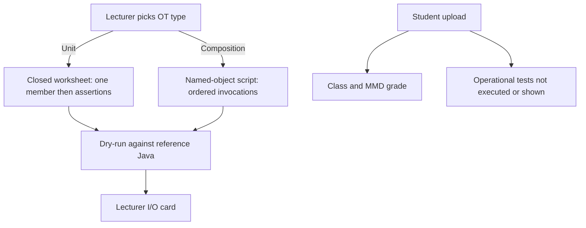
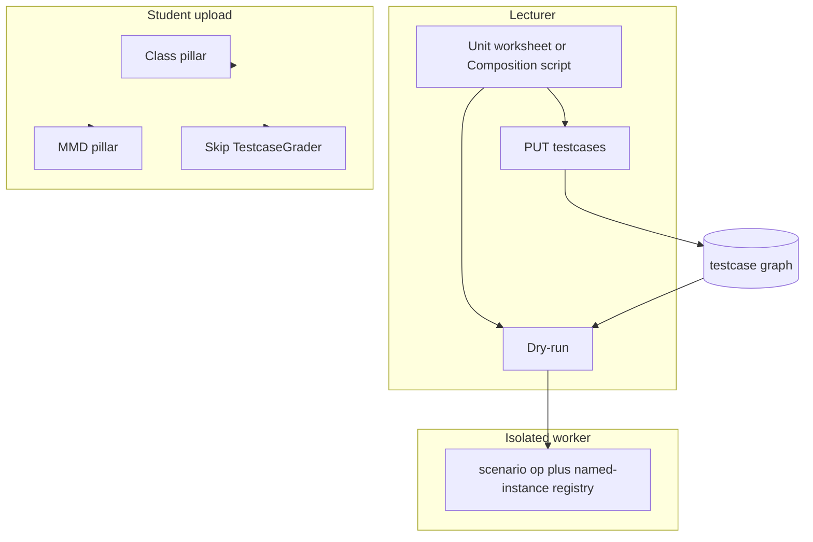

# Operational Testcase Unit and Composition - Plan

## Goal Capsule

- **Objective:** Rebuild lecturer operational-testcase authoring around two types — Unit (one-shot worksheet) and Composition (named-object script) — with dry-run against reference Java. Student execution is not active scope.
- **Product authority:** This Product Contract. Polymorphism, inheritance, and encapsulation types are not active scope. Student upload grading of operational tests is not active scope.
- **Open blockers:** None.
- **Stop conditions:** Do not change Class or MMD grading. Do not execute or show operational tests on student upload. Do not keep COMPARISON as a type. Do not migrate existing operational tests. Do not change sandbox topology or `workerJvmSlot`.
- **Execution:** Code. Prove AE1–AE10 with backend tests. `ce-work` owns the shipping tail.
- **Product Contract preservation:** Unchanged R/A/F/AE IDs. Outstanding Questions → KTD1–KTD11.

---

## Product Contract

### Summary

Lecturers author operational tests as either a closed Unit worksheet (one constructor or method, then assertions) or a Composition script (named objects, ordered invocations).
They dry-run both against uploaded reference Java.
Existing operational tests are wiped. Students still submit for Class and MMD; the testcase pillar stays dark until a later ship.

### Problem Frame

Today's operational tests are one scenario canvas plus a comparison type, with Unit and Composition only as labels on the same editor.
A one-shot method check and a multi-object script are the same kind of artifact, so the one-invocation limit is a convention, not a type.
Lecturers cannot treat Unit as a closed exam item, and object-typed arguments require the sequence canvas even when the teaching goal is a single call.

### Key Decisions

- **Closed Unit worksheet vs Composition script as two authoring flows** (session-settled: user-directed — chosen over one canvas with a Unit lock, and over Composition-only with Unit as a one-step script: Unit must feel like a different exam item). **Governs R1–R3, R26–R29.**
- **Lecturer authoring plus dry-run only; student operational tests stay dark** (session-settled: user-directed — chosen over grading students on day one, and over delaying the wipe until student execution ships: smallest ship that still makes the rebuild worth it). **Governs R11–R14.**
- **Wipe existing operational tests; lecturers re-author** (session-settled: user-directed — chosen over migrating one-step/multi-step/COMPARISON rows). **Governs R5.**
- **Drop COMPARISON** (session-settled: user-directed — chosen over keeping it as a third type or deferring leftover rows: Composition plus equals() or a compareTo() call covers it). **Governs R9, R21.**
- **Named objects come from constructor results and non-void method returns** (session-settled: user-directed — chosen over constructors-only and over naming field snapshots). **Governs R28, R29.**
- **equals() is Composition-only** (session-settled: user-directed — chosen over Unit equals against a typed expected object or a hidden expected construct: Unit has no second live instance). **Governs R20, R21.**
- **Students do not see Unit or Composition labels. Per-testcase weight is out.** (session-settled: user-directed — chosen from the keep-from-today set: dry-run, hidden-vs-example, and lecturer I/O stay; type labels and per-testcase weight do not). **Governs R6–R8, R11, R12.**

<!-- ce-section: work-relationships -->
### How This Work Fits Together

This plan owns **Unit and Composition lecturer authoring, dry-run, wipe of current operational tests, and a dark student testcase pillar**.
The broader operational-testcase rebuild (later types, student execution) is the current understanding, not a committed roadmap.

- Polymorphism, inheritance, and encapsulation operational-testcase types — **Still to decide**; they are not requirements here.
  - Student execution of Unit and Composition (upload invoke, student I/O cards, example vs hidden surfacing) — **Depends on** this authoring model; **Can proceed independently of** later types.
  - Arrays or lists of named objects as one argument — **Still to decide**; **Can proceed independently of** student execution once Composition exists.
- Current shipped scenario plus COMPARISON pillar (`docs/plans/2026-09-17-001-feat-testcase-pillar-oop-scenarios-plan.md`) — this contract **replaces** that product direction for types and student-visible principle tags, rather than extending it.
  - Class (Declaration Test) and MMD pillars — **Can proceed independently of** this rebuild; this work does not change them.
  - Isolated testcase worker used for lecturer dry-run — **Shares** the existing invoke isolation boundary; this work does not redefine sandboxing.

### Actors

- A1. **Lecturer** — authors Unit and Composition tests in Solution Management; dry-runs against reference Java; sets hidden vs example for later student use.
- A2. **Student** — still uploads Java for Class and MMD; does not have operational tests executed or shown.
- A3. **Dry-run runner** — invokes the lecturer's Unit or Composition test against uploaded reference bytecode and returns assertion outcomes for the lecturer I/O card.

### Requirements

**Types and authoring**

- R1. A Unit operational testcase is exactly one constructor or method invocation and at least one assertion. The lecturer cannot add a second invocation.
- R2. A Composition operational testcase is an ordered list of constructor and/or method invocations that share named objects, with at least one assertion on the testcase as a whole.
- R3. The lecturer chooses Unit or Composition. Unit is a closed one-shot worksheet (pick the member, then assertions). Composition is a named-object script (ordered invocations). These are two different authoring flows, not one canvas with a lock.
- R4. A step may carry zero assertions. The testcase as a whole must have at least one.
- R5. Shipping this rebuild deletes existing operational tests. Lecturers re-author as Unit or Composition. There is no mapping from current SINGLE_INVOCATION or COMPARISON rows.
- R6. The lecturer still sets hidden vs example on each testcase.
- R7. Students never see the type name Unit or Composition.
- R8. A testcase has no per-testcase scoring weight.
- R9. COMPARISON is not a type. Lecturers do not create two-instance comparison tests.
- R10. This ship does not add polymorphism, inheritance, or encapsulation as operational-testcase types.

**Dry-run and student path**

- R11. A lecturer dry-runs a Unit or Composition test against uploaded reference Java.
- R12. Dry-run presents an I/O card to the lecturer (input, expected, actual) for that test.
- R13. Student upload does not execute operational tests and does not show operational-test results.
- R14. Student upload still grades Class and MMD when those pillars apply.

**Assertions**

- R15. A value-returning method may assert return value (primitive or non-primitive), stdout, field state (primitive or non-primitive), and thrown exception.
- R16. A void method may assert stdout, field state (primitive or non-primitive), and thrown exception. It has no return-value assertion.
- R17. A constructor may assert the returned object, field state (primitive or non-primitive), and thrown exception. It has no stdout assertion.
- R18. An invocation that is expected to throw may still carry any other allowed assertion kinds for that target. The lecturer decides what is still meaningful.
- R19. An exception assertion matches exception type, not message.
- R20. For a non-primitive return value or constructor result, the lecturer picks one of: type-only (right class, not null), expected field map, or equals() against another live named object.
- R21. equals() is available only on Composition. Unit object checks are type-only or field map.
- R22. A Composition field-state assertion inspects any named object already created in that testcase.
- R23. A Unit instance-method field-state assertion inspects the hidden no-arg receiver. That receiver is not named.
- R24. A Unit constructor field-state assertion inspects the constructed instance. That instance is not named.
- R25. A dry-run testcase passes only when every configured assertion passes.

**Invocation rules**

- R26. For a Unit instance method, the runner constructs the receiver with a no-arg constructor. That construct does not count as the Unit invocation. If the class has no no-arg constructor, the lecturer cannot author a Unit test of that instance method.
- R27. Unit cannot pass a student/rubric-class object as an argument. Those tests belong in Composition.
- R28. Composition may name a constructor result and a non-void method return when that return is a student/rubric-class object, and later invocations may pass those names as arguments.
- R29. In Composition, creating a named object (constructor or named object return) requires a lecturer-chosen name.
- R30. Literal arguments are primitives, wrappers, String, null, and arrays of those. Student/rubric-class objects must be named instances.
- R31. A Unit test may target a static method as its one invocation. There is no receiver.
- R32. If a Composition step throws and that throw is not an accepted exception assertion, the sequence stops. Later invocations do not run. Their assertions count as failed (not executed).
- R33. Arrays or lists of named objects are not valid as one argument.

### Key Flows

- F1. Author and dry-run a Unit test
  - **Trigger:** Lecturer adds an operational testcase and chooses Unit.
  - **Actors:** A1, A3
  - **Steps:** Lecturer picks one constructor or method; for an instance method the hidden no-arg receiver applies per R26; lecturer adds at least one allowed assertion per R15–R17; lecturer dry-runs against reference Java and sees the I/O card.
  - **Outcome:** The worksheet stays one invocation. Dry-run pass/fail follows R25.
  - **Covered by:** R1, R3, R4, R11, R12, R15–R17, R23, R24, R26, R31

- F2. Author and dry-run a Composition test
  - **Trigger:** Lecturer adds an operational testcase and chooses Composition.
  - **Actors:** A1, A3
  - **Steps:** Lecturer adds ordered invocations; names constructor results and object-typed method returns; later steps may pass those names; setup steps may have zero assertions; at least one assertion exists on the testcase; lecturer dry-runs.
  - **Outcome:** Named objects are reusable as arguments. Unexpected throws stop the sequence per R32.
  - **Covered by:** R2–R4, R11, R12, R20–R22, R28–R30, R32

- F3. Student upload after the rebuild
  - **Trigger:** Student submits a lab that has Unit or Composition tests on the rubric.
  - **Actors:** A2
  - **Steps:** Upload still compiles and grades Class and MMD. Operational tests are not invoked. Student results omit operational-test I/O and pass/fail.
  - **Outcome:** The testcase pillar is dark for students. Hidden vs example remains stored for a later ship.
  - **Covered by:** R6, R7, R13, R14

### Acceptance Examples

- AE1. Unit instance method with a no-arg constructor
  - **Covers R1, R16, R23, R26.**
  - **Given:** Class `BankAccount` has a no-arg constructor and method `deposit(int)`.
  - **When:** Lecturer authors a Unit test of `deposit(100)` asserting field `balance` equals `100`.
  - **Then:** Dry-run constructs the hidden receiver, invokes `deposit` once, and scores field-state on that receiver.

- AE2. Unit instance method without a no-arg constructor
  - **Covers R26.**
  - **Given:** Class `Account` has only `Account(String id)`.
  - **When:** Lecturer tries to author a Unit test of an instance method on `Account`.
  - **Then:** Authoring is refused. That method belongs in Composition.

- AE3. Unit cannot take an object argument
  - **Covers R27.**
  - **Given:** Method `transfer(Account other, int amount)`.
  - **When:** Lecturer tries to author a Unit test that would pass another `Account`.
  - **Then:** Authoring is refused. The test belongs in Composition.

- AE4. Composition names a constructor result and reuses it
  - **Covers R2, R28, R29, R30.**
  - **Given:** `Engine(int hp)` and `Car(Engine e)`.
  - **When:** Lecturer constructs `eng` from `Engine(200)`, then constructs `car` passing `eng`.
  - **Then:** Dry-run uses the live `eng` instance as the `Car` argument.

- AE5. Composition setup step has no assertions
  - **Covers R4.**
  - **Given:** Two constructor steps and one method step.
  - **When:** Only the method step has assertions.
  - **Then:** The testcase is valid and dry-run asserts only that method step.

- AE6. Composition unexpected throw
  - **Covers R32, R25.**
  - **Given:** Three steps. Step 2 throws. Step 2 has no matching exception assertion.
  - **When:** Lecturer dry-runs.
  - **Then:** Step 3 does not run. Step 3 assertions fail as not executed. The testcase fails.

- AE7. Exception mixed with other assertions
  - **Covers R18, R19.**
  - **Given:** A method that prints then throws `IllegalArgumentException`.
  - **When:** Lecturer asserts that exception type, stdout, and a field on the receiver.
  - **Then:** Dry-run evaluates all three. Exception matching uses type only.

- AE8. Unit equals() is unavailable
  - **Covers R20, R21.**
  - **Given:** A method that returns a `Money` object.
  - **When:** Lecturer authors a Unit test of that method.
  - **Then:** Object checks offered are type-only and field map. equals() is not offered.

- AE9. Student upload stays dark
  - **Covers R7, R13, R14.**
  - **Given:** A challenge with Unit and Composition tests, plus Class and MMD rubrics.
  - **When:** A student uploads.
  - **Then:** Class and MMD still score. No operational-test execution, no I/O cards, no Unit/Composition labels.

- AE10. Constructor has no stdout assertion
  - **Covers R17.**
  - **Given:** A constructor that prints to stdout.
  - **When:** Lecturer authors a Unit or Composition constructor step.
  - **Then:** Allowed assertions are returned object, field state, and exception. Stdout is not offered.

### Success Criteria

- A lecturer can create a Unit test, a Composition test, and dry-run each against reference Java with an I/O card.
- A student upload of a lab that has those tests still returns Class and MMD results and does not return operational-test results.
- After ship, previously authored SINGLE_INVOCATION and COMPARISON tests are gone and must be re-authored.

### Scope Boundaries

**Deferred for later**

- Polymorphism, inheritance, and encapsulation operational-testcase types.
- Student execution, student I/O cards, and surfacing example vs hidden tests to students.
- Arrays or lists of named objects as a single argument.

**Outside this ship**

- COMPARISON as a type.
- Per-testcase scoring weight.
- Student-visible Unit/Composition labels.
- Constructor stdout assertions.
- Exception message matching.
- Class or MMD grading changes.
- Smell detection, JUnit upload, and scoring by diffing a reference solution.

### Dependencies / Assumptions

- Lecturer dry-run continues to use uploaded reference Java and the existing isolated invoke path. This ship does not redesign sandboxing.
- Challenge-level testcase pillar weight may remain on the challenge. It has no student effect while the pillar is dark.
- Evidence for why the current pillar fails was skipped; the rebuild is justified by the typed Unit vs Composition model in this contract.
- If a Unit constructor is the one invocation, field-state and return-object assertions target that constructed instance without naming it (symmetric with R23–R24).

### Outstanding Questions

None blocking. Product deferred items live under Scope Boundaries. Implementation unknowns that need runtime discovery live under Planning Contract assumptions.

### Sources / Research

- Current domain language: `CONCEPTS.md` (operational testcase, named instance, OOP principle tag, COMPARISON, assertion kind, I/O card, receiver construction).
- Lecturer authoring as shipped: `docs/LECTURER_OPERATIONAL_TESTCASE_GUIDE.md`.
- Prior product direction this contract replaces for types and tags: `docs/plans/2026-09-17-001-feat-testcase-pillar-oop-scenarios-plan.md`. That plan’s claim-check block still describes a pre-scenario codebase; the repo already ships multi-step named-instance scenarios.
- Original operational-testcase grading contract: `docs/plans/2026-08-11-001-feat-operational-testcase-grading-plan.md`.
- Wipe pattern: `docs/sql/2026-08-11-operational-testcase-grading.sql`.
- Save contract: `docs/solutions/logic-errors/lecturer-testcase-save-persistence.md`.
- Step reorder: `docs/solutions/database-issues/testcase-scenario-step-reorder-unique-order-index.md`.
- Receiver + cache: `docs/solutions/logic-errors/method-invocation-receiver-constructor.md`.
- Grading stack: `docs/solutions/architecture-patterns/operational-testcase-grading.md`.

---

## Planning Contract

### Key Technical Decisions

- KTD1. **Destructive wipe: truncate operational-test graphs with CASCADE, then rewrite types** (session-settled: user-approved — chosen over keeping historical student OT assertion rows: confirmed at plan-time scoping). Operator SQL plus `TestcaseSchemaMigrator`; then invalidate lab rubric caches. **Governs R5.**
- KTD2. **Student dark path skips invoke at grade time.** Do not run `TestcaseGrader` on upload. Treat the testcase pillar as not applicable for score assemble. Skip opening a worker JVM on upload when no student OT will run. Lecturer rows stay. Dry-run still uses the worker. **Governs R13, R14.**
- KTD3. **`TestcaseType` is `UNIT` | `COMPOSITION`.** Drop `COMPARISON`, `OopPrincipleTag`, per-testcase `weight`, and `COMPARISON_RESULT`. **Governs R7–R10.**
- KTD4. **Reuse the existing `scenario` worker op for both types** (session-settled: user-approved — chosen over a separate Unit invoke path: confirmed at plan-time scoping). Drop `compare`. Register constructor results and non-void object method returns in the in-worker named-instance registry. **Governs R2, R28, R29.**
- KTD5. **Unit is one `testcase_invocation` row.** Forbid `$instance` args and lecturer-set `receiver_constructor_id`. Instance methods use hidden no-arg construct. Save returns 422 when that constructor is missing. **Governs R1, R26, R27, R31.**
- KTD6. **Composition keeps today’s 20-step cap and park-delete-compact `order_index` sync.** Names are required on constructs and on named object returns. `$instance` refs must point at earlier names of matching rubric class. **Governs R2, R29, R30, R33.**
- KTD7. **Non-primitive object checks are type-only, a one-level field map of literals (same allowlist as R30), or equals() against another named instance.** equals() is Composition-only. Do not reuse `COMPARISON_RESULT`. **Governs R20, R21.**
- KTD8. **An unaccepted throw stops the sequence.** Later steps do not run. Their assertions fail as not executed. **Governs R32, R25.**
- KTD9. **Challenge-level `testcase_weight` stays on the challenge editor** (session-settled: user-approved — chosen over hiding it while the student pillar is dark). It has no student effect under KTD2. **Governs R8** (per-testcase weight remains out).
- KTD10. **Child rows upsert by client UUID.** Never delete-all-reinsert invocations or assertions. Park-delete-compact `order_index` stays. **Governs R5** persistence after wipe.
- KTD11. **Unit and Composition are two lecturer canvases.** Type is chosen at create. Switching type replaces the other flow’s graph, matching today’s type-switch behavior. **Governs R3.**

### High-Level Technical Design

Lecturer PUT still syncs a testcase graph by client UUID. Unit stores one invocation. Composition stores ordered invocations with names. Dry-run and (later) student grade share `scenario` IPC. This ship never sends student upload into that path.

Wipe truncates `submission_testcase_assertion_result`, `submission_testcase_result`, and rubric `testcase` graphs, then recreates `UNIT`/`COMPOSITION` enums. Past student OT detail is gone. Class/MMD rows stay.

### Assumptions

- PostgreSQL enum rewrite is done in the wipe SQL (create new type, swap column, drop old), not additive `ADD VALUE` only.
- Dispatch-type / Polymorphism save guardrails go away with tags; leftover `dispatch_class_id` columns are unused this ship and may be dropped in wipe SQL if nothing else reads them.
- Frontend has no automated test runner; UI contracts are proven by DTO/save tests plus manual Solution Management.
- `normalizeTestcaseForApi` stays shared between save and dry-run.

### Sequencing

U1 schema/wipe → U2 save validation → U3 worker/grader/assertions → U4 student dark path and U5 lecturer UI in parallel → U6 docs. Do not ship UI or dark-path frontend before U2 422 rules and U3 dry-run scoring exist.

### Alternative Approaches Considered

- One authoring canvas with a Unit lock — rejected in the Product Contract.
- Migrating `SINGLE_INVOCATION` / `COMPARISON` rows — rejected; wipe is the ship.
- Hiding student I/O after still running tests — rejected; R13 requires no execute.

---

## Implementation Units

### U1. Wipe schema and replace types

- **Goal:** Empty operational-test tables and persist `UNIT` / `COMPOSITION` with no COMPARISON, tags, or per-testcase weight.
- **Requirements:** R5, R7–R10, KTD1, KTD3
- **Dependencies:** None
- **Files:**
  - create `docs/sql/2026-09-23-operational-testcase-unit-composition.sql`
  - modify `backend/src/main/java/com/eiu/capstone/backend/config/TestcaseSchemaMigrator.java`
  - modify `backend/src/main/java/com/eiu/capstone/backend/model/TestcaseType.java`
  - modify `backend/src/main/java/com/eiu/capstone/backend/model/Testcase.java`
  - modify `backend/src/main/java/com/eiu/capstone/backend/model/AssertionKind.java`
  - modify `backend/src/main/java/com/eiu/capstone/backend/model/OopPrincipleTag.java` (remove or leave unused after drop)
  - modify `backend/src/test/java/unit/com/eiu/capstone/backend/config/TestcaseSchemaMigratorTest.java`
- **Approach:**
  1. Operator SQL truncates OT result and rubric graphs with CASCADE, then rewrites `testcase_type` and assertion-kind enums.
  2. Drop `oop_principle_tag`, `testcase.weight`, comparison instance tables, and unused comparison columns.
  3. Keep challenge `testcase_weight`.
  4. Migrator matches the operator SQL so local startups converge.
  5. After apply, invalidate every lab rubric cache (or require restart).
- **Patterns to follow:** `docs/sql/2026-08-11-operational-testcase-grading.sql`; `TestcaseSchemaMigrator` additive style plus this wipe script.
- **Execution note:** Characterization-read the current migrator tests before changing enum handling.
- **Test scenarios:**
  - Migrator/SQL: a copied schema with old `SINGLE_INVOCATION` rows is empty of testcases after wipe and accepts `UNIT`.
  - Entity mapping: `TestcaseType` has only `UNIT` and `COMPOSITION`.
  - Challenge `testcase_weight` column still exists.
- **Verification:** Operator SQL applies on a copy of the current schema; JPA maps the new enums; Class/MMD tables unchanged.

### U2. Rubric validate, save, and assemble

- **Goal:** Lecturers can save Unit and Composition graphs; 422 covers Unit/Composition rules; cache loads the new types.
- **Requirements:** R1–R6, R15–R22, R26–R33, KTD5, KTD6, KTD7, KTD10
- **Dependencies:** U1
- **Files:**
  - modify `backend/src/main/java/com/eiu/capstone/backend/service/TestcaseRubricService.java`
  - modify `backend/src/main/java/com/eiu/capstone/backend/DTO/rubric/testcase/TestcaseStructureDTO.java`
  - modify `backend/src/main/java/com/eiu/capstone/backend/DTO/rubric/testcase/InvocationStructureDTO.java`
  - modify `backend/src/main/java/com/eiu/capstone/backend/grading/rubric/TestcaseRubricAssembler.java`
  - modify `backend/src/main/java/com/eiu/capstone/backend/grading/rubric/InvocationRubric.java`
  - modify `backend/src/test/java/support/com/eiu/capstone/backend/service/TestcaseRubricServiceTest.java`
  - modify `backend/src/test/java/unit/com/eiu/capstone/backend/DTO/rubric/testcase/TestcaseStructureDTOParseTest.java`
- **Approach:**
  1. Keep sync-by-presence and park-delete-compact invocation `order_index`.
  2. Unit: exactly one invocation; no `$instance`; no receiver constructor; instance method requires a no-arg constructor on the declaring class; assertion kinds match R15–R18; object checks type-only or field map; at least one assertion.
  3. Composition: 1–20 steps; name required on constructor and on named object returns; `$instance` only to earlier names; equals() allowed; field-state may name any created instance; setup steps may have zero assertions.
  4. Reject object arrays as one argument (R33).
  5. Share `normalizeTestcaseForApi` with dry-run.
  6. Invalidate `LabRubricCache` on save.
- **Patterns to follow:** `docs/solutions/logic-errors/lecturer-testcase-save-persistence.md`; `docs/solutions/database-issues/testcase-scenario-step-reorder-unique-order-index.md`.
- **Execution note:** Start with failing save tests for AE2, AE3, AE5, AE8.
- **Test scenarios:**
  - Covers AE2. Unit instance method without no-arg constructor → 422.
  - Covers AE3. Unit object-typed argument → 422.
  - Covers AE5. Composition with two setup constructors and assertions only on the last step saves.
  - Covers AE8. Unit payload with equals() object check → 422.
  - Composition `$instance` to a named method return of matching class saves; unknown name → 422.
  - Omitting the first Composition step reindexes without unique `order_index` collision.
  - Re-save keeps assertion UUIDs (no CASCADE wipe of a staged result row in the integration test that already covers this).
  - Empty assertion list → 422.
- **Verification:** `TestcaseRubricServiceTest` and DTO parse tests cover the 422 matrix; GET testcases round-trips Unit and Composition.

### U3. Worker, grader, and object assertions

- **Goal:** Dry-run scores Unit and Composition through the isolated worker, including named method returns, object checks, and stop-on-unaccepted-throw.
- **Requirements:** R11, R12, R15–R25, R28–R32, KTD4, KTD7, KTD8
- **Dependencies:** U2
- **Files:**
  - modify `backend/src/main/java/com/eiu/capstone/backend/grading/pipeline/TestcaseGrader.java`
  - modify `backend/src/main/java/com/eiu/capstone/backend/grading/testcase/worker/WorkerInvokeEngine.java`
  - modify `backend/src/main/java/com/eiu/capstone/backend/grading/testcase/worker/WorkerIpc.java`
  - modify `backend/src/main/java/com/eiu/capstone/backend/grading/testcase/AssertionEvaluator.java`
  - modify `backend/src/main/java/com/eiu/capstone/backend/grading/testcase/TestcaseResultMapper.java`
  - modify `backend/src/main/java/com/eiu/capstone/backend/service/TestcaseDryRunService.java`
  - modify `backend/src/test/java/unit/com/eiu/capstone/backend/grading/pipeline/TestcaseGraderTest.java`
  - modify `backend/src/test/java/unit/com/eiu/capstone/backend/grading/testcase/worker/WorkerInvokeEngineTest.java`
  - modify `backend/src/test/java/unit/com/eiu/capstone/backend/grading/testcase/AssertionEvaluatorTest.java`
  - modify `backend/src/test/java/support/com/eiu/capstone/backend/service/TestcaseDryRunServiceTest.java`
- **Approach:**
  1. Remove `invokeComparison` / `OP_COMPARE` from grader and IPC.
  2. After a METHOD that returns a rubric-class object, register `instance_name` in the worker registry (today only constructors register).
  3. Unit METHOD without a name uses hidden no-arg receiver; field-state snapshots that receiver.
  4. Evaluate type-only, field-map, and named-instance equals() in the API from worker facts (no student `Class.forName` in the API).
  5. Unaccepted throw: stop remaining steps; mark later assertions failed-not-executed.
  6. Dry-run I/O card uses existing mapper/primary-assertion display without OOP tags.
- **Patterns to follow:** `docs/solutions/architecture-patterns/operational-testcase-grading.md`; IPC-only `InvocationRunner`.
- **Execution note:** Implement new assertion kinds and method-return registry test-first.
- **Test scenarios:**
  - Covers AE1. Unit `deposit` field-state on hidden receiver passes dry-run against a no-arg `BankAccount`.
  - Covers AE4. Composition `Engine` named `eng` passed into `Car` constructor.
  - Covers AE6. Mid-sequence unaccepted throw fails later assertions as not executed.
  - Covers AE7. Exception type plus stdout plus field-state on the same invocation.
  - Covers AE10. Constructor step rejects stdout assertion at save (U2) and does not evaluate stdout.
  - Named method return reused as a later argument.
  - Composition equals() between two named instances.
  - COMPARISON payloads are gone; leftover compare IPC is unused.
- **Verification:** Worker and grader unit tests plus dry-run support tests pass; no `compare` op required for green tests.

### U4. Dark student upload path

- **Goal:** Student upload grades Class and MMD only; operational tests are not invoked or shown.
- **Requirements:** R13, R14, R7, F3, AE9, KTD2
- **Dependencies:** U1
- **Files:**
  - modify `backend/src/main/java/com/eiu/capstone/backend/grading/pipeline/GradingPipeline.java`
  - modify `backend/src/main/java/com/eiu/capstone/backend/grading/GradingService.java`
  - modify `backend/src/main/java/com/eiu/capstone/backend/grading/LabResultAssembler.java`
  - modify `backend/src/main/java/com/eiu/capstone/backend/service/ClassStructureService.java`
  - modify `frontend/src/pages/StudentDashboard.jsx`
  - modify `frontend/src/components/student/StudentUI.jsx`
  - modify `backend/src/test/java/unit/com/eiu/capstone/backend/grading/LabResultAssemblerTest.java`
  - modify `backend/src/test/java/unit/com/eiu/capstone/backend/grading/GradingServiceTest.java`
  - modify `backend/src/test/java/integration/com/eiu/capstone/backend/pipeline/SubmissionPipelineIntegrationTest.java`
- **Approach:**
  1. Upload scoring treats testcase pillar as not applicable even when rubric testcases exist.
  2. Do not acquire `workerJvmSlot` on upload for OT (dry-run still does).
  3. `lab_result` omits operational-test arrays; revisit GET testcases is empty / not applicable.
  4. Student UI hides Operation Test tab when applicability is false.
  5. Challenge percentage uses only Class and MMD weights.
- **Patterns to follow:** existing `isPillarNotApplicable` / `scoreApplicability.testcase === false` tab hiding.
- **Test scenarios:**
  - Covers AE9. Upload of a challenge that has Unit/Composition rows still returns Class and MMD scores and no testcase I/O.
  - Assembler: `testcaseApplicable` false ⇒ no testcase tree.
  - GradingService: upload with OT rows on the rubric does not open a worker session.
  - Student UI: Operation Test tab absent when applicability is false.
- **Verification:** Pipeline/assembler tests pass; `npm run build` in `frontend/` succeeds.

### U5. Lecturer Unit worksheet and Composition script

- **Goal:** Two different authoring flows plus dry-run I/O in Solution Management.
- **Requirements:** R3, R6, R11, R12, F1, F2, KTD9, KTD11
- **Dependencies:** U2, U3
- **Files:**
  - modify `frontend/src/components/lecturer/structure/TestcasesPanel.jsx`
  - create lecturer structure subcomponents for Unit worksheet and Composition script (split out of the panel)
  - modify `frontend/src/components/lecturer/structure/ChallengeDetailPanel.jsx` (keep challenge testcase weight; no per-testcase weight)
  - modify `frontend/src/components/lecturer/AGENTS.md`
- **Approach:**
  1. Add-testcase chooses Unit or Composition up front; editors are different canvases, not one list with a lock.
  2. Unit: member picker, scalar params, allowed assertions, no step list, no instance names, no equals().
  3. Composition: ordered steps, names, `$instance`, optional per-step assertions, equals() between names.
  4. Switching type replaces the other flow’s graph (same destructive switch as today’s type dropdown).
  5. Keep hidden vs example, name, dry-run, Run all, Save Testcases.
  6. Drop OOP tag, comparison builder, and per-testcase weight fields.
- **Patterns to follow:** existing `emptyTestcase`, `normalizeTestcaseForApi`, `DryRunResultCard`, `ReferenceJavaFiles.jsx`.
- **Test scenarios:**
  - Test expectation: none — frontend has no automated tests. U2/U3 own the payload and dry-run contracts. Manual: Unit cannot add a second step; Composition can name a method return; dry-run shows the I/O card; challenge testcase weight still edits.
- **Verification:** Manual Solution Management against a local API after U2/U3; `npm run build`.

### U6. Docs and domain language

- **Goal:** CONCEPTS, lecturer guide, and AGENTS match Unit/Composition and the dark student pillar.
- **Requirements:** R3, R9, R13, KTD3
- **Dependencies:** U1–U5
- **Files:**
  - modify `CONCEPTS.md`
  - modify `docs/LECTURER_OPERATIONAL_TESTCASE_GUIDE.md`
  - modify `docs/GRADING_WORKFLOWS.md`
  - modify `backend/AGENTS.md`
  - modify `backend/src/main/java/com/eiu/capstone/backend/grading/AGENTS.md`
  - modify `backend/src/main/java/com/eiu/capstone/backend/service/AGENTS.md`
  - modify `frontend/src/components/lecturer/AGENTS.md`
  - modify `frontend/src/components/student/AGENTS.md`
- **Approach:**
  1. Replace OOP principle tag as the lecturer type model with Unit and Composition types.
  2. Document wipe + cache invalidation as the operator step.
  3. Document that student upload does not run OT this ship.
- **Patterns to follow:** existing CONCEPTS entry shape; DOX Child Index only if a new durable folder appears (it should not).
- **Test scenarios:**
  - Test expectation: none — documentation. Spot-check that no leftover SINGLE_INVOCATION / COMPARISON authoring steps remain in the lecturer guide.
- **Verification:** Docs match shipped types; no contradictory COMPARISON authoring recipes.

---

## Verification Contract

| Gate | Command / signal | Covers |
|---|---|---|
| Backend suite | `mvn test` from `backend/` | U1–U4 |
| Frontend compile | `npm run build` from `frontend/` | U4, U5 |
| Manual dry-run | Solution Management Unit + Composition against reference Java | AE1, AE4, F1, F2 |
| Manual student upload | Submit a lab that has OT rows; Class/MMD score; no Operation Test tab | AE9, F3 |
| Operator wipe | Apply `docs/sql/2026-09-23-operational-testcase-unit-composition.sql` on a copy, then restart or invalidate caches | R5, KTD1 |

No `release:validate` skill eval applies. Frontend has no unit test command.

---

## Definition of Done

- A lecturer can create a Unit test and a Composition test, save them, and dry-run each with an I/O card.
- Student upload of a lab that has those tests still returns Class and MMD and does not execute or show operational tests.
- Previous `SINGLE_INVOCATION` / `COMPARISON` rows are gone after operator SQL.
- AE1–AE10 are proven by U2/U3/U4 tests or the matching manual gate.
- Abandoned experiment code is not left in the diff.
- CONCEPTS and the lecturer guide describe Unit and Composition as types, not as principle tags on a shared scenario.

### Per-unit done

- U1: wipe SQL + migrator leave only UNIT/COMPOSITION.
- U2: 422 matrix and round-trip GET/PUT.
- U3: dry-run worker scores named returns, object checks, and stop-on-throw.
- U4: upload skips worker OT; student tab hidden.
- U5: two authoring canvases in Solution Management.
- U6: docs match the ship.

---

## System-Wide Impact

- **Data:** wipe CASCADE deletes historical OT assertion detail. Class/MMD submission rows stay.
- **Scoring:** challenge totals omit the testcase pillar while dark even if challenge `testcase_weight` remains.
- **Capacity:** student upload no longer takes `workerJvmSlot` for OT; dry-run still does.
- **Cache:** post-wipe rubric cache must be invalid or FK mismatches appear on later dry-run.

---

## Risks & Dependencies

- PostgreSQL enum rewrite is easy to get wrong on a live DB; run the wipe SQL on a copy first.
- Method-return naming is new in the worker registry; U3 is blocked if it is treated as UI-only.
- Broad test churn: many tests still name `SINGLE_INVOCATION`, `COMPARISON`, and `OopPrincipleTag`.
- Lecturer dry-run still depends on uploaded reference Java and the isolated worker JAR.

---

## Documentation / Operational Notes

- Ship order: apply wipe SQL, restart API (or invalidate all lab caches), then roll the new UI/API together so lecturers never POST old types.
- Update `docs/LECTURER_OPERATIONAL_TESTCASE_GUIDE.md` in U6 before asking lecturers to re-author.
