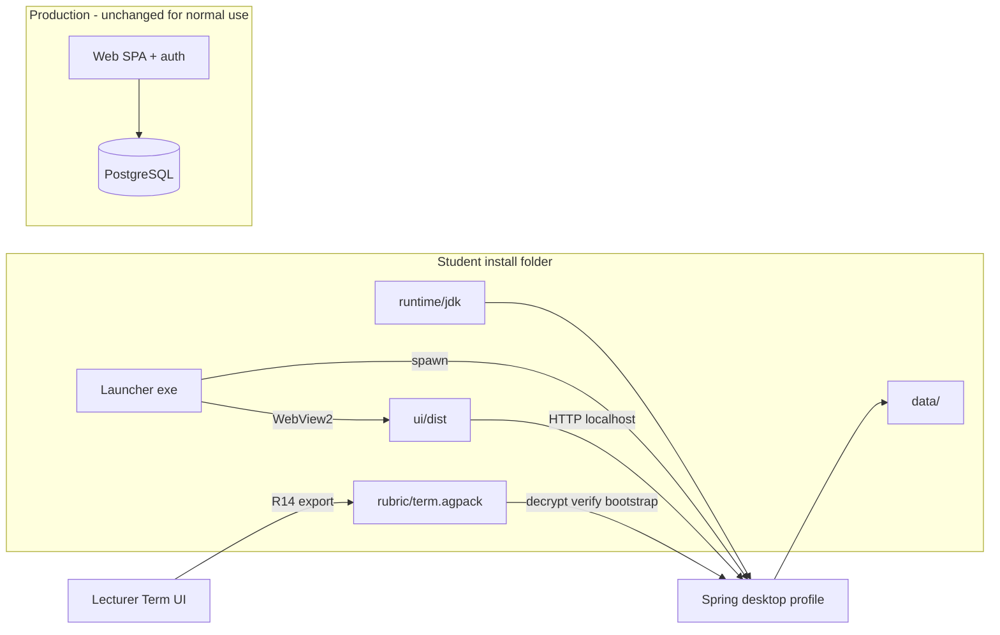

# Student Desktop Local Mode - Plan

## Goal Capsule

**Objective:** Deliver a Windows-portable **student practice grader**: one folder, one launcher, one app window (embedded webview — not a separate browser tab). Students grade Java + MMD uploads locally with the same student dashboard UX as the web app, using rubric data supplied as a replaceable encrypted pack. No login, no sync with the production website, and no claim that local scores are official.

**Product authority:** This plan owns the **desktop local-mode student experience**, the **term rubric pack contract**, and **lecturer pack export (R14)** on the production web app. It does not own web authentication changes, lecturer plagiarism workflows, or bidirectional score sync with the cloud.

**Open blockers:** None for implementation start. Launcher technology and export screen placement are planning decisions captured in KTD2 and KTD7 below.

## Product Contract

### Summary

Ship a self-contained folder students can unzip and run: launcher opens a frameless window showing the existing student dashboard (minus auth and web-only features), a bundled Java runtime runs the grading backend in **local profile**, and rubric plus master data plus operational testcase graphs load from an encrypted, signed drop-in under `rubric/`. Local submissions, attempt numbers, and history live only on disk under the install folder; production PostgreSQL and JWT session rules do not apply.

### Problem Frame

Students sometimes work without reliable internet. The production SPA requires Google or IRN login, live APIs, and server-side rubrics. A portable practice mode reduces friction (no browser, no account) while reusing the grading engine and UI students already know — without pretending local results are enrolled or lecturer-visible.

### Key Decisions

- **Embedded webview shell over separate browser** (session-settled: user-directed — chosen over student-visible localhost in Chrome: matches AntiCheatingTool-style “double-click exe, one window”).
  - Governs R1, R2.

- **Reuse React student dashboard + Java grading pipeline** (session-settled: user-approved — chosen over a minimal native judge UI: keep Class/MMD/OT breakdown and lab sidebar).
  - Governs R3, R4.

- **No login and no term/access enforcement in local mode** (session-settled: user-directed — chosen over mirroring `StudentTermAccessService`: practice tool, not enrollment gate).
  - Governs R5.

- **No sync with web scores or shared attempt numbering** (session-settled: user-directed — chosen over merge/queue to production API in v1).
  - Governs R6, R7.

- **Skip plagiarism in local mode** (session-settled: user-approved).
  - Governs R8.

- **Rubric delivered as replaceable encrypted pack, not baked into the exe** (session-settled: user-approved — chosen over full reinstall on rubric change).
  - Governs R9, R10.

- **Bundled portable JDK + worker JAR inside the folder** (session-settled: user-approved — students install nothing beyond the folder).
  - Governs R11.

- **Local `SUBMISSION_BASE_DIR` and history under the install `data/` tree** (session-settled: user-approved).
  - Governs R12.

- **Encryption targets casual rubric browsing; signing targets pack tampering** (session-settled: user-approved — user asked for encryption; accept that offline grading cannot be cheat-proof against determined reverse engineering).
  - Governs R10.

- **One rubric pack per academic term/quarter** (session-settled: user-directed — chosen over per-lab packs or dual format in v1: single download for students for the whole term).
  - Governs R9, F3, R14.

- **Lecturer generates term pack from the web app** (session-settled: user-directed — chosen over operator-only CLI in v1: lecturers publish practice rubrics without a separate tool).
  - Governs R14.

- **Rubric pack changes require app restart** (session-settled: user-directed — chosen over hot reload in v1: simplest reliable load path).
  - Governs F3, R10.

### Requirements

**Packaging and launcher**

- **R1.** The shipped artifact is a **single directory** the student can copy or unzip; starting the app requires only running the provided launcher (e.g. `OOP-AutoGrader.exe` or equivalent) — no manual JDK install, no separate “start backend then open browser” steps.
- **R2.** The launcher presents **one desktop window** (embedded webview). The student must not need to open an external browser or type a URL to use the product.

**Student experience**

- **R3.** Local mode exposes the **student submit dashboard** behavior: lab list, upload, post-upload scores, and Class / MMD / Operational Test result tabs consistent with student disclosure on the web app.
- **R4.** Local mode exposes **student history** for attempts created on **this machine only** (fresh start on first run; no import from production).
- **R5.** Local mode has **no login**, no Google OAuth, no password change, and no session JWT requirements for student flows.
- **R6.** Local attempt numbers are **independent** from production; the product does not display or reconcile web attempt ids.
- **R7.** Local scores and history are **not uploaded or synchronized** to the production backend in v1.

**Grading and data**

- **R8.** Local grading runs the **existing Java compile + reflection + MMD + operational testcase worker** path; plagiarism detection is **disabled**.
- **R9.** Grading reads rubric structure, scoring weights, master data needed for labels/checks, and operational testcase invocation graphs from **one local term rubric pack** under the install folder (all labs for that term/quarter in one signed bundle), not from production PostgreSQL.
- **R10.** Rubric packs are **encrypted at rest** and **cryptographically signed** by the institution; the desktop app verifies signature before load and rejects tampered packs with a clear error. Replacing rubric content must not require replacing the launcher or runtime bundle.
- **R11.** The folder includes a **portable Java 17+ runtime** and the **worker JAR** required for operational testcases, with paths configured relative to the install root.
- **R12.** Ephemeral grading artifacts and parsed snapshots use a **`data/` submission root** under the install folder (equivalent role to production `SUBMISSION_BASE_DIR`).

**Platform**

- **R13.** **v1 targets Windows** x64 for student distribution; other OSes are out of scope unless explicitly added later.

**Lecturer export (production web app)**

- **R14.** Lecturers with appropriate access can **export a signed, encrypted term rubric pack** from the production web app (e.g. Solution Management or Term context) for the current or selected term, containing all labs and rubric data required by R9.

### Key Flows

**F1 — First run**

1. Student unpacks folder and runs launcher.
2. Launcher starts local backend (local profile), waits until healthy.
3. Launcher opens webview to bundled student UI.
4. If no valid rubric pack is present, UI shows instructions to place pack in `rubric/` (no grading until then).

**F2 — Practice submit**

1. Student selects a lab from locally loaded rubric metadata.
2. Student uploads Java + MMD via existing DropZone flow against local API.
3. Backend grades using pack data; locals store records attempt with local attempt number and rubric pack version id.
4. Results render as on web (challenge scores, tabs).

**F3 — Rubric update**

1. Student or TA replaces rubric pack file(s) in `rubric/` per published instructions.
2. Student **restarts the application** (required in v1).
3. New attempts grade against new pack version; prior local attempts remain labeled with the pack version used.

**F4 — Local history**

1. Student opens history section in UI.
2. App lists only submissions persisted under local `data/`; no production `my-history` calls.

### Acceptance Examples

- **AE1 (Covers R1, R2):** On a clean Windows VM with no JDK installed, unzip folder → run launcher → one window opens with student UI within a reasonable startup time; no browser window appears.
- **AE2 (Covers R5, R7):** With network disabled, student completes upload and sees graded Class tab; no auth prompts appear.
- **AE3 (Covers R9, R10):** Valid signed pack present → labs listed match pack manifest. Corrupt signature or edited ciphertext → app refuses to grade and shows actionable error.
- **AE4 (Covers R6, R7):** After three local submits for one lab, history shows attempts 1–3 locally; production site (if consulted separately) shows unrelated attempt numbering.
- **AE5 (Covers R3):** Lab with operational testcases runs worker-invoked tests locally; compile failure surfaces on Class tab like production student view.

### Scope Boundaries

**In scope (v1)**

- Windows portable folder, launcher, embedded webview, local backend profile, rubric pack load, local SQLite or equivalent persistence for history, student UI subset described in R3–R5, lecturer pack export (R14).

**Deferred for later**

- Upload queue and sync to production API.
- Mac/Linux packages.
- Code signing and auto-update for the launcher.
- Online bootstrap or hybrid auth.

**Outside this product’s identity (local mode)**

- Official enrollment, deadline enforcement, plagiarism, lecturer analytics, and grade overview tied to local attempts.

### Dependencies / Assumptions

- Students accept that local mode is **practice**, not official submission.
- Existing student disclosure rules apply to how much testcase detail is shown in UI; encryption does not replace disclosure policy.

### Sources / Research

- Prior exploration: `docs/ideation/2026-09-29-offline-student-desktop-ideation.html`
- Student UI and API surface: `frontend/src/pages/AGENTS.md`, `frontend/AGENTS.md`
- Grading pipeline and rubric cache: `backend/AGENTS.md`
- Rubric load path: `backend/src/main/java/com/eiu/capstone/backend/grading/rubric/LabRubricCache.java`, `LabRubricService.java`
- Security baseline: `backend/src/main/java/com/eiu/capstone/backend/config/SecurityConfig.java`

<!-- ce-section: work-relationships -->

### How This Work Fits Together

This plan owns **desktop local-mode student grading** and **lecturer term pack export**.

- **Depends on** existing web student dashboard components and Java grading services (reuse, not rewrite).
- **Enables** future optional sync phase (not v1) without redesign if local attempt records carry rubric version ids.
- **Can proceed independently of** production auth changes and plagiarism features.

---

## Planning Contract

**Product Contract preservation:** Planning sections added in place; Product Contract meaning and R/F/AE IDs unchanged.

### Key Technical Decisions

- **KTD1 — Spring profile `desktop` with embedded H2 file DB (PostgreSQL compatibility mode)** — Governs R4, R8, R12. Use H2 in file mode under `{install}/data/desktop-db` with `MODE=PostgreSQL` (and JSON compatibility as needed) so `UploadPersistService` / `GradingResultJdbcWriter` UPSERT paths used on student upload remain viable. Validate upload persist integration test on H2 in U8; if a statement is irreconcilable, scope a desktop-specific JDBC branch only for that statement (last resort). Production PostgreSQL profile unchanged.

- **KTD2 — WebView2 + small .NET launcher (Windows v1)** — Governs R1, R2. Launcher starts bundled `java -jar app.jar --spring.profiles.active=desktop`, polls `GET /`, opens WebView2 to `http://127.0.0.1:{port}/` (fixed port in config, e.g. 18082). Spring `desktop` profile serves the Vite `dist-desktop` static assets at `/` (or `/ui/**`) so the webview loads same-origin API + UI without a separate static file server. Student never opens an external browser. Tauri deferred.

- **KTD3 — Term pack as signed `.agpack` file** — Governs R9, R10, R14. Outer JSON manifest (term id, label, pack version, lab ids, createdAt) + inner ciphertext blob. **Ed25519** signature over manifest + ciphertext hash using server private key from env (`DESKTOP_PACK_SIGNING_PRIVATE_KEY`); desktop and export share **public key** baked into `backend` resource `desktop-pack-public.key`. **AES-256-GCM** content encryption with key derived from embedded desktop secret (deter casual browsing; not reverse-engineering proof). Student drops single file at `{install}/rubric/term.agpack`.

- **KTD4 — Pack bootstrap into local DB on startup** — Governs R9, F3. `@Profile("desktop")` `DesktopPackBootstrapper` decrypts/verifies pack, wipes/reloads rubric-related rows for labs in pack, seeds `master_data` slices, stores `packVersion` in local metadata table. `LabRubricCache` continues to call `LabRubricService.loadForLab` against H2 — no parallel grader fork.

- **KTD5 — Synthetic local student identity (no JWT)** — Governs R5. `@Profile("desktop")` **`DesktopSecurityConfig` replaces the default `SecurityFilterChain`** (`SecurityConfig` active only when `@Profile("!desktop")`) so JWT filter never runs locally. Permit student API paths and inject fixed `Authentication` (local user row created on first boot). Desktop `StudentTermAccessService` stub always allows upload. Disable plagiarism beans/schedulers under `desktop`.

- **KTD6 — Frontend `desktop` Vite mode** — Governs R3, R5. Build flag `VITE_APP_MODE=desktop`: skip Google provider gate, mount student routes at `/` without login, hide change-password and presence polling, `VITE_API_URL` points at launcher-chosen localhost port. Static assets copied to `{install}/ui/`.

- **KTD7 — Lecturer export on Term Management** — Governs R14. `GET /api/lecturer/terms/{termId}/desktop-pack` returns `application/octet-stream` `.agpack` built from same serializer as bootstrap expects. Button on `TermManagement.jsx` when term is selected (current term first).

### High-Level Technical Design

Pack lifecycle: export on cloud reads live rubric via existing `LabRubricService` + lab list for term → serialize → encrypt → sign → download. Desktop startup reads pack once (F3 restart required to reload).

### Assumptions

- Institution generates and protects `DESKTOP_PACK_SIGNING_PRIVATE_KEY` only on server; never ship private key in student folder.
- v1 manual packaging script assembles Temurin JRE zip + jars + ui + launcher (documented in `docs/DESKTOP_STUDENT_DIST.md`); CI packaging deferred.

### Risks and Mitigations

| Risk | Mitigation |
|------|------------|
| H2 vs PostgreSQL JDBC dialect in `GradingResultJdbcWriter` | U8 integration test; H2 PostgreSQL mode; desktop-only SQL fork only if test proves necessity |
| Embedded pack decrypt key extractable | Document as practice-mode anti-casual-cheating only (Product Contract); signing prevents pack forgery |
| Two `SecurityFilterChain` beans | KTD5 — profile-split `SecurityConfig` / `DesktopSecurityConfig` |
| Large student zip size | Accept for v1; document minimum disk space in `DESKTOP_STUDENT_DIST.md` |

### Open Questions (planning-resolved)

| Item | Resolution |
|------|------------|
| Launcher stack | KTD2 — WebView2 + .NET |
| Export UI placement | KTD7 — Term Management |
| Hot reload pack | Out of scope per F3; restart required |

---

## Implementation Units

### U1. Term pack serializer and crypto

**Goal:** Define `.agpack` format and shared encrypt/sign/verify utilities used by export and desktop bootstrap.

**Requirements:** R9, R10, R14.

**Dependencies:** None.

**Files:**

- `backend/src/main/java/com/eiu/capstone/backend/desktop/pack/DesktopPackManifest.java`
- `backend/src/main/java/com/eiu/capstone/backend/desktop/pack/DesktopPackSerializer.java`
- `backend/src/main/java/com/eiu/capstone/backend/desktop/pack/DesktopPackCrypto.java`
- `backend/src/main/resources/desktop-pack-public.key` (placeholder; ops replaces at deploy)
- `backend/src/test/java/unit/com/eiu/capstone/backend/desktop/DesktopPackCryptoTest.java`

**Approach:** Serialize term metadata, master-data subset, and per-lab rubric DTO graph (reuse structures close to `LabRubricSnapshot` / export-friendly records). Sign manifest + ciphertext. Unit-test roundtrip and tamper rejection.

**Patterns to follow:** Existing DTO style in `backend/src/main/java/com/eiu/capstone/backend/DTO/`.

**Test scenarios:**

- Covers AE3: valid pack verifies; flipped signature byte fails.
- Roundtrip encrypt/decrypt preserves lab count and challenge ids.
- Manifest lists pack version string stored for F2 attempt metadata.

**Verification:** Unit tests pass; manual serialize sample pack from test fixture.

---

### U2. Lecturer term pack export API

**Goal:** R14 — lecturers download encrypted signed pack for a term.

**Requirements:** R14.

**Dependencies:** U1.

**Files:**

- `backend/src/main/java/com/eiu/capstone/backend/desktop/pack/DesktopPackExportService.java`
- `backend/src/main/java/com/eiu/capstone/backend/controller/LecturerTermController.java` (new GET endpoint)
- `backend/src/main/resources/application.yml` (signing key env doc)
- `backend/src/test/java/authorization/com/eiu/capstone/backend/security/LecturerTermDesktopPackTest.java` (or integration under `integration/`)

**Approach:** Load labs for term from existing repositories; for each lab call rubric load path mirroring `LabRubricService`; feed U1 serializer; stream bytes. Lecturer JWT required; 404 when term has no labs.

**Patterns to follow:** `LecturerTermController` existing roster endpoints; `SecurityConfig` lecturer matchers.

**Test scenarios:**

- Lecturer GET returns 200 and non-empty body for term with labs.
- Student JWT → 403.
- Missing signing key → 503 with friendly message (no stack trace to client).

**Verification:** Authorization test + manual Swagger download.

---

### U3. Term Management export button

**Goal:** Wire lecturer UI to R14 endpoint.

**Requirements:** R14.

**Dependencies:** U2.

**Files:**

- `frontend/src/pages/TermManagement.jsx`
- `frontend/AGENTS.md` (contract note if behavior added)

**Approach:** “Download desktop practice pack” action on selected term; `apiFetch` blob download; toast on success/fail per existing patterns.

**Test scenarios:** Manual: lecturer downloads `.agpack`; file decrypts in U1 unit test harness.

**Verification:** `npm run build`; manual click path.

---

### U4. Spring `desktop` profile — database, paths, plagiarism off

**Goal:** Runnable local API without PostgreSQL.

**Requirements:** R8, R11, R12.

**Dependencies:** None (parallel with U1).

**Files:**

- `backend/src/main/resources/application-desktop.yml`
- `backend/src/main/java/com/eiu/capstone/backend/config/DesktopWebMvcConfig.java` (static ui from `app.desktop.ui-dir`)
- `backend/src/main/java/com/eiu/capstone/backend/config/SecurityConfig.java` (`@Profile("!desktop")` on existing chain)
- `backend/pom.xml` (H2 test/runtime scope if not present)
- `backend/AGENTS.md` (profile contract)

**Approach:** H2 file URL under `${app.desktop.install-dir}/data/desktop-db` with PostgreSQL compatibility; set `app.storage.submission-base-dir`, `app.grading.worker-jar`, `app.grading.worker-java`, `app.desktop.ui-dir` relative to install dir env `APP_DESKTOP_HOME`. Disable plagiarism service/schedulers via `@Profile("!desktop")` or no-op beans. `SPRINGDOC_ENABLED=false` default in desktop yml.

**Patterns to follow:** `application.properties` grading keys; `backend/AGENTS.md` env table.

**Test scenarios:**

- Application context loads with `@ActiveProfiles("desktop")` in slice test.
- Upload persist integration on H2 succeeds for one lab submission (jsonb UPSERT path).
- Plagiarism bean absent or no-op when desktop active.

**Verification:** `mvn test` for new config test; `mvn spring-boot:run -Dspring-boot.run.profiles=desktop` with env home path.

---

### U5. Pack bootstrap and desktop security

**Goal:** Load pack into H2; serve student APIs without login.

**Requirements:** R5, R9, F1, F3.

**Dependencies:** U1, U4.

**Files:**

- `backend/src/main/java/com/eiu/capstone/backend/desktop/DesktopPackBootstrapper.java`
- `backend/src/main/java/com/eiu/capstone/backend/desktop/DesktopLocalUserService.java`
- `backend/src/main/java/com/eiu/capstone/backend/config/DesktopSecurityConfig.java`
- `backend/src/main/java/com/eiu/capstone/backend/service/StudentTermAccessService.java` (desktop bypass delegate or `@Profile` alternate)
- `backend/src/test/java/integration/com/eiu/capstone/backend/desktop/DesktopPackBootstrapIntegrationTest.java`

**Approach:** On `ApplicationReadyEvent`, read `{APP_DESKTOP_HOME}/rubric/term.agpack`; verify; import labs/rubric/master data transactionally; record pack version. Replace `SecurityFilterChain` for desktop profile: permit `/api/labs/**`, `/api/submissions/**`, `/api/students/**`, static UI if served; fixed student principal. No JWT filter.

**Patterns to follow:** `SecurityConfig.java` matcher style; `LabRubricCache` invalidation after import.

**Test scenarios:**

- Covers AE3: missing pack → health OK but lab list empty + explicit error DTO or banner endpoint.
- Covers AE2: upload endpoint accepts multipart without Authorization header.
- Bootstrap idempotent on restart with same pack version.

**Verification:** Integration test with temp pack fixture; manual upload against desktop profile.

---

### U6. Frontend desktop build

**Goal:** Student UI without auth for bundled static files.

**Requirements:** R3, R4, R5.

**Dependencies:** U5 (API contract stable).

**Files:**

- `frontend/src/App.desktop.jsx` or conditional branches in `frontend/src/App.jsx`
- `frontend/src/main.jsx`
- `frontend/vite.config.js` (desktop mode build)
- `frontend/package.json` (`build:desktop` script)
- `frontend/AGENTS.md`

**Approach:** `VITE_APP_MODE=desktop` entry: routes only `/student-dashboard`, `/student-history`; seed fake user in sessionStorage or skip `readStoredUser` gate; disable presence footer; point API to env URL. Remove Google client requirement in desktop build.

**Patterns to follow:** Existing `StudentDashboard.jsx`, `RequireRole` patterns.

**Test scenarios:**

- Covers AE2: build succeeds without `VITE_GOOGLE_CLIENT_ID`.
- Manual: history view shows only local submissions after uploads.

**Verification:** `npm run build:desktop`.

---

### U7. WebView2 launcher and dist layout script

**Goal:** R1, R2 — one-folder student experience.

**Requirements:** R1, R2, R11, AE1.

**Dependencies:** U4, U5, U6.

**Files:**

- `desktop/launcher/` (new .NET project — WebView2 host)
- `scripts/assemble-student-desktop.ps1`
- `docs/DESKTOP_STUDENT_DIST.md`

**Approach:** Launcher sets `APP_DESKTOP_HOME` to its directory, spawns Java with bundled JRE, waits for `/`, opens WebView2 window. Script copies `backend/target/backend-*.jar`, worker jar, `frontend/dist-desktop`, creates empty `rubric/`, `data/`. Document student steps: copy `term.agpack` from lecturer, restart after update.

**Execution note:** Prefer install/runtime smoke over unit tests for launcher.

**Test scenarios:**

- Covers AE1: clean VM script run → single window, no external browser.
- Kill launcher terminates Java child process.

**Verification:** Manual on Windows per AE1.

---

### U8. End-to-end desktop upload regression

**Goal:** Guard grading path on desktop profile.

**Requirements:** R3, R8, AE5.

**Dependencies:** U5, U6.

**Files:**

- `backend/src/test/java/integration/com/eiu/capstone/backend/desktop/DesktopSubmissionPipelineIntegrationTest.java`
- Reuse fixtures from `backend/src/test/java/integration/com/eiu/capstone/backend/pipeline/SubmissionPipelineIntegrationTest.java`

**Approach:** Bootstrap minimal pack + sample lab in H2; POST upload; assert challenge scores and class tab GET returns student disclosure shape.

**Test scenarios:**

- Covers AE5: OT lab invokes worker when pack includes testcase rows.
- Compile failure surfaces compile error JSON path.

**Verification:** `mvn test` from `backend/`.

---

## Verification Contract

| Check | Command / action |
|-------|------------------|
| Backend unit + integration | `mvn test` from `backend/` |
| Frontend desktop build | `npm run build:desktop` from `frontend/` |
| Authorization export | Lecturer desktop-pack test in U2 |
| Manual smoke | `docs/DESKTOP_STUDENT_DIST.md` checklist on Windows VM (AE1–AE3) |

## Definition of Done

- [x] Lecturer can export `.agpack` for a term from Term Management (R14).
- [x] Student folder runs via launcher (WebView2 `.exe` or `.bat` fallback); embedded UI; no login (R1, R2, R5). Manual AE1 on clean VM still recommended.
- [x] Valid pack enables lab list, upload, Class/MMD/OT tabs, local history (R3, R4, R8).
- [x] Invalid/tampered pack blocked with clear error (R10, AE3) — bootstrap + `DesktopPracticeStatusBanner`.
- [x] Replacing pack and restarting changes grading basis; attempts retain pack version label (F3) — `lab_submission.desktop_pack_version`.
- [x] No plagiarism runs; no production sync (R7, R8).
- [x] `backend/AGENTS.md` and `frontend/AGENTS.md` document `desktop` profile and build mode.
- [x] `CONCEPTS.md` entries remain accurate (Rubric pack, Local student desktop mode).
- [x] Web students can **Download practice folder** (`GET /api/students/desktop-practice-bundle`) from the submit dashboard.

---

## Appendix

### Deferred to Follow-Up Work

- Tauri cross-platform launcher.
- Automated CI artifact publishing for student zip.
- Pack hot-reload without restart.
- Sync queue to production API.
