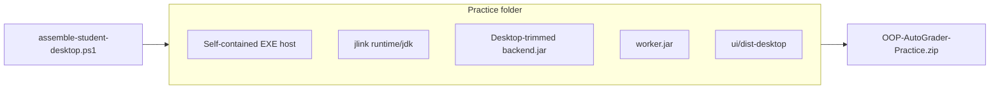
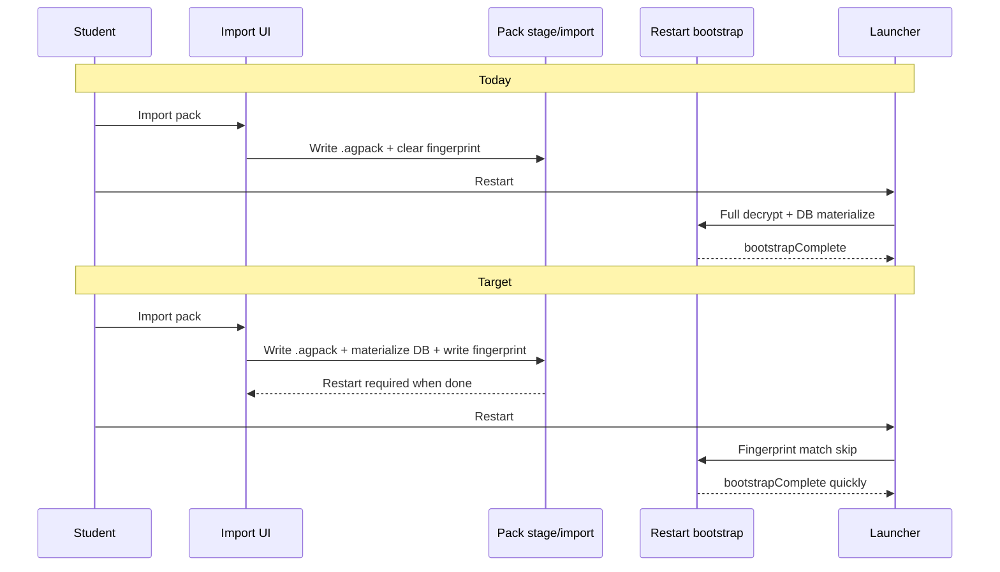

# Practice Size and Cold Start - Plan

## Goal Capsule

- **Objective:** Minimize the offline portable Windows practice folder size (self-contained host + bundled Java runtime), and make double-click reach a **usable labs/dashboard** in under **5 seconds** preferred / under **10 seconds** acceptable — on every launch, including after a new pack import.
- **Product authority:** This Product Contract. Surrounding practice work (pack names, download streaming, import semantics, empty-rubric UX) is not active scope here.
- **Open blockers:** None.
- **Stop conditions:** Do not require a preinstalled system Java or .NET runtime. Do not treat a splash/loading-only window as success. Do not remove practice submit/grade, pack import, or local results. Do not change cloud/web grading or pack crypto/signing meaning. Do not require network for practice after unzip.
- **Execution:** Code.
- **Product Contract preservation:** changed: R1, AE1 — hard &lt;100MB relaxed to minimize-with-self-contained-offline-host (session-settled user-directed during planning).

---

## Product Contract

### Summary

Students get a much smaller offline practice folder and a much faster path from double-click to usable labs. Size is minimized by a slim portable JDK (jlink), a desktop-trimmed backend JAR, and launcher trim that still ships self-contained (no .NET install). Speed is won by finishing heavy pack materialization during import (before restart) so restart mostly verifies and opens ready state, plus Spring/JVM cold-start tuning.

### Problem Frame

Today the extracted practice app is about **300MB**, and double-clicking `OOP-AutoGrader-Practice.exe` takes about **19 seconds** before a usable window appears. Measured contributors include a self-contained .NET launcher publish (~162MB), a full cloud Spring Boot fat JAR (~122MB), and an optional full JDK when bundled. The launcher waits until local bootstrap finishes before showing the WebView. Import only stages `.agpack` files and clears the fingerprint, so the next restart pays full pack materialization.

### Key Decisions

- **Usable labs/dashboard within the time budget** (session-settled: user-directed — chosen over splash/loading-only: student can use the app when the window appears). **Governs R3, R4, R5.**
- **Fully portable Java runtime required** (session-settled: user-directed — chosen over system-Java-required: clean Windows machine with no Java install). **Governs R1, R2.**
- **Practice parity** (session-settled: user-directed — chosen over minimal core or no feature cuts: keep submit/grade, pack import, local results; cloud-only weight may leave the desktop bundle). **Governs R6, R7.**
- **Every launch meets the budget, including after pack import** (session-settled: user-directed — chosen over steady-state-only). **Governs R4, R5, R8.**
- **Eager pack materialize + cheap restart, plus size cuts** (session-settled: user-approved — chosen over trim-in-place alone or replacing the local server stack: import may take longer in-place; double-click readiness is the hard budget). **Governs R1, R2, R5, R8.**
- **Self-contained offline host; minimize size (no hard &lt;100MB)** (session-settled: user-directed — chosen over framework-dependent .NET or keeping a hard 100MB cap: must run offline with no .NET install; reduce as much as possible). **Governs R1, R2, R10.**

### Requirements

**Size**

- R1. Minimize extracted practice-folder size while keeping a self-contained offline host and a portable Java runtime in the folder; report a measured on-disk breakdown after assemble (launcher, runtime, backend.jar, worker.jar, UI).
- R2. The practice folder runs on a clean Windows machine with no preinstalled Java and no preinstalled .NET runtime (self-contained launcher + bundled JDK).
- R10. Practice works fully offline after unzip (local backend, H2, worker grading, local UI); WebView2 Evergreen may remain an OS-provided dependency outside the folder (same as today).

**Cold start**

- R3. Success means the student can use the labs/dashboard (not merely see a splash or indefinite loading shell).
- R4. From double-click of `OOP-AutoGrader-Practice.exe` to usable labs/dashboard is under **5 seconds** preferred and under **10 seconds** acceptable on a typical student laptop.
- R5. R4 applies on every launch, including the first restart after a new pack import has completed.

**Practice capabilities**

- R6. Practice keeps submit/grade against imported packs, pack import, and machine-local results.
- R7. Cloud-only capabilities may be absent from the practice bundle when they are not needed for R6 (for example OAuth, PostgreSQL, lecturer admin, Swagger, mail).

**Import / restart contract**

- R8. Heavy pack materialization finishes during the import action (or equivalent pre-restart step) so restart can open a ready labs/dashboard inside the R4 budget; the UI makes clear when import is finished and restart is required.
- R9. Pack meaning is unchanged: signed contents, which labs load, and restart/import semantics beyond the timing of materialization stay consistent with current practice-pack rules.

### Actors

- A1. Student (desktop practice) — downloads/unzips the practice folder, imports packs, double-clicks the EXE, submits and views local results.
- A2. Lecturer / distributor — distributes `.agpack` files separately from the runtime folder (unchanged distribution split).

### Key Flows

- F1. Cold open after unzip
  - **Trigger:** Student unzips the practice folder and double-clicks `OOP-AutoGrader-Practice.exe`.
  - **Actors:** A1
  - **Steps:** App starts with portable runtime; within R4 the labs/dashboard is usable (empty/not-ready banner allowed only when no valid packs are present).
  - **Covered by:** R1, R2, R3, R4, R6, R10
- F2. Import then restart
  - **Trigger:** Student imports a valid quarter or lab pack via UI (or places a correctly named pack and clears the import fingerprint as today).
  - **Actors:** A1
  - **Steps:** Import finishes materializing local practice state and signals restart; after restart, usable labs/dashboard appears within R4.
  - **Covered by:** R5, R6, R8, R9
- F3. Practice grading unchanged in capability
  - **Trigger:** Student submits Java (+ MMD when required) against a loaded lab.
  - **Actors:** A1
  - **Steps:** Local grading and results work as today’s practice app (including worker-backed operational testcases when configured).
  - **Covered by:** R6, R7, R10

### Acceptance Examples

- AE1. Extracted size minimized offline
  - **Covers:** R1, R2, R10
  - **Given:** A practice folder assembled with self-contained launcher and portable JDK.
  - **When:** The folder is extracted on a clean Windows machine with no Java/.NET installs.
  - **Then:** The EXE runs offline; assemble reports a smaller on-disk total than the ~300MB baseline and a per-component breakdown.
- AE2. Steady-state usable open
  - **Covers:** R3, R4
  - **Given:** Valid packs already materialized and fingerprint unchanged.
  - **When:** Student double-clicks the EXE.
  - **Then:** Usable labs/dashboard appears in under 10s (target under 5s).
- AE3. Post-import restart budget
  - **Covers:** R5, R8
  - **Given:** Student completed a pack import that reported finished and asked for restart.
  - **When:** Student restarts the EXE.
  - **Then:** Usable labs for that import appear within the same R4 budget.
- AE4. Practice parity after slimming
  - **Covers:** R6, R7
  - **Given:** A trimmed practice bundle on a clean machine.
  - **When:** Student imports a pack, restarts, and submits a solution.
  - **Then:** Grade and local results are available; cloud-only admin/auth surfaces are not required.

### Scope Boundaries

**In scope**

- Minimize portable practice folder size (self-contained host + bundled JDK)
- Double-click to usable labs/dashboard timing
- Eager pack materialization / cheap restart contract
- Trimming cloud-only weight from the practice bundle while keeping R6
- Offline operation after unzip

**Deferred for later**

- Replacing the local practice server stack with a non-Spring rewrite
- Changing lecturer pack export UX beyond what restart timing requires
- macOS / non-Windows practice distribution
- Hard &lt;100MB extracted cap (relaxed during planning)

**Non-goals**

- Requiring system-installed Java or .NET
- Splash-only success criteria
- Changing cloud/web grading behavior
- Changing pack crypto/signing payload meaning
- Embedding `.agpack` files inside the student runtime zip (packs remain separately distributed)
- Shipping Fixed Version WebView2 Runtime inside the folder

### Assumptions

- “Typical student laptop” for R4 means a recent Windows x64 machine comparable to the ~19s baseline measurement environment.
- WebView2 Runtime may still be provided by Windows/Evergreen outside the folder budget.
- Baseline to beat: ~300MB extracted / ~19s to usable UI (user-measured; not a single historical in-repo acceptance target).
- Soft size ambition after cuts: get as close as practical to ~150–200MB extracted with self-contained launcher + jlink JDK; exact number is an execution measurement, not a product hard fail if offline/self-contained constraints bind first.

### Outstanding Questions

**Deferred to Planning** — resolved into KTDs / units below.

**Deferred to implementation**

- Exact jdeps-derived jlink module list after the desktop JAR exists (smoke-test compile + grade on the custom image).
- Whether AppCDS archive is worth the extra disk vs R4 gains on the reference laptop.
- How aggressive `PublishTrimmed` can be on the WebView2 host without breaking the host window.

<!-- ce-section: work-relationships -->
### How This Work Fits Together

This plan owns **practice folder size and cold-start to usable UI**. Broader practice work around it (current understanding, not a roadmap):

- Depends on existing desktop local mode and practice-pack rules already shipped / planned elsewhere.
- Can proceed independently of `docs/plans/2026-10-02-001-perf-practice-folder-download-plan.md` (prebuilt zip streaming), though the assembled zip contents this plan shrinks are what that download serves.
- Shares pack naming / import semantics with `docs/plans/2026-10-02-002-feat-practice-pack-names-and-speed-plan.md` and `docs/plans/2026-10-02-003-fix-practice-pack-import-semantics-plan.md` — this plan changes **when** materialization finishes relative to restart, not pack filename or crypto meaning.
- Can proceed independently of `docs/plans/2026-10-02-004-feat-practice-empty-rubric-status-logout-plan.md` (empty rubric wipe / logout quit), except both touch restart readiness messaging.

---

## Planning Contract

### Key Technical Decisions

- KTD1. **Desktop-trimmed Spring Boot artifact** — assemble ships a practice-specific fat JAR (Maven profile/classifier) that excludes cloud-only runtime deps (PostgreSQL driver, springdoc, mail, and other starters not needed under `desktop`), not the 122MB cloud JAR. **Instantiates R1, R7.**
- KTD2. **jlink custom JDK in `runtime/jdk`** — assemble builds/bundles a Windows x64 image with modules from `jdeps` plus mandatory `jdk.compiler` + `jdk.zipfs` (submit/grade needs `JavaCompiler`). Prefer jlink over full Temurin JDK. **Instantiates R1, R2, R6.**
- KTD3. **Keep self-contained .NET launcher; trim where safe** — continue `dotnet publish -r win-x64 --self-contained true`; apply `PublishTrimmed` / ReadyToRun only if WebView2 host smoke passes; do not switch to framework-dependent. **Instantiates R1, R2, R10** (session-settled product decision on self-contained host).
- KTD4. **Eager materialize on UI import; fingerprint after success** — `DesktopPackStageService` (or shared helper) runs the same import path as bootstrap after staging the file, then writes the fingerprint so restart hits the skip path. Manual `rubric/` copy without fingerprint still materializes on next bootstrap (R9). **Instantiates R5, R8, R9.**
- KTD5. **Launcher sets `DESKTOP_WORKER_JAVA` to bundled `runtime/jdk/bin/java.exe`** — backend and OT worker use the same portable JDK on a clean machine. **Instantiates R2, R6, R10.**
- KTD6. **Cold-start stack: fingerprint-cheap restart + desktop Spring tuning** — keep launcher wait on `bootstrapComplete`; tune `application-desktop.yml` (lazy init / autoconfigure excludes / avoid duplicate UI bootstrap wait where redundant); optional unpacked JAR or AppCDS only if measured helpful. Do not open WebView before usable readiness. **Instantiates R3, R4, R5.**

### High-Level Technical Design

Directional only — not implementation code.

**Size stack (components → folder)**

**Import vs restart (today → target)**

### Assumptions and constraints

- Cloud `mvn package` artifact and Docker image stay on the full JAR; desktop assemble uses the desktop profile/classifier output.
- GraalVM native image is out of scope (reflection grading risk).
- Fixed WebView2 Runtime must not be copied into the folder.
- Execution direction: smoke-first for size/timing; characterization-style integration tests around import/bootstrap before changing fingerprint semantics.

### Sequencing

1. U1 desktop JAR trim (enables realistic jdeps)
2. U2 jlink + launcher worker Java + assemble bundling
3. U3 eager materialize (unlocks post-import R4)
4. U4 cold-start tuning
5. U5 import progress UX
6. U6 measurement, docs, verification gates

### Sources and research

- Local sizes (this session): `backend.jar` ~122MB, launcher publish ~162MB, `worker.jar` ~2MB, zip ~178MB compressed.
- Repo patterns: `scripts/assemble-student-desktop.ps1`, `desktop/launcher/…/BackendLauncher.cs`, `DesktopPackStageService`, `DesktopPackBootstrapService`.
- External guidance (load-bearing): jlink + `jdk.compiler`/`jdk.zipfs`; Spring Boot desktop dependency exclusion as primary JAR shrink; self-contained .NET trim limits; lazy init / autoconfig exclude / unpacked JAR for Boot 3.2 cold start.
- Learnings: no prior desktop size solutions; keep `worker.jar`/OT; see `docs/solutions/architecture-patterns/operational-testcase-grading.md`.

---

## Implementation Units

### U1. Desktop-trimmed backend JAR

- **Goal:** Ship a practice fat JAR without cloud-only dependency weight.
- **Requirements:** R1, R7
- **Dependencies:** None
- **Files:** `backend/pom.xml`, assemble copy path in `scripts/assemble-student-desktop.ps1`, any profile-gated dependency wiring discovered during trim
- **Approach:** Add a Maven profile/classifier that builds the desktop practice artifact excluding postgresql, springdoc, mail, and other deps unused under `desktop`. Keep worker shade unchanged. Assemble copies the desktop artifact to `backend.jar`. Cloud build path remains the full JAR.
- **Test scenarios:**
  - Happy: desktop profile context still loads (`DesktopProfileContextTest` or equivalent).
  - Happy: desktop submission pipeline still grades (`DesktopSubmissionPipelineIntegrationTest`).
  - Edge: cloud `package` without the desktop profile still produces the full API JAR for Docker.
  - Error: missing desktop artifact fails assemble with a clear message.
- **Verification:** `mvn test` for desktop profile tests; compare desktop JAR size vs ~122MB baseline.
- **Execution note:** Smoke-first size check after package.

### U2. jlink runtime + portable worker Java

- **Goal:** Bundle a slim JDK and point both API and worker at it.
- **Requirements:** R1, R2, R6, R10
- **Dependencies:** U1
- **Files:** `scripts/assemble-student-desktop.ps1`, `desktop/launcher/OOPAutoGraderPractice/BackendLauncher.cs`, `docs/DESKTOP_STUDENT_DIST.md`, `backend/src/main/resources/student-desktop/README.txt`
- **Approach:** After desktop JAR exists, run `jdeps` → `jlink` into `runtime/jdk` (include `jdk.compiler`, `jdk.zipfs`). Assemble always copies that image into the output folder/zip. Launcher sets `DESKTOP_WORKER_JAVA` (and uses the same `java.exe` for `-jar backend.jar`). Smoke: compile a trivial source and start worker with the image.
- **Test scenarios:**
  - Happy: launcher resolves bundled java when present.
  - Happy: worker env points at bundled java (manual or unit around env wiring if extracted).
  - Edge: missing `runtime/jdk` falls back to PATH `java` with documented warning (dev only).
  - Error: jlink/jdeps failure fails assemble.
- **Verification:** Assemble produces `runtime/jdk/bin/java.exe`; folder runs without system Java.

### U3. Eager pack materialization on import

- **Goal:** Finish DB materialization during import so restart is fingerprint-cheap.
- **Requirements:** R5, R8, R9
- **Dependencies:** None (can parallel U1 after tests exist)
- **Files:** `backend/src/main/java/com/eiu/capstone/backend/desktop/DesktopPackStageService.java`, `DesktopPackBootstrapService.java`, `DesktopPackImportService.java`, `DesktopPackController.java`, `backend/src/test/java/integration/.../DesktopPackImportIntegrationTest.java`, `DesktopPackBootstrapIntegrationTest.java`
- **Approach:** After successful stage write + conflict handling, run the same import operations bootstrap uses, then write fingerprint for the resulting pack set. Keep restart required for UI consistency. Bootstrap remains the authority for manual `rubric/` copies and empty-wipe. Preserve term/lab delete and naming rules from import-semantics plans.
- **Test scenarios:**
  - Happy: UI import materializes labs in H2 before restart; fingerprint written; restart bootstrap skips re-import.
  - Happy: term pack import still deletes sibling term/lab packs per existing rules.
  - Edge: lab name conflict without `confirmReplace` still 409 and does not materialize.
  - Edge: manual pack copy with cleared fingerprint still materializes on bootstrap.
  - Error: materialization failure does not leave a “success, just restart” message; fingerprint not advanced.
- **Verification:** Extend desktop pack integration tests; `mvn test` from `backend/`.

### U4. Cold-start tuning (Spring + launcher wait)

- **Goal:** Steady-state and post-import restart open usable UI inside R4.
- **Requirements:** R3, R4, R5
- **Dependencies:** U2, U3
- **Files:** `backend/src/main/resources/application-desktop.yml`, `desktop/launcher/OOPAutoGraderPractice/BackendLauncher.cs`, `desktop/launcher/OOPAutoGraderPractice/Program.cs`, `frontend/src/utils/desktopBootstrap.js` (remove redundant wait if launcher already gated)
- **Approach:** Keep waiting on `bootstrapComplete` before WebView. Apply desktop-only lazy initialization and autoconfigure excludes that do not break R6. Avoid paying import work on fingerprint match (U3). Measure before/after on the same machine. Optional unpacked JAR / AppCDS only if measurement justifies disk.
- **Test scenarios:**
  - Happy: fingerprint-match bootstrap still sets `bootstrapComplete` and `ready` when packs present.
  - Edge: empty rubric still completes bootstrap with not-ready banner (no hang).
  - Integration: launcher health wait still requires `bootstrapComplete` true.
- **Verification:** Manual timing script (see Verification Contract); desktop integration tests still green.
- **Execution note:** Smoke-first timing on reference laptop; do not claim R4 until measured.

### U5. Import progress / completion UX

- **Goal:** Students see that import materialization is running and when restart is safe.
- **Requirements:** R8
- **Dependencies:** U3
- **Files:** `frontend/src/components/student/DesktopRubricPackImport.jsx`, desktop status/banner copy if needed, API message fields on import response
- **Approach:** While import request runs (now longer), show busy/progress; on success keep clear “restart required” copy; on failure show specific reason (no generic busy). No continuous status polling regression vs plan 004.
- **Test scenarios:**
  - Happy: success toast/message instructs restart after materialize completes.
  - Error: failed materialize shows failure, not restart-success.
  - Edge: conflict 409 still prompts replace confirm without claiming restart success.
- **Verification:** `npm run build:desktop`; manual import of term + lab pack.

### U6. Assemble measurement, docs, and release checks

- **Goal:** Packaging always produces the slim offline folder and records size; docs match.
- **Requirements:** R1, R2, R10
- **Dependencies:** U1, U2, U3, U4, U5
- **Files:** `scripts/assemble-student-desktop.ps1`, `docs/DESKTOP_STUDENT_DIST.md`, `CONCEPTS.md` (eager pack materialization already present), `backend/AGENTS.md` / `frontend/AGENTS.md` as needed, `desktop/launcher/README.md` (reconcile self-contained docs)
- **Approach:** Assemble builds desktop JAR, jlink runtime, trimmed self-contained launcher, UI, zip; prints MB breakdown; documents offline prerequisites (WebView2 Evergreen only). Capture a short learning under `docs/solutions/` after ship (follow-up ok).
- **Test scenarios:**
  - Happy: assemble output contains EXE, `runtime/jdk`, trimmed `backend.jar`, `worker.jar`, `ui/dist-desktop`, no `.agpack`.
  - Happy: size report lists each major component.
  - Edge: missing `dotnet` still warns; size goal verification skipped or fails clearly.
- **Verification:** Run assemble; confirm breakdown and offline smoke (AE1–AE4).

---

## Verification Contract

- **Unit/integration:** From `backend/`: `mvn test` — must include desktop pack import/bootstrap/profile/submission tests touched by U1/U3/U4.
- **Frontend build:** `cd frontend && npm run build:desktop`
- **Assemble smoke:** `.\scripts\assemble-student-desktop.ps1 -OutputDir <temp>` — confirm layout, `runtime/jdk`, size breakdown printed.
- **Offline smoke (manual):** On a machine/VM without Java/.NET on PATH (or PATH stripped), run EXE; import pack; restart; submit a lab with OT if available.
- **Timing smoke (manual):** Measure double-click → usable labs for (a) fingerprint-match restart and (b) first restart after successful import; target &lt;10s, prefer &lt;5s.
- **Size smoke:** Compare extracted folder total and component MB to ~300MB baseline; record numbers in assemble output / PR notes.
- **Do not** treat cloud `mvn test` Docker image size as the practice-folder metric.

---

## Definition of Done

- [ ] Desktop-trimmed `backend.jar` used by assemble; cloud full JAR path unchanged
- [ ] `runtime/jdk` jlink image bundled; launcher uses it for API + `DESKTOP_WORKER_JAVA`
- [ ] Self-contained launcher retained; trimmed only if WebView2 host still works
- [ ] UI import materializes packs and writes fingerprint; restart meets R4 budget when import succeeded
- [ ] Steady-state open meets R4 budget
- [ ] Offline practice works without system Java/.NET
- [ ] Import UX shows progress/failure correctly; restart messaging clear
- [ ] Assemble prints size breakdown; `DESKTOP_STUDENT_DIST.md` updated
- [ ] Desktop integration tests cover eager import + fingerprint skip
- [ ] Manual AE1–AE4 smoke recorded with size and timing numbers
