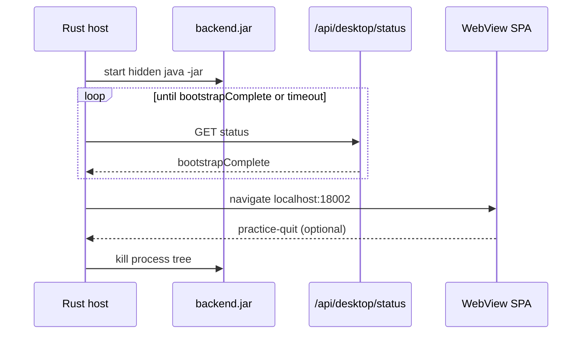

# Practice Lightweight WebView Host - Plan

## Goal Capsule

- **Objective:** Replace the self-contained .NET practice host with a thin Rust + WebView2 shell so the extracted practice folder drops roughly the ~160MB .NET runtime cost, while preferring under **10 seconds** from double-click to a usable labs/dashboard.
- **Product authority:** This Product Contract. Prior practice size/cold-start work (desktop-trimmed JAR, jlink JDK, eager pack materialize) remains in force except where this plan explicitly supersedes the self-contained .NET host decision.
- **Open blockers:** None.
- **Stop conditions:** Do not require a preinstalled .NET runtime. Do not remove portable Java from the folder. Do not regress practice submit/grade, pack import, or local results. Do not change cloud/web grading. Do not ship Electron or a full Tauri app shell.
- **Execution:** Code.

---

## Product Contract

### Summary

Students get the same offline practice window without a self-contained .NET runtime in the zip. A small Rust + wry/WebView2 host starts the bundled Java backend, waits until practice bootstrap is complete, shows the existing SPA, and shuts the backend down on quit. Size improvement is best-effort and measured; startup prefers under 10 seconds to usable UI.

### Problem Frame

The extracted practice folder is still dominated by a self-contained .NET/WebView2 host (~160MB of runtime DLLs) even after desktop JAR and jlink cuts. Student-perceived open time remains around ~15 seconds to usable UI. The host’s job is small (start Java, wait for ready, show localhost, quit), so shipping a full .NET desktop runtime is disproportionate to the value.

### Key Decisions

- **Thin Rust + wry/WebView2 host** (session-settled: user-directed — chosen over Tauri and native C++/Win32: smallest fit for a supervisor shell with maintainable WebView2 integration). **Governs R1, R2, R3, R10.**
- **Fully replace the .NET host in the student distribution** (session-settled: user-directed — chosen over keeping .NET in-repo-only or shipping both: one student entrypoint, no dual-host zip). **Governs R2, R9, R11.**
- **No hard extracted-size cap** (session-settled: user-directed — chosen over &lt;150MB or &lt;100MB targets: measure and record the new folder size after the host swap). **Governs R1.**
- **Prefer under 10s to usable UI** (session-settled: user-directed — chosen over no startup target or a hard “must beat ~15s by a clear margin” gate: host savings first; further Spring/JVM work only if still needed). **Governs R4, R5.**
- **Keep portable Java in the folder** (session-settled: user-directed from prior practice work — chosen over system-Java-required). **Governs R6, R7.**
- **Practice host behavior parity** (session-settled: user-approved — same start/wait/show/quit contract as today’s EXE, including practice-quit). **Governs R3, R8, R10.**

### Requirements

**Host and packaging**

- R1. Assemble produces a practice folder whose host is a thin Rust + WebView2 EXE (not a self-contained .NET publish); report measured on-disk breakdown after assemble (host, runtime/jdk, backend.jar, worker.jar, UI, total).
- R2. The student zip/folder must not include a self-contained .NET runtime or require students to install .NET.
- R3. Double-clicking `OOP-AutoGrader-Practice.exe` starts the local practice backend with the bundled Java, waits until bootstrap is complete, then shows the practice UI at the local practice URL.
- R9. The existing `.bat` launcher remains available as a non-WebView fallback; it is not the primary student path.
- R11. The former .NET launcher project is removed from the student distribution path (deleted or clearly retired so assemble no longer publishes it).

**Size and offline**

- R6. Portable Java (`runtime/jdk`) remains in the practice folder so a clean machine without system Java can still practice.
- R7. Practice remains fully offline after unzip aside from the existing OS-provided WebView2 Evergreen dependency.
- R12. Size success is best-effort: no hard MB cap; the assemble report records the new total and component sizes for comparison to the ~280MB self-contained-.NET baseline.

**Startup and UX**

- R4. Prefer under **10 seconds** from double-click to a usable labs/dashboard (not splash-only) on a typical student laptop.
- R5. R4 applies on steady-state launches and on restart after a successful pack import/materialize.
- R8. Closing the practice window or a practice-quit signal from the UI stops the local backend process.
- R10. Missing WebView2 or failure to start the backend surfaces a clear error; the host must not hang silently past a bounded wait.

**Practice capabilities**

- R13. Practice keeps submit/grade against imported packs, pack import, and machine-local results; this plan does not cut those capabilities.

### Actors

- A1. Student (desktop practice) — unzips folder, double-clicks EXE, imports packs, practices offline.
- A2. Maintainer / distributor — builds the practice zip with Rust toolchain available at assemble time; distributes packs separately.

### Key Flows

- F1. Cold open
  - **Trigger:** Student double-clicks `OOP-AutoGrader-Practice.exe` after unzip.
  - **Actors:** A1
  - **Steps:** Host starts bundled Java backend → waits for bootstrap complete → shows usable practice UI (or not-ready banner if no packs) within the R4 preference.
  - **Covered by:** R3, R4, R6, R7, R10, R13
- F2. Quit
  - **Trigger:** Student closes the window or uses in-app logout/quit that signals the host.
  - **Actors:** A1
  - **Steps:** Host closes the UI and stops the backend process.
  - **Covered by:** R8
- F3. Assemble release folder
  - **Trigger:** Maintainer runs the practice assemble script.
  - **Actors:** A2
  - **Steps:** Build Rust host + existing desktop backend/UI/jlink artifacts into the folder/zip; print size breakdown; no .NET self-contained publish.
  - **Covered by:** R1, R2, R9, R11, R12

### Acceptance Examples

- AE1. Extracted practice folder no longer contains a large self-contained .NET DLL set; host footprint is a small EXE (plus minimal native deps if any), and assemble prints the new total MB.
- AE2. On a machine with WebView2 Evergreen and no .NET SDK/runtime install required by the app, double-click opens usable practice UI, preferably under 10s.
- AE3. Closing the app leaves no orphaned practice backend process listening on the practice port.
- AE4. `.bat` still starts the backend for troubleshooting without the WebView host.

### Scope Boundaries

- Does not remove or replace portable Java / jlink packaging.
- Does not adopt Tauri as the app framework, Electron, or a browser-only primary UX.
- Does not keep shipping the self-contained .NET host “just in case.”
- Does not require broad Spring architecture rewrites unless measurement shows the host swap alone cannot approach the R4 preference.
- Does not change pack format, signing, or cloud lecturer export.

<!-- ce-section: work-relationships -->
### How This Work Fits Together

- **This plan owns:** student-facing practice **host** technology and distribution of that host.
- **Depends on / continues:** `docs/plans/2026-10-02-005-perf-practice-size-and-cold-start-plan.md` for desktop-trimmed JAR, jlink JDK, and eager pack materialize — those remain; this plan **supersedes** that plan’s self-contained .NET host / “no .NET install via self-contained publish” packaging choice.
- **Can proceed independently of:** further unrelated cloud/deploy work.

---

## Planning Contract

### Key Technical Decisions

- **KTD1. Crate at `desktop/launcher/practice-host/` with tao + wry** (session-settled: user-approved HOW — chosen over Tauri app shell and C++ Win32: thin window + WebView2 on Windows, stays under existing `desktop/launcher/` boundary). **Governs R1, R3, R8.**
- **KTD2. Port today’s supervisor contract 1:1** — resolve install dir next to EXE; prefer `runtime/jdk/bin/java.exe`; spawn hidden `java -jar backend.jar` with `APP_DESKTOP_HOME`, `SPRING_PROFILES_ACTIVE=desktop`, `JWT_SECRET`, `DESKTOP_WORKER_JAVA`; poll `GET http://127.0.0.1:18002/api/desktop/status` until `bootstrapComplete == true` (2-minute bound, ~250ms interval); then navigate WebView to `http://127.0.0.1:18002/`; on window close or quit message, kill the Java process tree. **Governs R3, R8, R10.**
- **KTD3. Delete the .NET launcher project** (`desktop/launcher/OOPAutoGraderPractice/` and publish leftovers) rather than archive-in-tree; README under `desktop/launcher/` documents Cargo build instead. **Governs R11.**
- **KTD4. Assemble hard-requires `cargo`** for a full student zip (same severity as missing desktop JAR); no silent “bat only” when the preferred EXE is expected for release. Dev-only bat remains copyable. **Governs R1, R2.**
- **KTD5. Quit bridge: prefer keeping `window.chrome.webview.postMessage`** used by `frontend/src/utils/desktopQuit.js`. If wry on Windows does not expose that host object, adapt `desktopQuit.js` to a dual-path (chrome.webview first, then wry IPC) — do not break web desktop builds. **Governs R8.**
- **KTD6. JVM/Spring tuning is a conditional follow-up unit** only if measured usable-UI time still exceeds ~10s after the host swap on the reference machine. **Governs R4, R5.**

### Technical design

Host binary name stays `OOP-AutoGrader-Practice.exe` so student docs and download UX are unchanged.

### Assumptions and constraints

- Build machines for assemble need a Rust stable toolchain + Windows WebView2 build deps (MSVC) as required by wry.
- Students need WebView2 Evergreen (unchanged); they do not need Rust, .NET, or system Java when `runtime/jdk` is present.
- Fixed-version WebView2 Runtime must not be copied into the folder.
- Execution direction: smoke-first for size and timing; prove quit + orphan-process behavior on a real assemble output before deleting the .NET project from the tree (or delete only after Rust host smoke passes on the same machine).

### Sequencing

1. U1 Rust host crate (behavior parity)
2. U2 Assemble wiring + remove .NET project
3. U3 Quit-bridge / frontend adaptation if needed (may be empty if chrome.webview works)
4. U4 Docs + size/timing smoke gates
5. U5 Conditional JVM/Spring cold-start only if R4 still missed

### Sources and research

- Current host: `desktop/launcher/OOPAutoGraderPractice/{Program,BackendLauncher,PracticeHostForm}.cs`
- Assemble publish: `scripts/assemble-student-desktop.ps1` (~dotnet publish self-contained)
- Quit: `frontend/src/utils/desktopQuit.js` → `chrome.webview.postMessage({ type: 'practice-quit' })`
- Baseline sizes (prior session): host ~162MB extracted, folder ~281MB, zip ~162MB compressed
- External: wry (WebView2 on Windows) + tao event loop; avoid Tauri unless IPC forces it

---

## Implementation Units

### U1. Rust practice host (tao + wry)

- **Goal:** Ship an EXE that matches today’s start/wait/show/quit supervisor behavior.
- **Requirements:** R3, R6, R8, R10, R13
- **Dependencies:** None
- **Files:** `desktop/launcher/practice-host/Cargo.toml`, `desktop/launcher/practice-host/src/main.rs` (and small modules as needed), `desktop/launcher/README.md`
- **Approach:** Create crate `practice-host` with package/bin name producing `OOP-AutoGrader-Practice.exe`. Implement Java spawn, health wait, WebView navigation, fatal dialog or `launcher-error.log` equivalent, and process-tree kill on exit. Keep window title/size roughly comparable (~1280×800). Hide Java console.
- **Test scenarios:**
  - Happy: with a prepared practice folder, EXE reaches usable UI after `bootstrapComplete`.
  - Happy: empty `rubric/` still opens UI with not-ready banner (no hang).
  - Error: missing `backend.jar` fails with a clear message / log.
  - Error: missing WebView2 fails with a clear message (no silent hang).
  - Error: backend never becomes ready within bound → timed error, Java killed.
- **Verification:** `cargo build --release` for `win-x64`; manual smoke against an assemble (or hand-copied) folder.
- **Execution note:** Smoke-first against real `backend.jar` + jlink; do not claim parity until quit and kill are proven.

### U2. Assemble uses Cargo; remove .NET launcher

- **Goal:** Student zip builds and ships only the Rust EXE; .NET publish path gone.
- **Requirements:** R1, R2, R9, R11, R12
- **Dependencies:** U1
- **Files:** `scripts/assemble-student-desktop.ps1`, delete `desktop/launcher/OOPAutoGraderPractice/`, `desktop/launcher/.gitignore`, `desktop/launcher/README.md`
- **Approach:** Replace `dotnet publish` block with `cargo build --release` in the practice-host crate; copy the release EXE into `$OutputDir`. Fail assemble if `cargo` missing or EXE missing. Stop copying a flood of .NET DLLs. Keep `.bat` + README.txt copy. Adjust size breakdown labels (host EXE vs “launcher + other”). Delete the C# project and stale `publish/` artifacts from the tree.
- **Test scenarios:**
  - Happy: assemble output has EXE, no `System.Private.CoreLib.dll` / PresentationFramework pile.
  - Happy: size report shows small host EXE MB and lower total vs ~281MB baseline.
  - Error: no `cargo` → clear assemble failure.
  - Edge: `.bat` still present beside EXE.
- **Verification:** Run assemble to a temp dir; inspect layout and size report.

### U3. Practice-quit bridge compatibility

- **Goal:** Logout / import Okay / window semantics still quit the host (R8).
- **Requirements:** R8
- **Dependencies:** U1
- **Files:** `frontend/src/utils/desktopQuit.js`, possibly host IPC listener in `desktop/launcher/practice-host/src/…`, `frontend/AGENTS.md` if contract changes
- **Approach:** First verify wry WebView2 exposes `window.chrome.webview.postMessage`. If yes, host listens for `{ type: "practice-quit" }` and closes — no frontend change. If no, add wry IPC listener and dual-path `desktopQuit.js` (chrome.webview then fallback). Rebuild desktop UI when frontend changes.
- **Test scenarios:**
  - Happy: Logout closes EXE and kills Java.
  - Happy: Import success Okay (quitPracticeApp) closes EXE.
  - Edge: Browser/web build: `quitPracticeApp` remains a no-op when no host bridge.
- **Verification:** Manual click paths on assembled EXE; `npm run build:desktop` if JS changed.
- **Execution note:** Skip file churn if chrome.webview already works — record that in the PR notes.

### U4. Docs + size/timing smoke

- **Goal:** Docs and verification evidence match the Rust host distribution.
- **Requirements:** R1, R4, R5, R7, R12, AE1–AE4
- **Dependencies:** U2, U3
- **Files:** `docs/DESKTOP_STUDENT_DIST.md`, `backend/src/main/resources/student-desktop/README.txt`, `CONCEPTS.md`, `backend/AGENTS.md` / root docs as needed
- **Approach:** Replace “self-contained .NET” wording with Rust host + WebView2 Evergreen + no .NET runtime. Document `cargo` as assemble prerequisite. Record extracted size breakdown and cold-start timing (steady-state + post-import restart) in smoke notes / PR.
- **Test scenarios:**
  - Happy: docs describe EXE without .NET DLL folder.
  - Happy: timing measured; prefer &lt;10s usable UI.
  - Edge: document WebView2 Evergreen still required.
- **Verification:** Assemble smoke + manual timing; desktop pack tests only if backend touched (usually unchanged).

### U5. Conditional JVM/Spring cold-start (only if needed)

- **Goal:** Approach R4 if host swap alone leaves usable UI above ~10s.
- **Requirements:** R4, R5
- **Dependencies:** U4 measurement
- **Files:** `backend/src/main/resources/application-desktop.yml` and related desktop-only Boot flags already used in plan 005; avoid broad refactors
- **Approach:** Run only when U4 timing fails the preference. Prefer low-risk desktop-profile knobs already explored (lazy-init, autoconfigure excludes). Do not reopen Graal/native-image.
- **Test scenarios:**
  - Happy: re-measure steady-state open under preference after change.
  - Edge: empty-rubric open still completes bootstrap.
- **Verification:** Same timing smoke as U4; desktop integration tests if yml/behavior changes.
- **Execution note:** Skip entirely when U4 already meets preference.

---

## Verification Contract

- **Rust build:** `cargo build --release` in `desktop/launcher/practice-host/`
- **Assemble smoke:** `.\scripts\assemble-student-desktop.ps1 -OutputDir <temp>` — EXE present; no self-contained .NET DLL set; size breakdown printed; `runtime/jdk` still present when jlink available.
- **Offline smoke (manual):** Machine without .NET / system Java (or PATH stripped): run EXE; confirm UI; import pack; restart; submit if pack available.
- **Quit smoke:** Logout and window X leave port 18002 free (no orphan Java).
- **Timing smoke:** Double-click → usable UI; prefer &lt;10s for steady-state and post-import restart.
- **Frontend:** `npm run build:desktop` if `desktopQuit.js` changes.
- **Backend tests:** unchanged path — run desktop pack tests only if backend files change (U5).

---

## Definition of Done

- [ ] `OOP-AutoGrader-Practice.exe` is the Rust host; assemble no longer runs `dotnet publish`
- [ ] .NET launcher project removed from repo distribution path
- [ ] Student folder has no self-contained .NET runtime DLL pile
- [ ] `.bat` fallback still works
- [ ] Portable `runtime/jdk` still bundled; practice works without system Java
- [ ] Quit (X / practice-quit) kills the backend
- [ ] Assemble prints new size breakdown vs ~281MB baseline
- [ ] Cold-start preference (&lt;10s usable) measured; U5 only if missed
- [ ] `DESKTOP_STUDENT_DIST.md` / student README updated (no .NET self-contained claims)
