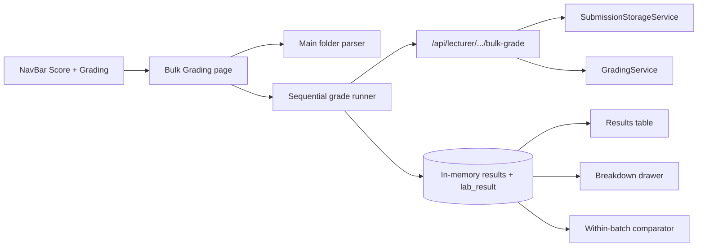

# Lecturer Bulk Folder Grading - Plan

## Goal Capsule

- **Objective:** Give lecturers an ephemeral Bulk Grading workspace: rename today’s Grading nav to Score, add a new Grading tab where they pick a lab, choose Lab or Exam mode, drop a multi-student Main folder, confirm the parse, grade with live progress, and inspect Score-like results (including within-batch plagiarism and the Score-style submission drawer) without writing the lab roster.
- **Product authority:** This Product Contract.
- **Open blockers:** None.
- **Stop conditions:** Do not persist bulk grades into Score/roster/history. Do not roster-match student identity. Do not compare plagiarism against existing online submissions. Do not open student upload to lecturers.
- **Execution:** Code.
- **Tail ownership:** Implementer owns unit verification; lecturer smoke of parse → grade → drawer closes the feature.

---

## Product Contract

**Product Contract preservation:** unchanged (R1–R14, F1–F5, AE1–AE8, Key Decisions, Scope Boundaries preserved). Deferred-to-planning items resolved as KTDs below.

### Summary

A new lecturer **Grading** tab for ephemeral bulk grading of folder dumps (Lab or Exam layout), with parse-then-confirm before the grade run, live progress, and a full results table. The existing cross-lab grade matrix nav is renamed **Score**.

### Problem Frame

Lecturers receive exam/lab dumps as a Main folder of `IRN_Name` student trees, but the product only grades single-student online uploads. There is no supported path to grade a multi-student folder dump today, so offline batches cannot be inspected in the app.

### Key Decisions

- **Ephemeral only** (session-settled: user-directed — chosen over persist-as-submissions and over preview-with-optional-Save: grades stay on this page; no path to write Score/roster). **Governs R6, R14.**
- **Explicit Lab / Exam mode** (session-settled: user-directed — chosen over auto-detect and over trust-folder-over-lab: lecturer sets mode; mode must match lab challenge count or grading is blocked). **Governs R3, R4, R5.**
- **Parse folder name only for identity** (session-settled: user-directed — chosen over roster match / parse-then-enrich: Student and ID come from `IRN_Name`). **Governs R8, R11.**
- **Within-batch plagiarism only** (session-settled: user-directed — chosen over against-online-submissions and over placeholder column: Plagiarism reflects comparison inside this drop). **Governs R12.**
- **Full results table in v1** (session-settled: user-directed — chosen over scores-only MVP: Student, ID, Score, Plagiarism, View Submission). **Governs R11, R12, R13.**
- **Score-style View Submission drawer** (session-settled: user-directed — chosen over simpler summary: same breakdown depth as Score for the batch result). **Governs R13.**
- **Parse-then-confirm flow** (session-settled: user-approved — chosen over grade-on-drop and stepped wizard: drop → parse list → Start Grading → live results). **Governs R7, R9, R10.**

### Requirements

**Navigation**

- R1. Lecturer nav label **Grading** becomes **Score** and continues to open the existing cross-lab grade overview matrix.
- R2. A new lecturer nav item **Grading** opens the Bulk Grading page (lecturer-only).

**Lab selection and mode**

- R3. On Bulk Grading, the lecturer selects a lab they can grade, then chooses **Lab** or **Exam** mode before grading can start.
- R4. **Exam** mode is allowed only when the selected lab has exactly one challenge; **Lab** mode requires at least one challenge folder expectation matching that lab’s challenge count (1..N). Mode/lab mismatch hard-blocks Start Grading with a clear message.
- R5. Folder shape by mode:
  - **Lab:** `Main` (any name) → `IRN_Name` → `challenge_n` (1..N) → `.mmd` / `.java`
  - **Exam:** `Main` (any name) → `IRN_Name` → `.mmd` / `.java` (one challenge; exam is a lab with one challenge)

**Ephemeral grading session**

- R6. Bulk grades are session-scoped for inspection only: they must not create or update lab submissions, progress, Score matrix cells, or reports.
- R7. After Lab + mode are set, the lecturer drops a Main folder; the system parses student folders and shows a confirm list before any grading runs.
- R8. Each student row’s Student name and ID are parsed from the `IRN_Name` folder name only (no term-roster lookup).
- R9. The confirm step lists accepted students and surfaces malformed/skipped folders (wrong shape, missing files, unparseable name) so the lecturer can replace the folder or proceed with the valid subset.
- R10. **Start Grading** grades accepted students against the selected lab’s rubric; while running, show live progress as how many students have been graded out of the accepted total (e.g. `Graded 7 / 42`).

**Results**

- R11. Results table columns: Student, ID, Score, Plagiarism, Action — no Attempt, no Submitted At.
- R12. Plagiarism values reflect within-batch comparison among students in this drop only.
- R13. Action **View Submission** opens the same style of breakdown drawer as Score (declaration / MMD / testcase detail) for that student’s ephemeral result.
- R14. Leaving or refreshing the Bulk Grading page may discard the ephemeral session; the product does not promise durable storage of bulk results.

### Actors

- A1. Lecturer — selects lab/mode, drops folder, confirms parse, starts grading, inspects results and plagiarism, opens submission breakdown.

### Key Flows

- F1. Rename and route
  - **Trigger:** Lecturer opens the app nav.
  - **Actors:** A1
  - **Steps:** Sees Score (former Grading matrix) and new Grading (bulk); opens Grading.
  - **Outcome:** Bulk Grading workspace loads.
  - **Covered by:** R1, R2

- F2. Parse-then-confirm exam dump
  - **Trigger:** Lecturer selects a 1-challenge lab, Exam mode, drops Main folder.
  - **Actors:** A1
  - **Steps:** System validates mode↔lab; parses `IRN_Name` children as flat `.mmd`/`.java`; shows accepted + skipped; lecturer clicks Start Grading.
  - **Outcome:** Grade run begins only after confirm.
  - **Covered by:** R3–R5, R7–R9

- F3. Lab-mode multi-challenge dump
  - **Trigger:** Lecturer selects multi-challenge lab, Lab mode, drops Main folder.
  - **Actors:** A1
  - **Steps:** Parse expects `challenge_n` under each student; mismatch folders skip with reason; Start Grading grades accepted students.
  - **Outcome:** Per-student scores against all lab challenges.
  - **Covered by:** R3–R5, R7–R10

- F4. Mode / lab hard block
  - **Trigger:** Exam mode on a multi-challenge lab (or Lab mode incompatible with lab shape).
  - **Actors:** A1
  - **Steps:** Lecturer attempts to start (or confirm readiness); system refuses with mismatch message.
  - **Outcome:** No grade run.
  - **Covered by:** R4

- F5. Live progress and inspect
  - **Trigger:** Start Grading on an accepted list.
  - **Actors:** A1
  - **Steps:** Progress updates as each student finishes; rows fill Student/ID/Score/Plagiarism; View Submission opens Score-style drawer; session remains ephemeral.
  - **Outcome:** Lecturer can track and inspect without roster writes.
  - **Covered by:** R6, R10–R14

### Acceptance Examples

- AE1. Nav rename
  - **Covers:** R1, R2
  - **Given:** Lecturer session
  - **When:** Nav is shown
  - **Then:** Score opens the grade matrix; Grading opens Bulk Grading

- AE2. Exam happy path
  - **Covers:** R3–R5, R7–R11
  - **Given:** 1-challenge lab selected, Exam mode, Main folder of valid `IRN_Name` trees with `.java`/`.mmd` at student root
  - **When:** Drop → confirm → Start Grading
  - **Then:** Progress reaches Graded N/N; table shows Student, ID, Score, Plagiarism, View Submission (no Attempt / Submitted At)

- AE3. Lab happy path
  - **Covers:** R5, R7–R10
  - **Given:** Lab with challenges 1..K, Lab mode, students each have `challenge_1`..`challenge_K`
  - **When:** Parse-confirm-grade
  - **Then:** Each accepted student is graded across those challenges

- AE4. Mode mismatch blocked
  - **Covers:** R4
  - **Given:** Lab with 2+ challenges and Exam mode selected
  - **When:** Lecturer tries to start grading
  - **Then:** Hard block; no students graded

- AE5. Malformed folders visible, not graded
  - **Covers:** R9, R10
  - **Given:** Mix of valid and invalid student folders in Main
  - **When:** Parse completes
  - **Then:** Invalid folders appear as skipped with reason; Start Grading total counts only accepted students

- AE6. Ephemeral — no roster write
  - **Covers:** R6, R14
  - **Given:** Successful bulk grade run
  - **When:** Lecturer opens Score / lab roster / reports for that lab
  - **Then:** No new submissions or score changes from the bulk run

- AE7. Within-batch plagiarism
  - **Covers:** R12
  - **Given:** Two near-duplicate student folders in the same drop
  - **When:** Grading completes
  - **Then:** Plagiarism column reflects within-batch signal for those students (not comparison to prior online uploads)

- AE8. View Submission drawer
  - **Covers:** R13
  - **Given:** At least one graded row
  - **When:** Lecturer clicks View Submission
  - **Then:** Score-style breakdown drawer opens for that ephemeral result

### Scope Boundaries

**In scope**

- Nav rename Grading → Score; new Grading Bulk Grading page
- Lab + Exam folder contracts, explicit mode, hard block on mismatch
- Parse-then-confirm, live progress, full results table, within-batch plagiarism, Score-style drawer
- Ephemeral session semantics (no roster persist)

**Deferred for later**

- Save / commit bulk results into Score, roster, or history
- Roster enrichment of student identity
- Plagiarism against existing online submissions
- Auto-detect Lab vs Exam from folder shape
- Zip ingest of Main (directory drop only in this plan)

**Outside this product's identity**

- Replacing the student online upload path
- Making Bulk Grading the system of record for official grades

### Deferred to Follow-Up Work

- Refactoring student `DropZone` into a shared package beyond extracting shared IRN/challenge helpers needed by Bulk
- Wiring or deleting dead `UploadPanel.jsx` beyond Bulk replacing its intent
- SSE/server-push progress (client-driven sequential HTTP is v1)

### Dependencies / Assumptions

- Selected lab already has a usable rubric (challenges, weights, pillars) like online grading.
- `IRN_Name` folder names follow the existing IRN + name pattern lecturers already use for student uploads.
- Within-batch plagiarism is meaningful for the lecturer even though results are not persisted.
- Browser folder drop of a Main directory is the primary ingest path for v1.

### Outstanding Questions

**Resolve Before Planning**

- None.

**Deferred to Implementation**

- Exact helper names for Main-folder parse and Exam→`challenge_1` path remap.
- Whether OT-heavy batches need a lecturer-visible “serializing on worker” hint (slot is already host-wide 1).

### Sources / Research

- No prior bulk-folder grading brainstorm; dead lecturer `UploadPanel.jsx` unused (`frontend/src/components/lecturer/AGENTS.md`).
- Student-only upload: `SecurityConfig` `/api/submissions/**` → `STUDENT`; authorization test `lecturerUpload_is403`.
- Current nav **Grading** → `GradeOverviewTable` (`NavBar.jsx`, `LecturerDashboard.jsx`).
- Roster columns in `SubmissionTable.jsx`; drawer GETs are submission-bound (`LecturerSubmissionDrawer.jsx`).
- Validators expect single-student `IRN_Name` + `challenge_N` (`DropZone.jsx`, `SubmissionStorageService`).
- Grade compute without persist: `GradingService.gradeSubmission` then skip `UploadPersistService`.
- Within-batch math: `PlagiarismComparator` — not `PlagiarismService.inspectUpload` (DB-bound).
- Solution docs: `docs/solutions/architecture-patterns/grading-executor-deadlock-render.md`, `in-memory-challenge-compile-path.md`, `grading-result-jdbc-upsert-deferred-details.md`, `assemble-lab-result-from-rubric-snapshot.md`, `spring-security-default-deny-matcher-table.md`; `docs/solutions/logic-errors/lab-result-bundle-challenge-mapping.md`.
- External research: skipped — local upload/grade/plagiarism/lecturer-UI patterns are strong.

---

## Planning Contract

### Key Technical Decisions

- KTD1. **Client-driven sequential per-student grading** (session-settled: user-approved — chosen over one server batch + streamed progress: SPA loops accepted students, one lecturer grade HTTP call each, updates `Graded n / N` and the row after each response). **Implements R10; Governs U4.**
- KTD2. **Ephemeral `lab_result` held in SPA memory for the drawer** (session-settled: user-approved — chosen over temporary DB rows: do not call Class/MMD GETs that need `lab_submission`; feed Score-style breakdowns from the grade response bundle, preferably assembled with lecturer disclosure). **Implements R13; Governs U6.**
- KTD3. **New lecturer-only bulk grade API under `/api/lecturer/**`** — do not open `POST /api/submissions/**/upload` to lecturers. Endpoint grades one student folder (multipart) against a lab, returns score + `lab_result`, writes nothing to submission/progress/plagiarism tables. **Implements R6; Governs U3.**
- KTD4. **Directory drop only** — no zip ingest in this plan (deferred). **Governs U2.**
- KTD5. **Within-batch plagiarism via `PlagiarismComparator` in memory** — snapshot file hashes (and optional git signals) per student during/after grade; pairwise compare inside the batch; never call `inspectUpload` / fingerprint tables. Present overlap % (and simple flag) on the Plagiarism column; skip Score investigation drawer for v1. **Implements R12; Governs U5.**
- KTD6. **Exam path remap before `processUpload`** — rewrite Exam student files into synthetic `IRN_Name/challenge_1/...` relative paths so existing single-student Lab-shaped storage/compile path can run; Lab mode remaps `Main/IRN/...` → `IRN/...`. **Implements R5; Governs U3.**
- KTD7. **Mode ↔ challenge-count hard block on the client before Start Grading** (and re-check on the server for Exam ≠ 1 challenge). Soft missing-challenge → 0% online behavior is not enough. **Implements R4; Governs U2, U3.**
- KTD8. **Reuse `gradeSubmission` + assemble; never call `UploadPersistService`** — throwaway in-memory `LabSubmission` id for compute only; cleanup temp folder; no progress UPSERT, no lab statistics invalidate from bulk, no plagiarism inspect schedule. Prefer lecturer disclosure when assembling drawer payload. **Implements R6; Governs U3.**

### High-Level Technical Design

**Batch sequence (client-orchestrated)**

```mermaid
sequenceDiagram
  participant L as Lecturer SPA
  participant API as Lecturer bulk API
  participant G as GradingService
  L->>L: Select lab + Lab/Exam mode
  L->>L: Drop Main; parse; confirm list
  loop Each accepted student
    L->>API: multipart one student (remapped paths)
    API->>G: processUpload + gradeSubmission
    G-->>API: score + lab_result (no persist)
    API-->>L: row payload
    L->>L: Graded n/N; store lab_result in memory
  end
  L->>L: Within-batch PlagiarismComparator
  L->>L: View Submission from memory
```

**Component boundaries**



### Assumptions

- Lecturer can list labs the same way as dashboard/Solution (reuse existing lecturer lab list source).
- Multipart size stays within the existing 50MB request ceiling per student; oversized student folders fail that row only.
- `workerJvmSlot(1)` serializes OT across concurrent dry-run and bulk students — acceptable for v1 wall-clock.

### Sequencing

U1 (nav/routes) → U2 (parse/confirm UI) and U3 (API) in parallel after U1 shell exists → U4 (runner + table) needs U2+U3 → U5 (plagiarism) after U4 payloads exist → U6 (drawer) after U4 memory store → U7 (tests/docs) tracks U3–U6.

### Risks

- **OT + `workerJvmSlot`** — large exam batches with OT will be slow; mitigate with sequential client loop (already) and clear progress UI.
- **Executor deadlock** — keep pillar work on `pillarExecutor`; never nest-join on `gradingExecutor` (see solutions doc).
- **Accidental persist** — code review gate: bulk path must not call `UploadPersistService` / progress UPSERT / `inspectUpload`.
- **Drawer disclosure** — student-shaped `lab_result` is insufficient for lecturer labels; assemble or transform for `DisclosureMode.LECTURER`.
- **Nav id collision** — renaming label alone while keeping `id: 'grading'` for Score will confuse Bulk; introduce a distinct nav id/route for Bulk Grading.

### Research breadcrumbs

- Upload pipeline: `backend/.../controller/SubmissionController.java` (`upload`)
- Storage/validate: `backend/.../service/SubmissionStorageService.java`
- Grade compute: `backend/.../grading/GradingService.java`
- Persist to skip: `UploadPersistService`
- Plagiarism math: `backend/.../plagiarism/PlagiarismComparator.java`
- Security: `backend/.../config/SecurityConfig.java`
- DropZone: `frontend/src/components/ui/DropZone.jsx`
- Nav: `frontend/src/components/NavBar.jsx`, `frontend/src/utils/authRoutes.js`, `frontend/src/pages/LecturerDashboard.jsx`
- Table/drawer: `SubmissionTable.jsx`, `LecturerSubmissionDrawer.jsx`, `ClassScoreBreakdown.jsx`, `MmdScoreBreakdown.jsx`
- CONCEPTS: Bulk Grading, Lab/Exam grading folder shape, Grade overview (Score)

---

## Implementation Units

### U1. Nav rename Score + Bulk Grading route shell

- **Goal:** Score opens the grade matrix; new Grading opens an empty Bulk Grading shell.
- **Requirements:** R1, R2; AE1; F1
- **Dependencies:** None
- **Files:** `frontend/src/components/NavBar.jsx`, `frontend/src/utils/authRoutes.js`, `frontend/src/App.jsx`, `frontend/src/pages/LecturerDashboard.jsx` (or new page under `frontend/src/pages/` / `frontend/src/components/lecturer/`), `frontend/src/components/lecturer/AGENTS.md`
- **Approach:**
  1. Rename matrix nav label to **Score**; keep its route (or rename route consistently with map).
  2. Add distinct nav id + route for **Grading** (Bulk); `RequireRole` lecturer.
  3. Render a Bulk Grading shell (lab selector placeholder) — not `GradeOverviewTable`.
- **Patterns to follow:** `LECTURER_NAV_TO_ROUTE` / `LECTURER_ROUTE_TO_NAV`; existing `activeNav` branches.
- **Test scenarios:**
  - Covers AE1. Lecturer nav shows Score and Grading; Score still shows grade matrix; Grading shows Bulk shell.
  - Dual-role lecturer reaches Bulk route; student JWT cannot.
- **Verification:** Manual nav smoke; `npm run build`.

### U2. Main-folder parse, mode gate, parse-then-confirm UI

- **Goal:** Lecturer picks lab + Lab/Exam mode, drops Main directory, sees accepted/skipped list, and can Start Grading only when mode matches lab and at least one student is accepted.
- **Requirements:** R3–R5, R7–R9; AE2–AE5; F2–F4; KTD4, KTD7
- **Dependencies:** U1
- **Files:** new helpers under `frontend/src/utils/` or `frontend/src/components/lecturer/` (Main parse + IRN split); Bulk Grading page/components; reuse IRN regex ideas from `DropZone.jsx` without changing student upload behavior beyond optional shared helper extract
- **Approach:**
  1. Lab picker from existing lecturer labs list; Lab/Exam toggle.
  2. Hard-block Start when Exam and lab challenge count ≠ 1 (and Lab mode when the lab has zero challenges).
  3. Walk dropped directory (`webkitdirectory` / entries); group by `IRN_Name`; validate Lab vs Exam shape; parse ID + name from folder name only.
  4. Confirm UI: accepted students + skipped with reason; Replace folder; Start Grading (count = accepted).
- **Patterns to follow:** `DropZone` folder walk / IRN pattern; lecturer form controls.
- **Test scenarios:**
  - Covers AE4. Exam mode + multi-challenge lab → Start disabled/blocked; no grade calls.
  - Covers AE5. Mixed valid/invalid children → skipped listed; Start total = accepted only.
  - Exam flat files accepted; Lab missing `challenge_n` skipped.
  - Unparseable folder name skipped with reason.
- **Verification:** Manual drop of Lab- and Exam-shaped fixtures; mode mismatch blocked.

### U3. Lecturer ephemeral one-student grade API

- **Goal:** Lecturer JWT can grade one remapped student folder for a lab and receive score + `lab_result` with zero roster/plagiarism DB writes.
- **Requirements:** R5, R6; AE6; KTD3, KTD6, KTD8
- **Dependencies:** None (backend-only; U4 consumes)
- **Files:** new controller/service under `backend/src/main/java/...` (lecturer bulk); `SecurityConfig.java` if matcher gaps; reuse `SubmissionStorageService`, `GradingService`, `LabRubricCache`; tests under `backend/src/test/java/authorization/` and `integration/` or `unit/`
- **Approach:**
  1. `POST` under `/api/lecturer/...` accepting `labId`, mode, and multipart files for one student.
  2. Remap paths (Exam → `IRN/challenge_1/...`; strip Main prefix for Lab).
  3. `processUpload` + `gradeSubmission` on throwaway submission entity; assemble response with lecturer disclosure when possible.
  4. Cleanup temp folder; **do not** call `UploadPersistService`, progress UPSERT, `inspectUpload`, or lab-statistics invalidate.
  5. Server re-check: Exam mode requires lab challenge count == 1.
- **Patterns to follow:** `SubmissionController.upload` hot path minus persist; dry-run lecturer auth style; default-deny matcher table.
- **Execution note:** Start with a failing authorization + no-persist integration/characterization test before wiring the happy path.
- **Test scenarios:**
  - Covers AE6. After N successful bulk grades, no new `lab_submission` / progress rows for that lab.
  - Lecturer 200 on bulk endpoint; student 403; lecturer still 403 on student upload.
  - Exam mode + multi-challenge lab → 400/422; no grade.
  - One student Lab-shaped multipart returns score + `lab_result` keyed `challenge_<N>`.
  - OT lab still grades without leaving temp folders behind.
- **Verification:** `mvn test` for new auth/integration cases; DB assert no insert on success path.

### U4. Sequential batch runner, progress, results table

- **Goal:** Start Grading runs accepted students one-by-one via U3 API; live `Graded n / N`; results table Student/ID/Score/Plagiarism/Action (no Attempt/Submitted At).
- **Requirements:** R8, R10, R11; AE2, AE3; F5; KTD1
- **Dependencies:** U2, U3
- **Files:** Bulk Grading page/components; optional thin reuse of `SubmissionTable.jsx` column subset or dedicated table; `frontend/src/components/lecturer/AGENTS.md`
- **Approach:**
  1. On Start, loop accepted students; build multipart from parsed files; await U3; append row; increment progress.
  2. One student failure → mark row error; continue remaining students.
  3. Client-side sort on loaded rows (no server pagination).
  4. Hold full grade payloads in memory keyed by parsed IRN for U5/U6.
- **Patterns to follow:** `SubmissionTable` columns/Action button; `SortableTableHeader` / `sort.js` for IRN-safe compare.
- **Test scenarios:**
  - Covers AE2/AE3. Progress reaches Graded N/N; columns match R11.
  - Mid-batch failure on student 2 → students 3..N still graded; progress denominator unchanged.
  - Cancel/replace folder mid-run behavior is safe (no orphan UI state) — define disable Start while running.
- **Verification:** Manual multi-student drop; progress visible; `npm run build`.

### U5. Within-batch plagiarism column

- **Goal:** After (or as) grades complete, Plagiarism column shows within-batch overlap signals only.
- **Requirements:** R12; AE7; KTD5
- **Dependencies:** U4
- **Files:** frontend plagiarism helper (or small backend optional helper if hash extract is easier server-side in U3 response); reuse concepts from `PlagiarismComparator` / fingerprint extractor without persisting
- **Approach:**
  1. Prefer returning content hash signals from U3 response, or hash `.java`/`.mmd` bytes client-side from the dropped files.
  2. Pairwise compare within batch; set highest relevant overlap % / flag on each flagged student.
  3. Do not call lecturer plagiarism investigation APIs or write match tables.
- **Patterns to follow:** Jaccard threshold from `PlagiarismComparator`; `PlagiarismDangerMark` display-only if roles are meaningful within batch (else % only).
- **Test scenarios:**
  - Covers AE7. Two near-duplicate folders → both (or plagiarizer/victim pair) show within-batch signal; Score roster unchanged.
  - Single-student batch → empty/dash plagiarism.
  - No Neon `submission_plagiarism_*` rows created.
- **Verification:** Fixture duplicates in manual drop; DB plagiarism tables untouched.

### U6. Ephemeral Score-style View Submission drawer

- **Goal:** View Submission opens declaration/MMD/(OT) breakdown from in-memory `lab_result`, not submission-scoped GETs.
- **Requirements:** R13; AE8; KTD2
- **Dependencies:** U4
- **Files:** new ephemeral drawer wrapper or props mode on existing breakdowns (`ClassScoreBreakdown`, `MmdScoreBreakdown`, OT card if present); Bulk results Action wiring; avoid requiring `student.studentId` UUID for DB fetches
- **Approach:**
  1. On View, open drawer with selected student’s stored `lab_result` + challenge list from selected lab.
  2. Reuse visual breakdown components; skip `LecturerSubmissionDrawer` GET effect path (or add explicit `ephemeralBundle` prop that short-circuits fetch).
  3. Challenge tabs follow lab challenges; hide MMD when not applicable.
- **Patterns to follow:** Student post-upload `lab_result` consumption; lecturer breakdown components; `DisclosureMode.LECTURER` labels when payload supports them.
- **Test scenarios:**
  - Covers AE8. View opens breakdown for a graded ephemeral row without calling `/class?studentId=`.
  - Multi-challenge lab → switching challenges shows that challenge’s bundle.
  - Closing drawer does not clear the batch results table.
- **Verification:** Manual View on graded row; network tab shows no submission Class/MMD GETs for that action.

### U7. Docs + cross-cutting verification polish

- **Goal:** AGENTS/CONCEPTS/USER guide notes match Score vs Grading; tests green; no doc drift.
- **Requirements:** R1–R14 (trace completeness)
- **Dependencies:** U1–U6
- **Files:** `frontend/src/components/lecturer/AGENTS.md`, `frontend/AGENTS.md` / `frontend/src/pages/AGENTS.md` as needed, `backend/AGENTS.md` API table row, `docs/USER_GUIDE.md` short lecturer Bulk Grading note; CONCEPTS already seeded — refine only if implementer names differ
- **Approach:** Update nav/API docs; document ephemeral semantics and folder shapes; ensure authorization test names are discoverable.
- **Test expectation:** none beyond keeping U3–U6 tests green and `npm run build` / `mvn test` — docs unit.
- **Verification:** Doc paths mention Score matrix vs Bulk Grading; build/tests pass.

---

## Verification Contract

| Gate | Command / check | Applies to |
|---|---|---|
| Backend suite | `mvn test` from `backend/` | U3, U5 no-persist/plagiarism DB asserts, auth |
| Frontend build | `npm run build` from `frontend/` | U1, U2, U4, U6 |
| Manual smoke | Lecturer: Score matrix still works; Bulk parse → grade → progress → plagiarism → View drawer; Score/roster unchanged after bulk | AE1–AE8 |
| Security | Lecturer bulk OK; student bulk 403; lecturer student-upload still 403 | U3 |

---

## Definition of Done

- All units U1–U7 complete with their verification outcomes.
- Product Contract R1–R14 satisfied; AE1–AE8 demonstrable.
- No bulk path writes `lab_submission`, `student_lab_progress`, or plagiarism fingerprint/match rows.
- Nav: **Score** = grade matrix; **Grading** = Bulk Grading.
- AGENTS / USER_GUIDE updated for the rename and Bulk workflow.
- `mvn test` and `npm run build` pass.
