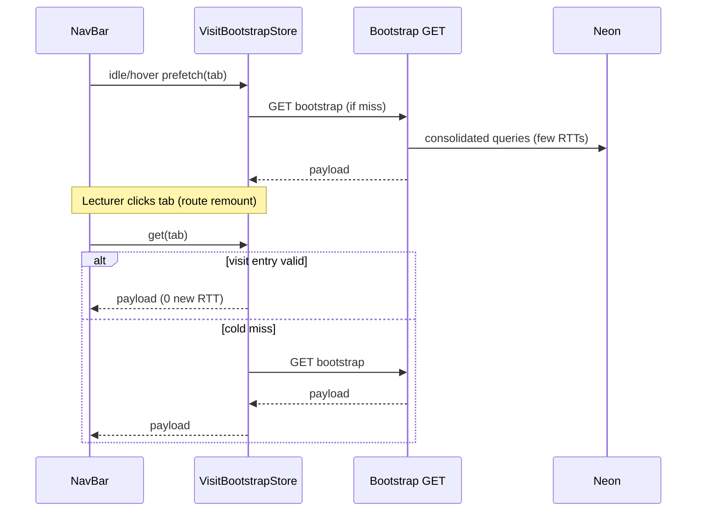

# Lecturer Tab Load Speed - Plan

## Goal Capsule

**Objective:** Make every lecturer nav tab reach **first useful data in under 500ms** after tab click on **Vercel + Render**, via one full-stack bootstrap payload per tab plus idle/hover prefetch, while always showing fresh data for the visit (no stale-while-revalidate), and fix Solution loading copy plus Reports at-risk lab duplication.

**Product authority:** This Product Contract. Student-facing and upload/grading-pipeline performance are surrounding work, not active scope.

**Open blockers:** None.

**Product Contract preservation:** Clarified only — KD9 (Dashboard plagiarism flags secondary) and KD10 (R12 measured via manual DevTools on Vercel+Render); no R-ID renumber; Outstanding Questions moved into KTDs.

---

## Product Contract

### Summary

Speed up all seven lecturer tabs (Dashboard, Score, Grading, Users, Quarters, Solution, Reports) so tab-click → first useful data is under 500ms in production (Vercel frontend, Render backend). Each tab has one bootstrap for that first paint; the UI may prefetch on idle/hover. Always-fresh visit semantics; Solution shows "Loading data..."; Reports at-risk labs lists each lab once.

### Problem Frame

Lecturers wait on full-page or panel spinners when switching tabs. High RTT between Render and the database turns multi-request waterfalls into multi-second waits. Severity today: Solution worst (serial lookups → labs → structure); Grading slow despite needing labs; Quarters slow; Dashboard/Score medium; Users/Reports better but improvable. Reports also repeats the same at-risk lab. Solution still says "Loading structure editor..." instead of the shared "Loading data..." copy.

Route remounts wipe component state: each lecturer path in `App.jsx` remounts `LecturerDashboard`, so an in-visit prefetch cache cannot live only in page `useState`.

### Key Decisions

- KD1. **All seven lecturer tabs in one initiative** (session-settled: user-directed — chosen over worst-offenders-only or Solution-only: one coherent load-speed contract). **Governs R1–R8.**
- KD2. **Full stack in scope** (session-settled: user-directed — chosen over frontend-only or backend-heavy: best path to the production budget). **Governs R9–R11.**
- KD3. **Clock is tab click → first useful data on Vercel + Render, under 500ms** (session-settled: user-directed — chosen over feel-only or API-only timing). **Governs R12.**
- KD4. **Always fresh for the visit — no stale-while-revalidate** (session-settled: user-directed — chosen over show-stale-then-refresh: 500ms must not be met by knowingly stale UI). **Governs R13.**
- KD5. **Prefetch on idle/hover allowed** (session-settled: user-directed — chosen over fetch-must-start-on-click: warm click may show an already-finished fresh bootstrap). **Governs R14.**
- KD6. **One bootstrap payload per tab (Approach B)** (session-settled: user-approved — chosen over keep-many-APIs-as-is or warm-all-tabs-on-login: ≤1 critical RTT when cold; prefetch when warm). **Governs R9–R11, R15.**
- KD7. **Bootstrap freshness vs existing TTL caches** — tab bootstrap must honor R13: no multi-minute reuse that contradicts always-fresh; planning may keep separate short-lived reuse or fix the overview cache property binding, but the bootstrap path must not serve data older than visit validity (same lecturer shell session, invalidated on mutations that change that tab’s data). **Governs R13.**
- KD8. **Warm-all-tabs on login deferred** — Approach C is not required for this contract. **Governs R16.**
- KD9. **Dashboard plagiarism flags are secondary** (session-settled: user-approved — chosen over bundling flags into Dashboard first paint: cards/lists are first useful data; flags load after). **Governs R1, R15.**
- KD10. **R12 proof is manual DevTools on Vercel + Render** (session-settled: user-approved — chosen over required CI timing harness: measure tab-click → primary content visible). **Governs R12, SC1.**

### Actors

- A1. **Lecturer** (including dual-role users on lecturer routes) using the top nav tabs on Vercel against Render.

### Requirements

**Coverage**

- R1. Dashboard first useful data: overview cards (and supporting lists already part of the overview payload) ready to show without a second blocking round-trip for that first paint. Plagiarism flags are not required for first useful data (KD9).
- R2. Score first useful data: grade-overview matrix first page (students × labs) ready to show.
- R3. Grading first useful data: labs list (and whatever else the Grading tab needs to become interactive for lab selection) ready to show. Must not wait on Dashboard overview.
- R4. Users first useful data: first page of the user table ready to show.
- R5. Quarters first useful data: academic quarters list ready to show (detail panel may still wait for selection).
- R6. Solution first useful data: structure editor usable for the default selected lab (lookups + labs + that lab’s structure), not every secondary panel.
- R7. Reports first useful data: analytics dashboard summary and lists ready to show, including at-risk labs without duplicate lab rows.
- R8. While any tab’s bootstrap is in flight and no usable bootstrap result is available yet, loading copy is **Loading data...** (Solution must not say "Loading structure editor...").

**Bootstrap and freshness**

- R9. Each of the seven tabs has a single bootstrap that returns everything required for that tab’s first useful data (R1–R7).
- R10. After tab click, if no valid in-visit bootstrap result exists yet, the client issues at most one blocking network round-trip for that tab’s first useful data.
- R11. Backend work for each bootstrap is optimized for high RTT (prefer fewer DB round-trips and less serial waiting inside the request).
- R12. On Vercel + Render, from tab click to first useful data is under **500ms** for each of the seven tabs under normal lecturer data volumes for this product.
- R13. The UI must not show stale content while a refresh runs; only a successful fresh bootstrap for this visit (including one completed by prefetch before the click) may be shown as first useful data.
- R14. The client may prefetch tab bootstraps on idle and/or nav hover; on click it may show that result when still valid for this visit per KD7.
- R15. Secondary actions after first paint (pagination, lab detail drill-down, plagiarism drawers/flags, structure switches to another lab, quarter roster) may use additional requests; they are outside the 500ms first-useful-data clock.
- R16. Prefetching every tab’s bootstrap immediately on lecturer login is not required.

**Defects in scope**

- R17. Reports at-risk labs list shows each lab at most once (no repeated Lab N rows from the same lab).

### Key Flows

- F1. Cold tab open
  - **Trigger:** Lecturer clicks a nav tab with no valid in-visit bootstrap for that tab.
  - **Actors:** A1
  - **Steps:** Client starts that tab’s bootstrap; shows Loading data... until first useful data; renders primary content from the single bootstrap response.
  - **Covered by:** R8–R13
- F2. Prefetch then click
  - **Trigger:** Bootstrap for a tab finishes via idle/hover prefetch; lecturer then clicks that tab before visit invalidation.
  - **Actors:** A1
  - **Steps:** Client shows the prefetched bootstrap as first useful data without waiting on a new round-trip (unless invalidated).
  - **Covered by:** R13, R14, R12
- F3. Solution first paint
  - **Trigger:** Lecturer opens Solution with no valid bootstrap.
  - **Actors:** A1
  - **Steps:** One bootstrap supplies lookups, labs, and default-lab structure; spinner text is Loading data...; editor becomes usable for that lab.
  - **Covered by:** R6, R8, R9

### Acceptance Examples

- AE1. **Covers R12, R10.** On Vercel + Render, lecturer clicks Score with no warm bootstrap → grade-overview first page appears in under 500ms after one blocking bootstrap request.
- AE2. **Covers R6, R8, R9.** Lecturer opens Solution cold → sees Loading data... (not Loading structure editor...), then the structure editor for the default lab without a serial three-step client waterfall.
- AE3. **Covers R14, R13.** Prefetch completes for Quarters; lecturer clicks Quarters → list appears immediately from that result; no stale-then-spinner refresh pattern.
- AE4. **Covers R3, R10.** Lecturer opens Grading cold → labs list is interactive after one bootstrap, under 500ms on Vercel + Render; spinner does not wait on overview.
- AE5. **Covers R7, R17.** Reports at-risk labs section lists Lab 6 once when only one lab is at risk, even if multiple challenges contribute to the risk signal.
- AE6. **Covers R15.** After Score first paint, changing sort/page may fetch again; that follow-up is outside the first-useful-data budget.

### Success Criteria

- SC1. Each of the seven tabs meets R12 on Vercel + Render for representative current-quarter lecturer data (KD10: DevTools Performance/Network, tab click → primary content visible).
- SC2. R8 and R17 are true in the shipped UI and API/payload behavior.
- SC3. Cold click never requires more than one blocking bootstrap round-trip for first useful data (R10).

### Scope Boundaries

**In scope**

- All seven lecturer nav tabs’ first useful data load path (frontend + backend + DB round-trips as needed)
- Idle/hover prefetch of tab bootstraps
- Solution loading copy
- Reports at-risk lab deduplication
- Visit-scoped bootstrap store that survives route remount
- Fix overview/lab-stats cache property-key mismatches where they affect freshness policy

**Deferred for later**

- Warm-all-tabs bootstrap on lecturer login (Approach C)
- Perceived-performance-only work (skeletons, progressive partial panels) beyond Loading data...
- Student dashboard / history / upload pipeline latency
- Automated frontend test harness

**Out of scope**

- Changing grading correctness, score semantics, or at-risk threshold rules (except deduplicating at-risk **lab** rows)
- Visual redesign of lecturer chrome
- Offline / desktop student practice performance

### Dependencies / Assumptions

- Production topology remains Vercel (frontend) + Render (backend) with high DB RTT relative to local.
- "Normal lecturer data volumes" means the current product’s typical quarters, labs, and enrolled students — not unbounded synthetic scale.
- Existing overview/dashboard TTL caches conflict with R13 if used for bootstrap; bootstrap path bypasses multi-minute TTL or uses visit-aligned invalidation only.
- Lecturer Score/Dashboard/Reports aggregates keep **highest_score** semantics (`docs/solutions/logic-errors/grading-tab-latest-vs-highest-score.md`).

### Outstanding Questions

None blocking. Deferred items resolved in Planning Contract KTDs.

### Sources / Research

- Session grounding + ce-plan research scratch under compound-engineering temp (tab wiring, TTL mismatches, Solution waterfall, at-risk `GROUP BY`).
- Prior plans: `docs/plans/2026-08-04-002-perf-full-stack-latency-plan.md`, `docs/plans/2026-08-07-002-perf-database-performance-plan.md`, `docs/plans/2026-09-09-001-perf-neon-query-roundtrips-plan.md`.
- Learnings: `docs/solutions/logic-errors/grading-tab-latest-vs-highest-score.md`, `docs/solutions/design-patterns/clickable-column-header-table-sort.md`, `docs/solutions/architecture-patterns/spring-security-default-deny-matcher-table.md`, `docs/solutions/architecture-patterns/grading-executor-deadlock-render.md`, `docs/solutions/architecture-patterns/lab-clone-across-terms.md`.

---

## Planning Contract

### Key Technical Decisions

- KTD1. **Visit-scoped module store for bootstraps** — Module-level (or tiny context above remounting routes) map keyed by tab id: in-flight promise, fulfilled payload, invalidated flag. Survives `App.jsx` remount of `LecturerDashboard` per lecturer path. Invalidate on lecturer mutations that change that tab’s data and on logout. **Implements R13, R14; Governs U1.**
- KTD2. **One fetch owner per tab** — Prefetch (idle/`requestIdleCallback` and/or nav hover) and click share the same store entry; mount `useEffect` must not start a second identical bootstrap when a valid in-flight or fulfilled visit entry exists (`docs/solutions/design-patterns/clickable-column-header-table-sort.md`). **Implements R10, R14; Governs U1.**
- KTD3. **Per-tab bootstrap GETs under existing lecturer/analytics trees** — Prefer `GET /api/lecturer/bootstrap/{tab}` (or seven explicit segments) wrapping today’s service methods; keep collection-style naming. Register under `/api/lecturer/**` / `/api/analytics/**` with default-deny matcher order + authorization tests. Legacy endpoints may remain for secondary actions. **Implements R9; Governs U2–U4.**
- KTD4. **In-bootstrap DB consolidation is mandatory for cold R12** — Dashboard, Score, Reports, and Solution bootstraps must cut serial repository hops (batch/CTE/join or bounded parallel queries on the request thread — **not** nested `CompletableFuture` joins on Render’s CPU-capped pool). Do not meet R12 via 90s/180s TTL under R13. **Implements R11, R12; Governs U2, U4. Conflict call-out:** if a single Neon RTT already approaches 500ms in prod, document measured hop count and escalate; do not silently reopen stale cache.
- KTD5. **Bootstrap cache policy** — Bootstrap responses are not served from `LecturerOverviewCache` / `AnalyticsDashboardCache` multi-minute TTL. Fix property-key mismatches (`app.analytics.overview-cache-ttl-seconds` vs `lecturer-overview-…`, lab-stats similarly) for non-bootstrap paths that keep TTL. Dashboard cache needs mutation invalidation or bootstrap bypass. **Implements KD7, R13; Governs U2, U5.**
- KTD6. **Solution bootstrap assembles server-side** — One response: master-data lookups needed for editor + labs list + default lab structure (`LabStructureService.loadForEditor` / batched class structure). Client replaces serial `loadLookups` → `loadLabs` → `selectLab`. Loading copy: `Loading data...`. Keep `structureCacheRef` for same-lab switches only if it does not violate R13 across visits (clear on leave/invalidate). **Implements R6, R8, R9; Governs U4.**
- KTD7. **Grading spinner gate** — Grading first paint depends only on labs bootstrap; do not block on `loadingOverview` / plagiarism. **Implements R3; Governs U1, U3.**
- KTD8. **At-risk labs dedupe in SQL** — Change `findAtRiskLabs` so each lab appears once (drop `challenge_name` from GROUP BY or `DISTINCT ON (l.id)` / aggregate failure signal). Preserve lecturer highest-score semantics; do not switch to latest-attempt. **Implements R17; Governs U5.**
- KTD9. **Preserve highest_scores CTE** — Score/Dashboard/Reports bootstraps reuse shared highest-score fragments; no latest-attempt rejoin. **Implements R2, R7; Governs U2.**
- KTD10. **Prefetch triggers** — Nav item `onMouseEnter`/`onFocus` plus short idle prefetch for adjacent tabs after shell mount; cancel/ignore superseded requests via store generation. No warm-all-seven on login (R16). **Implements R14, R16; Governs U1.**

### High-Level Technical Design

### Assumptions

- Representative current-quarter data on prod is the R12 yardstick (KD10).
- Plagiarism flags remain a separate Dashboard fetch after first paint (KD9).
- Frontend automated tests remain out of scope; `npm run build` + manual checks suffice for FE.

### System-Wide Impact

- Lecturers: faster tab switching; same score/at-risk meaning.
- Backend: new bootstrap routes; SecurityConfig matchers; analytics SQL/cache policy.
- Ops: R12 verified on Vercel+Render; watch Render CPU if any parallel query work is added (prefer request-thread batching).

### Risks

| Risk | Mitigation |
|---|---|
| Cold R12 fails when Neon RTT × serial hops > 500ms | KTD4 consolidation; measure hop count; escalate if single hop ≈ budget |
| Prefetch + mount double-fetch | KTD2 single owner + store |
| Remount wipes warm data | KTD1 module store |
| Stale TTL contradicts R13 | KTD5 bootstrap bypass |
| At-risk SQL change alters ranking | Keep LIMIT 5 after per-lab aggregate; preserve highest_score |
| Nested async on Render deadlocks | No nested pool join in bootstrap (KTD4) |

### Alternatives Considered

- **Keep many existing APIs + FE Promise.all only** — Rejected (Approach A); cold click still multi-RTT.
- **Warm all tabs on login** — Deferred (Approach C / R16).
- **Stale-while-revalidate for 500ms** — Rejected (KD4).

---

## Implementation Units

### U1. Visit bootstrap store, prefetch, and fetch ownership

**Goal:** Survive route remount; idle/hover prefetch; one owner per tab; Grading not blocked on overview; unify loading copy on bootstrap wait.

**Files:**
- Create: `frontend/src/utils/lecturerBootstrapStore.js` (or equivalent under `frontend/src/`)
- Modify: `frontend/src/components/NavBar.jsx`
- Modify: `frontend/src/pages/LecturerDashboard.jsx`
- Modify: `frontend/src/pages/UserManagement.jsx`
- Modify: `frontend/src/pages/TermManagement.jsx`
- Modify: `frontend/src/pages/SolutionManagement.jsx`
- Modify: `frontend/src/pages/Reports.jsx`

**Approach:** Implement visit store (getOrFetch, invalidate, clear on logout). Wire NavBar hover/focus + idle prefetch. Replace per-tab multi-fetch first paint with store-backed single bootstrap consumer. Fix Grading spinner gate (KTD7). Ensure bootstrap wait shows Loading data... (R8).

**Test scenarios:**
- Prefetch completes then click → no second identical network call (Network tab).
- Cold click → exactly one bootstrap request for that tab.
- Navigate Dashboard → Grading → Grading does not wait on overview.
- Logout clears store; next login does not reuse prior visit payloads.

**Verification:** Manual Network tab; `npm run build`.

**Depends on:** Prefer landing after U2–U4 endpoints exist; progressive stubs OK for FE-first spikes.

---

### U2. Dashboard, Score, and Reports bootstrap APIs + RTT consolidation

**Goal:** One GET each for Dashboard/Score/Reports first useful data; fewer DB RTTs inside each handler; bootstrap bypasses multi-minute TTL; preserve highest_score.

**Files:**
- Modify: `backend/src/main/java/controller/LecturerAnalyticsController.java`
- Modify: `backend/src/main/java/controller/AnalyticsController.java` (or lecturer bootstrap controller)
- Modify: `backend/src/main/java/analytics/service/LecturerAnalyticsService.java`
- Modify: `backend/src/main/java/analytics/service/AnalyticsService.java`
- Modify: `backend/src/main/java/analytics/repository/LecturerAnalyticsRepository.java`
- Modify: `backend/src/main/java/analytics/repository/AnalyticsRepository.java` (as needed for consolidation)
- Modify: `backend/src/main/java/analytics/cache/LecturerOverviewCache.java`
- Modify: `backend/src/main/java/analytics/cache/AnalyticsDashboardCache.java`
- Modify: `backend/src/main/resources/application.properties`
- Modify: `backend/src/main/java/config/SecurityConfig.java` (if new paths need explicit matchers)
- Create: DTOs under `backend/src/main/java/analytics/dto/` as needed
- Create: `backend/src/test/java/authorization/...` bootstrap auth probes
- Create: `backend/src/test/java/unit/.../analytics/` service/repository tests for consolidation invariants

**Approach:** Add bootstrap endpoints that assemble R1/R2/R7 payloads. Collapse serial `safeFind*` / loadOverview chains. Score bootstrap returns first page defaults matching today’s grade-overview defaults. Reports bootstrap returns dashboard DTO with deduped at-risk labs (after U5 or together). Do not serve from 90s/180s TTL on bootstrap path.

**Test scenarios:**
- Lecturer JWT → 200; anonymous → 401; student → 403.
- Score bootstrap uses highest_score semantics (parity with existing grade-overview for a fixture).
- Bootstrap handler does not call overview/dashboard TTL cache get for the bootstrap path.
- Cold path issues one HTTP call from FE (integration with U1).

**Verification:** `mvn test` from `backend/`; manual Network on Score/Dashboard/Reports.

**Depends on:** None (can land before FE).

---

### U3. Grading, Users, and Quarters thin bootstraps

**Goal:** One bootstrap each for labs list (Grading), users first page, quarters list.

**Files:**
- Modify: `backend/src/main/java/controller/LabController.java` and/or lecturer bootstrap controller
- Modify: `backend/src/main/java/controller/UserController.java` (or bootstrap wrapper)
- Modify: `backend/src/main/java/controller/LecturerTermController.java`
- Modify: corresponding services
- Modify: FE consumers in U1 files for these tabs
- Create/Modify: authorization tests for new routes

**Approach:** Thin wrappers or dedicated bootstrap GETs returning exactly first useful data. Quarters: list only (roster stays secondary per R5/R15). Users: page 0 size 50 (today’s default). Grading: labs list sufficient for `BulkGradingPanel`.

**Test scenarios:**
- Each endpoint auth matrix (lecturer/anon/student).
- Quarters bootstrap does not require roster to return 200 with list.
- Grading FE interactive after single labs bootstrap.

**Verification:** `mvn test`; manual Grading/Users/Quarters cold open.

**Depends on:** U1 for FE wiring.

---

### U4. Solution bootstrap + Loading data...

**Goal:** Server-assembled Solution first paint; eliminate client waterfall; fix loading copy.

**Files:**
- Modify: `backend/src/main/java/controller/` lecturer rubric/labs controllers (new bootstrap mapping)
- Modify: `backend/src/main/java/service/LabStructureService.java` (and master-data access as needed)
- Modify: `frontend/src/pages/SolutionManagement.jsx`
- Modify: authorization tests

**Approach:** `GET` bootstrap returns lookups + labs + default-lab structure in one JSON. FE boot uses store + single call; spinner text `Loading data...`. Secondary lab switch may fetch structure for other labs (R15).

**Test scenarios:**
- Bootstrap with labs → includes structure for first/default lab.
- Bootstrap with no labs → empty labs, no error, editor empty-state.
- UI string is Loading data... during cold boot (manual).
- Auth matrix for new route.

**Verification:** `mvn test`; manual Solution cold open on prod-like latency if possible.

**Depends on:** U1 store.

---

### U5. At-risk lab dedupe + cache property-key fixes

**Goal:** R17; align cache `@Value` keys with `application.properties` for non-bootstrap TTL paths.

**Files:**
- Modify: `backend/src/main/java/analytics/repository/AnalyticsRepository.java` (`findAtRiskLabs`)
- Modify: `backend/src/main/java/analytics/service/AnalyticsService.java` (if post-dedupe needed)
- Modify: `backend/src/main/java/analytics/cache/LecturerOverviewCache.java` and/or `application.properties`
- Modify: `backend/src/main/java/analytics/cache/LabStatisticsCache.java` and/or properties (same class of bug)
- Create: `backend/src/test/java/unit/.../analytics/FindAtRiskLabsDedupeTest.java` (or support home)

**Approach:** Per-lab aggregation so Lab 6 appears once; keep LIMIT 5 ordering by severity. Fix overview/lab-stats property keys so configured TTLs bind. Ensure dashboard cache invalidation story does not undermine R13 for bootstrap (bypass already in U2).

**Test scenarios:**
- Fixture with one lab / multiple challenge failure rows → one at-risk lab item.
- Configured overview TTL property is read (unit test on cache construction or property binding).

**Verification:** `mvn test`; manual Reports at-risk list.

**Depends on:** Can ship with U2 Reports bootstrap.

---

### U6. DOX + pages AGENTS nav accuracy

**Goal:** Document bootstrap contracts and fix stale Score vs Grading nav docs.

**Files:**
- Modify: `frontend/src/pages/AGENTS.md`
- Modify: `frontend/AGENTS.md` (if API table needs bootstrap rows)
- Modify: `backend/AGENTS.md` (bootstrap endpoints + cache property keys)
- Modify: `CONCEPTS.md` only if bootstrap vocabulary needs tweak (already seeded)

**Approach:** Update lecturer section table: `score` → grade-overview; `grading` → bulk + labs bootstrap; list bootstrap endpoints; note visit store + prefetch; Loading data... on Solution.

**Test scenarios:**
- Doc review checklist: nav labels match `NavBar.jsx` / `authRoutes.js`.

**Verification:** DOX pass; no build required beyond consistency.

**Depends on:** U1–U5 shapes stable enough to document.

---

## Verification Contract

| Gate | Command / action |
|---|---|
| Backend tests | `mvn test` from `backend/` |
| Frontend build | `npm run build` from `frontend/` (or root) |
| Auth | Authorization tests for each new bootstrap route |
| R12 / SC1 | Manual on Vercel + Render: DevTools, tab click → primary content &lt; 500ms for all seven tabs (cold and warm-prefetch) |
| R8 | Manual Solution cold open: Loading data... |
| R17 | Manual Reports: no duplicate at-risk lab rows |
| R10 | Network: cold click ≤1 bootstrap XHR/fetch per tab |

---

## Definition of Done

- [ ] All units U1–U6 complete
- [ ] Product requirements R1–R17 satisfied
- [ ] `mvn test` green; `npm run build` green
- [ ] Manual Vercel+Render timing meets SC1 or documented measurement escalation per KTD4 conflict call-out
- [ ] DOX updated for bootstrap APIs and Score/Grading nav accuracy
- [ ] No stale-while-revalidate on tab first paint
