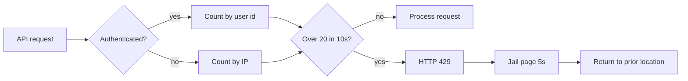
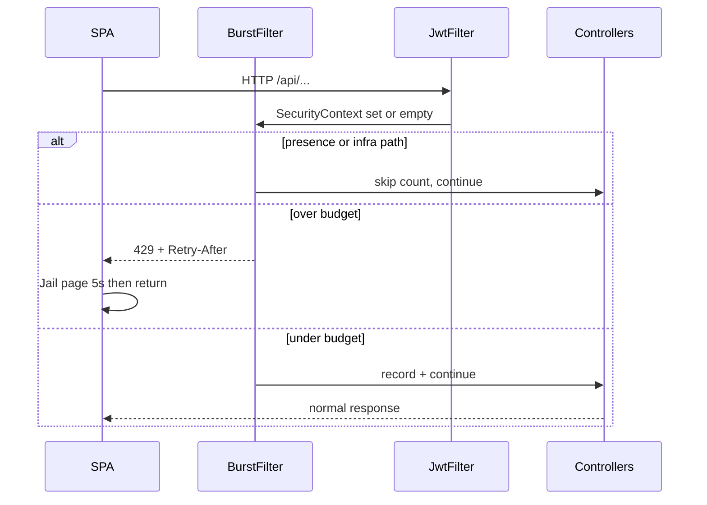

# Global API burst guard - Plan

## Goal Capsule

**Objective:** Add a preventive global API burst guard so rapid spam (uploads, auth, F5-style hammering) is blocked server-side, with a simple jail page and automatic return after a short cool-down.

**Product authority:** Session 2026-10-09 brainstorm. Soft delay, dual client+server counters, CAPTCHA, account lockout, role exemptions, Redis-shared limits, and desktop/offline practice as a separate surface are not active scope.

**Open blockers:** None.

**Product Contract preservation:** restructured, no scope change: R3 clarified to match settled presence/infra exclusions (KTD5–KTD6); AE6 added.

---

## Product Contract

### Summary

Enforce one global short-window request budget on the API for every role.
Over limit, the API rejects with HTTP 429.
The SPA shows a dedicated jail page that explains what happened and what to do, holds the user for 5 seconds, then returns them to the screen they came from.

### Problem Frame

The system has no request-volume guard today.
Abuse has not been observed in production yet; this is preventive hardening for submission spam, auth hammering, and rapid refresh / scripted bursts before they overload grading or auth paths.

### Key Decisions

- **Server is the referee; SPA only presents the jail** — client-only gates are out. (session-settled: user-directed — chosen over client-first dual counters and soft-delay) Governs R1, R6, R7.
- **One global burst policy for counted API traffic** — not layered upload/auth-only caps; ambient presence and listed infra paths are excluded from the count. (session-settled: user-directed — chosen over layered or surface-only limits) Governs R2, R3.
- **Identity first when authenticated; IP when anonymous** — campus shared Wi-Fi must not jail a whole lab for one student. (session-settled: user-directed — chosen over IP-only) Governs R4.
- **Everyone equal** — students, lecturers, and admins share the same budget. (session-settled: user-directed — chosen over staff exemptions) Governs R5.
- **Default budget 20 requests / 10 seconds; jail hold 5 seconds** — safer for parallel dashboard loads than 5–10 / 10s. (session-settled: user-directed — chosen over 5/10s and 10/10s) Governs R2, R8.

### Actors

- A1. Any authenticated user (student, lecturer, or admin)
- A2. Anonymous caller on public auth / public API routes
- A3. Backend API (enforces the budget)
- A4. SPA (detects 429, shows jail, returns after cool-down)

### Requirements

**Enforcement**

- R1. The API is the source of truth for whether a request is allowed or rejected for burst abuse.
- R2. Default product budget: more than 20 requests in any rolling 10-second window for a given identity key is over limit.
- R3. The same budget applies to all counted API requests (including uploads, auth, and ordinary page data fetches) under one global policy. Do not count `GET /api/presence/count`, `DELETE /api/presence/leave`, `OPTIONS /**`, `GET /`, or swagger/OpenAPI paths when springdoc is on.
- R4. When the caller is authenticated, the identity key is the user (JWT subject / user id). When anonymous, the identity key is the client IP.
- R5. No role is exempt from the budget.
- R6. Over-limit requests receive HTTP 429 and must not perform the protected work (no grading, auth side effects, or successful business response for that rejected call).

**Jail UX**

- R7. On 429 from the API, the SPA navigates to a dedicated jail page (not only a toast or generic “Server Busy” string).
- R8. The jail page holds the user for 5 seconds before automatically returning them to the location they were on when jailed.
- R9. The jail page is simple and states (1) what the user did that caused the jail and (2) what they should do next (slow down / wait / stop spamming).

### Key Flows

- F1. Authenticated burst → jail → return
  - **Trigger:** A1 issues more than 20 API requests within 10 seconds.
  - **Actors:** A1, A3, A4
  - **Steps:** A3 rejects the excess request with 429; A4 opens the jail page with clear copy; after 5 seconds A4 returns A1 to the prior location.
  - **Covered by:** R1, R2, R4, R6, R7, R8, R9
- F2. Anonymous auth hammer → jail → return
  - **Trigger:** A2 hammers public auth (or other anonymous) endpoints beyond the budget from one IP.
  - **Actors:** A2, A3, A4
  - **Steps:** Same as F1 keyed by IP; successful auth work does not run for the rejected call.
  - **Covered by:** R1, R2, R4, R6, R7, R8, R9
- F3. Rapid refresh (F5-style)
  - **Trigger:** A1 or A2 repeatedly refreshes or otherwise floods the API under the global budget.
  - **Actors:** A1 or A2, A3, A4
  - **Steps:** Excess requests 429; jail UX per R7–R9.
  - **Covered by:** R2, R3, R6, R7, R8, R9



### Acceptance Examples

- AE1. Legitimate parallel dashboard load
  - **Covers:** R2, R3
  - **Given:** A student opens the dashboard and the SPA issues a small parallel fan-out (well under 20 calls in 10s)
  - **When:** Those requests complete normally
  - **Then:** No jail; no 429 from the burst guard
- AE2. F5 spam
  - **Covers:** R2, R3, R6, R7, R8, R9
  - **Given:** A logged-in user repeatedly refreshes so API volume exceeds 20 in 10s
  - **When:** The excess request is rejected
  - **Then:** They see the jail page with cause + next step, stay for 5s, then return to the prior location
- AE3. Shared campus Wi-Fi
  - **Covers:** R4, R5
  - **Given:** Two different logged-in students share one public IP
  - **When:** Student A exceeds the budget
  - **Then:** Student A is jailed; Student B’s separate user budget is unaffected
- AE4. Anonymous login hammer
  - **Covers:** R4, R6
  - **Given:** No JWT; many login attempts from one IP within 10s beyond the budget
  - **When:** Excess attempts arrive
  - **Then:** Those attempts get 429 and do not succeed as normal logins
- AE5. Lecturer same rules
  - **Covers:** R5
  - **Given:** A lecturer exceeds 20 API requests in 10s
  - **When:** The excess request arrives
  - **Then:** Same 429 + jail behavior as a student
- AE6. Presence heartbeat does not consume budget
  - **Covers:** R3
  - **Given:** A signed-in user only polls `GET /api/presence/count` (and optionally leave) many times within 10s
  - **When:** Those presence calls complete
  - **Then:** No 429 from the burst guard and no jail from presence alone

### Success Criteria

- Rapid F5 / scripted bursts are stopped by the API before protected work runs.
- Normal light page loads under the default budget do not jail users.
- Jail copy is understandable without support intervention: cause + what to do.
- After the 5-second hold, users land back where they were without manual URL hunting.

### Scope Boundaries

**In scope**

- Global API burst budget with identity/IP keying
- HTTP 429 rejection of over-limit calls
- Dedicated SPA jail page, 5s hold, return-to-prior-location
- All roles under the same rules

**Deferred for later**

- Soft delay / request queueing instead of jail
- Client-side pre-gate that mirrors the server counter
- CAPTCHA, account lockout, audit UI for offenders
- Stricter per-surface caps (upload-only or auth-only) on top of the global budget
- Desktop / offline practice as its own rate-limit product surface
- Redis / shared multi-instance rate-limit state

**Out of scope**

- Changing grading correctness, rubric, or plagiarism behavior
- Role-based exemptions from the burst guard

### Dependencies / Assumptions

- Assumption: This ships as preventive hardening; no production spam incident is required to justify v1.
- Assumption: Default thresholds (20 / 10s, 5s jail) are product defaults; planning may expose them as config if that stays behavior-equivalent.
- Assumption: Desktop local practice (`desktop` profile / local API on `:18002`) is outside this product surface; the web burst guard must not apply there unless a later plan explicitly brings it in.
- Confirmed repo baseline: no existing HTTP rate-limit filter; frontend already treats 429 as a busy/error status today and will need a dedicated jail path beyond the generic “Server Busy” string; student/lecturer UIs already fan out parallel API calls under the chosen 20 / 10s budget.
- Related prior deferral: forgot-password work deferred rate limiting (`docs/plans/2026-08-08-002-feat-forgot-password-plan.md`).

### Sources / Research

- Grounding + claim verification: no Bucket4j/Resilience4j; JWT/desktop filters only; 429 → “Server Busy”; `/api/auth/**` public; forgot-password deferred rate limiting.
- Repo patterns: `SecurityConfig` / `DesktopSecurityConfig` profile split; `JwtAuthenticationFilter` + `JwtUserPrincipal(email, irn, roles)` (no UUID claim); presence poll 10s via native `fetch`; `apiFetch` handles 401/403 only; authorization tests under `backend/src/test/java/authorization/`.
- Learnings: `docs/solutions/architecture-patterns/spring-security-default-deny-matcher-table.md`, `docs/solutions/architecture-patterns/jwt-session-version-force-logout.md`, `docs/solutions/conventions/backend-junit-aspect-home-packages.md`.
- External (implementation-guidance): Spring `OncePerRequestFilter` + 429 + `Retry-After`; bound in-memory keys (eviction); multi-instance needs Redis — deferred here.

---

## Planning Contract

### Key Technical Decisions

| ID | Decision | Rationale |
|----|----------|-----------|
| KTD1 | Register a `@Profile("!desktop")` `OncePerRequestFilter` in `SecurityConfig` **after** `JwtAuthenticationFilter` | Server referee; desktop never sees the bean. Governs R1, R6. |
| KTD2 | Authenticated key = stable email from `JwtUserPrincipal` (fallback JWT `sub`); anonymous key = client IP | JWT has no UserAccount UUID today; email/`sub` satisfies R4 without claim migration. Governs R4. |
| KTD3 | In-process rolling window (timestamp deque or equivalent) with **bounded** key eviction; no Redis/Bucket4j for v1 (session-settled: user-approved — chosen over Redis shared state: simpler for single/few Render instances) | Matches PresenceService spirit; note per-instance budgets. Governs R2. |
| KTD4 | Defaults via `app.burst.max-requests=20`, `app.burst.window-seconds=10`, `app.burst.retry-after-seconds=5`; document in `.env.backend.example` | Behavior-equivalent tunables. Governs R2, R8. |
| KTD5 | Do **not** count `GET /api/presence/count` or `DELETE /api/presence/leave` toward the budget (session-settled: user-directed — chosen over counting presence) | Ambient heartbeat must not burn user quota. Still count other `/api/**`. Governs R3. |
| KTD6 | Also skip counting `OPTIONS /**`, `GET /`, and swagger/OpenAPI paths when springdoc is on | Infra noise, not user-driven API abuse. |
| KTD7 | Enable trusted forwarded headers for client IP behind Render (`server.forward-headers-strategy` or equivalent) and document the proxy assumption | Anonymous IP keying is otherwise edge-IP collapsed. Governs R4. |
| KTD8 | On deny: HTTP 429, `Retry-After` = configured cool-down seconds, optional JSON body; do not run the rest of the chain | R6 + SPA timing for R8. |
| KTD9 | SPA: new `/rate-limited` (or similar) route; `apiFetch` + auth native `fetch` paths navigate on 429 with prior location; carve jail navigation out of generic “Server Busy” | R7–R9; login/forgot/Google bypass `apiFetch` today. |
| KTD10 | Keep presence Bearer-failed → 401 force-logout semantics unchanged | Do not regress jwt-session-version learning. |

### Assumptions

- Render may run more than one instance; effective anonymous/auth budgets are **per instance** until a later Redis plan.
- Trusted proxy / forwarded-header config is acceptable for this deploy topology.
- Email as authenticated key is unique enough for R4 (same as presence heartbeat identity).

### High-Level Technical Design



```text
Counted: /api/** except presence count/leave, OPTIONS, GET /, swagger
Key: user:{email} if JwtUserPrincipal present else ip:{clientIp}
Store: in-process concurrent map + rolling timestamps, expire idle keys
Desktop profile: no filter bean / not registered
```

### System-Wide Impact

- **Students / lecturers / admins:** Same jail UX; no role carve-outs.
- **SPA:** New denial path beside 401→login and 403→`/no-access`; must not clear session on 429.
- **Presence / force-logout:** Heartbeat excluded from budget; Bearer-failed presence must remain 401.
- **Desktop practice:** Unchanged (no web burst filter).
- **Ops / Render:** Per-instance budgets; forward-headers required for fair anonymous IP keying.

### Risks / Trade-offs

| Risk | Mitigation |
|------|------------|
| Multi-instance weakens limit (N × 20) | Accepted for v1; document; defer Redis |
| Proxy misconfig → all anonymous share one IP | Forward-headers + deploy note; authenticated traffic still per-email |
| Parallel lecturer bootstrap near 20 | Defaults already raised to 20/10s; presence excluded; tune via env if needed |
| Auth `fetch` paths miss jail | KTD9 explicitly updates login/forgot/Google/reset |
| 429 still labeled Server Busy in toasts | Carve status handling so jail wins over friendly busy string |

### Open Questions

**Deferred (non-blocking):** Exact helper/class names; whether `DELETE /api/presence/leave` exclusion is enough if a future presence path appears (keep path allowlist tight).

---

## Implementation Units

### U1. Burst budget service + config

- **Goal:** Rolling-window allow/deny decision with env-tunable defaults and bounded in-memory keys.
- **Requirements:** R2, R3 (counter math only)
- **Dependencies:** None
- **Files:**
  - Create: `backend/src/main/java/com/eiu/capstone/backend/security/BurstBudgetService.java` (or `service/` sibling — keep next to security filter)
  - Modify: `backend/src/main/resources/application.properties` (`app.burst.*`)
  - Modify: `backend/.env.backend.example` (document knobs)
  - Test: `backend/src/test/java/unit/com/eiu/capstone/backend/security/BurstBudgetServiceTest.java`
- **Approach:**
  1. Implement allow/record for a string key over a rolling window; deny when count would exceed max.
  2. Bound map growth (max keys and/or expire-after-access).
  3. Wire all three KTD4 defaults from properties: `app.burst.max-requests=20`, `app.burst.window-seconds=10`, `app.burst.retry-after-seconds=5` (document all three in `.env.backend.example`) (KTD3, KTD4).
- **Patterns to follow:** `PresenceService` in-process map + window; `app.*` property style in `application.properties`.
- **Execution note:** Implement window math test-first in the unit home.
- **Test scenarios:**
  - Happy: 20 allows in 10s succeed; 21st denied.
  - Edge: after window slides, requests allowed again.
  - Edge: independent keys do not share budget.
  - Edge: idle keys can be evicted / do not grow unbounded under many unique keys.
  - Config: properties expose all three `app.burst.*` knobs with the defaults above.
- **Verification:** Unit tests green; defaults match product numbers.

### U2. Web-only burst filter + SecurityConfig + IP resolution

- **Goal:** Enforce the budget on counted web API traffic with 429 before controllers run; keep desktop free.
- **Requirements:** R1, R3, R4, R5, R6
- **Dependencies:** U1
- **Files:**
  - Create: `backend/src/main/java/com/eiu/capstone/backend/security/BurstLimitFilter.java` (name flexible)
  - Create: small IP helper colocated or private methods on the filter
  - Modify: `backend/src/main/java/com/eiu/capstone/backend/config/SecurityConfig.java` (register after JWT)
  - Modify: `backend/src/main/resources/application.properties` / `application.yml` for forward-headers if needed (KTD7)
  - Test: `backend/src/test/java/authorization/com/eiu/capstone/backend/security/BurstLimitFilterTest.java` (or extend `SecurityAuthorizationTest` style)
  - Optional: assert bean absent under desktop in `integration/.../DesktopProfileContextTest.java` or sibling
- **Approach:**
  1. `@Component` + `@Profile("!desktop")` filter; `addFilterAfter` JWT filter (KTD1).
  2. Skip count for presence paths, OPTIONS, GET `/`, swagger (KTD5, KTD6); still continue chain.
  3. Key from `JwtUserPrincipal.email()` when authenticated; else client IP (KTD2, KTD7).
  4. On deny write 429 + `Retry-After` and stop the chain (KTD8).
  5. Do not alter JWT clear-context / presence 401 behavior (KTD10).
- **Patterns to follow:** `JwtAuthenticationFilter`; `SecurityAuthorizationTest` / `PresenceControllerTest` WebMvc slices; spring-security default-deny learning.
- **Test scenarios:**
  - Covers AE4: anonymous hammer on `/api/auth/**` → 429 before controller side effects.
  - Covers AE3: two authenticated users (different emails) have independent budgets.
  - Covers AE5: lecturer JWT over budget → 429 same as student.
  - Happy / AE1: under-budget parallel-style sequential requests succeed.
  - Integration: `GET /api/presence/count` repeated does not exhaust budget.
  - Regression: revoked/invalid Bearer on presence still yields 401 (not swallowed as anonymous unlimited).
  - Desktop: burst filter bean not active on `desktop` profile.
- **Verification:** Authorization (+ optional desktop) tests green; over-limit never reaches a probe controller body.

### U3. SPA rate-limit jail + 429 routing

- **Goal:** Dedicated jail page with cause/next-step copy, 5s hold, return to prior location; wire all web fetch entry points.
- **Requirements:** R7, R8, R9
- **Dependencies:** U2 (real 429 contract)
- **Files:**
  - Create: `frontend/src/pages/RateLimitedPage.jsx` (or equivalent)
  - Modify: `frontend/src/utils/authRoutes.js` (`ROUTES` + helper if needed)
  - Modify: `frontend/src/App.jsx` (route; jail may be reachable without full role gate)
  - Modify: `frontend/src/utils/apiFetch.js` (429 → jail with prior path)
  - Modify: `frontend/src/utils/apiError.js` (do not let jailable 429 collapse to toast-only Server Busy when navigating)
  - Modify: auth native `fetch` call sites (`LoginUI`, `ForgotPasswordUI`, `ResetPasswordUI`, Google/first-time setup as applicable)
  - DOX: `frontend/AGENTS.md` API/error contract note
- **Approach:**
  1. On 429, store prior pathname (+ search) then navigate to jail route (KTD9).
  2. Jail page shows fixed simple copy (too many requests; wait / slow down); countdown or timed redirect using `Retry-After` when present else 5s.
  3. After hold, `navigate`/`assign` back to stored prior location (fallback: default dashboard / login).
  4. Desktop SPA mode: leave behavior unchanged (no cloud burst filter).
- **Patterns to follow:** `/no-access` full-page hold; `apiFetch` 401/403 redirects — add 429 as a third path that does **not** clear session.
- **Test scenarios:**
  - Test expectation: none for automated SPA tests (no frontend runner) — verify via `npm run build` and manual AE2 checklist.
  - Manual / Covers AE2: force 429 (or mock) → jail copy → 5s → prior route; session remains.
  - Manual: 429 on login form shows jail then returns without treating as wrong-password toast only.
- **Verification:** `npm run build` succeeds; manual jail path meets R7–R9.

### U4. Backend/frontend DOX closeout

- **Goal:** Document the burst guard in owning AGENTS and security posture notes.
- **Requirements:** Supports R1–R9 discoverability
- **Dependencies:** U2, U3
- **Files:**
  - Modify: `backend/AGENTS.md` (security posture + env table for `app.burst.*` / forward-headers)
  - Modify: `frontend/AGENTS.md` (429 → jail; presence excluded server-side)
  - Modify: `CONCEPTS.md` only if presence-exclusion precision needs a glossary tweak (optional)
- **Approach:** Record web-only filter, keying, exclusions, per-instance caveat, jail route.
- **Test scenarios:** Test expectation: none — docs only.
- **Verification:** DOX chain matches shipped behavior; no stale “no rate limiting” claims in touched docs.

---

## Verification Contract

- `mvn test` from `backend/` (at least U1 unit + U2 authorization targets)
- `npm run build` from `frontend/`
- AE1–AE6 checklist against running web stack (AE6 presence spam does not jail; F5/auth hammer does)
- Desktop profile smoke: practice API does not enforce web burst guard
- Confirm presence force-logout 401 path still works

## Definition of Done

- Web API rejects over-budget traffic with 429 before protected work (R1, R6).
- Defaults 20 / 10s; presence and listed infra paths excluded; all roles equal (R2–R5, KTD5).
- SPA jail explains cause + next step, holds ~5s, returns to prior location (R7–R9).
- Desktop profile unaffected; DOX updated; tests/build green.
- Per-instance in-memory limit documented; Redis deferred.
