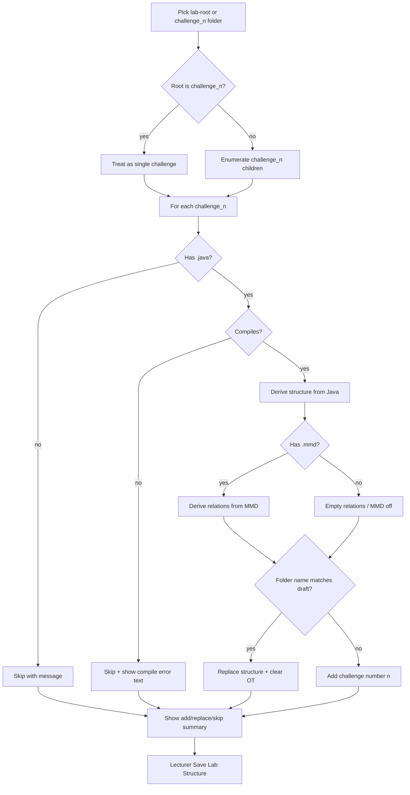

# Lecturer Solution Folder Import - Plan

## Goal Capsule

- **Objective:** Let lecturers import a solution folder (lab-root or single `challenge_n`) into the selected lab’s Structure editor draft: compile Java, derive structure from `.java` and relations from `.mmd`, merge additively by folder name, and persist only via **Save Lab Structure**.
- **Product authority:** This Product Contract. Operational testcase authoring UX, student upload, bulk grading, and creating a new lab from the outer folder name are not active scope.
- **Open blockers:** None.
- **Stop conditions:** Do not auto-persist on import. Do not wipe unmatched challenges. Do not use student `IRN_Name` upload validation for lecturer folders. Do not run the full grading pipeline for import.
- **Execution:** Code.
- **Tail ownership:** Implementer owns unit verification; lecturer smoke of import → draft merge → Save Lab Structure closes the feature.
- **Product Contract preservation:** Clarified only — R11 now covers editor OT clear plus wipe on Save Lab Structure for replaced challenges; KD5 `Governs` repointed R7→R11; KD9 added (replace keeps challenge chrome). No R-ID renumber. Deferred Q1–Q3 resolved as KTDs.

---

## Product Contract

### Summary

Wire the existing Solution import UI so a lecturer can drop or pick a solution folder, get a draft lab structure merged into the editor for challenges that compile, see clear skip/error feedback for the rest, and save when ready. Manual class-by-class rubric entry is no longer required to bootstrap a lab from a finished solution.

### Problem Frame

Lecturers today hand-build lab structure in Solution Management. That takes a long time when a complete Java (and optional MMD) solution already exists on disk. The Solution tab already collects a folder selection, but **Import solution** is not connected, so the UI sets a false expectation.

### Key Decisions

- KD1. **Direct draft merge (Approach A)** (session-settled: user-directed — chosen over review-then-apply and new-lab-only: fastest path out of manual setup). **Governs R1, R8, R12.**
- KD2. **Draft only until Save Lab Structure** (session-settled: user-directed — chosen over replace+persist on import: lecturer keeps an explicit persist step). **Governs R1, R12.**
- KD3. **Add-on merge; replace only matching `challenge_n`** (session-settled: user-directed — chosen over wipe-all: update one challenge without destroying siblings). **Governs R6, R9, R10.**
- KD4. **Match and number by folder name** (session-settled: user-directed — chosen over display-name match and next-available numbering: `challenge_n` is identity and `challenge_number`). **Governs R3, R10.**
- KD5. **Clear OT on replaced challenge** (session-settled: user-directed — chosen over keep or block-import: structure and OT must not drift). **Governs R11.**
- KD6. **Partial apply on compile failure** (session-settled: user-directed — chosen over abort-everything: good challenges still land in the draft). **Governs R5, R8.**
- KD7. **Java required; MMD optional** (session-settled: user-directed — chosen over requiring both file types: Java-only challenges are valid). **Governs R4, R13, R14.**
- KD8. **Accept lab-root and single-challenge folders** (session-settled: user-directed — chosen over lab-root-only: lecturers can refresh one challenge). **Governs R2, R3.**
- KD9. **Replace keeps challenge chrome** (session-settled: user-approved — chosen over resetting title/pillar weights: only classes/relations rebuild). **Governs R10.**

### Actors

- A1. **Lecturer** editing a selected lab in Solution Management.

### Requirements

**Entry and folder shapes**

- R1. From Solution import on the selected lab, the lecturer can drop or pick a folder and run **Import solution** to merge derived structure into the Structure editor draft without persisting until **Save Lab Structure**.
- R2. A lab-root folder is accepted when it contains one or more `challenge_n` child folders (outer name may be any label and does not rename the selected lab).
- R3. A single-challenge folder is accepted when the selected root itself is named `challenge_n` and holds the challenge’s sources.
- R4. Under each `challenge_n`, `.java` and `.mmd` files are the import inputs; other files are ignored for structure derivation.

**Compile and derivation**

- R5. Each challenge with at least one `.java` must compile successfully before its draft structure is applied; on failure, that challenge is skipped and the lecturer sees the compilation error text for it.
- R6. Lab structure for an applied challenge (classes and members) is derived from its compiled `.java` sources.
- R7. When an applied challenge includes `.mmd`, relations for that challenge come from the `.mmd`; when `.mmd` is absent, relations stay empty and the MMD pillar is off for that challenge.
- R8. After import, the UI summarizes adds, replaces, skips, and compile failures without requiring a per-challenge confirm step.

**Merge into the selected lab draft**

- R9. Challenges in the editor that do not appear in the import stay unchanged in the draft.
- R10. A challenge whose folder name matches an existing draft challenge replaces that challenge’s structure in the draft (keeping existing challenge id, display name, and pillar weights); a non-matching `challenge_n` is added with `challenge_number` equal to `n` (gaps allowed).
- R11. Replacing a matched challenge clears that challenge’s operational testcases in the editor; **Save Lab Structure** also wipes persisted OT for challenges replaced since the last save so structure save cannot keep stale OT member references.
- R12. Import never auto-saves; persistence remains **Save Lab Structure**.

**Validation skips**

- R13. A `challenge_n` folder with no `.java` is skipped with a clear message (MMD-only is not enough).
- R14. A `challenge_n` folder with `.java` and no `.mmd` may still apply when compile succeeds (per R5–R7).

### Key Flows

- F1. Lab-root import into draft
  - **Trigger:** Lecturer selects a lab-root folder and clicks **Import solution**.
  - **Actors:** A1
  - **Steps:** Detect `challenge_n` children; for each, validate Java presence; compile; on success derive structure (+ relations if MMD); merge add/replace by folder name; clear OT on replaces; leave unmatched editor challenges alone; show summary including compile errors for skips.
  - **Outcome:** Draft updated; lab not persisted until Save.
  - **Covered by:** R1–R12, R14

- F2. Single-challenge import
  - **Trigger:** Lecturer selects a `challenge_n` folder (no outer lab folder) and imports.
  - **Actors:** A1
  - **Steps:** Same compile/derive/merge rules for that one challenge.
  - **Outcome:** One challenge added or replaced in the draft; summary shown.
  - **Covered by:** R1, R3–R12, R14

- F3. Partial compile failure
  - **Trigger:** Import where at least one challenge fails compile and another succeeds.
  - **Actors:** A1
  - **Steps:** Apply successful challenges; skip failures; surface each failure’s compilation error text in the summary.
  - **Outcome:** Draft reflects only successful challenges; failed ones unchanged.
  - **Covered by:** R5, R8, R9



### Acceptance Examples

- AE1. Replace matched challenge and clear OT
  - **Covers:** R10, R11
  - **Given:** Selected lab draft has `challenge_1` with classes and OT; lecturer imports a folder containing compiling `challenge_1` sources.
  - **When:** Import completes, then lecturer saves lab structure.
  - **Then:** Draft `challenge_1` structure matches the import; editor OT for that challenge is cleared on import; after Save, persisted OT for that challenge is gone; other challenges unchanged.

- AE2. Add by folder number with gap
  - **Covers:** R9, R10
  - **Given:** Draft has only `challenge_1`; import includes compiling `challenge_3`.
  - **When:** Import completes.
  - **Then:** Draft gains a challenge with number `3` from the folder name; `challenge_1` unchanged.

- AE3. Partial compile failure
  - **Covers:** R5, R8, R9
  - **Given:** Import has compiling `challenge_1` and non-compiling `challenge_2`.
  - **When:** Import completes.
  - **Then:** `challenge_1` is merged; `challenge_2` is not applied; summary includes `challenge_2` compilation error text.

- AE4. Java-only challenge
  - **Covers:** R7, R14
  - **Given:** `challenge_1` has `.java` only and compiles.
  - **When:** Import completes.
  - **Then:** Structure is applied; relations empty / MMD off for that challenge.

- AE5. MMD-only skipped
  - **Covers:** R13
  - **Given:** `challenge_2` has `.mmd` and no `.java`.
  - **When:** Import runs.
  - **Then:** `challenge_2` is skipped with a clear message; no structure applied for it.

- AE6. Single-challenge folder
  - **Covers:** R3, F2
  - **Given:** Lecturer picks a folder named `challenge_2` containing compiling `.java`.
  - **When:** Import completes.
  - **Then:** Only that challenge is added or replaced in the draft per R10–R11.

### Success Criteria

- SC1. A lecturer can bootstrap or update lab structure from a real solution folder without hand-entering classes and members for applied challenges.
- SC2. Failed challenges never silently alter the draft; the lecturer can read compilation error text for each compile skip.
- SC3. Import never persists without **Save Lab Structure**; unmatched challenges and the outer folder label do not surprise-rename or wipe the lab.

### Scope Boundaries

**In scope**

- Wiring Solution import for the selected lab into the Structure editor draft.
- Lab-root and single-challenge folder shapes, compile gate, Java→structure, MMD→relations, merge rules, OT clear on replace (editor + Save), import summary.

**Deferred for later**

- Mandatory per-challenge review UI before applying to the draft.
- Creating a new lab from the outer folder name.
- Auto-persist on import.
- Preserving or migrating OT across structure replace.
- Zip ingest (directory drop/pick only).

**Outside this product's identity**

- Changing student upload or bulk-grading folder contracts.
- Replacing the Structure editor or OT authoring canvases.

### Dependencies / Assumptions

- The Solution tab already exposes folder pick/drop via `SolutionImportPanel`; this work connects import behavior for the selected lab.
- Lab structure persist remains the existing **Save Lab Structure** path.
- Student/bulk `challenge_n` naming is the same folder identity lecturers use for import match and numbering.
- Assumption: “Relationships from `.mmd`” means the challenge MMD relations surface; class/member structure comes from compiled Java.
- Assumption: Declared Extends/Implements on the class shell are filled from compiled Java when available (MMD still owns relation rows).

### Outstanding Questions

**Resolve Before Planning**

- None.

**Deferred to Implementation**

- Exact DTO/helper names for import response rows and FE merge helpers.
- Whether import summary uses one toast, a multi-line toast, or a small inline panel when many challenges fail (must still show compile error text).

### Sources / Research

- Existing UI: `frontend/src/components/lecturer/structure/SolutionImportPanel.jsx` (UI-only until `onImport`); mounted from `LabSchedulingPanel` without `onImport`.
- Persist target: lecturer lab structure GET/PUT under `/api/lecturer/labs/{labId}/structure`.
- Related plans deferred import: `docs/plans/2026-08-10-005-feat-lab-structure-editor-plan.md`, `docs/plans/2026-08-12-001-fix-solution-management-editor-plan.md`.
- Folder identity: `frontend/src/utils/bulkFolderParse.js` `CHALLENGE_FOLDER_PATTERN`; backend `SubmissionStorageService.CHALLENGE_PATTERN` — do **not** reuse `isValidSubmissionPath` (requires `IRN_Name`).
- Compile/parse: `JavaCompilerService`, `ReflectionClassParser`, `MmdParser`, `CompileErrorMessage`; dry-run compile in `TestcaseDryRunService`.
- OT vs structure: `TestcasesPanel` separate PUT; `LabStructureService.guardTestcaseReference` blocks class delete while OT references members.
- Solutions: `docs/solutions/architecture-patterns/in-memory-challenge-compile-path.md`, `nested-class-grading-support.md`, `lab-clone-across-terms.md`, `conditional-pillar-scoring-dynamic-weights.md`; `docs/solutions/logic-errors/lab-result-bundle-challenge-mapping.md`, `lecturer-testcase-save-persistence.md`; `docs/solutions/conventions/backend-junit-aspect-home-packages.md`.
- External research: skipped — local compile, structure-save, folder-parse, and MMD patterns are strong.

---

## Planning Contract

### Key Technical Decisions

- KTD1. **New lecturer multipart import endpoint** — `POST /api/lecturer/labs/{labId}/solution-import` under `LecturerRubricController`; returns per-challenge applied fragments and skip/error rows; writes no structure and no OT. **Implements R1, R5, R12; Governs U1.**
- KTD2. **Reuse compile/parse services, not student upload validation** — share `JavaCompilerService` (+ package normalization as on upload), `ReflectionClassParser`, `MmdParser` / relation-type normalization; group by lecturer folder shapes only; never call `isValidSubmissionPath` or `GradingService`. Prefer `compileExecutor` for multi-challenge compile. **Implements R5–R7; Governs U1.**
- KTD3. **Greenfield Java/MMD → structure DTO deriver** — map `ParsedClass` / MMD relations into `ChallengeStructureDTO` shapes with new member UUIDs; set `hasMmd` false when no `.mmd`; populate outer-class link / static nested / one `$` nesting level per nested-class grading support. Fill Extends/Implements on class shell from compiled Java when present. **Implements R6, R7, R14; Governs U1.**
- KTD4. **Client draft merge by `challengeNumber`** — wire `onImport` through `LabSchedulingPanel` → `SolutionManagement`; `setDraft` + `structureCacheRef` only; replace keeps challenge `id`, name, pillar weights; add uses `crypto.randomUUID()` and editor defaults. **Implements R9–R12, KD9; Governs U2.**
- KTD5. **FE folder parse util** — new `frontend/src/utils/solutionFolderParse.js` reusing `CHALLENGE_FOLDER_PATTERN` from `bulkFolderParse.js`; detect lab-root vs single `challenge_n`; reject selections that match neither; skip MMD-only challenges client-side when possible. **Implements R2–R4, R13; Governs U2.**
- KTD6. **OT clear is two-phase** (session-settled: user-approved — chosen over editor-only clear: Save Lab Structure must wipe persisted OT for replaced challenges). Track replaced challenge ids in draft session; clear `TestcasesPanel` local state on replace; on structure save, empty-sync OT for those ids (or equivalent wipe) before/with class sync so `guardTestcaseReference` cannot 422. **Implements R11; Governs U2, U3.**
- KTD7. **Import summary via toast(s)** — one success/warning toast with add/replace/skip counts; include compile error text for failed challenges (truncate per toast limits; multi-challenge failures may use a follow-up warning toast). No mandatory review panel. **Implements R5, R8; Governs U2.**
- KTD8. **Burst exemption for import POST** — add the new endpoint to `BurstLimitExemptions` alongside bulk-grade / dry-run so large multiparts are not false-jailed. **Governs U1.**

### High-Level Technical Design

```mermaid
sequenceDiagram
  participant L as Lecturer SPA
  participant Parse as solutionFolderParse
  participant API as solution-import API
  participant C as JavaCompilerService
  participant R as ReflectionClassParser
  participant M as MmdParser
  L->>Parse: selection.entries
  Parse-->>L: challenge groups or reject shape
  L->>API: multipart files + relative paths
  loop Each challenge_n with .java
    API->>C: compileSources
    alt compile ok
      API->>R: parse classes
      opt has .mmd
        API->>M: parse relations
      end
      API-->>L: applied ChallengeStructureDTO fragment
    else compile fail
      API-->>L: skip + CompileErrorMessage text
    end
  end
  L->>L: merge draft by challengeNumber; clear OT UI for replaces
  Note over L: Save Lab Structure later
  L->>API: PUT structure (+ OT wipe for replaced ids)
```

### Assumptions

- Master-data SCOPE / DECLARING_TYPE / RELATION_TYPE names from reflection/MMD match existing lookup strings used by the structure editor.
- Loose file picks that are neither lab-root nor `challenge_n` are rejected with a clear message (R2/R3).
- Multipart stays within the existing 50MB request ceiling.

### Sequencing

U1 (backend import API) and U2 (FE parse + merge + summary) can proceed in parallel after DTO contract is sketched; U3 (OT wipe on save) depends on U2’s replaced-id tracking; U4 (tests/docs) tracks U1–U3.

### Risks

- **OT / structure two-phase state** — replace without OT wipe 422s on Save (`guardTestcaseReference`). Mitigate with KTD6.
- **Greenfield deriver bugs** — nested/static/heritage mismatches vs manual editor. Mitigate with unit tests from nested-class solution doc.
- **Accidental student-path reuse** — `isValidSubmissionPath` would reject lecturer folders. Explicit KTD2.
- **Large multiparts** — burst jail without KTD8.

### Research breadcrumbs

- `frontend/src/components/lecturer/structure/SolutionImportPanel.jsx`, `LabSchedulingPanel.jsx`
- `frontend/src/pages/SolutionManagement.jsx` (`handleSave`, draft/cache)
- `frontend/src/utils/bulkFolderParse.js`, `frontend/src/components/lecturer/BulkGradingPanel.jsx` (FormData pattern)
- `backend/src/main/java/controller/LecturerRubricController.java`
- `backend/src/main/java/service/SubmissionStorageService.java`, `compile/JavaCompilerService.java`
- `backend/src/main/java/grading/ReflectionClassParser.java`, `grading/mmd/MmdParser.java`
- `backend/src/main/java/service/LabStructureService.java`, `TestcaseRubricService.java`
- CONCEPTS: Solution import, Submission upload compile, Package normalization, Sync-by-presence (testcase save)

---

## Implementation Units

### U1. Lecturer solution-import API (compile + derive)

- **Goal:** Lecturer JWT can POST a solution folder multipart and receive per-challenge applied structure fragments and skip/error rows with zero structure/OT persistence.
- **Requirements:** R4–R7, R13, R14; KTD1–KTD3, KTD8
- **Dependencies:** None
- **Files:** new service under `backend/src/main/java/service/` (e.g. solution import); DTOs under `backend/src/main/java/DTO/rubric/` or sibling; `LecturerRubricController.java`; burst exemption config; tests under `backend/src/test/java/unit/` and/or `support/` + `authorization/` as needed
- **Approach:**
  1. Accept multipart with relative paths (BulkGrading FormData style).
  2. Group into lab-root or single `challenge_n` shapes; skip folders with no `.java`.
  3. Per challenge: normalize + compile; on failure return `CompileErrorMessage` text and continue siblings.
  4. On success: reflect classes → structure DTOs (new UUIDs, nested/static/heritage); parse MMD relations when present; `hasMmd` false when absent.
  5. Do not call `saveLabStructure`, testcase PUT, or `GradingService`.
- **Patterns to follow:** `TestcaseDryRunService` / `SubmissionStorageService` compile; `ReflectionClassParser`; `MmdParser`; default-deny lecturer routes.
- **Execution note:** Start with a failing unit test for partial compile (one ok, one fail) before wiring the controller.
- **Test scenarios:**
  - Covers AE3. Two challenges in one request — one compile fail, one success → response has one applied + one skip with error text; no DB structure writes.
  - Covers AE4/AE5. Java-only applied with `hasMmd` false; MMD-only skipped with message.
  - Nested/static class maps to outer-class link + static flag.
  - Lecturer 200; student 403 on new route.
  - Temp compile output cleaned up after request.
- **Verification:** Targeted `mvn test` for new service/auth cases; no structure row changes on success.

### U2. FE parse, wire Import, draft merge + summary

- **Goal:** Solution import selection posts to U1, merges into Structure draft by `challengeNumber`, clears editor OT for replaces, and shows add/replace/skip/compile summary.
- **Requirements:** R1–R3, R8–R12, R14; AE1–AE2, AE6; F1–F3; KTD4, KTD5, KTD7
- **Dependencies:** U1 (contract); can stub until API lands
- **Files:** `frontend/src/utils/solutionFolderParse.js` (new); `LabSchedulingPanel.jsx`; `SolutionManagement.jsx`; `TestcasesPanel.jsx` and/or `ChallengeDetailPanel.jsx` (OT clear signal); `frontend/src/components/lecturer/AGENTS.md`
- **Approach:**
  1. Parse selection into challenge groups; reject invalid shapes.
  2. Build FormData; call import API for selected lab.
  3. Merge applied fragments: replace by `challengeNumber` keeping id/name/weights; add new challenges with defaults.
  4. Mark replaced challenge ids; clear loaded testcases for those challenges in the editor.
  5. Toast summary with counts + compile errors; never call `handleSave`.
- **Patterns to follow:** `BulkGradingPanel` multipart; `SolutionManagement` `setDraft` / `structureCacheRef` / `onAddChallenge` defaults.
- **Test scenarios:**
  - Covers AE2/AE6. Lab-root and single-challenge selections merge correctly; gaps allowed.
  - Covers AE1 (editor half). Replace clears local OT for that challenge; unmatched challenges untouched.
  - Invalid shape / no challenges → warning; draft unchanged.
  - Import does not invoke PUT structure.
- **Verification:** Manual smoke on Solution tab; `npm run build`.

### U3. Persist OT wipe for replaced challenges on Save Lab Structure

- **Goal:** Saving lab structure after import replace cannot leave stale OT or 422 on class sync.
- **Requirements:** R11, R12; AE1; KTD6
- **Dependencies:** U2
- **Files:** `SolutionManagement.jsx` (`handleSave`); optionally `LabStructureService` / `TestcaseRubricService` if wipe is server-side; tests under `backend/src/test/java/support/` when server-owned
- **Approach:**
  1. Carry replaced challenge ids from import until successful structure save (clear the set after save).
  2. On Save Lab Structure, wipe OT for those challenge ids (client empty PUT sync-by-presence and/or server-side wipe in the save path).
  3. Prefer one lecturer-visible Save click — do not require a separate **Save Testcases** for the wipe.
- **Patterns to follow:** `TestcaseRubricService` sync-by-presence; avoid delete-all-reinsert assertion cascades on graded history beyond empty graph.
- **Test scenarios:**
  - Covers AE1 (persist half). Challenge with OT → import replace → Save structure → OT rows gone; structure save succeeds.
  - Unrelated challenges’ OT untouched.
  - Save without prior import replace does not wipe OT.
- **Verification:** Manual replace+save with OT present; targeted backend test if wipe is server-side.

### U4. Docs + regression harness touchpoints

- **Goal:** Contracts and aspect-home tests document the feature; AGENTS/CONCEPTS stay accurate.
- **Requirements:** SC1–SC3; supports U1–U3
- **Dependencies:** U1–U3
- **Files:** `frontend/src/components/lecturer/AGENTS.md`; `backend/src/main/java/service/AGENTS.md` and/or `backend/AGENTS.md` API table; `CONCEPTS.md` Solution import (OT wipe on Save); any new test classes from U1/U3
- **Approach:**
  1. Document endpoint, folder shapes, draft-only merge, OT wipe-on-save.
  2. Ensure new tests live in correct aspect homes (`unit` / `support` / `authorization`).
- **Test expectation:** none beyond ensuring U1–U3 tests are registered and documented — doc-only unit.
- **Verification:** `mvn test` green for touched suites; `npm run build`.

---

## Verification Contract

| Gate | Command / check | Applies |
|---|---|---|
| Backend suite | `mvn test` from `backend/` | U1, U3, U4 |
| Targeted import/compile | `mvn test -Dtest=…` for new import service + auth + OT wipe cases | U1, U3 |
| Frontend build | `npm run build` from `frontend/` | U2, U4 |
| Manual smoke | Lecturer: lab-root import, single-challenge import, partial compile fail, replace clears OT then Save, Java-only challenge | SC1–SC3, AE1–AE6 |

---

## Definition of Done

- [x] All implementation units U1–U4 complete with their test scenarios addressed
- [x] Product requirements R1–R14 satisfied; KD1–KD9 honored
- [x] Verification Contract gates pass
- [x] Lecturer can import a real solution folder into draft and persist via **Save Lab Structure** without manual class entry for applied challenges
- [x] DOX/AGENTS/CONCEPTS updated for the new endpoint and OT wipe-on-save behavior
- [x] No student upload or bulk-grading contract changes
